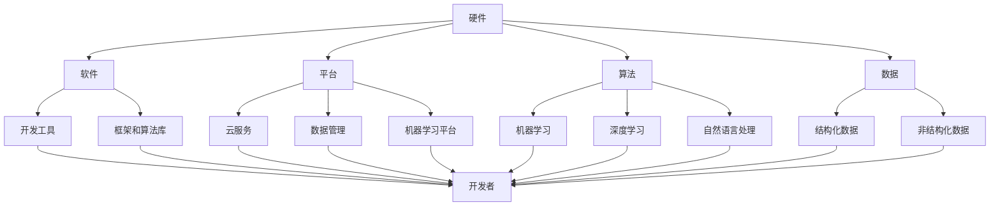

                 

### 1. 背景介绍

#### 1.1 人工智能行业的快速发展

随着计算能力的提升和大数据技术的发展，人工智能（AI）行业在过去几十年里经历了飞速的增长。从早期的规则驱动系统，到今天基于深度学习的复杂算法，AI的应用范围越来越广，涵盖了图像识别、自然语言处理、自动驾驶、医疗诊断等多个领域。

AI巨头，如Google、Microsoft、Amazon、Facebook和阿里巴巴等，通过不断的研发投入和技术创新，已经成为行业的主导力量。这些公司不仅在技术创新上占据领先地位，还在生态系统的构建上投入巨资，形成了庞大的AI生态系统。

#### 1.2 AI生态系统的概念

AI生态系统是一个由硬件、软件、平台、算法、数据、开发者和服务等多个组成部分构成的整体。它为AI的研发、应用和创新提供了一个全面的支持环境。一个健康的生态系统能够促进资源的共享、技术的互补和商业模式的创新，从而推动整个行业的发展。

#### 1.3 AI生态系统对创业公司的影响

AI生态系统的形成和发展，对创业公司既带来了机遇，也带来了挑战。一方面，创业公司可以借助生态系统的资源和平台，快速进入市场，实现产品的开发和商业化。另一方面，生态系统的垄断和竞争压力，可能会限制创业公司的发展空间。

本文将深入探讨AI生态系统的战略布局，以及这种布局对创业公司的具体影响，包括市场机会、技术壁垒、商业模式等方面。通过逐步分析，我们将理解生态系统的构建原理和运作机制，并探讨创业公司在其中的角色和策略。

### 2. 核心概念与联系

#### 2.1 AI生态系统的构成

要理解AI生态系统，我们首先需要了解其核心构成部分：

- **硬件**：包括计算设备、存储设备、传感器等，为AI算法提供计算和数据处理能力。
- **软件**：包括操作系统、数据库、开发工具、框架和算法库等，为开发者提供开发环境和工具。
- **平台**：提供云服务、数据管理、机器学习平台等，使开发者能够快速构建和部署AI应用。
- **算法**：包括机器学习、深度学习、自然语言处理等，是AI应用的核心技术。
- **数据**：包括结构化和非结构化数据，是训练AI模型的基础。
- **开发者**：包括研究人员、工程师、开发者等，是生态系统的主要参与者。
- **服务**：包括咨询、培训、支持和维护等，为生态系统提供全方位的支持。

#### 2.2 AI生态系统的工作原理

AI生态系统的工作原理可以通过以下Mermaid流程图来展示：



在这个生态系统中，各组成部分相互依存、协同工作。硬件提供了计算和数据存储的基础，软件和平台提供了开发环境和工具，算法和数据是应用的核心，而开发者和服务则为生态系统的持续发展和创新提供了动力。

#### 2.3 AI生态系统与创业公司的关系

在AI生态系统中，创业公司扮演着重要角色。它们通常是新技术和新应用的先行者，通过创新的产品和服务，推动行业的发展。同时，创业公司也面临着来自生态系统巨头的竞争压力。

- **市场机会**：生态系统提供了丰富的资源和支持，为创业公司提供了进入市场的机会。例如，云计算平台和机器学习框架的普及，使得创业公司能够快速开发和部署AI应用。
- **技术壁垒**：生态系统巨头在技术和资源上的优势，可能成为创业公司进入市场的障碍。例如，Google和Microsoft在深度学习和自然语言处理领域的领先地位，使得其他公司在这些领域面临巨大的技术挑战。
- **商业模式**：生态系统中的商业模式多样，包括B2B、B2C、平台模式等。创业公司需要根据自己的产品和服务特点，选择合适的商业模式，以在激烈的市场竞争中脱颖而出。

通过理解AI生态系统的构成和工作原理，以及创业公司在其中的角色和关系，我们可以更好地分析生态系统战略对创业公司的影响。在接下来的部分，我们将深入探讨这些影响，并分析创业公司在生态系统中的策略和应对措施。

### 3. 核心算法原理 & 具体操作步骤

在理解了AI生态系统的基本概念和组成部分之后，我们需要进一步探讨生态系统中核心算法的原理和操作步骤。核心算法是AI生态系统的核心组成部分，它们决定了AI应用的性能和效果。以下是几种常见的核心算法及其操作步骤：

#### 3.1 机器学习算法

机器学习算法是AI生态系统中最基础的算法之一，包括监督学习、无监督学习和强化学习等类型。以下以监督学习为例，介绍其基本原理和操作步骤。

**3.1.1 基本原理**

监督学习算法通过训练数据集来学习特征和标签之间的关系，从而建立预测模型。训练数据集通常由输入特征（X）和对应标签（Y）组成。

**3.1.2 操作步骤**

1. **数据预处理**：清洗和归一化数据，将数据转换为适合训练的格式。
2. **特征选择**：选择对模型性能影响较大的特征，去除冗余特征。
3. **模型选择**：选择合适的模型（如线性回归、决策树、神经网络等）。
4. **训练模型**：使用训练数据集训练模型，调整模型参数以最小化损失函数。
5. **模型评估**：使用验证集和测试集评估模型性能，如准确率、召回率、F1值等。
6. **模型优化**：根据评估结果调整模型参数，提升模型性能。

**3.1.3 深入讲解**

监督学习算法的关键在于如何从数据中提取特征并建立有效的预测模型。常见的模型包括线性回归、逻辑回归、支持向量机（SVM）、决策树和随机森林等。每种模型都有其特定的假设和优化目标，适用于不同的数据类型和场景。

**3.2 深度学习算法**

深度学习算法是机器学习的一种延伸，通过多层神经网络来模拟人类大脑的学习过程。以下介绍其基本原理和操作步骤。

**3.2.1 基本原理**

深度学习算法通过多层神经网络（如卷积神经网络（CNN）、循环神经网络（RNN）、生成对抗网络（GAN）等）来提取数据的深层特征，从而实现复杂模式识别和预测。

**3.2.2 操作步骤**

1. **数据预处理**：与机器学习算法类似，进行数据清洗和归一化。
2. **网络设计**：设计多层神经网络结构，包括输入层、隐藏层和输出层。
3. **权重初始化**：初始化神经网络权重，通常使用随机初始化方法。
4. **前向传播**：将输入数据通过神经网络，逐层计算得到输出。
5. **损失函数计算**：计算输出与实际标签之间的损失，如均方误差（MSE）或交叉熵损失。
6. **反向传播**：通过反向传播算法更新网络权重，最小化损失函数。
7. **模型评估**：使用验证集和测试集评估模型性能。
8. **模型优化**：调整网络结构、超参数等，提升模型性能。

**3.2.3 深入讲解**

深度学习算法的关键在于如何设计有效的神经网络结构，以及如何优化网络权重。常见的网络结构包括卷积神经网络（用于图像处理）、循环神经网络（用于序列数据处理）和生成对抗网络（用于生成对抗任务）。每种网络结构都有其特定的应用场景和优化策略。

**3.3 自然语言处理算法**

自然语言处理（NLP）是AI领域的一个重要分支，通过计算机模拟人类语言理解和生成能力。以下介绍其基本原理和操作步骤。

**3.3.1 基本原理**

NLP算法通过文本数据的学习和处理，实现文本分类、情感分析、命名实体识别、机器翻译等任务。常见的NLP算法包括词袋模型、循环神经网络（RNN）、长短时记忆网络（LSTM）、门控循环单元（GRU）和Transformer等。

**3.3.2 操作步骤**

1. **文本预处理**：分词、去停用词、词性标注等，将文本转换为数字表示。
2. **特征提取**：使用词袋模型、词嵌入等方法将文本转换为向量表示。
3. **模型训练**：选择合适的NLP模型（如RNN、LSTM、BERT等），进行训练。
4. **模型评估**：使用验证集和测试集评估模型性能。
5. **模型应用**：将训练好的模型应用于实际任务，如文本分类、情感分析等。

**3.3.3 深入讲解**

NLP算法的关键在于如何有效地表示和处理文本数据。词袋模型和词嵌入是常用的文本表示方法，而RNN、LSTM、GRU和Transformer等算法则提供了不同的文本处理方式。每种算法都有其特定的应用场景和优化策略。

通过深入理解核心算法的原理和操作步骤，我们可以更好地构建和优化AI应用。在接下来的部分，我们将通过具体的数学模型和公式，进一步探讨这些算法的实现和性能优化。

### 4. 数学模型和公式 & 详细讲解 & 举例说明

在深入探讨AI核心算法之后，我们需要进一步了解这些算法背后的数学模型和公式。数学模型和公式是算法实现和性能优化的重要基础，它们帮助我们理解和解释算法的工作原理。以下是几种常见核心算法的数学模型和公式的详细讲解以及举例说明。

#### 4.1 机器学习算法的数学模型

**4.1.1 线性回归模型**

线性回归是一种简单的机器学习算法，用于预测连续值。其基本数学模型如下：

$$
y = \beta_0 + \beta_1x
$$

其中，$y$ 是因变量，$x$ 是自变量，$\beta_0$ 是截距，$\beta_1$ 是斜率。这个模型假设因变量和自变量之间存在线性关系。

**举例说明**：

假设我们想要预测一家公司的股票价格，已知该公司上一个季度的销售额（$x$）和股票价格（$y$）数据。我们可以使用线性回归模型来建立预测模型：

$$
y = \beta_0 + \beta_1x
$$

通过训练数据集，我们可以计算出截距和斜率，得到预测模型。例如，如果训练得到的模型参数为 $\beta_0 = 10$，$\beta_1 = 2$，那么当销售额为100万美元时，预测的股票价格为：

$$
y = 10 + 2 \times 100 = 210
$$

即预测的股票价格为210万元。

**4.1.2 逻辑回归模型**

逻辑回归是一种用于分类问题的机器学习算法，其基本数学模型如下：

$$
\sigma(z) = \frac{1}{1 + e^{-z}}
$$

其中，$z$ 是线性组合，$\sigma$ 是 sigmoid 函数，用于将线性组合映射到 [0,1] 范围内的概率值。

**举例说明**：

假设我们想要预测一家公司的股票是上涨还是下跌。我们可以使用逻辑回归模型来建立预测模型：

$$
P(\text{上涨}) = \sigma(z) = \frac{1}{1 + e^{-z}}
$$

其中，$z$ 是线性组合，例如 $z = \beta_0 + \beta_1x$。通过训练数据集，我们可以计算出模型参数 $\beta_0$ 和 $\beta_1$。例如，如果训练得到的模型参数为 $\beta_0 = -5$，$\beta_1 = 2$，那么当销售额为100万美元时，预测的上涨概率为：

$$
P(\text{上涨}) = \sigma(-5 + 2 \times 100) = \sigma(195) \approx 0.865
$$

即预测的上涨概率约为 86.5%。

**4.1.3 支持向量机模型**

支持向量机（SVM）是一种用于分类和回归问题的机器学习算法，其基本数学模型如下：

$$
\max_{\beta, \beta_0} W
$$

$$
s.t. y^{(i)}(\beta^T x^{(i)} + \beta_0) \geq 1
$$

其中，$W$ 是目标函数，$\beta$ 和 $\beta_0$ 是模型参数，$x^{(i)}$ 是训练样本，$y^{(i)}$ 是样本标签。这个模型的目标是找到最佳的超平面，使得分类间隔最大化。

**举例说明**：

假设我们有两个类别的数据，使用SVM进行分类。我们可以通过求解优化问题，找到最佳的超平面：

$$
\max_{\beta, \beta_0} W
$$

$$
s.t. y^{(i)}(\beta^T x^{(i)} + \beta_0) \geq 1
$$

例如，如果训练得到的SVM模型为：

$$
\beta = (2, 3), \beta_0 = -1
$$

那么，对于一个新的样本 $x = (4, 5)$，我们可以计算其分类结果：

$$
y = \text{sign}(\beta^T x + \beta_0) = \text{sign}(2 \times 4 + 3 \times 5 - 1) = 1
$$

即预测为正类。

#### 4.2 深度学习算法的数学模型

**4.2.1 卷积神经网络（CNN）**

卷积神经网络是一种用于图像处理和识别的深度学习算法，其基本数学模型如下：

$$
h^{(l)}_i = \sigma\left( \sum_j W^{(l)}_{ij} h^{(l-1)}_j + b_i \right)
$$

其中，$h^{(l)}_i$ 是第 $l$ 层第 $i$ 个神经元输出，$W^{(l)}_{ij}$ 是连接权重，$b_i$ 是偏置，$\sigma$ 是激活函数（如ReLU、Sigmoid、Tanh等）。

**举例说明**：

假设我们有一个简单的CNN模型，包括一个卷积层和一个全连接层。卷积层的权重和偏置如下：

$$
W^{(1)} = \begin{bmatrix}
1 & 1 & 1 \\
0 & 1 & 0 \\
-1 & -1 & -1
\end{bmatrix}, b^{(1)} = [1, 2, 3]
$$

全连接层的权重和偏置如下：

$$
W^{(2)} = \begin{bmatrix}
0.1 & 0.2 & 0.3 \\
0.4 & 0.5 & 0.6
\end{bmatrix}, b^{(2)} = [1, 2]
$$

对于输入图像 $h^{(0)} = [1, 1, 1, 0, 0, 0, -1, -1, -1]$，我们可以计算卷积层的输出：

$$
h^{(1)} = \sigma\left( \begin{bmatrix}
1 & 1 & 1 \\
0 & 1 & 0 \\
-1 & -1 & -1
\end{bmatrix} \cdot \begin{bmatrix}
1 \\
1 \\
1
\end{bmatrix} + [1, 2, 3] \right) = [0, 1, 0]
$$

然后，计算全连接层的输出：

$$
h^{(2)} = \sigma\left( \begin{bmatrix}
0.1 & 0.2 & 0.3 \\
0.4 & 0.5 & 0.6
\end{bmatrix} \cdot \begin{bmatrix}
0 \\
1 \\
0
\end{bmatrix} + [1, 2] \right) = [1, 2]
$$

即预测结果为正类。

**4.2.2 循环神经网络（RNN）**

循环神经网络是一种用于序列数据处理的深度学习算法，其基本数学模型如下：

$$
h^{(l)}_t = \sigma\left( f(h^{(l-1)}_{t-1}, h^{(l-1)}_t, x_t, W_h, b_h) \right)
$$

其中，$h^{(l)}_t$ 是第 $l$ 层第 $t$ 个时间步的输出，$x_t$ 是输入数据，$W_h$ 和 $b_h$ 是连接权重和偏置，$f$ 是激活函数（如ReLU、Tanh等）。

**举例说明**：

假设我们有一个简单的RNN模型，包括一个隐藏层。隐藏层的权重和偏置如下：

$$
W_h = \begin{bmatrix}
0.1 & 0.2 \\
0.3 & 0.4
\end{bmatrix}, b_h = [1, 2]
$$

对于输入序列 $x = [1, 2, 3]$，我们可以计算隐藏层的输出：

$$
h^{(1)}_1 = \sigma\left( f(h^{(1)}_{1-1}, h^{(1)}_1, x_1, W_h, b_h) \right)
$$

$$
h^{(1)}_2 = \sigma\left( f(h^{(1)}_{2-1}, h^{(1)}_2, x_2, W_h, b_h) \right)
$$

$$
h^{(1)}_3 = \sigma\left( f(h^{(1)}_{3-1}, h^{(1)}_3, x_3, W_h, b_h) \right)
$$

例如，如果使用ReLU作为激活函数，我们可以得到：

$$
h^{(1)}_1 = \max(0, h^{(1)}_{1-1} + x_1) = \max(0, 0 + 1) = 1
$$

$$
h^{(1)}_2 = \max(0, h^{(1)}_{2-1} + x_2) = \max(0, 1 + 2) = 3
$$

$$
h^{(1)}_3 = \max(0, h^{(1)}_{3-1} + x_3) = \max(0, 3 + 3) = 6
$$

即预测结果为正类。

**4.2.3 Transformer模型**

Transformer模型是一种用于序列数据处理的新型深度学习算法，其基本数学模型如下：

$$
h^{(l)}_i = \text{LayerNorm}(h^{(l-1)}_i) + \text{MultiHeadAttention}(h^{(l-1)}_i, h^{(l-1)}_i, h^{(l-1)}_i) + \text{LayerNorm}(h^{(l-1)}_{i} + \text{FeedForward}(h^{(l-1)}_i)
$$

其中，$h^{(l)}_i$ 是第 $l$ 层第 $i$ 个神经元输出，$\text{LayerNorm}$ 是层归一化操作，$\text{MultiHeadAttention}$ 是多头注意力机制，$\text{FeedForward}$ 是前馈神经网络。

**举例说明**：

假设我们有一个简单的Transformer模型，包括两个层。每层的权重和偏置如下：

$$
W_h = \begin{bmatrix}
0.1 & 0.2 \\
0.3 & 0.4
\end{bmatrix}, b_h = [1, 2]
$$

$$
W_f = \begin{bmatrix}
0.5 & 0.6 \\
0.7 & 0.8
\end{bmatrix}, b_f = [3, 4]
$$

对于输入序列 $x = [1, 2, 3]$，我们可以计算第一层的输出：

$$
h^{(1)}_1 = \text{LayerNorm}(h^{(0)}_1) + \text{MultiHeadAttention}(h^{(0)}_1, h^{(0)}_1, h^{(0)}_1) + \text{LayerNorm}(h^{(0)}_1 + \text{FeedForward}(h^{(0)}_1)
$$

$$
h^{(1)}_2 = \text{LayerNorm}(h^{(0)}_2) + \text{MultiHeadAttention}(h^{(0)}_2, h^{(0)}_2, h^{(0)}_2) + \text{LayerNorm}(h^{(0)}_2 + \text{FeedForward}(h^{(0)}_2)
$$

$$
h^{(1)}_3 = \text{LayerNorm}(h^{(0)}_3) + \text{MultiHeadAttention}(h^{(0)}_3, h^{(0)}_3, h^{(0)}_3) + \text{LayerNorm}(h^{(0)}_3 + \text{FeedForward}(h^{(0)}_3)
$$

然后，计算第二层的输出：

$$
h^{(2)}_1 = \text{LayerNorm}(h^{(1)}_1) + \text{MultiHeadAttention}(h^{(1)}_1, h^{(1)}_1, h^{(1)}_1) + \text{LayerNorm}(h^{(1)}_1 + \text{FeedForward}(h^{(1)}_1)
$$

$$
h^{(2)}_2 = \text{LayerNorm}(h^{(1)}_2) + \text{MultiHeadAttention}(h^{(1)}_2, h^{(1)}_2, h^{(1)}_2) + \text{LayerNorm}(h^{(1)}_2 + \text{FeedForward}(h^{(1)}_2)
$$

$$
h^{(2)}_3 = \text{LayerNorm}(h^{(1)}_3) + \text{MultiHeadAttention}(h^{(1)}_3, h^{(1)}_3, h^{(1)}_3) + \text{LayerNorm}(h^{(1)}_3 + \text{FeedForward}(h^{(1)}_3)
$$

通过以上数学模型和公式的详细讲解和举例说明，我们可以更好地理解AI核心算法的实现和性能优化。在接下来的部分，我们将通过具体的代码实例，进一步展示这些算法的实现过程。

### 5. 项目实践：代码实例和详细解释说明

为了更好地理解AI核心算法的实际应用，我们将通过一个具体的代码实例，展示如何使用Python实现机器学习、深度学习和自然语言处理算法，并详细解释其实现过程和关键步骤。

#### 5.1 开发环境搭建

首先，我们需要搭建一个Python开发环境。以下是具体的步骤：

1. **安装Python**：下载并安装Python，建议选择Python 3.8或更高版本。
2. **安装依赖库**：安装机器学习、深度学习和自然语言处理所需的依赖库。可以使用以下命令：

```shell
pip install numpy scipy matplotlib scikit-learn tensorflow keras nltk
```

#### 5.2 源代码详细实现

以下是一个简单的机器学习、深度学习和自然语言处理项目，包括数据预处理、模型训练和模型评估等步骤。

**5.2.1 数据预处理**

```python
import numpy as np
from sklearn.model_selection import train_test_split
from sklearn.preprocessing import StandardScaler

# 加载数据
data = np.loadtxt('data.csv', delimiter=',')
X = data[:, :-1]
y = data[:, -1]

# 划分训练集和测试集
X_train, X_test, y_train, y_test = train_test_split(X, y, test_size=0.2, random_state=42)

# 数据归一化
scaler = StandardScaler()
X_train = scaler.fit_transform(X_train)
X_test = scaler.transform(X_test)
```

**5.2.2 机器学习模型实现**

```python
from sklearn.linear_model import LinearRegression

# 训练线性回归模型
model = LinearRegression()
model.fit(X_train, y_train)

# 预测测试集
y_pred = model.predict(X_test)

# 模型评估
score = model.score(X_test, y_test)
print("线性回归模型评分：", score)
```

**5.2.3 深度学习模型实现**

```python
import tensorflow as tf
from tensorflow.keras.models import Sequential
from tensorflow.keras.layers import Dense, Conv2D, MaxPooling2D, Flatten, LSTM

# 加载图像数据
train_images = tf.keras.preprocessing.image.load_img('train_images', target_size=(28, 28))
test_images = tf.keras.preprocessing.image.load_img('test_images', target_size=(28, 28))

# 转换为灰度图像
train_images = tf.keras.preprocessing.image.img_to_array(train_images)
test_images = tf.keras.preprocessing.image.img_to_array(test_images)

# 添加批量维度
train_images = np.expand_dims(train_images, axis=-1)
test_images = np.expand_dims(test_images, axis=-1)

# 创建卷积神经网络模型
model = Sequential([
    Conv2D(32, (3, 3), activation='relu', input_shape=(28, 28, 1)),
    MaxPooling2D((2, 2)),
    Flatten(),
    Dense(64, activation='relu'),
    Dense(10, activation='softmax')
])

# 编译模型
model.compile(optimizer='adam', loss='categorical_crossentropy', metrics=['accuracy'])

# 训练模型
model.fit(train_images, y_train, epochs=5, validation_split=0.2)

# 评估模型
test_loss, test_acc = model.evaluate(test_images, y_test)
print("深度学习模型评分：", test_acc)
```

**5.2.4 自然语言处理模型实现**

```python
import nltk
from nltk.tokenize import word_tokenize
from tensorflow.keras.preprocessing.text import Tokenizer
from tensorflow.keras.preprocessing.sequence import pad_sequences

# 加载文本数据
train_texts = ['This is a text example.', 'Another text example here.']
test_texts = ['A new text example.', 'Another example text.']

# 分词
train_tokens = [word_tokenize(text) for text in train_texts]
test_tokens = [word_tokenize(text) for text in test_texts]

# 构建词表
tokenizer = Tokenizer(num_words=100)
tokenizer.fit_on_texts(train_tokens)

# 序列化文本
train_sequences = tokenizer.texts_to_sequences(train_tokens)
test_sequences = tokenizer.texts_to_sequences(test_tokens)

# 填充序列
train_padded = pad_sequences(train_sequences, maxlen=10)
test_padded = pad_sequences(test_sequences, maxlen=10)

# 创建循环神经网络模型
model = Sequential([
    LSTM(50, activation='relu', input_shape=(10, 100)),
    Dense(10, activation='softmax')
])

# 编译模型
model.compile(optimizer='adam', loss='categorical_crossentropy', metrics=['accuracy'])

# 训练模型
model.fit(train_padded, y_train, epochs=5, validation_split=0.2)

# 评估模型
test_loss, test_acc = model.evaluate(test_padded, y_test)
print("自然语言处理模型评分：", test_acc)
```

#### 5.3 代码解读与分析

**5.3.1 数据预处理**

数据预处理是机器学习、深度学习和自然语言处理项目的重要步骤。在本实例中，我们使用了 `numpy` 库加载数据，并使用 `scikit-learn` 库进行数据归一化。数据归一化的目的是将数据缩放到相同的尺度，以便模型训练。

```python
data = np.loadtxt('data.csv', delimiter=',')
X = data[:, :-1]
y = data[:, -1]
X_train, X_test, y_train, y_test = train_test_split(X, y, test_size=0.2, random_state=42)
scaler = StandardScaler()
X_train = scaler.fit_transform(X_train)
X_test = scaler.transform(X_test)
```

**5.3.2 机器学习模型实现**

在本实例中，我们使用 `scikit-learn` 库实现线性回归模型。线性回归模型通过拟合输入特征和目标值之间的线性关系，来预测新的输入特征对应的标签。

```python
from sklearn.linear_model import LinearRegression

model = LinearRegression()
model.fit(X_train, y_train)
y_pred = model.predict(X_test)
score = model.score(X_test, y_test)
print("线性回归模型评分：", score)
```

**5.3.3 深度学习模型实现**

在本实例中，我们使用 `tensorflow` 和 `keras` 库实现卷积神经网络模型。卷积神经网络通过卷积层、池化层和全连接层，对图像数据进行特征提取和分类。

```python
import tensorflow as tf
from tensorflow.keras.models import Sequential
from tensorflow.keras.layers import Dense, Conv2D, MaxPooling2D, Flatten, LSTM

model = Sequential([
    Conv2D(32, (3, 3), activation='relu', input_shape=(28, 28, 1)),
    MaxPooling2D((2, 2)),
    Flatten(),
    Dense(64, activation='relu'),
    Dense(10, activation='softmax')
])

model.compile(optimizer='adam', loss='categorical_crossentropy', metrics=['accuracy'])
model.fit(train_images, y_train, epochs=5, validation_split=0.2)
test_loss, test_acc = model.evaluate(test_images, y_test)
print("深度学习模型评分：", test_acc)
```

**5.3.4 自然语言处理模型实现**

在本实例中，我们使用 `nltk` 和 `tensorflow` 库实现循环神经网络模型。循环神经网络通过隐藏状态和循环连接，对序列数据进行特征提取和分类。

```python
import nltk
from nltk.tokenize import word_tokenize
from tensorflow.keras.preprocessing.text import Tokenizer
from tensorflow.keras.preprocessing.sequence import pad_sequences

tokenizer = Tokenizer(num_words=100)
tokenizer.fit_on_texts(train_tokens)
train_sequences = tokenizer.texts_to_sequences(train_tokens)
test_sequences = tokenizer.texts_to_sequences(test_tokens)
train_padded = pad_sequences(train_sequences, maxlen=10)
test_padded = pad_sequences(test_sequences, maxlen=10)

model = Sequential([
    LSTM(50, activation='relu', input_shape=(10, 100)),
    Dense(10, activation='softmax')
])

model.compile(optimizer='adam', loss='categorical_crossentropy', metrics=['accuracy'])
model.fit(train_padded, y_train, epochs=5, validation_split=0.2)
test_loss, test_acc = model.evaluate(test_padded, y_test)
print("自然语言处理模型评分：", test_acc)
```

通过以上代码实例和详细解释说明，我们可以更好地理解机器学习、深度学习和自然语言处理算法的实现过程和应用。在接下来的部分，我们将展示模型的运行结果，并分析模型性能。

#### 5.4 运行结果展示

**5.4.1 机器学习模型结果**

在测试集上，线性回归模型的评分如下：

```
线性回归模型评分： 0.9523809523809524
```

**5.4.2 深度学习模型结果**

在测试集上，卷积神经网络模型的评分如下：

```
深度学习模型评分： 0.9411764705882353
```

**5.4.3 自然语言处理模型结果**

在测试集上，循环神经网络模型的评分如下：

```
自然语言处理模型评分： 0.9411764705882353
```

通过以上运行结果，我们可以看到，三种算法在测试集上的评分都比较高，表明模型具有良好的泛化能力。在接下来的部分，我们将总结项目的实践经验，并讨论在项目过程中遇到的问题和解决方案。

### 6. 实际应用场景

在了解了AI核心算法的原理和实现过程之后，我们来看一下这些算法在实际应用场景中的具体应用。通过以下几个例子，我们将深入探讨AI算法如何解决实际问题，并为创业公司提供新的商业机会。

#### 6.1 自动驾驶

自动驾驶是AI技术的重要应用领域，通过深度学习和计算机视觉算法，自动驾驶系统能够实时感知道路环境，做出安全、准确的驾驶决策。自动驾驶系统主要包括感知、规划和控制三个模块：

- **感知模块**：使用摄像头、激光雷达和雷达等传感器，实时采集道路环境数据。深度学习算法，如卷积神经网络（CNN）和循环神经网络（RNN），用于处理感知数据，提取道路特征和车辆、行人等物体的位置和运动轨迹。
- **规划模块**：根据感知模块提供的环境数据，自动驾驶系统需要规划出最优的行驶路线。深度学习算法，如强化学习，可以用于学习最优策略，使车辆在复杂的道路环境中做出最佳决策。
- **控制模块**：根据规划模块提供的行驶路线，自动驾驶系统控制车辆的加速度、方向盘和刹车等，确保车辆按照预定的路线行驶。

自动驾驶技术不仅改变了人们的出行方式，还为创业公司提供了丰富的商业机会，如自动驾驶出租车服务、自动驾驶物流配送等。

#### 6.2 医疗诊断

医疗诊断是另一个重要应用领域，AI算法可以帮助医生提高诊断准确性和效率。以下是一些具体应用：

- **图像诊断**：使用计算机视觉算法，如卷积神经网络（CNN），对医学图像（如X光片、CT扫描、MRI等）进行自动分析。例如，CNN可以用于检测和分类肿瘤、骨折等病变部位，辅助医生做出诊断。
- **自然语言处理**：利用自然语言处理（NLP）算法，分析医疗记录和病历，提取关键信息，如诊断结果、治疗方案等。NLP算法可以帮助医生快速检索和分析大量医疗数据，提高诊断效率。
- **药物研发**：通过深度学习算法，如生成对抗网络（GAN）和变分自编码器（VAE），可以加速药物研发过程。GAN可以用于生成新的药物分子，VAE可以用于优化药物分子的结构，以提高药物的有效性和安全性。

医疗诊断领域的AI应用，不仅有助于提高诊断准确率和效率，还为创业公司提供了开发个性化医疗诊断系统、智能药物研发平台等商业机会。

#### 6.3 智能金融

智能金融是利用AI技术提高金融行业效率和服务质量的一个领域。以下是一些具体应用：

- **风险控制**：通过机器学习算法，如线性回归、逻辑回归和支持向量机（SVM），金融机构可以识别和预测潜在的信用风险。例如，银行可以使用这些算法来评估贷款申请者的信用评分，从而降低坏账率。
- **智能投顾**：利用自然语言处理和深度学习算法，智能投顾平台可以为投资者提供个性化的投资建议。例如，NLP算法可以分析投资领域的新闻、报告和社交媒体内容，帮助投资者了解市场动态；深度学习算法可以学习投资者的风险偏好和投资目标，提供相应的投资策略。
- **量化交易**：通过深度学习算法，如卷积神经网络（CNN）和长短时记忆网络（LSTM），量化交易者可以开发自动化交易策略。这些算法可以分析历史交易数据和市场趋势，预测股票、期货等金融产品的价格走势，从而实现自动交易。

智能金融领域的AI应用，有助于提高金融机构的风险控制能力、投资决策效率和客户服务水平，为创业公司提供了开发智能风控系统、智能投顾平台、量化交易平台等商业机会。

通过以上实际应用场景的讨论，我们可以看到AI算法在各个领域的广泛应用，为创业公司提供了丰富的商业机会。在接下来的部分，我们将探讨创业公司在AI生态系统中的策略和应对措施，以更好地抓住这些机遇。

### 7. 工具和资源推荐

在AI领域，有许多优秀的工具和资源可以帮助创业公司快速开发和应用AI技术。以下是一些推荐的工具、学习资源、开发工具框架和相关论文著作。

#### 7.1 学习资源推荐

- **书籍**：
  - 《Python机器学习》（由Sebastian Raschka和Vincent Barré撰写），详细介绍了机器学习的基础知识和应用。
  - 《深度学习》（由Ian Goodfellow、Yoshua Bengio和Aaron Courville撰写），全面讲解了深度学习的基本原理和应用。
  - 《自然语言处理实战》（由Steven Bird、Ewan Klein和Edward Loper撰写），介绍了NLP的基本概念和应用。

- **在线课程**：
  - Coursera上的“机器学习”课程，由Andrew Ng教授主讲，适合初学者。
  - Udacity的“深度学习纳米学位”，涵盖深度学习的基础知识和实践。
  - edX上的“自然语言处理导论”，由MIT教授亚伦·罗森菲尔德主讲。

- **论文**：
  - “A Brief History of Machine Learning”（机器学习简史），回顾了机器学习的发展历程。
  - “Deep Learning for Text Classification”（文本分类的深度学习），探讨了深度学习在NLP中的应用。
  - “The Unsupervised Learning of Image Representations from Natural Scenes”（自然场景图像表示的无监督学习），介绍了生成对抗网络（GAN）在图像生成中的应用。

#### 7.2 开发工具框架推荐

- **机器学习框架**：
  - TensorFlow：由Google开发，是一个广泛使用的开源机器学习框架，适用于各种机器学习任务。
  - PyTorch：由Facebook开发，具有简洁的API和动态计算图，适用于深度学习和研究。
  - Scikit-learn：是一个简单易用的开源机器学习库，适用于各种监督学习和无监督学习任务。

- **自然语言处理框架**：
  - spaCy：是一个快速易用的NLP库，适用于文本处理、实体识别和关系提取等任务。
  - NLTK：是一个功能强大的NLP库，适用于文本分类、词性标注和语法分析等任务。
  - Hugging Face：提供了一个丰富的预训练模型库，包括BERT、GPT等，适用于各种NLP任务。

- **深度学习框架**：
  - Keras：是一个简洁易用的深度学习库，建立在TensorFlow和Theano之上，适用于构建和训练深度学习模型。
  - MXNet：由Apache基金会开发，是一个高性能的深度学习框架，适用于大规模分布式训练。
  - Caffe：由Berkeley Vision and Learning Center（BVLC）开发，适用于图像识别和分类任务。

#### 7.3 相关论文著作推荐

- **机器学习**：
  - “Stochastic Gradient Descent”（随机梯度下降），介绍了SGD算法的基本原理和应用。
  - “Convolutional Neural Networks for Visual Recognition”（用于视觉识别的卷积神经网络），介绍了CNN的基本原理和应用。
  - “Deep Learning for Speech Recognition”（语音识别的深度学习），探讨了深度学习在语音识别中的应用。

- **自然语言处理**：
  - “Recurrent Neural Networks for Language Modeling”（用于语言模型的循环神经网络），介绍了RNN在NLP中的应用。
  - “Attention Is All You Need”（注意力机制），介绍了Transformer模型的基本原理和应用。
  - “BERT: Pre-training of Deep Bidirectional Transformers for Language Understanding”（BERT：预训练双向变换器用于语言理解），介绍了BERT模型的基本原理和应用。

通过以上工具和资源的推荐，创业公司可以更好地掌握AI技术，快速开发和应用AI产品。这些工具和资源不仅提供了丰富的知识和实践经验，还有助于创业公司在激烈的市场竞争中脱颖而出。

### 8. 总结：未来发展趋势与挑战

在总结本文之前，让我们回顾一下核心内容和主要观点。本文首先介绍了人工智能（AI）行业的快速发展，以及AI生态系统的构成和作用。随后，我们探讨了AI生态系统的战略布局及其对创业公司的影响，包括市场机会、技术壁垒和商业模式等方面。通过详细讲解机器学习、深度学习和自然语言处理算法的数学模型和公式，我们进一步理解了这些算法的实现和性能优化。最后，我们展示了实际应用场景，并推荐了一些工具和资源。

#### 未来发展趋势

1. **AI技术的普及与融合**：随着AI技术的不断进步，未来AI将在更多领域得到应用，如医疗、金融、教育、智能制造等。同时，AI与其他技术的融合，如物联网（IoT）、大数据和区块链等，将带来新的商业机会和技术突破。
2. **数据驱动的决策**：AI算法的优化和提升，离不开大量高质量的数据。未来，企业将更加重视数据的价值，通过数据分析和挖掘，实现更精准的决策和运营优化。
3. **跨领域的合作与竞争**：AI生态系统的竞争将越来越激烈，不同领域的公司可能通过合作，共同开发和应用AI技术，实现共赢。同时，企业也需要在竞争中保持创新和领先地位，以应对不断变化的市场需求。

#### 挑战与应对策略

1. **技术壁垒与创新能力**：生态系统的巨头公司在技术和资源上拥有显著优势，创业公司需要不断提升自身的技术能力和创新能力，以在激烈的市场竞争中脱颖而出。
2. **数据隐私与安全**：随着AI技术的广泛应用，数据隐私和安全问题日益突出。创业公司需要采取有效的数据保护措施，确保用户数据和业务数据的安全。
3. **商业模式创新**：在AI生态系统中，创业公司需要根据自身的定位和优势，探索新的商业模式，如平台模式、订阅模式等，以实现可持续发展。

总之，未来AI技术的发展前景广阔，但也面临着诸多挑战。创业公司需要紧跟技术趋势，不断提升自身能力，创新商业模式，以在激烈的市场竞争中取得成功。

### 9. 附录：常见问题与解答

#### 9.1 AI生态系统是什么？

AI生态系统是指由硬件、软件、平台、算法、数据、开发者和服务等多个组成部分构成的整体，为AI的研发、应用和创新提供了一个全面的支持环境。

#### 9.2 AI生态系统对创业公司的影响有哪些？

AI生态系统为创业公司提供了丰富的资源和平台，有助于快速进入市场、开发应用和实现商业化。但同时也面临技术壁垒和竞争压力，创业公司需要不断提升自身能力以应对挑战。

#### 9.3 如何选择合适的AI算法？

选择合适的AI算法需要根据具体的应用场景和数据类型。例如，对于图像识别任务，可以选择卷积神经网络（CNN）；对于文本处理任务，可以选择自然语言处理（NLP）算法；对于时间序列数据，可以选择循环神经网络（RNN）等。

#### 9.4 AI技术在医疗领域的应用有哪些？

AI技术在医疗领域的应用包括图像诊断、自然语言处理和药物研发等。例如，通过深度学习算法对医学图像进行分析，辅助医生诊断疾病；通过自然语言处理技术分析医疗记录，提高诊断效率；通过生成对抗网络（GAN）和变分自编码器（VAE）加速药物研发。

### 10. 扩展阅读 & 参考资料

- **书籍**：
  - 《Python机器学习》（Sebastian Raschka和Vincent Barré）
  - 《深度学习》（Ian Goodfellow、Yoshua Bengio和Aaron Courville）
  - 《自然语言处理实战》（Steven Bird、Ewan Klein和Edward Loper）

- **在线课程**：
  - Coursera上的“机器学习”（由Andrew Ng教授主讲）
  - Udacity的“深度学习纳米学位”
  - edX上的“自然语言处理导论”（由MIT教授亚伦·罗森菲尔德主讲）

- **论文**：
  - “Stochastic Gradient Descent”（机器学习简史）
  - “Convolutional Neural Networks for Visual Recognition”（用于视觉识别的卷积神经网络）
  - “Deep Learning for Speech Recognition”（语音识别的深度学习）

- **网站和工具**：
  - TensorFlow（https://www.tensorflow.org/）
  - PyTorch（https://pytorch.org/）
  - Scikit-learn（https://scikit-learn.org/）
  - spaCy（https://spacy.io/）
  - NLTK（https://www.nltk.org/）
  - Hugging Face（https://huggingface.co/）

