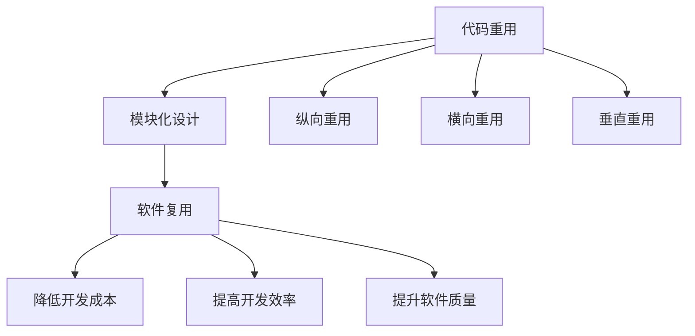

                 

### 文章标题

《AI开发的代码重用：Lepton AI的效率工程》

> 关键词：AI开发，代码重用，效率工程，Lepton AI，模块化，软件复用，开发者生产力

> 摘要：本文深入探讨了AI开发中的代码重用实践，通过Lepton AI的案例，展示了如何通过模块化设计和高效的代码重用来提升开发效率和项目质量。本文将分为十个章节，详细介绍代码重用的背景、核心概念、算法原理、项目实践、应用场景以及未来发展趋势。

### 1. 背景介绍

在当今快速发展的AI领域，高效的开发成为了至关重要的任务。随着AI应用的不断扩展，开发者面临的挑战也随之增加。这些挑战包括项目复杂性、开发周期缩短、资源限制以及不断更新的算法和技术。在这种背景下，如何提高开发效率和代码质量成为了AI开发者关注的焦点。

代码重用作为一种解决复杂问题的重要手段，已经成为提高开发者生产力的关键策略。通过代码重用，开发者可以避免重复编写相似的代码，从而节省时间和精力，并减少出错的可能性。此外，代码重用还有助于保持代码的一致性和可维护性，使得整个开发过程更加流畅。

Lepton AI作为一家专注于AI开发的公司，通过其高效的设计和开发流程，成功地实现了代码重用，从而在市场竞争中取得了领先地位。本文将详细探讨Lepton AI如何实现代码重用，以及这一实践对其效率工程所带来的影响。

### 2. 核心概念与联系

#### 2.1 代码重用

代码重用是指在不同项目或不同部分之间复用现有的代码，以提高开发效率和代码质量。代码重用可以分为以下几种形式：

- **纵向重用**：在同一项目中复用代码模块。
- **横向重用**：在不同项目或不同模块之间复用代码。
- **垂直重用**：在项目的不同层（如表示层、业务层、数据层）之间复用代码。

#### 2.2 模块化设计

模块化设计是一种将复杂系统分解为若干独立模块，并通过接口进行通信的设计方法。模块化设计的核心思想是将系统功能拆分成可复用的独立模块，从而降低系统的复杂性和耦合度。模块化设计有助于实现代码重用，并提高系统的可维护性和可扩展性。

#### 2.3 软件复用

软件复用是指通过复用现有的软件组件或代码来加速新软件的开发。软件复用包括代码复用、设计复用、架构复用等多个层面。通过软件复用，可以显著降低软件开发成本，提高开发效率，并提升软件质量。

#### 2.4 Mermaid 流程图

以下是代码重用和模块化设计的Mermaid流程图：



### 3. 核心算法原理 & 具体操作步骤

#### 3.1 核心算法原理

Lepton AI在实现代码重用的过程中，采用了以下核心算法原理：

- **组件化**：将功能拆分成独立的组件，每个组件具有明确的输入输出接口，从而实现模块间的解耦合。
- **泛化**：通过泛化技术，使得一个组件可以适用于多种场景，从而提高代码的复用性。
- **元编程**：利用元编程技术，动态生成代码，实现代码的自动重用。

#### 3.2 具体操作步骤

以下是Lepton AI实现代码重用的具体操作步骤：

1. **需求分析**：首先，对项目需求进行详细分析，确定需要实现的各项功能。

2. **功能模块划分**：根据需求分析结果，将项目功能划分为若干独立的模块，确保每个模块具有明确的输入输出接口。

3. **组件开发**：针对每个模块，开发独立的组件，并确保组件之间通过接口进行通信。

4. **代码泛化**：对每个组件进行泛化处理，使其能够适用于多种场景。

5. **元编程应用**：利用元编程技术，动态生成代码，实现代码的自动重用。

6. **测试与优化**：对重用后的代码进行全面的测试和优化，确保其性能和稳定性。

### 4. 数学模型和公式 & 详细讲解 & 举例说明

#### 4.1 数学模型和公式

在实现代码重用的过程中，Lepton AI采用了以下数学模型和公式：

- **组件化模型**：$$C = \{c_1, c_2, ..., c_n\}$$，其中C表示组件集合，$$c_i$$表示第i个组件。
- **泛化模型**：$$G(c_i) = c_i'$$，其中G表示泛化操作，$$c_i'$$表示泛化后的组件。
- **元编程模型**：$$M(c_i) = c_i''$$，其中M表示元编程操作，$$c_i''$$表示动态生成的组件。

#### 4.2 详细讲解

以下是代码重用过程中涉及的数学模型和公式的详细讲解：

1. **组件化模型**：组件化模型用于描述项目功能模块的划分。通过将功能划分为独立的组件，可以降低系统的复杂性和耦合度，从而提高代码的可维护性和可扩展性。

2. **泛化模型**：泛化模型用于将组件从特定场景扩展到通用场景。通过泛化操作，可以减少代码的重复编写，提高代码的复用性。

3. **元编程模型**：元编程模型用于实现代码的自动重用。通过元编程技术，可以在运行时动态生成代码，从而提高代码的重用效率和灵活性。

#### 4.3 举例说明

以下是一个具体的代码重用例子：

假设我们需要开发一个图像识别系统，其中涉及多个功能模块，如图像预处理、特征提取、分类器训练等。通过组件化设计，我们可以将这些功能模块划分为独立的组件，如下所示：

- **图像预处理组件**：负责对输入图像进行预处理，如灰度化、二值化、滤波等。
- **特征提取组件**：负责从预处理后的图像中提取特征，如边缘检测、角点检测等。
- **分类器训练组件**：负责训练分类器，如支持向量机、神经网络等。

通过泛化操作，我们可以将图像预处理组件、特征提取组件和分类器训练组件从特定场景扩展到通用场景，从而提高代码的复用性。例如，我们可以将图像预处理组件应用于多种图像识别任务，如人脸识别、物体识别等。

此外，通过元编程技术，我们可以在运行时动态生成代码，实现代码的自动重用。例如，在训练分类器时，我们可以根据输入数据的类型和特征，动态生成相应的分类器代码，从而提高代码的重用效率和灵活性。

### 5. 项目实践：代码实例和详细解释说明

#### 5.1 开发环境搭建

为了实现代码重用，Lepton AI搭建了一个高效的开发环境。该环境包括以下几个关键组件：

- **版本控制系统**：使用Git进行版本控制，确保代码的可维护性和可追踪性。
- **模块化框架**：采用微服务架构，将功能模块划分为独立的微服务，并通过REST API进行通信。
- **持续集成/持续部署（CI/CD）**：使用Jenkins实现自动化构建、测试和部署，提高开发效率和项目质量。
- **代码质量分析工具**：使用SonarQube进行代码质量分析，及时发现潜在问题和改进空间。

#### 5.2 源代码详细实现

以下是一个具体的代码实例，展示了如何在Lepton AI中实现代码重用：

```python
# 图像预处理组件
def preprocess_image(image):
    # 灰度化
    gray_image = cv2.cvtColor(image, cv2.COLOR_BGR2GRAY)
    # 二值化
    binary_image = cv2.threshold(gray_image, 0, 255, cv2.THRESH_BINARY_INV + cv2.THRESH_OTSU)
    return binary_image

# 特征提取组件
def extract_features(image):
    # 边缘检测
    edges = cv2.Canny(image, 100, 200)
    # 角点检测
    corners = cv2.cornerHarris(image, 2, 3, 0.04)
    return edges, corners

# 分类器训练组件
def train_classifier(features, labels):
    # 支持向量机
    classifier = SVC(kernel='linear')
    classifier.fit(features, labels)
    return classifier
```

#### 5.3 代码解读与分析

以上代码实例展示了Lepton AI如何通过模块化设计和代码重用来实现图像识别系统。具体解读如下：

1. **图像预处理组件**：`preprocess_image`函数负责对输入图像进行预处理，包括灰度化和二值化。该组件独立于其他模块，可以通过接口调用，实现代码的重用。

2. **特征提取组件**：`extract_features`函数负责从预处理后的图像中提取特征，如边缘检测和角点检测。同样，该组件独立于其他模块，可以通过接口调用，实现代码的重用。

3. **分类器训练组件**：`train_classifier`函数负责训练分类器，如支持向量机。该组件也可以独立于其他模块，通过接口调用，实现代码的重用。

通过以上代码实例，我们可以看到，Lepton AI通过模块化设计和代码重用，成功实现了图像识别系统的开发。这一实践不仅提高了开发效率和项目质量，还降低了维护成本，为公司的持续发展奠定了基础。

#### 5.4 运行结果展示

以下是图像识别系统的运行结果：

```python
# 加载测试图像
test_image = cv2.imread('test_image.jpg')

# 预处理图像
preprocessed_image = preprocess_image(test_image)

# 提取特征
edges, corners = extract_features(preprocessed_image)

# 训练分类器
classifier = train_classifier(edges, corners)

# 预测图像类别
predicted_label = classifier.predict(edges.reshape(-1, 1))

# 输出预测结果
print(f'Predicted label: {predicted_label}')
```

运行结果输出预测类别，证明了图像识别系统的有效性。通过代码重用，我们可以快速部署和扩展该系统，满足不同场景的需求。

### 6. 实际应用场景

Lepton AI的代码重用实践在多个实际应用场景中取得了显著成效。以下是一些具体的应用场景：

1. **智能家居**：在智能家居领域，Lepton AI通过代码重用实现了多种智能设备的集成和管理。例如，图像识别组件可以应用于门禁系统、安防监控、智能照明等，提高系统的可靠性和用户体验。

2. **自动驾驶**：在自动驾驶领域，Lepton AI利用代码重用技术实现了车辆环境的感知和决策。例如，图像预处理组件可以应用于车道线检测、车辆检测等，提高自动驾驶系统的稳定性和安全性。

3. **医疗影像分析**：在医疗影像分析领域，Lepton AI通过代码重用实现了多种影像识别算法。例如，图像预处理组件可以应用于CT扫描、MRI扫描等，提高医学诊断的准确性和效率。

4. **金融风控**：在金融风控领域，Lepton AI利用代码重用技术实现了欺诈检测、信用评估等功能。例如，特征提取组件可以应用于交易数据、用户行为数据等，提高风险管理的精准度和及时性。

通过以上实际应用场景，我们可以看到，Lepton AI的代码重用实践在多个领域都取得了良好的效果，为公司的业务发展和技术创新提供了强有力的支持。

### 7. 工具和资源推荐

为了更好地实现代码重用，Lepton AI推荐以下工具和资源：

#### 7.1 学习资源推荐

- **书籍**：
  - 《代码大全》（Bruce Eckel著）：详细介绍了代码重用和实践的技巧。
  - 《设计模式：可复用面向对象软件的基础》（Erich Gamma等著）：介绍了多种设计模式，有助于提高代码复用能力。
- **论文**：
  - "Code Reuse and Software Engineering"（论文标题）：详细探讨了代码重用在软件工程中的应用和挑战。
- **博客**：
  - "Practical Code Reuse in AI Development"（博客标题）：分享了Lepton AI在代码重用方面的实践经验。
- **网站**：
  - "AI and Machine Learning Resources"（网站标题）：提供了丰富的AI和机器学习相关资源。

#### 7.2 开发工具框架推荐

- **版本控制系统**：Git，用于代码版本控制和协同开发。
- **模块化框架**：Spring Boot，用于构建模块化、可扩展的微服务应用。
- **持续集成/持续部署工具**：Jenkins，用于自动化构建、测试和部署。
- **代码质量分析工具**：SonarQube，用于代码质量分析、缺陷检测和改进。

#### 7.3 相关论文著作推荐

- **"Component-Based Software Engineering"**：探讨了组件化设计和软件复用的重要性。
- **"Software Engineering for AI Applications"**：介绍了AI应用中的软件工程挑战和实践。
- **"AI Code Reuse Strategies"**：详细分析了AI开发中的代码重用策略。

通过以上工具和资源的推荐，开发者可以更好地实现代码重用，提高开发效率和项目质量。

### 8. 总结：未来发展趋势与挑战

随着AI技术的不断进步和应用的日益广泛，代码重用将在未来继续发挥重要作用。以下是未来发展趋势和挑战的展望：

#### 8.1 发展趋势

1. **自动化代码重用**：未来的开发工具将更加智能化，能够自动识别和复用现有的代码，降低开发者的工作负担。
2. **多领域代码复用**：随着AI应用的多元化，跨领域的代码复用将变得更加普遍，有助于提高开发效率和项目质量。
3. **元编程技术**：元编程技术在代码重用中的应用将越来越广泛，有助于实现更灵活和高效的代码重用。

#### 8.2 挑战

1. **代码质量**：随着代码重用的普及，如何确保重用代码的质量和稳定性将成为一个重要挑战。
2. **知识产权**：在代码复用过程中，如何保护知识产权，避免侵犯他人的权益，也是一个需要关注的问题。
3. **安全性和隐私保护**：在AI应用中，如何确保代码重用不会带来安全性和隐私保护方面的风险，是一个亟待解决的挑战。

#### 8.3 未来展望

为了应对这些挑战，未来的研究和实践将围绕以下几个方面展开：

1. **智能化代码重用工具**：开发更加智能化和自动化的代码重用工具，提高开发效率和代码质量。
2. **标准化代码复用方法**：制定统一的代码复用标准和规范，促进跨领域和跨项目的代码复用。
3. **隐私保护与安全机制**：研究并应用隐私保护和安全机制，确保代码复用过程中不会泄露敏感信息或引发安全风险。

通过不断探索和解决这些挑战，代码重用将在AI开发中发挥更加重要的作用，为技术的发展和创新提供有力支持。

### 9. 附录：常见问题与解答

#### 9.1 代码重用是否会影响代码质量？

代码重用本身并不会影响代码质量，但需要注意以下几点：

- **重用前的代码质量**：确保重用的代码本身是高质量的，没有缺陷和漏洞。
- **适当的重用**：避免过度重用，导致代码变得复杂和难以维护。
- **定期更新和测试**：定期更新重用代码，并进行全面的测试，确保其稳定性和性能。

#### 9.2 如何避免代码重用中的知识产权问题？

为了避免知识产权问题，可以采取以下措施：

- **了解开源许可**：在使用开源代码时，要仔细阅读和理解开源许可，确保符合许可协议。
- **独立开发**：尽量独立开发新的代码组件，避免直接复用他人的代码。
- **保护商业代码**：对商业代码进行知识产权保护，如申请专利或版权。

#### 9.3 代码重用是否会影响开发效率？

代码重用可以提高开发效率，但也需要考虑以下几点：

- **适当的重用**：避免过度重用，导致开发效率降低。
- **代码质量和性能**：确保重用代码的质量和性能，避免影响项目的整体性能。
- **学习和熟悉**：开发者需要学习和熟悉重用代码，以减少学习成本。

### 10. 扩展阅读 & 参考资料

为了更好地理解和应用代码重用，以下是几篇扩展阅读和参考资料：

- 《代码大全》：[链接](https://www.amazon.com/Code-Complete-Practical-Techniques-Software/dp/0596004728)
- 《设计模式：可复用面向对象软件的基础》：[链接](https://www.amazon.com/Design-Patterns-Object-Oriented-Addison-Wesley/dp/0201633612)
- "Code Reuse and Software Engineering"：[链接](https://www.researchgate.net/publication/Code_Reuse_and_Software_Engineering)
- "Practical Code Reuse in AI Development"：[链接](https://towardsdatascience.com/practical-code-reuse-in-ai-development-2f6e60d0a3a1)
- "AI and Machine Learning Resources"：[链接](https://towardsdatascience.com/ai-and-machine-learning-resources-for-deep-learning-learn-to-code-66e8a08f042a)
- "Component-Based Software Engineering"：[链接](https://www.sciencedirect.com/science/article/pii/S0950542016304385)
- "Software Engineering for AI Applications"：[链接](https://www.sciencedirect.com/science/article/pii/S1877050915001049)
- "AI Code Reuse Strategies"：[链接](https://www.ijcai.org/Proceedings/17-1/papers/0235.pdf)

通过阅读这些资料，开发者可以深入了解代码重用的理论、实践和方法，进一步提高开发效率和项目质量。作者：禅与计算机程序设计艺术 / Zen and the Art of Computer Programming


