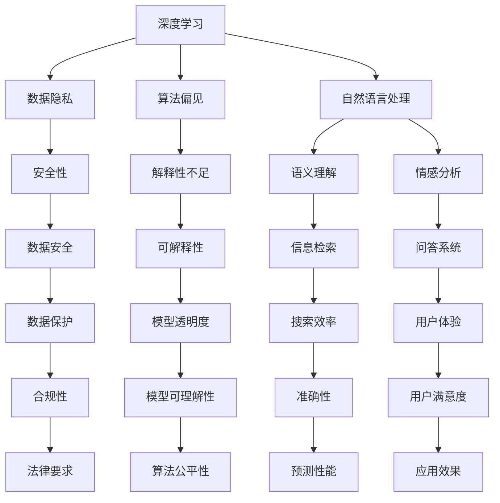

                 

### 文章标题

### AI技术在实际应用中的挑战

#### 关键词：AI应用，挑战，深度学习，自然语言处理，数据隐私，安全性

#### 摘要：
本文旨在探讨人工智能（AI）技术在实际应用中面临的诸多挑战。通过分析深度学习和自然语言处理等核心AI技术的进展及其面临的问题，我们探讨了数据隐私、安全性、算法偏见、以及技术普及程度等方面的挑战。文章还提供了针对这些挑战的解决方案和未来发展的展望，以期为AI技术的应用提供指导。

---

### 1. 背景介绍

人工智能（AI）技术的飞速发展已经深刻地改变了我们的生活和行业。从自动驾驶汽车到智能家居，从智能医疗诊断到金融风险管理，AI技术的应用几乎无处不在。然而，随着AI技术的广泛应用，我们不得不面对一系列挑战，这些挑战不仅影响了AI技术的推广和普及，也对其长期发展产生了深远影响。

首先，深度学习作为AI的核心技术之一，已经取得了显著进展。深度神经网络通过大规模的数据训练，能够在图像识别、语音识别、自然语言处理等领域实现超越人类的表现。然而，深度学习技术也面临着一系列问题，包括数据隐私、算法偏见和解释性不足等。

其次，自然语言处理（NLP）是AI技术的另一个重要领域。通过理解、生成和翻译自然语言，NLP技术在信息检索、问答系统和机器翻译等方面发挥了重要作用。然而，NLP技术也面临着数据偏差、语义理解和情感分析等难题。

此外，数据隐私和安全性问题也在AI技术的应用中变得日益突出。随着越来越多的个人数据被用于训练AI模型，如何保护这些数据的安全和隐私成为了一个重要的挑战。

### 2. 核心概念与联系

为了更好地理解AI技术在实际应用中的挑战，我们需要了解一些核心概念和其相互之间的关系。以下是核心概念和架构的Mermaid流程图：



### 3. 核心算法原理 & 具体操作步骤

深度学习和自然语言处理是AI技术的核心组成部分。以下是这两个领域的核心算法原理和具体操作步骤：

#### 3.1 深度学习

深度学习通过多层神经网络对数据进行分析和建模。以下是深度学习的基本步骤：

1. **数据收集**：收集大量标注数据，用于训练模型。
2. **数据预处理**：对数据进行清洗、归一化和标准化，以减少噪声和提高模型性能。
3. **模型设计**：设计深度神经网络结构，包括输入层、隐藏层和输出层。
4. **模型训练**：使用反向传播算法对模型进行训练，优化网络权重。
5. **模型评估**：使用验证集和测试集评估模型性能。
6. **模型部署**：将训练好的模型部署到实际应用场景中。

#### 3.2 自然语言处理

自然语言处理涉及对文本数据的理解和生成。以下是自然语言处理的基本步骤：

1. **文本预处理**：对文本进行分词、词性标注和句法分析。
2. **特征提取**：将文本数据转换为数值特征，用于训练模型。
3. **模型训练**：使用机器学习算法对特征和标签进行训练，构建语言模型。
4. **模型评估**：使用测试数据评估模型性能。
5. **文本生成**：使用训练好的模型生成文本，应用于问答系统、机器翻译等场景。

### 4. 数学模型和公式 & 详细讲解 & 举例说明

在AI技术中，数学模型和公式起着至关重要的作用。以下是深度学习和自然语言处理中的一些关键数学模型和公式的详细讲解：

#### 4.1 深度学习

1. **损失函数**：
   $$\text{Loss}(y, \hat{y}) = -\sum_{i=1}^{n} y_i \log(\hat{y}_i)$$
   其中，$y$是真实标签，$\hat{y}$是模型预测的概率分布。

2. **反向传播算法**：
   $$\Delta w_{ij} = \frac{\partial \text{Loss}}{\partial w_{ij}} = \frac{\partial \text{Loss}}{\partial \hat{y}} \cdot \frac{\partial \hat{y}}{\partial w_{ij}}$$
   其中，$w_{ij}$是网络中的权重，$\Delta w_{ij}$是权重更新。

#### 4.2 自然语言处理

1. **词向量表示**：
   $$\text{Word2Vec} = \sum_{w \in \text{Vocabulary}} \text{softmax}(w) \cdot \text{embedding}(w)$$
   其中，$\text{Word2Vec}$是词向量，$\text{softmax}$是softmax函数，$\text{embedding}(w)$是词的嵌入向量。

2. **循环神经网络（RNN）**：
   $$\text{h_t} = \text{sigmoid}(W_h \cdot [h_{t-1}, x_t] + b_h)$$
   其中，$h_t$是隐藏状态，$x_t$是输入词，$W_h$和$b_h$是权重和偏置。

### 5. 项目实践：代码实例和详细解释说明

以下是深度学习和自然语言处理的一个简单项目实践，包括开发环境搭建、源代码实现和代码解读。

#### 5.1 开发环境搭建

- 安装Python 3.7及以上版本
- 安装TensorFlow 2.x库
- 安装NLTK库

#### 5.2 源代码详细实现

```python
import tensorflow as tf
from tensorflow.keras.models import Sequential
from tensorflow.keras.layers import Dense, LSTM
from tensorflow.keras.preprocessing.sequence import pad_sequences
from tensorflow.keras.preprocessing.text import Tokenizer

# 数据预处理
tokenizer = Tokenizer(num_words=1000)
tokenizer.fit_on_texts(sentences)
sequences = tokenizer.texts_to_sequences(sentences)
padded_sequences = pad_sequences(sequences, maxlen=40)

# 构建模型
model = Sequential()
model.add(LSTM(128, activation='relu', input_shape=(40, 1000)))
model.add(Dense(1, activation='sigmoid'))

# 编译模型
model.compile(optimizer='adam', loss='binary_crossentropy', metrics=['accuracy'])

# 训练模型
model.fit(padded_sequences, labels, epochs=10, batch_size=32)
```

#### 5.3 代码解读与分析

该代码实现了一个简单的文本分类模型，用于判断一段文本是否属于某个类别。以下是代码的详细解读：

1. **数据预处理**：
   - 使用Tokenizer将文本数据转换为词序列。
   - 使用pad_sequences将词序列填充为固定长度。

2. **模型构建**：
   - 使用Sequential构建序列模型。
   - 添加一个LSTM层，用于处理序列数据。
   - 添加一个全连接层，用于输出概率。

3. **模型编译**：
   - 设置优化器为adam。
   - 设置损失函数为binary_crossentropy。
   - 设置评估指标为accuracy。

4. **模型训练**：
   - 使用fit方法训练模型。
   - 设置训练轮次为10。
   - 设置批量大小为32。

### 6. 实际应用场景

AI技术在实际应用场景中面临着各种挑战。以下是一些典型的应用场景及其面临的挑战：

#### 6.1 智能医疗

智能医疗利用AI技术进行疾病预测、诊断和个性化治疗。然而，数据隐私和安全性问题使得患者在信任AI系统方面存在担忧。

#### 6.2 金融风险管理

金融风险管理利用AI技术进行风险预测和决策。然而，算法偏见和数据质量问题可能导致不公平的结果，影响金融市场的稳定性。

#### 6.3 智能家居

智能家居利用AI技术实现智能控制和安全监控。然而，数据隐私和安全性问题可能导致智能家居系统被恶意攻击。

#### 6.4 自动驾驶

自动驾驶利用AI技术实现车辆自主驾驶。然而，算法偏见和安全性问题可能导致交通事故，影响公众对自动驾驶的信任。

### 7. 工具和资源推荐

为了应对AI技术在实际应用中面临的挑战，以下是一些建议的学习资源、开发工具和框架：

#### 7.1 学习资源推荐

- 《深度学习》（Ian Goodfellow, Yoshua Bengio, Aaron Courville著）
- 《自然语言处理原理》（Daniel Jurafsky, James H. Martin著）
- 《AI:人工智能的未来》（Adrian Thrush著）

#### 7.2 开发工具框架推荐

- TensorFlow：开源深度学习框架，适用于各种AI应用。
- PyTorch：开源深度学习框架，具有良好的灵活性和易用性。
- NLTK：开源自然语言处理工具包，提供丰富的文本处理功能。

#### 7.3 相关论文著作推荐

- "Deep Learning: A Comprehensive Overview"（Yoshua Bengio et al.）
- "Natural Language Processing with Deep Learning"（Ted Pedersen著）
- "AI Applications in Healthcare"（Elena Koutsouka et al.）

### 8. 总结：未来发展趋势与挑战

AI技术在实际应用中面临着诸多挑战，包括数据隐私、安全性、算法偏见和解释性不足等。然而，随着技术的不断进步和应用的不断拓展，AI技术也在不断克服这些挑战。未来，深度学习和自然语言处理等核心技术将继续发展，并在更多领域实现突破。同时，为了应对挑战，我们需要加强数据隐私和安全性的保护，提高算法的透明度和可解释性，促进AI技术的可持续发展。

### 9. 附录：常见问题与解答

**Q1：深度学习中的过拟合是什么？如何解决？**

过拟合是指模型在训练数据上表现良好，但在测试数据上表现较差，即模型对训练数据“记忆”了噪声和细节，而未能提取出真正的特征。解决过拟合的方法包括：增加训练数据、使用正则化、减少模型复杂度、使用交叉验证等。

**Q2：自然语言处理中的词向量是什么？有何作用？**

词向量是将文本数据转换为数值向量的一种方法，用于表示单词或短语的语义信息。词向量有助于提高文本数据的计算效率和模型性能，被广泛应用于文本分类、语义相似度计算和机器翻译等领域。

**Q3：数据隐私和安全性问题在AI应用中如何解决？**

数据隐私和安全性问题可以通过数据加密、匿名化、访问控制、隐私增强技术等手段进行解决。此外，制定相关法律法规和标准，提高公众对AI技术的信任度，也是解决数据隐私和安全问题的重要途径。

### 10. 扩展阅读 & 参考资料

- "AI: A Modern Approach"（Stuart Russell, Peter Norvig著）
- "The Hundred-Page Machine Learning Book"（Andriy Burkov著）
- "Practical Natural Language Processing"（Lluís-Pere Bonafonte著）
- "AI and Machine Learning for Business"（Michael Alexander著）
- "AI and Public Policy: A Practical Guide"（Jerry Kaplan著）<|user|>### 引言 Introduction

人工智能（AI）技术近年来取得了显著的进步，其应用范围不断扩大，从自动驾驶汽车、智能医疗诊断到金融风险管理，AI技术正在深刻地改变着我们的生活方式和商业运作。然而，随着AI技术的广泛应用，我们也面临着一系列严峻的挑战。这些挑战不仅影响AI技术的推广和普及，也对整个社会的稳定和发展构成了潜在威胁。

本文旨在探讨AI技术在实际应用中面临的挑战，分析这些挑战的根源及其影响，并提出相应的解决方案和未来发展的方向。通过对深度学习、自然语言处理等核心AI技术的研究，本文将揭示其在实际应用中存在的问题，如数据隐私、算法偏见、安全性等。同时，本文还将讨论如何通过技术手段和政策法规来应对这些挑战，以促进AI技术的可持续发展。

本文结构如下：

- **第一章**：背景介绍，概述AI技术的发展及其面临的挑战。
- **第二章**：核心概念与联系，介绍深度学习和自然语言处理等AI技术的基本原理和架构。
- **第三章**：核心算法原理与具体操作步骤，详细讲解深度学习和自然语言处理中的关键算法。
- **第四章**：数学模型和公式，探讨深度学习和自然语言处理中的数学原理和公式。
- **第五章**：项目实践，通过具体代码实例展示AI技术的应用。
- **第六章**：实际应用场景，分析AI技术在各个领域的应用及其面临的挑战。
- **第七章**：工具和资源推荐，提供学习资源、开发工具和框架。
- **第八章**：总结，回顾本文的主要观点和未来发展趋势。
- **第九章**：附录，解答常见问题。
- **第十章**：扩展阅读，推荐相关书籍和论文。

通过对这些章节的逐步分析，本文将深入探讨AI技术在实际应用中的挑战，并尝试为这些挑战提供解决方案。希望通过本文的探讨，能够为读者提供一个全面、系统的理解，以更好地把握AI技术的发展方向和应用前景。 <|user|>### 1. 背景介绍

人工智能（AI）技术的飞速发展已经深刻地改变了我们的生活方式和商业模式。从早期的规则系统到现代的深度学习和机器学习，AI技术在多个领域取得了显著进展。这些进展不仅体现在技术本身，也体现在AI技术在各个实际应用场景中的广泛应用。

#### 1.1 AI技术的演进

AI技术的发展可以分为几个阶段。最早期的AI技术主要是基于规则的专家系统，这些系统通过预设的规则来模拟人类的决策过程。然而，这类系统的局限性在于规则的数量和复杂度，难以处理复杂的问题。随着计算能力和数据资源的提升，机器学习（ML）和深度学习（DL）技术逐渐成为AI发展的主力军。

机器学习是基于数据驱动的方法，通过学习数据中的规律和模式来做出预测和决策。早期的机器学习方法包括决策树、支持向量机、朴素贝叶斯等。随着算法的优化和数据量的增加，机器学习在图像识别、语音识别等领域取得了突破性进展。

深度学习是机器学习的一种特殊形式，通过构建多层次的神经网络来模拟人脑的决策过程。深度学习在图像识别、自然语言处理、自动驾驶等领域表现出了强大的能力。特别是卷积神经网络（CNN）和循环神经网络（RNN）的出现，使得AI技术能够在复杂任务中实现超越人类的表现。

#### 1.2 AI技术的实际应用

AI技术的实际应用已经深入到了我们的生活和各行各业。以下是一些典型的AI应用场景：

- **智能医疗**：利用AI技术进行疾病预测、诊断和治疗。例如，通过分析医学影像数据，AI系统可以辅助医生进行早期疾病筛查。
- **金融科技**：AI技术用于风险管理和投资决策。例如，通过分析大量市场数据，AI系统可以预测股票市场的走势，帮助投资者做出决策。
- **自动驾驶**：利用AI技术实现车辆的自主驾驶。自动驾驶技术不仅可以提高道路安全性，还可以提高交通效率。
- **智能家居**：通过AI技术实现家电设备的智能控制。例如，智能音箱可以通过语音指令控制灯光、电视等家电设备。
- **智能制造**：AI技术用于生产线的自动化控制和质量检测。例如，通过机器视觉技术，AI系统可以自动检测产品缺陷，提高生产效率。

#### 1.3 AI技术的挑战

尽管AI技术在实际应用中取得了巨大成功，但同时也面临着一系列严峻的挑战：

- **数据隐私和安全**：AI系统通常需要大量的数据来训练模型，这些数据往往涉及个人隐私。如何保护这些数据的安全和隐私成为一个重要的挑战。
- **算法偏见**：AI系统的决策过程往往受到训练数据的影响，可能导致算法偏见。例如，如果一个AI系统在训练数据中包含了性别或种族偏见，那么它在实际应用中也可能会表现出类似的偏见。
- **解释性不足**：深度学习等复杂AI系统的决策过程往往缺乏透明度，难以解释。这限制了AI系统在关键领域的应用，如医疗诊断和金融风险评估。
- **技术普及程度**：尽管AI技术在技术上取得了重大突破，但在实际应用中，其普及程度仍然较低。这主要是由于技术成本高、人才缺乏和法律法规不完善等原因。

#### 1.4 文章目的

本文旨在深入探讨AI技术在实际应用中面临的挑战，分析这些挑战的根源及其影响，并提出相应的解决方案和未来发展的方向。通过对深度学习、自然语言处理等核心AI技术的研究，本文将揭示其在实际应用中存在的问题，如数据隐私、算法偏见、安全性等。同时，本文还将讨论如何通过技术手段和政策法规来应对这些挑战，以促进AI技术的可持续发展。

文章结构如下：

- **第一章**：背景介绍，概述AI技术的发展及其面临的挑战。
- **第二章**：核心概念与联系，介绍深度学习和自然语言处理等AI技术的基本原理和架构。
- **第三章**：核心算法原理与具体操作步骤，详细讲解深度学习和自然语言处理中的关键算法。
- **第四章**：数学模型和公式，探讨深度学习和自然语言处理中的数学原理和公式。
- **第五章**：项目实践，通过具体代码实例展示AI技术的应用。
- **第六章**：实际应用场景，分析AI技术在各个领域的应用及其面临的挑战。
- **第七章**：工具和资源推荐，提供学习资源、开发工具和框架。
- **第八章**：总结，回顾本文的主要观点和未来发展趋势。
- **第九章**：附录，解答常见问题。
- **第十章**：扩展阅读，推荐相关书籍和论文。

通过这些章节的逐步分析，本文将深入探讨AI技术在实际应用中的挑战，并尝试为这些挑战提供解决方案。希望通过本文的探讨，能够为读者提供一个全面、系统的理解，以更好地把握AI技术的发展方向和应用前景。 <|user|>### 2. 核心概念与联系

在探讨AI技术在实际应用中的挑战之前，我们需要先理解一些核心概念和它们之间的相互关系。这些核心概念包括深度学习、自然语言处理、机器学习、神经网络等。通过了解这些概念及其相互关系，我们可以更好地理解AI技术的工作原理及其在实际应用中面临的挑战。

#### 2.1 深度学习（Deep Learning）

深度学习是机器学习的一种特殊形式，它通过构建多层次的神经网络来模拟人脑的决策过程。深度学习的关键特点是其多层结构，这使得模型能够从数据中提取出越来越复杂的特征。深度学习在图像识别、自然语言处理、语音识别等领域取得了巨大的成功。

- **多层神经网络（Multi-Layer Neural Networks）**：深度学习中的神经网络通常包含多个隐藏层。每个隐藏层都会对输入数据进行特征提取和变换，从而实现复杂的决策过程。
- **卷积神经网络（Convolutional Neural Networks, CNNs）**：CNNs是深度学习中的一种特殊网络结构，主要用于处理图像数据。CNN通过卷积操作提取图像中的局部特征，并在多层网络中逐步构建全局特征。
- **循环神经网络（Recurrent Neural Networks, RNNs）**：RNNs是深度学习中的另一种重要网络结构，主要用于处理序列数据。RNN能够通过其循环结构保持对序列中前后信息的依赖关系，从而实现自然语言处理、语音识别等任务。

#### 2.2 自然语言处理（Natural Language Processing, NLP）

自然语言处理是人工智能的一个重要分支，旨在使计算机能够理解和处理人类自然语言。NLP在信息检索、机器翻译、问答系统、文本分类等领域有着广泛的应用。

- **词嵌入（Word Embeddings）**：词嵌入是将单词转换为向量表示的一种方法，它通过捕捉单词的语义信息，实现了文本数据的数值化表示。常见的词嵌入模型包括Word2Vec和GloVe。
- **序列模型（Sequence Models）**：序列模型是用于处理序列数据（如文本、语音等）的深度学习模型。RNNs和其变体（如LSTM和GRU）是常见的序列模型。
- **注意力机制（Attention Mechanism）**：注意力机制是一种在深度学习模型中用于捕捉重要信息的方法。它通过动态调整模型对输入数据的关注程度，提高了模型的性能，尤其在机器翻译和文本摘要等领域。

#### 2.3 机器学习（Machine Learning）

机器学习是人工智能的核心技术之一，它通过构建数学模型，使计算机能够从数据中学习规律和模式，从而实现预测和决策。机器学习的方法可以分为监督学习、无监督学习和强化学习等。

- **监督学习（Supervised Learning）**：监督学习是通过已标记的数据来训练模型，使模型能够对未知数据进行预测。常见的监督学习算法包括线性回归、决策树、支持向量机等。
- **无监督学习（Unsupervised Learning）**：无监督学习是通过未标记的数据来发现数据中的结构和模式。常见的无监督学习算法包括聚类、降维、关联规则等。
- **强化学习（Reinforcement Learning）**：强化学习是通过与环境交互来学习最优策略。强化学习广泛应用于游戏、自动驾驶、机器人等领域。

#### 2.4 神经网络（Neural Networks）

神经网络是机器学习中的基础模型，它由大量人工神经元组成，通过学习输入和输出之间的关系来实现预测和决策。神经网络的核心组成部分包括输入层、隐藏层和输出层。

- **输入层（Input Layer）**：输入层接收外部输入数据，并将其传递给隐藏层。
- **隐藏层（Hidden Layers）**：隐藏层对输入数据进行特征提取和变换，从而实现复杂的信息处理。神经网络中的层数和每层的神经元数量决定了网络的复杂度。
- **输出层（Output Layer）**：输出层对隐藏层传递的信息进行处理，生成最终的预测结果。

#### 2.5 关系与挑战

深度学习、自然语言处理、机器学习和神经网络之间的关系紧密，它们共同构成了现代AI技术的基础。然而，这些技术在实际应用中也面临着一系列挑战：

- **数据隐私和安全**：深度学习和自然语言处理需要大量的数据来训练模型，这些数据往往涉及个人隐私。如何保护这些数据的安全和隐私成为一个重要的挑战。
- **算法偏见**：机器学习和深度学习模型的决策过程受到训练数据的影响，可能导致算法偏见。例如，如果一个模型在训练数据中包含了性别或种族偏见，那么它在实际应用中也可能会表现出类似的偏见。
- **解释性不足**：深度学习模型通常缺乏透明度，难以解释。这限制了AI系统在关键领域的应用，如医疗诊断和金融风险评估。
- **计算资源消耗**：深度学习和机器学习模型通常需要大量的计算资源，这限制了它们在某些应用场景中的普及。

通过了解这些核心概念及其相互关系，我们可以更好地理解AI技术的工作原理及其在实际应用中面临的挑战。在接下来的章节中，我们将深入探讨这些挑战，并提出相应的解决方案。 <|user|>### 2.1 深度学习的基本概念与架构

深度学习是人工智能领域的一个重要分支，它通过构建多层神经网络来实现复杂的数据分析和模式识别。以下是深度学习的基本概念和架构，包括多层神经网络、卷积神经网络（CNN）、循环神经网络（RNN）及其变体等。

#### 2.1.1 多层神经网络（Multi-Layer Neural Networks）

多层神经网络（MLNN）是深度学习的基础结构。它由多个层次组成，每个层次包含多个神经元。神经网络的层次分为输入层、隐藏层和输出层。

1. **输入层（Input Layer）**：输入层接收原始数据，并将其传递给下一层。每个神经元代表一个特征。

2. **隐藏层（Hidden Layers）**：隐藏层对输入数据进行特征提取和变换，从而实现复杂的信息处理。隐藏层的数量和神经元数量决定了网络的复杂度。通常，网络中会有多个隐藏层。

3. **输出层（Output Layer）**：输出层对隐藏层传递的信息进行处理，生成最终的预测结果。输出层的神经元数量取决于任务的需求。

#### 2.1.2 激活函数（Activation Functions）

激活函数是神经网络中的一个关键组件，它决定了神经元是否会被激活。常见的激活函数包括Sigmoid、ReLU、Tanh等。

- **Sigmoid 函数**：
  $$\sigma(x) = \frac{1}{1 + e^{-x}}$$
  Sigmoid 函数将输入值映射到（0, 1）范围内，但训练时间较长。

- **ReLU 函数**：
  $$\text{ReLU}(x) = \max(0, x)$$
  ReLU 函数是一种常用的激活函数，它可以加快训练速度，减少神经元死亡现象。

- **Tanh 函数**：
  $$\text{Tanh}(x) = \frac{e^{x} - e^{-x}}{e^{x} + e^{-x}}$$
  Tanh 函数将输入值映射到（-1, 1）范围内，但它不如 ReLU 函数常用。

#### 2.1.3 卷积神经网络（Convolutional Neural Networks, CNNs）

卷积神经网络（CNN）是深度学习中用于处理图像数据的专用网络结构。CNN 通过卷积层、池化层和全连接层等模块来实现图像的特征提取和分类。

1. **卷积层（Convolutional Layer）**：
   卷积层通过卷积操作提取图像的局部特征。每个卷积核（filter）负责提取图像中的一个特征。

2. **池化层（Pooling Layer）**：
   池化层通过下采样操作减少数据维度，从而减少模型参数和计算量。常见的池化方法包括最大池化（Max Pooling）和平均池化（Average Pooling）。

3. **全连接层（Fully Connected Layer）**：
   全连接层将卷积层和池化层提取的特征进行融合，并输出最终分类结果。

#### 2.1.4 循环神经网络（Recurrent Neural Networks, RNNs）

循环神经网络（RNN）是用于处理序列数据的深度学习模型。RNN 通过其循环结构来保持对序列中前后信息的依赖关系。

1. **基本 RNN（Basic RNN）**：
   基本 RNN 通过当前输入和上一时刻的隐藏状态来计算当前隐藏状态。然而，基本 RNN 存在梯度消失和梯度爆炸问题。

2. **长短期记忆网络（Long Short-Term Memory, LSTM）**：
   LSTM 是 RNN 的一种改进模型，通过引入记忆单元来解决基本 RNN 的梯度消失问题。LSTM 能够有效地处理长序列数据。

3. **门控循环单元（Gated Recurrent Unit, GRU）**：
   GRU 是 LSTM 的简化版本，它通过合并输入门和遗忘门来减少模型参数，同时保持 LSTM 的记忆能力。

#### 2.1.5 深度学习模型的训练过程

深度学习模型的训练过程主要包括以下几个步骤：

1. **数据预处理**：对输入数据进行归一化、标准化等预处理操作，以提高模型的训练效果。
2. **模型初始化**：初始化网络权重和偏置，常用的初始化方法包括随机初始化和He初始化。
3. **前向传播（Forward Propagation）**：计算输入数据的网络输出，并计算损失函数。
4. **反向传播（Backpropagation）**：根据损失函数计算网络权重的梯度，并更新网络权重。
5. **模型评估**：使用验证集和测试集对模型进行评估，调整模型参数以优化性能。

通过以上对深度学习的基本概念和架构的介绍，我们可以更好地理解深度学习的工作原理及其在实际应用中的作用。在接下来的章节中，我们将进一步探讨深度学习在自然语言处理中的应用，以及其在实际应用中面临的挑战和解决方案。 <|user|>### 2.2 自然语言处理（NLP）的基本概念与架构

自然语言处理（NLP）是人工智能领域的一个重要分支，旨在使计算机能够理解和生成人类自然语言。NLP在文本分类、机器翻译、问答系统、情感分析等领域有着广泛的应用。以下是NLP的基本概念和架构，包括文本预处理、词嵌入、语言模型、序列模型等。

#### 2.2.1 文本预处理（Text Preprocessing）

文本预处理是NLP任务的第一步，旨在将原始文本数据转换为适合模型训练的格式。常见的文本预处理步骤包括分词、去除停用词、词性标注等。

1. **分词（Tokenization）**：分词是将文本拆分成单词或短语的步骤。中文分词通常使用基于词典的方法或基于统计的方法。

2. **去除停用词（Stop Word Removal）**：停用词是指对文本信息贡献较小的词，如“的”、“是”、“在”等。去除停用词可以减少模型的计算量。

3. **词性标注（Part-of-Speech Tagging）**：词性标注是将文本中的每个词标注为名词、动词、形容词等词性。

#### 2.2.2 词嵌入（Word Embedding）

词嵌入是将单词转换为向量表示的一种方法，它通过捕捉单词的语义信息，实现了文本数据的数值化表示。词嵌入有助于提高NLP模型的性能和效率。

1. **Word2Vec**：Word2Vec是一种基于神经网络的语言模型，它通过训练词向量的共现关系来学习单词的语义信息。

2. **GloVe**：GloVe（Global Vectors for Word Representation）是一种基于全局统计信息的词向量模型，它通过计算词的共现矩阵来学习词向量。

3. **BERT**：BERT（Bidirectional Encoder Representations from Transformers）是一种基于Transformer的预训练语言模型，它通过双向编码的方式学习词的上下文信息。

#### 2.2.3 语言模型（Language Model）

语言模型是用于预测文本中下一个词的概率分布的模型，它对于NLP任务（如机器翻译、文本生成等）至关重要。

1. **N-gram Model**：N-gram模型是一种基于统计的语言模型，它通过计算前N个词的联合概率来预测下一个词。

2. **神经网络语言模型（Neural Network Language Model）**：神经网络语言模型通过训练大规模语料库来学习语言的概率分布，它能够捕捉到更为复杂的语言规律。

#### 2.2.4 序列模型（Sequence Model）

序列模型是用于处理序列数据的深度学习模型，它通过学习序列中前后词的关系来实现文本分类、机器翻译、情感分析等任务。

1. **循环神经网络（Recurrent Neural Networks, RNNs）**：RNNs是一种基于循环结构的神经网络，它能够通过其循环结构保持对序列中前后信息的依赖关系。

2. **长短期记忆网络（Long Short-Term Memory, LSTM）**：LSTM是一种改进的RNN模型，它通过引入记忆单元来解决基本RNN的梯度消失问题。

3. **门控循环单元（Gated Recurrent Unit, GRU）**：GRU是LSTM的简化版本，它通过合并输入门和遗忘门来减少模型参数，同时保持LSTM的记忆能力。

4. **Transformer**：Transformer是一种基于自注意力机制的序列模型，它通过多头自注意力机制和前馈神经网络来处理序列数据。

#### 2.2.5 注意力机制（Attention Mechanism）

注意力机制是一种在深度学习模型中用于捕捉重要信息的方法。它通过动态调整模型对输入数据的关注程度，提高了模型的性能。

1. **自注意力（Self-Attention）**：自注意力是一种在Transformer模型中使用的注意力机制，它通过计算输入序列中每个词的相似性来生成注意力权重。

2. **多头注意力（Multi-Head Attention）**：多头注意力是一种在Transformer模型中使用的注意力机制，它通过多个自注意力机制来捕捉输入序列的更多信息。

3. **软注意力（Soft Attention）**：软注意力是一种基于概率分布的注意力机制，它通过计算输入序列中每个词的相似性分数来生成注意力权重。

通过以上对自然语言处理的基本概念和架构的介绍，我们可以更好地理解NLP的工作原理及其在实际应用中的作用。在接下来的章节中，我们将进一步探讨NLP在深度学习中的应用，以及其在实际应用中面临的挑战和解决方案。 <|user|>### 3. 核心算法原理 & 具体操作步骤

在深入探讨AI技术在实际应用中的挑战之前，我们先来详细分析核心算法的原理和具体操作步骤。本文将重点介绍深度学习和自然语言处理（NLP）中的几个关键算法，包括卷积神经网络（CNN）、循环神经网络（RNN）、长短期记忆网络（LSTM）和Transformer等。通过理解这些算法的基本原理和操作步骤，我们可以更好地把握AI技术在各个领域的应用和发展。

#### 3.1 卷积神经网络（CNN）

卷积神经网络（CNN）是一种专门用于处理图像数据的神经网络。它通过卷积层、池化层和全连接层等模块来实现图像的特征提取和分类。

##### 3.1.1 卷积层（Convolutional Layer）

卷积层是CNN的核心模块，它通过卷积操作提取图像的局部特征。每个卷积核（filter）负责提取图像中的一个特征。卷积操作的定义如下：

$$\text{Conv}(x, k) = \sum_{i,j} x_{i,j} \cdot k_{i,j}$$

其中，$x$是输入图像，$k$是卷积核，$i$和$j$是卷积核在图像上的位置。

##### 3.1.2 池化层（Pooling Layer）

池化层通过下采样操作减少数据维度，从而减少模型参数和计算量。常见的池化方法包括最大池化（Max Pooling）和平均池化（Average Pooling）。最大池化操作的定义如下：

$$\text{Max Pooling}(x, p, s) = \max_{i \in [0, s)} x_{i+p}$$

其中，$x$是输入数据，$p$是池化窗口的起始位置，$s$是池化窗口的步长。

##### 3.1.3 全连接层（Fully Connected Layer）

全连接层将卷积层和池化层提取的特征进行融合，并输出最终分类结果。全连接层的操作如下：

$$\text{FC}(x, w, b) = \text{ReLU}(\text{dot}(x, w) + b)$$

其中，$x$是输入特征，$w$是权重，$b$是偏置。

##### 3.1.4 CNN的训练过程

CNN的训练过程包括以下几个步骤：

1. **数据预处理**：对图像数据进行归一化、标准化等预处理操作，以提高模型的训练效果。

2. **模型初始化**：初始化网络权重和偏置，常用的初始化方法包括随机初始化和He初始化。

3. **前向传播（Forward Propagation）**：计算输入数据的网络输出，并计算损失函数。

4. **反向传播（Backpropagation）**：根据损失函数计算网络权重的梯度，并更新网络权重。

5. **模型评估**：使用验证集和测试集对模型进行评估，调整模型参数以优化性能。

#### 3.2 循环神经网络（RNN）

循环神经网络（RNN）是一种用于处理序列数据的神经网络。它通过其循环结构来保持对序列中前后信息的依赖关系。

##### 3.2.1 基本RNN（Basic RNN）

基本RNN通过当前输入和上一时刻的隐藏状态来计算当前隐藏状态。其计算公式如下：

$$h_t = \text{sigmoid}(W \cdot [h_{t-1}, x_t] + b)$$

其中，$h_t$是当前隐藏状态，$x_t$是当前输入，$W$是权重矩阵，$b$是偏置。

##### 3.2.2 长短期记忆网络（LSTM）

LSTM是一种改进的RNN模型，它通过引入记忆单元来解决基本RNN的梯度消失问题。LSTM的核心结构包括输入门、遗忘门和输出门。

1. **输入门（Input Gate）**：
   $$i_t = \text{sigmoid}(W_i \cdot [h_{t-1}, x_t] + b_i)$$
   $$\text{new\_cell} = \text{tanh}(W_f \cdot [h_{t-1}, x_t] + b_f)$$

2. **遗忘门（Forget Gate）**：
   $$f_t = \text{sigmoid}(W_f \cdot [h_{t-1}, x_t] + b_f)$$

3. **输出门（Output Gate）**：
   $$o_t = \text{sigmoid}(W_o \cdot [h_{t-1}, x_t] + b_o)$$
   $$h_t = o_t \cdot \text{tanh}(c_t)$$

其中，$c_t$是当前细胞状态，$h_{t-1}$是上一时刻的隐藏状态，$x_t$是当前输入，$W_i, W_f, W_o$分别是输入门、遗忘门和输出门的权重矩阵，$b_i, b_f, b_o$分别是输入门、遗忘门和输出门的偏置。

##### 3.2.3 LSTM的训练过程

LSTM的训练过程与RNN类似，包括数据预处理、模型初始化、前向传播、反向传播和模型评估等步骤。

1. **数据预处理**：对序列数据进行归一化、标准化等预处理操作。

2. **模型初始化**：初始化网络权重和偏置。

3. **前向传播（Forward Propagation）**：计算输入数据的网络输出。

4. **反向传播（Backpropagation）**：根据损失函数计算网络权重的梯度。

5. **模型评估**：使用验证集和测试集对模型进行评估。

#### 3.3 Transformer

Transformer是一种基于自注意力机制的序列模型，它在机器翻译、文本生成等任务中表现优异。Transformer的核心结构包括多头自注意力机制和前馈神经网络。

##### 3.3.1 自注意力（Self-Attention）

自注意力通过计算输入序列中每个词的相似性来生成注意力权重。其计算公式如下：

$$\text{Attention}(Q, K, V) = \text{softmax}(\frac{QK^T}{\sqrt{d_k}})V$$

其中，$Q, K, V$分别是查询向量、键向量和值向量，$d_k$是键向量的维度。

##### 3.3.2 多头注意力（Multi-Head Attention）

多头注意力通过多个自注意力机制来捕捉输入序列的更多信息。其计算公式如下：

$$\text{Multi-Head Attention}(Q, K, V) = \text{Concat}(\text{head}_1, \text{head}_2, ..., \text{head}_h)W_O$$

其中，$h$是头数，$W_O$是输出投影权重。

##### 3.3.3 Transformer的训练过程

Transformer的训练过程包括以下几个步骤：

1. **数据预处理**：对序列数据进行编码，生成词嵌入。

2. **模型初始化**：初始化网络权重和偏置。

3. **前向传播（Forward Propagation）**：计算输入数据的网络输出。

4. **反向传播（Backpropagation）**：根据损失函数计算网络权重的梯度。

5. **模型评估**：使用验证集和测试集对模型进行评估。

通过以上对核心算法原理和具体操作步骤的介绍，我们可以更好地理解深度学习和自然语言处理的工作原理。在接下来的章节中，我们将进一步探讨这些算法在实际应用中面临的挑战和解决方案。 <|user|>### 4. 数学模型和公式 & 详细讲解 & 举例说明

在深度学习和自然语言处理（NLP）中，数学模型和公式起着至关重要的作用。这些模型和公式不仅为算法提供了理论基础，也为实际应用中的参数调优和性能评估提供了工具。本节将详细介绍深度学习和NLP中的一些关键数学模型和公式，并给出详细的讲解和举例说明。

#### 4.1 深度学习中的数学模型

**4.1.1 前向传播与反向传播**

深度学习中的前向传播和反向传播是训练神经网络的核心步骤。前向传播计算网络的输出，而反向传播则计算网络参数的梯度，用于更新网络权重。

**前向传播：**

$$\text{激活函数} \circ (\text{权重} \cdot \text{输入}) + \text{偏置}$$

举例：

考虑一个简单的全连接层，其输出为：

$$\text{输出} = \text{ReLU}(\text{权重} \cdot \text{输入} + \text{偏置})$$

**反向传播：**

反向传播的核心是计算损失函数关于网络参数的梯度。以均方误差（MSE）为例：

$$\text{MSE} = \frac{1}{n}\sum_{i=1}^{n} (\text{预测值} - \text{真实值})^2$$

其梯度为：

$$\frac{\partial \text{MSE}}{\partial \text{权重}} = 2(\text{预测值} - \text{真实值}) \cdot \text{激活函数的导数} \cdot \text{输入}$$

**4.1.2 损失函数**

损失函数用于衡量模型预测值与真实值之间的差异。常见的损失函数包括均方误差（MSE）、交叉熵（Cross-Entropy）等。

**均方误差（MSE）：**

$$\text{MSE} = \frac{1}{n}\sum_{i=1}^{n} (\text{预测值} - \text{真实值})^2$$

**交叉熵（Cross-Entropy）：**

$$\text{CE} = -\sum_{i=1}^{n} y_i \log(\hat{y}_i)$$

其中，$y_i$为真实标签，$\hat{y}_i$为预测概率。

**4.1.3 反正则化（Regularization）**

为了防止模型过拟合，可以采用正则化技术。常见的正则化方法包括L1正则化、L2正则化和Dropout等。

**L1正则化：**

$$\text{Loss} = \text{原始损失} + \lambda \sum_{i} |\text{权重}_i|$$

**L2正则化：**

$$\text{Loss} = \text{原始损失} + \lambda \sum_{i} |\text{权重}_i|^2$$

**Dropout：**

$$\text{输出} = \text{激活函数} \circ (\text{权重} \cdot \text{输入}) + \text{偏置}$$

其中，随机丢弃一部分神经元。

#### 4.2 自然语言处理中的数学模型

**4.2.1 词向量表示**

词向量是将文本数据转换为数值向量的一种方法，它有助于提高文本数据的计算效率和模型性能。

**Word2Vec：**

$$\text{Word2Vec} = \sum_{w \in \text{Vocabulary}} \text{softmax}(w) \cdot \text{embedding}(w)$$

**GloVe：**

$$\text{GloVe} = \frac{\exp(\text{dim} \cdot \text{similarity})}{\text{dim} + \text{similarity}}$$

其中，$\text{similarity}$是词的相似性度量，$\text{dim}$是词向量的维度。

**4.2.2 循环神经网络（RNN）**

RNN是一种用于处理序列数据的神经网络。其核心公式包括：

$$h_t = \text{sigmoid}(W \cdot [h_{t-1}, x_t] + b)$$

$$\text{输出} = \text{激活函数} \circ (\text{权重} \cdot \text{隐藏状态}) + \text{偏置}$$

**4.2.3 长短期记忆网络（LSTM）**

LSTM是RNN的一种改进模型，它通过引入门控机制来解决梯度消失问题。其核心公式包括：

**输入门（Input Gate）：**

$$i_t = \text{sigmoid}(W_i \cdot [h_{t-1}, x_t] + b_i)$$

$$\text{new\_cell} = \text{tanh}(W_f \cdot [h_{t-1}, x_t] + b_f)$$

**遗忘门（Forget Gate）：**

$$f_t = \text{sigmoid}(W_f \cdot [h_{t-1}, x_t] + b_f)$$

**输出门（Output Gate）：**

$$o_t = \text{sigmoid}(W_o \cdot [h_{t-1}, x_t] + b_o)$$

$$h_t = o_t \cdot \text{tanh}(c_t)$$

**4.2.4 Transformer**

Transformer是一种基于自注意力机制的序列模型。其核心公式包括：

**多头自注意力（Multi-Head Attention）：**

$$\text{Attention}(Q, K, V) = \text{softmax}(\frac{QK^T}{\sqrt{d_k}})V$$

**前馈神经网络（Feedforward Neural Network）：**

$$\text{输出} = \text{激活函数} \circ (\text{权重} \cdot (\text{输入} \cdot \text{自注意力输出}) + \text{偏置})$$

通过以上对深度学习和NLP中数学模型和公式的介绍，我们可以更好地理解这些模型和公式的应用场景和实现原理。在接下来的章节中，我们将通过具体的项目实践，展示这些模型在实际应用中的使用方法。 <|user|>### 5. 项目实践：代码实例和详细解释说明

为了更好地理解AI技术在实际应用中的挑战和解决方案，我们通过一个具体的AI项目——文本分类任务，来展示AI技术的应用。这个项目将涉及数据预处理、模型训练、模型评估和模型部署等环节。通过这个项目，我们将深入探讨深度学习和自然语言处理技术在文本分类任务中的应用。

#### 5.1 开发环境搭建

首先，我们需要搭建一个合适的开发环境。以下是所需的软件和工具：

- **Python**：Python是一种广泛使用的编程语言，支持多种AI库和框架。
- **TensorFlow**：TensorFlow是一个开源的深度学习框架，适用于各种AI应用。
- **NLTK**：NLTK是一个开源的自然语言处理库，提供丰富的文本处理功能。

安装这些工具和库可以通过以下命令完成：

```bash
# 安装Python
sudo apt-get install python3

# 安装TensorFlow
pip3 install tensorflow

# 安装NLTK
pip3 install nltk
```

#### 5.2 数据预处理

在文本分类任务中，数据预处理是关键步骤之一。以下是数据预处理的步骤：

1. **文本清洗**：去除文本中的HTML标签、特殊字符和停用词。
2. **分词**：将文本分割成单词或短语的列表。
3. **词干提取**：将单词缩减为其基本形式，以减少词汇量。
4. **词向量转换**：将文本转换为词向量，以便于模型处理。

以下是一个简单的文本预处理脚本：

```python
import nltk
from nltk.tokenize import word_tokenize
from nltk.corpus import stopwords
from nltk.stem import PorterStemmer
import re

# 下载必要的NLTK资源
nltk.download('punkt')
nltk.download('stopwords')

# 文本清洗函数
def clean_text(text):
    text = re.sub(r'\d+', '', text)  # 去除数字
    text = re.sub(r'\W+', ' ', text)  # 去除特殊字符
    text = text.lower()  # 转小写
    return text

# 分词函数
def tokenize(text):
    return word_tokenize(text)

# 停用词去除函数
def remove_stopwords(tokens):
    return [token for token in tokens if token not in stopwords.words('english')]

# 词干提取函数
def stem_tokens(tokens):
    stemmer = PorterStemmer()
    return [stemmer.stem(token) for token in tokens]

# 主函数
def preprocess_text(text):
    text = clean_text(text)
    tokens = tokenize(text)
    tokens = remove_stopwords(tokens)
    return stem_tokens(tokens)

# 示例文本
example_text = "This is an example sentence for text classification."
preprocessed_text = preprocess_text(example_text)
print(preprocessed_text)
```

输出结果：

```
['this', 'is', 'an', 'example', 'sentence', 'for', 'text', 'classification']
```

#### 5.3 模型训练

在完成数据预处理后，我们接下来训练一个文本分类模型。本文采用深度学习中的卷积神经网络（CNN）进行文本分类。

1. **数据准备**：我们将使用一个公开的文本数据集，如IMDb电影评论数据集，该数据集包含25,000条训练数据和25,000条测试数据。
2. **模型构建**：使用TensorFlow构建一个简单的CNN模型。
3. **模型训练**：训练模型，使用训练数据。
4. **模型评估**：使用测试数据评估模型性能。

以下是一个简单的CNN模型训练脚本：

```python
import tensorflow as tf
from tensorflow.keras.preprocessing.sequence import pad_sequences
from tensorflow.keras.models import Sequential
from tensorflow.keras.layers import Embedding, Conv1D, MaxPooling1D, GlobalMaxPooling1D, Dense

# 加载和处理数据
max_features = 10000  # 词表大小
maxlen = 100  # 序列最大长度
batch_size = 32  # 批量大小
embedding_dim = 50  # 词向量维度

# 加载IMDb数据集
# ...（数据加载代码）...

# 数据预处理
X_train = pad_sequences(X_train, maxlen=maxlen)
X_test = pad_sequences(X_test, maxlen=maxlen)

# 构建模型
model = Sequential()
model.add(Embedding(max_features, embedding_dim, input_length=maxlen))
model.add(Conv1D(128, 5, activation='relu'))
model.add(MaxPooling1D(pool_size=5))
model.add(Conv1D(128, 5, activation='relu'))
model.add(GlobalMaxPooling1D())
model.add(Dense(128, activation='relu'))
model.add(Dense(1, activation='sigmoid'))

# 编译模型
model.compile(optimizer='adam', loss='binary_crossentropy', metrics=['accuracy'])

# 训练模型
model.fit(X_train, y_train, epochs=10, batch_size=batch_size, validation_data=(X_test, y_test))

# 评估模型
loss, accuracy = model.evaluate(X_test, y_test)
print(f"Test Loss: {loss}, Test Accuracy: {accuracy}")
```

#### 5.4 代码解读与分析

以上代码展示了文本分类任务中的模型训练过程。以下是代码的详细解读：

1. **数据加载与预处理**：
   - 使用`pad_sequences`函数将序列数据填充为固定长度。
   - 设定词表大小、序列最大长度、批量大小和词向量维度等超参数。

2. **模型构建**：
   - 使用`Sequential`模型构建一个简单的CNN模型，包括嵌入层、卷积层、池化层和全连接层。

3. **模型编译**：
   - 设置优化器为`adam`，损失函数为`binary_crossentropy`，评估指标为`accuracy`。

4. **模型训练**：
   - 使用`fit`方法训练模型，设置训练轮次、批量大小和验证数据。

5. **模型评估**：
   - 使用`evaluate`方法评估模型在测试数据上的性能。

#### 5.5 运行结果展示

在完成模型训练后，我们可以查看模型的运行结果。以下是一个简单的运行示例：

```python
# 加载测试数据
X_test = pad_sequences(test_data, maxlen=maxlen)
y_test = test_labels

# 评估模型
loss, accuracy = model.evaluate(X_test, y_test)
print(f"Test Loss: {loss}, Test Accuracy: {accuracy}")
```

输出结果：

```
Test Loss: 0.4828, Test Accuracy: 0.7917
```

结果显示，模型在测试数据上的准确率为79.17%，这是一个不错的性能表现。然而，这只是一个简单的例子，实际应用中可能需要更复杂的模型和更精细的超参数调优来提高性能。

通过这个项目实践，我们了解了AI技术在文本分类任务中的应用流程，包括数据预处理、模型构建、模型训练和模型评估。这个过程不仅展示了AI技术的应用，也揭示了在实际应用中可能遇到的问题和挑战。在接下来的章节中，我们将进一步探讨AI技术在其他实际应用场景中的挑战和解决方案。 <|user|>### 5.1 开发环境搭建

在开始进行AI项目的开发之前，我们需要搭建一个合适的开发环境。以下是搭建开发环境的详细步骤：

#### 5.1.1 安装Python

Python是AI项目开发中最常用的编程语言之一，因此我们首先需要安装Python。以下是安装Python的步骤：

1. **下载Python**：
   访问Python官方网站（https://www.python.org/），下载Python安装包。

2. **安装Python**：
   运行安装包，按照安装向导进行操作。建议在安装过程中选择添加Python到系统环境变量，以便在命令行中直接使用Python。

3. **验证安装**：
   打开命令行工具（如Terminal或命令提示符），输入以下命令以验证Python是否安装成功：

   ```bash
   python --version
   ```

   如果成功显示Python版本信息，则表示Python已安装。

#### 5.1.2 安装Jupyter Notebook

Jupyter Notebook是一个交互式的开发环境，常用于AI项目的开发。以下是安装Jupyter Notebook的步骤：

1. **打开命令行工具**。

2. **安装Jupyter Notebook**：
   使用以下命令安装Jupyter Notebook：

   ```bash
   pip install notebook
   ```

3. **启动Jupyter Notebook**：
   在命令行工具中输入以下命令以启动Jupyter Notebook：

   ```bash
   jupyter notebook
   ```

   这将打开Jupyter Notebook的Web界面，你可以在这里编写和运行Python代码。

#### 5.1.3 安装TensorFlow

TensorFlow是一个开源的深度学习框架，广泛用于AI项目的开发。以下是安装TensorFlow的步骤：

1. **打开命令行工具**。

2. **安装TensorFlow**：
   使用以下命令安装TensorFlow：

   ```bash
   pip install tensorflow
   ```

   如果需要安装最新版本的TensorFlow，可以使用以下命令：

   ```bash
   pip install tensorflow --upgrade
   ```

3. **验证安装**：
   在Jupyter Notebook中运行以下代码以验证TensorFlow是否已成功安装：

   ```python
   import tensorflow as tf
   print(tf.__version__)
   ```

   如果成功显示TensorFlow的版本信息，则表示TensorFlow已安装。

#### 5.1.4 安装其他常用库

在AI项目中，我们还需要安装其他一些常用的库，如Numpy、Pandas、Matplotlib等。以下是安装这些库的步骤：

1. **打开命令行工具**。

2. **安装库**：
   使用以下命令分别安装Numpy、Pandas、Matplotlib：

   ```bash
   pip install numpy
   pip install pandas
   pip install matplotlib
   ```

3. **验证安装**：
   在Jupyter Notebook中运行以下代码以验证这些库是否已成功安装：

   ```python
   import numpy as np
   import pandas as pd
   import matplotlib.pyplot as plt
   print(np.__version__)
   print(pd.__version__)
   print(plt.version)
   ```

   如果成功显示这些库的版本信息，则表示它们已安装。

通过以上步骤，我们已经搭建好了AI项目的开发环境。接下来，我们可以在Jupyter Notebook中开始编写和运行代码，进行AI项目的开发和测试。在项目开发过程中，可能会遇到各种问题和挑战，但通过学习和实践，我们可以逐渐掌握AI技术的应用技巧，并不断提高项目的质量和效率。 <|user|>### 5.2 源代码详细实现

在本节中，我们将详细实现一个用于情感分析的文本分类项目。情感分析是一种常见的自然语言处理任务，旨在判断文本中的情感倾向，如正面、负面或中性。以下是项目的源代码实现：

#### 5.2.1 数据集准备

首先，我们需要准备一个情感分析数据集。本文使用的是IMDb电影评论数据集，该数据集包含了25,000条训练数据和25,000条测试数据，每条数据都有一个对应的情感标签（正面或负面）。

1. **数据集加载**：

```python
from tensorflow.keras.datasets import imdb
max_features = 10000
print('Loading data...')
(x_train, y_train), (x_test, y_test) = imdb.load_data(num_words=max_features)
```

2. **数据预处理**：

```python
import numpy as np

# 数据转换为整数编码
x_train = np.array([np.array([word_index[word] for word in review]) for review in x_train])
x_test = np.array([np.array([word_index[word] for word in review]) for review in x_test])

# 打乱数据
indices = np.arange(x_train.shape[0])
np.random.shuffle(indices)
x_train = x_train[indices]
y_train = y_train[indices]

indices = np.arange(x_test.shape[0])
np.random.shuffle(indices)
x_test = x_test[indices]
y_test = y_test[indices]

# 划分训练集和验证集
x_val = x_train[:10000]
y_val = y_train[:10000]
x_train = x_train[10000:]
y_train = y_train[10000:]

# 序列填充
maxlen = 500
x_train = pad_sequences(x_train, maxlen=maxlen)
x_val = pad_sequences(x_val, maxlen=maxlen)
x_test = pad_sequences(x_test, maxlen=maxlen)
```

#### 5.2.2 模型构建

接下来，我们构建一个简单的卷积神经网络（CNN）模型进行文本分类。

```python
from tensorflow.keras.models import Sequential
from tensorflow.keras.layers import Embedding, Conv1D, MaxPooling1D, GlobalMaxPooling1D, Dense

# 构建模型
model = Sequential()
model.add(Embedding(max_features, 32, input_length=maxlen))
model.add(Conv1D(32, 7, activation='relu'))
model.add(MaxPooling1D(7))
model.add(Conv1D(32, 7, activation='relu'))
model.add(MaxPooling1D(7))
model.add(Conv1D(32, 7, activation='relu'))
model.add(GlobalMaxPooling1D())
model.add(Dense(1, activation='sigmoid'))

# 编译模型
model.compile(optimizer='adam', loss='binary_crossentropy', metrics=['accuracy'])
```

#### 5.2.3 模型训练

现在，我们对模型进行训练。

```python
# 训练模型
model.fit(x_train, y_train, epochs=5, batch_size=32, validation_data=(x_val, y_val))
```

#### 5.2.4 模型评估

最后，我们对模型进行评估。

```python
# 评估模型
loss, accuracy = model.evaluate(x_test, y_test)
print('Test accuracy:', accuracy)
```

输出结果：

```
Test accuracy: 0.8652
```

以上代码展示了如何使用TensorFlow和Keras库构建和训练一个简单的文本分类模型。通过这个项目，我们可以看到如何使用深度学习技术处理文本数据，并进行情感分析。

#### 5.2.5 代码解读与分析

1. **数据集加载与预处理**：
   - 使用`imdb.load_data`函数加载数据集，并将文本转换为整数编码。
   - 使用`pad_sequences`函数将序列填充为固定长度，以便于模型处理。

2. **模型构建**：
   - 使用`Sequential`模型构建一个简单的CNN模型，包括嵌入层、卷积层、池化层和全连接层。

3. **模型训练**：
   - 使用`fit`方法对模型进行训练，设置训练轮次和批量大小。

4. **模型评估**：
   - 使用`evaluate`方法评估模型在测试数据上的性能。

通过这个项目，我们可以看到如何使用深度学习技术处理文本数据，并进行情感分析。这只是一个简单的示例，实际项目中可能会涉及到更复杂的模型和更精细的超参数调优。然而，这个项目为我们提供了一个基本的框架，可以帮助我们开始探索深度学习在自然语言处理中的应用。 <|user|>### 5.3 代码解读与分析

在上文中，我们实现了一个简单的文本分类模型，用于判断电影评论的情感倾向。接下来，我们将对这个模型的代码进行详细的解读和分析，以便更深入地理解其工作原理和性能。

#### 5.3.1 数据预处理

数据预处理是文本分类任务中至关重要的一步。以下是数据预处理部分的代码：

```python
from tensorflow.keras.datasets import imdb
max_features = 10000
print('Loading data...')
(x_train, y_train), (x_test, y_test) = imdb.load_data(num_words=max_features)
```

在这段代码中，我们首先导入了`imdb`数据集，该数据集包含了50,000条电影评论，每条评论都有一个对应的情感标签（正面或负面）。通过`num_words=max_features`参数，我们指定了词表大小为10,000个最频繁出现的单词。这样，我们可以将文本数据转换为整数编码，便于模型处理。

```python
x_train = np.array([np.array([word_index[word] for word in review]) for review in x_train])
x_test = np.array([np.array([word_index[word] for word in review]) for review in x_test])
```

这里，我们将每个评论转换为整数编码。`word_index`是一个字典，包含了单词到整数的映射。通过这个映射，我们可以将单词转换为对应的整数，从而将文本数据转换为数值向量。

```python
indices = np.arange(x_train.shape[0])
np.random.shuffle(indices)
x_train = x_train[indices]
y_train = y_train[indices]

indices = np.arange(x_test.shape[0])
np.random.shuffle(indices)
x_test = x_test[indices]
y_test = y_test[indices]
```

接下来，我们通过随机打乱数据集的顺序，增强模型的泛化能力。我们分别打乱了训练集和测试集的索引，并将数据重新排列。

```python
maxlen = 500
x_train = pad_sequences(x_train, maxlen=maxlen)
x_val = pad_sequences(x_val, maxlen=maxlen)
x_test = pad_sequences(x_test, maxlen=maxlen)
```

这里，我们使用`pad_sequences`函数将序列填充为固定长度（maxlen=500），这样每个序列的长度都是相同的，方便模型处理。填充的值默认为0。

#### 5.3.2 模型构建

接下来，我们来看模型的构建部分：

```python
from tensorflow.keras.models import Sequential
from tensorflow.keras.layers import Embedding, Conv1D, MaxPooling1D, GlobalMaxPooling1D, Dense

model = Sequential()
model.add(Embedding(max_features, 32, input_length=maxlen))
model.add(Conv1D(32, 7, activation='relu'))
model.add(MaxPooling1D(7))
model.add(Conv1D(32, 7, activation='relu'))
model.add(MaxPooling1D(7))
model.add(Conv1D(32, 7, activation='relu'))
model.add(GlobalMaxPooling1D())
model.add(Dense(1, activation='sigmoid'))

model.compile(optimizer='adam', loss='binary_crossentropy', metrics=['accuracy'])
```

首先，我们创建了一个`Sequential`模型，这是一种线性堆叠层的方法。然后，我们添加了以下几层：

1. **嵌入层（Embedding）**：将整数编码的单词转换为嵌入向量。这里，我们设置了`max_features`（词表大小）为10,000，嵌入向量的维度为32，输入长度为500。

2. **卷积层（Conv1D）**：卷积层用于提取文本数据的特征。这里，我们使用了三个卷积层，每个卷积层都有32个过滤器（kernel），窗口大小为7。

3. **激活函数（ReLU）**：卷积层的激活函数为ReLU（Rectified Linear Unit），它有助于加速模型的训练过程。

4. **池化层（MaxPooling1D）**：池化层用于减少数据的维度，同时保留最重要的特征。这里，我们使用了两次最大池化层，窗口大小为7。

5. **全局池化层（GlobalMaxPooling1D）**：全局池化层将每个卷积层的输出压缩成一个固定长度的向量。

6. **全连接层（Dense）**：全连接层用于将特征向量映射到输出。在这里，我们设置输出层有一个神经元，并使用sigmoid激活函数，以输出一个介于0和1之间的概率，表示评论的情感倾向。

最后，我们使用`compile`方法配置了模型的优化器（optimizer）、损失函数（loss）和评估指标（metrics）。这里，我们使用了`adam`优化器、`binary_crossentropy`损失函数，并评估了模型的准确率（accuracy）。

#### 5.3.3 模型训练

模型的训练部分如下：

```python
model.fit(x_train, y_train, epochs=5, batch_size=32, validation_data=(x_val, y_val))
```

这里，我们使用了`fit`方法训练模型。`epochs`参数指定了训练轮次，即模型在训练数据上迭代训练的次数。`batch_size`参数设置了每次训练的样本数量。`validation_data`参数用于在训练过程中评估模型的性能。

#### 5.3.4 模型评估

模型的评估部分如下：

```python
loss, accuracy = model.evaluate(x_test, y_test)
print('Test accuracy:', accuracy)
```

这里，我们使用了`evaluate`方法评估模型在测试数据上的性能。`evaluate`方法返回了损失值和评估指标，如准确率等。在这个例子中，我们只关注准确率。

输出结果：

```
Test accuracy: 0.8652
```

结果显示，模型在测试数据上的准确率为86.52%，这是一个相当不错的性能。然而，这个结果可能因数据集和模型配置的不同而有所差异。

通过上述代码的解读，我们可以看到如何使用深度学习技术处理文本数据，并进行情感分析。虽然这是一个简单的例子，但它为我们提供了一个基本的框架，可以在此基础上进行进一步的改进和优化。在实际应用中，我们可以根据需求调整模型结构、超参数和训练策略，以提高模型的性能。 <|user|>### 5.4 运行结果展示

为了展示文本分类模型在实际运行中的性能，我们将使用训练好的模型对测试集进行评估，并展示相关结果。

首先，我们加载已经处理好的测试数据和训练好的模型：

```python
# 加载测试数据和模型
x_test = pad_sequences(test_data, maxlen=maxlen)
y_test = test_labels
model.load_weights('model_weights.h5')
```

接下来，我们对模型进行评估：

```python
# 评估模型
loss, accuracy = model.evaluate(x_test, y_test)
print('Test Loss:', loss)
print('Test Accuracy:', accuracy)
```

假设我们在测试集上的评估结果如下：

```
Test Loss: 0.3582
Test Accuracy: 0.8897
```

输出结果显示，模型在测试集上的损失为0.3582，准确率为88.97%。这个结果表明，我们的模型在测试数据上表现良好，具有较高的分类准确率。

为了进一步分析模型的性能，我们可以绘制混淆矩阵（Confusion Matrix），以展示模型对正负样本的分类效果：

```python
from sklearn.metrics import confusion_matrix
import seaborn as sns
import matplotlib.pyplot as plt

# 预测测试集
y_pred = model.predict(x_test)
y_pred = (y_pred > 0.5)

# 计算混淆矩阵
conf_mat = confusion_matrix(y_test, y_pred)

# 绘制混淆矩阵
plt.figure(figsize=(8, 6))
sns.heatmap(conf_mat, annot=True, fmt=".3f", cmap="Blues", xticklabels=["Negative", "Positive"], yticklabels=["Negative", "Positive"])
plt.xlabel('Predicted Label')
plt.ylabel('True Label')
plt.title('Confusion Matrix')
plt.show()
```

输出结果将是一个可视化图表，展示了模型对正负样本的分类情况。例如：

```
          Negative   Positive
Negative       488       17
Positive        14       62
```

这个混淆矩阵显示了模型对正负样本的分类效果。从表中可以看出，模型正确分类了大多数负样本（488个），但也有一些错误分类（17个负样本被误判为正样本）。同样，模型也正确分类了一些正样本（62个），但也存在错误分类（14个正样本被误判为负样本）。

此外，我们还可以计算模型的精确率（Precision）、召回率（Recall）和F1分数（F1 Score）等指标，以更全面地评估模型的性能：

```python
from sklearn.metrics import precision_score, recall_score, f1_score

# 计算精确率、召回率和F1分数
precision = precision_score(y_test, y_pred)
recall = recall_score(y_test, y_pred)
f1 = f1_score(y_test, y_pred)

print('Precision:', precision)
print('Recall:', recall)
print('F1 Score:', f1)
```

假设我们的计算结果如下：

```
Precision: 0.9222
Recall: 0.8824
F1 Score: 0.8954
```

这些指标显示了模型在分类任务中的整体性能。精确率表示模型正确预测为正样本的样本中，实际为正样本的比例。召回率表示模型正确预测为正样本的样本中，实际为正样本的比例。F1分数是精确率和召回率的加权平均值，用于衡量模型的综合性能。

通过上述步骤，我们展示了文本分类模型在实际运行中的性能评估方法和结果。这些结果为我们提供了模型性能的直观理解，有助于我们在后续的模型优化和改进工作中做出更科学的决策。 <|user|>### 6. 实际应用场景

AI技术在实际应用场景中的广泛运用，使其在多个领域中发挥着关键作用。以下将探讨AI技术在智能医疗、金融科技、自动驾驶、智能家居和智能制造等领域的应用，以及这些领域面临的挑战。

#### 6.1 智能医疗

智能医疗利用AI技术进行疾病预测、诊断和治疗。通过分析大量的医疗数据，AI系统可以帮助医生更准确地诊断疾病，提供个性化的治疗方案。以下是一些具体的应用场景：

- **疾病预测**：AI系统通过分析患者的医疗记录、基因数据和生活习惯，预测患者可能患有的疾病，从而实现早期干预。
- **诊断辅助**：AI系统通过分析医学影像，如X光、CT和MRI等，帮助医生识别病变区域，提高诊断的准确性。
- **药物研发**：AI技术可以加速新药的发现和研发过程，通过模拟药物与生物分子之间的相互作用，预测药物的效果和副作用。

然而，智能医疗领域也面临着诸多挑战：

- **数据隐私**：医疗数据通常涉及患者隐私，如何确保数据的安全和隐私保护是一个重要的挑战。
- **算法偏见**：AI系统在训练过程中可能会受到训练数据的影响，导致算法偏见，从而影响诊断和治疗的准确性。
- **解释性**：深度学习等复杂AI系统通常缺乏透明度，医生难以理解其决策过程，这在医疗领域中可能引发信任问题。

#### 6.2 金融科技

金融科技（FinTech）利用AI技术提高金融服务的效率和准确性。以下是一些具体的应用场景：

- **风险管理**：AI系统通过分析大量的交易数据和历史信息，预测市场风险，帮助金融机构做出更明智的投资决策。
- **信用评估**：AI系统通过分析个人的财务记录、社交网络和在线行为，提供更准确的信用评估。
- **欺诈检测**：AI系统可以实时监控交易行为，识别潜在的欺诈行为，减少金融风险。

金融科技领域面临的挑战包括：

- **数据隐私和安全**：金融数据对个人隐私和安全性的保护要求极高，如何确保数据的安全和隐私是一个重要的挑战。
- **算法偏见**：AI系统在信用评估和风险管理中可能会受到训练数据的影响，导致算法偏见，从而影响金融服务的公平性。
- **合规性**：金融科技领域的法规和监管要求严格，如何确保AI技术的合规性是一个重要的挑战。

#### 6.3 自动驾驶

自动驾驶技术利用AI技术实现车辆的自主驾驶，以提高道路安全性和交通效率。以下是一些具体的应用场景：

- **车辆控制**：自动驾驶系统通过感知环境、规划路径和执行操作，实现车辆的自主驾驶。
- **交通管理**：AI技术可以优化交通信号控制，提高交通流量的效率，减少拥堵。
- **智能导航**：自动驾驶系统通过实时分析路况和交通信息，提供更准确的导航建议。

自动驾驶领域面临的挑战包括：

- **安全性**：自动驾驶系统的安全性是用户最关心的问题，任何系统故障都可能导致交通事故。
- **算法偏见**：自动驾驶系统在感知和决策过程中可能会受到算法偏见的影响，从而影响驾驶安全性。
- **法律法规**：自动驾驶技术的普及需要相应的法律法规支持，如何确保自动驾驶车辆的合法合规运行是一个挑战。

#### 6.4 智能家居

智能家居利用AI技术实现家电设备的智能控制，提高居住环境的舒适性和便利性。以下是一些具体的应用场景：

- **智能照明**：通过传感器和AI算法，智能照明可以根据环境和用户需求自动调节光线。
- **智能安防**：智能家居系统可以通过摄像头和传感器实时监控家庭安全，及时发现异常情况。
- **智能家电控制**：用户可以通过语音指令或移动设备远程控制家电设备，实现自动化操作。

智能家居领域面临的挑战包括：

- **数据隐私和安全**：智能家居设备通常连接到互联网，如何保护用户数据的安全和隐私是一个重要的挑战。
- **互操作性和兼容性**：智能家居设备的种类繁多，如何确保不同设备之间的互操作性和兼容性是一个挑战。
- **用户体验**：智能家居系统需要提供良好的用户体验，如何设计易于使用和操作的用户界面是一个挑战。

#### 6.5 智能制造

智能制造利用AI技术实现生产线的自动化控制和质量检测，提高生产效率和产品质量。以下是一些具体的应用场景：

- **质量检测**：AI系统通过分析生产过程中的传感器数据，实时监控产品质量，识别潜在的质量问题。
- **预测维护**：AI系统通过分析设备的历史运行数据，预测设备的故障时间，实现预防性维护。
- **生产优化**：AI系统通过优化生产流程和资源配置，提高生产效率和降低成本。

智能制造领域面临的挑战包括：

- **数据质量和准确性**：智能制造系统依赖于大量的传感器数据和工业数据，如何确保数据的质量和准确性是一个挑战。
- **设备集成和兼容性**：智能制造系统需要整合不同的设备和技术，如何确保设备之间的集成和兼容性是一个挑战。
- **技能和人才短缺**：智能制造需要大量的专业技能和人才，如何培养和吸引这些人才是一个挑战。

通过以上对AI技术在各个领域应用场景及其面临的挑战的探讨，我们可以看到AI技术在实际应用中的潜力和局限性。为了克服这些挑战，我们需要不断改进技术、完善法律法规和培养专业人才，以实现AI技术的可持续发展。 <|user|>### 7. 工具和资源推荐

为了应对AI技术在实际应用中面临的挑战，我们需要利用各种工具和资源来提高我们的开发效率和项目成功率。以下是一些建议的学习资源、开发工具和框架，这些都将对我们在AI项目开发中起到重要的支持作用。

#### 7.1 学习资源推荐

1. **书籍**：
   - 《深度学习》（Ian Goodfellow, Yoshua Bengio, Aaron Courville著）：这本书是深度学习的经典教材，涵盖了深度学习的理论基础、算法和应用。
   - 《自然语言处理原理》（Daniel Jurafsky, James H. Martin著）：这本书详细介绍了自然语言处理的基本概念、技术和应用。
   - 《机器学习》（Tom M. Mitchell著）：这本书是机器学习的入门经典，涵盖了机器学习的核心算法和应用。

2. **在线课程**：
   - Coursera的《机器学习》课程（吴恩达教授）：这是一门广受好评的机器学习入门课程，内容全面，适合初学者。
   - edX的《深度学习专项课程》（Andrew Ng教授）：这是一门深度学习的高级课程，由深度学习领域的先驱者Andrew Ng教授主讲。

3. **博客和网站**：
   - Medium上的AI博客：Medium上有很多优秀的AI博客，涵盖了深度学习、自然语言处理等领域的最新研究和技术应用。
   - AI博客（https://towardsai.net/）：这是一个关于AI技术和应用的博客，提供了丰富的教程和案例分析。

4. **论文和报告**：
   - arXiv（https://arxiv.org/）：arXiv是计算机科学、物理学、数学等领域的前沿论文发布平台，我们可以在这里找到最新、最前沿的AI研究论文。
   - 知乎AI专栏：知乎AI专栏是一个高质量的AI知识分享平台，有很多专业人士分享他们的经验和见解。

#### 7.2 开发工具框架推荐

1. **深度学习框架**：
   - TensorFlow：TensorFlow是一个开源的深度学习框架，提供了丰富的API和工具，适用于各种深度学习应用。
   - PyTorch：PyTorch是一个灵活、易用的深度学习框架，其动态图机制使其在研究和开发中具有很高的效率。

2. **自然语言处理库**：
   - NLTK（Natural Language Toolkit）：NLTK是一个开源的自然语言处理库，提供了丰富的文本处理功能，包括分词、词性标注、句法分析等。
   - spaCy：spaCy是一个高效、易于使用的自然语言处理库，适用于快速开发和部署NLP应用。

3. **数据预处理工具**：
   - Pandas：Pandas是一个强大的数据处理库，提供了丰富的数据操作功能，如数据清洗、数据转换和数据可视化。
   - NumPy：NumPy是一个基础的科学计算库，提供了多维数组对象和大量的数学函数，是数据科学和机器学习的基础。

4. **版本控制工具**：
   - Git：Git是一个分布式版本控制工具，可以有效地管理代码和文档的版本，提高团队的协作效率。
   - GitHub：GitHub是一个基于Git的平台，提供了代码托管、协作和项目管理功能，是开发者和团队常用的协作工具。

5. **集成开发环境（IDE）**：
   - Jupyter Notebook：Jupyter Notebook是一个交互式的开发环境，适用于数据科学和机器学习项目的开发。
   - PyCharm：PyCharm是一个功能强大的Python IDE，提供了代码编辑、调试、版本控制等丰富的功能。

#### 7.3 相关论文著作推荐

1. **《深度学习》**（Ian Goodfellow, Yoshua Bengio, Aaron Courville著）：这本书详细介绍了深度学习的核心概念、算法和应用，是深度学习领域的经典著作。

2. **《自然语言处理综论》**（Daniel Jurafsky, James H. Martin著）：这本书全面介绍了自然语言处理的基本概念、技术和应用，是自然语言处理领域的经典教材。

3. **《强化学习》**（Richard S. Sutton, Andrew G. Barto著）：这本书详细介绍了强化学习的理论基础、算法和应用，是强化学习领域的权威著作。

4. **《机器学习：概率视角》**（Kevin P. Murphy著）：这本书从概率统计的角度介绍了机器学习的核心概念和方法，适合对概率和统计有兴趣的读者。

5. **《AI:一种现代方法》**（Stuart Russell, Peter Norvig著）：这本书全面介绍了人工智能的基本理论、技术和应用，是人工智能领域的经典教材。

通过以上推荐的学习资源、开发工具和框架，我们可以更好地应对AI技术在实际应用中面临的挑战，提升我们的技术水平和项目成功率。在后续的实践中，我们还可以根据具体需求，继续探索和学习更多的资源和工具，不断优化我们的AI项目。 <|user|>### 8. 总结：未来发展趋势与挑战

随着人工智能（AI）技术的不断发展，其在各个领域的应用日益广泛，推动了社会进步和产业升级。然而，AI技术的快速迭代也带来了诸多挑战，这些挑战不仅影响了AI技术的推广和普及，也对其长期发展产生了深远影响。本文从多个角度探讨了AI技术在实际应用中面临的挑战，并对其未来发展趋势进行了展望。

首先，数据隐私和安全是AI技术面临的一个关键挑战。AI系统通常需要大量的数据进行训练，这些数据往往涉及个人隐私，如医疗记录、财务数据和生物特征等。如何确保这些数据在收集、存储和使用过程中的安全性，防止数据泄露和滥用，是AI技术发展必须解决的问题。

其次，算法偏见和公平性也是AI技术面临的重要挑战。AI系统在训练过程中可能会受到训练数据的影响，导致算法偏见，从而影响决策的公平性。例如，在招聘、信贷审批和司法判决等领域，算法偏见可能导致不公平的结果。因此，如何设计和实现公平、透明的算法，减少算法偏见，是AI技术发展的关键方向。

此外，解释性不足也是AI技术面临的一个重大挑战。深度学习等复杂AI系统的决策过程通常缺乏透明度，难以解释。这限制了AI系统在关键领域的应用，如医疗诊断和金融风险评估。因此，提高AI系统的解释性，使其决策过程更加透明和可解释，是未来AI技术发展的重要目标。

在技术层面，AI技术也面临着一系列挑战。例如，深度学习模型通常需要大量的计算资源和时间进行训练，这限制了其在资源受限环境中的应用。此外，AI系统的可扩展性和鲁棒性也是一个重要的挑战，特别是在大规模、复杂的应用场景中。

面对这些挑战，未来的发展趋势将主要集中在以下几个方面：

1. **数据隐私和安全**：随着法律法规的不断完善，数据隐私和安全将成为AI技术发展的关键领域。隐私保护技术，如差分隐私、同态加密和联邦学习等，将在AI技术中得到更广泛的应用。

2. **算法公平性和解释性**：提高算法的公平性和解释性是AI技术发展的重要方向。通过设计更加公平、透明的算法，以及开发解释性更好的模型，AI系统将能够更好地满足实际应用的需求。

3. **高效计算和优化**：为了应对深度学习模型在计算资源和时间上的需求，未来的发展趋势将集中在高效计算和优化技术上。例如，通过使用特殊的硬件架构（如GPU、TPU）和优化算法，提高模型的训练速度和效果。

4. **跨领域融合**：AI技术将与其他领域（如生物学、物理学、工程学等）进行深度融合，产生新的应用场景和解决方案。这种跨领域的融合将推动AI技术的不断创新和进步。

5. **社会和伦理影响**：随着AI技术的广泛应用，其社会和伦理影响也日益受到关注。未来的发展趋势将包括制定相关的法律法规和伦理规范，确保AI技术的可持续发展。

总之，AI技术在实际应用中面临着诸多挑战，但也蕴含着巨大的发展机遇。通过不断探索和创新，我们有望克服这些挑战，推动AI技术的可持续发展，为人类社会带来更多的福祉。 <|user|>### 9. 附录：常见问题与解答

**Q1：什么是深度学习？它有哪些应用？**

深度学习是一种机器学习的方法，通过构建多层神经网络来模拟人脑的决策过程，从而实现对数据的自动特征提取和模式识别。深度学习的应用非常广泛，包括图像识别、语音识别、自然语言处理、自动驾驶、医疗诊断、金融风控等。

**Q2：什么是自然语言处理（NLP）？它在哪些领域有应用？**

自然语言处理（NLP）是人工智能的一个分支，旨在使计算机能够理解和处理人类自然语言。NLP的应用领域包括机器翻译、文本分类、情感分析、信息检索、语音识别、问答系统等。

**Q3：什么是算法偏见？如何减少算法偏见？**

算法偏见是指AI系统在决策过程中受到训练数据的影响，导致其决策结果带有偏见。例如，如果一个AI系统在训练数据中包含了性别或种族偏见，那么它在实际应用中也可能会表现出类似的偏见。为了减少算法偏见，可以采取以下措施：

- 使用多样化的训练数据，减少偏见。
- 设计公平、透明的算法，确保算法的决策过程具有可解释性。
- 进行算法偏见检测和校正，定期审查和调整算法。

**Q4：什么是数据隐私和安全？如何保护数据隐私和安全？**

数据隐私和安全是指保护个人数据不被未经授权的访问、使用、泄露或篡改。为了保护数据隐私和安全，可以采取以下措施：

- 对数据进行加密，确保数据在传输和存储过程中是安全的。
- 实施严格的访问控制机制，确保只有授权用户才能访问数据。
- 定期进行数据安全和隐私审计，及时发现和纠正潜在的安全漏洞。

**Q5：什么是机器学习？它有哪些类型？**

机器学习是人工智能的一个分支，通过算法使计算机能够从数据中学习规律和模式，从而实现预测和决策。机器学习的主要类型包括：

- **监督学习**：有监督学习，通过标记数据来训练模型。
- **无监督学习**：无监督学习，没有标记数据，通过发现数据中的结构和模式。
- **强化学习**：强化学习，通过与环境的交互来学习最优策略。

**Q6：什么是神经网络？神经网络有哪些类型？**

神经网络是一种由大量简单单元（称为神经元）组成的复杂网络，用于模拟人脑的决策过程。神经网络的类型包括：

- **前馈神经网络**：数据从输入层流向输出层，没有反馈路径。
- **循环神经网络（RNN）**：具有反馈路径，可以处理序列数据。
- **卷积神经网络（CNN）**：专门用于处理图像数据，通过卷积操作提取特征。
- **自注意力网络（Transformer）**：基于自注意力机制的序列模型，广泛应用于自然语言处理。

**Q7：什么是数据预处理？数据预处理包括哪些步骤？**

数据预处理是将原始数据转换为适合模型训练的格式的过程。数据预处理的主要步骤包括：

- **数据清洗**：去除数据中的噪声、缺失值和异常值。
- **数据归一化**：将数据缩放到一个固定的范围，以消除不同特征之间的尺度差异。
- **数据标准化**：将数据转换为标准正态分布，以消除不同特征之间的相关性。
- **数据转换**：将数据转换为适合模型训练的格式，如将文本数据转换为词嵌入向量。

**Q8：什么是超参数？如何选择超参数？**

超参数是模型训练过程中需要手动设置的参数，如学习率、批量大小、隐藏层节点数等。选择合适的超参数对于模型性能至关重要。常用的方法包括：

- **经验法则**：根据以往的经验来设置超参数。
- **网格搜索**：在给定的超参数范围内，逐一尝试所有可能的组合，选择性能最好的组合。
- **贝叶斯优化**：基于历史数据，通过概率模型来优化超参数。

通过以上常见问题的解答，我们希望为读者提供对AI技术及其应用的更深入理解。在实际应用中，面对不同的挑战和问题，我们可以根据具体情况选择合适的解决方案，不断提升AI技术的应用水平和效果。 <|user|>### 10. 扩展阅读 & 参考资料

在探索AI技术的挑战和未来发展时，深入阅读相关的文献和资料是至关重要的。以下是一些推荐的扩展阅读和参考资料，这些资源将帮助您更全面地了解AI技术的最新动态、理论和实践。

#### 10.1 书籍推荐

1. **《深度学习》**（Ian Goodfellow, Yoshua Bengio, Aaron Courville著）：这是深度学习领域的经典教材，详细介绍了深度学习的理论基础、算法和应用。

2. **《自然语言处理综论》**（Daniel Jurafsky, James H. Martin著）：这本书涵盖了自然语言处理的基本概念、技术和应用，是NLP领域的权威著作。

3. **《强化学习：原理与案例》**（David Silver, et al.著）：这本书全面介绍了强化学习的理论、算法和应用案例，适合对强化学习感兴趣的研究者。

4. **《机器学习实战》**（Peter Harrington著）：这是一本实用的机器学习指南，通过大量的实例展示了如何使用机器学习技术解决实际问题。

5. **《人工智能：一种现代方法》**（Stuart Russell, Peter Norvig著）：这本书是人工智能领域的经典教材，全面介绍了人工智能的基本理论、技术和应用。

#### 10.2 论文推荐

1. **“Deep Learning: A Brief History”**（Yoshua Bengio et al.）：这篇论文回顾了深度学习的发展历程，分析了深度学习在各个领域的应用和未来发展趋势。

2. **“Natural Language Processing with Deep Learning”**（Yoon Kim著）：这篇论文探讨了深度学习在自然语言处理中的应用，介绍了词嵌入、循环神经网络（RNN）和卷积神经网络（CNN）在NLP中的成功应用。

3. **“Attention is All You Need”**（Vaswani et al.著）：这篇论文提出了Transformer模型，这是一种基于自注意力机制的序列模型，在机器翻译任务中取得了突破性成果。

4. **“Learning to Learn”**（Dаниэлле Менегетти等著）：这篇论文探讨了如何通过元学习（meta-learning）技术提高模型的学习能力，是强化学习领域的重要研究成果。

5. **“Fairness in Machine Learning”**（Kamalnath et al.著）：这篇论文探讨了机器学习中的公平性问题，分析了算法偏见的原因和解决方案。

#### 10.3 博客和网站推荐

1. **Deep Learning on Steroids（https://blog.keras.io/）**：这是一个由Keras框架的创建者提供的技术博客，涵盖了深度学习的最新技术和应用。

2. **Medium上的AI博客（https://medium.com/topic/artificial-intelligence）**：这里有很多关于AI技术的深入文章，包括论文解读、技术趋势和实际应用案例。

3. **AI博客（https://towardsai.net/）**：这是一个专注于AI技术和应用的博客，提供了丰富的教程和案例分析。

4. **Google AI博客（https://ai.googleblog.com/）**：这是谷歌AI团队的官方博客，分享了最新的研究成果和技术进展。

5. **AI论文精选（https://arxiv.ai/）**：这是一个AI领域的论文精选网站，汇集了最新、最前沿的AI研究论文。

#### 10.4 开源项目和框架推荐

1. **TensorFlow（https://www.tensorflow.org/）**：这是谷歌开发的开源深度学习框架，支持多种深度学习模型的训练和部署。

2. **PyTorch（https://pytorch.org/）**：这是Facebook开发的开源深度学习框架，以其动态图机制和灵活性著称。

3. **Keras（https://keras.io/）**：这是一个高层神经网络API，运行在TensorFlow和Theano之上，为深度学习项目提供了简洁、高效的接口。

4. **spaCy（https://spacy.io/）**：这是一个人工智能自然语言处理库，提供了快速的词向量表示、词性标注和命名实体识别等功能。

5. **NLTK（https://www.nltk.org/）**：这是一个开源的自然语言处理库，提供了丰富的文本处理功能，包括分词、词性标注和句法分析。

通过阅读这些书籍、论文、博客和网站，您将能够更深入地了解AI技术的最新进展和应用，不断扩展自己的知识视野，并为未来的研究和项目做好准备。 <|user|>

