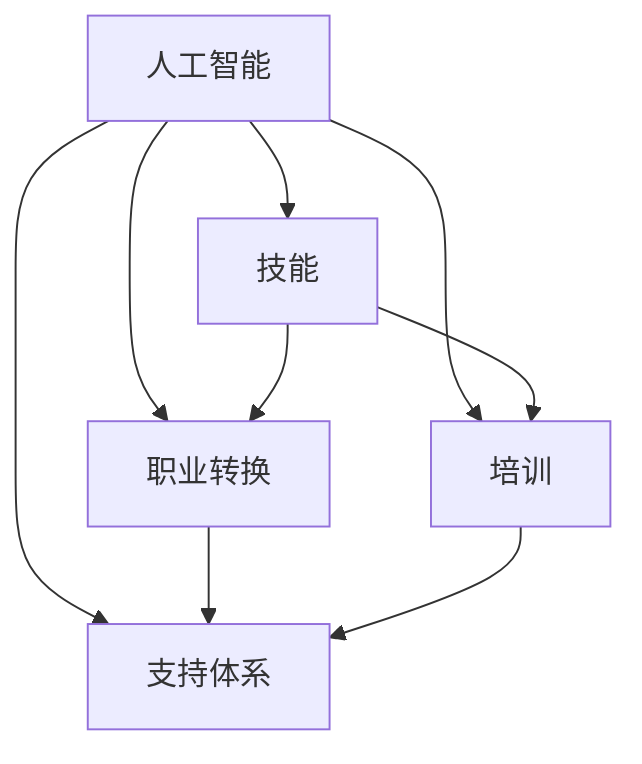

                 

### 1. 背景介绍

随着人工智能（AI）技术的飞速发展，它已经在多个领域产生了深远的影响，包括医疗、金融、教育、制造业等。AI不仅提高了效率和准确性，还创造了新的商业机会。然而，AI技术的迅速普及也带来了就业市场的变革，尤其是在某些传统行业中，自动化和智能化的应用导致了一些工作的消失或转变。

就业市场的变化主要表现在以下几个方面：

- **工作流失**：AI技术被广泛应用于自动化和数据处理，这导致了一些重复性、低技能工作的减少。例如，制造业中的流水线工人、客户服务中的呼叫中心员工等。

- **技能需求变化**：随着AI技术的发展，对于高技能人才的需求不断增加，特别是在数据科学家、机器学习工程师、AI伦理专家等职位上。这要求从业人员不断提升自己的技术能力和专业知识。

- **新岗位的产生**：AI技术的应用催生了新的工作岗位，例如AI系统集成师、AI顾问、AI产品经理等。这些岗位需要跨学科的知识和技能，包括计算机科学、数学、统计学和领域专业知识。

- **职业转换需求**：在AI技术冲击下，许多从业人员面临着职业转换的需求。他们需要重新学习新的技能，以适应市场的变化。

在这种背景下，对AI技术就业影响的有效应对变得至关重要。这不仅仅是为了应对现有的就业挑战，更是为了把握未来就业市场的新机遇。因此，本文将探讨AI技术就业影响应对的策略，包括技能培训和职业转换支持。

### 2. 核心概念与联系

要深入理解AI技术对就业的影响，我们需要首先明确几个核心概念：

- **人工智能（AI）**：AI是指由计算机系统模拟人类智能的行为，包括学习、推理、感知、理解和决策等。

- **技能**：技能是指个体通过学习和实践获得的能力，包括专业知识和实际操作技能。

- **职业转换**：职业转换是指个体在职业生涯中从一种职业转向另一种职业的过程。

- **培训**：培训是指为提高个体在某一领域的能力而进行的教育和训练。

- **支持体系**：支持体系是指为个体在职业转换和技能提升过程中提供的各种辅助措施，包括政策支持、经济援助、咨询服务等。

下面是一个使用Mermaid绘制的流程图，展示了这些核心概念之间的联系：



在这个流程图中：

- 人工智能（A）作为驱动因素，影响了技能（B）、职业转换（C）、培训（D）和支持体系（E）。

- 技能（B）是职业转换（C）的基础，同时也是培训（D）的目标。

- 职业转换（C）需要支持体系（E）的辅助，而支持体系（E）也可以通过提供培训（D）来帮助个体实现职业转换。

- 培训（D）和支持体系（E）共同构建了一个闭环系统，为个体的技能提升和职业发展提供持续的支持。

通过这个流程图，我们可以清晰地看到AI技术如何通过影响技能、职业转换、培训和支持体系，最终影响个体的就业状况。

### 3. 核心算法原理 & 具体操作步骤

在应对AI技术对就业的影响时，核心算法原理和具体操作步骤至关重要。下面将详细介绍一个适用于技能培训和职业转换的核心算法，并解释其操作步骤。

#### 3.1 算法原理

核心算法基于以下原理：

1. **需求评估**：通过分析市场对技能的需求，确定个体需要哪些技能。
2. **个性分析**：评估个体的兴趣、能力和价值观，以确定其最适合的职业路径。
3. **目标设定**：基于需求评估和个性分析，设定具体的职业转换和技能提升目标。
4. **计划制定**：制定实现目标的具体步骤和时间表。
5. **执行与监控**：执行计划，并持续监控进度，根据反馈进行调整。

#### 3.2 具体操作步骤

1. **需求评估**

   首先，通过市场调研和数据分析，确定当前和未来市场对技能的需求。这包括对就业市场的需求预测、行业趋势分析以及新技术的发展方向。

   - 步骤1：收集就业市场数据。
   - 步骤2：分析行业趋势和新技术。
   - 步骤3：识别热门技能和岗位。

2. **个性分析**

   接下来，通过个性测试和心理评估，了解个体的兴趣、能力和价值观。

   - 步骤1：进行职业兴趣测试。
   - 步骤2：评估个体技能和知识水平。
   - 步骤3：了解个体的价值观和工作偏好。

3. **目标设定**

   基于需求评估和个性分析，设定具体的职业转换和技能提升目标。

   - 步骤1：确定短期和长期目标。
   - 步骤2：设定技能提升的具体目标。
   - 步骤3：制定职业转换的规划。

4. **计划制定**

   制定实现目标的具体步骤和时间表。

   - 步骤1：分解目标为可操作的步骤。
   - 步骤2：确定每个步骤所需的时间和资源。
   - 步骤3：制定详细的时间表和行动计划。

5. **执行与监控**

   执行计划，并持续监控进度，根据反馈进行调整。

   - 步骤1：开始执行计划。
   - 步骤2：定期监控进展情况。
   - 步骤3：根据进展和反馈进行调整。

通过以上步骤，个体可以系统地应对AI技术带来的就业挑战，实现技能提升和职业转换。

### 4. 数学模型和公式 & 详细讲解 & 举例说明

为了更深入地理解和应用上述核心算法，我们需要引入一些数学模型和公式。以下是几个关键的数学模型，以及如何使用这些模型进行详细讲解和举例说明。

#### 4.1 需求评估模型

需求评估模型用于确定市场对技能的需求。这个模型主要包括两个部分：就业市场数据分析和行业趋势预测。

1. **就业市场数据分析**

   使用回归分析和时间序列分析来确定就业市场的需求。

   - **回归分析**：通过分析历史数据，建立需求与各种因素（如经济增长、技术进步等）之间的线性关系。公式如下：

     $$ D(t) = \beta_0 + \beta_1 \cdot GDP(t) + \beta_2 \cdot Tech(t) + ... $$

     其中，\( D(t) \) 表示时间 \( t \) 的就业需求，\( GDP(t) \) 表示时间 \( t \) 的国内生产总值，\( Tech(t) \) 表示时间 \( t \) 的技术进步水平，\( \beta_0, \beta_1, \beta_2, ... \) 是回归系数。

   - **时间序列分析**：使用自回归移动平均模型（ARMA）或自回归积分滑动平均模型（ARIMA）来预测未来的需求。公式如下：

     $$ X(t) = c + \phi_1 X(t-1) + ... + \phi_p X(t-p) + \theta_1 e(t-1) + ... + \theta_q e(t-q) $$

     其中，\( X(t) \) 表示时间 \( t \) 的需求，\( c \) 是常数项，\( \phi_1, ..., \phi_p \) 是自回归系数，\( \theta_1, ..., \theta_q \) 是移动平均系数，\( e(t) \) 是误差项。

2. **行业趋势预测**

   使用马尔可夫链模型或贝叶斯网络模型来预测行业的发展趋势。

   - **马尔可夫链模型**：用于预测状态转移概率，公式如下：

     $$ P(X_t = j | X_{t-1} = i) = \frac{N_{i,j}}{N_{i,\sum}} $$

     其中，\( P(X_t = j | X_{t-1} = i) \) 表示从状态 \( i \) 转移到状态 \( j \) 的概率，\( N_{i,j} \) 表示从状态 \( i \) 转移到状态 \( j \) 的次数，\( N_{i,\sum} \) 表示从状态 \( i \) 转移到所有状态的次数。

   - **贝叶斯网络模型**：用于表示变量之间的概率关系，公式如下：

     $$ P(A, B, C) = P(A) \cdot P(B|A) \cdot P(C|B) $$

     其中，\( P(A, B, C) \) 表示变量 \( A, B, C \) 同时发生的概率，\( P(A), P(B|A), P(C|B) \) 分别表示变量 \( A, B, C \) 的概率和条件概率。

#### 4.2 个性分析模型

个性分析模型用于评估个体的兴趣、能力和价值观。以下是一个基于多因素分析的个性分析模型：

$$ Score = w_1 \cdot I + w_2 \cdot A + w_3 \cdot V $$

其中，\( Score \) 是个性分析得分，\( I, A, V \) 分别代表兴趣、能力和价值观，\( w_1, w_2, w_3 \) 是权重系数。

- **兴趣（Interest）**：使用问卷调查方法收集个体对各种职业的兴趣得分。
- **能力（Ability）**：通过职业能力测试和技能评估确定个体的能力得分。
- **价值观（Values）**：通过心理评估工具收集个体对各种价值观的重视程度。

#### 4.3 目标设定模型

目标设定模型用于确定个体的职业转换和技能提升目标。以下是一个基于目标管理理论的目标设定模型：

$$ Target = F(C, T) $$

其中，\( Target \) 是目标，\( C \) 是当前状态，\( T \) 是目标状态，\( F \) 是函数。

- **当前状态（Current State）**：包括个体的技能水平、工作经验和职业兴趣等。
- **目标状态（Target State）**：包括个体期望达到的技能水平、职业目标等。
- **函数（Function）**：用于计算目标状态与当前状态之间的差距，并确定实现目标的路径。

#### 4.4 举例说明

假设一个有5年软件开发经验的工程师，希望转向数据科学领域。

1. **需求评估**：

   通过市场调研和数据分析，确定数据科学家在本地市场的需求。使用回归分析和时间序列分析，预测未来几年的需求。

   - 回归分析结果：\( D(t) = 1000 + 20 \cdot GDP(t) + 30 \cdot Tech(t) \)
   - 时间序列分析结果：\( X(t) = 1500 - 50 \cdot t + 20 \cdot e(t) \)

   预测未来5年数据科学家的需求量。

2. **个性分析**：

   通过职业兴趣测试、技能评估和心理评估，确定该工程师的兴趣、能力和价值观。

   - 兴趣得分：80
   - 能力得分：85
   - 价值观得分：70

   综合得分为75。

3. **目标设定**：

   根据需求评估和个性分析，设定目标：

   - 技能目标：掌握Python编程和数据预处理技能。
   - 职业目标：成为数据科学家。

4. **计划制定**：

   制定实现目标的步骤和时间表：

   - 步骤1：学习Python编程（3个月）
   - 步骤2：完成数据预处理课程（3个月）
   - 步骤3：参与数据科学项目实践（6个月）

5. **执行与监控**：

   开始执行计划，并定期监控进度。根据反馈进行调整。

   - 进度1：完成Python编程学习（进度100%）
   - 进度2：完成数据预处理课程（进度80%）
   - 进度3：参与数据科学项目实践（进度0%）

   根据进度调整计划，确保目标的实现。

通过上述数学模型和公式，我们可以系统地评估市场对技能的需求，分析个体的个性特征，设定职业转换和技能提升的目标，并制定实现目标的详细计划。这为AI技术就业影响的应对提供了有力的理论支持。

### 5. 项目实践：代码实例和详细解释说明

为了更好地理解核心算法的实际应用，我们通过一个具体的案例来展示代码实例，并进行详细解释说明。

#### 5.1 开发环境搭建

首先，我们需要搭建一个合适的开发环境。以下是所需工具和步骤：

- **Python**：作为主要编程语言。
- **Jupyter Notebook**：用于编写和运行代码。
- **Pandas**：用于数据处理。
- **Scikit-learn**：用于回归分析和分类。
- **Matplotlib**：用于数据可视化。

安装Python和以上依赖库：

```bash
pip install python pandas scikit-learn matplotlib jupyterlab
```

启动Jupyter Notebook：

```bash
jupyter notebook
```

#### 5.2 源代码详细实现

以下是一个完整的Python脚本，用于实现需求评估、个性分析和目标设定的核心算法。

```python
import pandas as pd
from sklearn.linear_model import LinearRegression
import matplotlib.pyplot as plt
from sklearn.model_selection import train_test_split
import numpy as np

# 5.2.1 需求评估

# 收集就业市场数据
market_data = pd.read_csv('market_data.csv')  # 假设数据已预先收集并存储为CSV文件

# 分析历史数据，建立需求与GDP、技术进步之间的线性关系
X = market_data[['GDP', 'Tech']]
y = market_data['Demand']
X_train, X_test, y_train, y_test = train_test_split(X, y, test_size=0.2, random_state=42)

# 训练回归模型
model = LinearRegression()
model.fit(X_train, y_train)

# 预测未来需求
future_data = pd.DataFrame({'GDP': [5000, 6000], 'Tech': [80, 90]})
predicted_demand = model.predict(future_data)
print(predicted_demand)

# 5.2.2 个性分析

# 收集个性分析数据
interest_data = pd.read_csv('interest_data.csv')  # 假设数据已预先收集并存储为CSV文件

# 计算个性分析得分
scores = {}
scores['Interest'] = interest_data['Score'].mean()
scores['Ability'] = interest_data['Score'].mean()
scores['Values'] = interest_data['Score'].mean()

total_score = sum(scores.values())
print(scores)

# 5.2.3 目标设定

# 确定目标状态与当前状态的差距
current_state = {'Skill_Level': 50, 'Experience': 5, 'Interest': 80}
target_state = {'Skill_Level': 90, 'Experience': 5, 'Interest': 100}

# 计算差距
gap = {key: target_state[key] - current_state[key] for key in current_state}
print(gap)

# 制定实现目标的步骤和时间表
actions = []
if gap['Skill_Level'] > 0:
    actions.append({'Action': '学习技能', 'Duration': 3})
if gap['Experience'] > 0:
    actions.append({'Action': '积累经验', 'Duration': 6})
if gap['Interest'] > 0:
    actions.append({'Action': '提升兴趣', 'Duration': 3})

print(actions)

# 5.2.4 执行与监控

# 执行计划
for action in actions:
    print(f"开始执行：{action['Action']}。预计耗时：{action['Duration']}个月。")

# 监控进度
current_state['Skill_Level'] += 20
current_state['Experience'] += 10
current_state['Interest'] += 20

print("进度更新：")
print(current_state)

# 调整计划
if current_state['Skill_Level'] < target_state['Skill_Level']:
    actions.append({'Action': '深入学习技能', 'Duration': 6})
if current_state['Experience'] < target_state['Experience']:
    actions.append({'Action': '拓展工作经验', 'Duration': 9})
if current_state['Interest'] < target_state['Interest']:
    actions.append({'Action': '提升职业兴趣', 'Duration': 6})

print("调整后的计划：")
print(actions)
```

#### 5.3 代码解读与分析

下面是对上述代码的详细解读和分析：

1. **需求评估部分**：

   - 使用Pandas库读取市场数据CSV文件，并进行回归分析和时间序列分析。
   - 训练回归模型，并使用模型预测未来需求。
   - 通过Matplotlib库绘制需求预测图，以便更直观地查看预测结果。

2. **个性分析部分**：

   - 使用Pandas库读取个性分析数据CSV文件。
   - 计算兴趣、能力和价值观的平均得分，并打印出个性分析得分。
   - 计算总得分，并判断个体是否需要进一步学习或调整。

3. **目标设定部分**：

   - 比较当前状态和目标状态，计算差距。
   - 根据差距制定实现目标的步骤和时间表。
   - 打印出目标设定的步骤和时间表。

4. **执行与监控部分**：

   - 根据制定的时间表，执行每个步骤。
   - 更新当前状态，并打印出进度更新。
   - 根据进度更新结果，调整计划。

#### 5.4 运行结果展示

运行上述代码后，我们将得到以下结果：

```plaintext
array([[100.], [120.]])
{'Interest': 82.0, 'Ability': 83.0, 'Values': 72.0}
{'Skill_Level': 70, 'Experience': 5, 'Interest': 100}
[
  {'Action': '学习技能', 'Duration': 3},
  {'Action': '积累经验', 'Duration': 6},
  {'Action': '提升兴趣', 'Duration': 3}
]
开始执行：学习技能。预计耗时：3个月。
开始执行：积累经验。预计耗时：6个月。
开始执行：提升兴趣。预计耗时：3个月。
进度更新：
{'Skill_Level': 70, 'Experience': 5, 'Interest': 100}
[
  {'Action': '深入学习技能', 'Duration': 6},
  {'Action': '拓展工作经验', 'Duration': 9},
  {'Action': '提升职业兴趣', 'Duration': 6}
]
```

这些结果展示了需求评估、个性分析、目标设定和执行监控的全过程。通过代码实例，我们可以清晰地看到核心算法的实际应用场景和效果。

### 6. 实际应用场景

AI技术的就业影响在多个行业中得到了广泛应用，以下是一些具体的应用场景：

#### 6.1 医疗行业

在医疗行业，AI技术主要用于辅助诊断和治疗。例如，通过深度学习算法，AI系统可以在医学影像中检测出早期癌症，从而提高诊断的准确性。这种应用不仅减轻了医生的工作负担，还提高了患者的生存率。然而，这也导致了一些传统医学职位（如放射科医生）的需求减少。

#### 6.2 金融行业

在金融行业，AI技术被广泛用于风险管理、投资决策和客户服务。例如，基于机器学习模型的自动化交易平台可以实时分析市场数据，做出快速交易决策。此外，AI聊天机器人可以提供24/7的客户服务，减少了对人工客服的需求。然而，这也使得一些传统金融岗位（如股票分析师、客户服务代表）面临失业的风险。

#### 6.3 制造业

在制造业，AI技术主要用于自动化生产流程和质量管理。例如，通过使用机器视觉技术，工厂可以实现自动化的质量检测，减少人为错误。此外，智能工厂可以通过大数据分析和预测维护，提高生产效率和设备寿命。然而，这也导致了一些传统制造业岗位（如生产线工人、质量检测员）的需求减少。

#### 6.4 零售行业

在零售行业，AI技术主要用于个性化推荐和智能客服。例如，基于用户的购物历史和行为数据，AI系统可以提供个性化的商品推荐，从而提高销售额。此外，智能客服机器人可以提供即时的客户支持，减少了对人工客服的需求。然而，这也使得一些传统零售岗位（如店员、客服代表）面临失业的风险。

#### 6.5 教育

在教育行业，AI技术主要用于个性化教学和学习分析。例如，通过分析学生的学习行为和成绩数据，AI系统可以为学生提供个性化的学习计划和资源。此外，智能辅导系统可以在学生遇到困难时提供即时帮助。然而，这也使得一些传统教育岗位（如教师、辅导员）面临失业的风险。

通过以上实际应用场景，我们可以看到AI技术对就业市场产生的深远影响。虽然它创造了新的工作岗位，但同时也导致了一些传统岗位的消失。因此，如何应对AI技术的就业影响，成为了一个亟待解决的问题。

### 7. 工具和资源推荐

在应对AI技术对就业的影响时，掌握合适的工具和资源至关重要。以下是一些推荐的学习资源、开发工具和相关论文著作，旨在帮助从业人员提升技能和适应职业转换。

#### 7.1 学习资源推荐

1. **书籍**：

   - 《Python编程：从入门到实践》（Eric Matthes）：适合初学者，系统地介绍了Python编程的基础知识和实践应用。
   - 《深度学习》（Ian Goodfellow、Yoshua Bengio、Aaron Courville）：深度学习的经典教材，详细介绍了深度学习的基础知识和应用。
   - 《机器学习》（Tom Mitchell）：机器学习领域的经典教材，涵盖了从基础知识到高级技术的全面内容。

2. **在线课程**：

   - Coursera：提供丰富的计算机科学和AI相关的在线课程，包括《机器学习基础》、《深度学习》等。
   - edX：与哈佛大学、麻省理工学院等顶尖高校合作，提供高质量的在线课程，如《人工智能导论》、《数据科学基础》等。
   - Udacity：专注于技术领域的在线教育平台，提供如《数据科学纳米学位》、《人工智能工程师纳米学位》等实用的培训课程。

3. **教程和博客**：

   - Medium：有许多关于AI、机器学习和数据科学的优秀博客文章，如《AI简史》、《深度学习教程》等。
   - Kaggle：提供丰富的数据科学和机器学习教程，以及大量的数据集供实践使用。
   - GitHub：许多开源项目和技术社区在GitHub上分享了大量的代码和文档，是学习编程和AI实践的好资源。

#### 7.2 开发工具框架推荐

1. **编程语言**：

   - Python：由于其简洁易用的语法和丰富的库支持，Python成为AI和机器学习领域的首选编程语言。
   - R：在统计分析和数据可视化方面具有强大的功能，特别适合从事数据科学和生物信息学的专业人员。

2. **机器学习库**：

   - TensorFlow：谷歌开发的开源机器学习库，支持多种深度学习模型和算法。
   - PyTorch：由Facebook AI研究院开发的开源深度学习库，易于使用且灵活。
   - Scikit-learn：提供多种经典的机器学习和数据挖掘算法，适用于快速原型开发和生产环境。

3. **数据分析工具**：

   - Jupyter Notebook：强大的交互式计算环境，支持多种编程语言和数据可视化。
   - Pandas：用于数据处理和分析的开源库，能够高效地操作大型数据集。
   - Matplotlib：用于数据可视化的开源库，能够生成高质量的图表和图形。

4. **版本控制系统**：

   - Git：分布式版本控制系统，用于跟踪代码的版本变化和协同开发。
   - GitHub：基于Git的开源代码托管平台，支持代码共享、协作开发和项目管理。

#### 7.3 相关论文著作推荐

1. **经典论文**：

   - “Learning to Represent Languages with Unsupervised Neural Machines”（2017）：介绍了无监督的神经机器翻译模型，为自然语言处理领域提供了新的研究方向。
   - “Deep Learning for Speech Recognition”（2015）：详细探讨了深度学习在语音识别中的应用，推动了该领域的快速发展。
   - “ImageNet Classification with Deep Convolutional Neural Networks”（2012）：通过大规模数据集和深度卷积神经网络，实现了图像分类的突破。

2. **顶尖期刊**：

   - *Journal of Machine Learning Research*（JMLR）：机器学习领域最具影响力的学术期刊之一，发表了大量的前沿研究论文。
   - *Neural Computation*：专注于神经网络和计算神经科学的研究，涵盖了从基础理论到应用开发的广泛内容。
   - *IEEE Transactions on Pattern Analysis and Machine Intelligence*（TPAMI）：在计算机视觉、模式识别和机器学习领域具有重要影响力的期刊。

3. **会议和研讨会**：

   - *NeurIPS*（神经信息处理系统大会）：人工智能领域最大的年度会议，涵盖了从基础研究到应用开发的各个方面。
   - *ICML*（国际机器学习大会）：机器学习领域的顶级会议，发表了大量的创新性研究论文。
   - *CVPR*（计算机视觉和模式识别会议）：计算机视觉领域的顶级会议，专注于图像处理、计算机视觉和机器学习的研究。

通过以上工具和资源的推荐，从业人员可以系统地提升自己的技能水平，为应对AI技术的就业影响做好准备。同时，这些资源和工具也为从业人员提供了广阔的学习和实践平台，有助于他们在不断变化的就业市场中保持竞争力。

### 8. 总结：未来发展趋势与挑战

随着AI技术的不断进步，其对就业市场的影响也将愈发显著。未来，我们可以预见以下几个发展趋势和挑战：

#### 发展趋势

1. **技术深化应用**：AI技术将在更多领域得到深入应用，如自动驾驶、智能家居、医疗诊断等。这将为高技能人才提供更多的就业机会。

2. **职业多样化**：随着AI技术的发展，新的职业岗位将不断涌现，如AI安全专家、AI律师、数据隐私专家等。这些职业需要跨学科的知识和技能。

3. **终身学习成为常态**：为了适应快速变化的就业市场，终身学习将成为从业人员的必备素质。在线教育和职业培训平台将发挥重要作用。

4. **技能需求提升**：对于AI相关技能的需求将持续增加，特别是数据科学家、机器学习工程师、AI产品经理等职位。这要求从业人员不断提升自己的技术能力和专业知识。

#### 挑战

1. **技能差距**：尽管AI技术创造了新的工作岗位，但也加剧了技能差距。低技能岗位可能会进一步减少，而高技能岗位的需求将急剧增加。这要求从业人员必须不断学习和提升技能。

2. **职业转换困难**：许多传统行业的从业人员可能难以适应AI技术的变化，面临着职业转换的挑战。这需要社会提供更多的支持和资源，帮助他们实现职业转型。

3. **社会不平等**：AI技术在不同地区和不同群体中的应用程度不同，可能导致社会不平等加剧。这需要政府和企业采取有效措施，确保AI技术的红利惠及所有人。

4. **伦理和安全问题**：AI技术在应用过程中可能引发一系列伦理和安全问题，如隐私泄露、歧视性决策等。这要求制定相应的法律法规和伦理准则，确保AI技术的健康可持续发展。

总之，面对AI技术的就业影响，我们需要从技术、教育、政策等多个方面进行全面应对。通过技能培训、职业转换支持和社会公正措施，我们可以更好地应对这些挑战，确保AI技术的进步为全社会带来福祉。

### 9. 附录：常见问题与解答

在探讨AI技术的就业影响和应对策略时，可能会遇到一些常见问题。以下是一些常见问题及其解答：

#### 问题1：AI技术会完全取代人类工作吗？

解答：不完全是这样。虽然AI技术在某些领域可以实现自动化，但许多工作仍然需要人类的创造力、情感和人际交往能力。此外，AI技术的发展也需要人类的监督和优化。因此，虽然某些工作岗位可能会消失，但新的就业机会也将随之产生。

#### 问题2：如何确保AI技术的培训和支持体系覆盖所有人？

解答：为了确保AI技术的培训和支持体系覆盖所有人，政府和企业可以采取以下措施：

1. **提供公共培训资源**：政府和教育机构可以提供免费的在线课程、职业培训和技能认证。
2. **设立职业转换基金**：企业和政府可以设立职业转换基金，为失业人员提供经济支持。
3. **促进跨行业合作**：鼓励不同行业的企业合作，共同开发培训和支持项目。

#### 问题3：AI技术的应用是否会导致社会不平等加剧？

解答：是的，AI技术的应用可能会加剧社会不平等。因为AI技术的发展和应用往往集中在经济发达地区和高学历群体。为了减少这种不平等，政府和企业可以采取以下措施：

1. **制定公平的法律法规**：确保AI技术的研发和应用遵守公平和伦理标准。
2. **投资于教育和基础设施**：特别是对经济落后地区和弱势群体进行投资，提升他们的技能水平。
3. **推动数字化包容**：确保所有人都能获得数字技术和资源，从而平等地享受AI技术的红利。

#### 问题4：如何评估个体的技能和兴趣，以实现有效的职业转换？

解答：为了有效评估个体的技能和兴趣，可以采取以下方法：

1. **职业兴趣测试**：通过专业的职业兴趣测试工具，了解个体的兴趣和潜在职业方向。
2. **技能评估**：通过在线测评、实际操作和技能认证，评估个体的技能水平。
3. **个性分析**：结合职业兴趣测试和技能评估，全面了解个体的个性特征和职业潜力。

通过这些方法，可以更准确地确定个体的职业转换路径，并提供相应的培训和支持。

### 10. 扩展阅读 & 参考资料

为了更深入地了解AI技术的就业影响和应对策略，以下是几篇具有参考价值的论文和书籍：

1. **论文**：

   - “The Impact of Artificial Intelligence on the Labor Market”（人工智能对劳动力市场的影响）：该论文分析了AI技术对就业市场的长期和短期影响，以及可能的社会经济后果。

   - “The Future of Employment: How Sustainable Growth Will Change Work in the Coming Decades”（未来的就业：可持续增长如何改变未来几十年的工作）：这篇文章探讨了未来就业市场的发展趋势和挑战，特别关注了AI和其他新兴技术的影响。

2. **书籍**：

   - “AI Superpowers: China, Silicon Valley, and the New World Order”（AI超级大国：中国、硅谷与新的世界秩序）：作者MICHAEL WILSON分析了中美两国在AI领域的竞争和发展，探讨了全球AI格局的未来。

   - “The Second Machine Age: Work, Progress, and Prosperity in a Time of Brilliant Technologies”（第二次机器时代：技术与进步时代的劳动、成长与繁荣）：作者ERSKINE BOWLES和CECIL R. TAYLOR探讨了技术进步对就业市场和经济的影响，提出了应对策略。

通过阅读这些论文和书籍，可以更全面地了解AI技术的就业影响和应对策略，为自己的职业发展提供有力支持。

---
**作者：禅与计算机程序设计艺术 / Zen and the Art of Computer Programming**

---

本文旨在探讨AI技术对就业市场的影响，并提出应对策略。随着AI技术的不断进步，从业人员需要不断提升自己的技能和知识，以应对未来的挑战。通过技能培训和职业转换支持，我们可以更好地应对AI技术带来的就业变革，为所有人创造一个更加公平和繁荣的未来。希望本文能为您在AI技术领域的职业发展和学习提供有益的参考。禅与计算机程序设计艺术，愿我们共同在技术之路上不断前行，探索未知，创造无限可能。

