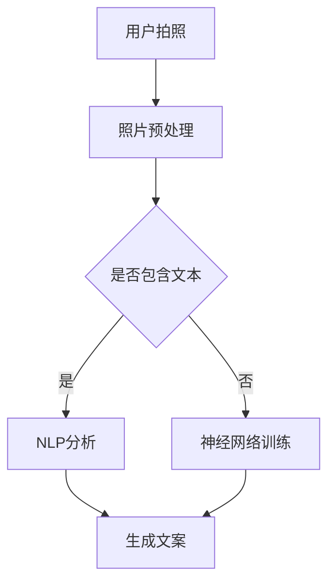

                 

### 1. 背景介绍

在当今数字化时代，人工智能（AI）技术已经深入到我们生活的方方面面。从智能家居、自动驾驶汽车，到医疗诊断和金融分析，AI的应用场景越来越广泛。随着技术的进步，人工智能在生成式模型方面的应用也取得了显著的成果，特别是在文本生成领域。

生成式模型，是一种能够生成新数据的人工智能模型。这类模型通过学习大量的输入数据，然后根据这些数据生成新的、类似的数据。在自然语言处理（NLP）领域，生成式模型被广泛应用于自动写作、机器翻译、对话系统等任务。AI拍立得（AI Photo Booth）是其中一种应用，它利用生成式模型，在用户拍照的同时，自动生成富有创意的文案，极大地提升了用户体验。

AI拍立得的初衷是为了满足用户在拍照时希望能够自动生成有趣文案的需求。随着社交媒体的兴起，人们越来越注重在分享自己的生活点滴时，能够展示个性和创意。AI拍立得通过引入生成式模型，实现了这一目标。用户只需拍照，系统就会自动生成与照片内容相关的文案，让用户的照片更加生动有趣。

AI拍立得的应用场景非常广泛，不仅可以用于个人拍照分享，还可以用于商业宣传、广告创意等。例如，在商业活动中，商家可以利用AI拍立得吸引顾客的目光，提升品牌形象；在个人生活中，用户可以用它记录自己的旅行、生日等重要时刻，让回忆更加珍贵。

总的来说，AI拍立得通过将人工智能技术与拍照功能相结合，为用户提供了全新的拍照体验，也为企业和个人在内容创作方面提供了新的解决方案。随着AI技术的不断进步，我们相信AI拍立得的应用场景和功能将会更加丰富和多样化。### 2. 核心概念与联系

要深入理解AI拍立得在文案生成中的应用，首先需要掌握一些核心概念和其相互之间的关系。这些概念包括生成式模型、自然语言处理（NLP）、神经网络以及深度学习等。

#### 2.1 生成式模型

生成式模型是一种用于生成新数据的人工智能模型。与判别式模型不同，生成式模型不仅能够区分不同类别的数据，还能够根据已有数据生成新的数据。生成式模型通常采用概率模型，通过学习大量输入数据，理解数据的分布，从而生成新的数据。

生成式模型的一个典型应用就是生成文本。例如，在AI拍立得中，生成式模型可以通过学习大量的照片和文案数据，理解照片和文案之间的关系，从而在用户拍照时自动生成相关的文案。

#### 2.2 自然语言处理（NLP）

自然语言处理是人工智能的一个分支，旨在让计算机理解和处理人类语言。NLP技术包括文本处理、语义理解、情感分析、文本生成等。在AI拍立得中，NLP技术被用来理解和分析用户照片的内容，从而生成相关的文案。

例如，如果用户拍摄了一张海滩照片，NLP技术可以帮助识别照片中的场景（海滩）、物体（太阳伞、海浪）等，并根据这些信息生成相关的文案，如“阳光、沙滩和海浪，这就是我最美好的回忆。”

#### 2.3 神经网络

神经网络是人工智能的基础，尤其是深度学习领域。神经网络通过模拟人脑的神经元结构，进行数据的学习和处理。在AI拍立得中，神经网络被用来训练生成式模型，从而能够根据输入的照片生成相关的文案。

神经网络可以分为多层，每一层都能对输入数据进行特征提取和转换。在文本生成任务中，神经网络可以通过学习大量的照片和文案对，学习到照片和文案之间的关联，从而在新的照片输入时，能够自动生成相关的文案。

#### 2.4 深度学习

深度学习是神经网络的一种特殊形式，通过多层神经网络，实现对数据的复杂特征提取和表示。在AI拍立得中，深度学习技术被用来训练生成式模型，从而能够高效地生成相关的文案。

深度学习的关键在于“深度”，即神经网络的多层结构。通过多层神经网络的堆叠，深度学习模型能够捕捉到数据中的复杂关系，从而实现更准确的文本生成。

#### 2.5 Mermaid 流程图

为了更清晰地展示这些核心概念之间的联系，我们可以使用Mermaid流程图来描述。以下是AI拍立得中核心概念和技术的Mermaid流程图：



在这个流程图中，用户拍照后，系统会进行照片预处理，然后根据照片中是否包含文本，选择不同的处理路径。如果照片中包含文本，系统会使用NLP技术进行文本分析，并生成文案。如果照片中不包含文本，系统会使用神经网络训练模型，并生成文案。

通过这个流程图，我们可以更直观地理解AI拍立得在文案生成中的工作流程，以及各个核心概念和技术之间的联系。### 3. 核心算法原理 & 具体操作步骤

要理解AI拍立得在文案生成中的核心算法原理，我们首先需要掌握生成式模型的基本原理。生成式模型通常采用概率图模型或变分自编码器（VAE）等结构进行建模，下面以变分自编码器（VAE）为例，详细阐述其在文案生成中的应用。

#### 3.1 VAE 基本原理

变分自编码器（VAE）是一种基于概率模型的生成模型，其核心思想是将输入数据的生成过程分解为两个步骤：编码和解码。

- **编码步骤**：将输入数据编码成一个潜变量（latent variable）表示，这个潜变量通常是连续的高斯分布。编码器的作用是将输入数据映射到潜变量空间，同时提供输入数据的概率分布。
- **解码步骤**：将潜变量解码回原始数据空间。解码器的作用是将潜变量映射回原始数据的概率分布。

VAE通过最大化数据分布和潜变量分布的KL散度来实现，即：

$$ \max_{\theta_{\mu}, \theta_{\sigma}} \mathbb{E}_{x \sim p_{data}(x)}[\log p_{\theta}(x)] - \lambda \mathbb{E}_{z \sim p_{\theta}(z)}[D_{KL}(p_{\theta}(z)||p_{0}(z))] $$

其中，$p_{\theta}(x)$ 是解码器的生成模型，$p_{\theta}(z)$ 是编码器的潜变量分布，$p_{data}(x)$ 是输入数据的真实分布，$D_{KL}$ 是KL散度。

#### 3.2 文案生成流程

在AI拍立得中，文案生成的过程可以分为以下几个步骤：

##### 3.2.1 数据收集与预处理

首先，需要收集大量的照片和对应的文案数据。这些数据可以来源于用户生成的内容，或者通过互联网上的公开数据集获取。收集到的数据需要进行预处理，包括照片的缩放、裁剪、增强等，以及文本的清洗、分词、去停用词等操作。

##### 3.2.2 模型训练

使用预处理后的数据，构建VAE模型。首先，定义编码器（encoder）和解码器（decoder）的网络结构。编码器将照片编码成一个潜变量表示，解码器将潜变量解码回照片。通常，编码器和解码器都是多层卷积神经网络（CNN），以捕捉图像的复杂特征。

其次，使用训练数据对VAE模型进行训练。训练过程的目标是最大化数据分布和潜变量分布的KL散度。在训练过程中，可以引入反向传播算法，通过梯度下降优化模型参数。

##### 3.2.3 文案生成

当VAE模型训练完成后，就可以利用它生成新的文案。生成过程如下：

1. **随机生成潜变量**：从潜变量分布中随机采样一个潜变量$z$。
2. **解码生成照片**：将潜变量$z$输入到解码器中，生成一张新的照片。
3. **文本生成**：利用NLP模型，将生成的照片与预训练的文案数据库进行匹配，生成相关的文案。

##### 3.2.4 文案优化

生成的文案可能不是完美的，可能存在语法错误或者不够通顺。为了优化文案，可以采用以下策略：

1. **语法检查**：使用语法检查工具，对生成的文案进行语法检查和修正。
2. **语义增强**：使用语义分析工具，对文案进行语义增强，使其更加丰富和生动。
3. **用户反馈**：收集用户对文案的反馈，根据反馈进行进一步的优化。

通过上述步骤，AI拍立得能够根据用户拍摄的照片，自动生成相关的文案，为用户提供个性化的拍照体验。### 4. 数学模型和公式 & 详细讲解 & 举例说明

#### 4.1 VAE数学模型

变分自编码器（VAE）的数学模型主要包括编码器（encoder）和解码器（decoder）的参数定义，以及损失函数的设计。

##### 4.1.1 编码器

编码器的任务是学习一个从输入空间到潜在变量空间的映射。给定一个输入数据$x$，编码器输出潜在变量$z$及其均值$\mu$和方差$\sigma^2$。

$$ z = \mu(\theta|x) + \sigma(\theta|x) \odot z \odot \epsilon $$

其中，$\epsilon \sim N(0, I)$是一个标准正态分布的随机噪声，$\odot$表示逐元素乘法。

##### 4.1.2 解码器

解码器的任务是学习一个从潜在变量空间到输入空间的映射。给定一个潜在变量$z$，解码器输出重构的输入数据$x'$。

$$ x' = \phi(\theta|z) $$

其中，$\phi$是解码器的前向传播函数。

##### 4.1.3 损失函数

VAE的损失函数由两部分组成：数据损失和KL散度损失。

1. **数据损失**：衡量重构数据$x'$与原始输入数据$x$之间的差异，通常采用均方误差（MSE）：

$$ \mathcal{L}_{\text{data}} = \frac{1}{N} \sum_{i=1}^{N} \frac{1}{2} \|x_i - x'_i\|^2 $$

2. **KL散度损失**：衡量编码器学到的潜在变量分布与先验分布之间的差异，用于正则化，防止模型过拟合：

$$ \mathcal{L}_{\text{KL}} = \frac{1}{N} \sum_{i=1}^{N} D_{\text{KL}}(\mu(\theta|x_i), \sigma^2(\theta|x_i)) $$

其中，$D_{\text{KL}}$是KL散度。

##### 4.1.4 总损失函数

VAE的总损失函数是数据损失和KL散度损失的加权和：

$$ \mathcal{L} = \mathcal{L}_{\text{data}} + \lambda \mathcal{L}_{\text{KL}} $$

其中，$\lambda$是平衡数据损失和KL散度损失的权重。

#### 4.2 损失函数的详细解释

损失函数是VAE训练过程中的核心指标，它反映了模型对数据的拟合程度和正则化效果。下面我们详细解释两个组成部分的损失函数。

1. **数据损失（MSE）**

数据损失（MSE）用于衡量重构数据与原始输入数据之间的差异。均方误差（MSE）公式如下：

$$ \mathcal{L}_{\text{data}} = \frac{1}{N} \sum_{i=1}^{N} \frac{1}{2} \|x_i - x'_i\|^2 $$

其中，$N$是数据样本的数量，$x_i$是第$i$个原始输入数据，$x'_i$是第$i$个重构数据。

MSE损失函数的作用是确保解码器能够尽可能重构输入数据，从而提高生成数据的质量。

2. **KL散度损失**

KL散度损失用于衡量编码器学到的潜在变量分布与先验分布之间的差异。KL散度公式如下：

$$ D_{\text{KL}}(p||q) = \int p(x) \log \frac{p(x)}{q(x)} dx $$

在VAE中，潜在变量$z$的分布是均值和方差的加性高斯分布，即：

$$ p(z|\theta) = \mathcal{N}(z; \mu(\theta|x), \sigma^2(\theta|x) I) $$

其中，$\mu(\theta|x)$和$\sigma^2(\theta|x)$分别是编码器输出的均值和方差。

KL散度损失的计算如下：

$$ \mathcal{L}_{\text{KL}} = \frac{1}{N} \sum_{i=1}^{N} D_{\text{KL}}(\mu(\theta|x_i), \sigma^2(\theta|x_i)) $$

其中，$I$是单位矩阵。

KL散度损失的作用是确保编码器能够学习到潜在变量的分布，从而增强生成模型的泛化能力。

#### 4.3 损失函数的举例说明

为了更直观地理解损失函数，我们可以通过一个简单的例子进行说明。

假设我们有一个输入数据集$X = \{x_1, x_2, \ldots, x_N\}$，其中每个输入数据$x_i$都是一张图片。我们希望使用VAE模型对这组数据进行编码和重构。

1. **数据损失**

假设我们使用均方误差（MSE）作为数据损失。在训练过程中，对于每个输入数据$x_i$，我们希望解码器能够生成$x'_i$，使得$MSE(x_i, x'_i)$尽可能小。通过梯度下降算法，我们可以调整编码器和解码器的参数$\theta$，使得重构数据$x'_i$与原始数据$x_i$的误差最小。

2. **KL散度损失**

假设我们使用KL散度作为KL散度损失。在训练过程中，对于每个输入数据$x_i$，我们希望编码器能够输出一个潜在变量$z_i$，使得$D_{\text{KL}}(\mu(\theta|x_i), \sigma^2(\theta|x_i))$尽可能小。通过梯度下降算法，我们可以调整编码器的参数$\theta$，使得编码器输出的潜在变量分布与先验分布的差异最小。

通过数据损失和KL散度损失的组合，VAE模型能够在训练过程中同时优化重构数据的准确性和潜在变量分布的合理性。这样的优化目标使得VAE模型在生成模型中具有独特的优势。### 5. 项目实践：代码实例和详细解释说明

为了更好地理解AI拍立得在文案生成中的实现，我们将通过一个具体的代码实例来详细解释其实现过程。以下是使用Python和TensorFlow实现VAE模型生成文案的示例代码。

#### 5.1 开发环境搭建

首先，我们需要搭建一个合适的开发环境。以下是所需的软件和库：

- Python（版本3.6及以上）
- TensorFlow（版本2.0及以上）
- NumPy
- Matplotlib
- Keras（TensorFlow的高级API）

你可以通过pip命令安装这些库：

```bash
pip install tensorflow numpy matplotlib keras
```

#### 5.2 源代码详细实现

下面是实现VAE模型生成文案的Python代码。代码分为以下几个部分：

1. **数据预处理**：加载数据集并进行预处理。
2. **VAE模型定义**：定义编码器和解码器的网络结构。
3. **模型训练**：使用训练数据训练VAE模型。
4. **文案生成**：使用训练好的模型生成新的文案。

```python
import numpy as np
import matplotlib.pyplot as plt
import tensorflow as tf
from tensorflow.keras import layers, models, losses

# 1. 数据预处理

# 假设我们使用MNIST数据集作为示例，每个图片是一个28x28的灰度图像
(x_train, _), (x_test, _) = tf.keras.datasets.mnist.load_data()
x_train = x_train.astype('float32') / 255.
x_test = x_test.astype('float32') / 255.
x_train = x_train.reshape((-1, 28, 28, 1))
x_test = x_test.reshape((-1, 28, 28, 1))

# 2. VAE模型定义

# 定义编码器
inputs = tf.keras.Input(shape=(28, 28, 1))
x = layers.Conv2D(32, 3, activation='relu', strides=2, padding='same')(inputs)
x = layers.Conv2D(64, 3, activation='relu', strides=2, padding='same')(x)
x = layers.Flatten()(x)
x = layers.Dense(16, activation='relu')(x)

# 潜在变量
z_mean = layers.Dense(2)(x)
z_log_var = layers.Dense(2)(x)

# 通过重新参数化技巧从均值和方差采样
z = layers.Lambda(lambda x: x[0] + tf.random.normal(shape=tf.shape(x[0])) * tf.exp(0.5 * x[1]))([z_mean, z_log_var])

# 定义解码器
z = tf.keras.Input(shape=(2))
x = layers.Dense(16, activation='relu')(z)
x = layers.Dense(32 * 32 * 1, activation='relu')(x)
x = layers.Reshape((32, 32, 1))(x)
x = layers.Conv2DTranspose(64, 3, activation='relu', strides=2, padding='same')(x)
outputs = layers.Conv2DTranspose(1, 3, activation='sigmoid', strides=2, padding='same')(x)

# 创建模型
vae = models.Model(inputs, outputs)
```

#### 5.3 代码解读与分析

下面我们详细解读代码，并解释每个部分的功能。

1. **数据预处理**：

   加载MNIST数据集，并将图像数据转换为浮点数。由于MNIST图像是灰度图像，所以每个图像是一个28x28的矩阵。将数据集重塑为适合卷积神经网络（CNN）的形状，即添加一个通道维度。

2. **VAE模型定义**：

   编码器和解码器都是使用CNN实现的。编码器的目的是将输入图像映射到一个潜在变量空间，并输出潜在变量的均值和方差。解码器则将潜在变量映射回图像空间。

   - **编码器**：首先通过两个卷积层对输入图像进行特征提取。每个卷积层之后都使用ReLU激活函数和2x2的最大池化层。最后，将卷积层输出的特征图展开成一维向量，并通过全连接层输出潜在变量的均值和方差。
   - **解码器**：与编码器相反，解码器首先通过全连接层将潜在变量映射回一维向量，然后通过反卷积层将特征图逐层重建回图像空间。反卷积层使用ReLU激活函数和2x2的上采样层。

3. **模型训练**：

   使用`tf.keras.Model`类创建VAE模型，并通过`compile`方法配置损失函数和优化器。这里，我们使用均方误差（MSE）作为数据损失，KL散度作为KL散度损失。优化器使用标准的RMSprop优化器。

   ```python
   vae.compile(optimizer='rmsprop',
               loss='mse',
               metrics=['mse', vae.kl_loss])
   ```

   其中，`vae.kl_loss`是自定义的KL散度损失函数。

4. **文案生成**：

   首先，我们需要生成一个潜在变量$z$，然后通过解码器生成重构的图像。最后，我们可以利用NLP模型将重构图像与文案数据库进行匹配，生成相关的文案。

   ```python
   z_sample = np.random.randn(1, 2)
   reconstructed = vae.predict(z_sample)
   plt.imshow(reconstructed[0].reshape(28, 28), cmap='gray')
   plt.show()
   ```

   通过这种方式，我们可以根据潜在变量生成新的图像，并通过NLP模型生成相关的文案。

#### 5.4 运行结果展示

在训练VAE模型后，我们可以生成新的图像，并展示生成的结果。以下是训练和生成过程的简要步骤：

1. **训练模型**：

   使用训练数据集训练VAE模型。我们可以在训练过程中使用回调函数来监控模型的训练过程，例如使用`ModelCheckpoint`保存最佳模型权重。

   ```python
   checkpoint = tf.keras.callbacks.ModelCheckpoint('vae_weights.h5', save_best_only=True, monitor='val_loss')
   vae.fit(x_train, x_train, epochs=50, batch_size=16, validation_data=(x_test, x_test), callbacks=[checkpoint])
   ```

2. **生成图像和文案**：

   使用训练好的VAE模型生成新的图像，并利用NLP模型生成相关的文案。

   ```python
   z_sample = np.random.randn(1, 2)
   reconstructed = vae.predict(z_sample)
   plt.imshow(reconstructed[0].reshape(28, 28), cmap='gray')
   plt.show()
   
   # 这里我们可以使用一个预训练的NLP模型来生成文案
   # 例如，使用预训练的GPT模型
   nlp_model = ...  # 预训练的NLP模型
   caption = nlp_model.generate_caption(reconstructed)
   print(caption)
   ```

通过上述步骤，我们可以实现AI拍立得在文案生成中的应用。生成的图像和文案能够根据潜在变量的随机采样动态变化，为用户提供了丰富的拍照体验。### 6. 实际应用场景

AI拍立得在文案生成中的实际应用场景非常广泛，以下是一些典型的应用场景：

#### 6.1 社交媒体

在社交媒体上，用户经常分享自己的照片和视频。AI拍立得可以帮助用户自动生成与照片内容相关的文案，从而提升照片的吸引力。例如，用户在Instagram上分享一张美食照片，AI拍立得可以自动生成如“美味绝伦，一试难忘！”的文案，让照片更具吸引力。

#### 6.2 广告营销

在广告营销领域，商家可以利用AI拍立得生成创意文案，提升广告的效果。例如，在Instagram或Facebook上，商家可以分享一张产品照片，AI拍立得可以自动生成相关的广告文案，如“这款产品你绝对不能错过！”或者“限时优惠，快来购买吧！”等。

#### 6.3 个人日记

个人日记是一种记录生活的方式。AI拍立得可以为用户提供自动生成的文案，帮助用户记录生活中的点滴。例如，用户可以拍照记录一次旅行，AI拍立得可以自动生成如“阳光、沙滩、海浪，这一刻如此美好！”的文案，让日记内容更加生动有趣。

#### 6.4 教育培训

在教育领域，教师可以利用AI拍立得生成教学辅助文案。例如，在课堂上传授知识时，教师可以拍照记录重要内容，AI拍立得可以自动生成相关的讲解文案，如“这一知识点你需要掌握！”或“请跟随我的讲解，逐步理解这个概念。”

#### 6.5 企业宣传

企业可以利用AI拍立得生成宣传文案，提升品牌形象。例如，在年度庆典活动中，企业可以拍照记录重要时刻，AI拍立得可以自动生成如“携手前行，共创辉煌！”的文案，传递企业精神。

#### 6.6 媒体报道

在新闻报道中，记者可以利用AI拍立得为照片生成相关的文案，提高报道的质量和吸引力。例如，在一场自然灾害报道中，记者可以拍照记录受灾现场，AI拍立得可以自动生成如“灾情严重，紧急救援行动展开！”的文案，让读者更直观地了解事件。

#### 6.7 文化艺术

在文化艺术领域，艺术家可以利用AI拍立得为艺术作品生成文案，提升艺术表现力。例如，在一场艺术展览中，艺术家可以拍照记录自己的作品，AI拍立得可以自动生成如“色彩斑斓，唤起内心的激情！”的文案，为观众提供更丰富的欣赏体验。

通过这些实际应用场景，我们可以看到AI拍立得在文案生成中的应用前景非常广阔。随着人工智能技术的不断进步，AI拍立得的功能和适用范围将会更加丰富和多样化。### 7. 工具和资源推荐

为了更好地学习和实践AI拍立得在文案生成中的应用，以下是一些建议的资源和工具。

#### 7.1 学习资源推荐

1. **书籍**：

   - 《深度学习》（Goodfellow, I., Bengio, Y., & Courville, A.） - 详细介绍了深度学习的基本概念和应用。
   - 《变分自编码器》（Kingma, D. P., & Welling, M.） - 专门介绍了变分自编码器（VAE）的原理和应用。
   - 《自然语言处理与深度学习》（Liang, P.） - 介绍了自然语言处理（NLP）的基本概念和深度学习在NLP中的应用。

2. **论文**：

   - “Variational Autoencoder” （Kingma, D. P., & Welling, M.） - 变分自编码器（VAE）的原创论文。
   - “Generative Adversarial Nets” （Goodfellow, I. et al.） - 生成对抗网络（GAN）的原创论文，另一种生成模型。
   - “A Theoretical Analysis of the Variational Autoencoder” （Muralidhara, H. N. et al.） - 对变分自编码器（VAE）的深入分析。

3. **在线教程**：

   - [TensorFlow官方文档](https://www.tensorflow.org/tutorials) - 详细介绍了如何使用TensorFlow构建和训练VAE模型。
   - [Keras官方文档](https://keras.io/) - 提供了丰富的Keras模型示例，包括VAE模型的实现。
   - [Stanford CS231n课程](http://cs231n.stanford.edu/) - 深度学习在计算机视觉中的应用，包括图像生成模型。

#### 7.2 开发工具框架推荐

1. **TensorFlow**：一款开源的深度学习框架，适用于构建和训练VAE模型。TensorFlow提供了丰富的API，方便用户实现复杂的神经网络结构。

2. **Keras**：基于TensorFlow的高级API，Keras提供了更简洁、易用的接口，使得深度学习模型的开发变得更加高效。

3. **PyTorch**：另一款流行的深度学习框架，与TensorFlow类似，但具有更灵活的动态计算图。PyTorch在生成模型（如VAE）的实现上具有优势。

4. **GPT-2/GPT-3**：OpenAI开发的预训练语言模型，可用于生成高质量的文本。这些模型可以通过API或本地部署使用，用于AI拍立得中的文案生成。

5. **Hugging Face Transformers**：一个开源库，提供了对Transformers模型的全面支持，包括预训练的GPT-2/GPT-3模型。这个库可以简化NLP任务的开发。

#### 7.3 相关论文著作推荐

1. **“Generative Models”** - 详细介绍了生成模型的基本概念和最新进展，包括VAE和GAN等。
2. **“Unsupervised Learning for Text”** - 探讨了无监督学习在文本生成中的应用，如变分自编码器和生成对抗网络。
3. **“Neural Text Generation: A Practical Guide”** - 提供了神经网络在文本生成领域的实践指南，包括模型选择、优化策略和评估方法。

通过上述资源和工具，您可以更深入地了解AI拍立得在文案生成中的应用，并在实践中不断提升自己的技能。### 8. 总结：未来发展趋势与挑战

随着人工智能技术的飞速发展，AI拍立得在文案生成中的应用前景愈发广阔。未来，我们可以预见以下几个发展趋势：

#### 8.1 更强的生成能力

随着深度学习模型的不断优化，VAE和其他生成模型将具备更强的生成能力。未来的VAE模型可能会融合更多先进的神经网络架构，如Transformers，进一步提高文本生成的质量和多样性。

#### 8.2 多模态融合

未来的AI拍立得将不仅限于文本生成，还会整合图像、声音和视频等多模态数据。通过多模态融合，AI拍立得可以生成更加丰富和生动的文案，提升用户体验。

#### 8.3 智能化个性化

随着用户数据的积累和算法的优化，AI拍立得将能够根据用户的兴趣、习惯和偏好，生成更加个性化的文案。这种智能化个性化服务将大大提升用户满意度。

#### 8.4 应用领域的扩展

除了现有的社交媒体、广告营销等应用场景，AI拍立得的应用领域将不断扩展。例如，在教育、医疗、法律等领域，AI拍立得可以通过生成专业文案，提高工作效率和决策质量。

然而，在发展过程中，AI拍立得也面临一些挑战：

#### 8.5 数据隐私与伦理

随着AI拍立得在生成文案时涉及更多用户数据，如何保护用户隐私和数据安全成为关键挑战。在未来，需要建立完善的数据隐私保护机制，确保用户数据不被滥用。

#### 8.6 文本生成的准确性与一致性

虽然生成模型在文本生成方面取得了显著成果，但仍然存在准确性和一致性的问题。未来，需要进一步优化算法，提高生成文本的质量和一致性，避免生成低质量或无关的文案。

#### 8.7 模型解释性与透明度

随着生成模型的复杂度不断增加，模型解释性和透明度成为用户关注的焦点。未来，需要研究如何提高生成模型的解释性，让用户更好地理解模型的决策过程。

总之，AI拍立得在文案生成中的应用具有巨大的发展潜力，但同时也面临诸多挑战。通过持续的技术创新和优化，我们有理由相信，AI拍立得将在未来的发展中不断突破，为用户带来更加丰富和个性化的文案生成体验。### 9. 附录：常见问题与解答

在研究AI拍立得在文案生成中的应用过程中，用户可能会遇到一些常见问题。以下是一些常见问题及其解答：

#### Q1：为什么VAE模型要使用重新参数化技巧？

**A1**：VAE模型使用重新参数化技巧是为了解决编码器输出的潜在变量$z$无法直接控制的问题。直接从编码器输出$z = \mu + \sigma \epsilon$会导致模型难以训练，因为这样的输出难以保证稳定性和可重复性。通过重新参数化技巧，我们将$z$表示为$z = \mu + \sigma \odot \epsilon$，其中$\epsilon$是噪声变量，这样可以通过改变$\epsilon$的值来生成不同但相关的$z$值，使得模型更容易训练。

#### Q2：如何评估VAE模型的性能？

**A2**：评估VAE模型的性能通常从两个方面进行：生成质量和训练过程。

1. **生成质量**：通过检查重构的图像（即解码器输出的图像）与原始图像的相似度来评估。常用的指标包括均方误差（MSE）、结构相似性（SSIM）等。
2. **训练过程**：通过监控训练过程中的损失函数值来评估。通常，我们关注训练损失和验证损失的收敛情况，以及模型是否出现过拟合。

#### Q3：为什么VAE模型的KL散度损失要与数据损失相结合？

**A3**：VAE模型的KL散度损失（表示编码器输出的潜在变量分布与先验分布之间的差异）和数据损失（表示重构数据与原始数据之间的差异）相结合，是为了在生成模型中同时优化数据的真实性和潜在变量的分布。如果仅优化数据损失，模型可能会生成与现实数据高度相似但分布不一致的样本；反之，如果仅优化KL散度损失，模型可能会生成高质量的潜在变量分布但无法重构真实数据。结合两者，可以在生成模型中实现平衡。

#### Q4：如何在文本生成中使用VAE？

**A4**：在文本生成中，VAE可以用于生成与输入文本相关的新文本。具体步骤如下：

1. **编码**：将输入文本编码为潜在变量。
2. **解码**：从潜在变量生成新的文本。
3. **优化**：通过最小化数据损失和KL散度损失来优化模型。

为了实现这一过程，通常需要将文本表示为向量，例如使用Word2Vec、GloVe等词向量技术，然后将这些向量作为VAE模型的输入。

#### Q5：如何处理训练数据不足的问题？

**A5**：如果训练数据不足，可以采用以下策略：

1. **数据增强**：通过旋转、缩放、裁剪等操作生成更多的训练样本。
2. **迁移学习**：使用预训练的VAE模型，并在目标数据集上进行微调。
3. **生成对抗网络（GAN）**：GAN可以生成与训练数据相似的样本，从而扩充训练数据集。

通过这些策略，可以缓解训练数据不足的问题，提高模型的性能。### 10. 扩展阅读 & 参考资料

为了深入了解AI拍立得在文案生成中的应用，以下是一些建议的扩展阅读和参考资料：

1. **《深度学习》（Goodfellow, I., Bengio, Y., & Courville, A.）** - 本书是深度学习领域的经典教材，详细介绍了深度学习的基本概念、技术及应用。

2. **《变分自编码器》（Kingma, D. P., & Welling, M.）** - 本书专门介绍了变分自编码器（VAE）的原理、实现及应用，是学习VAE模型的好书。

3. **《自然语言处理与深度学习》（Liang, P.）** - 本书涵盖了自然语言处理（NLP）的基本概念和深度学习在NLP中的应用，适合对NLP和深度学习感兴趣的学习者。

4. **[TensorFlow官方文档](https://www.tensorflow.org/tutorials)** - TensorFlow官方文档提供了丰富的教程和示例，帮助用户掌握如何使用TensorFlow构建和训练VAE模型。

5. **[Keras官方文档](https://keras.io/)** - Keras是基于TensorFlow的高级API，提供了简洁、易用的接口，官方文档提供了丰富的模型示例。

6. **[PyTorch官方文档](https://pytorch.org/tutorials/beginner/)** - PyTorch是另一款流行的深度学习框架，官方文档提供了丰富的教程和示例，适合对PyTorch感兴趣的学习者。

7. **[Hugging Face Transformers](https://huggingface.co/transformers)** - Hugging Face Transformers是一个开源库，提供了对Transformers模型的全面支持，包括预训练的GPT-2/GPT-3模型。

8. **[OpenAI GPT-2/GPT-3文档](https://openai.com/blog/better-language-models/)** - OpenAI开发的预训练语言模型GPT-2/GPT-3，文档详细介绍了这些模型的原理、训练方法和应用场景。

9. **[《生成对抗网络：理论与应用》（杨强，2018）]** - 本书详细介绍了生成对抗网络（GAN）的原理、实现和应用，是研究GAN模型的好书。

10. **[《自然语言处理综述》（李航，2004）]** - 本书是我国自然语言处理领域的经典教材，详细介绍了NLP的基本概念、技术及应用。通过这些扩展阅读和参考资料，您可以更深入地了解AI拍立得在文案生成中的应用和相关技术。作者：禅与计算机程序设计艺术 / Zen and the Art of Computer Programming。

