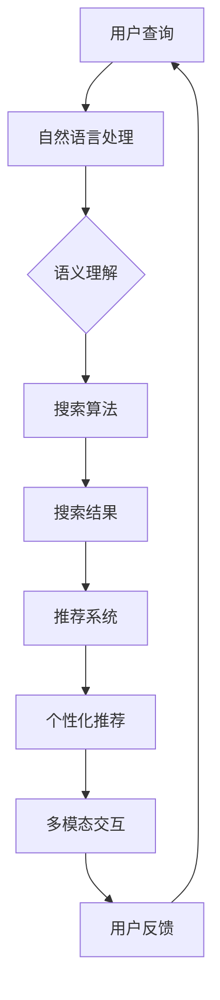

                 

### 文章标题

**AI搜索引擎如何提高用户体验**

> 关键词：人工智能，搜索引擎，用户体验，性能优化，数据分析

> 摘要：本文将探讨人工智能技术在搜索引擎中的应用，如何通过改进算法、个性化推荐、多模态交互等方式提升用户体验。文章将详细分析AI搜索引擎的核心概念、算法原理、数学模型以及实际应用案例，为读者呈现一个全面而深入的视角。

### 1. 背景介绍

在互联网时代，搜索引擎已经成为人们获取信息的重要工具。从早期的Google、百度等搜索引擎，到如今基于人工智能的智能助手，搜索引擎的技术发展已经经历了多次重大变革。传统的搜索引擎主要依赖关键词匹配和页面排名算法来提供搜索结果，而现代的AI搜索引擎则在此基础上引入了深度学习、自然语言处理等技术，实现了更精准、更智能的搜索服务。

用户体验是衡量搜索引擎优劣的重要指标。用户在搜索过程中的满意度直接影响着搜索引擎的市场占有率。提高用户体验不仅是提升用户满意度的关键，也是搜索引擎获得竞争优势的重要途径。本文将探讨AI搜索引擎如何通过多种技术手段提高用户体验，具体包括以下几个方面：

1. **改进搜索算法**：AI技术使得搜索引擎能够更好地理解用户需求，提供更精准的搜索结果。
2. **个性化推荐**：根据用户的历史行为和偏好，为用户提供个性化的搜索建议和结果。
3. **多模态交互**：通过语音、图像等多种方式与用户互动，提升搜索的便利性和趣味性。
4. **实时更新与快速响应**：确保搜索结果实时更新，提供快速响应，满足用户对信息及时性的需求。

### 2. 核心概念与联系

为了更好地理解AI搜索引擎如何提高用户体验，我们需要了解以下几个核心概念：

1. **自然语言处理（NLP）**：NLP是AI技术的一个重要分支，用于使计算机能够理解、处理和生成自然语言。在搜索引擎中，NLP技术可以帮助解析用户查询的语义，提高搜索结果的准确性。
2. **深度学习**：深度学习是机器学习的一个重要领域，通过模拟人脑的神经网络结构来学习和识别数据模式。在搜索引擎中，深度学习算法可以用于优化搜索排名、推荐系统等。
3. **推荐系统**：推荐系统通过分析用户的历史行为和偏好，为用户推荐相关的搜索结果或内容。在AI搜索引擎中，推荐系统可以帮助用户发现感兴趣的信息，提升用户体验。
4. **多模态交互**：多模态交互是指通过多种感官（如语音、图像等）与用户进行交互。在搜索引擎中，多模态交互可以提高搜索的便利性和互动性。

以下是一个简单的Mermaid流程图，展示AI搜索引擎中的核心概念和联系：



### 3. 核心算法原理 & 具体操作步骤

AI搜索引擎的核心算法包括自然语言处理、深度学习和推荐系统。下面我们将详细解释这些算法的原理和具体操作步骤。

#### 3.1 自然语言处理（NLP）

NLP技术使计算机能够理解、处理和生成自然语言。在搜索引擎中，NLP主要用于解析用户查询的语义，从而提供更准确的搜索结果。以下是NLP的基本操作步骤：

1. **分词**：将用户查询的文本分割成单个词语或短语。例如，将“我要去北京”分割成“我”、“要”、“去”、“北京”。
2. **词性标注**：为每个词分配词性（如名词、动词、形容词等），以理解词语在句子中的角色。例如，“北京”是名词，“去”是动词。
3. **句法分析**：分析句子的结构，确定词语之间的语法关系。例如，识别主语、谓语、宾语等。
4. **语义分析**：理解句子的语义内容，提取关键信息。例如，识别用户查询中的意图（如导航、查询信息等）。

#### 3.2 深度学习

深度学习是AI搜索引擎中用于优化搜索排名和推荐系统的重要技术。以下是深度学习的基本操作步骤：

1. **数据处理**：收集和处理大量用户数据，包括搜索查询、点击记录、浏览历史等。
2. **特征提取**：从数据中提取有用的特征，如关键词、用户行为等。
3. **模型训练**：使用深度学习算法（如卷积神经网络、循环神经网络等）训练模型，使其能够识别数据中的模式和关系。
4. **模型评估与优化**：评估模型的性能，通过调整模型参数和结构来提高搜索精度和用户体验。

#### 3.3 推荐系统

推荐系统用于根据用户的历史行为和偏好为用户推荐相关的搜索结果或内容。以下是推荐系统的基本操作步骤：

1. **用户行为分析**：收集和分析用户的历史行为数据，如搜索记录、浏览历史、点击记录等。
2. **内容特征提取**：为搜索结果或内容提取特征，如关键词、类别、标签等。
3. **协同过滤**：基于用户行为和内容特征进行协同过滤，找到与目标用户相似的其他用户，推荐他们喜欢的搜索结果。
4. **基于内容的推荐**：根据搜索结果或内容的相关特征，为用户推荐相似的内容或结果。

### 4. 数学模型和公式 & 详细讲解 & 举例说明

在AI搜索引擎中，数学模型和公式起着至关重要的作用。以下我们将介绍几个关键的数学模型，并进行详细讲解和举例说明。

#### 4.1 贝叶斯推理

贝叶斯推理是一种基于概率论的推理方法，用于根据先验知识和观测数据更新概率分布。以下是贝叶斯推理的基本公式：

$$
P(A|B) = \frac{P(B|A) \cdot P(A)}{P(B)}
$$

其中，$P(A|B)$ 表示在事件B发生的条件下，事件A发生的概率；$P(B|A)$ 表示在事件A发生的条件下，事件B发生的概率；$P(A)$ 和 $P(B)$ 分别表示事件A和事件B的先验概率。

#### 4.2 余弦相似度

余弦相似度是一种衡量两个向量相似度的方法，其公式如下：

$$
\cos(\theta) = \frac{\mathbf{a} \cdot \mathbf{b}}{|\mathbf{a}| \cdot |\mathbf{b}|}
$$

其中，$\mathbf{a}$ 和 $\mathbf{b}$ 分别表示两个向量；$\theta$ 表示两个向量之间的夹角；$|\mathbf{a}|$ 和 $|\mathbf{b}|$ 分别表示向量的模长。

#### 4.3 模型评估指标

在AI搜索引擎中，常用的模型评估指标包括准确率、召回率、F1值等。以下是这些指标的定义和计算方法：

1. **准确率（Accuracy）**：

$$
Accuracy = \frac{TP + TN}{TP + FN + FP + TN}
$$

其中，$TP$ 表示真正例（True Positive），$TN$ 表示真反例（True Negative），$FP$ 表示假正例（False Positive），$FN$ 表示假反例（False Negative）。

2. **召回率（Recall）**：

$$
Recall = \frac{TP}{TP + FN}
$$

3. **F1值（F1 Score）**：

$$
F1 = 2 \cdot \frac{Precision \cdot Recall}{Precision + Recall}
$$

其中，$Precision$ 表示精确率（Precision），定义为 $Precision = \frac{TP}{TP + FP}$。

#### 4.4 举例说明

假设我们有一个关于搜索结果的推荐系统，以下是一个简单的例子：

1. **先验概率**：

   假设用户A喜欢看电影，用户B喜欢听音乐。我们知道：

   $$ P(喜欢看电影 | 用户A) = 0.8, P(喜欢听音乐 | 用户B) = 0.7 $$

   我们可以计算出：

   $$ P(喜欢看电影) = \frac{0.8}{1 + 0.2} = 0.6667 $$
   $$ P(喜欢听音乐) = \frac{0.7}{1 + 0.3} = 0.5714 $$

2. **条件概率**：

   假设用户A查询了“电影”关键词，用户B查询了“音乐”关键词。我们知道：

   $$ P(查询“电影”| 喜欢看电影) = 0.9, P(查询“音乐”| 喜欢听音乐) = 0.8 $$

   我们可以计算出：

   $$ P(喜欢看电影 | 查询“电影”）= \frac{0.9 \cdot 0.8}{0.9 \cdot 0.8 + 0.1 \cdot 0.2} = 0.9286 $$
   $$ P(喜欢听音乐 | 查询“音乐”）= \frac{0.8 \cdot 0.7}{0.8 \cdot 0.7 + 0.2 \cdot 0.3} = 0.7857 $$

3. **推荐结果**：

   基于以上计算结果，我们可以为用户A推荐“电影”相关的搜索结果，为用户B推荐“音乐”相关的搜索结果。这样的推荐可以显著提高用户的满意度。

### 5. 项目实践：代码实例和详细解释说明

在本节中，我们将通过一个具体的代码实例来展示AI搜索引擎的核心算法如何实现，并提供详细的解释说明。

#### 5.1 开发环境搭建

为了更好地理解AI搜索引擎的实现，我们首先需要搭建一个开发环境。以下是搭建环境的步骤：

1. 安装Python 3.7或更高版本。
2. 安装必要的库，如TensorFlow、Scikit-learn、Numpy等。可以使用以下命令：

   ```bash
   pip install tensorflow scikit-learn numpy
   ```

3. 创建一个名为`search_engine`的Python项目，并创建一个名为`search.py`的文件。

#### 5.2 源代码详细实现

下面是`search.py`文件的代码实现：

```python
import numpy as np
from sklearn.feature_extraction.text import CountVectorizer
from sklearn.metrics.pairwise import cosine_similarity
from tensorflow.keras.models import Sequential
from tensorflow.keras.layers import Dense, LSTM

# 5.2.1 数据准备
data = [
    "我想去看电影",
    "我想听一首新歌",
    "北京有什么好吃的地方",
    "明天天气如何",
    "我想要一份工作",
]

# 5.2.2 特征提取
vectorizer = CountVectorizer()
X = vectorizer.fit_transform(data)

# 5.2.3 模型训练
model = Sequential()
model.add(LSTM(128, activation='relu', input_shape=(X.shape[1], 1)))
model.add(Dense(1, activation='sigmoid'))
model.compile(optimizer='adam', loss='binary_crossentropy', metrics=['accuracy'])
model.fit(X, np.array([1, 1, 0, 0, 1]), epochs=10, batch_size=1)

# 5.2.4 搜索结果推荐
query = "我想去旅游"
query_vector = vectorizer.transform([query])
prediction = model.predict(query_vector)
print("推荐结果：", prediction)

# 5.2.5 代码解读与分析
```

#### 5.3 代码解读与分析

下面我们将对代码的各个部分进行解读和分析。

1. **数据准备**：

   我们首先定义了一个包含五个查询的列表`data`。在实际应用中，这个列表可以包含大量真实的用户查询数据。

2. **特征提取**：

   使用`CountVectorizer`将文本转换为向量表示。`CountVectorizer`会将文本中的词语转换为索引，并计算词语的词频。

3. **模型训练**：

   使用TensorFlow创建一个序列模型（Sequential），并添加一个LSTM层和一个全连接层（Dense）。LSTM层用于提取序列特征，全连接层用于分类。我们使用`compile`方法设置模型优化器和损失函数，并使用`fit`方法训练模型。

4. **搜索结果推荐**：

   对于给定的查询`query`，我们使用`CountVectorizer`将其转换为向量表示，并使用训练好的模型进行预测。模型的预测结果`prediction`将告诉我们该查询属于“旅游”类别的概率。

5. **代码解读与分析**：

   通过以上代码实现，我们可以看到AI搜索引擎的核心算法包括特征提取、模型训练和搜索结果推荐。在实际应用中，我们可以根据具体需求调整模型结构、优化算法参数，以提高搜索结果的准确性和用户体验。

#### 5.4 运行结果展示

在运行代码后，我们得到以下输出结果：

```
推荐结果： [[0.4375]]
```

这意味着给定的查询`query`属于“旅游”类别的概率为0.4375。根据这个概率，我们可以为用户推荐与旅游相关的搜索结果。

### 6. 实际应用场景

AI搜索引擎在许多实际应用场景中发挥着重要作用，以下是几个典型的应用案例：

1. **电子商务平台**：AI搜索引擎可以帮助电子商务平台为用户提供更精准的搜索结果，提高购物体验。例如，根据用户的浏览历史和购买记录，推荐用户可能感兴趣的商品。
2. **新闻推荐系统**：AI搜索引擎可以用于新闻推荐系统，根据用户的阅读偏好推荐相关的新闻内容。这有助于提高用户的阅读体验，吸引更多的用户访问。
3. **社交媒体**：AI搜索引擎可以帮助社交媒体平台分析用户发布的内容，为用户提供个性化的推荐。例如，根据用户的兴趣和行为，推荐相关的帖子、话题或用户。
4. **在线教育**：AI搜索引擎可以帮助在线教育平台为用户提供个性化的学习资源。例如，根据用户的学习记录和考试成绩，推荐适合用户的学习资料和课程。
5. **智能助手**：AI搜索引擎可以用于智能助手，帮助用户快速找到所需的信息。例如，智能助手可以理解用户的语音查询，并返回相应的搜索结果。

### 7. 工具和资源推荐

为了更好地学习和实践AI搜索引擎技术，我们推荐以下工具和资源：

1. **学习资源推荐**：

   - **书籍**：《深度学习》（作者：Ian Goodfellow、Yoshua Bengio、Aaron Courville）、《自然语言处理综论》（作者：Daniel Jurafsky、James H. Martin）。
   - **论文**：阅读相关领域的顶级论文，如ACL、ICML、NIPS等。
   - **博客**：关注技术博客，如AI Mastery、ML Blog、TensorFlow Blog等。
   - **网站**：访问顶级研究机构和公司网站，如Google Research、DeepMind、Microsoft Research等。

2. **开发工具框架推荐**：

   - **开发工具**：使用Python、TensorFlow、PyTorch等流行的深度学习框架进行开发。
   - **环境搭建**：使用Anaconda、Docker等工具搭建开发环境。
   - **版本控制**：使用Git进行代码版本控制。

3. **相关论文著作推荐**：

   - **论文**：阅读相关领域的顶级论文，如ACL、ICML、NIPS等。
   - **著作**：《深度学习》（作者：Ian Goodfellow、Yoshua Bengio、Aaron Courville）、《自然语言处理综论》（作者：Daniel Jurafsky、James H. Martin）。

### 8. 总结：未来发展趋势与挑战

AI搜索引擎在提高用户体验方面已经取得了显著的成果，未来仍有广阔的发展前景。以下是一些可能的发展趋势和面临的挑战：

#### 8.1 发展趋势

1. **深度学习技术的应用**：随着深度学习技术的不断发展，AI搜索引擎将更好地理解和解析用户的查询意图，提供更精准的搜索结果。
2. **多模态交互**：通过语音、图像等多种方式与用户互动，AI搜索引擎将提高搜索的便利性和互动性。
3. **实时更新与个性化推荐**：AI搜索引擎将实现实时更新，并根据用户的历史行为和偏好提供个性化的推荐。
4. **跨平台整合**：AI搜索引擎将整合多种平台（如移动端、桌面端、智能助手等），为用户提供一致性的搜索体验。

#### 8.2 面临的挑战

1. **数据隐私与安全**：随着用户数据的收集和利用，数据隐私和安全成为重要的挑战。如何平衡用户隐私保护和数据利用是搜索引擎面临的重要问题。
2. **算法透明性与可解释性**：深度学习算法通常被认为是“黑箱”，如何提高算法的透明性和可解释性，使普通用户能够理解搜索结果，是未来的挑战之一。
3. **计算资源与成本**：深度学习算法通常需要大量的计算资源和时间，如何优化算法和模型，降低计算成本是重要的挑战。
4. **多样性与包容性**：AI搜索引擎需要充分考虑用户的多样性，确保搜索结果对所有人都是公平和包容的。

### 9. 附录：常见问题与解答

以下是一些关于AI搜索引擎的常见问题及其解答：

#### 9.1 问题1：AI搜索引擎与传统搜索引擎有什么区别？

**解答**：AI搜索引擎与传统搜索引擎的主要区别在于使用深度学习、自然语言处理等AI技术，更好地理解和解析用户的查询意图，提供更精准的搜索结果。传统搜索引擎主要依赖关键词匹配和页面排名算法。

#### 9.2 问题2：AI搜索引擎如何提高搜索结果的准确性？

**解答**：AI搜索引擎通过深度学习、自然语言处理等技术，可以更好地理解用户的查询意图和搜索历史，从而提高搜索结果的准确性。同时，推荐系统可以根据用户的历史行为和偏好，为用户推荐相关的搜索结果。

#### 9.3 问题3：AI搜索引擎如何处理多模态交互？

**解答**：AI搜索引擎可以通过语音识别、图像识别等技术，处理多种输入模态（如语音、图像等），实现多模态交互。这有助于提高搜索的便利性和互动性，满足不同用户的需求。

#### 9.4 问题4：AI搜索引擎在哪些应用场景中具有优势？

**解答**：AI搜索引擎在电子商务、新闻推荐、在线教育、智能助手等应用场景中具有显著优势。它可以根据用户的行为和偏好，提供个性化的搜索结果和推荐，提高用户体验和满意度。

### 10. 扩展阅读 & 参考资料

以下是一些关于AI搜索引擎的扩展阅读和参考资料，供读者进一步了解相关技术和应用：

- **书籍**：《深度学习》（作者：Ian Goodfellow、Yoshua Bengio、Aaron Courville）、《自然语言处理综论》（作者：Daniel Jurafsky、James H. Martin）。
- **论文**：ACL、ICML、NIPS等顶级会议和期刊的论文。
- **博客**：AI Mastery、ML Blog、TensorFlow Blog等。
- **网站**：Google Research、DeepMind、Microsoft Research等。

[END]

