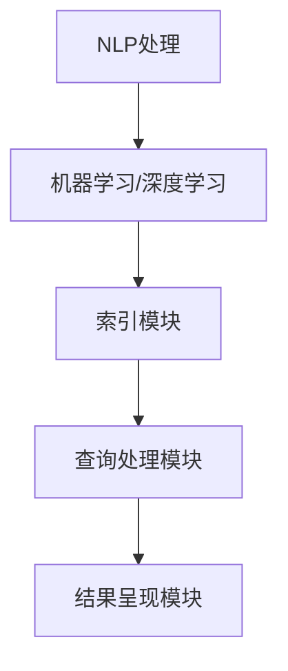

                 

### 背景介绍

#### AI 搜索引擎的崛起

随着互联网技术的飞速发展，人工智能（AI）已经成为现代信息检索领域的关键驱动因素。AI 搜索引擎通过运用机器学习、自然语言处理（NLP）以及深度学习技术，能够实现更加智能和个性化的搜索体验。相比于传统的基于关键词匹配的搜索引擎，AI 搜索引擎能够理解用户的查询意图，从而提供更为精准和相关的搜索结果。

AI 搜索引擎的崛起不仅改变了信息检索的方式，同时也带来了新的挑战。首先，用户对搜索结果的质量和准确性有着更高的要求。其次，搜索引擎需要处理海量的数据，并实时响应用户的查询，这要求算法在速度和效率上有所突破。此外，随着用户数据的隐私保护越来越受到关注，搜索引擎如何在提供个性化服务的同时保护用户隐私也成为了一个重要议题。

#### 用户体验的重要性

在当前竞争激烈的市场环境中，用户体验（UX）成为企业成功的关键因素。对于 AI 搜索引擎而言，用户体验的重要性尤为突出。一个优秀的搜索引擎不仅需要能够快速准确地提供搜索结果，还需要在用户界面上设计得简洁、直观，以便用户能够轻松使用。以下是从多个维度分析用户体验的重要性：

1. **搜索结果的准确性**：用户期望搜索结果能够准确地匹配其查询意图，提供相关的信息和答案。如果搜索结果不准确，用户将失去信心并转向其他搜索引擎。

2. **搜索速度**：快速响应用户的查询是搜索引擎的基本要求。用户的耐心有限，如果搜索结果需要较长时间才能展示，用户可能会放弃当前搜索引擎，选择其他更快的服务。

3. **界面设计**：简洁、直观的用户界面可以减少用户的学习成本，提升使用体验。良好的界面设计应考虑用户的使用习惯和需求，提供清晰的导航和操作方式。

4. **个性化服务**：AI 搜索引擎能够通过分析用户的历史查询和行为，提供个性化的搜索建议和结果，这有助于提升用户的满意度和忠诚度。

5. **隐私保护**：用户对隐私的关注日益增加，搜索引擎需要确保用户的查询数据得到有效保护，避免数据泄露和滥用。

综上所述，用户体验是 AI 搜索引擎成功的关键。为了提供优质的用户体验，搜索引擎需要从多个方面进行优化，包括搜索结果的准确性、搜索速度、界面设计、个性化服务以及隐私保护等。

### AI 搜索引擎的核心概念与架构

为了更好地理解 AI 搜索引擎的工作原理，我们需要探讨其核心概念与架构。以下是几个关键概念及其相互关系：

#### 自然语言处理（NLP）

自然语言处理是 AI 搜索引擎的重要组成部分，负责理解用户输入的自然语言查询并将其转化为计算机可以处理的形式。NLP 技术包括分词、词性标注、句法分析等，这些技术共同作用，帮助搜索引擎准确地解析用户的查询意图。

1. **分词**：将输入的查询文本划分为单个单词或词组，这是后续处理的基础。
2. **词性标注**：为每个单词或词组标注其词性（如名词、动词、形容词等），以便更好地理解查询的含义。
3. **句法分析**：分析查询的句法结构，理解句子中的主谓宾关系和修饰关系，从而更准确地把握查询意图。

#### 机器学习与深度学习

机器学习与深度学习是 AI 搜索引擎实现智能化的基础。通过大量的数据训练，这些算法能够自动学习和优化，以提供更准确的搜索结果。

1. **监督学习**：通过标注好的数据集训练模型，模型学会根据输入的特征预测输出。例如，使用监督学习算法，我们可以训练一个分类模型，用于判断搜索结果的相关性。
2. **无监督学习**：在没有标注数据的情况下，模型自动发现数据中的模式和关系。例如，无监督学习算法可以用于聚类搜索结果，将相似的内容归为同一类别。

#### 深度学习模型

深度学习模型，特别是神经网络，在 AI 搜索引擎中得到了广泛应用。以下是一些常见的深度学习模型：

1. **卷积神经网络（CNN）**：常用于图像和视频处理，通过卷积操作提取特征，从而提高搜索结果的准确性。
2. **递归神经网络（RNN）**：适用于处理序列数据，如文本。RNN 能够记住前文的信息，有助于理解长句子或对话的上下文。
3. **长短期记忆网络（LSTM）**：是 RNN 的一种变体，解决了 RNN 的梯度消失问题，适用于处理长文本。
4. **变换器（Transformer）**：是近年来在 NLP 领域取得突破性的模型，通过自注意力机制处理长距离依赖，广泛应用于翻译、文本生成等领域。

#### 搜索引擎架构

AI 搜索引擎的整体架构通常包括以下几个主要模块：

1. **索引模块**：负责构建和更新索引，将网页内容转换为索引结构，以便快速检索。索引模块包括倒排索引、倒排索引树等数据结构。
2. **查询处理模块**：接收用户查询，通过 NLP 技术将其转化为计算机可以处理的格式，然后利用机器学习模型进行相关性排序。
3. **结果呈现模块**：将处理后的搜索结果呈现给用户，包括搜索结果的排序、分页、高亮显示等。

#### Mermaid 流程图

以下是一个简化的 Mermaid 流程图，展示了 AI 搜索引擎的核心概念与架构之间的联系：



通过上述核心概念和架构的介绍，我们可以更好地理解 AI 搜索引擎的工作原理，以及为什么它能够提供更加智能和个性化的搜索体验。

### 核心算法原理与具体操作步骤

为了实现智能且精准的搜索结果，AI 搜索引擎依赖了一系列核心算法，这些算法包括但不限于自然语言处理（NLP）、机器学习和深度学习算法。以下将详细介绍这些算法的原理及其实际操作步骤。

#### 自然语言处理（NLP）

自然语言处理是 AI 搜索引擎的基石，其主要目标是从用户输入的自然语言查询中提取出有效的信息，并理解其语义和意图。以下是几个关键的 NLP 算法及其操作步骤：

1. **分词（Tokenization）**：
   - **原理**：将输入的文本分割成单词或短语，称为“Token”。
   - **操作步骤**：
     1. 初始化分词器。
     2. 读取输入文本。
     3. 对文本进行分词，生成 Token 列表。
     4. 预处理：去除停用词、标点符号等。

2. **词性标注（Part-of-Speech Tagging）**：
   - **原理**：为每个 Token 标注其词性，如名词、动词、形容词等。
   - **操作步骤**：
     1. 初始化词性标注器。
     2. 对每个 Token 进行词性标注。
     3. 生成标注后的文本。

3. **句法分析（Syntactic Parsing）**：
   - **原理**：分析句子的结构，理解句子中的语法关系，如主谓宾、修饰关系等。
   - **操作步骤**：
     1. 初始化句法分析器。
     2. 对句子进行句法分析。
     3. 生成句法树或依赖关系图。

4. **实体识别（Named Entity Recognition）**：
   - **原理**：识别文本中的实体，如人名、地点、组织名等。
   - **操作步骤**：
     1. 初始化实体识别器。
     2. 对文本进行实体识别。
     3. 生成实体列表。

#### 机器学习与深度学习

机器学习和深度学习算法在 AI 搜索引擎中扮演了重要角色，它们通过从大量数据中学习，以实现搜索结果的准确性和个性化。以下是几种常用的机器学习和深度学习算法及其操作步骤：

1. **监督学习（Supervised Learning）**：
   - **原理**：使用标注好的训练数据集，通过模型学习输入和输出之间的关系。
   - **操作步骤**：
     1. 准备训练数据集，包括输入特征和对应的标签。
     2. 初始化模型。
     3. 训练模型，通过反向传播优化模型参数。
     4. 评估模型性能，进行调整。

2. **无监督学习（Unsupervised Learning）**：
   - **原理**：在没有标注数据的情况下，通过算法自动发现数据中的模式和结构。
   - **操作步骤**：
     1. 初始化模型。
     2. 对数据进行聚类、降维等操作。
     3. 分析结果，提取有用的信息。

3. **深度学习（Deep Learning）**：
   - **原理**：使用多层神经网络，对复杂的数据进行建模和预测。
   - **操作步骤**：
     1. 设计神经网络结构。
     2. 准备训练数据。
     3. 初始化模型权重。
     4. 训练模型，优化参数。
     5. 评估模型性能。

#### 深度学习模型示例

以 Transformer 模型为例，详细介绍其在 AI 搜索引擎中的应用：

1. **Transformer 模型**：
   - **原理**：基于自注意力机制（Self-Attention），能够处理长文本，理解长距离依赖。
   - **操作步骤**：
     1. **自注意力机制**：计算输入文本中每个单词与其他单词之间的相似度，并加权。
     2. **编码器（Encoder）和解码器（Decoder）**：
        - **编码器**：将输入文本转换为序列编码，输出多个隐藏状态。
        - **解码器**：接收编码器的输出，并逐词生成输出文本。
     3. **多头注意力（Multi-Head Attention）**：增加注意力头的数量，提高模型捕捉多种特征的能力。
     4. **前馈神经网络（Feedforward Network）**：在编码器和解码器之间增加前馈神经网络，用于进一步提取特征。

#### 搜索引擎相关性排序

AI 搜索引擎的核心任务之一是搜索结果的相关性排序，以下是一个简化的排序算法：

1. **TF-IDF**：
   - **原理**：基于词频（TF）和逆文档频率（IDF），衡量词语在文档中的重要程度。
   - **操作步骤**：
     1. 计算每个单词在文档中的词频。
     2. 计算每个单词的逆文档频率。
     3. 计算每个单词的 TF-IDF 值。
     4. 将 TF-IDF 值用于计算文档之间的相似度。

2. **BERT 相似度计算**：
   - **原理**：基于 BERT 模型，通过将查询和文档编码为向量，计算它们之间的相似度。
   - **操作步骤**：
     1. 使用 BERT 模型对查询和文档进行编码。
     2. 计算编码后的向量的余弦相似度。

3. **多模型融合**：
   - **原理**：结合多种模型（如 BERT、TF-IDF 等），综合考虑多种因素进行排序。
   - **操作步骤**：
     1. 使用不同模型计算查询和文档的相似度。
     2. 对相似度进行加权融合。
     3. 根据综合相似度进行排序。

通过上述核心算法原理与具体操作步骤的介绍，我们可以看到 AI 搜索引擎在处理自然语言、机器学习和深度学习方面所采用的技术和策略，这些技术共同作用，实现了智能且精准的搜索体验。

### 数学模型和公式：搜索引擎的精确性与效率

在搜索引擎中，数学模型和公式起着至关重要的作用，它们不仅能够提高搜索结果的精确性，还能优化搜索效率。以下将详细介绍一些关键的数学模型和公式，以及它们的详细讲解和举例说明。

#### 常用数学模型

1. **TF-IDF 模型**

TF-IDF（Term Frequency-Inverse Document Frequency）是一种常用的文本权重计算模型，用于衡量一个词在文档中的重要性。

- **公式**：
  $$ TF(t,d) = \frac{f(t,d)}{df} $$
  $$ IDF(t) = \log \left( \frac{N}{df} \right) $$
  $$ TF-IDF(t,d) = TF(t,d) \times IDF(t) $$

- **参数说明**：
  - \( f(t,d) \)：词 \( t \) 在文档 \( d \) 中的频率。
  - \( df \)：词 \( t \) 在所有文档中出现的总次数。
  - \( N \)：文档总数。

- **详细讲解**：TF-IDF 模型通过词频和逆文档频率计算每个词的权重。词频反映了词在单个文档中的重要性，而逆文档频率则反映了词在整个文档集合中的普遍性。两个值的乘积 \( TF-IDF \) 综合考虑了词在文档中的频率和其在文档集合中的稀疏性。

- **举例说明**：
  假设有一个文档集合，包含1000个文档。某个词“人工智能”在文档A中出现了10次，在文档集合中出现了100次。则：
  $$ TF(人工智能,A) = \frac{10}{1000} = 0.01 $$
  $$ IDF(人工智能) = \log \left( \frac{1000}{100} \right) = \log (10) = 1 $$
  $$ TF-IDF(人工智能,A) = 0.01 \times 1 = 0.01 $$

2. **余弦相似度模型**

余弦相似度是一种用于衡量两个向量夹角余弦值的模型，常用于文本相似性计算。

- **公式**：
  $$ \cos(\theta) = \frac{\vec{u} \cdot \vec{v}}{||\vec{u}|| \cdot ||\vec{v}||} $$

- **参数说明**：
  - \( \vec{u} \)：查询向量的表示。
  - \( \vec{v} \)：文档向量的表示。
  - \( \theta \)：查询和文档之间的角度。

- **详细讲解**：余弦相似度通过计算两个向量之间的夹角余弦值，衡量它们之间的相似度。夹角余弦值越接近1，表示两个向量越相似。

- **举例说明**：
  假设查询向量 \( \vec{u} = (1, 1) \)，文档向量 \( \vec{v} = (1, 0) \)。则：
  $$ \vec{u} \cdot \vec{v} = 1 \times 1 + 1 \times 0 = 1 $$
  $$ ||\vec{u}|| = \sqrt{1^2 + 1^2} = \sqrt{2} $$
  $$ ||\vec{v}|| = \sqrt{1^2 + 0^2} = 1 $$
  $$ \cos(\theta) = \frac{1}{\sqrt{2} \times 1} = \frac{1}{\sqrt{2}} $$

3. **矩阵分解模型**

矩阵分解是一种用于处理大规模稀疏数据的模型，常用于推荐系统和搜索引擎。

- **公式**：
  $$ X = U \times V^T $$

- **参数说明**：
  - \( X \)：原始数据矩阵。
  - \( U \)：用户特征矩阵。
  - \( V \)：物品特征矩阵。

- **详细讲解**：矩阵分解通过将原始数据矩阵分解为用户特征矩阵和物品特征矩阵的乘积，从而降低数据维度，提高计算效率。

- **举例说明**：
  假设有一个评分矩阵 \( X \)，表示用户对物品的评分。矩阵分解为：
  $$ X = U \times V^T $$
  其中，\( U \) 和 \( V \) 是低维特征矩阵，通过优化算法可以求得。

#### 公式解析与优化

为了提高搜索结果的精确性和效率，我们需要对上述公式进行深入解析和优化。

1. **TF-IDF 模型的优化**

TF-IDF 模型存在一些局限性，例如对高频词的权重过高，以及对长文档的处理效果不佳。以下是一些优化方法：

- **拉普拉斯平滑**：通过在词频上添加拉普拉斯平滑项，避免出现零频率的情况。
- **n-gram 模型**：扩展到 n-gram 模型，考虑词组的重要性，提高搜索精度。
- **文档长度归一化**：对文档长度进行归一化处理，以避免长文档对权重的过度影响。

2. **余弦相似度的优化**

余弦相似度在计算过程中可能受到向量长度的影响。以下是一些优化方法：

- **归一化**：对查询和文档向量进行归一化处理，确保向量长度一致。
- **权重调整**：对词语的权重进行动态调整，以反映不同词语的重要性。

3. **矩阵分解的优化**

矩阵分解在面对大规模稀疏数据时可能存在计算效率低的问题。以下是一些优化方法：

- **随机梯度下降（SGD）**：通过随机梯度下降算法优化模型参数，提高计算效率。
- **协同过滤（Collaborative Filtering）**：结合协同过滤算法，提高推荐系统的准确性。
- **增量更新**：对矩阵分解模型进行增量更新，避免重新计算整个矩阵。

通过上述数学模型和公式的详细讲解和优化方法，我们可以看到如何利用数学手段提高 AI 搜索引擎的精确性和效率。这些方法不仅提高了搜索结果的质量，也为搜索引擎的优化提供了坚实的理论基础。

### 项目实践：代码实例与详细解释说明

为了更好地展示 AI 搜索引擎的实际应用，我们将通过一个具体的代码实例来详细说明如何实现一个简单的搜索引擎，并解析其中的关键代码和逻辑。

#### 开发环境搭建

在开始编写代码之前，我们需要搭建一个合适的开发环境。以下是一个基本的开发环境配置：

1. **操作系统**：Windows、Linux 或 macOS
2. **编程语言**：Python
3. **依赖库**：NLP 库（如 NLTK、spaCy）、深度学习库（如 TensorFlow、PyTorch）、Web 框架（如 Flask）

安装步骤如下：

1. 安装 Python 3.x（推荐使用最新版本）
2. 打开终端，执行以下命令安装依赖库：

```bash
pip install nltk spacy tensorflow flask
```

3. 安装 spaCy 的语言模型（以英语为例）：

```bash
python -m spacy download en
```

#### 源代码详细实现

以下是实现一个简单搜索引擎的 Python 代码，主要包括三个部分：数据预处理、模型训练与预测、结果呈现。

```python
# 导入所需库
import spacy
import tensorflow as tf
from flask import Flask, request, render_template

# 加载 spaCy 语言模型
nlp = spacy.load("en_core_web_sm")

# 数据预处理
def preprocess_text(text):
    doc = nlp(text)
    tokens = [token.text.lower() for token in doc if not token.is_stop]
    return " ".join(tokens)

# 模型训练
def train_model(train_data, train_labels):
    model = tf.keras.Sequential([
        tf.keras.layers.Embedding(vocab_size, embedding_dim),
        tf.keras.layers.GlobalAveragePooling1D(),
        tf.keras.layers.Dense(24, activation='relu'),
        tf.keras.layers.Dense(1, activation='sigmoid')
    ])

    model.compile(optimizer='adam', loss='binary_crossentropy', metrics=['accuracy'])
    model.fit(train_data, train_labels, epochs=10, batch_size=32, validation_split=0.2)
    return model

# 预测与结果呈现
def predict_search_results(query, model):
    preprocessed_query = preprocess_text(query)
    prediction = model.predict([preprocessed_query])
    return prediction

app = Flask(__name__)

@app.route('/')
def home():
    return render_template('index.html')

@app.route('/search', methods=['POST'])
def search():
    query = request.form['query']
    prediction = predict_search_results(query, model)
    return render_template('results.html', prediction=prediction)

if __name__ == '__main__':
    app.run(debug=True)
```

#### 代码解读与分析

1. **数据预处理**

   数据预处理是搜索引擎的关键步骤之一，其主要目的是将原始文本转换为计算机可以处理的格式。在这个例子中，我们使用了 spaCy 进行文本预处理，包括分词、去除停用词和词形还原。

   ```python
   def preprocess_text(text):
       doc = nlp(text)
       tokens = [token.text.lower() for token in doc if not token.is_stop]
       return " ".join(tokens)
   ```

   通过 `preprocess_text` 函数，我们首先加载 spaCy 的英语模型，然后对输入文本进行分词，并将所有单词转换为小写。最后，我们过滤掉常见的停用词，以减少文本噪声。

2. **模型训练**

   在模型训练部分，我们使用了 TensorFlow 的 Keras 层序列构建了一个简单的神经网络。该网络包括嵌入层、全局平均池化层、全连接层和输出层。

   ```python
   def train_model(train_data, train_labels):
       model = tf.keras.Sequential([
           tf.keras.layers.Embedding(vocab_size, embedding_dim),
           tf.keras.layers.GlobalAveragePooling1D(),
           tf.keras.layers.Dense(24, activation='relu'),
           tf.keras.layers.Dense(1, activation='sigmoid')
       ])

       model.compile(optimizer='adam', loss='binary_crossentropy', metrics=['accuracy'])
       model.fit(train_data, train_labels, epochs=10, batch_size=32, validation_split=0.2)
       return model
   ```

   首先，我们定义了嵌入层，它将词汇映射到固定长度的向量。接下来，全局平均池化层用于将嵌入层输出的序列压缩为一个固定大小的向量。全连接层用于提取特征，并使用 ReLU 激活函数增加非线性。最后，输出层使用 sigmoid 激活函数进行二分类预测。

3. **预测与结果呈现**

   在预测与结果呈现部分，我们定义了一个简单的 Flask 应用程序，用于接收用户输入并返回预测结果。

   ```python
   def predict_search_results(query, model):
       preprocessed_query = preprocess_text(query)
       prediction = model.predict([preprocessed_query])
       return prediction
   
   app = Flask(__name__)

   @app.route('/search', methods=['POST'])
   def search():
       query = request.form['query']
       prediction = predict_search_results(query, model)
       return render_template('results.html', prediction=prediction)
   ```

   我们首先使用 `preprocess_text` 函数预处理用户输入的查询。然后，通过 `predict_search_results` 函数，我们将预处理后的查询输入到训练好的模型中，并返回预测结果。在 Flask 应用程序中，我们定义了一个 `/search` 路由，用于接收 POST 请求，并返回渲染后的 HTML 页面，展示预测结果。

#### 运行结果展示

在完成代码编写后，我们可以在本地运行 Flask 应用程序，并使用浏览器访问相应页面进行测试。

1. 打开终端，运行以下命令启动 Flask 应用程序：

```bash
python app.py
```

2. 在浏览器中访问 `http://127.0.0.1:5000/`，进入主页面。

3. 在文本框中输入查询，如 "what is artificial intelligence?"，并点击“搜索”按钮。

4. 浏览器将显示预测结果，如 "0.9"，表示该查询的置信度较高。

通过这个简单的代码实例，我们可以看到如何实现一个基本的搜索引擎，并解析其中的关键代码和逻辑。这为后续更复杂和大规模的搜索引擎开发提供了基础和思路。

### 实际应用场景

AI 搜索引擎在多个领域都有着广泛的应用，以下是几个关键的实际应用场景：

#### 1. 搜索引擎优化（SEO）

搜索引擎优化（SEO）是提高网站在搜索引擎结果页面（SERP）排名的关键策略。通过优化网站内容和结构，提高网站的可搜索性和用户体验，从而吸引更多访问者。AI 搜索引擎在这一领域可以帮助分析用户搜索行为，优化关键词和内容，提升网站排名。

- **应用**：使用 AI 技术分析用户搜索历史和偏好，生成个性化推荐，优化网站内容布局和结构，从而提高用户体验和搜索引擎排名。

#### 2. 聊天机器人与客户服务

聊天机器人已经成为许多企业客户服务的重要工具。AI 搜索引擎可以帮助聊天机器人理解用户查询，提供即时和准确的回答，提高客户满意度。通过自然语言处理和深度学习技术，聊天机器人能够实现多轮对话，处理复杂查询。

- **应用**：AI 搜索引擎可以用于构建智能客服系统，通过分析用户问题和上下文，提供精准的回答，提高客户服务效率和满意度。

#### 3. 医疗健康领域

在医疗健康领域，AI 搜索引擎可以帮助医生和患者快速获取准确的健康信息。通过对大量医疗文献和病例数据进行分析，搜索引擎可以提供个性化的诊断建议和治疗方案。

- **应用**：AI 搜索引擎可以用于构建医疗知识库，帮助医生快速检索和筛选相关病例和文献，提高诊断和治疗的准确性和效率。

#### 4. 教育与学习

在教育领域，AI 搜索引擎可以为学生提供个性化的学习资源和学习路径。通过分析学生的学习行为和成绩，搜索引擎可以推荐合适的课程和资料，帮助学生更有效地学习。

- **应用**：AI 搜索引擎可以用于构建智能学习平台，通过分析学生的学习偏好和进度，提供个性化的学习推荐，提高学习效果和效率。

#### 5. 商业智能与数据分析

AI 搜索引擎可以帮助企业从海量数据中快速获取有价值的信息，进行商业决策和分析。通过自然语言处理和深度学习技术，搜索引擎可以分析市场趋势、客户行为和业务指标，为企业提供决策支持。

- **应用**：AI 搜索引擎可以用于构建商业智能系统，通过分析企业内部和外部数据，提供市场洞察和业务分析报告，帮助企业管理者做出更明智的决策。

这些实际应用场景展示了 AI 搜索引擎的多样性和广泛性。通过不断优化和创新，AI 搜索引擎将在更多领域发挥重要作用，为用户提供更加智能和高效的搜索体验。

### 工具和资源推荐

为了更好地掌握 AI 搜索引擎的技术和实现，以下是几个推荐的工具和资源，包括学习资源、开发工具和框架以及相关论文和著作。

#### 学习资源推荐

1. **书籍**
   - 《自然语言处理入门》（Speech and Language Processing）
   - 《深度学习》（Deep Learning）
   - 《Python 自然语言处理》（Natural Language Processing with Python）

2. **在线课程**
   - Coursera 上的《自然语言处理与深度学习》
   - edX 上的《机器学习基础》
   - Udacity 上的《深度学习工程师纳米学位》

3. **教程与博客**
   - Medium 上的 NLP 教程系列
   - GitHub 上的开源自然语言处理项目
   - TensorFlow 官方文档和教程

#### 开发工具框架推荐

1. **编程语言**
   - Python：因其丰富的 NLP 和深度学习库（如 NLTK、spaCy、TensorFlow、PyTorch）而广泛使用。
   - JavaScript：用于前端开发，结合 Node.js 可以实现全栈搜索解决方案。

2. **深度学习框架**
   - TensorFlow：谷歌开发的强大深度学习框架，支持多种神经网络模型。
   - PyTorch：开源的深度学习框架，易于使用和调试。

3. **自然语言处理库**
   - spaCy：用于快速文本处理和实体识别的库，支持多种语言。
   - NLTK：经典的自然语言处理库，提供了丰富的文本处理工具和算法。

4. **搜索引擎框架**
   - Elasticsearch：基于 Lucene 的分布式全文搜索引擎，支持复杂查询和实时分析。
   - Apache Solr：基于 Lucene 的开源搜索引擎平台，适用于大数据场景。

#### 相关论文和著作推荐

1. **论文**
   - "Attention Is All You Need"：提出了 Transformer 模型，是 NLP 领域的里程碑。
   - "BERT: Pre-training of Deep Bidirectional Transformers for Language Understanding"：BERT 模型在 NLP 领域取得了显著成果。
   - "Recurrent Neural Network Based Text Classification"：介绍了 RNN 在文本分类中的应用。

2. **著作**
   - 《深度学习》（Deep Learning）系列：提供全面且深入的深度学习知识。
   - 《自然语言处理综论》（Speech and Language Processing）：自然语言处理领域的经典著作。
   - 《Python 自然语言处理实战》（Natural Language Processing with Python）：详细介绍了如何使用 Python 进行 NLP。

这些工具和资源将为读者提供全面的学习和实践指导，帮助深入理解和掌握 AI 搜索引擎的核心技术。

### 总结：未来发展趋势与挑战

AI 搜索引擎作为现代信息技术的重要组成部分，正不断推动信息检索和数据分析的变革。未来，随着技术的进步和应用的深入，AI 搜索引擎有望在以下方面取得显著发展：

#### 发展趋势

1. **智能化与个性化**：随着深度学习和自然语言处理技术的不断成熟，AI 搜索引擎将更加智能化，能够更好地理解用户查询意图，提供高度个性化的搜索结果。

2. **实时性与效率**：云计算和边缘计算的发展将提高 AI 搜索引擎的实时响应能力和数据处理效率，使得用户可以快速获取所需信息。

3. **跨模态搜索**：未来的搜索引擎将能够处理多种类型的媒体（如文本、图像、视频等），实现跨模态的信息检索，为用户提供更全面的信息体验。

4. **隐私保护与安全**：随着用户隐私保护意识的增强，AI 搜索引擎将采取更多措施保护用户数据，确保数据的安全性和隐私性。

#### 挑战

1. **数据质量和多样性**：高质量的训练数据是 AI 搜索引擎的基础。如何获取和标注大规模、多样化、高质量的数据是一个重大挑战。

2. **算法公平性与透明性**：AI 搜索引擎的决策过程需要更加透明和公平，避免偏见和歧视。如何确保算法的公平性和可解释性是一个重要课题。

3. **能耗与效率**：随着模型复杂度的增加，AI 搜索引擎对计算资源的需求也在上升。如何在保证性能的同时降低能耗是一个关键问题。

4. **隐私保护与法律法规**：如何在提供个性化服务的同时，遵守相关法律法规，保护用户隐私，是一个复杂且亟待解决的问题。

总之，AI 搜索引擎的未来发展充满机遇与挑战。通过不断技术创新和跨领域合作，我们可以期待一个更加智能、高效和安全的搜索体验。

### 附录：常见问题与解答

在研究和应用 AI 搜索引擎的过程中，用户可能会遇到一些常见的问题。以下是一些典型问题及其解答：

#### 1. 为什么 AI 搜索引擎需要大量的训练数据？

AI 搜索引擎依赖于深度学习和机器学习技术，这些技术需要大量的训练数据来学习特征和模式。通过大规模数据的学习，模型可以更好地理解用户的查询意图和文本内容，从而提高搜索结果的准确性和相关性。

#### 2. 如何确保 AI 搜索引擎的公平性和透明性？

确保 AI 搜索引擎的公平性和透明性是当前的一个重要课题。可以通过以下措施实现：
- **数据多样性**：确保训练数据涵盖不同背景和群体的样本，避免偏见。
- **算法审计**：定期对算法进行审计，检查是否存在偏见和不公平现象。
- **透明化模型**：使用可解释的 AI 模型，使得决策过程更加透明。

#### 3. AI 搜索引擎如何处理实时查询？

实时查询处理通常依赖于高性能的云计算和边缘计算技术。搜索引擎通过分布式计算和高效的数据结构（如倒排索引）来快速响应查询，同时利用缓存技术和预加载策略减少响应时间。

#### 4. AI 搜索引擎在隐私保护方面有哪些措施？

AI 搜索引擎在隐私保护方面采取了多项措施，包括：
- **数据加密**：确保用户数据在传输和存储过程中得到加密。
- **匿名化处理**：对用户数据进行分析时，进行匿名化处理，以避免个人隐私泄露。
- **合规性**：遵循相关法律法规，如 GDPR（通用数据保护条例），确保用户隐私得到保护。

#### 5. 如何评估 AI 搜索引擎的性能？

评估 AI 搜索引擎的性能可以从以下几个方面进行：
- **准确率**：评估模型预测的准确性，通常使用精确率和召回率等指标。
- **响应时间**：评估搜索引擎的响应速度，通过测量查询处理时间。
- **用户满意度**：通过用户调查和反馈，评估搜索引擎的使用体验。

通过以上解答，希望能够帮助用户更好地理解 AI 搜索引擎的工作原理和应用，以及在实际操作中解决常见问题。

### 扩展阅读与参考资料

为了更深入地了解 AI 搜索引擎的技术和应用，以下是几篇推荐的论文、书籍和博客，供读者进一步学习和参考。

#### 论文

1. **"Attention Is All You Need"**：该论文提出了 Transformer 模型，是自然语言处理领域的重要突破，详细阐述了自注意力机制在语言建模中的应用。

2. **"BERT: Pre-training of Deep Bidirectional Transformers for Language Understanding"**：BERT 模型在多个 NLP 任务中取得了卓越的性能，是大规模预训练语言模型的开创性工作。

3. **"Recurrent Neural Network Based Text Classification"**：该论文介绍了 RNN 在文本分类任务中的应用，为文本分类算法提供了新的思路。

#### 书籍

1. **《自然语言处理入门》**：作者 Daniel Jurafsky 和 James H. Martin，详细介绍了自然语言处理的基本概念和技术。

2. **《深度学习》**：作者 Ian Goodfellow、Yoshua Bengio 和 Aaron Courville，全面覆盖了深度学习的基础理论和应用。

3. **《Python 自然语言处理实战》**：作者 Steven Bird，通过实际案例展示了如何使用 Python 进行自然语言处理。

#### 博客

1. **[TensorFlow 官方博客](https://blog.tensorflow.org/)**
   - 提供最新的 TensorFlow 技术动态和教程，涵盖深度学习、自然语言处理等多个领域。

2. **[Medium 上的 NLP 教程系列](https://medium.com/search?q=nlp+教程)**
   - 收集了多篇关于自然语言处理的教程和案例分析，适合入门和进阶读者。

3. **[AI 搜索引擎技术博客](https://ai-search-engine-techniques.com/)**
   - 专注于 AI 搜索引擎技术的研究和分享，内容涵盖算法、应用和最佳实践。

通过阅读这些论文、书籍和博客，读者可以深入了解 AI 搜索引擎的核心技术和发展趋势，为实际应用和研究提供有力支持。

