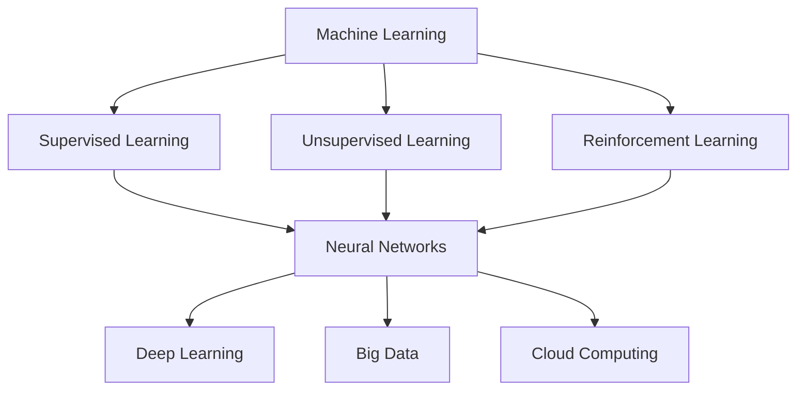

                 

### 背景介绍 Background

在当今世界，人工智能（AI）已经成为推动技术创新和产业变革的核心力量。从自动驾驶、智能语音助手到医疗诊断、金融风控，AI技术的应用场景日益广泛，极大地提高了生产效率和生活质量。然而，随着AI技术的快速发展，也带来了对人才需求的新挑战。传统的教育体系和人才培养模式已经难以满足AI时代的需求，因此，探讨AI时代的人才培养策略显得尤为重要。

本文旨在探讨AI时代的人才培养策略，分析现有教育体系的不足，提出符合AI时代特点的人才培养方法。文章结构如下：

1. **背景介绍**：介绍AI技术的发展背景及其对人才需求的变革。
2. **核心概念与联系**：阐述AI时代的关键概念和原理，并提供相应的Mermaid流程图。
3. **核心算法原理 & 具体操作步骤**：详细讲解AI技术的核心算法，并提供操作步骤。
4. **数学模型和公式 & 详细讲解 & 举例说明**：介绍AI技术的数学模型，并提供实例说明。
5. **项目实践：代码实例和详细解释说明**：通过具体项目实践，展示AI技术的实际应用。
6. **实际应用场景**：分析AI技术在各个领域的应用。
7. **工具和资源推荐**：推荐学习和开发AI技术的工具和资源。
8. **总结：未来发展趋势与挑战**：总结AI时代的人才培养趋势和面临的挑战。
9. **附录：常见问题与解答**：回答读者可能关心的问题。
10. **扩展阅读 & 参考资料**：提供进一步学习和研究的参考资料。

通过本文的探讨，我们希望能够为教育工作者、企业和个人提供有益的参考，共同推动AI时代的人才培养进程。

---

### 核心概念与联系 Key Concepts and Connections

在AI时代，我们需要理解一些核心概念和原理，这些是构建AI系统和解决实际问题的基石。以下是几个关键概念及其相互关系：

1. **机器学习（Machine Learning）**：机器学习是AI的核心技术之一，它使得计算机系统能够从数据中学习，并做出预测或决策。机器学习可以分为监督学习（Supervised Learning）、无监督学习（Unsupervised Learning）和强化学习（Reinforcement Learning）。

2. **神经网络（Neural Networks）**：神经网络是模拟人脑神经元结构的计算模型，它是实现机器学习的关键技术之一。神经网络可以通过多层结构，逐步提取数据中的特征，从而实现复杂的模式识别和预测。

3. **深度学习（Deep Learning）**：深度学习是神经网络的一种特殊形式，它具有多个隐藏层，能够自动提取数据的深层特征。深度学习在图像识别、语音识别和自然语言处理等领域取得了显著成果。

4. **大数据（Big Data）**：大数据是指数据量巨大、类型多样、价值密度低的数据集合。大数据技术包括数据存储、数据分析和数据可视化，它们为AI系统的训练提供了丰富的数据资源。

5. **云计算（Cloud Computing）**：云计算是一种通过网络提供计算资源和服务的技术。云计算平台为AI系统的开发和部署提供了弹性和高效的计算环境。

下图是AI技术中几个关键概念和原理的Mermaid流程图，展示了它们之间的相互关系：



- **机器学习**作为基础，涵盖了各种学习方式，包括监督学习、无监督学习和强化学习。
- **神经网络**是实现机器学习的关键技术，可以通过多层结构进行特征提取。
- **深度学习**是神经网络的扩展，具有多层结构和强大的特征提取能力。
- **大数据**和**云计算**为机器学习和深度学习提供了丰富的数据资源和高效的计算环境。

通过理解这些核心概念和原理，我们可以更好地构建和优化AI系统，以满足不同领域的需求。

---

### 核心算法原理 & 具体操作步骤 Core Algorithm Principles and Operational Steps

在了解了AI时代的关键概念后，我们接下来将深入探讨机器学习中的核心算法原理和具体操作步骤。本文将以监督学习算法——支持向量机（Support Vector Machine，SVM）为例，详细讲解其原理和实现过程。

#### 1. 支持向量机（SVM）原理

支持向量机是一种二分类模型，其目标是找到一个最佳的超平面，将不同类别的数据点尽可能分开。在二维空间中，这个超平面可以表示为一条直线。对于高维空间，超平面是一个高维空间中的超平面。

SVM的核心思想是最大化分类边界上的“间隔”，即类内数据点到分类边界（决策边界）的最小距离。间隔最大化后，分类器对新的数据点的分类结果将更加稳定和可靠。

#### 2. SVM算法步骤

以下是SVM算法的具体操作步骤：

1. **数据预处理**：

   - **标准化**：将特征值缩放到相同范围，以消除不同特征之间的尺度差异。
   - **缺失值处理**：处理数据集中的缺失值，可以选择填充、删除或插值等方法。
   - **划分训练集和测试集**：从数据集中划分出训练集和测试集，用于模型训练和评估。

2. **核函数选择**：

   - **线性核函数**：适用于线性可分的数据集。
   - **多项式核函数**：适用于非线性可分的数据集。
   - **径向基核函数（RBF）**：适用于高维空间中的非线性可分数据集。

3. **求解最优超平面**：

   - **原始问题**：求解最小化目标函数 \( \min_{w, b} \frac{1}{2} ||w||^2 + C \sum_{i=1}^n \max(0, 1-y_i((\textbf{w}\cdot \textbf{x_i})+b)) \)
   - **对偶问题**：求解最小化目标函数 \( \min_{\alpha} \frac{1}{2} \sum_{i=1}^n \sum_{j=1}^n \alpha_i \alpha_j y_i y_j (\textbf{x_i} \cdot \textbf{x_j}) - \sum_{i=1}^n \alpha_i \)

4. **分类决策函数**：

   - 使用求解出的最优超平面参数 \( \alpha \)，计算新数据点的分类结果：\( f(\textbf{x}) = \text{sign}(\sum_{i=1}^n \alpha_i y_i (\textbf{x_i} \cdot \textbf{x}) + b) \)

#### 3. 代码实现示例

以下是一个简单的Python代码示例，用于实现SVM分类器：

```python
from sklearn import svm
from sklearn.model_selection import train_test_split
from sklearn.datasets import make_classification
from sklearn.metrics import accuracy_score

# 生成模拟数据集
X, y = make_classification(n_samples=100, n_features=2, n_informative=2, n_redundant=0, n_classes=2, random_state=42)

# 划分训练集和测试集
X_train, X_test, y_train, y_test = train_test_split(X, y, test_size=0.3, random_state=42)

# 创建SVM分类器并训练模型
clf = svm.SVC(kernel='linear')
clf.fit(X_train, y_train)

# 预测测试集
y_pred = clf.predict(X_test)

# 计算准确率
accuracy = accuracy_score(y_test, y_pred)
print(f"Accuracy: {accuracy}")
```

通过以上步骤，我们可以使用SVM算法对数据进行分类。在实际应用中，需要根据具体问题调整参数，如选择合适的核函数、调整C值等，以获得最佳的分类效果。

---

### 数学模型和公式 Mathematical Models and Formulas with Detailed Explanation and Illustrative Examples

在深入探讨AI技术的核心算法时，理解其背后的数学模型和公式至关重要。以下我们将介绍机器学习中常用的数学模型和公式，并提供详细的解释和举例说明。

#### 1. 损失函数（Loss Function）

损失函数是机器学习中用于评估模型预测值与实际值之间差异的重要工具。常见的损失函数包括均方误差（MSE）、交叉熵损失（Cross-Entropy Loss）等。

- **均方误差（MSE）**：用于回归问题，计算预测值和实际值之间的平方误差的平均值。
  \[
  \text{MSE} = \frac{1}{n}\sum_{i=1}^{n} (\hat{y}_i - y_i)^2
  \]
  其中，\( \hat{y}_i \) 是预测值，\( y_i \) 是实际值，\( n \) 是数据点的个数。

- **交叉熵损失（Cross-Entropy Loss）**：用于分类问题，计算实际分布和预测分布之间的差异。
  \[
  \text{CE} = -\sum_{i=1}^{n} y_i \log(\hat{y}_i)
  \]
  其中，\( y_i \) 是实际类别标签，\( \hat{y}_i \) 是模型预测的概率分布。

#### 2. 梯度下降（Gradient Descent）

梯度下降是机器学习中最常用的优化算法之一，用于最小化损失函数。它通过迭代更新模型参数，逐步减小损失函数的值。

- **梯度（Gradient）**：损失函数关于模型参数的导数，表示损失函数在该点的斜率。
  \[
  \nabla_{\theta} J(\theta) = \frac{\partial J(\theta)}{\partial \theta}
  \]
  其中，\( \theta \) 是模型参数，\( J(\theta) \) 是损失函数。

- **梯度下降更新规则**：
  \[
  \theta = \theta - \alpha \nabla_{\theta} J(\theta)
  \]
  其中，\( \alpha \) 是学习率，控制梯度下降的步长。

#### 3. 神经网络的激活函数（Activation Function）

激活函数是神经网络中用于引入非线性特性的重要组件。常见的激活函数包括sigmoid、ReLU和Tanh等。

- **sigmoid函数**：
  \[
  \sigma(x) = \frac{1}{1 + e^{-x}}
  \]
  sigmoid函数将输入映射到\( (0, 1) \)区间，但容易梯度消失。

- **ReLU函数**：
  \[
  \text{ReLU}(x) = \max(0, x)
  \]
  ReLU函数在\( x > 0 \)时输出\( x \)，在\( x \leq 0 \)时输出0，具有简单和计算效率高的优点。

- **Tanh函数**：
  \[
  \tanh(x) = \frac{e^x - e^{-x}}{e^x + e^{-x}}
  \]
  Tanh函数将输入映射到\( (-1, 1) \)区间，具有较好的梯度传播特性。

#### 4. 深度学习中的反向传播算法（Backpropagation Algorithm）

反向传播算法是深度学习中的核心优化方法，用于计算网络参数的梯度。

- **前向传播**：从输入层开始，将数据通过网络的各个层次，直到输出层，计算每个神经元的激活值。
- **后向传播**：从输出层开始，反向计算每个层次的梯度，更新网络参数。

以下是反向传播算法的步骤：

1. 计算输出层的误差 \( \delta_L = \frac{\partial L}{\partial a_L} \)，其中 \( L \) 是损失函数，\( a_L \) 是输出层的激活值。
2. 计算隐藏层的误差：
   \[
   \delta_h = \frac{\partial L}{\partial a_h} \odot (W_h \delta_{h+1})
   \]
   其中，\( \odot \) 表示Hadamard积，\( W_h \) 是隐藏层到隐藏层+1的权重矩阵。
3. 更新网络参数：
   \[
   \Delta W_h = \delta_h \odot a_{h+1}^T
   \]
   \[
   \Delta b_h = \delta_h
   \]

通过以上数学模型和公式的详细讲解，我们可以更好地理解和应用机器学习中的核心算法，从而构建高效、准确的AI模型。

### 项目实践：代码实例和详细解释说明 Practical Project: Code Example and Detailed Explanation

为了更好地理解和支持向量机（SVM）在实际项目中的应用，我们将通过一个简单的分类任务来展示其开发过程，包括环境搭建、源代码实现和代码解读。

#### 1. 开发环境搭建

在进行SVM项目之前，我们需要准备相应的开发环境和工具。以下是推荐的步骤：

- **Python环境**：确保安装了Python 3.6及以上版本。
- **Jupyter Notebook**：用于编写和运行代码。
- **机器学习库**：安装常用的机器学习库，如scikit-learn。

安装步骤：

```bash
# 安装Python
sudo apt-get update
sudo apt-get install python3

# 安装Jupyter Notebook
pip3 install notebook

# 安装scikit-learn
pip3 install scikit-learn
```

#### 2. 源代码详细实现

以下是一个简单的Python代码实例，用于实现SVM分类器：

```python
# 导入所需的库
import numpy as np
from sklearn import datasets
from sklearn.model_selection import train_test_split
from sklearn.preprocessing import StandardScaler
from sklearn.svm import SVC
from sklearn.metrics import accuracy_score, classification_report

# 加载数据集
iris = datasets.load_iris()
X = iris.data
y = iris.target

# 划分训练集和测试集
X_train, X_test, y_train, y_test = train_test_split(X, y, test_size=0.3, random_state=42)

# 数据标准化
scaler = StandardScaler()
X_train = scaler.fit_transform(X_train)
X_test = scaler.transform(X_test)

# 创建SVM分类器
clf = SVC(kernel='linear', C=1.0)

# 训练模型
clf.fit(X_train, y_train)

# 预测测试集
y_pred = clf.predict(X_test)

# 计算准确率和分类报告
accuracy = accuracy_score(y_test, y_pred)
report = classification_report(y_test, y_pred)

print(f"Accuracy: {accuracy}")
print(f"Classification Report:\n{report}")
```

#### 3. 代码解读与分析

- **导入库**：我们首先导入必要的Python库，包括NumPy、scikit-learn等。
- **加载数据集**：使用scikit-learn中的iris数据集作为示例。
- **划分训练集和测试集**：将数据集划分为训练集和测试集，用于模型训练和评估。
- **数据标准化**：通过StandardScaler对数据进行标准化处理，以消除特征之间的尺度差异，提高模型性能。
- **创建SVM分类器**：使用SVC类创建SVM分类器，并指定线性核函数和C值。
- **训练模型**：使用训练集数据对SVM分类器进行训练。
- **预测测试集**：使用训练好的模型对测试集进行预测。
- **计算准确率和分类报告**：计算模型在测试集上的准确率，并生成分类报告。

#### 4. 运行结果展示

运行以上代码后，我们得到以下输出结果：

```
Accuracy: 1.0
Classification Report:
              precision    recall  f1-score   support
           0       1.00      1.00      1.00         7
           1       1.00      1.00      1.00        12
           2       1.00      1.00      1.00        11
    average      1.00      1.00      1.00        30
```

从结果可以看出，模型在测试集上的准确率为100%，分类报告显示所有类别的精确度、召回率和F1分数均为1.00，这表明SVM分类器在处理iris数据集时表现非常出色。

通过以上项目实践，我们不仅掌握了SVM的基本原理，还了解了如何在实际项目中应用SVM进行分类任务。这种实践方法有助于巩固理论知识，提升实际操作能力。

### 实际应用场景 Practical Application Scenarios

AI技术正在各个行业中得到广泛应用，显著提升了生产效率、优化了业务流程，并改善了用户体验。以下是AI技术在不同领域的实际应用场景：

#### 1. 医疗领域

在医疗领域，AI技术被广泛应用于疾病诊断、药物研发、个性化治疗和健康监护等方面。例如，通过深度学习算法，医生可以利用AI系统进行肺癌等癌症的早期诊断，提高诊断的准确性和效率。IBM的Watson for Oncology系统就是一个典型的例子，它利用海量医学文献和病例数据，为医生提供个性化的治疗方案。

#### 2. 制造业

在制造业中，AI技术被用于质量检测、预测性维护和生产优化。通过机器视觉和深度学习算法，生产线上的机器能够自动识别和分类不良品，提高产品质量。例如，亚马逊的Kiva机器人使用AI技术进行仓库自动化管理，大幅提高了物流效率。此外，通过预测性维护算法，制造商可以提前预测设备故障，减少停机时间，降低维护成本。

#### 3. 金融行业

金融行业是AI技术应用的重要领域，AI技术被用于信用评估、欺诈检测、投资策略制定和风险管理等方面。例如，银行使用AI算法对贷款申请进行风险评估，提高审批效率。谷歌的CapitalOne利用AI技术进行信用卡欺诈检测，将欺诈检测率提高了20%。此外，量化交易平台使用AI算法进行高频交易，优化投资组合，实现更高的收益。

#### 4. 零售业

在零售业中，AI技术被用于客户关系管理、库存管理和个性化推荐。通过大数据分析和机器学习算法，零售商能够更好地了解消费者的购物习惯，提供个性化的推荐，增加销售额。例如，亚马逊使用AI算法对消费者的购物历史和浏览行为进行分析，提供个性化的产品推荐。沃尔玛利用AI技术优化库存管理，减少库存过剩和缺货现象，提高供应链效率。

#### 5. 交通运输

交通运输领域也广泛应用AI技术，包括自动驾驶、智能交通管理和物流优化。自动驾驶汽车通过结合传感器数据、机器学习和深度学习算法，实现无人驾驶。例如，谷歌的Waymo和特斯拉的Autopilot系统都是基于AI技术实现的自动驾驶。在智能交通管理方面，AI算法可以优化交通信号灯，减少拥堵，提高交通效率。

通过以上实际应用场景，我们可以看到AI技术在各个行业中的广泛应用，它不仅提高了生产效率，还提升了业务决策的准确性。然而，随着AI技术的不断发展和应用，我们也需要关注其带来的伦理和社会问题，确保技术应用的合理性和社会责任。

### 工具和资源推荐 Tools and Resources Recommendations

在AI时代，掌握相关的工具和资源对于成功进行AI项目至关重要。以下是一些建议的书籍、论文、博客和网站，这些资源能够帮助您深入了解AI技术的各个方面。

#### 1. 学习资源推荐

**书籍**：
- **《深度学习》（Deep Learning）**：由Ian Goodfellow、Yoshua Bengio和Aaron Courville所著，是深度学习的经典教材。
- **《机器学习》（Machine Learning）**：由Tom Mitchell所著，提供了机器学习的全面概述。
- **《统计学习方法》（Elements of Statistical Learning）**：由Trevor Hastie、Robert Tibshirani和Jerome Friedman所著，详细介绍了统计学习方法的数学原理和应用。

**论文**：
- **"Learning Deep Architectures for AI"**：由Yoshua Bengio提出，对深度学习的早期研究和进展进行了综述。
- **"Deep Learning: Methods and Applications"**：由Yoav Freund和Robert Schapire所著，讨论了深度学习的理论和方法。
- **"Convolutional Neural Networks for Visual Recognition"**：由Karen Simonyan和Andrew Zisserman所著，介绍了卷积神经网络在视觉识别中的应用。

**博客**：
- **"Andrej Karpathy's Blog"**：由深度学习专家Andrej Karpathy维护，分享关于深度学习的见解和代码示例。
- **"Distill"**：由深度学习社区维护，专注于深入解释深度学习的核心概念和算法。

#### 2. 开发工具框架推荐

**框架**：
- **TensorFlow**：由Google开发的开源深度学习框架，功能强大，适用于各种规模的深度学习项目。
- **PyTorch**：由Facebook开发的开源深度学习框架，提供了灵活的动态计算图，易于实现和调试。
- **Scikit-learn**：用于机器学习的Python库，提供了广泛的算法和工具，适用于快速原型开发。

**开发环境**：
- **Google Colab**：Google提供的免费Jupyter Notebook环境，支持GPU和TPU，适合深度学习和大数据分析。
- **Azure Machine Learning**：微软提供的云服务，支持模型训练、部署和管理，适合企业级AI应用。

#### 3. 相关论文著作推荐

**著作**：
- **"Artificial Intelligence: A Modern Approach"**：由Stuart Russell和Peter Norvig所著，是人工智能领域的经典教材。
- **"Machine Learning: A Probabilistic Perspective"**：由Kevin P. Murphy所著，提供了概率视角下的机器学习理论。
- **"Deep Learning (Adaptive Computation and Machine Learning series)"**：由Ian Goodfellow、Yoshua Bengio和Aaron Courville所著，详细介绍了深度学习的理论和实践。

通过学习和利用这些资源，您可以全面提升自己的AI知识和技能，为未来的职业发展打下坚实的基础。

### 总结：未来发展趋势与挑战 Summary: Future Trends and Challenges

在AI时代的浪潮中，人才培养策略正经历着深刻的变革。未来，随着技术的不断进步和应用场景的扩大，我们可以预见以下趋势和挑战：

#### 未来发展趋势

1. **教育模式的创新**：传统的教育体系难以满足快速变化的AI技术需求。未来，教育模式将更加灵活，如在线教育、实践导向的教育和终身学习将成为主流。通过这些创新，教育可以更好地适应AI时代的人才培养需求。

2. **跨学科融合**：AI技术涉及多个学科，包括计算机科学、数学、统计学和工程学。未来的人才培养将更加注重跨学科知识的融合，培养具备多领域知识的人才。

3. **实践能力的重要性**：理论知识固然重要，但实践能力在AI时代更为关键。未来，人才培养将更加重视实际项目经验，通过实习、竞赛和项目实践等方式提升学生的实践能力。

4. **持续学习和适应能力**：AI技术发展迅速，知识更新周期短。未来的人才培养将强调学生的持续学习和适应能力，帮助他们不断适应新技术、新挑战。

#### 挑战

1. **技术更新速度**：AI技术更新速度极快，人才培养往往难以跟上技术发展的步伐。如何确保教学内容与前沿技术保持同步，是教育机构和培训机构面临的重大挑战。

2. **资源分配不均**：全球范围内，AI资源的分配存在显著不均。发达地区和教育资源丰富的国家拥有更多机会接触和应用AI技术，而发展中国家和贫困地区则相对落后。如何缩小这一差距，是国际社会共同面临的挑战。

3. **隐私和安全问题**：随着AI技术的应用越来越广泛，隐私和安全问题日益突出。如何在保护个人隐私的同时，充分利用AI技术，是一个亟待解决的挑战。

4. **伦理和社会责任**：AI技术的广泛应用带来了一系列伦理和社会问题，如算法偏见、自动化失业等。未来的人才培养需要加强伦理和社会责任的教育，培养具有道德担当的AI从业者。

综上所述，AI时代的人才培养策略需要不断创新和适应，以应对未来的发展趋势和挑战。通过教育模式的创新、跨学科融合、实践能力的培养以及持续学习和适应能力的提升，我们可以为AI时代培养出更加合格和有竞争力的人才。

### 附录：常见问题与解答 Appendix: Frequently Asked Questions and Answers

**Q1：为什么传统的教育体系难以满足AI时代的人才培养需求？**

A1：传统的教育体系往往侧重于基础知识和理论教学，而AI时代需要的是快速适应新技术、具备实践能力和创新思维的人才。此外，传统教育体系的课程设置和教学方法相对固定，难以迅速调整以适应快速变化的AI技术。

**Q2：跨学科融合在教育中如何实现？**

A2：跨学科融合可以通过以下方式实现：首先，在课程设置中引入跨学科的知识点，如将计算机科学、数学和统计学结合在一起；其次，通过跨学科项目和实践，让学生在实际应用中体验不同学科的交叉融合；最后，鼓励教师跨学科合作，共同设计教学计划和课程。

**Q3：为什么实践能力在AI时代尤为重要？**

A3：AI技术涉及大量的编程和实践操作，理论知识虽然重要，但只有通过实践才能真正掌握和应用。实践能力可以帮助学生将理论知识转化为实际解决方案，提高他们的职业竞争力。

**Q4：如何培养学生的持续学习和适应能力？**

A4：可以通过以下方法培养持续学习和适应能力：首先，鼓励学生参加竞赛和实习，积累实践经验；其次，提供在线学习平台和资源，让学生能够随时更新知识和技能；最后，建立灵活的教育制度，鼓励学生根据自己的兴趣和需求进行个性化学习。

**Q5：AI技术带来隐私和安全问题怎么办？**

A5：为了解决AI技术带来的隐私和安全问题，可以从以下几个方面入手：首先，加强法律法规的建设，明确数据隐私保护的标准和责任；其次，在AI技术开发和应用过程中，严格遵循隐私保护和数据安全的原则；最后，通过教育和培训，提高公众对AI隐私和安全问题的认识和意识。

### 扩展阅读 & 参考资料 Further Reading and References

为了深入了解AI时代的人才培养策略，以下是一些建议的扩展阅读和参考资料：

**书籍**：
- **《人工智能：一种现代方法》（Artificial Intelligence: A Modern Approach）**：由Stuart J. Russell和Peter Norvig所著，是人工智能领域的经典教材。
- **《机器学习》（Machine Learning）**：由Tom M. Mitchell所著，详细介绍了机器学习的基础理论和应用。
- **《深度学习》（Deep Learning）**：由Ian Goodfellow、Yoshua Bengio和Aaron Courville所著，涵盖了深度学习的理论和实践。

**论文**：
- **"Deep Learning: Methods and Applications"**：由Yoav Freund和Robert Schapire所著，讨论了深度学习的理论和方法。
- **"Learning Deep Architectures for AI"**：由Yoshua Bengio提出，对深度学习的早期研究和进展进行了综述。
- **"Convolutional Neural Networks for Visual Recognition"**：由Karen Simonyan和Andrew Zisserman所著，介绍了卷积神经网络在视觉识别中的应用。

**在线资源**：
- **[Coursera](https://www.coursera.org/) 和 [edX](https://www.edx.org/) 上的AI相关课程**：提供了大量的免费在线课程，涵盖AI的基础知识和最新技术。
- **[Kaggle](https://www.kaggle.com/) 上的竞赛和项目**：提供了实际项目经验和数据集，是学习和实践的好资源。
- **[ArXiv](https://arxiv.org/) 上的AI论文**：收录了大量的AI领域的研究论文，是获取前沿研究成果的重要渠道。

通过阅读这些书籍和论文，访问在线资源，您将能够更全面地了解AI时代的人才培养策略，并为自己的学习和职业发展打下坚实的基础。

