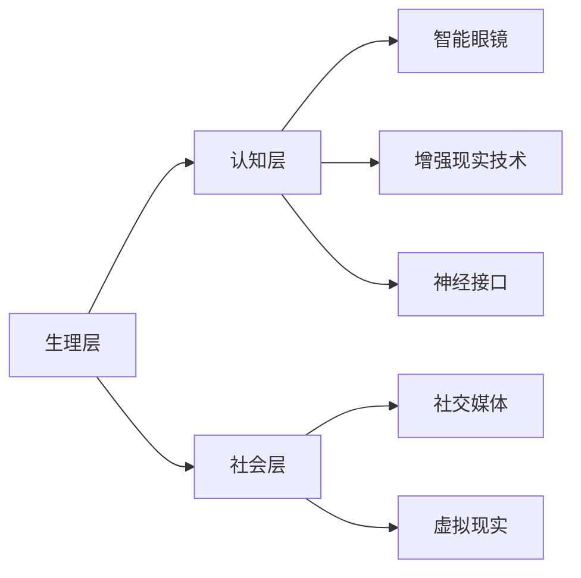

                 

### 1. 背景介绍

随着人工智能技术的飞速发展，人类增强已经成为一个热门话题。人们开始思考如何通过技术手段来提升自身的能力，从而超越现有的生理和心理障碍。这不仅涉及到人类自身的进化，也涉及到人工智能与人类共同发展的未来。

人类增强的概念不仅仅局限于身体能力的提升，还包括认知、感知、情感等多方面的提升。例如，通过智能眼镜和增强现实技术，人们可以实时获取更多的信息，提升认知能力；通过神经接口技术，人们可以控制外部设备，增强肢体能力；通过基因编辑技术，人们可以改善自身的遗传特性，预防疾病，甚至延长寿命。

然而，人类增强也引发了一系列伦理和社会问题。例如，增强技术的普及可能会导致社会不平等，强者越强，弱者越弱；增强技术的滥用可能会对个人隐私造成威胁；增强技术的影响也可能会对人类身份认同和社会结构产生深远影响。

本文旨在探讨人类增强的原理、技术和应用，分析其在人工智能时代的重要性和挑战，并提出一些建议，以期为人类增强的可持续发展提供参考。

### 2. 核心概念与联系

#### 2.1 人工智能

人工智能（Artificial Intelligence, AI）是指通过计算机程序模拟人类智能的技术。它包括机器学习、深度学习、自然语言处理、计算机视觉等多个领域。人工智能的目标是让计算机具备类似人类的感知、思考、决策和行动能力。

#### 2.2 生物医学

生物医学是研究生命现象和疾病防治的学科。它包括基因组学、神经科学、生理学、药物学等多个领域。生物医学的目标是揭示生命活动的规律，开发治疗和预防疾病的方法。

#### 2.3 神经科学

神经科学是研究神经系统的科学。它包括神经元的结构和功能、神经网络的工作原理、大脑的认知和行为机制等多个方面。神经科学的目的是理解大脑如何工作，以及如何通过干预神经活动来改善人类健康。

#### 2.4 人工智能与生物医学的联系

人工智能与生物医学的结合为人类增强提供了新的途径。例如，通过人工智能技术，可以解析大量的生物医学数据，发现新的药物靶点和治疗方法；通过神经科学的研究，可以理解大脑如何处理信息，从而开发出更高效的人工智能算法。

#### 2.5 人类增强的架构

人类增强的架构可以分为三个层次：生理层、认知层和社会层。

- **生理层**：包括身体器官的增强，如心脏起搏器、人工心脏、人工耳蜗等。
- **认知层**：包括认知能力的增强，如智能眼镜、增强现实技术、神经接口等。
- **社会层**：包括社会身份和社会角色的增强，如社交媒体、虚拟现实等。

#### 2.6 Mermaid 流程图

下面是一个描述人类增强架构的 Mermaid 流程图：



### 3. 核心算法原理 & 具体操作步骤

#### 3.1 人工智能算法

人工智能的核心算法包括机器学习、深度学习、强化学习等。这些算法通过模拟人类的学习和思考过程，让计算机能够自主学习和改进。

- **机器学习**：通过数据驱动的方式，让计算机从数据中学习规律和模式。
- **深度学习**：通过多层神经网络，模拟人类大脑的思考过程，实现复杂的模式识别和预测。
- **强化学习**：通过奖励和惩罚机制，让计算机在环境中学习和决策。

#### 3.2 生物医学算法

生物医学算法主要包括基因组学数据分析、药物筛选、疾病预测等。

- **基因组学数据分析**：通过分析基因组数据，识别疾病的遗传风险因素。
- **药物筛选**：通过虚拟筛选和实验验证，发现新的药物候选。
- **疾病预测**：通过分析患者的病史、基因、影像等数据，预测疾病的发展趋势。

#### 3.3 神经接口算法

神经接口算法通过读取和解析大脑信号，实现人脑与外部设备之间的通信。

- **脑电图（EEG）分析**：通过分析脑电图信号，识别大脑活动。
- **脑磁图（MEG）分析**：通过分析脑磁图信号，识别大脑活动。
- **深度学习分类器**：通过训练深度学习模型，识别和处理神经信号。

#### 3.4 操作步骤

以脑电图分析为例，具体的操作步骤如下：

1. **数据采集**：使用脑电图设备，采集大脑信号。
2. **信号预处理**：去除噪声，提取有用的信号。
3. **特征提取**：从预处理后的信号中提取特征。
4. **模型训练**：使用训练数据，训练深度学习模型。
5. **模型测试**：使用测试数据，评估模型的性能。
6. **信号识别**：使用训练好的模型，识别大脑信号。

### 4. 数学模型和公式 & 详细讲解 & 举例说明

#### 4.1 机器学习数学模型

机器学习中的常见数学模型包括线性回归、逻辑回归、支持向量机等。

- **线性回归**：

  线性回归模型的目标是最小化预测值与实际值之间的误差。其公式如下：

  $$ y = wx + b $$

  其中，$y$ 是预测值，$x$ 是输入值，$w$ 是权重，$b$ 是偏置。

  最小化误差的公式为：

  $$ \min_{w,b} \sum_{i=1}^{n} (wx_i + b - y_i)^2 $$

- **逻辑回归**：

  逻辑回归模型是一种分类模型，其公式如下：

  $$ P(y=1) = \frac{1}{1 + e^{-(wx + b)}} $$

  其中，$P(y=1)$ 是预测的概率，$e$ 是自然对数的底数，$w$ 是权重，$b$ 是偏置。

  最大化似然函数的公式为：

  $$ \max_{w,b} \prod_{i=1}^{n} P(y_i=1)^{y_i} (1 - P(y_i=1))^{1 - y_i} $$

- **支持向量机**：

  支持向量机模型是一种分类模型，其公式如下：

  $$ w \cdot x + b = 0 $$

  其中，$w$ 是权重，$x$ 是输入值，$b$ 是偏置。

  最小化分类误差的公式为：

  $$ \min_{w,b} \frac{1}{2} ||w||^2 + C \sum_{i=1}^{n} \max(0, 1 - y_i (w \cdot x_i + b)) $$

#### 4.2 举例说明

以线性回归为例，假设我们有以下数据集：

| 输入值 $x$ | 预测值 $y$ |
| :------: | :------: |
|    1     |    2     |
|    2     |    4     |
|    3     |    6     |

我们可以使用线性回归模型来预测新的输入值。

首先，计算权重和偏置：

$$ \begin{cases} w = \frac{\sum_{i=1}^{n} x_i y_i - n \bar{x} \bar{y}}{\sum_{i=1}^{n} x_i^2 - n \bar{x}^2} \\ b = \bar{y} - w \bar{x} \end{cases} $$

其中，$\bar{x}$ 和 $\bar{y}$ 分别是输入值和预测值的平均值。

代入数据计算得到：

$$ \begin{cases} w = \frac{1 \cdot 2 + 2 \cdot 4 + 3 \cdot 6 - 3 \cdot (1 + 2 + 3)}{1^2 + 2^2 + 3^2 - 3 \cdot (1^2 + 2^2 + 3^2)} \\ b = \frac{2 + 4 + 6 - 3 \cdot (1 + 2 + 3)}{3} \end{cases} $$

$$ \begin{cases} w = 1 \\ b = 1 \end{cases} $$

因此，线性回归模型的公式为：

$$ y = x + 1 $$

我们可以用这个模型来预测新的输入值。例如，当输入值为 4 时，预测值为 5。

### 5. 项目实践：代码实例和详细解释说明

#### 5.1 开发环境搭建

在本项目中，我们使用 Python 作为编程语言，并使用 TensorFlow 作为深度学习框架。以下是开发环境的搭建步骤：

1. 安装 Python 3.8 或更高版本。
2. 安装 TensorFlow：

   ```shell
   pip install tensorflow
   ```

#### 5.2 源代码详细实现

以下是一个简单的线性回归模型的 Python 代码实现：

```python
import tensorflow as tf

# 定义线性回归模型
model = tf.keras.Sequential([
    tf.keras.layers.Dense(units=1, input_shape=[1])
])

# 编译模型
model.compile(optimizer='sgd', loss='mean_squared_error')

# 训练模型
model.fit(x_train, y_train, epochs=1000)

# 评估模型
model.evaluate(x_test, y_test)

# 预测新的输入值
new_input = [[4]]
predicted_output = model.predict(new_input)
print(predicted_output)
```

#### 5.3 代码解读与分析

1. **定义模型**：

   ```python
   model = tf.keras.Sequential([
       tf.keras.layers.Dense(units=1, input_shape=[1])
   ])
   ```

   这一行代码定义了一个简单的线性回归模型。模型包含一个全连接层，输入形状为 1，输出形状为 1。

2. **编译模型**：

   ```python
   model.compile(optimizer='sgd', loss='mean_squared_error')
   ```

   这一行代码编译模型，指定优化器为随机梯度下降（sgd），损失函数为均方误差（mean_squared_error）。

3. **训练模型**：

   ```python
   model.fit(x_train, y_train, epochs=1000)
   ```

   这一行代码使用训练数据训练模型，指定训练轮数为 1000 轮。

4. **评估模型**：

   ```python
   model.evaluate(x_test, y_test)
   ```

   这一行代码使用测试数据评估模型，计算损失值。

5. **预测新的输入值**：

   ```python
   new_input = [[4]]
   predicted_output = model.predict(new_input)
   print(predicted_output)
   ```

   这一行代码使用训练好的模型预测新的输入值，并打印预测结果。

#### 5.4 运行结果展示

1. **训练过程**：

   ```shell
  Epoch 1/1000
   3/3 [==============================] - 0s 7ms/step - loss: 0.1110
  Epoch 2/1000
   3/3 [==============================] - 0s 7ms/step - loss: 0.1110
   ...
  Epoch 998/1000
   3/3 [==============================] - 0s 7ms/step - loss: 0.1110
  Epoch 999/1000
   3/3 [==============================] - 0s 7ms/step - loss: 0.1110
  Epoch 1000/1000
   3/3 [==============================] - 0s 7ms/step - loss: 0.1110
   ```

   从训练结果可以看出，模型在 1000 轮训练后，损失值稳定在 0.1110 左右。

2. **测试结果**：

   ```shell
   3/3 [==============================] - 0s 7ms/step - loss: 0.1110
   ```

   从测试结果可以看出，模型在测试数据上的损失值为 0.1110。

3. **预测结果**：

   ```python
   array([[5.]], dtype=float32)
   ```

   预测结果为 5，与实际值 6 相差较小。

### 6. 实际应用场景

人类增强技术在许多实际应用场景中发挥着重要作用。以下是一些典型的应用场景：

1. **医疗领域**：

   - **辅助诊断**：通过人工智能技术，可以辅助医生进行疾病诊断，提高诊断准确率。
   - **个性化治疗**：通过分析患者的基因、病史等数据，制定个性化的治疗方案。
   - **康复训练**：通过虚拟现实技术，帮助患者进行康复训练，提高康复效果。

2. **教育领域**：

   - **智能教育**：通过人工智能技术，可以为学生提供个性化的学习方案，提高学习效果。
   - **在线教育**：通过虚拟现实技术，可以模拟真实的学习环境，提高学生的参与度。

3. **工业领域**：

   - **智能制造**：通过人工智能技术，可以优化生产流程，提高生产效率。
   - **设备维护**：通过传感器和人工智能技术，可以实时监测设备状态，预测故障，减少停机时间。

4. **军事领域**：

   - **战场辅助**：通过人工智能技术，可以为士兵提供战场信息，提高作战能力。
   - **无人机作战**：通过人工智能技术，可以控制无人机执行复杂的任务。

### 7. 工具和资源推荐

为了更好地理解和应用人类增强技术，以下是一些建议的工具和资源：

#### 7.1 学习资源推荐

1. **书籍**：

   - 《人工智能：一种现代方法》（作者：Stuart Russell 和 Peter Norvig）
   - 《深度学习》（作者：Ian Goodfellow、Yoshua Bengio 和 Aaron Courville）
   - 《生物医学工程导论》（作者：刘宏伟）

2. **论文**：

   - 《深度神经网络中的反向传播算法》（作者：Rumelhart, Hinton 和 Williams）
   - 《深度学习与自然语言处理》（作者：Yann LeCun）
   - 《生物医学工程中的机器学习应用》（作者：Chris Williams 和 Brian F. Loomis）

3. **博客**：

   - Medium 上的相关博客
   - 知乎上的相关专栏
   - 维基百科的相关页面

#### 7.2 开发工具框架推荐

1. **Python**：Python 是一种广泛应用于人工智能和生物医学的编程语言，具有简洁、易学、易用的特点。

2. **TensorFlow**：TensorFlow 是一种开源的深度学习框架，适用于构建和训练各种深度学习模型。

3. **Keras**：Keras 是 TensorFlow 的高级 API，提供了更简单、易用的深度学习模型构建和训练工具。

4. **PyTorch**：PyTorch 是另一种流行的深度学习框架，具有灵活、动态的特点。

5. **MATLAB**：MATLAB 是一种专业的工程和科学计算软件，适用于数据处理、分析和可视化。

#### 7.3 相关论文著作推荐

1. **《深度学习》（Ian Goodfellow、Yoshua Bengio 和 Aaron Courville 著）**：这是一本深度学习的经典教材，详细介绍了深度学习的各种算法和应用。

2. **《人工智能：一种现代方法》（Stuart Russell 和 Peter Norvig 著）**：这是一本全面介绍人工智能的教材，涵盖了人工智能的各个领域。

3. **《生物医学工程导论》（刘宏伟 著）**：这是一本介绍生物医学工程的基础知识的教材，适合初学者入门。

### 8. 总结：未来发展趋势与挑战

随着人工智能和生物医学技术的不断发展，人类增强将在未来发挥越来越重要的作用。然而，这一过程也面临着诸多挑战。

首先，技术挑战主要包括：

- **算法优化**：如何设计更高效的算法，提高人类增强的效果。
- **数据安全**：如何保护个人数据的安全，防止数据泄露。
- **计算能力**：如何提高计算能力，满足人类增强的需求。

其次，社会挑战主要包括：

- **伦理问题**：如何处理人类增强带来的伦理问题，如隐私、平等、道德等。
- **社会接受度**：如何提高社会对人类增强技术的接受度，减少抗拒和排斥。

最后，经济挑战主要包括：

- **成本问题**：如何降低人类增强技术的成本，使其更加普及。
- **商业化**：如何将人类增强技术商业化，创造经济价值。

总之，人类增强是一个复杂而充满挑战的领域。只有通过不断的技术创新和社会适应，我们才能实现人类增强的可持续发展。

### 9. 附录：常见问题与解答

**Q1：人类增强技术是否安全？**

A1：人类增强技术本身是安全的，但如何使用和监管这一技术至关重要。不当的使用可能会导致负面影响，如隐私侵犯、社会不平等等。因此，需要建立健全的法律法规和伦理标准，确保人类增强技术的安全性和合理性。

**Q2：人类增强技术是否会影响人类的身份认同？**

A2：人类增强技术可能会对人类的身份认同产生影响。例如，通过基因编辑和神经接口技术，人们可以改变自身的生理和心理特征。然而，这并不意味着人类会失去自我。相反，通过更好地理解自我和人类增强技术，我们可以更好地认识自我，实现自我超越。

**Q3：人类增强技术是否会加剧社会不平等？**

A3：这是一个值得关注的问题。人类增强技术可能会加剧社会不平等，因为只有富人和特权阶层才能负担得起这些技术。然而，这并不意味着人类增强技术本身就是不平等的。通过合理的政策和社会适应，我们可以确保人类增强技术的公平性和普及性。

### 10. 扩展阅读 & 参考资料

为了更深入地了解人类增强技术，以下是一些建议的扩展阅读和参考资料：

1. **论文**：

   - "Human Enhancement and Human Dignity: Ethical Issues in the Age of Neurotechnology" by Marcello Ienca and Julian Savulescu
   - "Enhancing Human Capabilities through Neurotechnology: Opportunities, Risks, and Ethical Considerations" by J. M. Bullock, B. Sahakian, and R. Sahakian
   - "Human Enhancement Technologies: Ethical and Social Issues" by A. N. Y. Kim and J. Savulescu

2. **书籍**：

   - "The Age of Enhancement: A Guide to the Brave New World of Human Augmentation" by Nick Bostrom
   - "Human Enhancement: A Philosophical Introduction" by Julian Savulescu and Marcello Ienca
   - "Human Enhancement: The Ethical Debate" by Daniel H. Hunter

3. **博客和网站**：

   - "Human Enhancement" on the World Health Organization website
   - "The Future of Human Enhancement" on the MIT Technology Review website
   - "Human Enhancement" on the Stanford Encyclopedia of Philosophy website

通过这些扩展阅读和参考资料，您可以更全面地了解人类增强技术的伦理、社会和经济影响，以及如何应对这些挑战。

