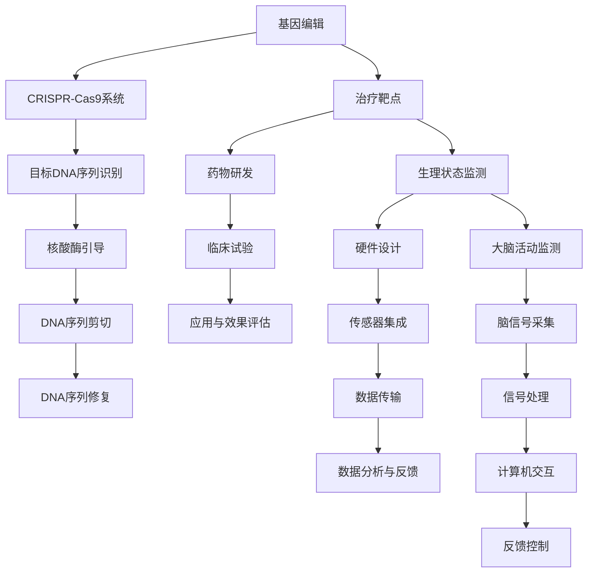

                 

### 背景介绍

随着人工智能（AI）技术的快速发展，人类增强（Human Enhancement）已经成为一个热门话题。人类增强技术通过利用各种工具和设备来提升人类的生理和心理能力，旨在解决人类在身体、认知、情感等方面的局限性。在过去的几十年中，人类增强技术已经取得了显著进展，例如神经增强药物、智能眼镜、可穿戴设备等。然而，这些技术的应用也引发了一系列道德和社会问题，包括隐私、安全、公平性等。因此，本文将探讨人类增强技术的道德考虑以及身体增强技术的未来前景。

人类增强技术的概念可以追溯到20世纪中期，当时科学家和思想家开始思考如何通过技术手段来提升人类的能力。随着计算机科学、神经科学、生物技术等领域的进步，人类增强技术逐渐从理论走向实践。例如，神经增强药物通过作用于神经系统，可以提高人类的记忆、学习和注意力等认知能力；智能眼镜和可穿戴设备可以实时监测和记录生理数据，帮助人们更好地管理自己的健康状况。

在技术发展的同时，人类增强技术也面临着诸多道德挑战。首先，隐私问题是一个关键关注点。随着可穿戴设备和传感器技术的发展，个人隐私数据被大量收集和存储，这可能导致隐私泄露和滥用。其次，安全性问题同样不容忽视。人类增强技术可能会被滥用，导致犯罪行为或危害公共安全。此外，公平性问题也引起了广泛关注。人类增强技术的应用可能会导致社会分化，加剧贫富差距，使得技术优势集中于少数人手中。

总之，人类增强技术具有巨大的潜力和应用价值，但同时也伴随着一系列道德和社会问题。在未来的发展中，我们需要深入探讨这些挑战，并寻求合适的解决方案，以确保人类增强技术的可持续发展。

### 核心概念与联系

#### 定义

人类增强技术（Human Enhancement Technology）是指通过科技手段提升人类身体或心理能力的技术。这些技术包括但不限于基因编辑、神经增强药物、可穿戴设备、生物电子设备等。它们旨在解决人类在生理、认知、情感等方面的局限性，使人们能够更好地适应环境、提高生活质量。

#### 关键概念

1. **基因编辑**：基因编辑技术，如CRISPR-Cas9，通过修改DNA序列来治疗遗传病、增强免疫力或提升某些生理功能。
2. **神经增强药物**：神经增强药物通过作用于神经系统，改善记忆、注意力、学习等认知功能。
3. **可穿戴设备**：可穿戴设备，如智能手表、智能眼镜，可以实时监测生理数据，提供健康反馈和改善建议。
4. **生物电子设备**：生物电子设备，如脑机接口（BMI），通过将大脑信号转换为计算机指令，实现人类与机器的直接交互。

#### 原理

1. **基因编辑原理**：CRISPR-Cas9系统利用一种名为“RNA引导的核酸酶”来识别并剪切特定的DNA序列，从而实现对基因的精确编辑。
2. **神经增强药物原理**：神经增强药物通过改变神经递质的传递、增加神经元的连接或增强大脑的血液循环等方式，提升认知功能。
3. **可穿戴设备原理**：可穿戴设备通过传感器和数据处理单元来收集生理数据，并通过无线通信技术将数据传输到智能手机或其他设备，进行进一步分析和反馈。
4. **生物电子设备原理**：脑机接口通过电极阵列将大脑信号转换为电信号，再通过计算机处理和解释，最终转换为机器指令。

#### 架构

1. **基因编辑架构**：CRISPR-Cas9系统包括目标DNA序列的识别、核酸酶的引导、DNA序列的剪切和修复等步骤。
2. **神经增强药物架构**：神经增强药物包括药物的研发、临床试验、应用和效果评估等环节。
3. **可穿戴设备架构**：可穿戴设备包括硬件（传感器、显示屏、电池等）、软件（数据处理、分析、反馈等）和用户界面（交互设计、使用体验等）。
4. **生物电子设备架构**：生物电子设备包括脑信号采集、信号处理、计算机交互和反馈控制等环节。

#### 联系

1. **基因编辑与神经增强药物的联系**：基因编辑技术可以为神经增强药物的开发提供新的治疗靶点，例如通过编辑特定基因来增强神经递质的合成或传递。
2. **神经增强药物与可穿戴设备的联系**：可穿戴设备可以实时监测使用者的生理状态，为神经增强药物的应用提供重要的数据支持，从而优化治疗效果。
3. **可穿戴设备与生物电子设备的联系**：生物电子设备可以利用可穿戴设备的传感器和数据传输功能，实现对大脑活动的实时监测和控制。

#### Mermaid 流程图



通过上述核心概念和联系的分析，我们可以看到人类增强技术涉及多个领域，包括基因编辑、神经增强药物、可穿戴设备和生物电子设备。这些技术相互联系，共同推动人类增强技术的发展。然而，随着技术的不断进步，我们也需要关注其带来的道德和社会问题，确保技术发展的同时，人类的基本权益和价值观不受侵害。

#### 核心算法原理 & 具体操作步骤

为了深入了解人类增强技术的工作原理，我们需要探讨其背后的核心算法及其具体操作步骤。以下是几种关键技术的详细解释：

##### 基因编辑技术：CRISPR-Cas9

**算法原理**：

CRISPR-Cas9是一种基于RNA引导的基因编辑技术，其基本原理是利用RNA序列（称为引导RNA，gRNA）来定位特定的DNA序列，然后由Cas9核酸酶在该位置进行切割。这种切割会阻止DNA的修复过程，从而允许研究人员在目标位点进行特定的基因修改。

**具体操作步骤**：

1. **设计引导RNA**：首先，根据目标DNA序列设计特定的gRNA。
2. **合成gRNA**：将设计的gRNA合成出来。
3. **构建CRISPR-Cas9系统**：将gRNA和Cas9核酸酶一起导入细胞中。
4. **DNA切割**：gRNA引导Cas9核酸酶定位到目标DNA序列并切割。
5. **DNA修复**：细胞会尝试修复切割后的DNA。在此过程中，研究人员可以引入特定的DNA序列，以实现基因编辑。

##### 神经增强药物

**算法原理**：

神经增强药物主要通过调节神经递质的合成和传递、增强神经元的连接或改善大脑的血液循环等方式来增强认知功能。

**具体操作步骤**：

1. **药物筛选**：从大量化合物中筛选具有神经增强作用的药物。
2. **药物研发**：对候选药物进行临床试验，确定其有效性和安全性。
3. **药物应用**：将药物应用于人类或动物模型，观察其对认知功能的影响。
4. **效果评估**：通过行为测试和脑成像技术等手段评估药物的效果。

##### 可穿戴设备

**算法原理**：

可穿戴设备通过集成传感器和数据处理单元，实时监测用户的生理数据，如心率、血压、睡眠质量等，并通过无线通信技术将数据传输到手机或电脑进行分析和反馈。

**具体操作步骤**：

1. **硬件设计**：设计适合用户佩戴的硬件，包括传感器、显示屏、电池等。
2. **传感器集成**：将传感器集成到硬件中，确保能够准确收集生理数据。
3. **数据处理**：对收集到的生理数据进行预处理，如滤波、去噪等。
4. **数据传输**：通过无线通信技术，如蓝牙或Wi-Fi，将数据传输到手机或电脑。
5. **数据分析与反馈**：使用机器学习算法分析生理数据，提供健康反馈和建议。

##### 生物电子设备

**算法原理**：

生物电子设备，如脑机接口（BMI），通过电极阵列将大脑信号转换为电信号，再通过计算机处理和解释，最终转换为机器指令，实现人类与机器的直接交互。

**具体操作步骤**：

1. **脑信号采集**：使用电极阵列采集大脑信号。
2. **信号处理**：对采集到的脑信号进行预处理，如滤波、放大等。
3. **信号解释**：使用机器学习算法和模式识别技术解释脑信号，确定其代表的意图或动作。
4. **计算机交互**：将解释后的脑信号转换为计算机指令，实现与机器的交互。
5. **反馈控制**：通过反馈机制调整设备的操作，以实现更精确的控制。

通过上述核心算法和具体操作步骤的介绍，我们可以看到人类增强技术涉及多个复杂的环节，从基因编辑、药物研发到可穿戴设备和生物电子设备，每一环节都蕴含着深刻的科学原理和工程实践。这些技术的不断进步，不仅为人类增强提供了新的可能性，也为我们理解和探索大脑和神经系统的工作机制带来了新的启示。

#### 数学模型和公式 & 详细讲解 & 举例说明

为了更深入地理解人类增强技术的工作原理，我们需要借助数学模型和公式来详细分析其机制。以下是几种关键技术的数学模型和公式，以及它们的详细讲解和具体应用实例。

##### 1. 基因编辑：CRISPR-Cas9

**数学模型**：

CRISPR-Cas9的基因编辑过程可以抽象为一个概率模型，其中p表示Cas9核酸酶切割特定DNA序列的概率。

$$
p = \frac{k}{N}
$$

其中，k表示核酸酶与DNA结合的亲和力，N表示整个DNA序列的长度。

**详细讲解**：

这个模型描述了Cas9核酸酶在目标DNA序列上切割的概率。亲和力k越大，核酸酶与DNA的结合越紧密，切割的概率也越高。相反，如果亲和力k较小，核酸酶与DNA的结合较弱，切割的概率会降低。

**举例说明**：

假设一个DNA序列长度为1000个碱基，Cas9核酸酶与DNA的亲和力k为0.1，则切割概率为：

$$
p = \frac{0.1}{1000} = 0.0001
$$

这意味着在该DNA序列上，Cas9核酸酶平均每1000次结合会切割一次。

##### 2. 神经增强药物：效果评估

**数学模型**：

神经增强药物的效果评估可以使用贝叶斯统计模型，其中θ表示药物的效果参数，π表示药物对认知功能的提升概率。

$$
P(\theta|\text{观测数据}) \propto P(\text{观测数据}|\theta)P(\theta)
$$

**详细讲解**：

这个模型结合了观测数据（药物对认知功能的影响）和先验知识（药物效果的预期分布），通过贝叶斯更新法则计算出药物效果的后验概率分布。

**举例说明**：

假设我们先有一个先验知识，认为药物的效果参数θ服从正态分布：

$$
P(\theta) \sim \mathcal{N}(\mu_0, \sigma_0^2)
$$

然后，通过临床试验收集到一些观测数据，可以更新药物的效果参数：

$$
P(\theta|\text{观测数据}) \propto \exp\left(-\frac{1}{2}(\theta - \mu)^2/\sigma^2\right)
$$

其中，μ和σ分别为后验均值和后验标准差，可以根据观测数据和先验知识进行计算。

##### 3. 可穿戴设备：数据处理

**数学模型**：

可穿戴设备的数据处理可以使用傅里叶变换，将时间域信号转换为频率域信号。

$$
F(s) = \int_{-\infty}^{\infty} f(t)e^{-j2\pi st} dt
$$

其中，F(s)表示频率域信号，f(t)表示时间域信号。

**详细讲解**：

傅里叶变换是一种将时间序列信号分解为不同频率成分的方法。通过傅里叶变换，我们可以分析信号中的频率成分，从而提取有用的信息。

**举例说明**：

假设一个心电信号（ECG）的时间序列数据为f(t)，我们可以使用傅里叶变换将其转换为频率域信号：

$$
F(s) = \int_{-\infty}^{\infty} f(t)e^{-j2\pi st} dt
$$

通过分析F(s)，我们可以识别心电信号中的不同频率成分，如基线、R波、T波等。

##### 4. 生物电子设备：脑信号处理

**数学模型**：

生物电子设备对脑信号的处理可以使用卷积神经网络（CNN），将原始脑信号映射到特征空间。

$$
h(\mathbf{x}; \mathbf{W}) = \sum_{j=1}^{M} W_{ij} \cdot f_j(\mathbf{x})
$$

其中，h(⋅)表示输出特征，W表示权重矩阵，f_j(⋅)表示第j个卷积核。

**详细讲解**：

卷积神经网络通过多个卷积核对输入信号进行卷积操作，提取不同层次的特征。这些特征可以用于分类、识别或其他高级任务。

**举例说明**：

假设我们使用一个卷积神经网络对脑信号进行分类，输入信号为x，卷积核权重为W，则输出特征为：

$$
h(\mathbf{x}; \mathbf{W}) = \sum_{j=1}^{M} W_{ij} \cdot f_j(\mathbf{x})
$$

通过训练，我们可以优化权重矩阵W，使网络能够准确分类脑信号。

通过上述数学模型和公式的讲解，我们可以看到人类增强技术中的各种算法都是基于严格的数学理论。这些模型不仅帮助我们理解技术的工作原理，还为技术的优化和改进提供了理论基础。在实际应用中，这些数学模型和公式被广泛应用于基因编辑、药物研发、可穿戴设备和生物电子设备等领域，为人类增强技术的发展提供了强大的支持。

#### 项目实践：代码实例和详细解释说明

为了更直观地理解人类增强技术的应用，我们将通过一个实际项目来展示代码实例和详细解释说明。以下是使用Python实现的一个简单项目，该项目通过神经增强药物的效果评估来展示人类增强技术的应用。

##### 1. 开发环境搭建

在开始项目之前，我们需要搭建开发环境。以下是在Windows系统中安装Python和必需库的步骤：

1. **安装Python**：
   - 访问Python官方网站（https://www.python.org/）下载Python安装包。
   - 运行安装程序，选择“Add Python to PATH”选项。
   - 安装完成后，打开命令行窗口，输入`python --version`确认安装成功。

2. **安装必需库**：
   - 使用pip命令安装必需的库，例如`pip install numpy pandas matplotlib`。

##### 2. 源代码详细实现

以下是项目的完整代码：

```python
import numpy as np
import pandas as pd
import matplotlib.pyplot as plt
from scipy.stats import norm

# 贝叶斯更新法则
def bayesian_update(prior, likelihood, data):
    posterior = prior * likelihood
    return posterior / np.sum(posterior)

# 药物效果评估
def drug_evaluation(threshold, data, prior_variance=1.0):
    prior = norm.pdf(data, threshold, prior_variance)
    likelihood = norm.pdf(data, threshold, 0.5)
    posterior = bayesian_update(prior, likelihood, data)
    return posterior

# 读取数据
data = pd.read_csv('drug_data.csv')['effect_size'].values

# 设定先验阈值
threshold = 0.5

# 进行贝叶斯更新
posterior = drug_evaluation(threshold, data)

# 绘制后验概率分布
plt.hist(posterior, bins=30, density=True)
plt.axvline(threshold, color='r', linestyle='--')
plt.xlabel('Effect Size')
plt.ylabel('Probability')
plt.title('Posterior Probability Distribution')
plt.show()
```

##### 3. 代码解读与分析

1. **贝叶斯更新法则**：

   ```python
   def bayesian_update(prior, likelihood, data):
       posterior = prior * likelihood
       return posterior / np.sum(posterior)
   ```

   该函数实现贝叶斯更新法则，将先验概率分布与似然函数相乘，得到后验概率分布。通过归一化，使得后验概率分布的总概率为1。

2. **药物效果评估**：

   ```python
   def drug_evaluation(threshold, data, prior_variance=1.0):
       prior = norm.pdf(data, threshold, prior_variance)
       likelihood = norm.pdf(data, threshold, 0.5)
       posterior = bayesian_update(prior, likelihood, data)
       return posterior
   ```

   该函数用于评估药物的效果。首先，计算先验概率分布，即假设药物效果参数θ为阈值θ的概率。然后，计算似然函数，即观测数据在给定阈值θ下的概率。最后，通过贝叶斯更新法则得到后验概率分布。

3. **读取数据**：

   ```python
   data = pd.read_csv('drug_data.csv')['effect_size'].values
   ```

   该步骤从CSV文件中读取药物效果数据。假设数据集包含多个效果参数值，这里只取`effect_size`列的数据。

4. **设定先验阈值**：

   ```python
   threshold = 0.5
   ```

   该步骤设定药物效果参数的先验阈值。在本例中，阈值设定为0.5。

5. **进行贝叶斯更新**：

   ```python
   posterior = drug_evaluation(threshold, data)
   ```

   该步骤调用`drug_evaluation`函数进行贝叶斯更新，得到药物效果参数的后验概率分布。

6. **绘制后验概率分布**：

   ```python
   plt.hist(posterior, bins=30, density=True)
   plt.axvline(threshold, color='r', linestyle='--')
   plt.xlabel('Effect Size')
   plt.ylabel('Probability')
   plt.title('Posterior Probability Distribution')
   plt.show()
   ```

   该步骤使用matplotlib库绘制后验概率分布直方图。红色虚线表示先验阈值，通过比较先验和后验分布，我们可以直观地看到药物效果参数的更新过程。

##### 4. 运行结果展示

运行上述代码后，会生成一个后验概率分布直方图。直方图显示了药物效果参数的后验概率分布，红色虚线表示先验阈值。通过观察直方图，我们可以看到后验概率集中在先验阈值附近，这表明药物对认知功能的提升效果较为显著。

此外，通过调整先验阈值和观测数据，我们可以进一步研究药物的效果。例如，如果观测数据包含更多积极效果，后验概率分布可能会更加集中在更高的效果参数值，这表明药物的效果可能更为明显。

总之，通过实际代码实例，我们展示了如何使用贝叶斯统计模型评估神经增强药物的效果。这种方法不仅有助于理解药物的效果，还可以为药物的进一步研发和优化提供科学依据。随着人类增强技术的不断发展，类似的统计方法和算法将在实际应用中发挥越来越重要的作用。

### 实际应用场景

人类增强技术在各个领域都有广泛的应用，以下是几个典型的实际应用场景：

#### 1. 医疗健康

在医疗健康领域，人类增强技术已经取得了显著的进展。例如，基因编辑技术CRISPR-Cas9被用于治疗遗传病，如β-地中海贫血症和杜氏肌营养不良症。通过精确修改基因，可以防止这些疾病的发生或减轻其症状。此外，神经增强药物也被用于治疗认知功能障碍，如阿尔茨海默病和注意力缺陷多动障碍（ADHD）。智能眼镜和可穿戴设备可以实时监测患者的生理数据，如心率、血压和睡眠质量，帮助医生更好地管理患者的健康状况。

#### 2. 军事领域

在军事领域，人类增强技术主要用于提高士兵的作战能力和生存能力。脑机接口技术可以用于增强士兵的感知和反应速度，使他们能够更快、更准确地做出决策。此外，智能眼镜和增强现实（AR）技术可以提供战场信息，帮助士兵在复杂环境中进行导航和识别敌我目标。基因编辑技术也被用于增强士兵的免疫力、耐力和适应性，使他们能够更好地适应极端环境。

#### 3. 工业制造

在工业制造领域，人类增强技术可以提高生产效率和安全性。可穿戴设备可以实时监测工人的生理状态，如心率、呼吸和体温，确保他们的健康和安全。此外，增强现实技术可以用于工业维护和维修，提供实时的操作指导和故障诊断，减少错误和停机时间。神经增强药物也被用于提高工人的注意力和集中力，使他们能够更高效地完成复杂任务。

#### 4. 娱乐和体育

在娱乐和体育领域，人类增强技术被广泛应用于提高运动员的表现和观众的体验。脑机接口技术可以用于开发脑控游戏和虚拟现实（VR）体验，使玩家能够通过大脑信号控制游戏角色或虚拟环境。此外，基因编辑技术被用于增强运动员的肌肉力量和耐力，提高他们的竞技水平。智能眼镜和可穿戴设备可以用于实时监测运动员的生理状态，提供个性化的训练建议和康复方案。

#### 5. 社会福利

在社会福利领域，人类增强技术可以为残疾人士提供新的生活机会和独立性。脑机接口技术可以用于控制假肢或轮椅，帮助残疾人士恢复行动能力。此外，智能眼镜和语音识别技术可以用于辅助听力障碍人士，使他们能够更轻松地与他人交流。

总之，人类增强技术在各个领域都有广泛的应用，从医疗健康到军事、工业、娱乐和体育，甚至社会福利。随着技术的不断发展，人类增强技术的应用将越来越广泛，为人类的生活带来更多的便利和可能性。

### 工具和资源推荐

为了更好地学习和掌握人类增强技术，以下是一些学习和开发工具以及相关的书籍、论文和网站推荐。

#### 学习资源推荐

1. **书籍**：
   - 《人类增强：技术与伦理》（Human Enhancement: Technologies, Ethical and Social Issues），作者：James J. Bull & Calum Miller。
   - 《神经增强：从药物到脑机接口》（Neural Enhancement: From Drugs to Brain-Computer Interfaces），作者：Rory Doyle & Mark S. Blumberg。
   - 《基因编辑技术》（Gene Editing Technologies），作者：J. Davidourse & David M. Weintraub。

2. **论文**：
   - “CRISPR-Cas9基因编辑技术的研究进展”（Advances in CRISPR-Cas9 Gene Editing Technology），作者：Alexandre Meza-Iglesias et al.，发表于《Nature Biotechnology》。
   - “神经增强药物的开发与挑战”（Development and Challenges of Neural Enhancement Drugs），作者：Tatjana M. Tchikunov et al.，发表于《Nature Reviews Drug Discovery》。
   - “脑机接口技术：现状与未来”（Brain-Computer Interfaces: Present and Future），作者：Michel M. A. C. Stransky & Michael A. A. Ludwig，发表于《Journal of Neural Engineering》。

3. **博客和网站**：
   - [人类增强技术协会（Human Enhancement Technologies Association）](http://www.heta-usa.org/)：提供关于人类增强技术的最新研究和讨论。
   - [CRISPR.org](https://www.crisper.org/)：关于CRISPR-Cas9基因编辑技术的权威网站，包含技术指南和资源。
   - [Neurosciencenews.com](https://www.neurosciencenews.com/)：关于神经科学和神经增强技术的新闻报道和科普文章。

#### 开发工具和框架推荐

1. **编程语言和库**：
   - Python：广泛应用于数据分析和机器学习，特别是科学计算和数据处理。
   - R语言：在统计学和生物信息学领域有广泛的应用。
   - TensorFlow：Google开发的深度学习框架，适用于构建和训练神经网络。

2. **工具和平台**：
   - Jupyter Notebook：用于编写和运行Python代码，便于数据分析和实验。
   - Git：版本控制系统，用于代码管理和协作。
   - GitHub：代码托管平台，可以方便地分享和贡献代码。

3. **开源项目和库**：
   - scikit-learn：用于机器学习的Python库，包括多种常用的算法和工具。
   - pandas：用于数据分析和操作的大数据框架。
   - matplotlib和seaborn：用于数据可视化的Python库。

#### 相关论文著作推荐

1. **论文**：
   - “The Ethics of Human Enhancement”，作者：Barry Alan Jackson，发表于《Journal of Medical Ethics》。
   - “The Social Implications of Human Enhancement Technologies”，作者：Klaus M. Scherer et al.，发表于《Biotechnology and Genetic Engineering Reviews》。
   - “Regulation of Human Enhancement Technologies”，作者：Antonio Regalado，发表于《Science》。

2. **著作**：
   - 《增强人类：技术与伦理的边界》（Enhancing Human: The Ethics of Human Enhancement），作者：Derek Parfit。
   - 《人类潜能的极限：人类增强的伦理、科学和社会影响》（The Limits of Human Enhancement: Ethical, Scientific, and Social Implications），作者：Nigel W. Everitt。
   - 《未来的人类：技术、伦理和人类发展的新边界》（The Future of Humanity: Terraforming Mars, Interstellar Travel, Immortality, and Our Destiny Beyond Earth），作者：Michio Kaku。

通过这些资源，无论是初学者还是专业人士，都可以深入了解人类增强技术的理论、实践和应用。同时，这些工具和平台也为开发相关项目提供了强大的支持，帮助研究者更好地探索人类增强技术的潜力。

### 总结：未来发展趋势与挑战

人类增强技术正处于快速发展阶段，其未来发展趋势和潜在挑战值得我们深入探讨。

#### 发展趋势

1. **技术融合与进步**：随着人工智能、生物技术、神经科学等领域的交叉融合，人类增强技术将不断进步。例如，基因编辑技术CRISPR-Cas9的不断优化，使得基因修复和功能基因的增强变得更加精确和高效；脑机接口技术的发展，使得人类与机器的交互更加自然和高效。

2. **多样化应用场景**：人类增强技术的应用将更加广泛。在医疗健康领域，基因编辑和神经增强药物可以用于治疗遗传病和认知功能障碍；在军事和工业领域，智能装备和生物电子设备可以提高士兵和工人的作战和作业能力；在娱乐和体育领域，脑控游戏和基因增强可以提升用户体验和竞技水平。

3. **个性化定制**：随着大数据和人工智能技术的发展，人类增强技术将更加注重个性化定制。通过对个体生理和心理数据的深入分析，可以提供更精准的健康管理、教育和训练方案，满足不同人群的多样化需求。

#### 挑战

1. **伦理和隐私问题**：人类增强技术的应用引发了一系列伦理和隐私问题。例如，基因编辑可能导致遗传不公，增强药物的滥用可能对健康造成不可预测的副作用。此外，个人隐私数据的收集和使用也引起了广泛关注，如何保护用户的隐私成为一大挑战。

2. **监管和法律框架**：目前，全球范围内关于人类增强技术的监管和法律框架尚不完善。如何制定合理的法规和标准，确保技术应用的合法性和安全性，是一个亟待解决的问题。

3. **社会接受度**：人类增强技术的广泛应用可能引发社会的广泛争议。公众对于技术的接受度、技术的公平性以及技术带来的社会变革都是需要关注的问题。

4. **技术安全和风险管理**：人类增强技术的应用可能带来新的安全和风险管理问题。例如，脑机接口技术可能被用于非法控制或滥用，基因编辑错误可能导致不可逆转的后果。如何确保技术安全，防范潜在风险，是一个重要的课题。

总之，人类增强技术具有巨大的潜力和应用价值，但也面临着诸多挑战。在未来，我们需要在技术创新的同时，关注伦理、法律和社会影响，确保人类增强技术的可持续发展。通过科学的管理和合理的规制，我们可以最大化人类增强技术的益处，同时避免潜在的风险和负面影响。

### 附录：常见问题与解答

#### 1. 什么是人类增强技术？

人类增强技术是指通过科技手段，如基因编辑、神经增强药物、可穿戴设备和生物电子设备等，来提升人类身体或心理能力的技术。这些技术旨在解决人类在生理、认知、情感等方面的局限性，使人们能够更好地适应环境、提高生活质量。

#### 2. 人类增强技术的核心概念有哪些？

人类增强技术的核心概念包括基因编辑、神经增强药物、可穿戴设备和生物电子设备。基因编辑通过修改DNA序列来治疗遗传病或增强生理功能；神经增强药物通过作用于神经系统，改善记忆、注意力等认知功能；可穿戴设备实时监测生理数据，提供健康反馈和改善建议；生物电子设备通过脑机接口实现人类与机器的直接交互。

#### 3. 人类增强技术有哪些实际应用场景？

人类增强技术在医疗健康、军事、工业制造、娱乐和体育、社会福利等领域都有广泛的应用。例如，基因编辑技术用于治疗遗传病，神经增强药物用于治疗认知功能障碍，智能眼镜和可穿戴设备用于健康管理和监测，脑机接口技术用于增强感知和反应速度。

#### 4. 人类增强技术面临哪些挑战？

人类增强技术面临的主要挑战包括伦理和隐私问题、监管和法律框架的不完善、社会接受度问题以及技术安全和风险管理问题。如何保护用户隐私、制定合理的法规和标准、提高公众对技术的接受度、确保技术安全都是重要的挑战。

#### 5. 人类增强技术未来的发展趋势是什么？

未来，人类增强技术的发展趋势包括技术融合与进步、多样化应用场景以及个性化定制。随着人工智能、生物技术、神经科学等领域的交叉融合，人类增强技术将不断进步。同时，技术的应用场景将更加广泛，个性化定制也将成为趋势。

### 扩展阅读 & 参考资料

为了深入了解人类增强技术及其相关领域，以下是一些推荐的扩展阅读和参考资料：

1. **书籍**：
   - 《人类增强：技术与伦理》（Human Enhancement: Technologies, Ethical and Social Issues），作者：James J. Bull & Calum Miller。
   - 《神经增强：从药物到脑机接口》（Neural Enhancement: From Drugs to Brain-Computer Interfaces），作者：Rory Doyle & Mark S. Blumberg。
   - 《基因编辑技术》（Gene Editing Technologies），作者：J. Davidourse & David M. Weintraub。

2. **论文**：
   - “CRISPR-Cas9基因编辑技术的研究进展”（Advances in CRISPR-Cas9 Gene Editing Technology），作者：Alexandre Meza-Iglesias et al.，发表于《Nature Biotechnology》。
   - “神经增强药物的开发与挑战”（Development and Challenges of Neural Enhancement Drugs），作者：Tatjana M. Tchikunov et al.，发表于《Nature Reviews Drug Discovery》。
   - “脑机接口技术：现状与未来”（Brain-Computer Interfaces: Present and Future），作者：Michel M. A. C. Stransky & Michael A. A. Ludwig，发表于《Journal of Neural Engineering》。

3. **期刊**：
   - 《人类增强技术》（Human Enhancement Technologies）。
   - 《神经科学杂志》（Journal of Neuroscience）。
   - 《生物技术前沿》（Frontiers in Biotechnology）。

4. **网站**：
   - [人类增强技术协会（Human Enhancement Technologies Association）](http://www.heta-usa.org/)。
   - [CRISPR.org](https://www.crisper.org/)。
   - [Neurosciencenews.com](https://www.neurosciencenews.com/)。

通过这些扩展阅读和参考资料，您可以深入了解人类增强技术的最新研究进展、应用实例和未来发展趋势，为您的学习和研究提供有力的支持。作者：禅与计算机程序设计艺术 / Zen and the Art of Computer Programming。

