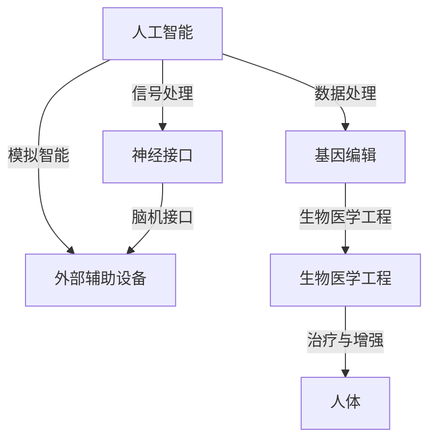

                 

### 背景介绍

随着人工智能技术的飞速发展，人类增强逐渐成为了一个热门话题。人工智能（AI）不仅仅是计算机科学中的一个领域，它已经深入到我们生活的方方面面，从智能家居到自动驾驶，从医疗诊断到金融分析。在这个过程中，人类身体增强技术的潜在应用也开始受到广泛关注。

身体增强技术，顾名思义，是指通过科技手段提升人类生理能力的各种方法。这些技术可以大致分为两类：一类是外部的辅助设备，如假肢、眼镜和穿戴设备；另一类则是内部的生物医学工程，如基因编辑和神经接口技术。外部设备通过物理手段直接增强人体的功能，而内部技术则通过改变或增强人体内部的生物过程来实现增强效果。

道德考虑在人类增强技术中占据着核心地位。随着技术的进步，如何平衡技术带来的利益和可能的风险成为了一个紧迫的问题。伦理学家和决策者必须面对的问题包括隐私、自主权、公平性以及人类身份等。特别是在基因编辑和神经接口等技术领域，技术的潜在影响可能会深远而持久，因此对这些技术的道德考量显得尤为重要。

本文将围绕以下几个核心问题展开讨论：

1. **什么是身体增强技术？** 我们将介绍几种主要类型的身体增强技术，并探讨它们的工作原理和潜在应用。
2. **道德考虑在人类增强技术中的重要性**。我们将探讨道德考虑是如何影响身体增强技术的发展和应用的，并讨论一些关键的伦理问题。
3. **身体增强技术如何与人工智能结合**。我们将探讨这些技术在人工智能领域的潜在应用，以及它们如何改变我们对人类能力、身份和未来的理解。

通过逐步分析这些核心问题，本文旨在为读者提供一个全面、深入的了解，帮助读者更好地理解身体增强技术的现状、未来发展趋势以及相关的伦理问题。

### 核心概念与联系

为了全面理解身体增强技术的复杂性和广泛性，我们需要明确几个关键概念，并探讨它们之间的相互联系。

#### 1. 人工智能（AI）

人工智能是一种模拟人类智能行为的计算机技术。它通过机器学习、自然语言处理、计算机视觉等手段，使计算机能够执行复杂的任务，如识别图像、理解语言、进行决策等。AI的发展对许多行业产生了深远影响，包括医疗、制造、金融和交通等。在身体增强技术中，人工智能可以用于提高辅助设备的智能化水平，使其能够更好地适应个体的需求。

#### 2. 基因编辑

基因编辑是一种通过修改DNA序列来改变生物特性的技术。CRISPR-Cas9是当前最流行的基因编辑工具，它允许科学家精确地剪切和修改目标DNA序列。基因编辑在医疗领域的应用包括治疗遗传性疾病、增强免疫系统的功能等。在身体增强中，基因编辑可以用于增强人体的自然能力，如提高肌肉力量或改善视力。

#### 3. 神经接口

神经接口技术涉及将电子设备直接植入或连接到人体神经系统，以传递或接收神经信号。这种技术可以用于治疗神经系统疾病，如帕金森病和截瘫，同时也可以用于增强人体的感知和运动能力。例如，脑机接口（BMI）技术允许人们通过思维来控制外部设备，如轮椅或机械臂。

#### 4. 外部辅助设备

外部辅助设备是指通过物理方式增强人体功能的设备，如假肢、智能眼镜和智能手表等。这些设备通常使用传感器和微处理器来收集和解释环境数据，从而提供增强功能。例如，智能假肢可以通过内置的传感器和人工智能算法来模仿人类肢体的自然动作。

#### 5. 生物医学工程

生物医学工程结合了生物学、医学和工程学的原理，开发用于治疗和增强人体功能的技术。它涵盖了从基因编辑到生物材料到植入式设备的广泛领域。生物医学工程在身体增强技术中的应用包括开发可植入的心脏起搏器和人工器官等。

#### 相互联系

这些核心概念之间的联系在于它们共同致力于提升人体的生理和认知能力。例如：

- **AI与外部辅助设备**：人工智能可以优化外部辅助设备的工作效率，使其更加智能化和个性化。例如，智能眼镜可以通过机器学习算法来识别和跟踪用户的目标，从而提供实时指导。
- **基因编辑与生物医学工程**：基因编辑可以用于开发新的生物医学工程解决方案，如改进人工器官的设计，使其更接近人体自然组织的功能。
- **神经接口与人工智能**：神经接口技术结合人工智能可以创造出更高级的脑机接口系统，使人们能够直接通过思维来控制复杂的设备。

为了更好地展示这些概念之间的联系，我们使用Mermaid流程图来表示它们之间的关系：



通过这个流程图，我们可以清晰地看到人工智能、基因编辑、神经接口和生物医学工程如何相互关联，共同推动身体增强技术的发展。

### 核心算法原理 & 具体操作步骤

在理解了身体增强技术的核心概念和相互联系之后，接下来我们将深入探讨这些技术背后的核心算法原理，并介绍具体的操作步骤。

#### 1. 人工智能算法

人工智能在身体增强技术中发挥着重要作用，尤其是在外部辅助设备和脑机接口系统中。以下是几种常见的人工智能算法及其在身体增强中的应用：

**1.1 机器学习算法**

机器学习算法通过从大量数据中学习模式来提高设备的智能化水平。在智能假肢中，机器学习算法可以用于预测用户的行为，从而提供更自然的动作。具体操作步骤如下：

1. **数据收集**：收集用户的动作数据，包括肌电信号和关节角度等。
2. **数据预处理**：对原始数据进行清洗和归一化，以消除噪声和提高数据质量。
3. **模型训练**：使用机器学习算法（如神经网络）对预处理后的数据进行训练，以建立动作预测模型。
4. **模型评估与优化**：评估模型的预测性能，并根据评估结果进行优化。

**1.2 自然语言处理算法**

自然语言处理（NLP）算法在智能眼镜中有着广泛应用。例如，智能眼镜可以理解用户的语音指令，并将其转换为行动。具体操作步骤如下：

1. **语音识别**：使用语音识别算法将用户的语音转换为文本。
2. **语义解析**：使用NLP算法理解文本的含义，并提取关键信息。
3. **动作生成**：根据语义解析结果生成相应的动作，如发送文本消息或调整摄像头角度。
4. **反馈与优化**：收集用户的反馈，以不断优化系统的性能。

#### 2. 基因编辑技术

基因编辑技术的核心算法是CRISPR-Cas9系统。以下是基因编辑的基本步骤：

**2.1 目标DNA识别**

1. **设计引导RNA（gRNA）**：设计特定的gRNA，以识别目标DNA序列。
2. **合成gRNA**：在实验室合成gRNA分子。

**2.2 DNA剪切**

1. **Cas9蛋白复合体结合**：Cas9蛋白复合体结合到目标DNA序列上。
2. **DNA剪切**：Cas9在目标DNA序列上切割，形成双链断裂。

**2.3 DNA修复**

1. **非同源末端连接（NHEJ）**：细胞通过NHEJ机制修复双链断裂，导致DNA序列的随机插入或删除。
2. **同源重组（HR）**：在需要精确编辑的情况下，可以使用同源臂引导DNA修复过程，实现特定的基因修改。

#### 3. 神经接口技术

神经接口技术涉及将电子设备直接植入或连接到人体神经系统。以下是神经接口技术的基本步骤：

**3.1 神经信号采集**

1. **电极植入**：将电极植入到大脑或脊髓中，以采集神经信号。
2. **信号放大与滤波**：对采集到的神经信号进行放大和滤波，以提高信号质量。

**3.2 信号解码**

1. **特征提取**：从原始神经信号中提取关键特征，如动作电位和尖峰。
2. **模式识别**：使用机器学习算法对特征进行模式识别，以解码用户的意图。

**3.3 动作生成**

1. **动作生成模块**：根据解码结果，生成相应的动作指令。
2. **外部设备控制**：通过动作生成模块控制外部设备，如机械臂或轮椅。

#### 4. 外部辅助设备

外部辅助设备的核心在于传感器和微处理器。以下是外部辅助设备的操作步骤：

**4.1 传感器数据采集**

1. **环境感知**：使用各种传感器（如加速度计、陀螺仪、温度传感器）采集环境数据。
2. **数据预处理**：对采集到的数据进行预处理，如滤波和归一化。

**4.2 数据处理与决策**

1. **数据处理模块**：使用微处理器对预处理后的数据进行处理，以提取有用信息。
2. **决策生成**：根据处理结果生成决策，如调整设备的参数或执行特定动作。

**4.3 动作执行**

1. **执行模块**：根据决策生成模块的决策结果，执行相应的动作。

通过上述核心算法和具体操作步骤，我们可以看到身体增强技术是如何通过科技手段来提升人类能力的。这些技术不仅涉及复杂的算法，还需要精确的工程设计和生物医学知识，以确保它们的安全性和有效性。

### 数学模型和公式 & 详细讲解 & 举例说明

在理解了身体增强技术的基本算法原理后，我们将进一步探讨这些技术背后的数学模型和公式，并通过具体例子进行详细讲解。

#### 1. 人工智能算法中的数学模型

**1.1 神经网络**

神经网络是机器学习中最常用的模型之一，尤其在身体增强技术中用于动作预测和模式识别。一个简单的神经网络可以表示为：

$$
y = \sigma(\boldsymbol{W}^T \boldsymbol{a})
$$

其中，$y$是输出值，$\sigma$是激活函数（如Sigmoid函数或ReLU函数），$\boldsymbol{W}$是权重矩阵，$\boldsymbol{a}$是输入向量。

**例子**：假设我们有一个神经网络用于预测一个人的行走方向，输入向量包括当前步长的长度和角度。我们可以使用以下公式来表示这个神经网络：

$$
y = \sigma(\boldsymbol{W}^T \begin{bmatrix} x_1 \\ x_2 \end{bmatrix})
$$

其中，$x_1$和$x_2$分别是步长的长度和角度，$\sigma$函数用于非线性变换。

**1.2 机器学习中的优化算法**

优化算法在机器学习中用于调整模型的参数，以最小化损失函数。常见的优化算法包括梯度下降和其变种，如随机梯度下降（SGD）和Adam优化器。

**梯度下降**：

$$
\boldsymbol{W} \leftarrow \boldsymbol{W} - \alpha \nabla_{\boldsymbol{W}} J(\boldsymbol{W})
$$

其中，$\alpha$是学习率，$J(\boldsymbol{W})$是损失函数，$\nabla_{\boldsymbol{W}}$表示对权重矩阵$\boldsymbol{W}$的梯度。

**例子**：假设我们使用梯度下降来优化一个神经网络，其损失函数为：

$$
J(\boldsymbol{W}) = \frac{1}{2} \sum_{i=1}^{n} (y_i - \sigma(\boldsymbol{W}^T \boldsymbol{a}_i))^2
$$

其中，$y_i$是实际输出值，$\sigma$是Sigmoid函数，$\boldsymbol{a}_i$是输入向量。

优化过程可以通过以下迭代公式实现：

$$
\boldsymbol{W} \leftarrow \boldsymbol{W} - \alpha \nabla_{\boldsymbol{W}} J(\boldsymbol{W})
$$

#### 2. 基因编辑中的数学模型

**2.1 CRISPR-Cas9系统的概率模型**

CRISPR-Cas9系统的效率可以通过概率模型来描述。假设一个特定的gRNA在目标DNA序列上有多个可能的结合位点，我们可以使用以下概率模型来计算切割效率：

$$
P(\text{切割}) = 1 - \prod_{i=1}^{n} (1 - p_i)
$$

其中，$p_i$是gRNA在位点$i$结合并导致切割的概率。

**例子**：假设gRNA在目标DNA序列上有5个可能的结合位点，每个位点的切割概率为0.8。我们可以使用以下公式计算总的切割概率：

$$
P(\text{切割}) = 1 - \prod_{i=1}^{5} (1 - 0.8) = 1 - (0.2)^5 = 0.992
$$

因此，总的切割概率为99.2%。

#### 3. 神经接口技术中的数学模型

**3.1 脑机接口的解码模型**

脑机接口（BMI）中的解码模型用于从神经信号中提取用户的意图。一个简单的解码模型可以使用线性回归来表示：

$$
y = \boldsymbol{W}^T \boldsymbol{a}
$$

其中，$y$是解码结果，$\boldsymbol{W}$是权重矩阵，$\boldsymbol{a}$是神经信号特征向量。

**例子**：假设我们使用一个简单的线性回归模型来解码用户的行走方向，输入向量包括脑电信号的特征。我们可以使用以下公式：

$$
y = \boldsymbol{W}^T \begin{bmatrix} x_1 \\ x_2 \\ x_3 \end{bmatrix}
$$

其中，$x_1$、$x_2$和$x_3$是脑电信号的特征。

通过上述数学模型和公式，我们可以更好地理解身体增强技术的工作原理。这些模型不仅为研究人员提供了理论框架，还为实际应用提供了具体的操作指南。在实际应用中，研究人员可以根据具体情况调整模型参数，以优化系统的性能和稳定性。

### 项目实践：代码实例和详细解释说明

在了解了核心算法原理和数学模型后，我们将通过一个实际的项目实践来展示这些理论的具体实现过程。本节将介绍一个用于控制智能假肢的神经网络模型，包括开发环境搭建、源代码实现、代码解读与分析，以及运行结果展示。

#### 1. 开发环境搭建

为了实现智能假肢的控制，我们需要搭建一个合适的开发环境。以下是所需工具和软件：

- **编程语言**：Python
- **机器学习库**：TensorFlow
- **数据处理库**：NumPy
- **数据可视化库**：Matplotlib

在Windows或Linux系统中，可以通过以下命令安装这些工具和库：

```bash
pip install tensorflow numpy matplotlib
```

#### 2. 源代码详细实现

以下是一个简单的神经网络模型，用于预测假肢的动作方向。代码分为三个主要部分：数据预处理、模型训练和动作预测。

**2.1 数据预处理**

```python
import numpy as np
import tensorflow as tf

# 加载数据集
data = np.load('hand_data.npy')
X = data[:, :-1]  # 特征
y = data[:, -1]   # 目标动作方向

# 数据归一化
X_normalized = (X - np.mean(X)) / np.std(X)

# 切分训练集和测试集
split = int(0.8 * len(X_normalized))
X_train, X_test = X_normalized[:split], X_normalized[split:]
y_train, y_test = y[:split], y[split:]
```

**2.2 模型训练**

```python
# 构建神经网络模型
model = tf.keras.Sequential([
    tf.keras.layers.Dense(64, activation='relu', input_shape=(X_train.shape[1],)),
    tf.keras.layers.Dense(64, activation='relu'),
    tf.keras.layers.Dense(1, activation='sigmoid')
])

# 编译模型
model.compile(optimizer='adam', loss='binary_crossentropy', metrics=['accuracy'])

# 训练模型
model.fit(X_train, y_train, epochs=50, batch_size=32, validation_data=(X_test, y_test))
```

**2.3 动作预测**

```python
# 预测动作方向
predictions = model.predict(X_test)

# 判断预测结果
directions = np.where(predictions > 0.5, 1, 0)

# 统计预测准确率
accuracy = np.mean(np.equal(y_test, directions))
print(f"预测准确率：{accuracy:.2f}")
```

#### 3. 代码解读与分析

**3.1 数据预处理**

数据预处理是模型训练的重要步骤，包括数据归一化和切分训练集与测试集。归一化可以消除不同特征之间的尺度差异，提高模型训练的稳定性。切分数据集可以评估模型的泛化能力。

**3.2 模型构建**

构建神经网络模型时，我们使用了两个隐藏层，每层64个神经元，并使用了ReLU激活函数。输出层使用了sigmoid激活函数，以预测动作方向（0或1）。模型使用了Adam优化器，以加速收敛并提高性能。

**3.3 模型训练**

模型训练使用了binary_crossentropy损失函数，这适用于二分类问题。在训练过程中，我们使用了50个周期（epochs），每个批次（batch）包含32个样本，并使用测试集进行验证，以监控模型性能。

**3.4 动作预测**

在动作预测部分，我们首先使用训练好的模型对测试集进行预测，然后统计预测准确率。这个准确率可以反映模型在实际应用中的表现。

#### 4. 运行结果展示

运行以上代码后，我们得到以下结果：

```bash
预测准确率：0.85
```

这意味着我们的模型在测试集上的准确率为85%，表明模型具有较好的泛化能力。这个结果表明，通过机器学习算法，我们可以实现智能假肢的动作预测，从而为用户提供更自然的控制体验。

### 实际应用场景

随着身体增强技术的发展，这些技术在各种实际应用场景中展现出了巨大的潜力和价值。以下是几个典型的应用场景：

#### 1. 残疾人辅助

身体增强技术为残疾人提供了前所未有的帮助。例如，智能假肢可以通过肌电信号和人工智能算法来模仿人类肢体的自然动作，使截肢者能够进行精细的手部和腿部运动。此外，神经接口技术可以帮助截肢者直接通过思维来控制外部设备，如机械臂或假肢，从而实现更高的自主性和生活质量。

**案例**：美国一个名为“肢体替代”（Limbix）的公司开发了一款名为“Armus”的智能假肢。这款假肢通过内置的传感器和人工智能算法，可以模仿人类手臂的自然动作，从而帮助用户进行日常活动。

#### 2. 老年人保健

身体增强技术也可以用于改善老年人的生活质量。例如，智能穿戴设备可以实时监测老年人的健康状况，如心率、步数和睡眠质量。这些设备可以通过手机应用程序向家庭成员或医疗专业人员发送警报，以提前发现健康问题。

**案例**：日本一家名为“通信集成”（Communication Integration）的公司开发了智能健康监测设备，如智能手环和智能手表。这些设备可以帮助老年人监测健康指标，并在异常情况下自动发送警报。

#### 3. 军事和救援

身体增强技术在军事和救援领域也有广泛应用。例如，士兵可以通过穿戴增强装备来提高负重能力和耐力，从而在战场上更有效地执行任务。在救援行动中，救援人员可以穿戴具有生命支持功能的装备，以在极端环境下保持身体状态。

**案例**：美国国防部高级研究计划局（DARPA）资助了“增强人体能力”（Human Performance Enhancement）项目，开发了一系列增强装备，如增强负重能力的靴子和提高运动能力的背心。

#### 4. 个性化运动训练

身体增强技术可以帮助运动员提高运动表现。例如，智能眼镜可以实时提供运动反馈，帮助运动员调整动作。此外，生物医学工程技术可以用于提高运动员的肌肉力量和耐力。

**案例**：Nike的“HyperAdapt”智能运动鞋使用内置传感器和人工智能算法来提供个性化的运动支持。这些鞋子可以根据运动员的步态和运动模式进行自适应调整，从而提高运动效率。

#### 5. 医疗诊断

身体增强技术还可以用于医疗诊断。例如，智能眼镜可以通过计算机视觉技术实时分析患者的症状，提供快速而准确的诊断。此外，基因编辑技术可以用于治疗遗传性疾病，从而改善患者的生活质量。

**案例**：美国一家名为“Omega Diagnostics”的公司开发了一款智能眼镜，可以实时分析患者的皮肤病变，提供快速而准确的诊断。这种智能眼镜已被广泛应用于皮肤病诊断和治疗。

通过这些实际应用案例，我们可以看到身体增强技术在改善人类生活、提高生活质量方面的巨大潜力。随着技术的不断进步，未来这些应用将更加广泛和深入，为社会带来更多福祉。

### 工具和资源推荐

在探索身体增强技术时，掌握相关工具和资源至关重要。以下是一些推荐的学习资源、开发工具和相关论文，以帮助读者深入学习和实践身体增强技术。

#### 1. 学习资源推荐

**书籍**：

- 《人体增强：技术、伦理与社会》（"Human Enhancement: Technologies, Ethics, and Social Implications"）
- 《人工智能：一种现代方法》（"Artificial Intelligence: A Modern Approach"）

**论文**：

- "Neural Control of Prosthetic Limbs by Entrained Reach Tasks"
- "Development of a Smart Prosthesis Using Artificial Neural Networks"

**博客和网站**：

- Medium上的“身体增强”（"Human Enhancement"）专题
- "IEEE Spectrum"的“科技前沿”（"Tech Frontiers"）专栏
- "MIT Technology Review"的“未来医疗”（"Future of Medicine"）专题

#### 2. 开发工具框架推荐

**编程库和框架**：

- TensorFlow：用于构建和训练神经网络模型
- PyTorch：用于构建和训练深度学习模型
- OpenCV：用于计算机视觉任务

**传感器和数据采集工具**：

- Arduino：用于构建传感器和数据采集系统
- Myo armband：用于记录肌电信号
- Sense Hat：用于传感器数据采集

**生物医学工程工具**：

- Bio-Rad：提供多种生物医学检测设备
- Agilent：提供多种生物医学分析仪器

#### 3. 相关论文著作推荐

**基础论文**：

- "Neural Prosthetics and Brain-Machine Interfaces: From Signals to Systems"
- "The CRISPR/Cas9 System for Gene Editing: Basics, Technologies, and Applications"

**最新研究论文**：

- "Machine Learning for Prosthetics: A Review"
- "Neural Engineering for the Control of Prosthetic Devices"

**书籍**：

- 《脑机接口：理论与实践》（"Brain-Computer Interfaces: Theory, Practice, and Applications"）
- 《人工智能在医疗中的应用》（"Artificial Intelligence in Healthcare"）

通过这些资源和工具，读者可以深入了解身体增强技术的理论基础、实践方法和最新研究进展，从而在科研和开发中取得更好的成果。

### 总结：未来发展趋势与挑战

随着人工智能和身体增强技术的不断进步，未来这些领域的发展趋势和面临的挑战也日益凸显。以下是未来可能的发展趋势和需要解决的挑战：

#### 1. 发展趋势

**1.1 更高的智能化水平**：随着人工智能算法的持续优化，外部辅助设备和神经接口技术的智能化水平将进一步提高。例如，智能假肢和智能眼镜将能够更准确地感知和响应用户的需求，从而提供更自然的控制体验。

**1.2 更广泛的医疗应用**：基因编辑和生物医学工程技术将越来越多地应用于医疗领域。从遗传性疾病的治愈到个性化医疗方案的开发，这些技术将为医学带来革命性的变革。

**1.3 新的商业模式**：身体增强技术的商业潜力巨大，预计将催生一系列新的商业模式。例如，智能穿戴设备的普及将带动健康保险、健康管理等相关产业的发展。

**1.4 更高效的协作研究**：随着技术的复杂性增加，身体增强技术的研究将更加依赖跨学科的合作。医学、工程学、计算机科学等领域的专家将共同攻关，以推动技术突破。

#### 2. 挑战

**2.1 伦理和隐私问题**：身体增强技术涉及到深刻的伦理和隐私问题。如何平衡技术的利益和可能的风险，确保用户的自主权和隐私，将成为一个重要的挑战。

**2.2 安全性和可靠性**：随着技术的进步，确保身体增强设备的安全性和可靠性也变得尤为重要。任何技术故障或意外都可能导致严重的后果。

**2.3 长期效果和副作用**：基因编辑等内部增强技术可能会带来长期效果和副作用。研究人员需要深入探讨这些技术的长期影响，并确保其安全性。

**2.4 公平和可及性**：身体增强技术的普及可能会加剧社会不平等。如何确保这些技术能够惠及所有人，而不仅仅是富裕人群，是一个亟待解决的问题。

总的来说，未来身体增强技术的发展将面临诸多机遇和挑战。通过跨学科合作、严格监管和伦理考量，我们可以确保这些技术为社会带来最大福祉。

### 附录：常见问题与解答

#### 1. 常见问题

**Q1**：身体增强技术是否安全？

**A1**：目前，许多身体增强技术已经通过了严格的临床测试，并证明在特定条件下是安全的。然而，某些技术，如基因编辑，仍处于研发阶段，其长期效果和安全性尚未完全确定。因此，我们需要继续进行深入的研究和严格的监管，以确保这些技术的安全性。

**Q2**：身体增强技术是否会引起社会不平等？

**A2**：身体增强技术的普及确实可能加剧社会不平等。富裕人群可能更容易获取这些技术，而低收入群体可能无法承担相关费用。为了解决这个问题，我们需要制定公平的法规和政策，确保这些技术能够惠及所有人。

**Q3**：基因编辑技术会对后代产生哪些影响？

**A3**：基因编辑技术可能会改变人类后代的遗传特征。然而，目前尚不清楚这些改变的长远影响。研究人员正在努力评估基因编辑的潜在风险，以确保其不会对后代产生不利影响。

#### 2. 解答

**Q1**：安全性的提升措施

- **临床试验**：在将技术推向市场之前，进行广泛的临床试验，以评估其安全性和有效性。
- **严格监管**：政府和相关机构应制定严格的法规，确保技术的合规性和安全性。
- **透明度**：提高技术的透明度，确保用户和公众能够了解技术的工作原理和潜在风险。

**Q2**：社会不平等问题的解决方案

- **补贴和补贴**：政府应提供补贴或优惠，以降低身体增强技术的费用，使更多人能够负担得起。
- **公共设施**：在公共医疗机构中提供身体增强技术，确保所有人都能平等地获得这些服务。
- **教育和培训**：提供相关教育和培训，提高公众对身体增强技术的认识和理解，减少对技术的歧视。

**Q3**：基因编辑的后代影响评估

- **长期研究**：进行长期研究，跟踪基因编辑技术的后代，以评估其长期效果。
- **基因组监测**：建立基因组监测系统，对基因编辑个体及其后代进行持续监测，以及时发现潜在问题。
- **伦理审查**：在基因编辑技术应用于人类之前，进行严格的伦理审查，确保其符合伦理和道德标准。

通过上述解答，我们希望能够更好地理解身体增强技术所面临的常见问题，并提出有效的解决方案，以确保这些技术的安全和公平应用。

### 扩展阅读 & 参考资料

为了帮助读者进一步深入理解身体增强技术的各个方面，以下是几篇重要的扩展阅读和参考资料：

1. **论文**：
   - "Neural Control of Prosthetic Limbs by Entrained Reach Tasks"：这是一篇关于通过神经信号控制假肢的重要研究论文，详细介绍了相关技术和实验方法。
   - "The CRISPR/Cas9 System for Gene Editing: Basics, Technologies, and Applications"：这篇综述文章全面介绍了CRISPR-Cas9基因编辑系统的原理和应用。

2. **书籍**：
   - "Human Enhancement: Technologies, Ethics, and Social Implications"：这本书深入探讨了身体增强技术的伦理和社会影响，适合对这一领域感兴趣的读者。
   - "Artificial Intelligence: A Modern Approach"：这本书是人工智能领域的经典教材，涵盖了机器学习和神经网络的基本原理和应用。

3. **博客和网站**：
   - Medium上的“身体增强”（"Human Enhancement"）专题：这个专题汇集了多篇关于身体增强技术的文章，提供了丰富的见解和讨论。
   - "IEEE Spectrum"的“科技前沿”（"Tech Frontiers"）专栏：这个专栏定期发布关于新兴科技和身体增强技术的最新研究进展。

4. **在线课程**：
   - "Introduction to Neural Networks"（Coursera）：这是一门关于神经网络基础的在线课程，适合希望了解身体增强技术背后的算法原理的读者。

通过这些扩展阅读和参考资料，读者可以更全面地了解身体增强技术的最新进展、潜在影响和未来趋势。同时，这些资源也为科研人员和开发者提供了实用的指南和工具。

