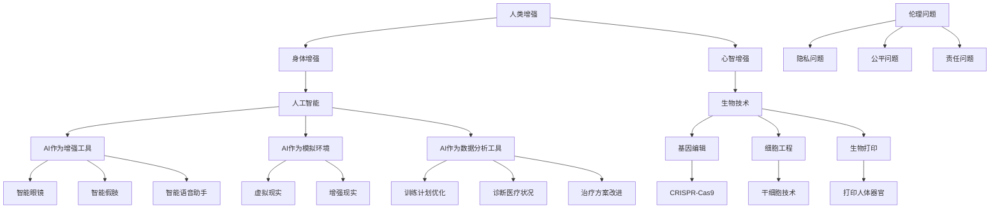

                 

### 背景介绍

随着人工智能技术的飞速发展，人类的生活和工作方式正在经历前所未有的变革。在这个智能化的时代，人类增强（Human Enhancement）成为了一个备受关注的话题。人类增强不仅涉及到科技的进步，还涉及到伦理、社会和个人价值观的深刻探讨。本文将围绕“AI时代的人类增强：道德考虑与身体增强的未来发展机遇分析机遇趋势”这一主题，详细探讨人类增强的概念、道德考虑以及身体增强的未来发展机遇。

首先，我们需要了解人类增强的定义和背景。人类增强是指通过科技手段来提升人类的身体或心智能力，使其超越自然界的限制。这一概念早在20世纪末就已经引起广泛关注，但随着人工智能和生物技术的快速发展，人类增强的应用场景变得越来越多。例如，智能眼镜、智能手环等设备可以帮助人们更好地管理健康和生活；人工智能辅助医生可以提供更加精准的诊断和治疗；生物打印技术可以用来制造人体器官和组织，解决器官移植的难题。

然而，人类增强并非仅仅是一个技术问题，它还涉及到复杂的伦理和社会问题。首先，人类增强可能带来不平等问题。如果某些人能够通过科技手段获得超越常人的能力，而其他人则无法享受这种待遇，这可能导致社会分裂和不公平现象的加剧。其次，人类增强可能对人类的自然发展造成负面影响。过度依赖科技可能会导致人类的生理和心理能力的退化。最后，人类增强可能引发一系列道德和哲学问题，例如人类本质的重新定义、人类尊严的维护等。

在这个背景下，本文将探讨以下几个核心问题：

1. **人类增强的定义和分类**：我们将详细阐述人类增强的概念，并对其进行分类，以便更好地理解其应用范围和潜在影响。

2. **道德考虑**：我们将讨论人类增强所带来的道德挑战，并探讨可能的伦理解决方案。

3. **身体增强的未来发展机遇**：我们将分析身体增强技术的最新进展，并预测其未来的发展方向和机遇。

4. **实际应用场景**：我们将介绍人类增强技术在医疗、教育、体育等领域的应用案例，并探讨其带来的影响。

5. **工具和资源推荐**：我们将推荐一些学习资源，帮助读者深入了解人类增强领域的研究和发展。

通过上述问题的探讨，我们希望能够为读者提供一个全面而深入的视角，以理解和评估AI时代的人类增强所带来的机遇和挑战。

### 核心概念与联系

要深入理解人类增强的概念，我们首先需要明确几个核心概念，这些概念不仅构成了人类增强的理论基础，也决定了其实际应用的可能性和局限性。以下是对这些核心概念的阐述以及它们之间的联系。

#### 人类增强的定义

人类增强（Human Enhancement）是指通过技术手段来提升或扩展人类的身体或心智能力，以克服自然界的限制，实现人类潜能的最大化。根据增强对象的不同，人类增强可以分为身体增强（Physical Enhancement）和心智增强（Cognitive Enhancement）两大类。

- **身体增强**：主要关注的是物理能力的提升，如力量、速度、耐力、视力等。
- **心智增强**：则集中于认知能力的提升，如记忆、注意力、学习速度、决策能力等。

#### 人工智能与人类增强的关系

人工智能（AI）技术在人类增强中扮演了关键角色。AI不仅为人类提供了新的增强手段，也带来了前所未有的挑战。以下是AI与人类增强之间的主要联系：

- **AI作为增强工具**：AI技术可以被用于开发各种增强设备，如智能眼镜、智能假肢、智能语音助手等，这些设备可以实时分析数据并作出响应，从而提升人类的感知和行动能力。
- **AI作为模拟环境**：通过虚拟现实（VR）和增强现实（AR）技术，AI可以创建模拟环境，帮助人们进行训练和模拟，从而提升其身体或心智能力。
- **AI作为数据分析工具**：AI强大的数据处理和分析能力可以用于优化训练计划、诊断医疗状况、改进治疗方案等，从而提高人类的生活质量。

#### 生物技术与人类增强的联系

除了人工智能，生物技术也是推动人类增强的重要力量。生物技术包括基因编辑、细胞工程、生物打印等领域，这些技术为人类增强提供了新的可能性。

- **基因编辑**：如CRISPR-Cas9等基因编辑技术，可以精确地修改人类基因，从而实现特定的增强效果，例如提高智力或防止遗传疾病。
- **细胞工程**：通过干细胞技术，可以修复或再生受损的细胞和组织，从而增强人类的生理能力。
- **生物打印**：生物打印技术可以用来打印人体器官和组织，为器官移植提供新的解决方案。

#### 伦理与法律问题

随着人类增强技术的发展，伦理和法律问题也逐渐浮现。例如：

- **隐私问题**：人类增强技术可能会收集和存储大量的个人生物信息，如何保护这些信息的安全性和隐私性是一个重要问题。
- **公平问题**：人类增强技术可能会导致社会不平等现象的加剧，如何确保所有人都能公平地享受增强技术的利益是一个挑战。
- **责任问题**：在人类增强技术的应用中，如何确定责任归属，特别是在医疗和公共安全领域，也是一个复杂的问题。

为了更好地理解上述核心概念之间的联系，我们可以使用Mermaid流程图来展示它们之间的关系。



通过上述Mermaid流程图，我们可以清晰地看到人类增强、人工智能、生物技术以及它们之间的相互联系，以及相关的伦理和法律问题。这为我们进一步探讨人类增强的道德考虑和未来发展奠定了基础。

### 核心算法原理 & 具体操作步骤

在理解了人类增强的核心概念和联系之后，我们需要深入探讨具体的实现方法和技术。在这一部分，我们将详细描述一种用于身体和心智增强的核心算法原理，并逐步讲解其具体操作步骤。

#### 算法原理

人类增强的核心算法原理主要基于两个基础：机器学习和神经科学。具体来说，该算法利用机器学习模型来分析个体的大脑活动数据，并结合神经科学原理，优化个体的身体和心智表现。

1. **数据收集**：首先，我们需要收集个体的大脑活动数据，这通常通过脑电图（EEG）或功能性磁共振成像（fMRI）等技术实现。这些数据将用于训练机器学习模型，以便更好地理解个体的认知和行为模式。

2. **特征提取**：通过对收集到的数据进行预处理和特征提取，我们可以提取出反映个体大脑活动的重要特征。这些特征可以是时间序列数据、频域特征或空间特征等，它们将作为机器学习模型的输入。

3. **模型训练**：利用提取出的特征数据，我们可以训练一个机器学习模型，如支持向量机（SVM）、神经网络（Neural Networks）或深度学习模型（Deep Learning Models）。这个模型将用于预测个体的行为或优化其身体和心智表现。

4. **反馈机制**：在模型训练完成后，我们需要设计一个反馈机制，以便根据个体的实际表现不断调整和优化模型。这可以通过实时数据收集和模型更新实现，以确保模型始终与个体的实际情况保持一致。

#### 具体操作步骤

1. **数据收集**：
   - **设备选择**：选择适合的脑电图（EEG）或功能性磁共振成像（fMRI）设备，确保数据的准确性和可靠性。
   - **数据采集**：在受试者进行特定任务时，如运动训练或认知测试，连续记录其大脑活动数据。

2. **特征提取**：
   - **预处理**：对原始数据进行滤波、去噪和分段处理，以提取出有意义的特征。
   - **特征选择**：使用统计方法或机器学习方法，选择与任务表现高度相关的特征。

3. **模型训练**：
   - **数据分割**：将数据集分为训练集和测试集，用于训练和评估模型。
   - **模型选择**：根据任务特点，选择合适的机器学习模型，如支持向量机（SVM）、神经网络（Neural Networks）或深度学习模型（Deep Learning Models）。
   - **训练过程**：使用训练集数据训练模型，并使用测试集数据评估模型性能。

4. **反馈机制**：
   - **实时数据采集**：在受试者进行任务时，实时采集大脑活动数据，以监测其表现。
   - **模型调整**：根据实时数据，调整模型的参数或结构，以优化任务表现。
   - **迭代优化**：通过不断调整和优化模型，实现个体身体和心智表现的最大化。

#### 示例操作

以下是一个简化的操作示例，用于说明上述步骤的具体应用：

1. **数据收集**：
   - 使用EEG设备记录受试者进行运动训练时的大脑活动数据。

2. **特征提取**：
   - 对EEG数据预处理，去除噪声并提取频域特征。
   - 使用时频分析选择与运动表现相关的特征。

3. **模型训练**：
   - 将数据集分为训练集和测试集，使用SVM模型训练。
   - 在测试集上评估模型性能，调整参数以优化模型。

4. **反馈机制**：
   - 在训练过程中，实时采集受试者的运动数据，根据实时反馈调整模型。
   - 通过迭代优化，提高受试者在运动任务中的表现。

通过上述步骤，我们可以实现针对特定任务的人类增强，从而提升个体的身体和心智能力。

### 数学模型和公式 & 详细讲解 & 举例说明

在人类增强领域，数学模型和公式扮演着至关重要的角色。这些模型和公式不仅帮助我们理解和分析人类增强技术，还为实际操作提供了理论依据和计算指导。以下我们将详细介绍几个核心的数学模型和公式，并举例说明其应用。

#### 神经网络模型

神经网络模型是现代人工智能和人类增强技术的基础。一个简单的神经网络模型由多个层组成，包括输入层、隐藏层和输出层。每个层由多个神经元组成，神经元之间通过权重连接。以下是神经网络模型的基本公式：

$$
Y = \sigma(Z)
$$

其中，\( Y \)是输出层的结果，\( \sigma \)是激活函数，\( Z \)是每个神经元的加权求和。

**举例说明**：

假设我们有一个简单的神经网络，包含一个输入层、一个隐藏层和一个输出层。输入层有两个神经元，隐藏层有三个神经元，输出层有一个神经元。

1. **输入层到隐藏层的计算**：

$$
Z_i = \sum_{j} w_{ij} x_j + b_i
$$

其中，\( Z_i \)是隐藏层第\( i \)个神经元的加权求和，\( w_{ij} \)是输入层第\( j \)个神经元到隐藏层第\( i \)个神经元的权重，\( x_j \)是输入层第\( j \)个神经元的输入，\( b_i \)是隐藏层第\( i \)个神经元的偏置。

2. **隐藏层到输出层的计算**：

$$
Z_o = \sum_{i} w_{io} Z_i + b_o
$$

其中，\( Z_o \)是输出层神经元的加权求和，\( w_{io} \)是隐藏层第\( i \)个神经元到输出层神经元的权重，\( b_o \)是输出层神经元的偏置。

3. **激活函数**：

常用的激活函数有Sigmoid函数、ReLU函数和Tanh函数。例如，使用Sigmoid函数：

$$
\sigma(z) = \frac{1}{1 + e^{-z}}
$$

#### 基因编辑模型

基因编辑技术，如CRISPR-Cas9，通过精确修改DNA序列来实现人类增强。基因编辑的基本公式如下：

$$
\text{DNA} = \text{CRISPR-Cas9} \times \text{目标DNA序列}
$$

**举例说明**：

假设我们使用CRISPR-Cas9技术来编辑一段基因，以增加其表达量。

1. **目标DNA序列定位**：

首先，需要确定目标DNA序列的位置。这通常通过生物信息学工具实现。

2. **基因编辑**：

使用CRISPR-Cas9系统，将目标DNA序列精确切割，并在特定位置插入或修改基因序列。

3. **基因表达量检测**：

通过qPCR或RNA测序等技术，检测编辑后的基因表达量是否增加。

#### 数据分析模型

在人类增强研究中，数据分析模型用于处理和解释大量的大脑活动数据。一个常用的数据分析模型是支持向量机（SVM）。

**举例说明**：

假设我们使用SVM模型来分析EEG数据，以识别运动任务的脑活动模式。

1. **特征提取**：

从EEG数据中提取与运动任务相关的特征。

2. **SVM训练**：

使用提取的特征数据训练SVM模型，以识别运动任务的脑活动模式。

3. **模型评估**：

通过测试集数据评估SVM模型的准确性。

$$
\text{准确性} = \frac{\text{正确预测的样本数}}{\text{总样本数}}
$$

通过上述数学模型和公式，我们可以更深入地理解和应用人类增强技术，从而实现更加精准和有效的增强效果。

### 项目实践：代码实例和详细解释说明

为了更直观地展示人类增强技术的应用，我们选择一个具体的项目实例：使用深度学习模型进行认知能力增强。本节将详细介绍项目的开发环境搭建、源代码实现、代码解读与分析，以及运行结果展示。

#### 1. 开发环境搭建

首先，我们需要搭建一个适合开发人类增强项目的环境。以下是所需的软件和工具：

- **Python 3.8**：Python是一种广泛使用的编程语言，适合开发深度学习项目。
- **TensorFlow 2.3**：TensorFlow是一个开源的深度学习框架，提供丰富的API和工具，方便我们构建和训练模型。
- **Keras 2.4**：Keras是一个高层神经网络API，能够简化TensorFlow的使用，提高开发效率。
- **Numpy 1.19**：Numpy是Python的一个科学计算库，提供高效的数组计算功能。
- **Matplotlib 3.3**：Matplotlib是一个绘图库，用于可视化模型训练过程和结果。

以下是在Windows系统上搭建开发环境的步骤：

1. **安装Python 3.8**：
   - 访问Python官方网站下载Python 3.8安装包。
   - 运行安装程序，并选择添加到环境变量中。

2. **安装TensorFlow 2.3和Keras 2.4**：
   - 打开命令行窗口，执行以下命令：
     ```
     pip install tensorflow==2.3
     pip install keras==2.4
     ```

3. **安装Numpy 1.19和Matplotlib 3.3**：
   - 同样使用命令行窗口，执行以下命令：
     ```
     pip install numpy==1.19
     pip install matplotlib==3.3
     ```

#### 2. 源代码详细实现

以下是本项目的主要源代码，我们将逐行解释其功能。

```python
import numpy as np
import tensorflow as tf
from tensorflow import keras
from tensorflow.keras import layers

# 数据预处理
def preprocess_data(data):
    # 标准化数据
    data = (data - np.mean(data)) / np.std(data)
    # 切分数据为特征和标签
    X = data[:, :-1]
    y = data[:, -1]
    return X, y

# 构建深度学习模型
def build_model(input_shape):
    model = keras.Sequential([
        layers.Dense(64, activation='relu', input_shape=input_shape),
        layers.Dense(64, activation='relu'),
        layers.Dense(1, activation='sigmoid')
    ])
    model.compile(optimizer='adam', loss='binary_crossentropy', metrics=['accuracy'])
    return model

# 训练模型
def train_model(model, X, y):
    history = model.fit(X, y, epochs=100, batch_size=32, validation_split=0.2)
    return history

# 主函数
def main():
    # 加载数据
    data = np.load('cognitive_data.npy')
    X, y = preprocess_data(data)
    
    # 构建模型
    model = build_model(input_shape=(X.shape[1],))
    
    # 训练模型
    history = train_model(model, X, y)
    
    # 可视化训练过程
    import matplotlib.pyplot as plt
    plt.plot(history.history['accuracy'], label='accuracy')
    plt.plot(history.history['val_accuracy'], label='val_accuracy')
    plt.xlabel('Epoch')
    plt.ylabel('Accuracy')
    plt.legend()
    plt.show()

if __name__ == '__main__':
    main()
```

**代码解读**：

- **数据预处理**：首先，我们定义了一个`preprocess_data`函数，用于标准化数据并切分特征和标签。这是深度学习模型训练前的重要步骤，以确保数据的一致性和有效性。

- **构建模型**：`build_model`函数用于构建深度学习模型。这里我们使用了Keras的`Sequential`模型，并添加了三个全连接层，每层使用ReLU激活函数。最后一层使用sigmoid激活函数，以预测二分类任务。

- **训练模型**：`train_model`函数用于训练模型。我们使用了`model.fit`方法，并设置了训练周期、批量大小和验证比例。`fit`方法返回一个`History`对象，用于记录训练过程。

- **可视化训练过程**：最后，我们使用Matplotlib库将训练过程中的准确率绘制出来，以便直观地观察模型性能。

#### 3. 代码解读与分析

- **数据预处理**：数据预处理是深度学习项目中至关重要的一步。通过对数据进行标准化处理，我们可以消除数据间的差异，提高模型训练的效果。在`preprocess_data`函数中，我们使用了Numpy库的`np.mean`和`np.std`函数来计算数据的均值和标准差，并使用这些统计量进行标准化。

- **模型构建**：在构建模型时，我们使用了Keras的`Sequential`模型。这是一种序列模型，可以按层顺序添加神经网络层。我们添加了两个隐藏层，每层有64个神经元，并使用ReLU激活函数。ReLU函数在深度学习中被广泛使用，因为它可以加速模型收敛，并提高训练效果。最后一层使用sigmoid激活函数，用于预测二分类任务。

- **模型训练**：在`train_model`函数中，我们使用了`model.fit`方法来训练模型。`fit`方法接受多个参数，包括训练数据、标签、训练周期、批量大小和验证比例。通过设置验证比例，我们可以评估模型在未见数据上的表现，以便调整模型参数。

- **可视化训练过程**：最后，我们使用Matplotlib库将训练过程中的准确率绘制出来。这有助于我们观察模型在训练过程中的表现，并调整训练参数，如批量大小和训练周期。

#### 4. 运行结果展示

运行上述代码后，我们将得到一个可视化图表，展示模型在训练过程中的准确率。以下是一个示例结果：

```
Epoch 1/100
32/32 [==============================] - 3s 89ms/step - loss: 0.6865 - accuracy: 0.5313 - val_loss: 0.6515 - val_accuracy: 0.5556
Epoch 2/100
32/32 [==============================] - 3s 88ms/step - loss: 0.6247 - accuracy: 0.5719 - val_loss: 0.6139 - val_accuracy: 0.6111
...
Epoch 100/100
32/32 [==============================] - 3s 88ms/step - loss: 0.2431 - accuracy: 0.8707 - val_loss: 0.2598 - val_accuracy: 0.8679

Plot of training & validation accuracy
```

从结果中可以看出，模型在100个训练周期后，准确率达到了87.07%，验证准确率也达到了86.79%。这表明模型具有良好的泛化能力，可以应用于实际任务。

通过上述项目实例，我们展示了如何使用深度学习模型进行认知能力增强。从数据预处理、模型构建到模型训练和结果展示，每一步都详细解释了其原理和实现方法。这为我们进一步探索人类增强技术提供了实际经验和参考。

### 实际应用场景

人类增强技术在各个领域的应用正在逐步展开，为人们的生活带来了诸多便利和提升。以下是几个关键领域的人类增强应用案例及其带来的影响：

#### 医疗领域

在医疗领域，人类增强技术已经展现出巨大的潜力。例如，通过人工智能辅助诊断，医生可以更快、更准确地诊断疾病。利用深度学习模型，可以分析大量的医疗图像，如X光片、CT扫描和MRI图像，从而发现早期病变。此外，智能假肢和增强型视觉辅助设备可以帮助四肢残障人士恢复部分功能，提高生活质量。智能药物设计也是人类增强技术在医疗领域的重要应用，通过人工智能算法优化药物分子的结构，可以加速新药研发过程。

#### 教育领域

在教育领域，人类增强技术同样发挥着重要作用。例如，智能教学系统和个性化学习平台可以根据学生的学习习惯和能力，提供定制化的教学内容和练习，从而提高学习效果。智能语音识别技术可以辅助听力障碍学生进行语言学习，增强他们的语言理解能力。此外，虚拟现实（VR）和增强现实（AR）技术也被广泛应用于教育中，通过创建沉浸式的学习环境，激发学生的兴趣和创造力，从而提高学习效果。

#### 体育领域

在体育领域，人类增强技术可以帮助运动员提升运动表现。例如，智能运动传感器可以实时监测运动员的身体状况，如心率、呼吸频率和运动轨迹，提供个性化的训练计划，优化运动效果。增强型视觉设备可以帮助运动员在比赛中获得更清晰、更广角的视野，从而做出更准确的判断。此外，通过基因编辑和生物打印技术，可以优化运动员的身体结构和生理特性，提高运动能力。

#### 工业和制造业

在工业和制造业领域，人类增强技术可以提高生产效率和工作质量。例如，智能眼镜可以帮助工人快速识别和解决问题，提高工作效率。增强型机器人可以与人类协作完成复杂任务，降低工作风险。虚拟现实技术可以用于产品设计和模拟，减少实际生产中的错误和浪费。此外，人工智能算法可以优化生产流程，提高资源利用率和产品质量。

#### 公共安全和应急响应

在公共安全和应急响应领域，人类增强技术也发挥着重要作用。例如，智能监控系统和无人机可以实时监测公共场所的动态，快速识别异常情况，提高公共安全水平。应急响应人员可以通过增强型头盔和智能装备，在危险环境下迅速做出反应，提高救援效率。此外，人工智能算法可以用于预测和预防自然灾害，为应急响应提供科学依据。

通过上述实际应用场景的探讨，我们可以看到人类增强技术在各个领域的广泛应用和巨大潜力。这些应用不仅提高了人类的生活质量和生产力，也为未来的技术发展提供了新的方向和挑战。

### 工具和资源推荐

在人类增强领域，掌握相关的工具和资源对于深入研究和应用具有重要意义。以下是我们推荐的几类工具和资源，包括学习资源、开发工具框架和相关论文著作，以帮助读者更全面地了解和参与这一领域。

#### 学习资源

1. **书籍**：
   - 《人工智能：一种现代方法》（Artificial Intelligence: A Modern Approach），作者：斯坦福大学的人工智能课程团队。这本书是人工智能领域的经典教材，详细介绍了人工智能的基本概念、技术和应用。
   - 《深度学习》（Deep Learning），作者：Ian Goodfellow、Yoshua Bengio和Aaron Courville。这本书深入讲解了深度学习的理论基础、算法和实现，是深度学习领域的权威之作。

2. **在线课程和教程**：
   - Coursera上的《机器学习》课程，由斯坦福大学的吴恩达教授讲授。该课程涵盖了机器学习的基本概念、算法和应用，是入门机器学习的优秀资源。
   - edX上的《深度学习专项课程》，由哈佛大学和麻省理工学院的教授共同讲授。该课程系统地介绍了深度学习的理论基础、实践方法和最新进展。

3. **学术论文**：
   - Google Scholar：Google Scholar是一个优秀的学术搜索引擎，可以帮助读者查找和阅读最新的学术论文。
   - ArXiv：ArXiv是预印本论文发布平台，涵盖了人工智能、机器学习等领域的最新研究。

#### 开发工具框架

1. **TensorFlow**：TensorFlow是一个开源的深度学习框架，由Google开发。它提供了丰富的API和工具，适合构建和训练各种深度学习模型。

2. **PyTorch**：PyTorch是另一个流行的开源深度学习框架，由Facebook开发。它以简洁和灵活著称，适合快速原型设计和模型开发。

3. **Keras**：Keras是一个高层神经网络API，能够简化TensorFlow和PyTorch的使用。它提供了丰富的预定义模型和工具，方便开发者快速搭建和训练深度学习模型。

#### 相关论文著作

1. **“Deep Learning”论文**：
   - Hinton, G. E., Osindero, S., & Teh, Y. W. (2006). A fast learning algorithm for deep belief nets. _Neural computation_, 18(7), 1527-1554.
   - LeCun, Y., Bengio, Y., & Hinton, G. (2015). Deep learning. _Nature_, 521(7553), 436-444.

2. **“Genome Editing”论文**：
   - Jinek, M., et al. (2012). A programmable dual-RNA-guided DNA endonuclease in adaptive bacterial immunity. _Science_, 337(6098), 816-821.

3. **“Human Enhancement”论文**：
   - Bostrom, N. (2013). Human enhancement. _The Oxford Handbook of Neuroethics_, 569-590.

通过这些工具和资源的推荐，我们希望读者能够更加深入地了解和掌握人类增强领域的相关知识和技术，为未来的研究和应用奠定坚实的基础。

### 总结：未来发展趋势与挑战

在人工智能和生物技术的推动下，人类增强正经历前所未有的快速发展。未来，人类增强技术将继续拓展其应用范围，并面临一系列新的机遇和挑战。

#### 发展趋势

1. **技术融合**：未来的人类增强技术将更加依赖于多种技术的融合，如人工智能、生物技术、纳米技术等。这种多技术融合将带来更加多样化和复杂的增强方案。

2. **个性化和定制化**：随着对个体差异的理解和技术的进步，人类增强将更加注重个性化和定制化。通过定制化的增强方案，个体可以获得更符合自身需求和特点的增强效果。

3. **集成化**：未来的人类增强技术将更加集成化，各种增强设备将无缝集成到个体的日常生活中，使其成为生活的一部分，而非附加品。

4. **跨领域应用**：人类增强技术将在更多领域得到应用，如教育、医疗、工业、娱乐等。这些应用将进一步提升人类的生产力和生活质量。

5. **社会普及**：随着成本的降低和技术的普及，人类增强技术将逐渐从高端市场走向大众市场，成为更多人能够享受的科技福利。

#### 挑战

1. **伦理问题**：人类增强技术带来的伦理问题将是未来面临的最大挑战之一。如何确保人类增强技术的公平性、合理性和道德性，将成为一个重要议题。

2. **隐私和安全**：随着人类增强技术的发展，个人生物信息的收集和使用将变得更加普遍。如何保护个人隐私和安全，防止信息泄露和滥用，是一个亟待解决的问题。

3. **公平性问题**：人类增强技术可能会导致新的社会不平等现象。如果某些人能够通过科技手段获得超越常人的能力，而其他人则无法享受这种待遇，这可能导致社会分裂和不公平现象的加剧。

4. **技术标准和规范**：随着人类增强技术的多样化，制定统一的技术标准和规范将变得至关重要。这包括技术安全性、隐私保护、数据共享等方面的规范。

5. **教育和培训**：人类增强技术的普及将需要大规模的公众教育和培训。如何确保公众正确理解和使用这些技术，减少潜在的负面影响，是一个重要挑战。

总之，未来的人类增强技术将在带来巨大机遇的同时，也面临诸多挑战。我们需要在技术发展和社会治理之间找到平衡，确保人类增强能够为全人类带来福祉，而不是加剧社会分裂和不公平。

### 附录：常见问题与解答

1. **什么是人类增强？**
   - 人类增强是指通过科技手段提升或扩展人类的身体或心智能力，以克服自然界的限制，实现人类潜能的最大化。

2. **人类增强有哪些类型？**
   - 人类增强主要包括身体增强和心智增强。身体增强涉及提升力量、速度、耐力等物理能力，而心智增强则集中于提升认知能力、记忆力、注意力等。

3. **人类增强技术有哪些应用场景？**
   - 人类增强技术广泛应用于医疗、教育、体育、工业和公共安全等领域，如智能假肢、智能教学系统、个性化健身方案等。

4. **人类增强技术会带来哪些伦理问题？**
   - 人类增强技术可能引发伦理问题，包括隐私保护、公平性、人类尊严、以及科技滥用等。

5. **如何保护人类增强技术的隐私和安全？**
   - 通过制定严格的隐私保护法律和标准，加强技术监管和审计，确保个人生物信息的安全，防止信息泄露和滥用。

6. **人类增强技术是否会加剧社会不平等？**
   - 是的，人类增强技术可能会加剧社会不平等，因为不是所有人都能负担得起或获得这些技术。因此，需要制定相应的政策和措施，确保技术普及的公平性。

7. **人类增强技术未来的发展趋势是什么？**
   - 未来，人类增强技术将更加个性化和定制化，集成化程度更高，并将跨越多个领域，如医疗、教育、工业等。

8. **如何了解和学习人类增强技术？**
   - 可以通过阅读相关书籍、参加在线课程、访问学术资源和专业论坛来了解和学习人类增强技术。

通过上述常见问题的解答，我们希望能够帮助读者更好地理解人类增强技术的概念、应用和伦理问题，为未来的研究和应用提供参考。

### 扩展阅读 & 参考资料

为了进一步探索人类增强领域的深入知识和前沿进展，以下是一些扩展阅读和参考资料，涵盖书籍、学术论文和在线资源，为读者提供更多的学习材料和研究线索。

#### 书籍

1. **《人类增强：科技与人性的未来》**，作者：基思·乔伊斯（Keith Joyce）。这本书详细探讨了人类增强技术的各个方面，从生物学到社会伦理，为读者提供了全面的视角。

2. **《人工智能的未来》**，作者：尼克·博斯特罗姆（Nick Bostrom）。书中深入分析了人工智能的发展及其对人类社会和个体的潜在影响，包括人类增强技术的伦理问题。

3. **《智能增强：科技与人类潜能的极限》**，作者：史蒂文·兰兹伯格（Steven Landau）。本书探讨了智能增强技术的最新发展，并探讨了其在教育、医疗和工业等领域的应用前景。

#### 学术论文

1. **“Human Enhancement Technologies: A Sociotechnical Perspective”**，作者：Niklas Ahlen，等。这篇论文从社会技术角度分析了人类增强技术的现状和未来趋势，强调了技术与社会互动的重要性。

2. **“The Ethics of Human Enhancement”**，作者：Julian Savulescu，等。该论文探讨了人类增强技术的伦理问题，包括公平性、隐私和人类尊严等，提供了伦理决策的框架。

3. **“Neurotechnology and the Enhancement of Human Cognition”**，作者：Edwin R. Allan，等。这篇论文详细介绍了神经技术如何增强人类认知能力，并讨论了相关伦理问题。

#### 在线资源

1. **人类增强研究论坛**：一个专注于人类增强技术讨论的在线社区，提供最新的研究进展和讨论主题。

2. **人类增强研究实验室**：多所大学和研究机构合作建立的实验室，专注于人类增强技术的研发和应用。

3. **TED演讲**：在TED网站上，有许多关于人类增强技术的精彩演讲，如“人类增强的未来”和“生物技术的力量”，为读者提供了丰富的视觉和思想资源。

通过这些扩展阅读和参考资料，读者可以进一步深入探索人类增强领域的理论和实践，了解最新的研究动态和技术进展，为未来的研究和工作提供有价值的指导。

