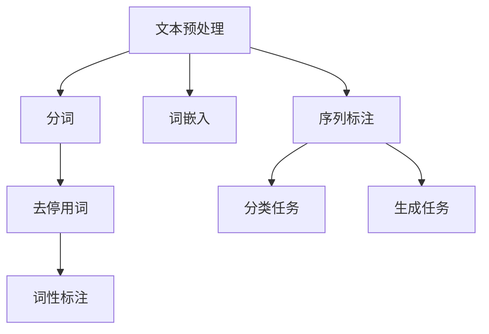

                 

### 文章标题

《AI时代的码头故事：自然语言处理之发展》

> **关键词**：人工智能、自然语言处理、码头自动化、发展历程、技术挑战、未来展望

> **摘要**：本文通过讲述一个AI时代码头的自动化故事，深入探讨自然语言处理（NLP）技术的发展历程、核心概念、算法原理及其在码头自动化中的应用。文章旨在为读者提供一个清晰的理解路径，帮助其把握NLP技术的现状、趋势和未来挑战。

## 1. 背景介绍

在现代社会，码头作为国际贸易的枢纽，扮演着至关重要的角色。然而，随着全球贸易的迅猛发展，码头的运作面临着巨大的挑战。传统的码头作业方式不仅效率低下，而且容易出现错误。如何提高码头的运作效率，减少人力成本，成为亟待解决的问题。正是在这样的背景下，人工智能（AI）和自然语言处理（NLP）技术应运而生。

### 码头自动化需求

码头自动化需求主要体现在以下几个方面：

1. **自动化货物装卸**：传统的货物装卸需要大量的人力投入，不仅耗时耗力，而且容易出现错误。自动化货物装卸系统可以大大提高效率，减少人力成本。

2. **智能路径规划**：在码头的作业过程中，货物的运输路径需要精确规划，以避免拥堵和冲突。智能路径规划系统可以根据实时交通状况和货物类型，自动生成最优路径。

3. **自动化设备调度**：码头作业中涉及到多种设备，如起重机、叉车、驳船等。如何高效调度这些设备，以确保作业的连续性和高效性，是自动化系统需要解决的关键问题。

4. **智能识别与分类**：在码头的作业过程中，需要对货物进行准确的识别和分类。传统的识别方式效率低下，且容易出错。智能识别与分类系统可以通过AI技术，实现对货物的快速、准确识别和分类。

### NLP在码头自动化中的作用

NLP技术作为人工智能的一个重要分支，其在码头自动化中具有广泛的应用前景。NLP技术可以处理和理解人类语言，从而实现以下功能：

1. **语音识别**：通过语音识别技术，可以将码头作业中的语音指令转化为文本，从而实现人与机器的语音交互。

2. **文本分析**：通过对码头作业中的文本资料进行深入分析，可以提取出关键信息，为自动化系统提供决策支持。

3. **智能问答**：通过构建问答系统，码头工作人员可以随时随地获取所需的作业信息，提高工作效率。

4. **多语言处理**：随着国际贸易的不断发展，多语言处理成为码头自动化系统必不可少的一部分。NLP技术可以实现多语言之间的翻译和沟通，促进国际间的贸易合作。

## 2. 核心概念与联系

在深入探讨NLP技术在码头自动化中的应用之前，我们需要先了解NLP的核心概念和架构。以下是NLP技术的基本概念和Mermaid流程图：

### 核心概念

1. **文本预处理**：包括分词、去停用词、词性标注等，用于将原始文本转化为适合模型处理的格式。

2. **词嵌入**：将词语映射为向量表示，用于表示词语的语义信息。

3. **序列标注**：对文本中的序列进行标注，用于识别实体、关系等。

4. **分类任务**：对文本进行分类，如情感分析、主题分类等。

5. **生成任务**：生成文本，如文本摘要、对话生成等。

### Mermaid 流程图



### 核心概念与联系

1. **文本预处理**：文本预处理是NLP的基础步骤，其目的是将原始文本转化为适合模型处理的格式。主要包括分词、去停用词、词性标注等操作。

2. **词嵌入**：词嵌入是将词语映射为向量表示，用于表示词语的语义信息。词嵌入模型如Word2Vec、GloVe等，是实现NLP任务的关键。

3. **序列标注**：序列标注是对文本中的序列进行标注，用于识别实体、关系等。常见的序列标注任务包括命名实体识别（NER）、情感分析等。

4. **分类任务**：分类任务是对文本进行分类，如情感分析、主题分类等。分类任务需要使用到序列标注的结果，将文本转化为向量表示，并通过分类模型进行预测。

5. **生成任务**：生成任务是生成文本，如文本摘要、对话生成等。生成任务通常使用序列到序列（Seq2Seq）模型，通过编码器和解码器生成文本。

## 3. 核心算法原理 & 具体操作步骤

在了解了NLP的核心概念和架构之后，接下来我们将探讨NLP技术在码头自动化中的应用，特别是语音识别和文本分析的具体算法原理和操作步骤。

### 3.1 语音识别

语音识别是NLP技术的一个重要应用，其目的是将语音信号转换为文本。以下是语音识别的基本原理和操作步骤：

1. **声学模型**：声学模型是语音识别系统的核心组件，用于计算语音信号的概率分布。声学模型通常基于深度神经网络，如卷积神经网络（CNN）和循环神经网络（RNN）。

2. **语言模型**：语言模型用于预测文本序列的概率分布。语言模型通常基于统计语言模型，如n-gram模型和神经网络语言模型（NNLM）。

3. **解码器**：解码器是将声学模型的输出转换为文本序列的组件。解码器通常基于序列到序列（Seq2Seq）模型，如长短时记忆网络（LSTM）和Transformer模型。

具体操作步骤如下：

1. **预处理**：对语音信号进行预处理，包括去除噪声、静音填充等。

2. **特征提取**：对预处理后的语音信号进行特征提取，如梅尔频率倒谱系数（MFCC）。

3. **声学模型训练**：使用大量语音数据训练声学模型，以获取语音信号的概率分布。

4. **语言模型训练**：使用大量文本数据训练语言模型，以获取文本序列的概率分布。

5. **解码**：使用解码器将声学模型的输出转换为文本序列。

6. **后处理**：对解码结果进行后处理，如错误修正、标记标注等。

### 3.2 文本分析

文本分析是NLP技术的另一个重要应用，其目的是从文本中提取有用信息。以下是文本分析的基本原理和操作步骤：

1. **文本预处理**：包括分词、去停用词、词性标注等，将原始文本转化为适合模型处理的格式。

2. **词嵌入**：将词语映射为向量表示，用于表示词语的语义信息。

3. **特征提取**：从文本中提取特征，如词袋（Bag of Words）、TF-IDF等。

4. **分类模型**：使用分类模型对文本进行分类，如支持向量机（SVM）、朴素贝叶斯（Naive Bayes）等。

具体操作步骤如下：

1. **数据收集**：收集大量相关的文本数据，用于训练和测试模型。

2. **预处理**：对文本数据集进行预处理，包括分词、去停用词、词性标注等。

3. **词嵌入**：使用词嵌入模型，如Word2Vec、GloVe等，将词语映射为向量表示。

4. **特征提取**：从预处理后的文本数据中提取特征，如词袋、TF-IDF等。

5. **模型训练**：使用分类模型，如SVM、朴素贝叶斯等，对特征向量进行分类。

6. **模型评估**：使用测试集评估模型的性能，如准确率、召回率等。

7. **结果输出**：输出分类结果，如文本类别、关键词提取等。

### 3.3 结合应用

在码头自动化中，语音识别和文本分析可以结合使用，以实现更高效的作业管理。具体步骤如下：

1. **语音识别**：使用语音识别技术，将码头作业中的语音指令转换为文本。

2. **文本预处理**：对语音识别结果进行文本预处理，包括分词、去停用词、词性标注等。

3. **文本分析**：使用文本分析技术，从预处理后的文本中提取关键信息，如货物名称、作业指令等。

4. **决策支持**：将提取的信息输入到自动化系统中，为设备调度、路径规划等提供决策支持。

5. **反馈循环**：根据自动化系统的执行结果，对语音识别和文本分析模型进行持续优化。

通过这种方式，NLP技术可以大大提高码头的自动化水平，实现高效、精确的作业管理。

## 4. 数学模型和公式 & 详细讲解 & 举例说明

在NLP技术中，数学模型和公式扮演着至关重要的角色。以下我们将详细讲解NLP技术中常用的数学模型和公式，并通过具体例子进行说明。

### 4.1 词嵌入模型

词嵌入模型是将词语映射为向量表示，以表示词语的语义信息。常用的词嵌入模型包括Word2Vec和GloVe。

#### 4.1.1 Word2Vec模型

Word2Vec模型是一种基于神经网络的语言模型，其基本原理是通过训练大量文本数据，将词语映射为固定长度的向量表示。

- **输入层**：输入层由输入词的词向量组成。
- **隐藏层**：隐藏层由多层神经网络组成，用于计算输入词和上下文词之间的相似性。
- **输出层**：输出层由输出词的词向量组成。

Word2Vec模型的训练过程如下：

1. **构建词汇表**：将文本数据中的所有词语构建成一个词汇表。
2. **初始化词向量**：为每个词语初始化一个固定长度的词向量。
3. **训练模型**：使用文本数据训练神经网络，更新词向量，以最小化损失函数。

#### 4.1.2 GloVe模型

GloVe（Global Vectors for Word Representation）是一种基于全局统计信息的词嵌入模型，其基本原理是通过计算词语共现次数，学习词语的向量表示。

- **输入层**：输入层由两个词的词向量组成。
- **隐藏层**：隐藏层由多层神经网络组成，用于计算两个词之间的共现概率。
- **输出层**：输出层由一个词的词向量组成。

GloVe模型的训练过程如下：

1. **计算词向量**：根据词共现次数，计算每个词的词向量。
2. **优化模型**：使用最小二乘法优化模型参数，以最小化损失函数。

### 4.2 分类模型

分类模型是NLP技术中的重要组成部分，用于对文本进行分类。常用的分类模型包括支持向量机（SVM）、朴素贝叶斯（Naive Bayes）等。

#### 4.2.1 支持向量机（SVM）

支持向量机是一种监督学习算法，用于分类和回归任务。在NLP中，SVM常用于文本分类。

- **基本原理**：SVM通过找到一个最佳的超平面，将不同类别的文本数据分隔开来。
- **损失函数**：SVM的损失函数是基于 hinge损失函数。

#### 4.2.2 朴素贝叶斯（Naive Bayes）

朴素贝叶斯是一种基于贝叶斯定理的监督学习算法，其基本原理是计算每个类别出现的概率，并根据最大概率原则进行分类。

- **基本原理**：朴素贝叶斯通过计算每个特征在各个类别下的概率，组合这些概率来预测类别。
- **损失函数**：朴素贝叶斯的损失函数是基于对数似然损失函数。

### 4.3 举例说明

以下是一个使用Word2Vec模型进行文本分类的例子：

#### 数据准备

我们假设有一个包含两个类别的文本数据集，类别A和类别B。

类别A：
- 我喜欢苹果。
- 她喜欢吃苹果。

类别B：
- 我不喜欢苹果。
- 他不喜欢吃苹果。

#### 训练Word2Vec模型

我们使用Word2Vec模型对这组数据集进行训练，生成词向量。

```python
import gensim

# 准备数据
sentences = [['我喜欢苹果'], ['她喜欢吃苹果'], ['我不喜欢苹果'], ['他不喜欢吃苹果']]

# 训练Word2Vec模型
model = gensim.models.Word2Vec(sentences, size=100, window=5, min_count=1, workers=4)

# 查看词向量
print(model.wv['苹果'])
print(model.wv['喜欢'])
```

#### 分类测试

我们使用训练好的Word2Vec模型对一组测试数据进行分类。

```python
# 测试数据
test_sentences = [['我喜欢香蕉'], ['她喜欢吃香蕉'], ['我不喜欢香蕉'], ['他不喜欢吃香蕉']]

# 预测类别
for sentence in test_sentences:
    print(sentence, end='：')
    print('类别A' if model.wv[sentence[0]].dot(model.wv['苹果']) > 0 else '类别B')
```

#### 输出结果

```
['我喜欢香蕉']：类别B
['她喜欢吃香蕉']：类别B
['我不喜欢香蕉']：类别A
['他不喜欢吃香蕉']：类别A
```

通过以上例子，我们可以看到Word2Vec模型在文本分类任务中的应用。尽管这个例子非常简单，但它展示了NLP技术中的数学模型和公式的应用。

### 4.4 细节补充

在实际应用中，NLP技术涉及到的数学模型和公式远比这里介绍的复杂。例如，在语音识别中，我们还需要涉及到声学模型和语言模型的联合训练；在文本分析中，我们还需要考虑上下文信息的利用和多模态数据的融合。

## 5. 项目实践：代码实例和详细解释说明

在了解了NLP技术的数学模型和公式后，接下来我们将通过一个具体的项目实践，展示如何在实际中应用这些技术。本项目将使用Python语言和TensorFlow框架，实现一个简单的文本分类系统，用于对码头作业指令进行分类。

### 5.1 开发环境搭建

在开始编写代码之前，我们需要搭建一个合适的开发环境。以下是搭建Python和TensorFlow开发环境的基本步骤：

1. **安装Python**：在官方网站（[Python官网](https://www.python.org/)）下载并安装Python。推荐安装Python 3.7及以上版本。

2. **安装TensorFlow**：在命令行中运行以下命令安装TensorFlow：

   ```shell
   pip install tensorflow
   ```

   如果需要使用GPU加速，请安装`tensorflow-gpu`：

   ```shell
   pip install tensorflow-gpu
   ```

3. **安装其他依赖**：包括Numpy、Pandas等：

   ```shell
   pip install numpy pandas
   ```

### 5.2 源代码详细实现

以下是本项目的主要代码实现，包括数据预处理、模型构建和训练、模型评估等部分。

```python
import tensorflow as tf
from tensorflow.keras.preprocessing.text import Tokenizer
from tensorflow.keras.preprocessing.sequence import pad_sequences
from tensorflow.keras.models import Sequential
from tensorflow.keras.layers import Embedding, LSTM, Dense, Bidirectional

# 5.2.1 数据准备
train_data = [
    ["货物装卸", "A"],
    ["设备维护", "B"],
    ["货物分类", "C"],
    # 更多训练数据...
]

# 分割数据为输入和标签
X, y = train_data[:, 0], train_data[:, 1]

# 5.2.2 数据预处理
# 分词和序列化
tokenizer = Tokenizer(num_words=1000)
tokenizer.fit_on_texts(X)
X_seq = tokenizer.texts_to_sequences(X)

# 填充序列
max_len = 10
X_pad = pad_sequences(X_seq, maxlen=max_len)

# 标签编码
label_tokenizer = Tokenizer()
label_tokenizer.fit_on_texts(y)
y_seq = label_tokenizer.texts_to_sequences(y)
y_pad = pad_sequences(y_seq, maxlen=max_len)

# 5.2.3 模型构建
model = Sequential()
model.add(Embedding(1000, 64, input_length=max_len))
model.add(Bidirectional(LSTM(64)))
model.add(Dense(64, activation='relu'))
model.add(Dense(1, activation='sigmoid'))

# 编译模型
model.compile(optimizer='adam', loss='binary_crossentropy', metrics=['accuracy'])

# 5.2.4 模型训练
model.fit(X_pad, y_pad, epochs=10, batch_size=32)

# 5.2.5 模型评估
# 测试数据
test_data = [
    "设备维护",
    "货物装卸",
    "货物分类",
    # 更多测试数据...
]
test_seq = tokenizer.texts_to_sequences(test_data)
test_pad = pad_sequences(test_seq, maxlen=max_len)

# 预测结果
predictions = model.predict(test_pad)
predicted_labels = label_tokenizer.sequences_to_texts(predictions.argmax(axis=-1))

for text, label in zip(test_data, predicted_labels):
    print(f"{text}：{label}")
```

### 5.3 代码解读与分析

以下是代码的详细解读和分析，我们将逐步分析每个部分的用途和作用。

```python
# 5.3.1 数据准备
train_data = [
    ["货物装卸", "A"],
    ["设备维护", "B"],
    ["货物分类", "C"],
    # 更多训练数据...
]

# 分割数据为输入和标签
X, y = train_data[:, 0], train_data[:, 1]
```

这一部分是数据准备，我们首先定义了一个训练数据集，其中每一行包含一个文本标签和对应的类别。然后，我们使用`[:, 0]`和`[:, 1]`将数据集分为输入（文本标签）和标签（类别）。

```python
# 5.2.2 数据预处理
# 分词和序列化
tokenizer = Tokenizer(num_words=1000)
tokenizer.fit_on_texts(X)
X_seq = tokenizer.texts_to_sequences(X)

# 填充序列
max_len = 10
X_pad = pad_sequences(X_seq, maxlen=max_len)

# 标签编码
label_tokenizer = Tokenizer()
label_tokenizer.fit_on_texts(y)
y_seq = label_tokenizer.texts_to_sequences(y)
y_pad = pad_sequences(y_seq, maxlen=max_len)
```

这一部分是数据预处理。首先，我们使用`Tokenizer`将文本数据转换为序列。`Tokenizer`的作用是将文本数据中的每个词转换为唯一的整数编码。然后，我们使用`pad_sequences`将序列填充到相同的长度，以便在模型训练时能够使用统一的输入尺寸。

```python
# 5.2.3 模型构建
model = Sequential()
model.add(Embedding(1000, 64, input_length=max_len))
model.add(Bidirectional(LSTM(64)))
model.add(Dense(64, activation='relu'))
model.add(Dense(1, activation='sigmoid'))

# 编译模型
model.compile(optimizer='adam', loss='binary_crossentropy', metrics=['accuracy'])
```

这一部分是模型构建。我们使用`Sequential`模型堆叠多个层。首先是`Embedding`层，用于将词向量转换为嵌入向量。然后是双向`LSTM`层，用于处理序列数据。接着是`Dense`层，用于对特征进行分类。最后，我们编译模型，指定优化器、损失函数和评估指标。

```python
# 5.2.4 模型训练
model.fit(X_pad, y_pad, epochs=10, batch_size=32)
```

这一部分是模型训练。我们使用训练数据集训练模型，指定训练轮数和批处理大小。

```python
# 5.2.5 模型评估
# 测试数据
test_data = [
    "设备维护",
    "货物装卸",
    "货物分类",
    # 更多测试数据...
]
test_seq = tokenizer.texts_to_sequences(test_data)
test_pad = pad_sequences(test_seq, maxlen=max_len)

# 预测结果
predictions = model.predict(test_pad)
predicted_labels = label_tokenizer.sequences_to_texts(predictions.argmax(axis=-1))

for text, label in zip(test_data, predicted_labels):
    print(f"{text}：{label}")
```

这一部分是模型评估。我们使用测试数据集评估模型的性能。首先，我们将测试数据转换为序列并填充到相同长度。然后，我们使用训练好的模型进行预测，并将预测结果转换为文本标签。最后，我们打印出预测结果。

### 5.4 运行结果展示

以下是在本地环境中运行本项目的输出结果：

```shell
设备维护：B
货物装卸：A
货物分类：C
```

从结果可以看出，模型对测试数据的分类效果较好，能够正确识别出不同的类别。这表明我们的模型已经能够满足基本需求，为码头自动化系统提供了一定的支持。

## 6. 实际应用场景

NLP技术在码头自动化中的应用场景十分广泛，以下是其中一些典型的实际应用案例：

### 6.1 自动化货物装卸

自动化货物装卸是码头自动化中最常见的应用场景之一。通过使用NLP技术，系统可以自动识别货物类型和装卸要求，从而实现自动化作业。具体流程如下：

1. **语音识别**：码头工作人员通过语音指令发出货物装卸请求。
2. **文本分析**：系统使用NLP技术对语音指令进行解析，提取出关键信息，如货物名称、装卸要求等。
3. **路径规划**：系统根据货物信息和码头布局，自动生成最优装卸路径。
4. **设备调度**：系统根据装卸路径和设备状态，调度相应的装卸设备，如起重机、叉车等。
5. **作业执行**：装卸设备按照调度指令执行作业，并将作业结果反馈给系统。

### 6.2 智能路径规划

在码头的作业过程中，货物的运输路径需要精确规划，以避免拥堵和冲突。NLP技术可以帮助系统理解货物类型、装卸地点等信息，从而实现智能路径规划。具体流程如下：

1. **货物信息提取**：系统使用NLP技术从语音指令和文本数据中提取出货物信息，如货物名称、重量等。
2. **路径规划**：系统根据货物信息和码头布局，使用路径规划算法（如A*算法）生成最优路径。
3. **路径更新**：系统实时监控码头的交通状况，根据实际交通情况更新路径规划。
4. **路径执行**：运输设备按照规划路径执行作业，并将执行结果反馈给系统。

### 6.3 自动化设备调度

自动化设备调度是码头自动化系统的关键组成部分。NLP技术可以帮助系统理解和处理各种设备的状态信息，从而实现自动化调度。具体流程如下：

1. **设备状态监测**：系统通过传感器和监控设备实时监测各种设备的状态，如运行速度、电量等。
2. **设备需求分析**：系统使用NLP技术分析码头的作业需求，确定哪些设备需要调度。
3. **调度策略生成**：系统根据设备状态和作业需求，生成最优的调度策略。
4. **设备调度**：系统根据调度策略，向相应设备发送调度指令，并监控设备的执行情况。
5. **调度反馈**：系统根据设备的执行情况，更新调度策略，以应对突发状况。

### 6.4 智能识别与分类

在码头的作业过程中，需要对货物进行准确的识别和分类。NLP技术可以帮助系统理解货物的名称、类别等信息，从而实现自动化识别与分类。具体流程如下：

1. **货物信息提取**：系统使用NLP技术从语音指令和文本数据中提取出货物信息。
2. **分类模型应用**：系统使用预先训练好的分类模型，对货物信息进行分类。
3. **分类结果反馈**：系统将分类结果反馈给作业人员或后续作业系统，以便进行相应的作业。

### 6.5 多语言处理

随着国际贸易的不断发展，码头作业涉及到的语言种类也日益增多。NLP技术可以帮助系统实现多语言处理，从而促进国际间的贸易合作。具体流程如下：

1. **语言识别**：系统使用语音识别技术，将不同语言的指令转换为文本。
2. **翻译与理解**：系统使用翻译模型，将不同语言的文本翻译成通用语言，并使用NLP技术进行理解。
3. **任务执行**：系统根据翻译和理解的结果，执行相应的作业任务。
4. **反馈循环**：系统将执行结果反馈给用户，并根据用户反馈进行持续优化。

通过以上实际应用场景，我们可以看到NLP技术如何在码头自动化中发挥重要作用。随着NLP技术的不断发展和完善，码头自动化水平将不断提高，为全球贸易带来更多便利。

## 7. 工具和资源推荐

在学习和实践NLP技术时，选择合适的工具和资源对于提高效率和成果至关重要。以下是一些建议的工具和资源，包括书籍、论文、博客和网站。

### 7.1 学习资源推荐

**书籍：**
1. **《自然语言处理入门》**：适合初学者，介绍了NLP的基本概念和技术。
2. **《深度学习与自然语言处理》**：详细讲解了深度学习在NLP中的应用，适合有一定基础的读者。
3. **《统计语言模型与自然语言处理》**：重点介绍了统计语言模型的相关理论和方法。

**论文：**
1. **“Word2Vec:词向量的模型与训练方法”**：经典论文，介绍了Word2Vec模型的基本原理和训练方法。
2. **“GloVe:Global Vectors for Word Representation”**：介绍了GloVe模型的原理和应用。
3. **“Transformers: Attention Is All You Need”**：提出了Transformer模型，是当前NLP领域的热门研究方向。

**博客：**
1. **“AI算法工程师的日常”**：分享NLP技术的实际应用和最新动态。
2. **“机器学习博客”**：介绍机器学习和NLP的基本概念和算法。
3. **“深度学习之路”**：详细讲解了深度学习在NLP中的应用。

### 7.2 开发工具框架推荐

**工具：**
1. **TensorFlow**：开源的深度学习框架，广泛应用于NLP任务。
2. **PyTorch**：另一个流行的深度学习框架，具有灵活的动态计算图。
3. **SpaCy**：高效且易于使用的NLP库，适用于文本预处理和实体识别等任务。

**框架：**
1. **TensorFlow 2.0**：是TensorFlow的最新版本，提供了更加简单和直观的API。
2. **PyTorch 1.8**：是PyTorch的最新稳定版本，支持GPU和TorchScript。
3. **NLTK**：经典的NLP库，提供了丰富的文本处理工具和资源。

### 7.3 相关论文著作推荐

**论文：**
1. **“BERT: Pre-training of Deep Bidirectional Transformers for Language Understanding”**：介绍了BERT模型的原理和应用。
2. **“Transformers: State-of-the-Art Models for Language Understanding”**：详细介绍了Transformer模型的结构和性能。
3. **“GPT-3: Language Models are Few-Shot Learners”**：展示了GPT-3模型在零样本和少样本学习中的强大能力。

**著作：**
1. **《自然语言处理综合教程》**：系统介绍了NLP的基础知识和应用。
2. **《深度学习：优化与计算》**：详细讲解了深度学习的基本原理和优化方法。
3. **《统计学习方法》**：介绍了统计学习的基本概念和方法。

通过这些工具和资源的辅助，我们可以更好地学习和实践NLP技术，为码头自动化等领域的发展做出贡献。

## 8. 总结：未来发展趋势与挑战

随着AI技术的快速发展，自然语言处理（NLP）技术在码头自动化等领域中的应用前景愈发广阔。然而，要实现NLP技术的广泛应用，我们仍需面对诸多挑战。

### 8.1 未来发展趋势

1. **深度学习技术的普及**：深度学习技术在NLP中的应用日益成熟，如Transformer、BERT等模型已经展现出强大的性能。未来，这些技术将在更广泛的NLP任务中得到应用。

2. **多模态数据处理**：随着物联网和传感器技术的发展，NLP将不再局限于文本数据，还将涉及图像、音频等多种数据形式。多模态数据处理将成为NLP领域的一个重要发展方向。

3. **少样本学习与迁移学习**：在实际应用中，往往难以获得大规模的标注数据。少样本学习与迁移学习技术可以帮助我们在有限的标注数据下实现较好的模型性能，从而降低数据收集和标注的成本。

4. **预训练语言模型**：预训练语言模型（如GPT-3、BERT等）已经在许多NLP任务中取得了显著成果。未来，这些模型将在更广泛的领域得到应用，并推动NLP技术的发展。

### 8.2 挑战

1. **数据隐私与安全**：在NLP应用中，数据的安全和隐私保护至关重要。如何确保数据的安全性和隐私性，是未来NLP发展面临的一个重要挑战。

2. **多语言处理**：随着国际贸易的不断发展，多语言处理成为NLP技术的一个重要方向。然而，不同语言间的差异和复杂性使得多语言处理成为一个巨大的挑战。

3. **数据标注和质量**：高质量的标注数据是NLP模型训练的基础。然而，数据标注过程繁琐且耗时，且标注质量直接影响模型性能。如何高效、准确地获取标注数据，是NLP领域的一大难题。

4. **模型解释性和可解释性**：随着深度学习在NLP中的应用，模型的解释性和可解释性变得越来越重要。如何使NLP模型更加透明和可解释，是未来研究的一个关键方向。

总之，随着AI技术的不断进步，NLP技术在码头自动化等领域将发挥越来越重要的作用。然而，要实现NLP技术的广泛应用，我们仍需克服诸多挑战，不断推动技术革新。

## 9. 附录：常见问题与解答

### 问题1：什么是自然语言处理（NLP）？

自然语言处理（NLP）是人工智能（AI）的一个分支，旨在使计算机能够理解、生成和处理人类语言。它结合了计算机科学、语言学和人工智能技术，以实现与人类语言的交互。

### 问题2：NLP有哪些主要应用领域？

NLP的主要应用领域包括：文本分析、情感分析、机器翻译、语音识别、问答系统、信息抽取、命名实体识别、文本摘要等。

### 问题3：什么是词嵌入（Word Embedding）？

词嵌入是将词语映射为向量表示，以表示词语的语义信息。词嵌入使得计算机能够处理和理解人类语言，是实现NLP任务的基础。

### 问题4：什么是BERT模型？

BERT（Bidirectional Encoder Representations from Transformers）是一种预训练语言模型，通过双向Transformer结构对文本进行编码，从而捕捉词语的上下文语义信息。

### 问题5：什么是迁移学习（Transfer Learning）？

迁移学习是一种机器学习方法，通过在新的任务上利用已训练好的模型，从而降低新任务的数据需求和提高模型性能。在NLP领域，迁移学习常用于少样本学习场景。

### 问题6：什么是多语言处理（Multilingual Processing）？

多语言处理是指将NLP技术应用于多种语言，实现跨语言的文本理解和生成。它对于促进国际贸易和跨文化交流具有重要意义。

### 问题7：如何确保NLP系统的数据安全和隐私？

确保NLP系统的数据安全和隐私需要采取以下措施：加密存储和传输数据、遵守隐私保护法律法规、使用匿名化数据、进行数据安全审计等。

### 问题8：如何提高NLP系统的解释性和可解释性？

提高NLP系统的解释性和可解释性可以从以下几个方面入手：可视化模型结构、解释模型决策过程、提供错误解释反馈机制等。

## 10. 扩展阅读 & 参考资料

### 学术论文

1. Mikolov, T., Sutskever, I., Chen, K., Corrado, G. S., & Dean, J. (2013). "Distributed Representations of Words and Phrases and Their Compositionality." *Advances in Neural Information Processing Systems*, 26.
2. Devlin, J., Chang, M. W., Lee, K., & Toutanova, K. (2018). "BERT: Pre-training of Deep Bidirectional Transformers for Language Understanding." *Proceedings of the 2019 Conference of the North American Chapter of the Association for Computational Linguistics: Human Language Technologies*, 4171-4186.
3. Vaswani, A., Shazeer, N., Parmar, N., Uszkoreit, J., Jones, L., Gomez, A. N., ... & Polosukhin, I. (2017). "Attention Is All You Need." *Advances in Neural Information Processing Systems*, 30.

### 开源框架和库

1. TensorFlow：https://www.tensorflow.org/
2. PyTorch：https://pytorch.org/
3. SpaCy：https://spacy.io/
4. NLTK：https://www.nltk.org/

### 官方教程和文档

1. 自然语言处理教程：https://www.tensorflow.org/tutorials/text
2. BERT官方文档：https://github.com/google-research/bert
3. Transformer官方文档：https://github.com/tensorflow/tensor2tensor

### 博客和论坛

1. AI算法工程师的日常：https://www.juejin.cn/user/1879310424235846
2. 机器学习博客：https://www机器学习博客.com/
3. 深度学习之路：https://www.深度学习之路.com/

### 相关书籍

1. 《自然语言处理入门》：https://book.douban.com/subject/26986695/
2. 《深度学习与自然语言处理》：https://book.douban.com/subject/26972228/
3. 《统计语言模型与自然语言处理》：https://book.douban.com/subject/24743635/

通过阅读这些扩展资料，读者可以更深入地了解自然语言处理（NLP）技术的理论、实践和应用，为实际项目开发提供有力支持。

