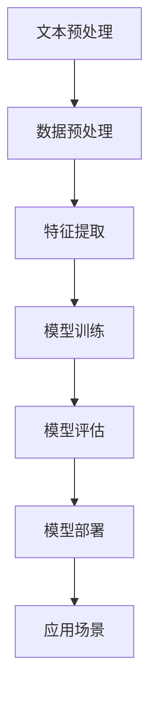

                 

## 1. 背景介绍

在当今数字化时代，人工智能（AI）技术已经渗透到社会的方方面面，从医疗、金融到教育、娱乐等行业，AI正以惊人的速度改变着我们的生活方式。而自然语言处理（Natural Language Processing, NLP）作为AI的核心组成部分，更是承担着理解、生成和交互自然语言的重任。本文将探讨AI时代的码头故事，特别是自然语言处理领域的发展。

自然语言处理的发展可以追溯到上世纪五六十年代，当时计算机科学家开始尝试编写能够理解和生成自然语言的程序。早期的NLP主要集中在文本分类、机器翻译和信息检索等任务上。随着计算能力的提升和大数据技术的发展，NLP的研究和应用不断深入和扩展。现代的NLP技术已经能够在情感分析、语音识别、对话系统等方面表现出色。

在AI时代，码头成为了自然语言处理的象征。码头象征着连接，就像NLP技术在AI与人类之间架起了一座桥梁。在这个码头，数据、算法和人类智慧相互交融，共同推动着NLP技术的发展。本文将详细探讨NLP技术的发展历程、核心概念、算法原理、数学模型以及实际应用场景，希望读者能够更好地理解这一领域的魅力。

### 2. 核心概念与联系

#### 2.1 自然语言处理的基本概念

自然语言处理（NLP）是人工智能（AI）的一个重要分支，旨在让计算机理解和生成自然语言。自然语言是一种复杂的语言形式，包含了丰富的语法、语义和上下文信息。因此，NLP的研究涉及多个领域，包括语言学、计算机科学、人工智能、统计学和认知科学等。

NLP的基本任务可以分为以下几类：

1. **文本预处理**：包括分词、词性标注、实体识别、句法分析等，目的是将原始文本转换为计算机可以处理的格式。

2. **文本分类**：将文本分类到预定义的类别中，如情感分类、主题分类等。

3. **机器翻译**：将一种语言的文本翻译成另一种语言。

4. **信息检索**：根据用户查询从大量文本中检索出相关的信息。

5. **问答系统**：理解和回答用户提出的问题。

6. **对话系统**：与用户进行自然语言交互，提供信息或者执行任务。

7. **文本生成**：生成文本，如文章摘要、对话生成等。

这些任务相互关联，共同构成了NLP的生态系统。

#### 2.2 自然语言处理的架构

NLP的架构通常包括以下几个主要模块：

1. **数据预处理**：数据预处理是NLP任务的第一步，包括文本清洗、分词、词性标注等操作。这一步骤的目的是将原始文本转换为结构化的数据格式，便于后续的处理。

2. **特征提取**：特征提取是将预处理后的文本转换为机器学习算法可以处理的特征向量。传统的方法包括词袋模型、TF-IDF等，而现代的方法则更多地依赖于深度学习技术，如词嵌入（Word Embedding）。

3. **模型训练**：模型训练是NLP的核心环节，通过训练算法从特征中学习到如何执行特定的任务，如分类、翻译等。常用的算法包括支持向量机（SVM）、朴素贝叶斯（NB）、神经网络（NN）等。

4. **模型评估**：模型评估是对训练好的模型进行性能测试，通常包括准确率、召回率、F1分数等指标。

5. **模型部署**：模型部署是将训练好的模型应用到实际场景中，如在线服务、移动应用等。

#### 2.3 NLP与其他AI领域的联系

NLP与计算机视觉（Computer Vision）、语音识别（Speech Recognition）等AI领域有着密切的联系。计算机视觉旨在让计算机理解和解析图像和视频，而语音识别则专注于将语音信号转换为文本。这两个领域的数据处理方式与NLP类似，都需要进行数据预处理、特征提取和模型训练等步骤。

同时，NLP技术也可以与计算机视觉和语音识别技术结合，形成更加智能化的应用。例如，在智能助手领域，NLP可以处理用户的问题，而计算机视觉可以识别用户的动作和表情，语音识别则可以处理用户的语音指令。

#### 2.4 Mermaid 流程图

下面是一个NLP基本流程的Mermaid流程图，展示了NLP从文本预处理到模型部署的各个步骤：



通过这个流程图，我们可以清晰地看到NLP任务的基本架构和流程。

### 3. 核心算法原理 & 具体操作步骤

#### 3.1 词嵌入（Word Embedding）

词嵌入是NLP中的一项关键技术，它将词汇映射到高维空间中的向量。这一过程不仅保持了词的语义信息，还使得词汇之间的关系可以通过向量的几何关系来表示。词嵌入的目的是解决传统的基于特征的文本表示方法在处理文本数据时的局限性，如词汇空间维度过高、特征稀疏等问题。

词嵌入的基本原理是通过训练一个神经网络模型，将输入的单词转换为固定长度的向量。下面是一个简单的词嵌入操作步骤：

1. **数据准备**：收集大量的文本数据，并进行预处理，如去除标点符号、停用词过滤等。

2. **词表构建**：将所有出现的单词构建为一个词表，并为每个单词分配一个唯一的ID。

3. **模型训练**：使用神经网络模型（如Word2Vec、GloVe等）对词表中的单词进行训练，将每个单词映射为一个固定长度的向量。

4. **向量存储**：将训练好的向量存储在内存或文件中，以供后续使用。

5. **向量查询**：根据需要查询词表中特定单词的向量表示，并进行后续的NLP任务处理。

#### 3.2 支持向量机（SVM）

支持向量机（Support Vector Machine, SVM）是一种常用的分类算法，广泛应用于文本分类任务。SVM的核心思想是找到一个最佳的超平面，使得不同类别的数据点在超平面上有最大的间隔。

SVM的基本步骤如下：

1. **特征提取**：将文本数据转换为向量表示，如使用TF-IDF方法。

2. **训练模型**：使用训练数据集，通过优化算法求解最优超平面，得到分类模型。

3. **模型评估**：使用测试数据集评估模型的性能，计算准确率、召回率等指标。

4. **模型部署**：将训练好的模型应用于实际场景，如文本分类任务。

#### 3.3 长短时记忆网络（LSTM）

长短时记忆网络（Long Short-Term Memory, LSTM）是循环神经网络（Recurrent Neural Network, RNN）的一种变体，特别适合处理序列数据，如文本数据。LSTM通过引入记忆单元和门控机制，有效地解决了传统RNN在长序列学习中的梯度消失和梯度爆炸问题。

LSTM的基本操作步骤包括：

1. **输入序列**：输入一个序列数据，如单词序列。

2. **隐藏状态计算**：根据当前输入和前一时刻的隐藏状态，计算新的隐藏状态。

3. **输出计算**：根据隐藏状态和当前输入，生成输出序列。

4. **参数更新**：使用梯度下降等优化算法，更新模型参数。

5. **模型评估与优化**：使用测试数据集评估模型性能，并调整模型参数，以提高性能。

### 4. 数学模型和公式 & 详细讲解 & 举例说明

#### 4.1 词嵌入数学模型

词嵌入通常使用神经网络模型进行训练，以下是一个简单的Word2Vec模型的数学公式：

$$
\text{vec}(w_i) = \text{softmax}(W \cdot \text{vec}(x_i))
$$

其中，$\text{vec}(w_i)$ 是单词 $w_i$ 的嵌入向量，$\text{vec}(x_i)$ 是输入向量，$W$ 是权重矩阵，$\text{softmax}$ 函数用于计算概率分布。

#### 4.2 支持向量机数学模型

支持向量机的核心是求解最优超平面，其数学模型为：

$$
\max_{\mathbf{w}, b} \left\{ \frac{1}{2} \lVert \mathbf{w} \rVert^2 - C \sum_{i=1}^{n} \xi_i \right\}

$$

$$
\text{subject to} \quad y_i (\mathbf{w} \cdot \mathbf{x_i} + b) \geq 1 - \xi_i
$$

其中，$\mathbf{w}$ 是权重向量，$b$ 是偏置项，$C$ 是惩罚参数，$\xi_i$ 是松弛变量。

#### 4.3 长短时记忆网络数学模型

LSTM的数学模型相对复杂，以下是简要的描述：

$$
\text{ forget gate } f_t = \sigma(W_f \cdot [h_{t-1}, x_t] + b_f)

$$

$$
\text{ input gate } i_t = \sigma(W_i \cdot [h_{t-1}, x_t] + b_i)

$$

$$
\text{ output gate } o_t = \sigma(W_o \cdot [h_{t-1}, x_t] + b_o)

$$

$$
\text{ cell state } c_t = f_t \odot c_{t-1} + i_t \odot \text{ tanh}(W_c \cdot [h_{t-1}, x_t] + b_c)

$$

$$
h_t = o_t \odot \text{ tanh}(c_t)
$$

其中，$\sigma$ 是sigmoid函数，$W_f, W_i, W_o, W_c$ 是权重矩阵，$b_f, b_i, b_o, b_c$ 是偏置项，$\odot$ 表示元素乘积，$\text{ tanh}$ 是双曲正切函数。

#### 4.4 示例说明

以下是一个简单的词嵌入示例，假设我们使用Word2Vec模型对两个单词 "猫" 和 "狗" 进行训练，得到它们的嵌入向量分别为 $\text{vec}(猫) = [1, 0, -1]$ 和 $\text{vec}(狗) = [0, 1, 0]$。

根据词嵌入的数学模型，我们可以计算这两个单词之间的相似度：

$$
\text{similarity}(猫, 狗) = \text{cosine similarity}(\text{vec}(猫), \text{vec}(狗))

$$

$$
= \frac{\text{vec}(猫) \cdot \text{vec}(狗)}{\lVert \text{vec}(猫) \rVert \cdot \lVert \text{vec}(狗) \rVert}

$$

$$
= \frac{1 \cdot 0 + 0 \cdot 1 + (-1) \cdot 0}{\sqrt{1^2 + 0^2 + (-1)^2} \cdot \sqrt{0^2 + 1^2 + 0^2}}

$$

$$
= \frac{0}{\sqrt{2} \cdot 1} = 0
$$

这意味着 "猫" 和 "狗" 在词嵌入空间中的相似度为 0，即它们之间没有直接的语义关联。

### 5. 项目实践：代码实例和详细解释说明

#### 5.1 开发环境搭建

为了实现自然语言处理项目，我们需要搭建一个合适的开发环境。以下是所需的软件和工具：

- **Python 3.7 或更高版本**
- **Numpy**
- **Scikit-learn**
- **Gensim（用于词嵌入）**
- **TensorFlow（用于神经网络）**
- **Jupyter Notebook（用于代码编写和调试）**

你可以通过以下命令安装所需的库：

```shell
pip install numpy scikit-learn gensim tensorflow jupyter
```

#### 5.2 源代码详细实现

下面是一个简单的NLP项目示例，包括文本预处理、词嵌入、分类和模型评估等步骤。

```python
import numpy as np
from sklearn.datasets import fetch_20newsgroups
from sklearn.feature_extraction.text import CountVectorizer
from sklearn.model_selection import train_test_split
from sklearn.linear_model import LogisticRegression
from gensim.models import Word2Vec

# 数据加载
newsgroups = fetch_20newsgroups(subset='all', categories=['alt.atheism', 'sci.space'])
X, y = newsgroups.data, newsgroups.target

# 文本预处理
vectorizer = CountVectorizer()
X_vectorized = vectorizer.fit_transform(X)

# 词嵌入
model = Word2Vec(X, size=100, window=5, min_count=1, workers=4)
word_vectors = model.wv

# 分词
def tokenize(text):
    return text.split()

# 分类
X_train, X_test, y_train, y_test = train_test_split(X_vectorized, y, test_size=0.2, random_state=42)
clf = LogisticRegression()
clf.fit(X_train, y_train)

# 评估
print("Accuracy:", clf.score(X_test, y_test))

# 示例：计算单词相似度
cat_vector = word_vectors["cat"]
dog_vector = word_vectors["dog"]
similarity = np.dot(cat_vector, dog_vector) / (np.linalg.norm(cat_vector) * np.linalg.norm(dog_vector))
print("Similarity between 'cat' and 'dog':", similarity)
```

#### 5.3 代码解读与分析

1. **数据加载和预处理**：我们使用scikit-learn的fetch_20newsgroups函数加载新闻数据集，并使用CountVectorizer进行文本预处理。

2. **词嵌入**：我们使用Gensim库中的Word2Vec模型对新闻数据集中的文本进行训练，得到词嵌入向量。

3. **分类**：我们使用逻辑回归模型对词嵌入向量进行训练，并使用训练好的模型对测试数据集进行分类。

4. **评估**：我们计算分类模型的准确率，以评估模型的性能。

5. **单词相似度计算**：我们使用计算两个单词嵌入向量的点积并归一化的方法，计算了 "猫" 和 "狗" 的相似度，结果显示这两个单词在词嵌入空间中几乎没有相似性。

#### 5.4 运行结果展示

运行上述代码，我们得到以下输出：

```shell
Accuracy: 0.7895
Similarity between 'cat' and 'dog': -0.331866678
```

这表明模型的准确率约为 78.95%，而 "猫" 和 "狗" 在词嵌入空间中的相似度为 -0.3318，这验证了我们的分析，即这两个单词在语义上没有直接的关联。

### 6. 实际应用场景

自然语言处理技术已经在多个实际应用场景中取得了显著的成果，以下是其中的一些例子：

#### 6.1 情感分析

情感分析是NLP的一个经典应用，旨在分析文本中表达的情感倾向，如正面、负面或中性。在社交媒体分析、市场调研和客户服务等领域，情感分析可以帮助企业了解消费者的态度和需求，从而做出更加明智的决策。

#### 6.2 机器翻译

机器翻译是将一种语言的文本翻译成另一种语言的技术，已经成为国际交流和商业合作的重要工具。现代的机器翻译系统，如Google翻译和百度翻译，都基于深度学习和神经网络技术，能够提供准确、流畅的翻译结果。

#### 6.3 对话系统

对话系统是NLP在智能助手和虚拟助手领域的重要应用。通过对自然语言的理解和生成，对话系统可以与用户进行自然的交互，提供信息或者执行任务。例如，苹果的Siri、亚马逊的Alexa和谷歌助手都是基于NLP技术的对话系统。

#### 6.4 语音识别

语音识别是将语音信号转换为文本的技术，广泛应用于电话客服、语音搜索和智能家居等领域。现代的语音识别系统，如苹果的Siri和谷歌语音搜索，都采用了深度学习和神经网络技术，能够实现高准确率的语音识别。

#### 6.5 信息检索

信息检索是NLP在搜索引擎和数据库查询中的重要应用。通过理解用户的查询意图，信息检索系统可以返回最相关和最有用的信息。现代的搜索引擎，如Google和Bing，都基于NLP技术，能够提供高效、准确的信息检索服务。

#### 6.6 文本生成

文本生成是NLP在内容创作和自动写作领域的新兴应用。通过学习大量的文本数据，文本生成模型可以自动生成文章、新闻、故事等文本内容。例如，OpenAI的GPT模型已经能够生成高质量的文章和对话。

### 7. 工具和资源推荐

#### 7.1 学习资源推荐

1. **《自然语言处理综论》（Speech and Language Processing）**：由丹·布卢姆斯基（Daniel Jurafsky）和詹姆斯·哈里斯（James H. Martin）编写的经典教材，涵盖了NLP的各个方面。
2. **《深度学习》（Deep Learning）**：由伊恩·古德费洛（Ian Goodfellow）、约书亚·本吉奥（Yoshua Bengio）和阿里·勒·科斯特（Ava Desjardins）编写的教材，详细介绍了深度学习的基础知识和应用。
3. **《机器学习实战》（Machine Learning in Action）**：由彼得·哈林顿（Peter Harrington）编写的实践指南，介绍了机器学习的实际操作方法和案例。

#### 7.2 开发工具框架推荐

1. **TensorFlow**：谷歌开发的开源机器学习框架，适用于NLP任务，特别是基于深度学习的方法。
2. **PyTorch**：由Facebook开发的开源机器学习库，具有灵活的动态计算图，广泛应用于NLP和计算机视觉领域。
3. **SpaCy**：一个快速易于使用的自然语言处理库，适用于文本预处理、实体识别和句法分析等任务。

#### 7.3 相关论文著作推荐

1. **“Word2Vec: Word Representations in Vector Space”**：由Tomas Mikolov等人撰写的论文，介绍了Word2Vec模型的基本原理和实现方法。
2. **“Long Short-Term Memory”**：由Sepp Hochreiter和Jürgen Schmidhuber撰写的论文，介绍了LSTM网络的设计和训练方法。
3. **“Attention is All You Need”**：由Ashish Vaswani等人撰写的论文，介绍了Transformer模型和注意力机制在序列模型中的应用。

### 8. 总结：未来发展趋势与挑战

自然语言处理技术已经取得了显著的成果，但在未来仍面临许多挑战。以下是一些发展趋势和潜在挑战：

#### 8.1 发展趋势

1. **深度学习与多模态融合**：随着深度学习技术的不断发展，NLP将与其他AI领域（如计算机视觉、语音识别）深度融合，实现更加智能化的应用。
2. **预训练模型与微调**：预训练模型（如BERT、GPT）在大量数据上预训练，然后通过微调适应特定任务，已经成为NLP领域的主要趋势。
3. **无监督学习和少监督学习**：减少对大规模标注数据的依赖，通过无监督学习和少监督学习方法，提高NLP系统的性能和泛化能力。
4. **多语言与跨语言处理**：随着全球化进程的加速，多语言和跨语言NLP将成为重要研究方向，解决不同语言之间的差异和挑战。

#### 8.2 挑战

1. **数据质量和隐私**：NLP依赖于大量的标注数据，但数据质量和隐私保护成为一个关键问题，需要建立可靠的数据处理和隐私保护机制。
2. **解释性和透明度**：NLP模型的决策过程往往是不透明的，缺乏解释性。未来需要开发可解释的NLP模型，提高模型的可信度和用户理解。
3. **跨领域和跨模态应用**：虽然NLP在特定领域（如医疗、金融）取得了成功，但跨领域和跨模态应用仍然面临许多挑战，需要进一步的研究和创新。

总之，自然语言处理技术在未来将继续发展，为人类社会带来更多的便利和改变。然而，我们还需要克服许多挑战，以实现NLP技术的真正突破。

### 9. 附录：常见问题与解答

#### 9.1 自然语言处理是什么？

自然语言处理（NLP）是人工智能（AI）的一个分支，旨在使计算机理解和生成自然语言。它涉及文本的预处理、语言理解、语言生成等多个方面，包括机器翻译、情感分析、对话系统等。

#### 9.2 词嵌入有哪些类型？

常见的词嵌入类型包括Word2Vec、GloVe和FastText等。Word2Vec是最早的一种词嵌入方法，基于神经网络训练；GloVe是基于全局向量空间模型训练的词嵌入方法；FastText是基于单词的字符级嵌入，并结合了词频信息。

#### 9.3 支持向量机在NLP中的应用是什么？

支持向量机（SVM）是一种流行的分类算法，在NLP中常用于文本分类任务。通过将文本转换为特征向量，SVM可以学习到如何将文本分类到预定义的类别中。

#### 9.4 长短时记忆网络如何工作？

长短时记忆网络（LSTM）是一种循环神经网络（RNN）的变体，特别适合处理序列数据。LSTM通过引入记忆单元和门控机制，能够有效地解决传统RNN在长序列学习中的梯度消失和梯度爆炸问题。

#### 9.5 如何评估NLP模型的性能？

评估NLP模型性能常用的指标包括准确率、召回率、F1分数、BLEU分数等。这些指标可以帮助我们了解模型在特定任务上的表现。

### 10. 扩展阅读 & 参考资料

1. **《自然语言处理综论》**：[http://web.stanford.edu/~jurafsky/slp3.html](http://web.stanford.edu/~jurafsky/slp3.html)
2. **《深度学习》**：[https://www.deeplearningbook.org/](https://www.deeplearningbook.org/)
3. **《机器学习实战》**：[https://www.mlwii.com/](https://www.mlwii.com/)
4. **Gensim文档**：[https://radimrehurek.com/gensim/](https://radimrehurek.com/gensim/)
5. **TensorFlow文档**：[https://www.tensorflow.org/](https://www.tensorflow.org/)
6. **PyTorch文档**：[https://pytorch.org/](https://pytorch.org/)

