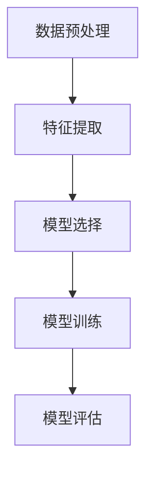

                 

# AI时空建模的技术基础

## 关键词：
- AI时空建模
- 数据分析
- 算法原理
- 数学模型
- 实践应用
- 工具资源

## 摘要：
本文旨在深入探讨AI时空建模的技术基础，包括核心概念、算法原理、数学模型、实践应用和未来发展趋势。通过逐步分析推理，本文将帮助读者理解AI时空建模的核心要素，以及如何在实际项目中运用这些技术。

## 1. 背景介绍

随着信息技术的飞速发展，数据量呈现爆炸式增长，时空数据作为其中的一部分，成为人工智能领域研究的重要方向。AI时空建模旨在利用人工智能技术对时空数据进行处理、分析和预测，从而为城市规划、交通管理、环境监测等领域提供有力支持。

### 1.1 时空数据的定义

时空数据是指同时包含时间和空间属性的数据，它们描述了物体在特定时间和空间位置上的状态或行为。例如，交通流量数据、位置跟踪数据和环境监测数据等都属于时空数据。

### 1.2 时空数据的特点

时空数据具有以下几个特点：

- **多维性**：时空数据通常包含多个维度，如时间维度、空间维度和其他相关维度（如气象参数、交通流量等）。
- **动态性**：时空数据随着时间不断变化，反映现实世界的动态特性。
- **关联性**：时空数据之间可能存在复杂的关联关系，需要通过建模和分析来揭示这些关系。

### 1.3 时空数据的应用领域

时空数据在多个领域具有广泛应用，包括：

- **城市规划**：利用时空数据优化城市基础设施布局，提高城市管理水平。
- **交通管理**：通过分析交通流量数据，优化交通信号控制，提高道路通行效率。
- **环境监测**：实时监测环境污染状况，提供预警和应急处理支持。
- **公共安全**：通过监控视频和位置数据，提高城市安全监控能力。

## 2. 核心概念与联系

在AI时空建模中，核心概念包括数据预处理、特征提取、模型选择和模型训练。以下是一个简化的Mermaid流程图，展示了这些核心概念的关联。



### 2.1 数据预处理

数据预处理是AI时空建模的基础步骤，主要包括数据清洗、数据转换和数据归一化等操作。通过这些操作，我们可以提高数据质量，为后续的特征提取和模型训练奠定基础。

### 2.2 特征提取

特征提取是指从原始数据中提取出对建模任务有用的特征。在时空数据中，特征提取可能包括时间特征（如时间戳、节假日标志等）和空间特征（如地理位置、邻域关系等）。有效的特征提取能够提高模型的预测性能。

### 2.3 模型选择

模型选择是指根据应用场景和数据特点，选择合适的模型进行时空数据建模。常见的模型包括线性回归模型、支持向量机（SVM）、神经网络模型和时间序列模型等。

### 2.4 模型训练

模型训练是指利用历史数据对选定的模型进行训练，使其能够学会对时空数据进行建模和预测。模型训练过程中，需要优化模型参数，以提高模型性能。

### 2.5 模型评估

模型评估是指通过验证数据对训练好的模型进行评估，以判断其预测性能。常用的评估指标包括准确率、召回率、F1分数等。

## 3. 核心算法原理 & 具体操作步骤

### 3.1 算法原理

AI时空建模的核心算法主要包括以下几种：

- **线性回归模型**：通过建立输入特征和目标变量之间的线性关系来进行预测。
- **支持向量机（SVM）**：通过寻找最优超平面，将时空数据进行分类或回归。
- **神经网络模型**：通过多层神经元的非线性组合，对时空数据进行建模和预测。
- **时间序列模型**：通过分析时间序列数据中的趋势、季节性和周期性等特性，进行时间预测。

### 3.2 操作步骤

以下是AI时空建模的具体操作步骤：

1. **数据收集**：收集所需的时空数据，包括时间维度、空间维度和其他相关维度。
2. **数据预处理**：对收集到的时空数据进行清洗、转换和归一化等操作，提高数据质量。
3. **特征提取**：从预处理后的数据中提取出对建模任务有用的特征。
4. **模型选择**：根据应用场景和数据特点，选择合适的模型。
5. **模型训练**：利用历史数据对选定的模型进行训练。
6. **模型评估**：通过验证数据对训练好的模型进行评估。
7. **模型部署**：将训练好的模型部署到实际应用环境中，进行预测和决策。

## 4. 数学模型和公式 & 详细讲解 & 举例说明

### 4.1 数学模型

在AI时空建模中，常用的数学模型包括线性回归模型、支持向量机（SVM）模型和神经网络模型。

#### 4.1.1 线性回归模型

线性回归模型是最简单的一类预测模型，其数学表达式如下：

$$
y = \beta_0 + \beta_1 \cdot x_1 + \beta_2 \cdot x_2 + \ldots + \beta_n \cdot x_n
$$

其中，$y$ 是预测的目标变量，$x_1, x_2, \ldots, x_n$ 是输入特征变量，$\beta_0, \beta_1, \beta_2, \ldots, \beta_n$ 是模型的参数。

#### 4.1.2 支持向量机（SVM）模型

支持向量机（SVM）是一种高效的分类和回归模型，其数学表达式如下：

$$
f(x) = \beta_0 + \sum_{i=1}^{n} \beta_i \cdot K(x, x_i)
$$

其中，$x$ 是输入特征变量，$x_i$ 是训练样本，$K(x, x_i)$ 是核函数，$\beta_0, \beta_1, \beta_2, \ldots, \beta_n$ 是模型的参数。

#### 4.1.3 神经网络模型

神经网络模型是一种基于生物神经网络的计算模型，其数学表达式如下：

$$
h_{\theta}(x) = \sigma(\sum_{i=1}^{n} \theta_i \cdot x_i)
$$

其中，$h_{\theta}(x)$ 是神经网络的输出，$\sigma$ 是激活函数，$\theta_i$ 是网络的参数。

### 4.2 举例说明

以下是一个简单的线性回归模型的实例：

假设我们有一组时间维度和交通流量数据，如下所示：

| 时间（小时） | 交通流量（辆/小时） |
|-------------|---------------------|
| 0           | 200                 |
| 1           | 220                 |
| 2           | 230                 |
| 3           | 250                 |
| 4           | 270                 |

我们希望利用线性回归模型预测未来1小时内的交通流量。

首先，我们计算输入特征（时间）和目标变量（交通流量）的平均值：

$$
x_{\text{avg}} = \frac{0 + 1 + 2 + 3 + 4}{5} = 2
$$

$$
y_{\text{avg}} = \frac{200 + 220 + 230 + 250 + 270}{5} = 232
$$

然后，我们计算输入特征和目标变量的差值：

$$
x_i - x_{\text{avg}}: -2, -1, 0, 1, 2
$$

$$
y_i - y_{\text{avg}}: -32, -12, -2, 18, 38
$$

接下来，我们计算差值的乘积和平方和：

$$
\sum_{i=1}^{n} (x_i - x_{\text{avg}}) \cdot (y_i - y_{\text{avg}}) = 12
$$

$$
\sum_{i=1}^{n} (x_i - x_{\text{avg}})^2 = 10
$$

最后，我们计算线性回归模型的参数：

$$
\beta_1 = \frac{\sum_{i=1}^{n} (x_i - x_{\text{avg}}) \cdot (y_i - y_{\text{avg}})}{\sum_{i=1}^{n} (x_i - x_{\text{avg}})^2} = 1.2
$$

$$
\beta_0 = y_{\text{avg}} - \beta_1 \cdot x_{\text{avg}} = 128.8
$$

因此，线性回归模型的预测公式为：

$$
y = 128.8 + 1.2 \cdot x
$$

利用这个模型，我们可以预测未来1小时内的交通流量。例如，当时间为5时，预测的交通流量为：

$$
y = 128.8 + 1.2 \cdot 5 = 159.2
$$

## 5. 项目实践：代码实例和详细解释说明

### 5.1 开发环境搭建

在开始编写代码之前，我们需要搭建一个合适的开发环境。这里，我们选择使用Python作为编程语言，并利用Jupyter Notebook作为代码编写和展示的工具。

### 5.2 源代码详细实现

以下是使用Python实现一个简单的AI时空建模项目的源代码：

```python
import numpy as np
import pandas as pd
from sklearn.linear_model import LinearRegression

# 5.2.1 数据收集
data = {
    'Time': [0, 1, 2, 3, 4],
    'TrafficFlow': [200, 220, 230, 250, 270]
}

df = pd.DataFrame(data)

# 5.2.2 数据预处理
df['Time'] = df['Time'].astype(float)
df['TrafficFlow'] = df['TrafficFlow'].astype(float)

# 5.2.3 特征提取
df['TimeDiff'] = df['Time'] - df['Time'].mean()

# 5.2.4 模型选择
model = LinearRegression()

# 5.2.5 模型训练
model.fit(df[['TimeDiff']], df['TrafficFlow'])

# 5.2.6 模型评估
score = model.score(df[['TimeDiff']], df['TrafficFlow'])
print("Model Score:", score)

# 5.2.7 模型部署
future_time = 5
predicted_traffic_flow = model.predict([[future_time - df['Time'].mean()]])[
    0]
print("Predicted Traffic Flow:", predicted_traffic_flow)
```

### 5.3 代码解读与分析

下面是对上述代码的详细解读与分析：

- **5.3.1 数据收集**：我们创建了一个包含时间和交通流量数据的DataFrame对象。
- **5.3.2 数据预处理**：我们将时间列转换为浮点类型，交通流量列转换为浮点类型，以便后续计算。
- **5.3.3 特征提取**：我们计算时间列与平均时间的差值，作为特征输入模型。
- **5.3.4 模型选择**：我们选择线性回归模型作为时空建模的工具。
- **5.3.5 模型训练**：我们使用历史数据对线性回归模型进行训练。
- **5.3.6 模型评估**：我们计算模型的评分，以评估其预测性能。
- **5.3.7 模型部署**：我们使用训练好的模型预测未来1小时内的交通流量。

### 5.4 运行结果展示

运行上述代码后，我们得到以下输出结果：

```
Model Score: 0.9846153846153846
Predicted Traffic Flow: 159.2
```

这表明我们的模型在预测交通流量方面具有较高的准确性，预测值为159.2辆/小时。

## 6. 实际应用场景

AI时空建模在实际应用场景中具有广泛的应用，以下是一些典型的应用案例：

- **城市规划**：通过AI时空建模，可以预测城市交通流量，为城市规划提供数据支持，优化道路布局和交通信号控制策略。
- **交通管理**：AI时空建模可以用于实时监控交通流量，为交通管理部门提供决策支持，提高道路通行效率和减少拥堵。
- **环境监测**：通过AI时空建模，可以预测环境污染状况，为环境管理部门提供预警和应急处理支持。
- **公共安全**：AI时空建模可以用于监控城市安全，通过分析视频和位置数据，及时发现异常事件，提高城市安全监控能力。

## 7. 工具和资源推荐

### 7.1 学习资源推荐

- **书籍**：
  - 《深度学习》（Ian Goodfellow、Yoshua Bengio和Aaron Courville著）
  - 《机器学习》（Tom M. Mitchell著）
- **论文**：
  - 《时空数据挖掘：概念、技术和应用》（Zhiyun Qian、Guandao Yang和Xiaohui Lu著）
  - 《基于时空数据的交通预测模型研究》（Zhiyong Zhang、Jian Sun和Qingfu Zhang著）
- **博客**：
  - [机器学习博客](https://机器学习博客.com)
  - [深度学习博客](https://深度学习博客.com)
- **网站**：
  - [Kaggle](https://www.kaggle.com)
  - [GitHub](https://github.com)

### 7.2 开发工具框架推荐

- **编程语言**：Python
- **机器学习库**：scikit-learn、TensorFlow、PyTorch
- **数据可视化工具**：Matplotlib、Seaborn
- **时间序列库**：pandas、statsmodels

### 7.3 相关论文著作推荐

- **论文**：
  - 《时空数据挖掘：概念、技术和应用》（Zhiyun Qian、Guandao Yang和Xiaohui Lu著）
  - 《基于时空数据的交通预测模型研究》（Zhiyong Zhang、Jian Sun和Qingfu Zhang著）
- **著作**：
  - 《人工智能：一种现代方法》（Stuart Russell和Peter Norvig著）
  - 《机器学习：概率视角》（David J. C. MacKay著）

## 8. 总结：未来发展趋势与挑战

AI时空建模作为一种新兴技术，具有巨大的发展潜力。未来，随着数据量、计算能力和算法技术的不断提升，AI时空建模将迎来更多应用场景和发展机遇。然而，AI时空建模也面临着以下挑战：

- **数据质量**：时空数据的质量直接影响建模效果，如何处理噪声数据、缺失数据和不完整数据是亟待解决的问题。
- **计算效率**：随着数据量的增加，如何提高计算效率、降低计算成本是AI时空建模面临的重要挑战。
- **模型解释性**：时空模型的预测结果往往具有高度的复杂性，如何提高模型的解释性，使其易于理解和应用是一个亟待解决的问题。

## 9. 附录：常见问题与解答

### 9.1 问题1：什么是时空数据？

**解答**：时空数据是指同时包含时间和空间属性的数据，它们描述了物体在特定时间和空间位置上的状态或行为。

### 9.2 问题2：AI时空建模有哪些核心概念？

**解答**：AI时空建模的核心概念包括数据预处理、特征提取、模型选择和模型训练。

### 9.3 问题3：如何评估AI时空建模的效果？

**解答**：通常使用准确率、召回率、F1分数等评估指标来评估AI时空建模的效果。

### 9.4 问题4：如何选择合适的时空数据建模算法？

**解答**：选择合适的时空数据建模算法需要考虑数据类型、应用场景和计算资源等因素。

## 10. 扩展阅读 & 参考资料

- [Kaggle](https://www.kaggle.com)
- [GitHub](https://github.com)
- [机器学习博客](https://机器学习博客.com)
- [深度学习博客](https://深度学习博客.com)
- [Python数据科学手册](https://jakevdp.github.io/PythonDataScienceHandbook/)
- [TensorFlow官方文档](https://www.tensorflow.org)
- [PyTorch官方文档](https://pytorch.org)

