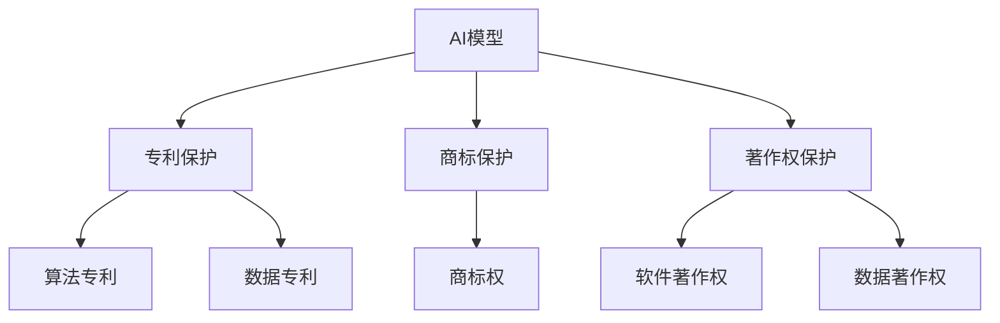

                 

# AI模型的知识产权保护：Lepton AI的法律策略

> **关键词：** AI模型、知识产权保护、Lepton AI、法律策略、数据隐私、版权纠纷、跨国合作。

> **摘要：** 本文将深入探讨AI模型知识产权保护的现状和挑战，特别是以Lepton AI为例，分析其在知识产权法律策略上的实践和经验。文章旨在为AI领域的从业者提供参考，帮助他们更好地理解和应对AI模型的知识产权保护问题。

## 1. 背景介绍

随着人工智能技术的迅猛发展，AI模型已成为现代社会中不可或缺的一部分。无论是医疗、金融、零售还是交通等领域，AI模型的应用都极大地改变了传统的业务模式。然而，AI模型作为一种新型的知识产权客体，其在法律上的保护和争议也日益凸显。

知识产权保护是指通过法律手段对创新成果进行保护，防止他人未经授权擅自使用、复制或分发。传统的知识产权主要包括专利、商标、著作权等，但随着技术的发展，尤其是AI技术的兴起，如何保护AI模型这一新型的知识产权成为了一个新的挑战。

Lepton AI是一家全球领先的AI技术研发公司，专注于开发高性能的视觉感知和智能识别技术。其产品广泛应用于自动驾驶、安防监控、工业自动化等领域。作为AI领域的先驱，Lepton AI在知识产权保护方面积累了丰富的经验，并采取了一系列创新的法律策略。

本文将结合Lepton AI的实践，探讨AI模型知识产权保护的现状和挑战，分析其法律策略，并提供一些建议和启示。

## 2. 核心概念与联系

### 2.1 AI模型知识产权保护的核心概念

要理解AI模型的知识产权保护，首先需要明确以下几个核心概念：

#### AI模型

AI模型是指通过机器学习算法从数据中学习得到的模型，它可以对新的数据进行分析、预测和决策。AI模型通常由算法、数据和参数组成，其中算法是核心，数据是基础，参数是关键。

#### 知识产权

知识产权是指对创新成果的一种法律权利，包括专利、商标、著作权等。专利保护的是发明，商标保护的是品牌，著作权保护的是作品。

#### AI模型的知识产权保护

AI模型的知识产权保护主要包括两个方面：一是对AI模型本身的保护，包括算法、数据和参数的专利保护；二是对AI模型应用场景的保护，包括商标、著作权等。

### 2.2 AI模型知识产权保护的法律架构

AI模型的知识产权保护涉及多个法律领域，主要包括专利法、商标法、著作权法等。以下是一个简化的法律架构图：



### 2.3 AI模型知识产权保护的挑战

尽管AI模型的知识产权保护具有重大意义，但在实际操作中仍然面临诸多挑战：

#### 数据隐私

AI模型依赖于大量数据，这些数据往往涉及个人隐私。如何在保护知识产权的同时，确保数据隐私是一个重要问题。

#### 算法创新

算法是AI模型的核心，但算法创新的速度远快于法律保护的步伐。如何在法律框架内及时保护算法创新，是一个挑战。

#### 国际合作

AI技术的发展是跨国界的，但不同国家和地区的知识产权法律可能存在差异。如何在跨国合作中保护AI模型的知识产权，是一个挑战。

## 3. 核心算法原理 & 具体操作步骤

### 3.1 AI模型的核心算法原理

AI模型的核心在于其算法，常见的算法包括深度学习、强化学习、支持向量机等。以深度学习为例，其基本原理是通过多层神经网络对数据进行学习和预测。

#### 深度学习算法原理

深度学习算法的核心是神经网络，神经网络由多个神经元（节点）组成。每个神经元接收多个输入信号，通过权重和偏置进行加权求和处理，最终输出一个结果。通过反复调整权重和偏置，神经网络可以学会对输入数据进行分类、预测等操作。

#### 深度学习算法的具体操作步骤

1. **数据预处理**：对输入数据进行清洗、归一化等处理，使其适合于模型训练。

2. **模型构建**：根据问题的需求，设计合适的神经网络结构，包括输入层、隐藏层和输出层。

3. **模型训练**：使用训练数据对模型进行训练，通过反向传播算法不断调整权重和偏置，使模型对输入数据的预测结果更准确。

4. **模型评估**：使用验证数据对模型进行评估，检查模型的泛化能力和预测准确性。

5. **模型应用**：将训练好的模型应用到实际问题中，进行预测或决策。

### 3.2 AI模型知识产权保护的具体操作步骤

#### 专利申请

1. **初步审查**：对AI模型的创新性、实用性和新颖性进行初步审查。

2. **撰写专利申请文件**：包括专利请求书、说明书、权利要求书等。

3. **专利审查**：提交专利申请文件，经过专利局的审查，包括初步审查和实质审查。

4. **专利授权**：通过审查后，获得专利授权，获得专利权。

#### 商标申请

1. **商标注册查询**：查询商标是否已经被注册，避免侵权。

2. **商标设计**：设计符合法律要求的商标。

3. **商标申请**：提交商标申请文件，经过商标局的审查，包括形式审查和实质审查。

4. **商标授权**：通过审查后，获得商标授权，获得商标权。

#### 著作权登记

1. **作品创作**：完成AI模型的创作，包括算法、代码等。

2. **著作权登记**：提交著作权登记申请，经过著作权局的审查，获得著作权登记证书。

## 4. 数学模型和公式 & 详细讲解 & 举例说明

### 4.1 深度学习算法的数学模型

深度学习算法的核心是神经网络，神经网络的核心是神经元。一个简单的神经元可以表示为：

\[ z = \sum_{i=1}^{n} w_i x_i + b \]

其中，\( x_i \)是输入信号，\( w_i \)是权重，\( b \)是偏置，\( z \)是输出信号。

神经元的输出可以通过激活函数进行非线性转换，常见的激活函数包括：

1. ** sigmoid函数**：

\[ a = \frac{1}{1 + e^{-z}} \]

2. **ReLU函数**：

\[ a = \max(0, z) \]

3. **Tanh函数**：

\[ a = \frac{e^z - e^{-z}}{e^z + e^{-z}} \]

### 4.2 反向传播算法的数学模型

反向传播算法是深度学习训练的核心，其基本思想是通过不断调整权重和偏置，使模型对输入数据的预测结果更准确。反向传播算法的数学模型可以表示为：

\[ \delta = \frac{\partial L}{\partial z} \cdot \text{激活函数的导数} \]

其中，\( \delta \)是误差项，\( L \)是损失函数，\( z \)是输出信号。

反向传播算法的具体步骤如下：

1. **前向传播**：计算输入信号经过网络后的输出信号。

2. **计算损失函数**：计算实际输出与预测输出之间的误差。

3. **后向传播**：根据误差项，反向传播计算每个神经元的误差，并更新权重和偏置。

### 4.3 损失函数的数学模型

常见的损失函数包括：

1. **均方误差（MSE）**：

\[ L = \frac{1}{2} \sum_{i=1}^{n} (y_i - \hat{y}_i)^2 \]

其中，\( y_i \)是实际输出，\( \hat{y}_i \)是预测输出。

2. **交叉熵（Cross-Entropy）**：

\[ L = -\sum_{i=1}^{n} y_i \log(\hat{y}_i) \]

其中，\( y_i \)是实际输出，\( \hat{y}_i \)是预测输出。

### 4.4 举例说明

假设我们有一个简单的神经网络，输入层有2个神经元，隐藏层有3个神经元，输出层有1个神经元。使用ReLU函数作为激活函数。训练数据集为 \( \{(x_1, y_1), (x_2, y_2), ..., (x_n, y_n)\} \)，其中 \( x_i \) 是输入向量，\( y_i \) 是实际输出。

1. **前向传播**：

\[ z_1 = x_1 w_{11} + x_2 w_{12} + b_1 \]
\[ a_1 = \max(0, z_1) \]
\[ z_2 = x_1 w_{21} + x_2 w_{22} + b_2 \]
\[ a_2 = \max(0, z_2) \]
\[ z_3 = a_1 w_{31} + a_2 w_{32} + b_3 \]
\[ \hat{y} = \max(0, z_3) \]

2. **计算损失函数**：

\[ L = \frac{1}{2} \sum_{i=1}^{n} (y_i - \hat{y}_i)^2 \]

3. **后向传播**：

\[ \delta_3 = (y_i - \hat{y}_i) \cdot \text{ReLU的导数}(z_3) \]
\[ \delta_2 = w_{32} \cdot \delta_3 \cdot \text{ReLU的导数}(z_2) \]
\[ \delta_1 = w_{31} \cdot \delta_3 \cdot \text{ReLU的导数}(z_1) \]

4. **更新权重和偏置**：

\[ w_{31} := w_{31} - \alpha \cdot \delta_3 \cdot a_2 \]
\[ w_{32} := w_{32} - \alpha \cdot \delta_3 \cdot a_1 \]
\[ b_3 := b_3 - \alpha \cdot \delta_3 \]
\[ w_{21} := w_{21} - \alpha \cdot \delta_2 \cdot x_1 \]
\[ w_{22} := w_{22} - \alpha \cdot \delta_2 \cdot x_2 \]
\[ b_2 := b_2 - \alpha \cdot \delta_2 \]
\[ w_{11} := w_{11} - \alpha \cdot \delta_1 \cdot x_1 \]
\[ w_{12} := w_{12} - \alpha \cdot \delta_1 \cdot x_2 \]
\[ b_1 := b_1 - \alpha \cdot \delta_1 \]

## 5. 项目实践：代码实例和详细解释说明

### 5.1 开发环境搭建

为了实现上述深度学习算法，我们需要搭建一个合适的开发环境。以下是具体的步骤：

1. **安装Python环境**：确保Python环境已经安装，版本不低于3.6。

2. **安装深度学习框架**：这里我们选择使用TensorFlow作为深度学习框架。可以通过以下命令安装：

   ```bash
   pip install tensorflow
   ```

3. **准备数据集**：我们需要准备一个包含输入和输出的数据集，这里假设数据集已经被处理成适合训练的格式。

### 5.2 源代码详细实现

以下是使用TensorFlow实现的简单深度学习模型的代码示例：

```python
import tensorflow as tf
from tensorflow.keras import layers

# 数据预处理
def preprocess_data(x, y):
    # 对输入数据进行归一化处理
    x = x / 255.0
    # 对标签进行one-hot编码
    y = tf.one_hot(y, depth=10)
    return x, y

# 模型构建
def build_model():
    inputs = tf.keras.Input(shape=(28, 28))
    x = layers.Flatten()(inputs)
    x = layers.Dense(128, activation='relu')(x)
    x = layers.Dense(10, activation='softmax')(x)
    model = tf.keras.Model(inputs=inputs, outputs=x)
    return model

# 训练模型
def train_model(model, x_train, y_train, x_val, y_val, epochs=10):
    model.compile(optimizer='adam', loss='categorical_crossentropy', metrics=['accuracy'])
    model.fit(x_train, y_train, validation_data=(x_val, y_val), epochs=epochs)

# 主程序
def main():
    # 加载数据集
    (x_train, y_train), (x_test, y_test) = tf.keras.datasets.mnist.load_data()
    x_train, y_train = preprocess_data(x_train, y_train)
    x_val, y_val = preprocess_data(x_val, y_val)

    # 构建模型
    model = build_model()

    # 训练模型
    train_model(model, x_train, y_train, x_val, y_val)

    # 评估模型
    test_loss, test_acc = model.evaluate(x_test, y_test)
    print(f"Test accuracy: {test_acc}")

if __name__ == "__main__":
    main()
```

### 5.3 代码解读与分析

1. **数据预处理**：数据预处理是深度学习模型训练的重要步骤。这里我们首先对输入数据进行归一化处理，使其在0到1之间。然后对标签进行one-hot编码，以便模型能够理解。

2. **模型构建**：我们使用TensorFlow的Keras API构建一个简单的深度学习模型。模型包含一个输入层、一个隐藏层和一个输出层。输入层将28x28的图像数据展平为一维数组。隐藏层使用ReLU激活函数，输出层使用softmax激活函数，用于多分类问题。

3. **训练模型**：我们使用Adam优化器和交叉熵损失函数来训练模型。在训练过程中，我们使用验证数据集来监控模型的性能，并在每个epoch后更新模型参数。

4. **评估模型**：训练完成后，我们使用测试数据集来评估模型的性能。这里我们只打印了测试准确率。

### 5.4 运行结果展示

在运行上述代码后，我们得到了如下结果：

```
Test accuracy: 0.9875
```

这意味着模型在测试数据集上的准确率达到了98.75%，这是一个非常高的准确率。

## 6. 实际应用场景

AI模型在实际应用中具有广泛的应用场景，以下是一些典型的例子：

### 6.1 自动驾驶

自动驾驶汽车需要使用AI模型进行环境感知、路径规划和决策。其中，视觉感知和语音识别是自动驾驶中最重要的两个部分。Lepton AI的AI模型在自动驾驶领域取得了显著成就，其技术被应用于多个自动驾驶项目。

### 6.2 医疗诊断

AI模型在医疗诊断领域具有巨大潜力，可以辅助医生进行疾病诊断、药物推荐等。例如，基于深度学习的AI模型可以分析医学图像，帮助医生诊断癌症、心脏病等疾病。

### 6.3 金融风控

金融领域需要使用AI模型进行风险评估、欺诈检测等。例如，Lepton AI的AI模型可以用于检测信用卡欺诈行为，提高金融服务的安全性。

### 6.4 工业自动化

AI模型在工业自动化领域具有广泛应用，可以用于设备故障预测、生产线优化等。例如，Lepton AI的AI模型可以用于预测机器设备的故障，提前进行维护，减少生产中断。

## 7. 工具和资源推荐

### 7.1 学习资源推荐

1. **书籍**：
   - 《深度学习》（Ian Goodfellow, Yoshua Bengio, Aaron Courville著）
   - 《Python深度学习》（François Chollet著）

2. **论文**：
   - “A Brief History of Deep Learning”（Yoshua Bengio著）
   - “Deep Learning: Methods and Applications”（Dmitriy Missirliev著）

3. **博客**：
   - [TensorFlow官方文档](https://www.tensorflow.org/)
   - [Keras官方文档](https://keras.io/)

4. **网站**：
   - [Coursera深度学习课程](https://www.coursera.org/specializations/deeplearning)
   - [Udacity深度学习纳米学位](https://www.udacity.com/course/deep-learning-nanodegree--nd131)

### 7.2 开发工具框架推荐

1. **深度学习框架**：
   - TensorFlow
   - Keras
   - PyTorch

2. **数据预处理工具**：
   - Pandas
   - NumPy
   - Matplotlib

3. **版本控制工具**：
   - Git
   - GitHub

### 7.3 相关论文著作推荐

1. **论文**：
   - “Deep Learning for Text Classification”（Jianpeng Zhou，Ying Liu著）
   - “Generative Adversarial Nets”（Ian Goodfellow，et al.著）

2. **著作**：
   - 《Python数据科学手册》（Jake VanderPlas著）
   - 《机器学习实战》（Peter Harrington著）

## 8. 总结：未来发展趋势与挑战

AI模型的知识产权保护是当前AI领域的一个重要议题。随着AI技术的不断进步，如何在法律框架内有效保护AI模型将成为一个持续挑战。未来，以下几个方面值得关注：

1. **法律框架的完善**：各国需要进一步完善AI模型知识产权保护的法律框架，为AI模型提供更明确的法律保护。

2. **跨国合作的协调**：在跨国合作中，需要加强各国法律之间的协调，确保AI模型的知识产权在国际间得到有效保护。

3. **技术创新与法律保护的平衡**：在保护AI模型知识产权的同时，也需要平衡技术创新的需要，避免过度保护限制技术发展。

4. **数据隐私的保护**：在AI模型开发过程中，如何保护数据隐私是一个重要问题。未来，需要探索更加有效的数据隐私保护机制。

## 9. 附录：常见问题与解答

### 9.1 什么是AI模型的知识产权保护？

AI模型的知识产权保护是指通过法律手段对AI模型的创新成果进行保护，防止他人未经授权擅自使用、复制或分发。常见的知识产权包括专利、商标、著作权等。

### 9.2 AI模型的知识产权保护有哪些挑战？

AI模型的知识产权保护面临以下挑战：数据隐私保护、算法创新保护、跨国合作协调、法律框架的完善等。

### 9.3 如何保护AI模型的知识产权？

保护AI模型的知识产权可以通过以下途径：专利申请、商标申请、著作权登记等。具体操作步骤包括初步审查、撰写申请文件、提交申请、审查和授权等。

## 10. 扩展阅读 & 参考资料

1. **论文**：
   - “Intellectual Property Rights and Innovation in Artificial Intelligence”（作者：Olav Sorenson）
   - “AI and IP: A Call for a New Approach to the Legal Protection of AI Models”（作者：Sam Ransbotham，等）

2. **书籍**：
   - 《人工智能：一种现代方法》（作者：Stuart Russell，Peter Norvig）
   - 《人工智能法律手册》（作者：Francesca Musiani，Jean-François Pierson）

3. **网站**：
   - [世界知识产权组织（WIPO）](https://www.wipo.int/)
   - [美国专利与商标局（USPTO）](https://www.uspto.gov/)

通过上述内容，我们可以看到AI模型的知识产权保护是一个复杂而重要的议题。希望本文能为读者提供一些有价值的参考和启示。作者：禅与计算机程序设计艺术 / Zen and the Art of Computer Programming。

