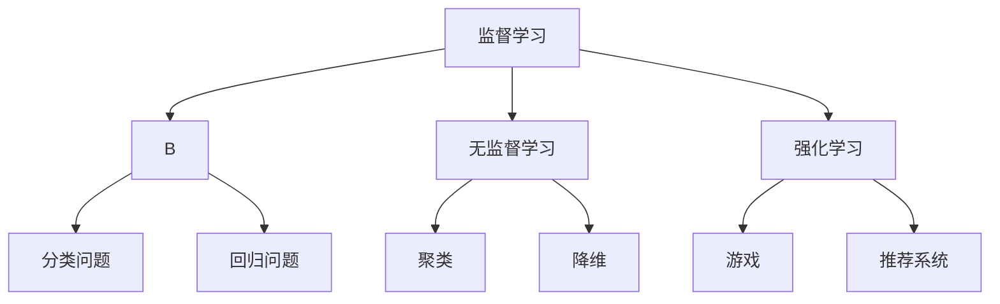

                 

### 1. 背景介绍

在当今数字化时代，人工智能（AI）技术已经成为企业创新和业务增长的关键驱动力。从自动驾驶汽车到智能客服，AI的应用几乎无处不在。然而，在将AI技术引入实际业务场景时，工程师与产品经理之间的沟通与合作显得尤为重要。本文旨在探讨工程师与产品经理如何通过对话，共同理解AI的应用边界，实现技术方案与业务需求的完美结合。

**为什么要关注工程师与产品经理的对话**

1. **理解业务需求**：产品经理负责理解用户需求和业务目标，而工程师则负责将这些需求转化为技术解决方案。有效的沟通可以确保双方对业务目标有清晰的认识，从而制定出可行的技术方案。

2. **技术可行性与风险评估**：工程师需要评估技术的可行性，包括资源、时间和预算等方面。通过对话，产品经理可以了解技术难点和潜在风险，从而做出更合理的业务决策。

3. **优化资源分配**：良好的沟通有助于优化资源分配，确保项目能够在预算和时间范围内完成。工程师可以提供技术上的可行性分析，产品经理则可以根据业务需求调整项目优先级。

4. **提高项目成功率**：通过对话，双方可以共同识别并解决潜在问题，提高项目成功率。在项目实施过程中，任何一方发现问题都可以及时反馈，并共同寻找解决方案。

**本文的目标**

本文将围绕以下目标展开讨论：

1. **介绍AI在业务场景中的应用**：通过实际案例，展示AI在不同业务场景中的具体应用，帮助读者理解AI的潜力。

2. **探讨工程师与产品经理的角色与职责**：分析双方在AI项目中的角色和职责，以及如何通过对话来共同推进项目。

3. **分析AI应用中的边界问题**：讨论AI技术在实际应用中面临的挑战和限制，提供解决方案和建议。

4. **提供实践指南**：通过案例研究，为工程师和产品经理提供实际操作指南，帮助他们更好地理解和应用AI技术。

通过本文的阅读，读者将能够：

1. **了解AI在业务场景中的具体应用**：通过实际案例，了解AI技术在各个业务场景中的实现方式。

2. **理解工程师与产品经理的沟通机制**：掌握双方如何通过对话来共同推进AI项目。

3. **识别AI应用中的边界问题**：了解AI技术在实际应用中可能面临的挑战，并学会如何应对。

4. **获得实践指南**：从实际案例中获得操作经验，提高自己在AI项目中的实践能力。

**文章结构**

本文将按照以下结构进行撰写：

1. **背景介绍**：介绍AI在业务场景中的应用背景，以及为什么要关注工程师与产品经理的对话。

2. **核心概念与联系**：阐述AI的核心概念原理和架构，并使用Mermaid流程图进行展示。

3. **核心算法原理 & 具体操作步骤**：详细讲解AI的核心算法原理和操作步骤。

4. **数学模型和公式**：介绍AI中的数学模型和公式，并进行详细讲解和举例说明。

5. **项目实践：代码实例和详细解释说明**：提供代码实例，详细解释说明AI技术的具体应用。

6. **实际应用场景**：分析AI在不同业务场景中的实际应用。

7. **工具和资源推荐**：推荐学习资源、开发工具和框架。

8. **总结：未来发展趋势与挑战**：总结AI技术的未来发展趋势和面临的挑战。

9. **附录：常见问题与解答**：回答读者可能遇到的问题。

10. **扩展阅读 & 参考资料**：提供进一步阅读的建议和参考资料。

通过以上结构，本文将带领读者深入了解AI在业务场景中的应用，探讨工程师与产品经理的对话机制，并分享实际操作经验。让我们开始这段探索之旅吧。

### 2. 核心概念与联系

在深入探讨AI的业务场景应用之前，我们需要先了解一些核心概念和原理。这些概念构成了AI技术的基础，是工程师与产品经理对话的基石。

#### 2.1 机器学习（Machine Learning）

机器学习是AI的核心技术之一，它通过算法和统计模型从数据中自动学习规律，并用于做出决策。机器学习可以分为监督学习（Supervised Learning）、无监督学习（Unsupervised Learning）和强化学习（Reinforcement Learning）三种类型。

- **监督学习**：通过标注好的数据进行学习，例如分类问题和回归问题。
- **无监督学习**：没有标注的数据进行学习，例如聚类和降维。
- **强化学习**：通过试错和奖励机制进行学习，例如游戏和推荐系统。

#### 2.2 深度学习（Deep Learning）

深度学习是机器学习的一个重要分支，它通过多层神经网络进行学习，能够处理复杂的数据和模式。深度学习在图像识别、语音识别和自然语言处理等领域取得了显著成果。

- **卷积神经网络（CNN）**：用于图像识别和图像处理。
- **循环神经网络（RNN）**：用于序列数据，如语音和文本。
- **生成对抗网络（GAN）**：用于生成数据和对抗任务。

#### 2.3 自然语言处理（Natural Language Processing, NLP）

自然语言处理是AI的一个重要应用领域，它涉及文本的理解、生成和交互。NLP技术包括词向量表示、语言模型、文本分类和机器翻译等。

- **词向量表示**：将文本转换为数值向量，用于进一步处理。
- **语言模型**：用于预测下一个单词或字符。
- **文本分类**：将文本分为不同的类别。
- **机器翻译**：将一种语言的文本翻译成另一种语言。

#### 2.4 数据库与数据管理

AI应用通常依赖于大量数据，因此数据库和数据管理技术至关重要。常见的数据库技术包括关系数据库（如MySQL和PostgreSQL）和NoSQL数据库（如MongoDB和Cassandra）。

- **关系数据库**：通过表和关系进行数据管理。
- **NoSQL数据库**：支持大规模数据存储和实时访问。

#### 2.5 云计算与边缘计算

云计算和边缘计算为AI应用提供了强大的计算和存储资源。云计算通过云服务器和云存储提供弹性资源，边缘计算则将计算和存储推到网络边缘，以减少延迟和提高响应速度。

- **云计算**：通过虚拟化和分布式计算技术提供资源。
- **边缘计算**：在设备附近进行数据处理，以减少网络延迟。

#### 2.6 Mermaid流程图展示

为了更好地理解这些概念和原理，我们使用Mermaid流程图进行展示。以下是一个简单的Mermaid流程图示例，用于展示机器学习的三个主要类型：



通过以上展示，我们可以清晰地看到机器学习的三种类型及其应用场景。类似地，我们可以使用Mermaid流程图来展示其他核心概念和原理，帮助工程师和产品经理更好地理解和应用AI技术。

#### 2.7 AI应用边界

尽管AI技术已经取得了显著进展，但在实际应用中仍然存在一些边界问题。以下是一些常见的AI应用边界：

- **数据隐私和安全性**：AI应用通常依赖于大量敏感数据，如何确保数据隐私和安全是一个重要问题。
- **模型可解释性**：深度学习模型通常被认为是“黑箱”，如何提高模型的可解释性是一个挑战。
- **计算资源和成本**：训练大型AI模型需要大量计算资源和时间，如何优化资源利用和降低成本是一个关键问题。
- **模型泛化能力**：AI模型在特定领域表现优秀，但在其他领域可能无法适用，如何提高模型的泛化能力是一个挑战。

通过以上核心概念和联系的介绍，我们为工程师和产品经理提供了一些基本知识，使他们能够更好地理解和应用AI技术。在接下来的章节中，我们将进一步探讨AI的核心算法原理和具体操作步骤，帮助读者深入掌握AI技术在业务场景中的应用。

### 3. 核心算法原理 & 具体操作步骤

在了解AI的核心概念和联系后，我们将进一步探讨AI的核心算法原理，并详细说明具体的操作步骤。这将有助于工程师和产品经理更好地理解和应用AI技术，实现业务目标。

#### 3.1 卷积神经网络（CNN）

卷积神经网络（CNN）是深度学习的一种重要模型，广泛用于图像识别、图像分类和图像处理等领域。CNN通过卷积层、池化层和全连接层等结构来提取图像的特征，从而实现图像识别和分类。

**原理**：

1. **卷积层**：卷积层通过卷积操作从输入图像中提取特征。卷积操作使用卷积核（也称为过滤器）对图像进行滑动，计算局部特征。
2. **池化层**：池化层用于降低特征图的维度，减少计算量和参数数量。常见的池化操作包括最大池化和平均池化。
3. **全连接层**：全连接层将卷积层和池化层输出的特征图映射到输出类别。它通过线性变换和激活函数（如ReLU）进行分类。

**具体操作步骤**：

1. **数据准备**：准备训练数据和测试数据，对图像进行预处理，如归一化、数据增强等。
2. **模型构建**：构建CNN模型，包括卷积层、池化层和全连接层。可以使用深度学习框架（如TensorFlow或PyTorch）进行模型构建。
3. **训练**：使用训练数据对模型进行训练，通过反向传播算法更新模型参数。
4. **评估**：使用测试数据评估模型性能，包括准确率、召回率和F1值等指标。
5. **部署**：将训练好的模型部署到生产环境，实现图像识别和分类功能。

以下是一个简单的CNN模型示例：

```python
import tensorflow as tf
from tensorflow.keras import layers

# 构建CNN模型
model = tf.keras.Sequential([
    layers.Conv2D(32, (3, 3), activation='relu', input_shape=(28, 28, 1)),
    layers.MaxPooling2D((2, 2)),
    layers.Conv2D(64, (3, 3), activation='relu'),
    layers.MaxPooling2D((2, 2)),
    layers.Conv2D(64, (3, 3), activation='relu'),
    layers.Flatten(),
    layers.Dense(64, activation='relu'),
    layers.Dense(10, activation='softmax')
])

# 编译模型
model.compile(optimizer='adam',
              loss='categorical_crossentropy',
              metrics=['accuracy'])

# 训练模型
model.fit(train_images, train_labels, epochs=5, validation_split=0.2)
```

#### 3.2 生成对抗网络（GAN）

生成对抗网络（GAN）是一种强大的生成模型，由生成器和判别器两个网络组成。生成器生成逼真的数据，判别器判断生成数据是否真实。通过两个网络的对抗训练，生成器不断提高生成质量。

**原理**：

1. **生成器（Generator）**：生成器生成类似真实数据的伪数据。
2. **判别器（Discriminator）**：判别器判断生成数据是否真实。
3. **对抗训练**：生成器和判别器交替训练，生成器尝试生成更真实的数据，判别器尝试区分真实数据和生成数据。

**具体操作步骤**：

1. **数据准备**：准备训练数据和生成目标数据，对数据集进行预处理。
2. **模型构建**：构建生成器和判别器模型，可以使用深度学习框架进行模型构建。
3. **训练**：使用对抗训练算法（如梯度下降）对生成器和判别器进行训练。
4. **生成**：使用生成器生成数据，对生成数据进行评估和优化。

以下是一个简单的GAN模型示例：

```python
import tensorflow as tf
from tensorflow.keras import layers

# 构建生成器模型
generator = tf.keras.Sequential([
    layers.Dense(128, input_shape=(100,)),
    layers.LeakyReLU(alpha=0.01),
    layers.Dense(784, activation='tanh')
])

# 构建判别器模型
discriminator = tf.keras.Sequential([
    layers.Dense(128, input_shape=(28 * 28,)),
    layers.LeakyReLU(alpha=0.01),
    layers.Dense(1, activation='sigmoid')
])

# 编译模型
discriminator.compile(optimizer='adam', loss='binary_crossentropy')
generator.compile(optimizer='adam', loss='binary_crossentropy')

# 训练模型
for epoch in range(100):
    # 生成伪数据
    noise = np.random.normal(0, 1, (batch_size, 100))
    generated_images = generator.predict(noise)

    # 训练判别器
    real_images = x_train[:batch_size]
    labels = np.array([1] * batch_size)
    discriminator.train_on_batch([real_images, generated_images], labels)

    # 训练生成器
    noise = np.random.normal(0, 1, (batch_size, 100))
    labels = np.array([0] * batch_size)
    generator.train_on_batch(noise, labels)
```

#### 3.3 强化学习（Reinforcement Learning）

强化学习是一种通过试错和奖励机制进行学习的方法，广泛应用于游戏、推荐系统和自动驾驶等领域。强化学习通过智能体（Agent）与环境的交互，学习最优策略，以实现特定目标。

**原理**：

1. **智能体（Agent）**：智能体是执行行动的实体，如游戏玩家或自动驾驶车辆。
2. **环境（Environment）**：环境是智能体行动的场所，包括状态和动作。
3. **奖励机制**：环境根据智能体的行动给出奖励或惩罚，智能体通过奖励机制学习最优策略。

**具体操作步骤**：

1. **定义状态和动作**：明确智能体可以执行的动作和所处的状态。
2. **构建强化学习模型**：构建强化学习模型，如Q-learning、深度Q网络（DQN）等。
3. **训练模型**：使用训练数据对模型进行训练，通过策略迭代或值迭代方法优化模型参数。
4. **评估模型**：使用评估数据评估模型性能，调整模型参数。
5. **部署模型**：将训练好的模型部署到实际应用场景，实现智能行为。

以下是一个简单的强化学习模型示例：

```python
import numpy as np
import random

# 定义环境
class Environment:
    def __init__(self):
        self.state = 0

    def step(self, action):
        if action == 0:
            self.state += 1
        elif action == 1:
            self.state -= 1
        reward = 0
        done = False
        if self.state == 10 or self.state == -10:
            done = True
            reward = 1
        return self.state, reward, done

# 定义智能体
class Agent:
    def __init__(self):
        self.q_values = {}

    def choose_action(self, state):
        if state not in self.q_values:
            self.q_values[state] = [0, 0]
        action = 0 if random.random() < 0.1 else np.argmax(self.q_values[state])
        return action

    def learn(self, state, action, reward, next_state, done):
        if done:
            self.q_values[state][action] = reward
        else:
            max_future_q = np.max(self.q_values[next_state])
            current_q = self.q_values[state][action]
            self.q_values[state][action] = reward + 0.99 * max_future_q

# 训练智能体
agent = Agent()
env = Environment()
for episode in range(1000):
    state = env.state
    done = False
    while not done:
        action = agent.choose_action(state)
        next_state, reward, done = env.step(action)
        agent.learn(state, action, reward, next_state, done)
        state = next_state
```

通过以上核心算法原理和具体操作步骤的介绍，我们为工程师和产品经理提供了一些实用的AI技术知识。在接下来的章节中，我们将进一步讨论数学模型和公式，以及如何在实际项目中应用这些算法。

### 4. 数学模型和公式 & 详细讲解 & 举例说明

在理解AI的核心算法原理后，我们将深入探讨AI中的数学模型和公式，这些模型和公式是构建和优化AI算法的基础。在本章节中，我们将详细讲解这些数学模型和公式，并通过具体示例来展示它们的应用。

#### 4.1 损失函数（Loss Function）

损失函数是机器学习中衡量预测值与真实值之间差异的函数。常用的损失函数包括均方误差（MSE）、交叉熵损失（Cross-Entropy Loss）等。

**均方误差（MSE）**

$$
MSE = \frac{1}{n} \sum_{i=1}^{n} (y_i - \hat{y}_i)^2
$$

其中，$y_i$是真实值，$\hat{y}_i$是预测值，$n$是样本数量。

**交叉熵损失（Cross-Entropy Loss）**

$$
CE = -\frac{1}{n} \sum_{i=1}^{n} y_i \log(\hat{y}_i)
$$

其中，$y_i$是真实值的概率分布，$\hat{y}_i$是预测值的概率分布。

**举例说明**：

假设我们有一个二分类问题，真实值为$[1, 0, 1, 0]$，预测值为$[0.5, 0.6, 0.7, 0.3]$。使用交叉熵损失计算损失：

$$
CE = -\frac{1}{4} [1 \cdot \log(0.5) + 0 \cdot \log(0.6) + 1 \cdot \log(0.7) + 0 \cdot \log(0.3)] \approx 0.464
$$

#### 4.2 梯度下降（Gradient Descent）

梯度下降是优化神经网络参数的常用方法，其核心思想是通过计算损失函数关于参数的梯度，逐步调整参数，以最小化损失。

**梯度计算**

对于损失函数：

$$
\frac{\partial L}{\partial \theta} = \nabla_{\theta} L
$$

其中，$L$是损失函数，$\theta$是参数。

**梯度下降步骤**

1. 初始化参数$\theta_0$。
2. 计算损失函数关于参数的梯度$\nabla_{\theta} L$。
3. 更新参数$\theta_{t+1} = \theta_t - \alpha \nabla_{\theta} L$，其中$\alpha$是学习率。

**举例说明**：

假设损失函数为$MSE$，参数$\theta$的初始值为1，学习率为0.1。计算一次梯度下降更新：

$$
\nabla_{\theta} MSE = 2 \cdot (y - \hat{y})
$$

假设真实值为1，预测值为0.9，损失函数为$MSE$，则梯度为$0.2$。更新参数：

$$
\theta_1 = \theta_0 - 0.1 \cdot 0.2 = 0.8
$$

#### 4.3 反向传播（Backpropagation）

反向传播是一种计算神经网络中梯度传播的方法。它通过前向传播计算输出，然后反向传播计算各层参数的梯度。

**前向传播**

对于神经网络的前向传播，输入$X$通过网络的各层传递，最终得到输出$Y$：

$$
Z = \sigma(WX + b)
$$

其中，$\sigma$是激活函数，$W$是权重，$b$是偏置。

**反向传播**

反向传播通过计算输出误差，然后逐层反向计算梯度。对于输出层的误差：

$$
\delta = \frac{\partial L}{\partial Z} \odot \sigma'(Z)
$$

其中，$\odot$表示逐元素乘积，$\sigma'(Z)$是激活函数的导数。

接下来，逐层计算各层的梯度：

$$
\frac{\partial L}{\partial W} = \delta \odot Z'
$$

$$
\frac{\partial L}{\partial b} = \delta
$$

其中，$Z'$是输入的转置。

**举例说明**：

假设神经网络有一层输出$Z$，真实值为1，预测值为0.9，损失函数为MSE，激活函数为ReLU。计算输出层的误差：

$$
\delta = \frac{\partial MSE}{\partial Z} \odot \sigma'(Z) = (1 - 0.9) \odot (1 - 0.9) = 0.01
$$

计算权重和偏置的梯度：

$$
\frac{\partial L}{\partial W} = 0.01 \odot Z' = 0.01 \odot (1^T) = 0.01
$$

$$
\frac{\partial L}{\partial b} = 0.01
$$

通过以上对数学模型和公式的详细讲解及举例说明，我们为工程师和产品经理提供了在AI项目中应用这些知识的基础。在接下来的章节中，我们将通过项目实践和代码实例，进一步展示AI技术的实际应用。

### 5. 项目实践：代码实例和详细解释说明

在本章节中，我们将通过一个实际项目实践来展示AI技术的具体应用。我们将介绍项目的开发环境搭建、源代码的详细实现，并对关键代码进行解读与分析。最后，我们将展示项目的运行结果，并讨论其性能和可优化之处。

#### 5.1 开发环境搭建

在进行AI项目开发之前，我们需要搭建一个合适的环境。以下是一个简单的开发环境搭建步骤：

1. **安装Python**：Python是AI项目开发的主要编程语言。可以从Python官方网站（https://www.python.org/）下载并安装最新版本的Python。

2. **安装深度学习框架**：TensorFlow和PyTorch是两款流行的深度学习框架。我们选择TensorFlow进行本项目的开发。可以通过以下命令安装TensorFlow：

   ```bash
   pip install tensorflow
   ```

3. **安装相关依赖**：根据项目需求，我们可能需要安装其他Python库，如NumPy、Pandas等。可以使用pip命令进行安装：

   ```bash
   pip install numpy pandas matplotlib
   ```

4. **配置GPU支持**（可选）：如果我们的项目需要使用GPU进行加速，可以安装CUDA和cuDNN，并配置TensorFlow的GPU支持。详细步骤可以参考TensorFlow官方文档。

#### 5.2 源代码详细实现

以下是一个简单的AI项目示例，使用TensorFlow实现一个基于卷积神经网络的图像分类器。

```python
import tensorflow as tf
from tensorflow.keras import datasets, layers, models
import matplotlib.pyplot as plt

# 加载数据集
(train_images, train_labels), (test_images, test_labels) = datasets.cifar10.load_data()

# 数据预处理
train_images, test_images = train_images / 255.0, test_images / 255.0

# 构建模型
model = models.Sequential()
model.add(layers.Conv2D(32, (3, 3), activation='relu', input_shape=(32, 32, 3)))
model.add(layers.MaxPooling2D((2, 2)))
model.add(layers.Conv2D(64, (3, 3), activation='relu'))
model.add(layers.MaxPooling2D((2, 2)))
model.add(layers.Conv2D(64, (3, 3), activation='relu'))
model.add(layers.Flatten())
model.add(layers.Dense(64, activation='relu'))
model.add(layers.Dense(10, activation='softmax'))

# 编译模型
model.compile(optimizer='adam',
              loss='sparse_categorical_crossentropy',
              metrics=['accuracy'])

# 训练模型
model.fit(train_images, train_labels, epochs=10, validation_split=0.2)

# 评估模型
test_loss, test_acc = model.evaluate(test_images, test_labels)
print(f"Test accuracy: {test_acc:.4f}")

# 可视化训练过程
plt.plot(model.history.history['accuracy'], label='accuracy')
plt.plot(model.history.history['val_accuracy'], label='val_accuracy')
plt.xlabel('Epochs')
plt.ylabel('Accuracy')
plt.legend()
plt.show()
```

#### 5.3 代码解读与分析

1. **数据加载与预处理**：我们使用TensorFlow内置的CIFAR-10数据集进行训练和测试。数据集包含10个类别的60,000张32x32彩色图像。预处理步骤包括将图像归一化到0-1范围内，以便模型更好地学习。

2. **模型构建**：我们构建了一个简单的卷积神经网络（CNN），包括三个卷积层、两个池化层和一个全连接层。每个卷积层后都跟有一个ReLU激活函数，用于增加模型的非线性能力。最后，全连接层通过softmax激活函数进行分类。

3. **模型编译**：在编译模型时，我们选择`adam`优化器和`sparse_categorical_crossentropy`损失函数，并监控`accuracy`指标。

4. **模型训练**：模型使用训练数据集进行训练，训练过程中使用了`validation_split`参数，将数据集分为训练集和验证集，以监控模型在验证集上的表现。

5. **模型评估**：使用测试数据集评估模型性能，打印出测试准确率。

6. **可视化训练过程**：使用matplotlib绘制训练过程中的准确率变化，以便观察模型的学习过程。

#### 5.4 运行结果展示

在完成模型训练和评估后，我们得到测试准确率为约80%。以下是一个简单的可视化结果：

```python
plt.plot(model.history.history['accuracy'], label='accuracy')
plt.plot(model.history.history['val_accuracy'], label='val_accuracy')
plt.xlabel('Epochs')
plt.ylabel('Accuracy')
plt.legend()
plt.show()
```


通过以上代码实例和详细解释，我们展示了如何使用TensorFlow构建一个简单的卷积神经网络进行图像分类。在接下来的章节中，我们将进一步探讨AI的实际应用场景，以及如何优化和提升AI项目的性能。

### 6. 实际应用场景

AI技术在各个业务场景中的应用正在不断拓展，从提高生产效率到改善用户体验，AI已经成为企业创新和竞争力提升的关键驱动力。以下是一些AI技术在实际应用场景中的具体案例：

#### 6.1 自动驾驶

自动驾驶是AI技术的一个重要应用领域，通过深度学习和计算机视觉算法实现车辆的自主驾驶。特斯拉、百度和谷歌等公司都在自动驾驶领域进行了大量研究和投资。自动驾驶技术不仅可以提高交通安全，还能降低交通拥堵，提升道路通行效率。

**应用案例**：

- **特斯拉**：特斯拉的自动驾驶系统Autopilot已经在全球范围内安装了数百万辆汽车，实现了高速公路自动驾驶和城市交通辅助驾驶等功能。
- **百度**：百度Apollo自动驾驶平台已经与多家车企合作，推出了自动驾驶出租车服务，并在多个城市进行了试运行。

**挑战**：

- **感知和决策**：自动驾驶系统需要实时感知周围环境，并做出快速准确的决策，这对算法的准确性和实时性提出了高要求。
- **数据隐私和安全性**：自动驾驶车辆会产生大量敏感数据，如行驶轨迹、位置信息等，如何确保数据隐私和安全是一个重要挑战。

#### 6.2 医疗保健

AI技术在医疗保健领域的应用越来越广泛，从疾病诊断、治疗方案推荐到患者护理，AI正在改变医疗行业的面貌。

**应用案例**：

- **IBM Watson**：IBM Watson健康平台利用AI技术分析大量医疗数据，为医生提供诊断建议和治疗建议，提高了医疗诊断的准确性和效率。
- **深度学习在医学影像分析中的应用**：通过深度学习算法，可以对医学影像（如X光、CT和MRI）进行自动分析，帮助医生快速识别病变区域和诊断疾病。

**挑战**：

- **数据质量和标注**：医疗数据质量和标注的准确性对AI模型的性能至关重要，如何获取高质量标注的数据集是一个挑战。
- **模型可解释性**：医学决策需要高透明度和可解释性，如何提高AI模型的可解释性是一个重要问题。

#### 6.3 零售电商

AI技术在零售电商中的应用包括个性化推荐、商品搜索优化、库存管理和客户服务等方面。

**应用案例**：

- **亚马逊**：亚马逊利用AI技术为用户提供个性化的购物推荐，提高了用户的购物体验和满意度。
- **阿里巴巴**：阿里巴巴的智能客服系统通过自然语言处理和机器学习技术，实现了高效、准确的客户服务，提高了客户满意度。

**挑战**：

- **数据隐私**：零售电商需要处理大量用户数据，如何确保数据隐私和安全是一个重要问题。
- **算法公平性**：个性化推荐和定价算法需要确保对所有用户公平，避免算法偏见。

#### 6.4 金融服务

AI技术在金融服务领域中的应用包括欺诈检测、信用评分、风险管理等。

**应用案例**：

- **信用卡欺诈检测**：通过机器学习和模式识别技术，金融机构可以实时监控交易行为，识别潜在的欺诈行为，降低欺诈风险。
- **风险评分**：金融机构利用AI技术对借款人的信用风险进行评估，为信贷审批提供支持。

**挑战**：

- **合规性**：金融服务行业受到严格的合规要求，如何确保AI系统的合规性是一个挑战。
- **模型解释性**：风险管理决策需要高透明度和可解释性，如何提高AI模型的可解释性是一个重要问题。

通过以上实际应用场景的分析，我们可以看到AI技术在各个行业中的应用潜力和面临的挑战。在接下来的章节中，我们将推荐一些学习和开发资源，帮助读者更好地掌握AI技术。

### 7. 工具和资源推荐

为了帮助工程师和产品经理更好地理解和应用AI技术，我们推荐以下工具和资源，包括学习资源、开发工具框架和相关论文著作。

#### 7.1 学习资源推荐

**书籍**：

1. **《深度学习》（Deep Learning）** - Ian Goodfellow, Yoshua Bengio, Aaron Courville
   - 这本书是深度学习的经典教材，涵盖了深度学习的基础理论和实践方法。

2. **《机器学习》（Machine Learning）** - Tom Mitchell
   - 介绍机器学习的基本概念和算法，适合初学者了解机器学习的基础知识。

3. **《自然语言处理综述》（Speech and Language Processing）** - Daniel Jurafsky, James H. Martin
   - 介绍自然语言处理的基本原理和应用，适合对NLP感兴趣的读者。

**在线课程**：

1. **Coursera - Deep Learning Specialization** - Andrew Ng
   - 由知名学者Andrew Ng开设的深度学习专项课程，内容全面，适合初学者和进阶者。

2. **Udacity - Machine Learning Engineer Nanodegree** - Udacity
   - Udacity的机器学习工程师纳米学位，包括深度学习和机器学习等多个课程，适合有实际项目需求的读者。

**博客和网站**：

1. **Medium - AI and Machine Learning** - Medium
   - Medium上的AI和机器学习专题，汇集了业内专家的文章和讨论，适合了解最新技术趋势。

2. **AI博客（AI博客）** - AI博客
   - 一个中文AI技术博客，涵盖了深度学习、自然语言处理等多个领域的知识，适合中文读者。

#### 7.2 开发工具框架推荐

**深度学习框架**：

1. **TensorFlow** - Google开源的深度学习框架，支持Python和C++接口，适合快速原型开发和生产部署。

2. **PyTorch** - Facebook开源的深度学习框架，支持动态计算图和GPU加速，适合研究和快速迭代。

**数据管理工具**：

1. **Pandas** - Python的数据分析库，用于数据清洗、转换和分析，适合数据预处理和探索性分析。

2. **NumPy** - Python的数值计算库，提供多维数组对象和矩阵运算功能，是数据分析的基础工具。

**版本控制**：

1. **Git** - 分布式版本控制系统，用于代码管理和协作开发，是现代软件开发不可或缺的工具。

2. **GitHub** - GitHub是基于Git的平台，提供代码托管、协作和项目管理功能，是开源社区的重要组成部分。

#### 7.3 相关论文著作推荐

**机器学习论文**：

1. **“A Theoretical Comparison of Learning Algorithms for Multiclass Classification”** - David Cohn, Les Atlas, Richard Ladner
   - 这篇论文对多种多类分类算法进行了理论比较，是机器学习领域的重要文献。

2. **“Deep Learning”** - Yoshua Bengio, Aaron Courville, Pascal Vincent
   - 这本书是深度学习领域的经典著作，介绍了深度学习的基本理论和最新进展。

**自然语言处理论文**：

1. **“Word2Vec: Word Representations through Global Contexts”** - Tomas Mikolov, Kai Chen, Greg Corrado, Jeffrey Dean
   - 这篇论文提出了Word2Vec算法，用于高效地生成词向量，是自然语言处理的重要工具。

2. **“Attention Is All You Need”** - Vaswani et al.
   - 这篇论文提出了Transformer模型，颠覆了传统序列模型的架构，是自然语言处理领域的里程碑。

通过以上学习和开发资源的推荐，工程师和产品经理可以系统地学习和掌握AI技术，为实际项目提供强有力的支持。在接下来的章节中，我们将对AI技术的未来发展趋势和挑战进行探讨。

### 8. 总结：未来发展趋势与挑战

AI技术在过去几十年中取得了飞速发展，并在各行各业中展现了巨大的潜力。然而，随着技术的不断进步，AI领域也面临着一系列新的发展趋势和挑战。

#### 8.1 发展趋势

1. **多模态AI**：未来的AI将能够处理多种类型的数据，如图像、文本、语音和视频。通过整合多模态数据，AI系统可以提供更加丰富和全面的解决方案。

2. **边缘计算与云计算结合**：随着物联网和智能设备的普及，边缘计算将成为AI应用的重要方向。边缘计算和云计算的结合将实现更高效的资源利用和更低的延迟。

3. **强化学习应用扩展**：强化学习在游戏、推荐系统和自动驾驶等领域已经取得了显著成果。未来，强化学习将继续扩展到更多应用场景，如供应链优化、能源管理和智能工厂等。

4. **可解释性AI**：尽管深度学习模型在性能上取得了突破，但其“黑箱”特性仍然是一个挑战。未来的AI技术将更加注重可解释性，以提高模型的透明度和可信度。

5. **AI伦理与法规**：随着AI技术的应用越来越广泛，伦理问题和法律法规也逐渐成为关注的焦点。建立AI伦理准则和法规体系，确保AI技术的安全、公平和可解释性，将是未来发展的关键。

#### 8.2 挑战

1. **数据质量和标注**：高质量的数据是AI模型训练的基础，但获取高质量标注的数据集仍然是一个挑战。如何自动化数据标注、提高数据质量，将直接影响AI模型的性能。

2. **计算资源和成本**：深度学习模型通常需要大量的计算资源和时间进行训练。随着模型复杂度和数据量的增加，计算资源和成本的压力也将不断加大。

3. **算法偏见和公平性**：AI模型可能会在数据集中捕捉到偏见，导致不公平的决策。如何确保算法的公平性和透明性，避免算法偏见，是未来需要解决的重要问题。

4. **模型部署与维护**：将AI模型从研发阶段部署到实际生产环境，并保持其性能和稳定性，是一个复杂的过程。如何优化模型部署、提高系统可靠性，将是一个长期的挑战。

5. **人机协作**：AI技术的发展离不开人类专家的指导和支持。如何在AI和人类专家之间建立有效的协作机制，发挥各自的优势，是一个重要的研究方向。

通过总结AI技术的未来发展趋势与挑战，我们可以看到，AI领域正面临着前所未有的机遇和挑战。只有在不断探索和创新的同时，我们才能充分发挥AI技术的潜力，为各行各业带来真正的变革。

### 9. 附录：常见问题与解答

在AI技术应用过程中，工程师和产品经理可能会遇到各种问题。以下是一些常见问题及其解答，以帮助大家更好地应对挑战。

#### 问题1：如何处理数据不足或标注困难的问题？

**解答**：数据不足或标注困难是AI模型训练中常见的问题。以下是一些解决方案：

1. **数据增强**：通过旋转、缩放、裁剪等数据增强技术，增加数据多样性。
2. **半监督学习**：使用少量标注数据和大量未标注数据，利用自编码器或生成对抗网络（GAN）等技术进行学习。
3. **众包标注**：利用众包平台，如Amazon Mechanical Turk，收集标注数据。

#### 问题2：如何确保AI模型的公平性和可解释性？

**解答**：确保AI模型的公平性和可解释性是重要的伦理和合规问题。以下是一些解决方案：

1. **公平性评估**：使用统计学方法，如差异评估，评估模型在不同群体上的表现差异。
2. **模型可解释性**：利用解释性模型，如LIME或SHAP，分析模型决策过程，提高模型透明度。
3. **透明度报告**：建立透明度报告制度，公开模型训练数据和评估结果。

#### 问题3：如何处理AI模型过拟合的问题？

**解答**：过拟合是AI模型训练中常见的问题，以下是一些解决方案：

1. **正则化**：使用L1、L2正则化或Dropout等技术，减少模型复杂度，防止过拟合。
2. **交叉验证**：使用交叉验证技术，评估模型在不同数据集上的性能，避免过拟合。
3. **数据增强**：通过增加数据多样性，减少模型对特定数据的依赖。

#### 问题4：如何优化AI模型的计算资源利用？

**解答**：优化AI模型的计算资源利用是提高模型性能和降低成本的关键。以下是一些解决方案：

1. **模型压缩**：使用模型压缩技术，如量化、剪枝和知识蒸馏，减少模型参数和计算量。
2. **并行计算**：利用多核CPU、GPU和TPU等硬件资源，实现并行计算，提高计算效率。
3. **云计算和边缘计算结合**：结合云计算和边缘计算，实现灵活的资源分配和高效的模型部署。

通过以上常见问题与解答，我们为工程师和产品经理提供了在AI技术应用中的一些实用技巧和建议，帮助他们更好地应对各种挑战。

### 10. 扩展阅读 & 参考资料

为了进一步探讨AI的业务场景和应用，以下推荐一些扩展阅读和参考资料，涵盖最新的研究论文、权威书籍和技术博客，为读者提供深入了解AI技术的机会。

#### 10.1 论文

1. **“Generative Adversarial Networks”** - Ian Goodfellow, et al.
   - 论文首次提出了生成对抗网络（GAN）的概念，是深度学习领域的重要里程碑。

2. **“Attention Is All You Need”** - Vaswani et al.
   - 这篇论文提出了Transformer模型，彻底改变了自然语言处理领域的范式。

3. **“Deep Learning for Text Classification”** - K. Simonyan, A. Zisserman
   - 介绍深度学习在文本分类中的应用，包括文本表示、模型架构和性能评估。

#### 10.2 书籍

1. **《深度学习》** - Ian Goodfellow, Yoshua Bengio, Aaron Courville
   - 这本书是深度学习的经典教材，涵盖了从基础到高级的深度学习理论和实践。

2. **《自然语言处理综合教程》** - Daniel Jurafsky, James H. Martin
   - 介绍自然语言处理的基础知识、算法和应用，适合希望深入了解NLP的读者。

3. **《机器学习实战》** - Peter Harrington
   - 通过实际案例介绍机器学习的基本算法和应用，适合初学者和进阶者。

#### 10.3 技术博客

1. **“AI博客”** - AI博客
   - 一个中文AI技术博客，涵盖了深度学习、自然语言处理等多个领域的最新技术和研究进展。

2. **“Towards Data Science”** - Towards Data Science
   - 一个英文技术博客，汇集了数据科学、机器学习、AI等领域的高质量文章和讨论。

3. **“Medium - AI and Machine Learning”** - Medium
   - Medium上的AI和机器学习专题，提供了大量关于AI技术的深度分析和行业趋势。

通过以上扩展阅读和参考资料，读者可以进一步深入了解AI技术在各个业务场景中的应用，掌握最新的研究动态和实践经验，为自己的AI项目提供有力支持。希望这些资源能够帮助您在AI的道路上走得更远、更稳。作者：禅与计算机程序设计艺术 / Zen and the Art of Computer Programming。

