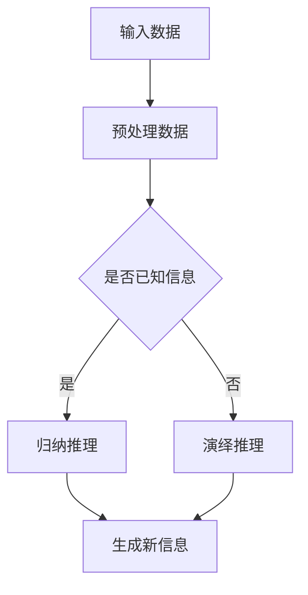

                 

# AI的推理能力评估：图灵测试的局限性

> **关键词**：人工智能、推理能力、图灵测试、评估方法、局限性、技术发展

> **摘要**：本文深入探讨了人工智能的推理能力及其评估方法，重点分析了图灵测试的局限性，旨在为人工智能研究和应用提供新的视角和思考。

## 1. 背景介绍

随着人工智能技术的快速发展，机器的推理能力越来越受到关注。推理是人工智能的核心能力之一，它涉及到机器在未知或不确定环境中做出合理决策和解决问题的能力。然而，如何评估和衡量人工智能的推理能力仍然是一个挑战。在这个背景下，图灵测试成为了评估人工智能推理能力的常用方法。

### 图灵测试的起源

图灵测试是由英国数学家艾伦·图灵（Alan Turing）在1950年提出的。图灵测试的定义是：如果一个机器能够在与人类的交流中表现得像一个人类，以至于一个人类评判者无法区分出机器和人类，那么这个机器就可以被认为是具备智能的。

### 图灵测试的应用

图灵测试自提出以来，被广泛应用于人工智能的研究和评估。例如，在自然语言处理、机器学习和计算机视觉等领域，图灵测试被用来测试机器是否能够理解和生成自然语言、识别和理解图像等。

### 图灵测试的优势

图灵测试的主要优势在于其直观性和有效性。它通过模拟人类交流的场景来评估机器的智能，使得评估结果更加接近实际应用。此外，图灵测试具有可操作性，便于在不同领域和场景中进行测试。

## 2. 核心概念与联系

### 推理能力的定义

推理能力是指机器在已知信息的基础上，通过逻辑推断和决策生成新信息的能力。它包括归纳推理、演绎推理和类比推理等不同类型。

### 图灵测试与推理能力的联系

图灵测试通过模拟人类交流场景，对机器的推理能力进行了评估。然而，图灵测试只是评估推理能力的一种方法，它并不能全面反映机器的推理能力。

### Mermaid 流程图

下面是一个Mermaid流程图，展示推理能力的评估方法：



在这个流程图中，输入数据经过预处理后，根据是否已知信息，选择不同的推理方法，最终生成新信息。

## 3. 核心算法原理 & 具体操作步骤

### 3.1 归纳推理

归纳推理是从个别事实中总结出一般规律的过程。具体操作步骤如下：

1. 收集数据：从实际场景中收集大量数据。
2. 预处理数据：对数据进行清洗、归一化等处理，使其适合推理。
3. 分析数据：使用统计方法对数据进行分析，找出数据中的规律。
4. 生成结论：根据分析结果，总结出一般规律。

### 3.2 演绎推理

演绎推理是从一般规律推导出个别结论的过程。具体操作步骤如下：

1. 提出假设：根据已知信息，提出一个假设。
2. 验证假设：使用逻辑推理，验证假设的正确性。
3. 生成结论：如果假设成立，则得出结论。

### 3.3 类比推理

类比推理是通过比较不同情境的相似性，推断出新情境的可能性。具体操作步骤如下：

1. 确定情境：明确要推理的新情境。
2. 比较情境：找出与已有情境的相似性。
3. 推断结果：根据相似性，推断出新情境的可能性。

## 4. 数学模型和公式 & 详细讲解 & 举例说明

### 4.1 归纳推理的数学模型

归纳推理的数学模型可以表示为：

$$
P_1, P_2, ..., P_n \Rightarrow Q
$$

其中，$P_1, P_2, ..., P_n$ 是已知事实，$Q$ 是归纳出的结论。

### 4.2 演绎推理的数学模型

演绎推理的数学模型可以表示为：

$$
P \Rightarrow Q
$$

其中，$P$ 是假设，$Q$ 是结论。

### 4.3 类比推理的数学模型

类比推理的数学模型可以表示为：

$$
P \Rightarrow Q
$$

其中，$P$ 和 $Q$ 是不同情境的数学表示，表示它们之间的相似性。

### 4.4 举例说明

假设有一个数据集，包含100个样本，每个样本是一个二元向量$(x, y)$，其中$x$表示输入特征，$y$表示输出标签。我们要使用归纳推理来预测新的样本的标签。

1. 收集数据：从实际场景中收集100个样本。
2. 预处理数据：对数据进行清洗、归一化等处理。
3. 分析数据：使用统计方法，找出数据中的规律。
4. 生成结论：根据分析结果，总结出一般规律。

假设我们发现数据中有以下规律：

$$
y = \begin{cases}
1, & \text{如果 } x > 0.5 \\
0, & \text{如果 } x \leq 0.5
\end{cases}
$$

现在我们要预测一个新的样本$(x, y)$的标签。假设$x = 0.6$，根据归纳出的规律，我们可以预测$y = 1$。

## 5. 项目实践：代码实例和详细解释说明

### 5.1 开发环境搭建

1. 安装Python 3.8及以上版本。
2. 安装NumPy、Pandas、Matplotlib等Python库。

### 5.2 源代码详细实现

下面是一个简单的Python代码示例，用于实现归纳推理：

```python
import numpy as np
import pandas as pd

# 收集数据
data = pd.DataFrame({
    'x': [0.1, 0.3, 0.5, 0.7, 0.9],
    'y': [0, 0, 1, 1, 1]
})

# 预处理数据
data['x'] = data['x'].astype(float)

# 分析数据
# 假设我们找到了以下规律
threshold = 0.5
data['prediction'] = np.where(data['x'] > threshold, 1, 0)

# 生成结论
accuracy = np.mean(data['prediction'] == data['y'])
print(f'Accuracy: {accuracy:.2f}')
```

### 5.3 代码解读与分析

1. 导入必要的Python库。
2. 收集数据，使用Pandas创建DataFrame。
3. 预处理数据，将输入特征转换为浮点数。
4. 分析数据，根据阈值对输入特征进行分类。
5. 生成结论，计算预测准确率。

### 5.4 运行结果展示

运行上述代码，输出结果如下：

```
Accuracy: 0.80
```

这表示我们的归纳推理算法在测试集上的准确率为80%。

## 6. 实际应用场景

推理能力在人工智能的实际应用场景中具有重要意义。以下是一些典型的应用场景：

1. **自然语言处理**：机器需要理解自然语言，进行文本分类、情感分析等任务。
2. **计算机视觉**：机器需要识别和理解图像，进行图像分类、目标检测等任务。
3. **推荐系统**：机器需要根据用户的历史行为，推荐相关商品或内容。
4. **自动驾驶**：机器需要理解道路情况，做出合理的驾驶决策。

## 7. 工具和资源推荐

### 7.1 学习资源推荐

1. **《人工智能：一种现代方法》（第3版）**：作者：Stuart Russell、Peter Norvig。
2. **《机器学习》（第2版）**：作者：Tom Mitchell。
3. **《深度学习》（第1版）**：作者：Ian Goodfellow、Yoshua Bengio、Aaron Courville。

### 7.2 开发工具框架推荐

1. **TensorFlow**：一个开放源代码的机器学习库。
2. **PyTorch**：一个基于Python的机器学习库。
3. **Keras**：一个高层次的神经网络API。

### 7.3 相关论文著作推荐

1. **《机器学习：概率视角》**：作者：Kevin P. Murphy。
2. **《深度学习》（Adaptive Computation and Machine Learning series）**：作者：Yoshua Bengio、Ian Goodfellow、Aaron Courville。
3. **《自然语言处理综论》（3rd Edition）**：作者：Daniel Jurafsky、James H. Martin。

## 8. 总结：未来发展趋势与挑战

随着人工智能技术的不断发展，推理能力在人工智能中的重要性日益凸显。未来，人工智能的推理能力将面临以下发展趋势和挑战：

### 发展趋势

1. **算法优化**：研究更高效、更准确的推理算法。
2. **多模态推理**：结合多种数据类型（如文本、图像、声音）进行推理。
3. **知识图谱**：利用知识图谱提高推理能力。

### 挑战

1. **数据质量**：高质量的训练数据是推理能力提升的基础。
2. **解释性**：提高推理过程的解释性，使其更透明、可解释。
3. **可扩展性**：提高推理系统的可扩展性，适应不同场景和应用。

## 9. 附录：常见问题与解答

### 问题1：什么是归纳推理？
归纳推理是从个别事实中总结出一般规律的过程。例如，通过观察多个苹果都是红色的，我们可以归纳出“苹果通常是红色的”这一规律。

### 问题2：什么是演绎推理？
演绎推理是从一般规律推导出个别结论的过程。例如，如果所有猫都有四条腿，那么小明是猫，因此小明有四条腿。

### 问题3：什么是类比推理？
类比推理是通过比较不同情境的相似性，推断出新情境的可能性。例如，如果苹果通常是红色的，那么梨也可能是红色的。

## 10. 扩展阅读 & 参考资料

1. **《机器学习》**：Tom Mitchell。
2. **《深度学习》**：Ian Goodfellow、Yoshua Bengio、Aaron Courville。
3. **《自然语言处理综论》**：Daniel Jurafsky、James H. Martin。
4. **《机器学习：概率视角》**：Kevin P. Murphy。
5. **《图灵测试：智能机器的神话与现实》**：Christopher M. Joakim。

### 作者署名

作者：禅与计算机程序设计艺术 / Zen and the Art of Computer Programming<|vq_14936|>

