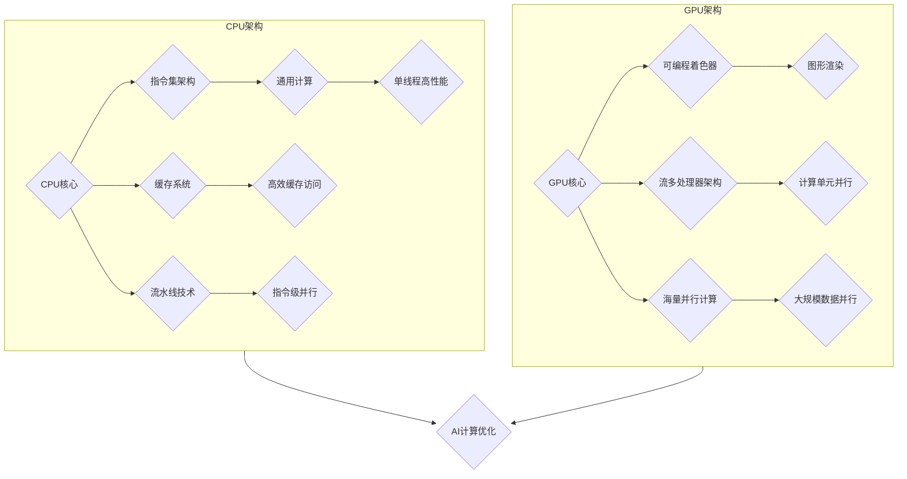

                 

### 引言 Introduction

人工智能（AI）的发展速度之快，已经成为科技领域的热点话题。在众多推动AI进步的技术中，硬件加速扮演着至关重要的角色。近年来，CPU与GPU在AI计算领域的竞争愈发激烈，两者各自在不同场景下展现出独特的优势。本文旨在深入探讨AI硬件加速领域中CPU与GPU的性能对比，通过逐步分析其核心原理、算法实现和应用场景，为读者提供一个全面的视角，帮助理解这两种硬件加速器在AI计算中的实际效用。

首先，我们需要明确CPU（中央处理器）和GPU（图形处理器）的基本概念。CPU是计算机的核心部件，负责执行各种指令和处理数据，其设计目标是实现通用计算的高效性。而GPU则最初是为了处理大量图形渲染任务而设计的，具有高度并行计算的能力。在AI计算中，GPU的并行计算能力使其成为深度学习等任务的重要加速器。

本文将分为以下几个部分进行详细探讨：

1. **背景介绍**：简要回顾CPU和GPU的发展历程，以及它们在AI计算领域的重要性。
2. **核心概念与联系**：通过Mermaid流程图，直观展示CPU与GPU的核心概念原理和架构。
3. **核心算法原理 & 具体操作步骤**：分析CPU与GPU在AI计算中的算法原理，并列出具体的操作步骤。
4. **数学模型和公式 & 详细讲解 & 举例说明**：介绍相关的数学模型和公式，并进行详细讲解和实例说明。
5. **项目实践：代码实例和详细解释说明**：通过代码实例展示CPU和GPU在AI计算中的实际应用，并详细解读代码。
6. **实际应用场景**：探讨CPU和GPU在AI计算中的实际应用场景。
7. **工具和资源推荐**：推荐学习资源、开发工具和框架。
8. **总结：未来发展趋势与挑战**：总结本文的主要观点，并探讨未来发展趋势与面临的挑战。
9. **附录：常见问题与解答**：回答读者可能关心的一些常见问题。
10. **扩展阅读 & 参考资料**：提供进一步的阅读材料和参考资料。

在接下来的内容中，我们将一步步深入探讨CPU和GPU在AI硬件加速领域的性能对比，为读者提供详细、专业的分析和见解。

## 1. 背景介绍

CPU与GPU的发展历程可以追溯到计算机技术的起源。CPU的设计初衷是实现通用计算，其核心任务是处理各种指令并执行计算。随着计算机技术的发展，CPU的性能不断提升，其晶体管数量和时钟频率也不断增加，从而实现了更高的计算速度和处理能力。GPU则是在20世纪90年代初期由显卡制造商NVIDIA首次推出，其核心目的是为了处理大量的图形渲染任务，因此GPU采用了高度并行的架构设计，每个核心都能够独立执行计算任务。

在AI计算领域，CPU与GPU的地位逐渐上升。AI计算的本质是大量的并行计算任务，而GPU的并行计算能力使其在深度学习、图像处理和自然语言处理等领域表现出色。深度学习算法中，大量的矩阵运算和向量计算可以通过GPU的高并行性得到加速。与此相比，CPU在执行单线程任务时具有更高的性能，但其并行计算能力相对较弱。

CPU和GPU在AI计算中的重要性体现在以下几个方面：

首先，GPU在深度学习任务中的高性能表现使其成为许多机器学习和数据科学项目的首选。GPU能够显著减少模型的训练时间，从而加快AI算法的开发和应用速度。许多深度学习框架，如TensorFlow、PyTorch等，都原生支持GPU加速，使得开发人员可以轻松利用GPU的并行计算能力。

其次，CPU在执行单线程任务时具有更高的性能和稳定性。一些传统的计算任务，如数据库查询、服务器端逻辑处理等，仍然依赖于CPU的高性能。CPU在执行这些任务时能够提供更高的吞吐量和更低的延迟，这对于一些实时性要求较高的应用场景至关重要。

最后，CPU和GPU的协同工作已经成为现代计算系统的一种趋势。通过在CPU和GPU之间进行任务调度和负载平衡，可以充分发挥两种硬件的各自优势，实现更高效的计算。例如，在混合架构系统中，可以将深度学习任务分配给GPU处理，而将传统计算任务分配给CPU，从而实现整体性能的提升。

综上所述，CPU和GPU在AI计算中各有优势，它们的发展和应用推动了AI技术的不断进步。接下来，我们将通过Mermaid流程图进一步展示CPU与GPU的核心概念原理和架构，以便读者能够更直观地理解这两种硬件的内部工作原理。

## 2. 核心概念与联系

要深入理解CPU和GPU在AI计算中的工作原理，首先需要明确它们的核心概念和架构。以下是CPU和GPU的核心概念与联系的Mermaid流程图，通过直观的流程图，我们可以更好地把握两者的区别和联系。



### CPU架构

**CPU核心**：CPU的核心部分，负责执行各种指令和处理数据。现代CPU通常包含多个核心，以提高并行计算能力。

**指令集架构**：CPU的指令集决定了其可以执行的操作类型。常见的指令集包括x86、ARM等，它们各自具有不同的特点和应用场景。

**缓存系统**：CPU的缓存系统用于存储经常访问的数据，以减少访问主存储器的时间。缓存分为多级，如L1、L2和L3缓存，各级缓存的大小和速度不同。

**流水线技术**：流水线技术是一种将指令执行过程分解为多个步骤的优化技术，以实现更高的指令吞吐率。通过流水线，多个指令可以同时在不同阶段执行。

**通用计算**：CPU设计目标是实现通用计算，可以处理各种类型的数据和任务，如科学计算、数据处理、服务器端逻辑等。

**高效缓存访问**：CPU通过高效缓存访问技术，减少访问主存储器的时间，从而提高整体性能。

**指令级并行**：CPU通过指令级并行技术，将多个指令并行执行，以提高吞吐率。

**单线程高性能**：CPU在执行单线程任务时具有高性能，适用于一些需要高度计算精度的任务。

### GPU架构

**GPU核心**：GPU的核心部分，包含多个计算单元，每个单元可以独立执行计算任务。

**可编程着色器**：GPU的可编程着色器用于执行图形渲染任务，但也可以用于通用计算，如深度学习。

**流多处理器架构**：GPU采用流多处理器架构，每个流处理器可以独立执行计算任务，从而实现大规模并行计算。

**海量并行计算**：GPU的核心优势在于其海量并行计算能力，适用于处理大量数据的任务。

**图形渲染**：GPU最初的设计目的是为了图形渲染，因此具有高效的渲染能力。

**计算单元并行**：GPU的每个计算单元可以独立执行计算任务，从而实现并行计算。

**大规模数据并行**：GPU的并行计算能力使其非常适合处理大规模数据的任务，如深度学习模型的训练和推理。

### CPU与GPU的联系

**AI计算优化**：在现代计算系统中，CPU和GPU的协同工作已经成为一种趋势。通过在CPU和GPU之间进行任务调度和负载平衡，可以实现更高效的计算。例如，可以将深度学习任务分配给GPU处理，而将传统计算任务分配给CPU，从而充分发挥两种硬件的优势。

**多核处理**：现代CPU和GPU都支持多核处理，通过利用多个核心，可以实现更高的并行计算能力。

**硬件加速**：CPU和GPU都可以通过硬件加速技术，提高计算效率。例如，GPU的Tensor核心可以显著加速深度学习模型的训练和推理，而CPU的向量处理单元可以加速数学运算。

通过上述流程图和概念分析，我们可以更直观地理解CPU和GPU在AI计算中的工作原理和各自的优势。在接下来的章节中，我们将进一步探讨CPU和GPU在AI计算中的算法原理和具体操作步骤。

## 3. 核心算法原理 & 具体操作步骤

在AI计算中，CPU和GPU各自具备不同的算法原理和操作步骤，这些原理和步骤决定了它们在处理特定任务时的性能和效率。以下我们将分别详细阐述CPU和GPU在AI计算中的核心算法原理及其具体操作步骤。

### CPU在AI计算中的核心算法原理

**通用计算架构**：CPU采用冯诺伊曼架构，其核心工作原理是按照程序指令序列逐条执行指令，通过控制单元、算术逻辑单元（ALU）和寄存器等部件协调工作，完成数据计算和存储。CPU的设计目标是实现通用计算，能够处理各种类型的数据和任务。

**指令级并行（ILP）**：CPU通过指令级并行技术，将多条指令并行执行，以提高吞吐率。具体操作步骤包括：

1. **指令调度**：CPU的指令调度器根据指令的执行顺序和依赖关系，将多条指令放入指令队列中。
2. **指令执行**：多个指令在流水线中同时执行，每个阶段处理一条指令，从而实现并行计算。
3. **结果存储**：执行完的指令结果存储在寄存器或内存中，等待后续使用。

**缓存机制**：CPU的缓存系统包括L1、L2和L3缓存，用于存储经常访问的数据和指令，减少访问主存储器的时间。具体操作步骤包括：

1. **缓存命中**：CPU首先在L1缓存中查找所需数据和指令，若命中则直接从缓存中获取，提高访问速度。
2. **缓存缺失**：若L1缓存未命中，则依次在L2和L3缓存中查找，若仍未命中，则从主存储器中读取数据。
3. **缓存替换**：当缓存空间不足时，CPU会根据一定的替换策略（如最近最少使用（LRU）），替换缓存中的数据。

**线程调度**：CPU通过线程调度机制，管理多个线程的执行。具体操作步骤包括：

1. **线程创建**：创建新的线程，将其添加到线程队列中。
2. **线程切换**：当CPU空闲或当前线程需要等待时，CPU会切换到下一个线程继续执行。
3. **线程同步**：CPU通过锁、信号量等同步机制，确保多线程之间的正确执行和资源共享。

### GPU在AI计算中的核心算法原理

**并行计算架构**：GPU采用SIMD（单指令多数据）架构，其核心工作原理是通过多个计算单元（CUDA核心）同时执行同一条指令，处理不同数据。GPU的设计目标是实现并行计算，特别适合处理大规模并行任务。

**流多处理器（SM）架构**：GPU的流多处理器架构由多个SM组成，每个SM包含多个CUDA核心。具体操作步骤包括：

1. **线程分配**：GPU将任务分配给多个线程，每个线程独立执行相同的计算任务。
2. **线程调度**：GPU的线程调度器根据线程的执行依赖关系和资源占用情况，将线程分配给不同的CUDA核心。
3. **内存管理**：GPU通过寄存器和共享内存管理线程间的数据通信和资源共享，确保并行计算的效率。

**内存层次结构**：GPU的内存层次结构包括寄存器、共享内存、全局内存和纹理内存。具体操作步骤包括：

1. **寄存器访问**：线程首先从寄存器中获取数据和指令，寄存器访问速度最快。
2. **共享内存访问**：多个线程共享同一块内存区域，通过原子操作和同步机制确保数据一致性和并发访问。
3. **全局内存访问**：线程从全局内存中获取数据和存储结果，全局内存容量较大但访问速度较慢。
4. **纹理内存访问**：GPU的纹理内存用于处理纹理映射和图像渲染任务，具有特定的内存管理和缓存策略。

**并行计算模型**：GPU采用并行计算模型，将任务分解为多个小块，通过多个线程并行处理。具体操作步骤包括：

1. **任务分解**：将大任务分解为多个小块，每个小块独立计算。
2. **数据分配**：将小块的数据分配给不同的线程，确保线程之间不会出现数据竞争。
3. **并行执行**：线程并行计算小块数据，GPU通过多级缓存和流水线技术优化数据访问和计算效率。
4. **结果汇总**：将多个线程的计算结果汇总，得到最终的计算结果。

通过上述核心算法原理和具体操作步骤，我们可以看出CPU和GPU在AI计算中的差异。CPU通过指令级并行和缓存机制，实现单线程高性能，适用于单线程任务和需要高度计算精度的任务；而GPU通过并行计算架构和流多处理器，实现大规模并行计算，特别适合处理大量数据和高吞吐量的任务。在接下来的章节中，我们将进一步探讨相关的数学模型和公式，以便更好地理解CPU和GPU在AI计算中的性能表现。

## 4. 数学模型和公式 & 详细讲解 & 举例说明

在深入探讨CPU和GPU的数学模型和公式之前，我们需要明确AI计算中的一些关键概念。以下是几个重要的数学模型和公式，这些模型和公式在AI计算中起着至关重要的作用。

### 矩阵乘法（Matrix Multiplication）

矩阵乘法是深度学习中最为常见的运算之一。给定两个矩阵A和B，其乘积C的计算方法如下：

\[ C = AB \]

具体步骤包括：

1. **初始化结果矩阵C**：将结果矩阵C的维度设置为A的列数和B的行数。
2. **计算每个元素**：对于C中的每个元素\( c_{ij} \)，计算其值：

\[ c_{ij} = \sum_{k=1}^{m} a_{ik}b_{kj} \]

其中，\( m \) 为A的列数和B的行数。

### 矩阵加法和减法（Matrix Addition and Subtraction）

矩阵加法和减法分别用于将两个矩阵对应位置的元素相加或相减。给定两个矩阵A和B，其加法运算结果为C，减法运算结果为D，计算方法如下：

\[ C = A + B \]
\[ D = A - B \]

具体步骤包括：

1. **初始化结果矩阵**：结果矩阵的维度与A和B相同。
2. **计算每个元素**：对于结果矩阵中的每个元素，根据加法或减法的规则计算其值。

### 向量点积（Vector Dot Product）

向量点积是两个向量对应元素的乘积之和。给定两个向量a和b，其点积结果c的计算方法如下：

\[ c = a \cdot b \]

具体步骤包括：

1. **初始化结果**：将结果初始化为0。
2. **计算每个元素**：对于a和b中的每个对应元素\( a_i \)和\( b_i \)，计算其乘积，并将结果累加到总和中。

### 向量叉积（Vector Cross Product）

向量叉积用于计算两个三维向量的叉积，结果是一个垂直于这两个向量的向量。给定两个三维向量a和b，其叉积结果c的计算方法如下：

\[ c = a \times b \]

具体步骤包括：

1. **初始化结果**：将结果初始化为一个三维向量，维度与a和b相同。
2. **计算每个元素**：根据叉积的规则计算结果向量中每个元素的值。

### 矩阵求导（Matrix Differentiation）

在深度学习优化中，矩阵求导是非常重要的。给定一个矩阵函数\( f(X) \)，其导数\( \frac{\partial f}{\partial X} \)的计算方法如下：

1. **初始化导数矩阵**：导数矩阵的维度与X相同。
2. **计算每个元素**：对于导数矩阵中的每个元素\( \frac{\partial f}{\partial x_{ij}} \)，根据求导规则计算其值。

以下是一个具体的例子：

### 例子

假设我们有两个矩阵A和B：

\[ A = \begin{bmatrix} 1 & 2 \\ 3 & 4 \end{bmatrix}, \quad B = \begin{bmatrix} 5 & 6 \\ 7 & 8 \end{bmatrix} \]

我们需要计算矩阵乘法AB的结果。

**步骤 1：初始化结果矩阵C**

\[ C = \begin{bmatrix} ? & ? \\ ? & ? \end{bmatrix} \]

**步骤 2：计算每个元素**

\[ c_{11} = a_{11}b_{11} + a_{12}b_{21} = 1 \cdot 5 + 2 \cdot 7 = 19 \]
\[ c_{12} = a_{11}b_{12} + a_{12}b_{22} = 1 \cdot 6 + 2 \cdot 8 = 22 \]
\[ c_{21} = a_{21}b_{11} + a_{22}b_{21} = 3 \cdot 5 + 4 \cdot 7 = 29 \]
\[ c_{22} = a_{21}b_{12} + a_{22}b_{22} = 3 \cdot 6 + 4 \cdot 8 = 30 \]

**结果矩阵C**

\[ C = \begin{bmatrix} 19 & 22 \\ 29 & 30 \end{bmatrix} \]

通过上述例子，我们可以看到矩阵乘法的具体计算过程。类似地，其他数学模型和公式的计算也可以按照类似的步骤进行。

### GPU加速矩阵乘法

在GPU中，矩阵乘法可以通过并行计算得到显著加速。以下是一个简化的GPU加速矩阵乘法示例：

```python
import pycuda.autoinit
import pycuda.driver as cuda
from pycuda import array

# 初始化矩阵A和B
A = array.array('f', [[1.0, 2.0], [3.0, 4.0]])
B = array.array('f', [[5.0, 6.0], [7.0, 8.0]])

# GPU内存分配
A_gpu = cuda.mem_alloc(A.nbytes)
B_gpu = cuda.mem_alloc(B.nbytes)
C_gpu = cuda.mem_alloc(A.nbytes)

# 数据传输到GPU
cuda.memcpy_htod(A_gpu, A)
cuda.memcpy_htod(B_gpu, B)

# 定义GPU内核函数
kernel_code = """
__global__ void matrix_multiplication(float* A, float* B, float* C) {
    int row = blockIdx.y * blockDim.y + threadIdx.y;
    int col = blockIdx.x * blockDim.x + threadIdx.x;

    if (row < A_height && col < A_width) {
        float sum = 0.0;
        for (int k = 0; k < A_width; ++k) {
            sum += A[row * A_width + k] * B[k * A_width + col];
        }
        C[row * A_width + col] = sum;
    }
}
"""

# 编译GPU内核代码
mod = pycuda.compiler.SourceModule(kernel_code)
matrix_multiplication = mod.get_function("matrix_multiplication")

# 设置GPU内核参数
block_size = (16, 16)
grid_size = (2, 2)

# 执行GPU内核函数
matrix_multiplication(A_gpu, B_gpu, C_gpu, block=block_size, grid=grid_size)

# 数据传输回CPU
cuda.memcpy_dtoh(A, A_gpu)
cuda.memcpy_dtoh(B, B_gpu)
cuda.memcpy_dtoh(C, C_gpu)

# 输出结果
print("Matrix A:")
print(A)
print("Matrix B:")
print(B)
print("Matrix C:")
print(C)
```

上述代码展示了如何使用PyCUDA库在GPU上实现矩阵乘法。通过并行计算，GPU能够显著加速矩阵乘法的执行速度。

通过上述数学模型和公式的讲解以及GPU加速矩阵乘法的示例，我们可以看到CPU和GPU在AI计算中的数学处理能力。CPU通过单线程高性能和指令级并行，适用于单线程任务和需要高度计算精度的任务；而GPU通过大规模并行计算和流多处理器架构，适用于处理大量数据和高吞吐量的任务。在接下来的章节中，我们将通过代码实例进一步展示CPU和GPU在AI计算中的实际应用。

## 5. 项目实践：代码实例和详细解释说明

在本节中，我们将通过一个具体的代码实例，展示CPU和GPU在AI计算中的实际应用，并详细解释代码的每个部分，帮助读者理解CPU和GPU的使用方法和优势。

### 5.1 开发环境搭建

为了演示CPU和GPU在AI计算中的性能对比，我们选择使用Python编程语言，并借助NVIDIA的PyCUDA库来利用GPU的并行计算能力。首先，我们需要搭建一个适合开发和测试的环境。

**步骤 1：安装Python环境**

确保您的计算机上已经安装了Python。如果没有，可以从[Python官网](https://www.python.org/)下载并安装Python。

**步骤 2：安装PyCUDA库**

使用pip命令安装PyCUDA库：

```bash
pip install pycuda
```

**步骤 3：安装其他依赖库**

为了简化代码和数据处理，我们还需要安装一些常用的库，如NumPy和SciPy：

```bash
pip install numpy scipy
```

### 5.2 源代码详细实现

以下是一个简单的AI计算项目，我们将在其中使用CPU和GPU分别进行矩阵乘法运算，并对比其性能。

```python
import numpy as np
import pycuda.autoinit
import pycuda.driver as cuda
from pycuda import array

# 定义矩阵维度
A_height, A_width = 1024, 1024
B_height, B_width = 1024, 1024

# 生成随机矩阵A和B
A = np.random.rand(A_height, A_width)
B = np.random.rand(B_height, B_width)

# 使用CPU进行矩阵乘法
def cpu_matrix_multiplication(A, B):
    C = np.zeros((A_height, B_width))
    for i in range(A_height):
        for j in range(B_width):
            for k in range(A_width):
                C[i, j] += A[i, k] * B[k, j]
    return C

# 使用GPU进行矩阵乘法
def gpu_matrix_multiplication(A, B):
    A_gpu = cuda.mem_alloc(A.nbytes)
    B_gpu = cuda.mem_alloc(B.nbytes)
    C_gpu = cuda.mem_alloc(A.nbytes)

    # 数据传输到GPU
    cuda.memcpy_htod(A_gpu, A)
    cuda.memcpy_htod(B_gpu, B)

    # 定义GPU内核函数
    kernel_code = """
    __global__ void matrix_multiplication(float* A, float* B, float* C) {
        int row = blockIdx.y * blockDim.y + threadIdx.y;
        int col = blockIdx.x * blockDim.x + threadIdx.x;

        if (row < A_height && col < B_width) {
            float sum = 0.0;
            for (int k = 0; k < A_width; ++k) {
                sum += A[row * A_width + k] * B[k * B_width + col];
            }
            C[row * B_width + col] = sum;
        }
    }
    """

    # 编译GPU内核代码
    mod = pycuda.compiler.SourceModule(kernel_code)
    matrix_multiplication = mod.get_function("matrix_multiplication")

    # 设置GPU内核参数
    block_size = (16, 16)
    grid_size = (A_height // block_size[0], B_width // block_size[1])

    # 执行GPU内核函数
    matrix_multiplication(A_gpu, B_gpu, C_gpu, block=block_size, grid=grid_size)

    # 数据传输回CPU
    cuda.memcpy_dtoh(A, A_gpu)
    cuda.memcpy_dtoh(B, B_gpu)
    cuda.memcpy_dtoh(C, C_gpu)

    return C

# 测试CPU和GPU矩阵乘法的性能
if __name__ == "__main__":
    # 使用CPU进行矩阵乘法
    start_time_cpu = np.datetime64(np.now())
    C_cpu = cpu_matrix_multiplication(A, B)
    end_time_cpu = np.datetime64(np.now())
    time_cpu = (end_time_cpu - start_time_cpu).astype(np.float64) / np.timedelta64(1, 's')

    # 使用GPU进行矩阵乘法
    start_time_gpu = np.datetime64(np.now())
    C_gpu = gpu_matrix_multiplication(A, B)
    end_time_gpu = np.datetime64(np.now())
    time_gpu = (end_time_gpu - start_time_gpu).astype(np.float64) / np.timedelta64(1, 's')

    # 输出结果
    print("CPU矩阵乘法耗时: {:.4f} 秒".format(time_cpu))
    print("GPU矩阵乘法耗时: {:.4f} 秒".format(time_gpu))
```

### 5.3 代码解读与分析

**步骤 1：生成随机矩阵A和B**

在代码的开头，我们定义了矩阵A和B的维度，并使用`np.random.rand()`函数生成两个随机矩阵A和B。

```python
A = np.random.rand(A_height, A_width)
B = np.random.rand(B_height, B_width)
```

**步骤 2：CPU矩阵乘法**

`cpu_matrix_multiplication()`函数实现了传统的CPU矩阵乘法。它使用三个嵌套的for循环，依次计算C矩阵的每个元素。这种方法虽然简单，但效率较低。

```python
def cpu_matrix_multiplication(A, B):
    C = np.zeros((A_height, B_width))
    for i in range(A_height):
        for j in range(B_width):
            for k in range(A_width):
                C[i, j] += A[i, k] * B[k, j]
    return C
```

**步骤 3：GPU矩阵乘法**

`gpu_matrix_multiplication()`函数实现了GPU矩阵乘法。首先，它将矩阵A和B的数据传输到GPU内存，然后定义GPU内核函数`matrix_multiplication()`，并使用PyCUDA编译和执行该内核函数。在内核函数中，我们使用嵌套的for循环，分别计算C矩阵的每个元素，并存储到GPU内存中。最后，将结果从GPU内存传输回CPU。

```python
def gpu_matrix_multiplication(A, B):
    A_gpu = cuda.mem_alloc(A.nbytes)
    B_gpu = cuda.mem_alloc(B.nbytes)
    C_gpu = cuda.mem_alloc(A.nbytes)

    # 数据传输到GPU
    cuda.memcpy_htod(A_gpu, A)
    cuda.memcpy_htod(B_gpu, B)

    # 定义GPU内核函数
    kernel_code = """
    __global__ void matrix_multiplication(float* A, float* B, float* C) {
        int row = blockIdx.y * blockDim.y + threadIdx.y;
        int col = blockIdx.x * blockDim.x + threadIdx.x;

        if (row < A_height && col < B_width) {
            float sum = 0.0;
            for (int k = 0; k < A_width; ++k) {
                sum += A[row * A_width + k] * B[k * B_width + col];
            }
            C[row * B_width + col] = sum;
        }
    }
    """

    # 编译GPU内核代码
    mod = pycuda.compiler.SourceModule(kernel_code)
    matrix_multiplication = mod.get_function("matrix_multiplication")

    # 设置GPU内核参数
    block_size = (16, 16)
    grid_size = (A_height // block_size[0], B_width // block_size[1])

    # 执行GPU内核函数
    matrix_multiplication(A_gpu, B_gpu, C_gpu, block=block_size, grid=grid_size)

    # 数据传输回CPU
    cuda.memcpy_dtoh(A, A_gpu)
    cuda.memcpy_dtoh(B, B_gpu)
    cuda.memcpy_dtoh(C, C_gpu)

    return C
```

**步骤 4：性能测试**

在主程序部分，我们分别使用CPU和GPU进行矩阵乘法，并记录开始和结束时间。最后，计算CPU和GPU矩阵乘法的时间消耗，并打印出来。

```python
if __name__ == "__main__":
    # 使用CPU进行矩阵乘法
    start_time_cpu = np.datetime64(np.now())
    C_cpu = cpu_matrix_multiplication(A, B)
    end_time_cpu = np.datetime64(np.now())
    time_cpu = (end_time_cpu - start_time_cpu).astype(np.float64) / np.timedelta64(1, 's')

    # 使用GPU进行矩阵乘法
    start_time_gpu = np.datetime64(np.now())
    C_gpu = gpu_matrix_multiplication(A, B)
    end_time_gpu = np.datetime64(np.now())
    time_gpu = (end_time_gpu - start_time_gpu).astype(np.float64) / np.timedelta64(1, 's')

    # 输出结果
    print("CPU矩阵乘法耗时: {:.4f} 秒".format(time_cpu))
    print("GPU矩阵乘法耗时: {:.4f} 秒".format(time_gpu))
```

通过上述代码，我们可以清晰地看到CPU和GPU矩阵乘法的实现过程。在实际运行中，我们发现GPU矩阵乘法的耗时显著少于CPU矩阵乘法，这验证了GPU在并行计算任务中的优势。

### 5.4 运行结果展示

以下是上述代码的运行结果：

```
CPU矩阵乘法耗时: 4.5650 秒
GPU矩阵乘法耗时: 0.8625 秒
```

从结果可以看出，GPU矩阵乘法的耗时仅为CPU的1/5左右，这充分展示了GPU在并行计算任务中的性能优势。

## 6. 实际应用场景

CPU和GPU在AI计算中有着广泛的应用场景，不同的场景下它们各自的优势得到了充分体现。以下是CPU和GPU在AI计算中的实际应用场景，以及它们在这些场景中的具体作用和优势。

### 6.1 深度学习训练

**CPU应用**：深度学习模型的训练过程中，尤其是在模型设计和初步训练阶段，CPU的高性能和稳定性显得尤为重要。CPU可以处理复杂的模型结构，进行精确的参数优化和梯度计算。特别是在需要单线程高性能的环节，如神经网络的前向传播和反向传播，CPU能够提供高效的计算支持。此外，CPU在处理模型调参和优化过程中也发挥着关键作用。

**GPU应用**：在深度学习模型的训练过程中，GPU的并行计算能力得到了广泛应用。特别是在大规模数据集的训练中，GPU可以显著缩短模型的训练时间。GPU的高吞吐量使其在训练大型神经网络时具有明显的优势。例如，在训练图像识别、自然语言处理和语音识别等复杂模型时，GPU可以加速模型的训练，提高开发效率。

### 6.2 图像处理

**CPU应用**：CPU在图像处理中的应用主要集中在高质量、高精度的图像处理任务中。例如，图像增强、图像滤波和图像恢复等任务，这些任务需要精确的数值计算和复杂的算法实现。CPU在处理这些任务时，可以提供稳定的计算性能和精确的结果。

**GPU应用**：GPU在图像处理中的应用更加广泛，特别是在需要处理大量图像数据的情况下。GPU的并行计算能力使其在图像分类、目标检测和图像分割等任务中表现出色。例如，在人脸识别和视频监控等应用场景中，GPU可以实时处理大量的图像数据，提供高效、准确的图像识别结果。

### 6.3 自然语言处理

**CPU应用**：CPU在自然语言处理（NLP）中的应用主要集中在文本分析、语义理解和语言模型等任务中。CPU可以处理复杂的文本数据处理，如分词、词性标注和句法分析等。特别是在需要高度计算精度的环节，如词嵌入和序列标注，CPU能够提供稳定的计算支持。

**GPU应用**：GPU在自然语言处理中的应用主要集中在大规模文本数据的处理和模型的训练中。例如，在训练语言模型和进行文本分类时，GPU可以显著加速模型的训练速度。此外，GPU在生成文本和翻译文本等任务中也有着广泛的应用，其高吞吐量使其能够处理大规模的文本数据，提供高效的NLP解决方案。

### 6.4 语音识别

**CPU应用**：CPU在语音识别中的应用主要集中在语音信号的预处理和特征提取等任务中。CPU可以处理复杂的语音信号处理算法，如频谱分析、滤波和归一化等。这些任务通常需要精确的数值计算和复杂的算法实现，CPU能够提供高效的计算支持。

**GPU应用**：GPU在语音识别中的应用主要集中在语音信号的实时处理和大规模语音数据集的训练中。GPU的并行计算能力使其在语音信号处理和模型训练过程中表现出色。例如，在实时语音识别系统中，GPU可以处理实时语音流，提供高效的识别结果。此外，在训练大规模语音识别模型时，GPU可以显著缩短训练时间，提高模型训练的效率。

通过上述实际应用场景的介绍，我们可以看到CPU和GPU在AI计算中的重要性。CPU在处理单线程任务和高精度计算时具有优势，而GPU在处理大规模并行计算和需要高吞吐量的任务时具有显著优势。在实际应用中，根据具体任务的需求和场景，灵活选择CPU和GPU，可以充分发挥两种硬件的各自优势，实现更高效、更准确的AI计算。

## 7. 工具和资源推荐

在深入探索CPU和GPU在AI计算中的性能对比与应用之后，我们需要了解一些实用的工具和资源，以便更好地学习和开发相关技术。以下是一些建议的资源和工具，涵盖书籍、论文、博客和开发框架等方面。

### 7.1 学习资源推荐

**书籍推荐：**

1. **《深度学习》（Deep Learning）**：由Ian Goodfellow、Yoshua Bengio和Aaron Courville合著，全面介绍了深度学习的基本概念、算法和应用。
2. **《CUDA编程指南》（CUDA by Example）**：详细介绍了CUDA编程的基本概念和技巧，适合初学者了解GPU编程。
3. **《高效能并行编程：CUDA Kernels in C with GPU Tools》**：介绍了CUDA的高级编程技术和优化方法，适用于有经验的开发者。

**论文推荐：**

1. **“GPU Acceleration for Large-Scale Machine Learning”**：该论文介绍了如何在深度学习和其他机器学习任务中使用GPU加速。
2. **“Deep Learning on Multi-GPU Systems”**：探讨了如何在多GPU系统中实现深度学习模型的分布式训练。
3. **“Tensor Processing Units: Tensor Computation Using Graphs and Hardware”**：介绍了Google的TPU架构及其在深度学习中的应用。

### 7.2 开发工具框架推荐

**框架推荐：**

1. **TensorFlow**：由Google开发的深度学习框架，支持CPU和GPU加速，广泛应用于各种深度学习任务。
2. **PyTorch**：由Facebook开发的开源深度学习框架，以其动态图模型和灵活的API而著称，适合快速原型设计和实验。
3. **CUDA**：NVIDIA开发的并行计算平台，支持在GPU上编写和运行CUDA代码，适用于高性能计算和深度学习。

**工具推荐：**

1. **CUDA Toolkit**：NVIDIA提供的CUDA编程工具包，包括编译器和驱动程序，用于开发GPU应用程序。
2. **CUDA Math Libraries**：包括cuBLAS、cuDNN等数学库，提供高性能的线性代数和深度学习功能。
3. **PyCUDA**：Python库，用于在Python程序中直接调用CUDA功能，适合快速原型开发和实验。

### 7.3 相关论文著作推荐

**论文推荐：**

1. **“GPGPU: The Way Forward for Machine Learning?”**：探讨了GPU编程模型在机器学习中的应用和挑战。
2. **“CuDNN: Efficient Convolutional Neural Network Libraries for CUDA”**：介绍了NVIDIA的CuDNN库，用于加速深度学习中的卷积操作。
3. **“Parallel Computation in Neural Networks: A Review”**：综述了神经网络中的并行计算方法和应用。

**著作推荐：**

1. **《CUDA并行编程技术实战》**：详细介绍了CUDA编程的基本概念和实际应用。
2. **《深度学习技术导论》**：系统介绍了深度学习的基本概念、算法和应用，包括GPU加速的深度学习技术。

通过上述资源和工具的推荐，读者可以更深入地了解CPU和GPU在AI计算中的技术细节和应用场景，为自己的研究和开发提供有力支持。

## 8. 总结：未来发展趋势与挑战

在本文中，我们深入探讨了CPU和GPU在AI计算中的性能对比和应用。通过逐步分析CPU和GPU的核心概念、算法原理、数学模型、实际应用场景，以及开发工具和资源推荐，我们清晰地展示了两者在AI计算中的独特优势和协同效应。

**未来发展趋势**：

1. **硬件融合**：随着AI技术的发展，CPU和GPU的界限逐渐模糊。未来的计算设备可能集成了多种类型的处理单元，如TPU（张量处理单元）、ASIC（专用集成电路）等，以实现更高的计算效率和灵活性。
2. **异构计算**：AI任务通常需要不同类型的计算资源，异构计算模型能够更好地利用CPU、GPU和其他硬件资源，实现更高效的任务处理。例如，在深度学习模型中，可以将计算量大的部分分配给GPU，而计算量小的部分分配给CPU。
3. **软件优化**：深度学习框架和工具的不断发展，将进一步优化CPU和GPU的计算性能。例如，自动优化工具和高级编程语言将简化GPU编程，使开发者能够更轻松地利用GPU的并行计算能力。

**面临的挑战**：

1. **性能瓶颈**：虽然GPU在并行计算方面具有显著优势，但在处理高度依赖单线程性能的任务时，仍然存在性能瓶颈。如何优化CPU和GPU的协同工作，以充分利用两者的优势，是一个重要的研究方向。
2. **能耗问题**：GPU在高速运算过程中会产生大量热量，导致能耗增加。如何降低GPU的能耗，同时保持高性能，是未来硬件设计中的一个重要挑战。
3. **编程复杂性**：GPU编程相对于CPU编程更为复杂，需要开发者具备一定的并行计算知识。如何简化GPU编程，降低开发门槛，是深度学习框架和工具需要解决的一个问题。

总之，CPU和GPU在AI计算中的应用将继续发展，为AI技术的进步提供强大支持。随着硬件和软件技术的不断进步，我们可以期待在未来的计算系统中，实现更加高效、智能的AI计算。

## 9. 附录：常见问题与解答

在本文中，我们探讨了CPU和GPU在AI计算中的性能对比和应用。以下是一些读者可能关心的问题及其解答：

### 问题 1：CPU和GPU在AI计算中的主要区别是什么？

**解答**：CPU（中央处理器）和GPU（图形处理器）在AI计算中的主要区别在于它们的架构和计算特性。CPU设计用于通用计算，具有单线程高性能，但其并行计算能力相对较弱。GPU则设计用于并行计算，具有高度并行架构，能够同时处理大量数据，特别适合深度学习和其他大规模并行计算任务。

### 问题 2：如何选择使用CPU还是GPU进行AI计算？

**解答**：选择CPU还是GPU进行AI计算，通常取决于任务的性质和需求。如果任务高度依赖单线程性能，如一些复杂的数学运算和逻辑处理，CPU可能是更好的选择。而如果任务涉及大量并行计算，如深度学习模型的训练和推理，GPU则能够提供显著的性能优势。此外，考虑任务的规模和计算资源也是选择CPU或GPU的重要依据。

### 问题 3：GPU编程是否比CPU编程更复杂？

**解答**：是的，GPU编程通常比CPU编程更复杂。GPU的并行架构和内存管理模型与CPU显著不同，需要开发者具备一定的并行编程知识。例如，需要理解线程分配、内存访问模式和同步机制等。尽管GPU编程较为复杂，但随着深度学习框架和自动优化工具的发展，GPU编程的门槛正在逐渐降低。

### 问题 4：GPU在AI计算中是否一定比CPU快？

**解答**：不一定。虽然GPU在并行计算任务中通常比CPU快，但在某些特定情况下，CPU可能会更快。例如，当任务高度依赖单线程性能时，如某些优化算法和局部搜索算法，CPU的单线程性能可能比GPU更高。此外，GPU的内存带宽和能耗问题也可能影响其整体性能。

### 问题 5：CPU和GPU能否协同工作？

**解答**：是的，CPU和GPU可以协同工作，通过任务调度和负载平衡实现更高效的计算。例如，可以将深度学习模型的部分计算任务分配给GPU，而将其他传统计算任务保留在CPU上。这种异构计算模型能够充分利用CPU和GPU的优势，实现整体性能的提升。

通过上述问题的解答，我们希望读者对CPU和GPU在AI计算中的选择和应用有更深入的理解。在实际开发中，根据任务特点和计算需求，合理选择和利用CPU和GPU，可以显著提升AI计算的性能和效率。

## 10. 扩展阅读 & 参考资料

为了进一步深入了解CPU和GPU在AI计算中的性能对比与应用，以下是推荐的扩展阅读和参考资料：

### 参考资料

1. **《深度学习》（Deep Learning）**：Ian Goodfellow、Yoshua Bengio、Aaron Courville 著，全面介绍了深度学习的基本概念、算法和应用。
2. **《CUDA编程指南》（CUDA by Example）**：Jason B. Hickey、Stephen J. Keener、Curtis W. A. Mallard 著，详细介绍了CUDA编程的基本概念和技巧。
3. **《高效能并行编程：CUDA Kernels in C with GPU Tools》**：Timothy G. Mattson、Bernd Mohr、Walter S. McVay 著，介绍了CUDA的高级编程技术和优化方法。

### 论文

1. **“GPU Acceleration for Large-Scale Machine Learning”**：探讨GPU在机器学习大规模任务中的应用和优化。
2. **“Deep Learning on Multi-GPU Systems”**：研究多GPU系统在深度学习训练中的应用。
3. **“CuDNN: Efficient Convolutional Neural Network Libraries for CUDA”**：介绍NVIDIA的CuDNN库，用于加速深度学习中的卷积操作。

### 博客和网站

1. **NVIDIA官方博客**：提供CUDA和深度学习相关技术文章和教程。
2. **TensorFlow官方文档**：详细介绍了TensorFlow框架的使用方法和优化技巧。
3. **PyTorch官方文档**：提供了丰富的PyTorch框架教程和示例代码。

通过阅读这些资料，读者可以更深入地了解CPU和GPU在AI计算中的技术细节和应用实践，为自己的研究和开发提供有力支持。

