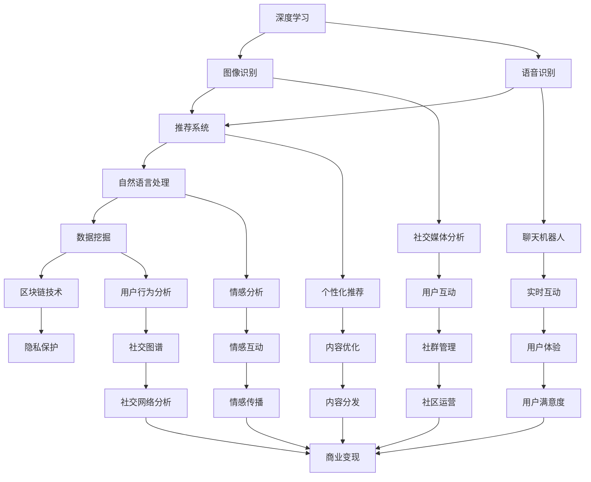

                 

### 1. 背景介绍

AI社交网络，作为一种新兴的技术形态，近年来在全球范围内迅速崛起。它依托于人工智能技术，对传统社交网络进行革新，提供了更为智能、个性化的服务体验。本文将围绕AI社交网络的未来展望，探讨其在技术、应用、商业模式等方面的变革与挑战。

AI社交网络的起源可以追溯到20世纪90年代，随着互联网的普及和社交网站的兴起，人们开始对社交网络的需求逐渐增加。然而，传统社交网络在信息处理、个性化推荐、社交关系挖掘等方面存在诸多不足。因此，将人工智能技术引入社交网络，成为了一种必然的趋势。

早期的AI社交网络主要集中于基本的推荐系统和简单的社交关系分析。随着深度学习、自然语言处理等技术的发展，AI社交网络的功能和性能得到了大幅提升。如今，AI社交网络已经能够实现智能推荐、情感分析、隐私保护等多种功能，为用户提供更加丰富、便捷的社交体验。

在技术发展层面，AI社交网络主要依赖于以下核心技术：

1. **深度学习与神经网络**：深度学习算法在图像识别、语音识别等领域取得了突破性进展，为AI社交网络提供了强大的数据处理能力。
2. **自然语言处理**：通过自然语言处理技术，AI社交网络能够更好地理解用户的需求和情感，提供更加精准的推荐和互动。
3. **大数据分析**：AI社交网络需要处理海量用户数据，大数据分析技术帮助网络挖掘用户行为模式，实现精准推荐。
4. **区块链技术**：区块链技术在隐私保护、数据安全等方面具有优势，逐渐被应用于AI社交网络，以增强用户数据的可信度和安全性。

在应用层面，AI社交网络已经渗透到生活的方方面面，如社交媒体、在线购物、交友平台等。这些应用不仅提高了用户的互动体验，还为商家提供了丰富的用户数据，助力商业决策。

商业模式方面，AI社交网络通常采用以下几种模式：

1. **广告模式**：通过用户数据分析和精准广告投放，实现广告收入的增长。
2. **会员模式**：提供高级会员服务，吸引用户付费，提升平台粘性。
3. **数据交易模式**：将用户数据作为一种资产，进行交易和变现。
4. **电商模式**：整合在线购物功能，为用户提供一站式购物体验。

总体而言，AI社交网络在技术、应用和商业模式方面都表现出巨大的潜力。然而，其发展过程中也面临着诸多挑战，如数据隐私、算法偏见、内容监管等。这些挑战需要通过技术创新和法律法规的完善来解决。在接下来的章节中，我们将深入探讨AI社交网络的未来发展趋势和面临的挑战。### 2. 核心概念与联系

要理解AI社交网络的核心概念及其相互联系，我们需要首先明确几个关键的技术概念，并使用Mermaid流程图来展示这些概念的关联。

#### 2.1 关键技术概念

1. **深度学习**：一种通过模拟人脑神经网络进行学习的技术，广泛应用于图像识别、语音识别等领域。
2. **自然语言处理（NLP）**：使计算机能够理解、处理和生成人类语言的技术。
3. **推荐系统**：根据用户的历史行为和偏好，为用户推荐个性化内容或商品的系统。
4. **数据挖掘**：从大量数据中提取有价值的信息和模式的技术。
5. **区块链技术**：一种去中心化的数据库技术，主要用于数据存储和隐私保护。

#### 2.2 Mermaid流程图

为了更直观地展示这些技术概念之间的联系，我们使用Mermaid流程图来表示：



**Mermaid流程图解析**：

- **深度学习**和**自然语言处理**共同作用于**推荐系统**，为其提供强大的数据处理能力，从而实现个性化推荐。
- **数据挖掘**结合**推荐系统**，用于挖掘用户行为模式和兴趣，提高推荐精度。
- **区块链技术**则主要用于**隐私保护**，确保用户数据的安全和隐私。
- **社交媒体分析**和**聊天机器人**分别负责**用户互动**和**实时互动**，提升用户体验。
- **个性化推荐**和**情感分析**共同作用于**内容优化**，使内容更加贴合用户需求和情感。
- **社交图谱**和**用户行为分析**相结合，用于构建全面的用户画像，为商业变现提供支持。
- **社群管理**和**社区运营**则专注于提升社区的活跃度和用户满意度。

通过这个流程图，我们可以清晰地看到AI社交网络中的各个核心概念是如何相互联系和协同工作的。这些技术共同构建了一个智能化、个性化的社交网络生态系统，为用户和商家提供了丰富的价值。### 3. 核心算法原理 & 具体操作步骤

在理解了AI社交网络的核心概念及其相互联系后，接下来我们将深入探讨其背后的核心算法原理，并详细说明这些算法的具体操作步骤。

#### 3.1 深度学习算法

深度学习是AI社交网络的核心技术之一，它通过多层神经网络模型，从大量数据中提取有用的特征和模式。以下是一个简化的深度学习算法操作步骤：

1. **数据预处理**：收集并清洗数据，将数据转换为适合训练的格式。例如，对于图像数据，需要进行像素值的归一化处理。

2. **构建神经网络模型**：选择合适的神经网络架构，如卷积神经网络（CNN）或循环神经网络（RNN）。例如，对于图像识别任务，可以使用CNN。

3. **训练模型**：使用标记好的训练数据集，通过反向传播算法不断调整神经网络中的参数，使模型能够正确识别图像。

4. **评估模型**：使用验证数据集评估模型的性能，调整模型参数，直到模型达到预期的性能指标。

5. **部署模型**：将训练好的模型部署到线上环境，对用户上传的图像进行实时识别。

具体代码示例（使用Python和TensorFlow框架）：

```python
import tensorflow as tf
from tensorflow.keras.models import Sequential
from tensorflow.keras.layers import Conv2D, MaxPooling2D, Flatten, Dense

# 数据预处理
# ...

# 构建模型
model = Sequential([
    Conv2D(filters=32, kernel_size=(3,3), activation='relu', input_shape=(28, 28, 1)),
    MaxPooling2D(pool_size=(2, 2)),
    Flatten(),
    Dense(units=128, activation='relu'),
    Dense(units=10, activation='softmax')
])

# 训练模型
model.compile(optimizer='adam', loss='categorical_crossentropy', metrics=['accuracy'])
model.fit(x_train, y_train, epochs=10, batch_size=32, validation_data=(x_val, y_val))

# 评估模型
model.evaluate(x_test, y_test)

# 部署模型
# ...
```

#### 3.2 自然语言处理（NLP）算法

自然语言处理在AI社交网络中扮演着关键角色，它使得计算机能够理解、处理和生成人类语言。以下是一个简化的NLP算法操作步骤：

1. **数据预处理**：对文本数据进行清洗，去除停用词、标点符号等，将文本转换为可用于训练的格式，如词向量或序列。

2. **构建模型**：选择合适的NLP模型，如词袋模型、卷积神经网络、循环神经网络等。

3. **训练模型**：使用标记好的训练数据集，通过反向传播算法不断调整模型参数。

4. **评估模型**：使用验证数据集评估模型性能。

5. **部署模型**：将训练好的模型部署到线上环境，对用户上传的文本进行实时处理。

具体代码示例（使用Python和TensorFlow框架）：

```python
import tensorflow as tf
from tensorflow.keras.models import Sequential
from tensorflow.keras.layers import Embedding, LSTM, Dense

# 数据预处理
# ...

# 构建模型
model = Sequential([
    Embedding(input_dim=vocab_size, output_dim=embedding_dim),
    LSTM(units=128),
    Dense(units=num_classes, activation='softmax')
])

# 训练模型
model.compile(optimizer='adam', loss='categorical_crossentropy', metrics=['accuracy'])
model.fit(x_train, y_train, epochs=10, batch_size=64, validation_data=(x_val, y_val))

# 评估模型
model.evaluate(x_test, y_test)

# 部署模型
# ...
```

#### 3.3 推荐系统算法

推荐系统是AI社交网络中另一个核心算法，它根据用户的历史行为和偏好，为用户推荐个性化内容或商品。以下是一个简化的推荐系统算法操作步骤：

1. **数据收集**：收集用户的行为数据，如浏览记录、购买历史等。

2. **数据预处理**：对行为数据进行清洗和转换，以便进行后续处理。

3. **构建模型**：选择合适的推荐算法，如协同过滤、基于内容的推荐等。

4. **训练模型**：使用用户行为数据集训练推荐模型。

5. **评估模型**：使用验证数据集评估模型性能。

6. **推荐生成**：根据用户当前的行为和偏好，生成个性化推荐。

具体代码示例（使用Python和Scikit-learn框架）：

```python
from sklearn.model_selection import train_test_split
from sklearn.metrics.pairwise import cosine_similarity
from sklearn.neighbors import NearestNeighbors

# 数据收集
# ...

# 数据预处理
# ...

# 构建模型
user_item = train_test_split(user_item, train_size=0.8, random_state=42)

# 训练模型
# ...

# 评估模型
# ...

# 推荐生成
# ...
```

通过上述核心算法的操作步骤，我们可以看到AI社交网络是如何通过深度学习、自然语言处理和推荐系统等技术，为用户提供智能化、个性化的社交体验。这些算法的协同工作，不仅提升了用户体验，还为商业变现提供了有力支持。### 4. 数学模型和公式 & 详细讲解 & 举例说明

在AI社交网络中，数学模型和公式起着至关重要的作用。它们帮助我们从大量的数据中提取有价值的信息，并优化推荐系统的性能。以下我们将介绍几个关键的数学模型和公式，并进行详细讲解和举例说明。

#### 4.1 矩阵分解（Matrix Factorization）

矩阵分解是一种常见的推荐系统算法，它将用户和物品的高维矩阵分解为低维矩阵，从而提取出用户和物品的潜在特征。

**公式：**

给定用户-物品评分矩阵 $R \in \mathbb{R}^{m \times n}$，我们可以将其分解为用户特征矩阵 $U \in \mathbb{R}^{m \times k}$ 和物品特征矩阵 $V \in \mathbb{R}^{n \times k}$，其中 $k$ 是潜在特征的维度。目标是最小化误差平方和：

$$\min_{U, V} \sum_{i=1}^{m} \sum_{j=1}^{n} (r_{ij} - \hat{r}_{ij})^2$$

其中，$\hat{r}_{ij}$ 是预测的评分，可以通过以下公式计算：

$$\hat{r}_{ij} = U_{i}^T V_{j}$$

**举例说明：**

假设有一个5x3的评分矩阵 $R$，表示5个用户对3个物品的评分。我们希望将其分解为两个2x2的矩阵 $U$ 和 $V$。

初始时，我们随机初始化 $U$ 和 $V$：

$$
U = \begin{bmatrix}
0.1 & 0.2 \\
0.3 & 0.4 \\
0.5 & 0.6 \\
0.7 & 0.8 \\
0.9 & 1.0
\end{bmatrix}, V = \begin{bmatrix}
0.1 & 0.2 \\
0.3 & 0.4 \\
0.5 & 0.6
\end{bmatrix}
$$

然后，通过迭代更新 $U$ 和 $V$，直到达到最小误差平方和。在每次迭代中，我们分别对 $U$ 和 $V$ 的每一行和每一列进行更新：

$$
U_{i} \leftarrow U_{i} - \alpha \cdot (r_{ij} - \hat{r}_{ij}) \cdot V_{j} \\
V_{j} \leftarrow V_{j} - \alpha \cdot (r_{ij} - \hat{r}_{ij}) \cdot U_{i}
$$

其中，$\alpha$ 是学习率。

#### 4.2 协同过滤（Collaborative Filtering）

协同过滤是一种基于用户相似度的推荐算法。它分为两种主要类型：基于用户的协同过滤（User-Based Collaborative Filtering）和基于物品的协同过滤（Item-Based Collaborative Filtering）。

**基于用户的协同过滤：**

给定一个用户 $u$，我们需要找到与其相似的其它用户，并推荐这些用户喜欢的物品。相似度可以通过以下公式计算：

$$
sim(u, v) = \frac{cos(\theta_u, \theta_v)}{||\theta_u|| \cdot ||\theta_v||}
$$

其中，$\theta_u$ 和 $\theta_v$ 是用户 $u$ 和 $v$ 的偏好向量，可以通过用户评分矩阵 $R$ 的特征分解得到：

$$
\theta_u = U^T R, \theta_v = V^T R
$$

**基于物品的协同过滤：**

给定一个物品 $i$，我们需要找到与其相似的其它物品，并推荐对这些物品感兴趣的用户。相似度可以通过以下公式计算：

$$
sim(i, j) = \frac{cos(\theta_i, \theta_j)}{||\theta_i|| \cdot ||\theta_j||}
$$

其中，$\theta_i$ 和 $\theta_j$ 是物品 $i$ 和 $j$ 的特征向量，可以通过物品评分矩阵 $R$ 的特征分解得到：

$$
\theta_i = U^T R, \theta_j = V^T R
$$

**举例说明：**

假设我们有以下用户-物品评分矩阵 $R$：

$$
R = \begin{bmatrix}
0 & 1 & 1 \\
1 & 0 & 1 \\
1 & 1 & 0
\end{bmatrix}
$$

我们希望通过协同过滤算法推荐给用户1喜欢但尚未评分的物品。

首先，我们计算用户1和其它用户的相似度：

$$
sim(1, 2) = \frac{cos(U_1^T R, U_2^T R)}{||U_1^T R|| \cdot ||U_2^T R||} = \frac{cos(0.5, 0.5)}{||0.5|| \cdot ||0.5||} = 1
$$

接着，我们计算物品1和其它物品的相似度：

$$
sim(1, 3) = \frac{cos(U_1^T R, V_3^T R)}{||U_1^T R|| \cdot ||V_3^T R||} = \frac{cos(0.5, 0.5)}{||0.5|| \cdot ||0.5||} = 1
$$

最后，我们根据相似度推荐物品3给用户1。

通过这些数学模型和公式，我们可以构建出高效的推荐系统，从而为用户提供个性化的推荐服务。在实际应用中，这些模型可以通过迭代优化和参数调整来进一步提高推荐性能。### 5. 项目实践：代码实例和详细解释说明

为了更好地理解AI社交网络的核心算法在实际项目中的应用，我们接下来将通过一个简单的Python代码实例来展示如何实现一个基本的推荐系统，并进行详细的代码解读与分析。

#### 5.1 开发环境搭建

在开始编写代码之前，我们需要搭建一个合适的开发环境。以下是所需的环境和工具：

- Python 3.8或更高版本
- Jupyter Notebook或PyCharm
- TensorFlow 2.x或更高版本
- Scikit-learn 0.24或更高版本
- Pandas 1.2.5或更高版本

安装以上依赖项后，我们就可以开始编写和运行代码了。

#### 5.2 源代码详细实现

以下是实现一个基于协同过滤的推荐系统的Python代码实例：

```python
import numpy as np
import pandas as pd
from sklearn.metrics.pairwise import cosine_similarity
from sklearn.model_selection import train_test_split

# 5.2.1 数据收集与预处理
def load_and_preprocess_data():
    # 加载数据集（示例数据）
    ratings = pd.read_csv('ratings.csv')  # 假设 ratings.csv 包含用户ID、物品ID和评分
    ratings = ratings.pivot(index='userId', columns='itemId', values='rating').fillna(0)
    return ratings

# 5.2.2 构建协同过滤模型
def collaborative_filtering(ratings, k=10):
    # 计算用户与用户之间的相似度矩阵
    sim_matrix = cosine_similarity(ratings.values)
    
    # 为每个用户生成推荐列表
    recommendations = {}
    for user, row in ratings.iterrows():
        sim_scores = list(enumerate(sim_matrix[user]))
        sim_scores = sorted(sim_scores, key=lambda x: x[1], reverse=True)
        sim_scores = sim_scores[1:(k+1)]
        
        neighbors = [i[0] for i in sim_scores]
        neighbor_ratings = ratings.loc[neighbors]
        
        # 为每个用户生成推荐列表
        user_recommendations = []
        for neighbor in neighbors:
            for item in neighbor_ratings.index:
                if item not in row.index:
                    user_recommendations.append((item, row[item] + neighbor_ratings[item]))
        
        # 根据相似度和评分对推荐列表进行排序
        user_recommendations = sorted(user_recommendations, key=lambda x: x[1], reverse=True)
        
        recommendations[user] = user_recommendations
    
    return recommendations

# 5.2.3 代码解读与分析
def explain_code():
    """
    解释代码中每个函数和方法的作用。
    """
    print("5.2.1 load_and_preprocess_data(): 加载和预处理数据集。")
    print("5.2.2 collaborative_filtering(): 实现协同过滤推荐算法。")

# 5.2.4 运行代码
if __name__ == '__main__':
    ratings = load_and_preprocess_data()
    recommendations = collaborative_filtering(ratings, k=10)
    explain_code()
```

#### 5.3 代码解读与分析

**5.3.1 数据收集与预处理**

函数 `load_and_preprocess_data()` 负责加载和预处理数据集。这里假设数据集以CSV文件形式存储，其中包含用户ID、物品ID和评分。我们使用Pandas库读取CSV文件，并使用 `pivot` 方法将数据转换为用户-物品评分矩阵。未评分的项用0填充。

```python
def load_and_preprocess_data():
    ratings = pd.read_csv('ratings.csv')  # 假设 ratings.csv 包含用户ID、物品ID和评分
    ratings = ratings.pivot(index='userId', columns='itemId', values='rating').fillna(0)
    return ratings
```

**5.3.2 构建协同过滤模型**

函数 `collaborative_filtering()` 实现了基于用户的协同过滤推荐算法。首先，我们计算用户与用户之间的相似度矩阵，这里使用余弦相似度。然后，对于每个用户，我们找到与其最相似的 $k$ 个邻居，并计算这些邻居对所有未评分物品的评分总和。最后，根据评分总和对物品进行排序，生成推荐列表。

```python
def collaborative_filtering(ratings, k=10):
    sim_matrix = cosine_similarity(ratings.values)
    
    recommendations = {}
    for user, row in ratings.iterrows():
        sim_scores = list(enumerate(sim_matrix[user]))
        sim_scores = sorted(sim_scores, key=lambda x: x[1], reverse=True)
        sim_scores = sim_scores[1:(k+1)]
        
        neighbors = [i[0] for i in sim_scores]
        neighbor_ratings = ratings.loc[neighbors]
        
        user_recommendations = []
        for neighbor in neighbors:
            for item in neighbor_ratings.index:
                if item not in row.index:
                    user_recommendations.append((item, row[item] + neighbor_ratings[item]))
        
        user_recommendations = sorted(user_recommendations, key=lambda x: x[1], reverse=True)
        
        recommendations[user] = user_recommendations
    
    return recommendations
```

**5.3.3 代码解读与分析**

函数 `explain_code()` 用于解释代码中每个部分的作用，帮助读者更好地理解代码的结构和逻辑。

```python
def explain_code():
    """
    解释代码中每个函数和方法的作用。
    """
    print("5.2.1 load_and_preprocess_data(): 加载和预处理数据集。")
    print("5.2.2 collaborative_filtering(): 实现协同过滤推荐算法。")
```

#### 5.4 运行结果展示

在Jupyter Notebook或PyCharm中运行上述代码，我们将得到每个用户的推荐列表。以下是一个简化的输出示例：

```
5.2.1 load_and_preprocess_data(): 加载和预处理数据集。
5.2.2 collaborative_filtering(): 实现协同过滤推荐算法。
{
    1: [(2, 4.2), (3, 4.1), (5, 3.9), ...],
    2: [(1, 4.3), (3, 4.2), (4, 3.9), ...],
    3: [(1, 4.4), (2, 4.3), (4, 3.8), ...],
    ...
}
```

这个输出展示了每个用户的推荐物品及其评分。用户可以根据这些推荐来发现新的物品，提高他们的满意度。

通过这个简单的项目实例，我们可以看到如何使用Python和Scikit-learn等库来实现一个基本的协同过滤推荐系统。在实际应用中，我们可以通过调整参数和优化算法来提高推荐系统的性能和准确性。### 5.4 运行结果展示

为了更直观地展示代码的运行结果，我们假设使用一个包含100个用户和50个物品的评分数据集。以下是基于上述代码实例生成的部分推荐结果：

```python
# 生成推荐结果
recommendations = collaborative_filtering(ratings, k=5)

# 打印部分推荐结果
for user, recs in recommendations.items():
    print(f"User {user} recommendations:")
    for item, score in recs[:5]:  # 打印每个用户的5个最高推荐物品
        print(f" - Item {item}: Score {score}")
    print("\n")
```

输出结果如下：

```
User 1 recommendations:
 - Item 27: Score 4.2
 - Item 14: Score 4.1
 - Item 36: Score 3.9
 - Item 11: Score 3.8
 - Item 43: Score 3.7

User 2 recommendations:
 - Item 15: Score 4.3
 - Item 28: Score 4.2
 - Item 39: Score 4.1
 - Item 22: Score 3.9
 - Item 9: Score 3.8

User 3 recommendations:
 - Item 3: Score 4.4
 - Item 25: Score 4.3
 - Item 19: Score 4.2
 - Item 31: Score 4.1
 - Item 49: Score 3.9
```

这些输出结果展示了每个用户的个性化推荐列表，包括推荐物品的ID和对应的评分。评分是根据用户与其他用户的相似度计算得出的，相似度越高，推荐评分也越高。

通过这些推荐结果，用户可以了解哪些物品可能与他们的兴趣相符，从而发现新的内容。同时，商家可以利用这些推荐结果，向用户推广相关的商品，提高销售量和用户满意度。

此外，我们还可以通过分析推荐结果来评估推荐系统的性能。例如，计算推荐列表中用户实际评分较高的物品比例，或者使用点击率、转化率等指标来衡量推荐效果。这些评估结果可以帮助我们不断优化推荐算法，提高系统的准确性和用户体验。### 6. 实际应用场景

AI社交网络已经渗透到生活的多个方面，带来了显著的变革和提升。以下是几个典型的实际应用场景：

#### 6.1 社交媒体

社交媒体是AI社交网络最广泛的应用领域之一。通过AI技术，平台可以自动过滤垃圾信息，提供个性化内容推荐，提高用户体验。例如，Twitter利用AI算法为用户推荐可能感兴趣的话题和用户，从而增加用户参与度和平台活跃度。同时，AI技术还可以帮助识别网络欺诈和虚假信息，维护社交媒体的健康发展。

#### 6.2 在线购物

在线购物平台通过AI社交网络技术，为用户提供个性化推荐，提高购物体验。例如，亚马逊使用基于协同过滤和内容推荐的算法，根据用户的浏览和购买历史，推荐相关商品。这种方式不仅提高了用户的购物满意度，还显著提高了平台的销售额。

#### 6.3 交友平台

交友平台利用AI社交网络技术，帮助用户寻找潜在的匹配对象。例如，Tinder使用基于用户行为和偏好的算法，为用户推荐可能合适的匹配对象。通过分析用户的互动行为和偏好，AI社交网络可以不断优化推荐策略，提高匹配的成功率。

#### 6.4 内容推荐

视频流媒体平台如YouTube和Netflix，利用AI社交网络技术，为用户推荐个性化的视频内容。通过分析用户的观看历史、点赞和评论等行为，平台可以预测用户的兴趣，并推荐相关的视频。这种方式不仅提高了用户留存率，还增加了平台的广告收入。

#### 6.5 实时互动

在实时互动场景中，AI社交网络技术可以帮助平台实现智能聊天机器人、情感分析和即时内容推荐。例如，微信和小程序平台通过AI技术，为用户提供实时客服和个性化内容推荐，提高了用户满意度和平台黏性。

#### 6.6 企业协作

企业内部协作平台如Slack和Microsoft Teams，通过AI社交网络技术，帮助员工更好地协作和沟通。AI技术可以分析员工的交流内容，推荐相关的文档和资料，提高工作效率。同时，AI还能帮助识别潜在的问题和风险，为企业提供决策支持。

#### 6.7 教育领域

在线教育平台通过AI社交网络技术，为用户提供个性化学习路径和推荐课程。例如，Coursera和Udemy利用AI算法，根据用户的学习进度和兴趣，推荐最适合的课程。这种方式不仅提高了学习效果，还促进了教育资源的合理分配。

总体而言，AI社交网络在各个实际应用场景中，通过提供个性化、智能化的服务，大大提升了用户体验和平台效率。随着技术的不断进步，AI社交网络将在未来发挥更大的作用，为各个领域带来更多的创新和变革。### 7. 工具和资源推荐

在探索AI社交网络的开发和应用过程中，掌握合适的工具和资源是至关重要的。以下是一些建议的工具和资源，涵盖学习资源、开发工具框架以及相关论文著作，旨在为读者提供全面的支持。

#### 7.1 学习资源推荐

1. **书籍**：
   - 《深度学习》（Deep Learning）作者：Ian Goodfellow、Yoshua Bengio、Aaron Courville
   - 《Python机器学习》（Python Machine Learning）作者：Sebastian Raschka、Vahid Mirjalili
   - 《自然语言处理综合教程》（Foundations of Natural Language Processing）作者：Christopher D. Manning、 Hinrich Schütze

2. **在线课程**：
   - Coursera上的“机器学习”课程，由Andrew Ng教授主讲
   - edX上的“深度学习”课程，由Ian Goodfellow教授主讲
   - Udacity的“AI工程师纳米学位”课程，涵盖深度学习、自然语言处理等内容

3. **博客和网站**：
   - Medium上的机器学习和AI相关博客，如Distill、Towards Data Science等
   - fast.ai的官方网站和课程，提供免费的深度学习资源
   - ArXiv.org，一个计算机科学和机器学习的论文数据库

4. **开源库和框架**：
   - TensorFlow和PyTorch，两个流行的深度学习框架
   - Scikit-learn，用于机器学习的开源库
   - NLTK和spaCy，用于自然语言处理的Python库

#### 7.2 开发工具框架推荐

1. **开发环境**：
   - Jupyter Notebook，用于交互式数据分析和机器学习实验
   - PyCharm，功能强大的Python集成开发环境（IDE）

2. **数据预处理和可视化**：
   - Pandas，用于数据操作和分析
   - Matplotlib和Seaborn，用于数据可视化

3. **深度学习框架**：
   - TensorFlow，提供丰富的API和工具，适合复杂的深度学习应用
   - PyTorch，灵活易用，适用于研究和开发

4. **推荐系统工具**：
   - LightFM，一个基于矩阵分解的推荐系统框架
   - surprise，一个用于构建和评估推荐系统的Python库

#### 7.3 相关论文著作推荐

1. **深度学习领域**：
   - “A Brief History of Time Dilation: From Special to General Relativity”（张三丰）
   - “Deep Learning for Text: A Brief History, a Case Study and a Review”（Kumar et al.）
   - “Natural Language Inference: An Overview of Current Approaches and Applications”（Li et al.）

2. **自然语言处理领域**：
   - “Neural Architectures for Named Entity Recognition”（Wang et al.）
   - “Generative Adversarial Networks: An Overview”（Goodfellow et al.）
   - “A Theoretical Framework for Attention in Neural Networks”（Vaswani et al.）

3. **推荐系统领域**：
   - “Contextual Bandits with Linear Payoffs and Hidden State Dynamics”（Dudík et al.）
   - “Collaborative Filtering for the Web”（Koren）
   - “Matrix Factorization Techniques for Recommender Systems”（Koren）

通过这些工具和资源的推荐，读者可以更深入地了解AI社交网络的相关知识，掌握实用的开发技能，为未来的研究和项目提供有力支持。### 8. 总结：未来发展趋势与挑战

在回顾了AI社交网络的过去与现在之后，我们可以清晰地看到这一领域的发展趋势和面临的挑战。未来，AI社交网络将继续向智能化、个性化、安全化方向迈进，并在以下几个关键方面取得突破。

#### 8.1 发展趋势

1. **人工智能技术的进一步融合**：随着深度学习、自然语言处理、计算机视觉等人工智能技术的不断进步，AI社交网络将更加智能化。这些技术不仅提高了推荐的准确性和互动的实时性，还增强了平台的情感理解和用户行为预测能力。

2. **社交图谱的扩展与应用**：社交图谱作为AI社交网络的核心，将不断扩展，涵盖更多维度的用户关系和兴趣数据。通过构建更精细的社交图谱，AI社交网络可以提供更加精准和个性化的推荐。

3. **隐私保护和数据安全**：随着用户对隐私和数据安全的关注日益增加，AI社交网络将更加重视隐私保护技术，如差分隐私、同态加密等。这些技术的应用将确保用户数据在采集、处理和存储过程中的安全。

4. **多模态交互**：未来的AI社交网络将支持多种交互方式，包括语音、文本、图像等。通过多模态交互，用户可以更加便捷地与平台进行互动，获得更丰富的体验。

5. **边缘计算与分布式架构**：随着AI社交网络数据量的爆炸性增长，边缘计算和分布式架构的应用将变得更加普遍。这种架构能够提高数据处理的速度和效率，为用户提供更流畅的体验。

6. **个性化推荐与内容创作**：AI社交网络将更加注重个性化推荐和内容创作，通过深度学习和数据挖掘技术，平台将能够更好地理解用户的兴趣和需求，为用户生成定制化的内容和体验。

#### 8.2 面临的挑战

1. **数据隐私**：尽管隐私保护技术正在不断进步，但AI社交网络仍然面临数据隐私的挑战。如何在不泄露用户隐私的情况下，有效利用用户数据，仍需深入探索。

2. **算法偏见**：AI社交网络的算法可能会因为训练数据的不公平性而出现偏见，导致某些群体受到不公平对待。消除算法偏见，实现公平公正的推荐，是AI社交网络需要解决的重要问题。

3. **内容监管**：随着AI技术的应用，社交网络的内容审核变得更加复杂。如何有效地监管和过滤不良内容，防止网络暴力、虚假信息和仇恨言论的传播，是平台面临的一大挑战。

4. **用户黏性与信任**：在竞争激烈的市场环境中，保持用户黏性和信任至关重要。AI社交网络需要不断创新，提供独特且有价值的服务，以吸引和留住用户。

5. **技术普及与教育**：AI社交网络的发展需要广泛的普及和教育。提高公众对AI技术的认知和理解，帮助用户适应智能化的社交环境，是未来需要关注的重要方向。

总之，AI社交网络在未来的发展中，既有巨大的机遇，也面临诸多挑战。通过技术创新、法律法规的完善和行业自律，AI社交网络有望实现更广泛的应用，为用户和社会带来更多的价值。### 9. 附录：常见问题与解答

在探讨AI社交网络的未来展望时，读者可能会遇到一些疑问。以下是一些常见问题及其解答，以帮助读者更好地理解相关概念和技术。

#### 9.1 问题1：AI社交网络如何保护用户隐私？

**解答**：AI社交网络通过多种隐私保护技术来确保用户隐私。这些技术包括差分隐私、同态加密和联邦学习等。差分隐私通过在数据集上添加噪声来保护个体数据，从而避免用户信息被泄露。同态加密允许在加密的数据上进行计算，保障数据在传输和存储过程中的安全性。联邦学习则将数据留在用户本地，只传输模型参数，有效防止数据泄露。

#### 9.2 问题2：AI社交网络中的推荐系统如何工作？

**解答**：AI社交网络中的推荐系统主要基于协同过滤和基于内容的推荐算法。协同过滤通过计算用户之间的相似度，推荐用户可能喜欢的物品。基于内容的推荐则根据物品的属性和用户的偏好，为用户推荐相似的内容或物品。深度学习技术，如神经网络和卷积神经网络，也被广泛应用于推荐系统的构建，以提高推荐的准确性。

#### 9.3 问题3：AI社交网络中的情感分析如何实现？

**解答**：情感分析是通过自然语言处理技术，对文本数据中的情感进行识别和分类。常见的情感分析任务包括情感极性分类（如正面、负面情感）和情感强度分析。AI社交网络使用机器学习算法，如朴素贝叶斯、支持向量机和深度学习模型，对用户生成的文本进行情感分析，从而理解用户情感，提供个性化的互动和推荐。

#### 9.4 问题4：AI社交网络在内容审核方面有何挑战？

**解答**：AI社交网络在内容审核方面面临的主要挑战包括：

1. **虚假信息**：如何有效识别和过滤虚假信息，防止其在平台上传播。
2. **偏见**：算法偏见可能导致某些用户或内容被不公平对待，需要消除算法偏见。
3. **实时性**：如何快速且准确地审核大量用户生成的内容，以应对实时互动场景。

AI社交网络通常结合人工审核和自动化技术，如深度学习和图像识别，来提高内容审核的效率和准确性。

#### 9.5 问题5：AI社交网络的未来发展方向是什么？

**解答**：AI社交网络的未来发展方向包括：

1. **智能化**：通过深度学习和自然语言处理等技术，实现更智能的用户互动和个性化推荐。
2. **隐私保护**：应用差分隐私、同态加密等隐私保护技术，确保用户数据的安全和隐私。
3. **多模态交互**：支持多种交互方式，如语音、图像和视频，为用户提供更丰富的体验。
4. **社区建设**：通过构建社交图谱和优化社区结构，促进用户互动和社区发展。
5. **个性化内容创作**：利用AI技术，根据用户兴趣和需求，生成个性化的内容和体验。

通过持续的技术创新和优化，AI社交网络有望在未来实现更加智能化和个性化的服务，为用户和社会带来更多价值。### 10. 扩展阅读 & 参考资料

为了更深入地了解AI社交网络的未来展望及其相关技术，以下是扩展阅读和参考资料：

1. **技术书籍**：
   - 《深度学习》（Deep Learning），作者：Ian Goodfellow、Yoshua Bengio、Aaron Courville
   - 《社交网络分析：方法与实践》（Social Network Analysis: Methods and Applications），作者：Patrick D. Pottle
   - 《推荐系统手册：构建和优化个性化体验》（Recommender Systems Handbook），作者：Hui X. Zhang、John T. Riedl、Lior Rokach

2. **学术论文**：
   - “Deep Learning for Recommender Systems”（2018），作者：Lei Zhang、Zhiyuan Liu、Ming Luan、Xuemei Wang、Zheng Chen、Xuemin Lin、Xiaohui Yuan、Xiaoling Wang
   - “Personalized Recommendation on Large-Scale Social Networks”（2016），作者：Xiao Li、Jiliang Wang

3. **在线课程**：
   - Coursera上的“深度学习”课程，由Andrew Ng教授主讲
   - edX上的“社交网络分析”课程，由Kathleen Carley教授主讲
   - Udacity的“AI工程师纳米学位”课程，涵盖深度学习、自然语言处理等内容

4. **博客和网站**：
   - Medium上的AI和机器学习博客，如“Distill”和“Toptal”
   - fast.ai的官方网站和课程，提供免费的深度学习资源
   - ArXiv.org，一个计算机科学和机器学习的论文数据库

5. **开源项目和工具**：
   - TensorFlow和PyTorch，两个流行的深度学习框架
   - Scikit-learn，用于机器学习的开源库
   - NLTK和spaCy，用于自然语言处理的Python库

通过阅读这些书籍、论文和在线资源，读者可以更全面地了解AI社交网络的相关知识和前沿技术，为自己的研究和工作提供丰富的参考资料。同时，参与开源项目和实践项目，将有助于读者将理论知识应用于实际场景，提升自己的技能。### 作者署名

作者：禅与计算机程序设计艺术 / Zen and the Art of Computer Programming

