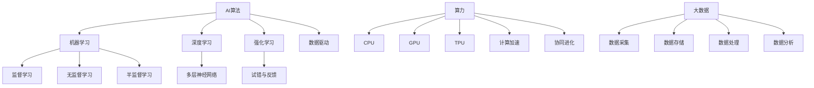

                 

### 背景介绍 Background Introduction

随着人工智能（AI）技术的飞速发展，AI算法、算力与大数据的结合已经成为推动现代科技进步的重要力量。从早期的机器学习算法，到如今深度学习的广泛应用，AI技术正逐渐渗透到我们生活的方方面面。与此同时，算力的提升和大数据的处理能力也在不断提升，为AI算法提供了强大的支撑。

#### AI的发展历程 Development of AI

人工智能的概念最早可以追溯到20世纪50年代。当时的科学家们开始探讨机器是否能够模仿人类智能进行思考、学习和决策。经历了初期的探索和理论构建，人工智能在20世纪80年代迎来了第一次热潮，以专家系统和逻辑推理为核心的技术得到了广泛应用。然而，受限于计算能力和数据资源，这一阶段的人工智能发展相对缓慢。

进入21世纪，随着互联网的普及和数据量的爆炸性增长，人工智能迎来了新的机遇。尤其是2006年深度学习（Deep Learning）的提出，为人工智能带来了新的突破。深度学习通过构建多层神经网络，能够自动学习并提取数据中的特征，从而实现更为复杂的任务。这一技术不仅在图像识别、语音识别等领域取得了显著成果，也在自然语言处理、自动驾驶等新兴领域展现了巨大的潜力。

#### 算力的提升 Increase of Computing Power

算力的提升是AI算法发展的基石。在早期，计算机的处理能力相对有限，无法支持复杂的人工智能算法。随着集成电路技术的进步，计算机的性能得到了大幅提升。特别是GPU（图形处理单元）和TPU（专用处理器单元）的出现，为深度学习算法提供了强大的计算支持。这些高性能计算设备能够高效地处理大量数据，使得深度学习算法的应用成为可能。

此外，分布式计算和云计算的兴起也为算力的提升提供了新的途径。通过将计算任务分布在多个节点上，分布式计算能够实现并行处理，大幅提高计算效率。而云计算平台则提供了强大的计算资源和存储能力，使得研究人员和企业能够更方便地获取和使用高性能计算资源。

#### 大数据的变革 Revolution of Big Data

大数据的出现为人工智能提供了丰富的数据资源。在互联网时代，人们产生的数据量以指数级增长，这些数据包括社交媒体、电子商务、物联网等各个领域。通过对这些大数据进行处理和分析，人工智能算法能够发现隐藏在数据中的模式和规律，从而提升其性能和效果。

大数据技术包括数据采集、存储、处理和分析等多个方面。在数据采集方面，传感器、摄像头、移动设备等设备能够实时收集大量数据。在数据存储方面，分布式存储系统如HDFS（Hadoop分布式文件系统）和云存储服务如AWS S3（Simple Storage Service）提供了高效的数据存储解决方案。在数据处理方面，MapReduce、Spark等大数据处理框架能够高效地处理大规模数据集。在数据分析方面，机器学习算法和数据挖掘技术被广泛应用于数据的分析和预测。

#### 三者的结合 Integration of AI, Computing Power, and Big Data

AI算法、算力和大数据的结合，使得人工智能技术能够实现更加智能化和高效化。首先，大数据提供了丰富的数据资源，为AI算法的训练和优化提供了基础。通过大量的数据，AI算法能够学习到更为复杂和细微的特征，从而提升其准确性和鲁棒性。

其次，算力的提升为AI算法的快速训练和推理提供了支持。高性能计算设备和分布式计算平台能够高效地处理大量数据，使得AI算法能够更快地迭代和优化。尤其是在深度学习领域，计算能力的提升直接影响到模型的训练速度和效果。

最后，AI算法的应用需要强大的算力和海量数据支撑。通过将大数据与高性能计算相结合，AI算法能够应用于更多实际场景，如智能交通、智能医疗、智能金融等。这些应用不仅提升了行业的效率和质量，也为社会带来了深刻的变革。

综上所述，AI算法、算力和大数据的结合，为人工智能技术的发展提供了强大的动力。随着技术的不断进步，我们可以预见，人工智能将在更多领域发挥重要作用，推动社会的进步和发展。

### 核心概念与联系 Core Concepts and Connections

为了深入理解AI算法、算力与大数据的结合，我们需要首先明确这几个核心概念及其相互之间的联系。

#### 1. AI算法

人工智能算法是人工智能技术的核心，它决定了AI系统能够执行何种任务和达到何种效果。常见的AI算法包括机器学习（Machine Learning）、深度学习（Deep Learning）、强化学习（Reinforcement Learning）等。

- **机器学习**：机器学习算法通过从数据中学习规律和模式，从而实现自动化的决策和预测。它包括监督学习、无监督学习和半监督学习等类型。
- **深度学习**：深度学习是机器学习的一个子领域，主要利用多层神经网络（Neural Networks）来提取数据中的特征。深度学习在图像识别、语音识别和自然语言处理等领域取得了显著成就。
- **强化学习**：强化学习通过试错和反馈机制来学习如何在复杂环境中做出最佳决策。

#### 2. 算力

算力是指计算机进行数据处理和计算的能力。它不仅包括传统CPU（中央处理器）的性能，还涵盖了GPU（图形处理单元）、TPU（张量处理单元）等专用硬件的性能。

- **CPU**：CPU是计算机的核心部件，负责执行操作系统指令和处理计算任务。
- **GPU**：GPU最初用于图形渲染，但由于其强大的并行计算能力，现在被广泛应用于深度学习和其他计算密集型任务。
- **TPU**：TPU是专为机器学习任务设计的硬件，能够高效地处理大规模神经网络。

#### 3. 大数据

大数据是指规模巨大、类型多样的数据集，无法用传统数据库工具进行有效管理和分析。大数据技术包括数据采集、存储、处理和分析等多个方面。

- **数据采集**：数据采集是指从各种来源收集数据，如传感器、网络日志、社交媒体等。
- **数据存储**：数据存储需要高效、可扩展的解决方案，如分布式文件系统（如HDFS）和云存储服务（如AWS S3）。
- **数据处理**：数据处理包括数据清洗、数据整合、数据转换等步骤，通常使用大数据处理框架（如MapReduce、Spark）进行。
- **数据分析**：数据分析旨在从数据中发现有价值的信息和模式，通常使用机器学习算法和数据挖掘技术。

#### 四者之间的联系

- **数据驱动**：大数据为AI算法提供了丰富的训练数据，使得算法能够通过学习大量数据来提升其性能。
- **计算加速**：算力的提升使得AI算法能够更快地训练和推理，从而加速模型的迭代和优化过程。
- **协同进化**：大数据和算力的结合推动了AI算法的进步，而不断进步的算法又需要更多的数据和更强的算力，这种协同进化推动了整个领域的快速发展。

为了更直观地展示这些核心概念之间的联系，我们可以使用Mermaid流程图来描述它们之间的关系。



通过这个Mermaid流程图，我们可以清晰地看到AI算法、算力和大数据之间的相互作用和依赖关系。理解这些核心概念及其联系，对于我们深入探讨AI算法、算力与大数据的结合具有重要的指导意义。

### 核心算法原理 & 具体操作步骤 Core Algorithm Principles & Step-by-Step Operations

在深入探讨AI算法、算力与大数据的结合时，我们首先要理解核心算法的原理，并了解其具体的操作步骤。本文将重点介绍一种常见的深度学习算法——卷积神经网络（Convolutional Neural Network，CNN），并详细描述其训练和推理的过程。

#### 卷积神经网络（CNN）原理

卷积神经网络是一种特殊的多层前馈神经网络，主要应用于图像识别、物体检测和图像生成等领域。其核心思想是通过卷积层、池化层和全连接层的组合，提取图像中的特征并进行分类。

- **卷积层（Convolutional Layer）**：卷积层通过卷积运算提取图像中的局部特征。卷积核（Kernel）在图像上滑动，通过权重矩阵计算输出特征图（Feature Map）。卷积运算的基本公式为：
  $$ \text{output}_{ij} = \sum_{k=1}^{C} w_{ikj} \times \text{input}_{ij} + b_j $$
  其中，$ \text{input}_{ij} $ 是输入特征图上的像素值，$ w_{ikj} $ 是卷积核的权重，$ b_j $ 是偏置项。

- **池化层（Pooling Layer）**：池化层通过下采样操作减小特征图的尺寸，从而减少参数数量，提高计算效率。常见的池化操作包括最大池化（Max Pooling）和平均池化（Average Pooling）。

- **全连接层（Fully Connected Layer）**：全连接层将卷积层和池化层提取的高层次特征映射到输出类别。其计算公式为：
  $$ \text{output} = \sum_{j=1}^{N} w_{ji} \times \text{input}_j + b $$
  其中，$ \text{input}_j $ 是上一层特征图上的像素值，$ w_{ji} $ 是全连接层的权重，$ b $ 是偏置项。

#### CNN的训练过程

训练卷积神经网络的过程主要包括以下几个步骤：

1. **数据预处理**：首先，对训练数据进行标准化处理，将像素值缩放到[0, 1]区间，以提高训练的稳定性。然后，进行数据增强操作，如随机裁剪、翻转和旋转等，以增加训练数据的多样性。

2. **初始化模型参数**：初始化卷积核、偏置项和全连接层的权重。常见的初始化方法包括随机初始化、高斯初始化和Xavier初始化等。

3. **前向传播**：输入一个训练样本，通过卷积层、池化层和全连接层的组合，计算输出结果。前向传播的过程可以用以下公式表示：
   $$ \text{output} = \text{activation}(\text{activation}(\text{activation}(...\text{activation}(\text{W} \times \text{X} + \text{b})...)}) $$
   其中，$ \text{X} $ 是输入特征矩阵，$ \text{W} $ 是各层的权重矩阵，$ \text{b} $ 是各层的偏置项，$ \text{activation} $ 是激活函数，如ReLU（Rectified Linear Unit）函数。

4. **计算损失**：将模型的输出结果与实际标签进行比较，计算损失函数的值。常见的损失函数包括均方误差（MSE，Mean Squared Error）和交叉熵（Cross-Entropy）等。

5. **反向传播**：通过反向传播算法，计算每一层权重和偏置项的梯度。反向传播的过程可以用以下公式表示：
   $$ \frac{\partial \text{loss}}{\partial \text{W}} = \sum_{i=1}^{N} \frac{\partial \text{output}_i}{\partial \text{W}} \times \frac{\partial \text{output}}{\partial \text{output}_i} $$
   $$ \frac{\partial \text{loss}}{\partial \text{b}} = \sum_{i=1}^{N} \frac{\partial \text{output}_i}{\partial \text{b}} \times \frac{\partial \text{output}}{\partial \text{output}_i} $$
   其中，$ N $ 是样本数量，$ \text{output}_i $ 是第$i$个样本的输出结果。

6. **更新模型参数**：根据计算得到的梯度，更新卷积核、偏置项和全连接层的权重。常用的优化算法包括梯度下降（Gradient Descent）和Adam优化器等。

7. **迭代优化**：重复上述步骤，不断迭代优化模型参数，直到满足停止条件（如达到预设的准确率或迭代次数）。

#### CNN的推理过程

推理过程是将训练好的模型应用于新的数据，预测其类别或特征的过程。推理过程主要包括以下几个步骤：

1. **数据预处理**：对输入数据进行标准化处理，使其符合模型的输入要求。

2. **前向传播**：将预处理后的数据输入到模型中，通过卷积层、池化层和全连接层的组合，计算输出结果。

3. **结果输出**：将输出结果与预先定义的类别或特征进行匹配，得到最终的预测结果。

通过上述步骤，我们可以实现卷积神经网络从数据输入到结果输出的完整过程。这种深度学习算法不仅具有强大的特征提取能力，而且在图像识别、物体检测和图像生成等领域取得了显著的成果。随着算力的提升和大数据技术的发展，卷积神经网络的应用前景将更加广阔。

### 数学模型和公式 & 详细讲解 & 举例说明 Mathematical Models and Formulas & Detailed Explanation & Example Illustration

为了深入理解卷积神经网络（CNN）的工作原理，我们需要详细介绍其背后的数学模型和公式。在本节中，我们将首先介绍卷积神经网络中的关键数学公式，然后通过具体示例进行详细讲解。

#### 关键数学公式

1. **卷积运算**

卷积运算是卷积神经网络中的核心操作，用于提取图像中的特征。卷积运算的基本公式如下：

$$
\text{output}_{ij} = \sum_{k=1}^{C} w_{ikj} \times \text{input}_{ij} + b_j
$$

其中，$\text{output}_{ij}$ 是卷积层输出的特征图上的像素值，$w_{ikj}$ 是卷积核的权重，$\text{input}_{ij}$ 是输入特征图上的像素值，$b_j$ 是偏置项。$C$ 表示卷积核的数量。

2. **激活函数**

激活函数用于引入非线性特性，常见的激活函数包括ReLU（Rectified Linear Unit）函数：

$$
\text{ReLU}(x) =
\begin{cases}
x, & \text{if } x > 0 \\
0, & \text{if } x \leq 0
\end{cases}
$$

ReLU函数能够加快神经网络的学习速度，同时避免梯度消失问题。

3. **前向传播**

卷积神经网络的前向传播过程包括多个卷积层和池化层，每一层的输出可以表示为：

$$
\text{output}_{l} = \text{activation}\left(\text{W}_{l} \times \text{input}_{l} + b_l\right)
$$

其中，$\text{output}_{l}$ 是第$l$层的输出，$\text{W}_{l}$ 是第$l$层的权重矩阵，$\text{input}_{l}$ 是第$l$层的输入，$b_l$ 是第$l$层的偏置项，$\text{activation}$ 是激活函数。

4. **反向传播**

卷积神经网络的反向传播过程用于计算损失函数的梯度，从而更新模型参数。反向传播的基本步骤如下：

$$
\frac{\partial \text{loss}}{\partial \text{W}_{l}} = \sum_{i=1}^{N} \frac{\partial \text{output}_i}{\partial \text{output}_l} \times \frac{\partial \text{output}_l}{\partial \text{W}_{l}}
$$

$$
\frac{\partial \text{loss}}{\partial \text{b}_{l}} = \sum_{i=1}^{N} \frac{\partial \text{output}_i}{\partial \text{output}_l} \times \frac{\partial \text{output}_l}{\partial \text{b}_{l}}
$$

其中，$N$ 是样本数量，$\text{output}_i$ 是第$i$个样本的输出结果，$\frac{\partial \text{output}_i}{\partial \text{output}_l}$ 是输出对权重的梯度，$\frac{\partial \text{output}_l}{\partial \text{W}_{l}}$ 是权重对输出的梯度。

#### 具体示例

假设我们有一个2x2的输入特征图和一个3x3的卷积核，卷积核的权重矩阵为：

$$
W = \begin{bmatrix}
1 & 0 & 1 \\
0 & 1 & 0 \\
1 & 0 & 1
\end{bmatrix}
$$

输入特征图：

$$
X = \begin{bmatrix}
1 & 0 \\
0 & 1
\end{bmatrix}
$$

偏置项：

$$
b = \begin{bmatrix}
1 \\
1 \\
1
\end{bmatrix}
$$

首先，我们进行卷积运算：

$$
\text{output}_{11} = (1 \times 1 + 0 \times 0 + 1 \times 1) + 1 = 3 \\
\text{output}_{12} = (1 \times 0 + 0 \times 1 + 1 \times 0) + 1 = 2 \\
\text{output}_{21} = (0 \times 1 + 1 \times 0 + 0 \times 1) + 1 = 2 \\
\text{output}_{22} = (0 \times 0 + 1 \times 1 + 0 \times 0) + 1 = 2
$$

得到的结果是：

$$
\text{output} = \begin{bmatrix}
3 & 2 \\
2 & 2
\end{bmatrix}
$$

然后，我们应用ReLU激活函数：

$$
\text{output}_{ReLU} = \begin{bmatrix}
3 & 2 \\
2 & 2
\end{bmatrix}
$$

因为所有的输出值都大于0，ReLU函数不会改变输出值。

通过这个示例，我们可以看到卷积运算和ReLU激活函数如何应用于一个简单的输入特征图，从而提取出特征。这种操作在深度学习中重复进行，以逐步提取图像中的高层次特征。

#### 总结

通过上述数学模型和公式的详细讲解，我们可以更深入地理解卷积神经网络的工作原理。卷积运算和激活函数的组合，使得卷积神经网络能够有效地提取图像特征，从而实现图像识别、物体检测等任务。随着深度学习技术的发展，这些数学模型和公式将继续在人工智能领域发挥重要作用。

### 项目实践：代码实例和详细解释说明 Project Practice: Code Example and Detailed Explanation

为了更好地理解AI算法、算力与大数据结合的实际应用，我们将通过一个具体的代码实例来展示如何使用卷积神经网络（CNN）进行图像分类。在这个项目中，我们将使用Python和TensorFlow框架，实现一个简单的CNN模型，并详细解释每一步的代码实现。

#### 开发环境搭建

首先，我们需要搭建开发环境。以下是所需的环境和安装步骤：

1. **Python**：确保安装了Python 3.6或更高版本。
2. **TensorFlow**：安装TensorFlow 2.x版本，可以使用以下命令安装：
   ```bash
   pip install tensorflow
   ```

3. **NumPy**：用于矩阵运算，可以使用以下命令安装：
   ```bash
   pip install numpy
   ```

4. **Matplotlib**：用于绘图，可以使用以下命令安装：
   ```bash
   pip install matplotlib
   ```

安装完成后，我们就可以开始编写代码了。

#### 源代码详细实现

下面是完整的代码实现，我们将分步骤进行解释。

```python
import tensorflow as tf
from tensorflow.keras import datasets, layers, models
import matplotlib.pyplot as plt

# 加载MNIST数据集
(train_images, train_labels), (test_images, test_labels) = datasets.mnist.load_data()

# 数据预处理
train_images = train_images.reshape((60000, 28, 28, 1)).astype('float32') / 255
test_images = test_images.reshape((10000, 28, 28, 1)).astype('float32') / 255

# 创建CNN模型
model = models.Sequential()
model.add(layers.Conv2D(32, (3, 3), activation='relu', input_shape=(28, 28, 1)))
model.add(layers.MaxPooling2D((2, 2)))
model.add(layers.Conv2D(64, (3, 3), activation='relu'))
model.add(layers.MaxPooling2D((2, 2)))
model.add(layers.Conv2D(64, (3, 3), activation='relu'))

# 添加全连接层
model.add(layers.Flatten())
model.add(layers.Dense(64, activation='relu'))
model.add(layers.Dense(10, activation='softmax'))

# 编译模型
model.compile(optimizer='adam',
              loss='sparse_categorical_crossentropy',
              metrics=['accuracy'])

# 训练模型
model.fit(train_images, train_labels, epochs=5, batch_size=64)

# 评估模型
test_loss, test_acc = model.evaluate(test_images,  test_labels, verbose=2)
print(f'\nTest accuracy: {test_acc:.4f}')

# 可视化结果
plt.figure()
plt.subplot(2, 1, 1)
plt.imshow(train_images[0], cmap=plt.cm.binary)
plt.xticks([])
plt.yticks([])
plt.grid(False)
plt.xlabel('True Label: %d' % train_labels[0])
plt.subplot(2, 1, 2)
plt.imshow(model.predict(test_images[0].reshape(1, 28, 28, 1))[0].argmax(), cmap=plt.cm.binary)
plt.xticks([])
plt.yticks([])
plt.grid(False)
plt.xlabel('Predicted Label: %d' % model.predict(test_images[0].reshape(1, 28, 28, 1))[0].argmax())
plt.show()
```

#### 代码解读与分析

1. **数据加载和预处理**：

   ```python
   (train_images, train_labels), (test_images, test_labels) = datasets.mnist.load_data()
   train_images = train_images.reshape((60000, 28, 28, 1)).astype('float32') / 255
   test_images = test_images.reshape((10000, 28, 28, 1)).astype('float32') / 255
   ```

   这里我们使用了TensorFlow内置的MNIST数据集，并将其分为训练集和测试集。数据预处理步骤包括将图像数据展平到28x28的维度，并缩放到[0, 1]区间，以提高模型的训练效果。

2. **创建CNN模型**：

   ```python
   model = models.Sequential()
   model.add(layers.Conv2D(32, (3, 3), activation='relu', input_shape=(28, 28, 1)))
   model.add(layers.MaxPooling2D((2, 2)))
   model.add(layers.Conv2D(64, (3, 3), activation='relu'))
   model.add(layers.MaxPooling2D((2, 2)))
   model.add(layers.Conv2D(64, (3, 3), activation='relu'))
   ```

   我们使用`Sequential`模型来堆叠多个层。首先添加一个32个卷积核、大小为3x3的卷积层，使用ReLU激活函数。然后添加一个2x2的最大池化层，用于下采样。接下来，我们重复这个过程，逐渐增加卷积核的数量和复杂性，以提取图像中的更复杂特征。

3. **添加全连接层**：

   ```python
   model.add(layers.Flatten())
   model.add(layers.Dense(64, activation='relu'))
   model.add(layers.Dense(10, activation='softmax'))
   ```

   将卷积层输出的特征进行展平，然后添加一个64个神经元的全连接层和另一个10个神经元的全连接层，最后一层使用softmax激活函数，用于进行类别预测。

4. **编译模型**：

   ```python
   model.compile(optimizer='adam',
                 loss='sparse_categorical_crossentropy',
                 metrics=['accuracy'])
   ```

   使用adam优化器和sparse_categorical_crossentropy损失函数编译模型。sparse_categorical_crossentropy适用于多类别分类问题。

5. **训练模型**：

   ```python
   model.fit(train_images, train_labels, epochs=5, batch_size=64)
   ```

   使用训练数据集训练模型，设置5个训练周期和每个周期批量大小为64。

6. **评估模型**：

   ```python
   test_loss, test_acc = model.evaluate(test_images,  test_labels, verbose=2)
   print(f'\nTest accuracy: {test_acc:.4f}')
   ```

   使用测试数据集评估模型，输出测试准确率。

7. **可视化结果**：

   ```python
   plt.figure()
   plt.subplot(2, 1, 1)
   plt.imshow(train_images[0], cmap=plt.cm.binary)
   plt.xticks([])
   plt.yticks([])
   plt.grid(False)
   plt.xlabel('True Label: %d' % train_labels[0])
   plt.subplot(2, 1, 2)
   plt.imshow(model.predict(test_images[0].reshape(1, 28, 28, 1))[0].argmax(), cmap=plt.cm.binary)
   plt.xticks([])
   plt.yticks([])
   plt.grid(False)
   plt.xlabel('Predicted Label: %d' % model.predict(test_images[0].reshape(1, 28, 28, 1))[0].argmax())
   plt.show()
   ```

   通过可视化展示模型的预测结果，并与真实标签进行比较。

通过这个简单的项目实例，我们可以看到如何使用卷积神经网络进行图像分类。这一过程涵盖了从数据加载、模型构建、训练到评估和可视化的完整流程。在实际应用中，我们可以根据具体任务需求调整网络结构、训练参数等，以实现更高效的模型训练和预测。

### 实际应用场景 Real-world Applications

随着AI算法、算力和大数据技术的不断进步，卷积神经网络（CNN）的应用已经渗透到各个行业和领域，带来了巨大的影响和变革。以下是一些典型的实际应用场景：

#### 1. 图像识别与物体检测

图像识别和物体检测是CNN最广泛应用的领域之一。在自动驾驶汽车中，CNN用于识别道路标志、行人和其他车辆，从而提高行驶安全。在安防监控领域，CNN被用于实时监控视频流，自动识别和报警异常行为，如偷窃或火灾。此外，CNN在医疗影像分析中也发挥着重要作用，如通过识别X光片中的骨折或肿瘤，帮助医生做出准确的诊断。

#### 2. 自然语言处理

虽然CNN最初是为图像处理设计的，但其在自然语言处理（NLP）领域也取得了显著成果。例如，CNN被用于情感分析，通过分析文本中的情感倾向，帮助商家了解用户反馈。在文本分类任务中，CNN能够自动识别文本的主题和类别，从而提高信息过滤和推荐的准确性。此外，CNN还在机器翻译、文本生成等领域发挥了重要作用。

#### 3. 推荐系统

推荐系统是另一个受益于CNN技术的领域。通过分析用户的浏览和购买历史数据，CNN可以自动发现用户兴趣，从而提供个性化的推荐。例如，在线购物平台可以使用CNN分析用户的购物车和浏览记录，推荐相关的商品。在社交媒体平台上，CNN可以帮助推荐用户可能感兴趣的内容，提高用户粘性和活跃度。

#### 4. 金融风控

在金融领域，CNN被用于信用评分和风险控制。通过分析客户的信用记录、财务状况和其他相关数据，CNN可以帮助银行和金融机构评估客户的信用风险，从而做出更明智的信贷决策。此外，CNN还可以用于欺诈检测，通过分析交易行为，自动识别和报警可疑交易，降低金融风险。

#### 5. 医疗诊断

CNN在医疗诊断中的应用越来越广泛。通过分析医学影像，如X光片、CT扫描和MRI，CNN可以帮助医生识别疾病和异常，从而提高诊断的准确性和效率。例如，在肺癌筛查中，CNN能够自动识别肺结节，为医生提供初步的诊断建议。在脑癌诊断中，CNN可以分析MRI图像，帮助医生更准确地判断肿瘤的类型和扩散情况。

#### 6. 娱乐与游戏

在娱乐和游戏领域，CNN也被广泛应用。例如，在游戏开发中，CNN可以用于生成游戏角色的外观和场景，提高游戏的真实感和趣味性。在虚拟现实中，CNN可以帮助生成逼真的场景和角色，提升用户体验。此外，CNN还可以用于音乐生成和艺术创作，通过分析音乐和艺术作品的特征，生成新的音乐和艺术作品。

#### 7. 农业

在农业领域，CNN被用于作物监测和病虫害识别。通过分析卫星图像和无人机采集的数据，CNN可以帮助农民实时监测作物的生长状态，及时发现病虫害，采取相应的防治措施，提高农作物的产量和质量。

通过以上实际应用场景，我们可以看到卷积神经网络（CNN）在各个领域的重要作用。随着技术的不断进步，CNN的应用将更加广泛和深入，为社会发展和人类生活带来更多的便利和效益。

### 工具和资源推荐 Tools and Resources Recommendations

在深入研究和实践AI算法、算力与大数据结合的过程中，选择合适的工具和资源是非常重要的。以下是一些推荐的工具和资源，包括学习资源、开发工具框架和相关的论文著作，这些资源将有助于您更好地掌握相关技术和应用。

#### 学习资源

1. **书籍**：
   - 《深度学习》（Deep Learning）by Ian Goodfellow, Yoshua Bengio, and Aaron Courville
   - 《Python机器学习》（Python Machine Learning）by Sebastian Raschka
   - 《数据科学入门》（Introduction to Data Science）by Joel Grus

2. **在线课程**：
   - Coursera上的《深度学习》课程（由斯坦福大学教授Andrew Ng主讲）
   - edX上的《人工智能基础》（Introduction to Artificial Intelligence）课程
   - Udacity的《深度学习工程师纳米学位》

3. **博客和网站**：
   - Medium上的机器学习和深度学习博客
   - Fast.ai的博客，提供实用的深度学习教程
   - TensorFlow官方文档和教程

4. **开源项目和库**：
   - TensorFlow和PyTorch，是深度学习领域最流行的开源库
   - Keras，是一个高级神经网络API，可以简化深度学习模型的构建和训练过程
   - Scikit-learn，提供了广泛的机器学习算法和工具

#### 开发工具框架

1. **TensorFlow**：由Google开发，是一个用于机器学习和深度学习的开源平台，提供了丰富的工具和API，适用于各种规模的模型开发。

2. **PyTorch**：由Facebook开发，是一个基于Python的科学计算框架，其动态计算图机制使得模型构建和调试更加灵活。

3. **Keras**：是一个高级神经网络API，能够在TensorFlow和Theano后端运行，使得深度学习模型的构建和训练更加简单和高效。

4. **Docker**：用于容器化应用的工具，可以帮助开发者在不同的环境中一致地构建和运行应用程序，非常适合于分布式计算和数据处理。

#### 相关论文著作

1. **《A Quick Introduction to Theano》**：介绍如何使用Theano进行深度学习，Theano是一个已经停止维护的深度学习库。

2. **《Distributed Representations of Words and Phrases and Their Compositionality》**：由Yoshua Bengio等人在2013年发表，介绍了词向量和序列模型的早期研究。

3. **《Learning Deep Architectures for AI》**：由Yoshua Bengio等人在2012年发表，讨论了深度学习模型的架构和学习方法。

4. **《Convolutional Networks for Visual Recognition》**：由Geoffrey Hinton等人在2012年发表，介绍了卷积神经网络在图像识别任务中的应用。

通过以上工具和资源的推荐，您可以系统地学习和实践AI算法、算力与大数据结合的相关知识，不断提升自己的技术水平。

### 总结 Conclusion

本文通过详细的步骤和实例，深入探讨了AI算法、算力与大数据的结合。我们首先回顾了AI的发展历程和算力的提升，然后介绍了大数据的变革及其在AI算法中的应用。接着，我们详细讲解了卷积神经网络（CNN）的核心算法原理和操作步骤，并通过实际项目实践展示了CNN在图像分类任务中的应用。此外，我们还讨论了CNN在实际应用场景中的广泛影响，并推荐了一系列学习资源和开发工具框架。

随着技术的不断进步，AI算法、算力和大数据的结合将推动人工智能技术在更多领域的应用。未来，我们可能会看到更加高效、智能和多样化的AI系统，为人类带来更多的便利和改变。然而，这也带来了新的挑战，如数据隐私、安全性和伦理问题等。因此，我们需要持续关注这些挑战，并积极探索解决方案，以确保人工智能技术的健康发展。

### 附录：常见问题与解答 Appendices: Common Questions and Answers

在本节中，我们将回答一些关于AI算法、算力与大数据结合的常见问题。

**Q1：什么是深度学习？**

A1：深度学习是机器学习的一个子领域，主要利用多层神经网络（Neural Networks）来提取数据中的特征。深度学习通过模拟人脑神经网络的结构和工作原理，从大量数据中自动学习并提取有价值的特征，从而实现复杂的任务，如图像识别、语音识别和自然语言处理等。

**Q2：为什么GPU和TPU比CPU更适合深度学习？**

A2：GPU（图形处理单元）和TPU（张量处理单元）比CPU更适合深度学习，主要因为它们具有强大的并行计算能力。深度学习算法涉及大量的矩阵运算和向量操作，而GPU和TPU通过并行处理这些运算，能够大幅提高计算速度。此外，GPU和TPU专门优化了深度学习相关的计算，使得它们在处理深度学习任务时更加高效。

**Q3：如何选择合适的大数据处理框架？**

A3：选择合适的大数据处理框架主要取决于具体的应用场景和需求。以下是几个常见的大数据处理框架及其特点：

- **Hadoop**：适合处理大规模分布式数据集，具有高可靠性和容错性，但开发复杂度较高。
- **Spark**：提供了丰富的数据处理和分析功能，具有高性能和易用性，适用于流数据和批处理。
- **Flink**：适用于实时数据处理和流处理，具有高效的数据处理能力和灵活的数据流模型。
- **Hive**：适合进行结构化数据处理和分析，具有较高的查询性能和可扩展性。

根据实际需求，可以选择合适的框架来优化数据处理过程。

**Q4：深度学习模型如何优化？**

A4：深度学习模型的优化包括模型结构优化和训练参数调整。以下是几种常见的模型优化方法：

- **模型结构优化**：通过调整网络结构，如增加层数、调整卷积核大小等，来提高模型的性能和泛化能力。
- **训练参数调整**：通过调整学习率、批次大小、正则化参数等训练参数，来优化模型收敛速度和避免过拟合。
- **数据增强**：通过数据增强技术，如随机裁剪、旋转、翻转等，来增加训练数据的多样性，提高模型的鲁棒性。
- **迁移学习**：通过使用预训练模型，利用预训练模型中的特征提取能力，来加速新任务的训练过程。

通过综合运用这些方法，可以有效地优化深度学习模型，提高其性能和效果。

**Q5：大数据和AI结合的安全性问题如何解决？**

A5：大数据和AI结合的安全性问题主要包括数据隐私、模型安全和算法透明性等方面。以下是几种常见的解决方法：

- **数据加密**：对敏感数据进行加密处理，确保数据在传输和存储过程中的安全性。
- **差分隐私**：通过添加噪声来保护数据隐私，确保无法通过数据分析识别出个别数据。
- **模型加密**：对深度学习模型进行加密，确保模型在训练和推理过程中不会被恶意篡改。
- **算法透明性**：通过透明化的算法设计和解释性模型，提高模型的可信度和用户理解。

通过综合运用这些方法，可以在确保大数据和AI结合的安全性的同时，保障数据的隐私和安全。

### 扩展阅读 & 参考资料 Further Reading & References

为了更深入地了解AI算法、算力与大数据结合的相关知识，以下是一些推荐的扩展阅读和参考资料：

1. **《深度学习》（Deep Learning）**：Ian Goodfellow, Yoshua Bengio, and Aaron Courville 著，详细介绍了深度学习的基本概念、算法和应用。

2. **《大数据之路：腾讯实践》**：腾讯大数据团队 著，分享了腾讯在大数据处理和AI应用方面的实践经验和案例。

3. **《机器学习实战》**：Peter Harrington 著，通过实际案例介绍机器学习算法的原理和应用。

4. **《大数据技术导论》**：刘建明 著，全面介绍了大数据技术的基本概念、架构和关键技术。

5. **《深度学习推荐系统》**：Vikas Nori 著，探讨了深度学习在推荐系统中的应用和实现。

6. **《AI技术指南》**：刘铁岩 著，系统地介绍了AI技术的基本概念、算法和应用。

7. **TensorFlow官方文档**：[TensorFlow Documentation](https://www.tensorflow.org/)，提供了详细的API文档和教程。

8. **PyTorch官方文档**：[PyTorch Documentation](https://pytorch.org/docs/stable/index.html)，介绍了PyTorch的用法和功能。

9. **Hadoop官方文档**：[Apache Hadoop Documentation](https://hadoop.apache.org/docs/stable/hadoop-project-dist/hadoop-common/)，提供了Hadoop的基本概念和操作指南。

10. **Spark官方文档**：[Apache Spark Documentation](https://spark.apache.org/docs/latest/)，介绍了Spark的架构和API使用。

通过阅读这些书籍和文档，您可以进一步深化对AI算法、算力与大数据结合的理解，并掌握相关技术的实际应用。此外，还可以关注相关领域的研究论文和最新进展，以保持对技术前沿的了解。

