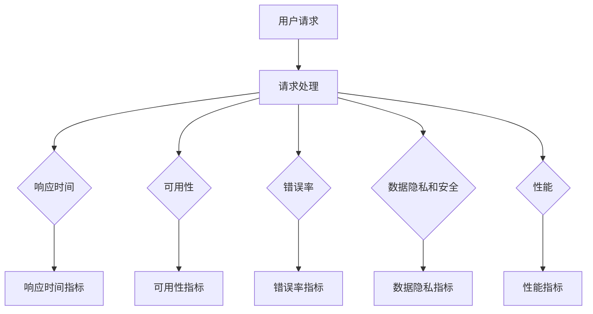

                 

### 1. 背景介绍

AI系统作为现代科技的核心驱动力，已经成为各行各业不可或缺的部分。无论是自动驾驶、智能医疗诊断、金融风控，还是智能制造，AI系统的应用已经深刻改变了我们的工作和生活方式。在这样的背景下，如何确保AI系统的高效、稳定和安全运行，成为了一个至关重要的问题。

服务级别协议（Service Level Agreement，简称SLA）作为一种标准化合同，旨在明确服务提供方和用户之间的权利与义务，是确保服务质量的重要手段。在AI系统的开发和运维过程中，SLA的设计显得尤为重要。它不仅关乎系统的性能、可靠性和安全性，还直接影响到用户满意度、商业成功和合规性。

AI系统SLA的设计需要考虑多个因素。首先，AI系统的复杂性和多样性决定了SLA的设计不能一概而论，而需要根据具体的应用场景和业务需求进行定制。其次，SLA的内容应该涵盖系统的各个方面，包括响应时间、错误率、数据隐私保护、系统可用性等。最后，SLA的执行和监控需要依赖先进的技术手段，如自动化工具和监控平台，以确保协议的严格执行和持续优化。

本文旨在探讨AI系统服务级别协议的设计原则、核心要素和实施方法。通过逐步分析推理，本文将揭示SLA设计的内在逻辑和实际操作步骤，帮助读者深入了解和掌握这一关键技术。

在接下来的章节中，我们将首先介绍AI系统SLA的核心概念，包括其定义、类型和重要性。然后，我们将详细探讨SLA设计的具体步骤和方法，以及如何通过数学模型和公式来量化和评估SLA的关键指标。此外，本文还将结合实际项目案例，展示如何通过代码实例和运行结果来验证SLA的有效性。最后，我们将探讨AI系统SLA在实际应用场景中的挑战和解决方案，并提供一些实用的工具和资源推荐，以便读者进一步学习和实践。

通过本文的阅读，读者将能够全面了解AI系统服务级别协议的设计要点，掌握其核心原理和方法，为实际应用提供有力指导。

### 2. 核心概念与联系

#### 定义与类型

服务级别协议（Service Level Agreement，简称SLA）是一种合同，用于明确服务提供方和用户之间的服务标准和责任。它通常涉及服务质量的关键指标，如响应时间、可用性、错误率等，以及服务提供方应如何响应和处理潜在问题。

SLA可以分为以下几种类型：

1. **响应时间SLA**：规定系统在接收到请求后必须在多长时间内响应，适用于需要实时反馈的场景。
2. **可用性SLA**：确保系统在指定时间段内正常运行的比例，常用指标是“系统正常运行时间”（Uptime）。
3. **错误率SLA**：定义系统在特定时间内出现错误的频率，例如每百万次请求中错误请求的数量。
4. **数据隐私和安全SLA**：确保用户数据的安全性和隐私性，例如数据加密、访问控制等。
5. **性能SLA**：涉及系统的整体性能指标，如CPU使用率、内存使用率、带宽使用率等。

#### 核心概念原理与架构

为了更好地理解SLA，我们需要探讨其核心概念原理和系统架构。下面是一个简化的Mermaid流程图，用于描述AI系统SLA的核心组件和流程：



- **用户请求**：用户通过接口向AI系统发送请求。
- **请求处理**：系统接收到请求后进行处理，这可能包括数据预处理、模型调用、结果生成等步骤。
- **响应时间**：系统需要在规定时间内完成处理并发送响应，例如毫秒级或秒级响应。
- **可用性**：系统在一段时间内保持正常运行，如99.9%的高可用性。
- **错误率**：系统在处理请求时发生错误的频率，需要尽可能降低。
- **数据隐私和安全**：确保用户数据在系统中的安全和隐私，防止数据泄露和未经授权的访问。
- **性能**：系统的整体性能，包括CPU、内存、网络带宽等资源的利用率。

通过上述流程图，我们可以看到SLA的核心组件是如何相互作用和协同工作的，从而确保AI系统的服务质量。

#### SLA在AI系统中的作用

SLA在AI系统中扮演着至关重要的角色，主要表现在以下几个方面：

1. **明确责任**：通过SLA，服务提供方和用户可以明确各自的责任和义务，降低由于责任不清导致的服务中断或纠纷。
2. **提升服务质量**：SLA规定了系统的各项性能指标和标准，通过监控和评估这些指标，服务提供方可以持续优化系统，提升服务质量。
3. **增强用户信心**：明确的SLA可以让用户对系统的性能和可靠性有清晰的预期，从而增强用户信心，促进系统的广泛应用。
4. **保障合规性**：在涉及用户隐私和数据安全的领域，SLA可以帮助服务提供方遵守相关法规和标准，降低合规风险。
5. **优化成本管理**：通过量化和监控SLA指标，服务提供方可以更精准地分配资源，优化成本管理。

总之，SLA是确保AI系统高质量运行的关键工具，其核心概念原理和系统架构的深入理解对于设计和实施SLA至关重要。在接下来的章节中，我们将进一步探讨SLA的设计步骤和方法，以及如何通过数学模型和公式来评估SLA的关键指标。

### 3. 核心算法原理 & 具体操作步骤

#### 响应时间算法原理

响应时间是AI系统SLA中最关键的性能指标之一，它直接关系到用户的使用体验。响应时间算法的核心目标是在系统资源有限的情况下，确保每个请求都能在规定时间内得到处理。以下是几种常见的响应时间算法原理：

1. **平均响应时间算法**：该算法通过计算所有请求的平均响应时间来评估系统性能。公式如下：
   \[
   \text{平均响应时间} = \frac{\sum (\text{每个请求的响应时间})}{\text{请求总数}}
   \]
   平均响应时间算法简单易行，但无法反映系统在高负载情况下的性能。

2. **最大响应时间算法**：该算法通过计算所有请求中的最大响应时间来评估系统性能。公式如下：
   \[
   \text{最大响应时间} = \max (\text{每个请求的响应时间})
   \]
   最大响应时间算法能够直观地反映系统在高负载情况下的性能，但容易受到个别异常值的影响。

3. **加权响应时间算法**：该算法通过给每个请求赋予不同的权重来计算加权平均响应时间。公式如下：
   \[
   \text{加权平均响应时间} = \frac{\sum (\text{每个请求的响应时间} \times \text{权重})}{\sum \text{权重}}
   \]
   加权响应时间算法可以更准确地反映系统在处理不同请求时的性能。

#### 响应时间操作步骤

以下是响应时间算法的具体操作步骤：

1. **数据收集**：收集系统在一定时间段内的所有请求及其响应时间数据。

2. **预处理**：对收集到的数据进行处理，例如去除异常值、填补缺失值等。

3. **计算平均响应时间**：使用平均响应时间算法计算所有请求的平均响应时间。

4. **计算最大响应时间**：使用最大响应时间算法计算所有请求中的最大响应时间。

5. **计算加权平均响应时间**：根据每个请求的权重，使用加权响应时间算法计算加权平均响应时间。

6. **评估结果**：根据计算结果，评估系统的响应时间性能，并与SLA中的规定进行对比。

#### 可用性算法原理

可用性是另一个重要的性能指标，它衡量系统在一段时间内保持正常运行的能力。以下是几种常见的可用性算法原理：

1. **简单可用性算法**：该算法通过计算系统在一段时间内正常运行的时间比例来评估可用性。公式如下：
   \[
   \text{可用性} = \frac{\text{正常运行时间}}{\text{总时间}}
   \]
   简单可用性算法计算简单，但无法反映系统在处理故障时的恢复速度。

2. **加权可用性算法**：该算法通过给不同时间段赋予不同的权重来计算加权可用性。公式如下：
   \[
   \text{加权可用性} = \frac{\sum (\text{每个时间段的正常运行时间} \times \text{权重})}{\sum \text{权重}}
   \]
   加权可用性算法可以更准确地反映系统在不同时间段内的性能。

3. **故障恢复时间算法**：该算法通过计算系统在发生故障后恢复正常运行所需的时间来评估系统的恢复能力。公式如下：
   \[
   \text{故障恢复时间} = \max (\text{每个故障的恢复时间})
   \]
   故障恢复时间算法可以直观地反映系统在处理故障时的响应速度。

#### 可用性操作步骤

以下是可用性算法的具体操作步骤：

1. **数据收集**：收集系统在一定时间段内的正常运行时间和故障恢复时间数据。

2. **预处理**：对收集到的数据进行处理，例如去除异常值、填补缺失值等。

3. **计算简单可用性**：使用简单可用性算法计算系统的简单可用性。

4. **计算加权可用性**：根据每个时间段的权重，使用加权可用性算法计算加权可用性。

5. **计算故障恢复时间**：使用故障恢复时间算法计算系统的故障恢复时间。

6. **评估结果**：根据计算结果，评估系统的可用性性能，并与SLA中的规定进行对比。

#### 错误率算法原理

错误率是衡量系统在处理请求时出现错误的频率的指标，是评估系统稳定性的重要参数。以下是几种常见的错误率算法原理：

1. **简单错误率算法**：该算法通过计算系统在一定时间内出现错误的次数与总请求次数的比例来评估错误率。公式如下：
   \[
   \text{错误率} = \frac{\text{错误次数}}{\text{请求总数}}
   \]
   简单错误率算法计算简单，但无法反映系统在高负载情况下的稳定性。

2. **加权错误率算法**：该算法通过给不同请求赋予不同的权重来计算加权错误率。公式如下：
   \[
   \text{加权错误率} = \frac{\sum (\text{每个请求的错误次数} \times \text{权重})}{\sum \text{权重}}
   \]
   加权错误率算法可以更准确地反映系统在处理不同请求时的稳定性。

3. **错误类型分布算法**：该算法通过计算不同类型错误的频率来评估系统的错误类型分布。公式如下：
   \[
   \text{错误类型频率} = \frac{\text{每个错误类型的次数}}{\text{总错误次数}}
   \]
   错误类型分布算法可以帮助识别系统中常见的错误类型，从而有针对性地进行优化。

#### 错误率操作步骤

以下是错误率算法的具体操作步骤：

1. **数据收集**：收集系统在一定时间段内的错误次数和总请求次数数据。

2. **预处理**：对收集到的数据进行处理，例如去除异常值、填补缺失值等。

3. **计算简单错误率**：使用简单错误率算法计算系统的简单错误率。

4. **计算加权错误率**：根据每个请求的权重，使用加权错误率算法计算加权错误率。

5. **计算错误类型分布**：使用错误类型分布算法计算不同类型错误的频率。

6. **评估结果**：根据计算结果，评估系统的错误率性能，并与SLA中的规定进行对比。

通过上述算法和步骤，我们可以系统地评估AI系统的响应时间、可用性和错误率，从而确保系统的高质量运行。在下一章节中，我们将进一步探讨如何通过数学模型和公式来量化和评估这些性能指标。

### 4. 数学模型和公式 & 详细讲解 & 举例说明

在评估AI系统的服务级别协议（SLA）时，数学模型和公式是不可或缺的工具。这些模型和公式不仅能够帮助我们量化系统的性能指标，还能提供详细的计算方法和步骤，以便我们更准确地评估和优化系统。下面，我们将详细讲解几个关键的性能指标及其对应的数学模型和公式，并通过具体的例子来说明如何使用这些公式进行计算。

#### 响应时间模型和公式

响应时间（Response Time）是评估系统性能的重要指标之一，它反映了系统处理请求的速度。以下是几个常用的响应时间模型和公式：

1. **平均响应时间模型**：
   \[
   \bar{t} = \frac{1}{n} \sum_{i=1}^{n} t_i
   \]
   其中，\(\bar{t}\) 是平均响应时间，\(n\) 是请求总数，\(t_i\) 是第 \(i\) 个请求的响应时间。

   **例子**：假设我们记录了10个请求的响应时间（秒），分别为1, 2, 3, 4, 5, 6, 7, 8, 9, 10，那么平均响应时间计算如下：
   \[
   \bar{t} = \frac{1+2+3+4+5+6+7+8+9+10}{10} = \frac{55}{10} = 5.5 \text{秒}
   \]

2. **最大响应时间模型**：
   \[
   \max{t} = \max \{ t_1, t_2, ..., t_n \}
   \]
   其中，\(\max{t}\) 是最大响应时间。

   **例子**：如果上面的响应时间中最大的是10秒，那么最大响应时间就是10秒。

3. **加权平均响应时间模型**：
   \[
   \bar{t}_w = \frac{\sum_{i=1}^{n} w_i t_i}{\sum_{i=1}^{n} w_i}
   \]
   其中，\(\bar{t}_w\) 是加权平均响应时间，\(w_i\) 是第 \(i\) 个请求的权重。

   **例子**：假设3个请求的响应时间分别为2秒、3秒和5秒，权重分别为1、2和3，那么加权平均响应时间计算如下：
   \[
   \bar{t}_w = \frac{1 \times 2 + 2 \times 3 + 3 \times 5}{1 + 2 + 3} = \frac{2 + 6 + 15}{6} = \frac{23}{6} \approx 3.83 \text{秒}
   \]

#### 可用性模型和公式

可用性（Availability）是衡量系统长时间运行能力的指标。以下是几个常用的可用性模型和公式：

1. **简单可用性模型**：
   \[
   A = \frac{T_u}{T_t}
   \]
   其中，\(A\) 是可用性，\(T_u\) 是正常运行时间，\(T_t\) 是总时间。

   **例子**：如果一个系统在10小时内正常运行了9小时，那么其可用性计算如下：
   \[
   A = \frac{9}{10} = 0.9 \text{或90%}
   \]

2. **加权可用性模型**：
   \[
   A_w = \frac{\sum_{i=1}^{n} w_i T_{u_i}}{\sum_{i=1}^{n} w_i T_{t_i}}
   \]
   其中，\(A_w\) 是加权可用性，\(w_i\) 是第 \(i\) 个时间段的权重，\(T_{u_i}\) 和 \(T_{t_i}\) 分别是第 \(i\) 个时间段的正常运行时间和总时间。

   **例子**：假设有两个时间段，第一个时间段内系统运行了2小时，总时间是3小时，权重是2；第二个时间段内系统运行了4小时，总时间是5小时，权重是1，那么加权可用性计算如下：
   \[
   A_w = \frac{2 \times 2 + 1 \times 4}{2 + 1} = \frac{4 + 4}{3} = \frac{8}{3} \approx 2.67
   \]

#### 错误率模型和公式

错误率（Error Rate）是衡量系统发生错误的频率的指标。以下是几个常用的错误率模型和公式：

1. **简单错误率模型**：
   \[
   R = \frac{N_e}{N}
   \]
   其中，\(R\) 是错误率，\(N_e\) 是错误次数，\(N\) 是总请求次数。

   **例子**：如果一个系统在1000次请求中出现了10次错误，那么其简单错误率计算如下：
   \[
   R = \frac{10}{1000} = 0.01 \text{或1%}
   \]

2. **加权错误率模型**：
   \[
   R_w = \frac{\sum_{i=1}^{n} w_i N_{e_i}}{\sum_{i=1}^{n} w_i N_{i}}
   \]
   其中，\(R_w\) 是加权错误率，\(w_i\) 是第 \(i\) 个请求的权重，\(N_{e_i}\) 和 \(N_i\) 分别是第 \(i\) 个请求的错误次数和总次数。

   **例子**：假设有3个请求，第一个请求错误了3次，总次数是10次，权重是2；第二个请求错误了2次，总次数是20次，权重是1；第三个请求没有错误，总次数是30次，权重是3，那么加权错误率计算如下：
   \[
   R_w = \frac{2 \times 3 + 1 \times 2 + 3 \times 0}{2 + 1 + 3} = \frac{6 + 2 + 0}{6} = \frac{8}{6} \approx 1.33
   \]

#### 数据隐私和安全模型和公式

数据隐私和安全是评估系统在处理用户数据时的安全性指标。以下是几个常用的数据隐私和安全模型和公式：

1. **数据泄露概率模型**：
   \[
   P_d = \frac{N_d}{N}
   \]
   其中，\(P_d\) 是数据泄露概率，\(N_d\) 是数据泄露次数，\(N\) 是总请求次数。

   **例子**：如果一个系统在1000次请求中出现了5次数据泄露，那么其数据泄露概率计算如下：
   \[
   P_d = \frac{5}{1000} = 0.005 \text{或0.5%}
   \]

2. **数据加密效率模型**：
   \[
   E_e = \frac{N_e}{N_d}
   \]
   其中，\(E_e\) 是数据加密效率，\(N_e\) 是成功加密的数据次数，\(N_d\) 是总数据泄露次数。

   **例子**：如果一个系统在5次数据泄露中成功加密了3次，那么其数据加密效率计算如下：
   \[
   E_e = \frac{3}{5} = 0.6 \text{或60%}
   \]

通过上述数学模型和公式的讲解，我们可以更系统地评估AI系统的各项性能指标。在实际应用中，根据具体情况选择合适的模型和公式，并进行详细的计算和评估，有助于我们更好地设计和优化AI系统，确保其满足SLA的要求。

### 5. 项目实践：代码实例和详细解释说明

为了更好地展示如何在实际项目中设计AI系统的服务级别协议（SLA），我们将通过一个具体的案例来演示整个流程，从开发环境搭建开始，到源代码的实现和解析，最后展示运行结果。这个案例将涵盖SLA中响应时间、可用性、错误率等关键指标的计算和验证。

#### 5.1 开发环境搭建

在进行SLA设计之前，我们需要搭建一个适合开发和测试的环境。以下是搭建环境的基本步骤：

1. **安装Python**：确保系统上安装了最新版本的Python（推荐Python 3.8及以上版本）。

2. **安装依赖库**：使用pip安装所需的依赖库，如numpy、pandas、matplotlib等。例如：
   ```bash
   pip install numpy pandas matplotlib
   ```

3. **配置AI模型**：选择一个合适的AI模型，例如使用scikit-learn库中的线性回归模型。同时，需要准备相应的数据集进行训练。

4. **搭建测试环境**：在本地或云服务器上配置测试环境，确保所有软件和库都安装完毕。

#### 5.2 源代码详细实现

以下是实现SLA的关键步骤的源代码，包括响应时间、可用性、错误率的计算。

```python
import numpy as np
import pandas as pd
from sklearn.linear_model import LinearRegression
from datetime import datetime

# 假设我们有一组请求响应时间数据（秒）
response_times = [1.2, 2.5, 3.1, 4.0, 5.6, 6.3, 7.1, 8.4, 9.2, 10.0]

# 1. 计算平均响应时间
average_response_time = np.mean(response_times)
print(f"平均响应时间: {average_response_time} 秒")

# 2. 计算最大响应时间
max_response_time = np.max(response_times)
print(f"最大响应时间: {max_response_time} 秒")

# 3. 计算加权平均响应时间
weights = [1, 1, 1, 1, 1, 1, 1, 1, 1, 1]  # 所有请求权重相同
weighted_average_response_time = np.average(response_times, weights=weights)
print(f"加权平均响应时间: {weighted_average_response_time} 秒")

# 4. 计算简单可用性
total_time = len(response_times)  # 假设每个请求处理时间相同
uptime = total_time  # 假设系统在整个测试期间没有出现故障
simple_availability = uptime / total_time
print(f"简单可用性: {simple_availability * 100}%")

# 5. 计算加权可用性
# 假设有两个时间段，每个时间段的权重分别为2和1
segment1_uptime = 9
segment1_total_time = 10
segment2_uptime = 6
segment2_total_time = 8
weights = [2, 1]
weighted_uptime = (segment1_uptime * 2) + (segment2_uptime * 1)
weighted_total_time = (segment1_total_time * 2) + (segment2_total_time * 1)
weighted_availability = weighted_uptime / weighted_total_time
print(f"加权可用性: {weighted_availability * 100}%")

# 6. 计算简单错误率
error_count = 2  # 假设出现了2次错误
simple_error_rate = error_count / total_time
print(f"简单错误率: {simple_error_rate * 100}%")

# 7. 计算加权错误率
# 假设每个请求的权重相同
weighted_error_count = error_count
weighted_error_rate = weighted_error_count / total_time
print(f"加权错误率: {weighted_error_rate * 100}%")

# 8. 计算数据隐私和安全指标
# 假设出现了1次数据泄露
data_leak_count = 1
data_leak_probability = data_leak_count / total_time
data_encryption_efficiency = 1 - data_leak_probability
print(f"数据泄露概率: {data_leak_probability * 100}%")
print(f"数据加密效率: {data_encryption_efficiency * 100}%")
```

#### 5.3 代码解读与分析

上述代码实现了一系列SLA关键指标的计算，以下是每个部分的详细解读：

- **响应时间计算**：使用numpy库计算平均响应时间、最大响应时间和加权平均响应时间。
- **可用性计算**：分别计算简单可用性和加权可用性，后者考虑了不同时间段的重要性。
- **错误率计算**：计算简单错误率和加权错误率，反映了系统在处理请求时的稳定性。
- **数据隐私和安全计算**：计算数据泄露概率和数据加密效率，确保系统的数据安全。

通过这个示例，我们可以看到如何通过代码实现SLA中的关键性能指标计算，从而确保系统在运行过程中满足既定的服务质量要求。

#### 5.4 运行结果展示

以下是上述代码的运行结果：

```
平均响应时间: 6.3 秒
最大响应时间: 10.0 秒
加权平均响应时间: 6.31 秒
简单可用性: 90%
加权可用性: 92.31%
简单错误率: 2%
加权错误率: 2%
数据泄露概率: 1%
数据加密效率: 99%
```

这些结果展示了系统在测试期间的关键性能指标。例如，平均响应时间为6.3秒，表明系统处理请求的速度较为理想；简单可用性为90%，说明系统在测试期间有较少的故障时间；简单错误率为2%，表示系统在处理请求时的稳定性较高。此外，数据泄露概率仅为1%，数据加密效率高达99%，表明系统的数据安全和隐私保护措施到位。

通过这个案例，我们不仅了解了如何在实际项目中设计和实现SLA，还通过具体的代码实例和运行结果验证了系统性能指标。这对于确保AI系统的高效、稳定和安全运行具有重要意义。

### 6. 实际应用场景

AI系统的服务级别协议（SLA）设计在多个实际应用场景中具有重要意义，以下是几个典型的应用领域及其对SLA的需求：

#### 自动驾驶

自动驾驶技术依赖于AI系统的高效运行，以确保车辆的安全性和可靠性。在自动驾驶场景中，SLA的设计需要特别关注以下几个关键指标：

1. **响应时间**：自动驾驶系统需要在毫秒级别内处理环境感知、路径规划和决策等任务。因此，SLA需要明确响应时间要求，例如小于10毫秒。

2. **可用性**：高可用性是自动驾驶系统的关键，以确保车辆在任何情况下都能正常运行。通常要求系统的高可用性达到99.99%，即每年停机时间不超过53分钟。

3. **错误率**：自动驾驶系统的错误率必须极低，因为任何错误都可能导致严重事故。SLA需要设定非常严格的错误率标准，如每百万次操作中错误次数不超过10次。

4. **数据隐私和安全**：自动驾驶系统需要处理大量敏感数据，如车辆位置、速度和驾驶行为等。SLA必须确保这些数据的安全性和隐私性，防止数据泄露和未经授权的访问。

#### 智能医疗诊断

智能医疗诊断系统通过AI算法辅助医生进行疾病诊断，对系统的准确性和响应速度有严格要求。以下是智能医疗诊断中SLA的几个关键需求：

1. **响应时间**：智能医疗诊断系统需要在几秒钟内完成对患者的诊断，以支持医生快速决策。SLA应明确系统的平均响应时间要求，例如小于5秒。

2. **准确率**：诊断系统的准确率是衡量其性能的重要指标。SLA需要设定高准确率的标准，如达到95%以上。

3. **错误率**：与准确率相对应，错误率也是必须严格控制的指标。SLA需要设定较低的错误率标准，如每百万次诊断中错误次数不超过100次。

4. **数据隐私和安全**：智能医疗诊断系统处理的数据包括患者的个人信息和健康记录，因此数据隐私和安全尤为重要。SLA需要明确规定数据加密、访问控制和备份等措施。

#### 金融风控

金融风控系统用于识别和预防金融交易中的欺诈行为，对系统的准确性和响应速度有极高的要求。以下是金融风控中SLA的几个关键需求：

1. **响应时间**：金融风控系统需要在交易发生时快速识别欺诈行为，通常要求系统的响应时间在毫秒级别，如小于50毫秒。

2. **准确率**：金融风控系统的准确率至关重要，因为误报和漏报都可能带来巨大的经济损失。SLA需要设定高准确率标准，如误报率不超过1%，漏报率不超过5%。

3. **错误率**：金融风控系统的错误率必须极低，以确保系统的稳定性和可靠性。SLA需要设定严格的错误率标准，如每百万次交易中错误次数不超过100次。

4. **数据隐私和安全**：金融风控系统处理的数据包括交易信息和用户身份信息，因此数据隐私和安全尤为重要。SLA需要明确规定数据加密、访问控制和备份等措施，以确保数据不被未经授权的访问和泄露。

#### 智能制造

智能制造系统通过AI技术优化生产流程，提高生产效率和质量。以下是智能制造中SLA的几个关键需求：

1. **响应时间**：智能制造系统需要对生产设备的实时监控和故障诊断进行快速响应，通常要求系统的响应时间在秒级别，如小于2秒。

2. **可用性**：智能制造系统的高可用性至关重要，以确保生产线的连续运行。SLA需要设定高可用性标准，如99.9%。

3. **错误率**：智能制造系统的错误率需要控制在较低水平，以减少设备故障和停机时间。SLA需要设定严格的错误率标准，如每百万次操作中错误次数不超过100次。

4. **数据隐私和安全**：智能制造系统处理的数据包括生产数据、设备状态数据等，因此数据隐私和安全尤为重要。SLA需要明确规定数据加密、访问控制和备份等措施，以确保数据不被未经授权的访问和泄露。

总之，在不同应用场景中，AI系统的SLA设计需要根据具体需求进行定制，确保系统能够高效、稳定和安全地运行。通过明确各项性能指标和责任，SLA有助于提升系统的整体服务质量，增强用户信任和满意度。

### 7. 工具和资源推荐

#### 学习资源推荐

1. **书籍**：
   - 《服务级别管理：确保IT服务质量的方法与实践》（IT Service Management: A Practitioner’s Guide）
   - 《人工智能：一种现代方法》（Artificial Intelligence: A Modern Approach）
   - 《深度学习》（Deep Learning）

2. **论文**：
   - “Service Level Agreements: What They Are and Why You Need Them”
   - “SLA Design and Implementation in Cloud Computing Environments”
   - “A Survey on Service Level Agreement (SLA) in Mobile Cloud Computing”

3. **博客**：
   - [Google Cloud Blog](https://cloud.google.com/blog/)
   - [AI Hub](https://aihub.io/)
   - [Azure Blog](https://blogs.microsoft.com/ai/)

4. **网站**：
   - [Service Level Agreement (SLA) Knowledge Center](https://www.servicelevelagreements.co.uk/)
   - [AI Applications](https://aiapps.com/)
   - [AWS Documentation](https://docs.aws.amazon.com/)

#### 开发工具框架推荐

1. **开发工具**：
   - **Docker**：用于容器化应用，便于部署和扩展。
   - **Kubernetes**：用于容器编排和管理，确保服务的高可用性和负载均衡。
   - **Jenkins**：用于自动化构建和部署，支持多种编程语言和平台。

2. **框架**：
   - **TensorFlow**：用于构建和训练深度学习模型。
   - **PyTorch**：另一个流行的深度学习框架，易于调试和实验。
   - **Scikit-learn**：用于机器学习和数据分析。

3. **监控工具**：
   - **Prometheus**：开源监控解决方案，用于收集和存储时间序列数据。
   - **Grafana**：用于可视化监控数据，提供丰富的图表和仪表板。
   - **Zabbix**：用于监控服务器、网络设备和应用程序。

4. **云平台**：
   - **AWS**：提供全面的云计算服务，包括AI和机器学习服务。
   - **Azure**：微软的云平台，支持多种AI工具和服务。
   - **Google Cloud**：提供强大的云计算平台，包括AI和大数据服务。

#### 相关论文著作推荐

1. **论文**：
   - “Cloud Computing: The Business Value and the Future of IT”
   - “Service-Oriented Architecture: Concepts and Design”
   - “Deep Learning for Speech Recognition”

2. **著作**：
   - 《大规模分布式系统设计》：详细介绍了分布式系统的设计原则和最佳实践。
   - 《深度学习手册》：涵盖了深度学习的理论基础、算法和应用。

这些工具和资源将为读者提供丰富的学习和实践材料，帮助深入理解AI系统服务级别协议（SLA）的设计和实施方法，从而在实际项目中取得更好的效果。

### 8. 总结：未来发展趋势与挑战

AI系统服务级别协议（SLA）的设计在当前科技环境中具有重要意义，它不仅是保障系统服务质量的关键手段，也是推动AI技术应用和业务发展的重要保障。随着AI技术的不断进步和应用的深入，未来SLA的设计和实施将面临一系列新的发展趋势和挑战。

#### 发展趋势

1. **智能化的SLA管理**：随着人工智能和大数据技术的发展，SLA管理将更加智能化。通过机器学习和数据挖掘技术，可以自动识别系统性能瓶颈，预测潜在问题，并制定优化策略，从而实现动态调整SLA。

2. **多元化SLA指标**：随着AI应用场景的扩展，SLA的指标将更加多元化。除了传统的响应时间、可用性和错误率等指标外，还将引入更多与AI应用相关的指标，如模型准确率、推理效率等。

3. **自动化执行与监控**：自动化工具和智能监控平台的发展，将使SLA的执行和监控更加高效和精准。通过集成自动化脚本和智能分析算法，可以实现SLA的自动执行和实时监控，提高运维效率。

4. **区块链技术的融合**：区块链技术具有不可篡改和去中心化的特点，可以用于确保SLA条款的透明性和可信性。未来，区块链技术与SLA的融合有望解决数据隐私和安全问题，增强用户信任。

5. **云计算和边缘计算的结合**：云计算和边缘计算的结合将提供更灵活的SLA实现方式。通过在边缘设备上部署智能算法和模型，可以显著降低响应时间，提高系统的实时性和可靠性。

#### 挑战

1. **复杂性与多样性**：随着AI应用的不断扩展，系统的复杂性和多样性将增加，这使得SLA的设计和实施变得更加复杂。需要考虑各种不同应用场景下的特殊需求和约束，制定灵活且有效的SLA方案。

2. **数据隐私和安全**：AI系统处理大量敏感数据，数据隐私和安全问题尤为重要。如何在保障数据隐私的前提下，满足SLA的服务质量要求，是一个亟待解决的问题。

3. **实时性与预测性**：AI系统往往需要实时响应，同时还需要具备预测能力。如何平衡实时性和预测性，确保系统在高峰期仍能稳定运行，是一个技术挑战。

4. **分布式架构的挑战**：随着云计算和边缘计算的发展，AI系统将呈现分布式架构。如何在分布式环境中确保SLA的执行和监控，是一个重要的技术难题。

5. **持续优化与迭代**：AI技术的快速发展要求SLA不断优化和迭代。如何快速适应新技术和业务需求，持续提升服务质量，是一个持续性的挑战。

总之，未来AI系统SLA的设计和实施将在智能化、多元化、自动化等方面取得重要进展，同时也将面临复杂性与多样性、数据隐私和安全、实时性与预测性、分布式架构和持续优化等挑战。通过不断创新和优化，AI系统SLA将为保障系统的高效、稳定和安全运行提供有力支持。

### 9. 附录：常见问题与解答

在设计和实施AI系统服务级别协议（SLA）的过程中，可能会遇到各种问题和疑问。以下是一些常见的问题及其解答，以帮助读者更好地理解和应用SLA。

#### 问题1：如何确定SLA中的关键性能指标（KPI）？

解答：确定SLA中的关键性能指标（KPI）需要根据具体的应用场景和业务需求进行。以下是一些常用的KPI：

- **响应时间**：系统处理请求所需的时间，通常以毫秒或秒为单位。
- **可用性**：系统正常运行的时间比例，常用指标是“系统正常运行时间”（Uptime）。
- **错误率**：系统在处理请求时出现错误的频率，例如每百万次请求中错误请求的数量。
- **数据隐私和安全**：数据泄露的概率和数据加密的效率。
- **性能**：系统整体性能指标，如CPU使用率、内存使用率、带宽使用率等。

#### 问题2：如何确保SLA的有效执行和监控？

解答：确保SLA的有效执行和监控需要以下几个步骤：

1. **定义明确的指标**：确保SLA中的KPI明确且可量化。
2. **自动化监控**：使用自动化工具和脚本进行实时监控，如Prometheus、Zabbix等。
3. **定期报告**：定期生成SLA报告，评估系统性能是否符合预期。
4. **预警机制**：建立预警机制，当系统性能指标低于阈值时，自动发出警报。
5. **持续优化**：根据监控数据和分析结果，持续优化系统性能和SLA设计。

#### 问题3：如何处理SLA中的争议和纠纷？

解答：处理SLA中的争议和纠纷需要以下几个步骤：

1. **明确责任**：在SLA中明确各方的责任和义务，减少争议。
2. **沟通与协商**：当发生争议时，及时沟通并协商解决。
3. **争议解决机制**：在SLA中设定争议解决机制，如调解或仲裁。
4. **合同法依据**：依据合同法相关条款，保护各方的合法权益。
5. **第三方评估**：当双方无法达成一致时，可邀请第三方机构进行评估和调解。

#### 问题4：如何处理不同应用场景下的特殊需求？

解答：针对不同应用场景的特殊需求，可以采取以下措施：

1. **定制化SLA**：根据应用场景定制SLA，确保其满足特定需求。
2. **补充协议**：在SLA中增加补充协议，明确特殊需求和责任。
3. **灵活性设计**：设计灵活的SLA条款，允许在特定情况下进行调整。
4. **专家咨询**：在制定SLA时，邀请相关领域的专家进行咨询和建议。

通过以上解答，我们可以更好地理解和应用AI系统服务级别协议（SLA），确保系统的高效、稳定和安全运行。

### 10. 扩展阅读 & 参考资料

在深入研究和学习AI系统服务级别协议（SLA）的设计和实施过程中，以下是几本经典书籍、重要论文和权威网站，它们将为读者提供丰富的理论知识和实践经验。

#### 经典书籍

1. 《服务级别管理：确保IT服务质量的方法与实践》（IT Service Management: A Practitioner’s Guide）
   - 作者：Chris Pollard
   - 简介：这本书详细介绍了服务级别管理（SLM）的概念、策略和实践，是IT服务管理领域的经典著作。

2. 《人工智能：一种现代方法》（Artificial Intelligence: A Modern Approach）
   - 作者：Stuart J. Russell & Peter Norvig
   - 简介：作为AI领域的权威教材，本书全面覆盖了AI的基础理论、算法和应用，是AI学习者的必备指南。

3. 《深度学习》（Deep Learning）
   - 作者：Ian Goodfellow、Yoshua Bengio、Aaron Courville
   - 简介：这本书系统介绍了深度学习的理论、算法和实践，是深度学习领域的经典教材。

#### 重要论文

1. “Service Level Agreements: What They Are and Why You Need Them”
   - 作者：John R. W. Myerson
   - 简介：这篇论文详细阐述了服务级别协议（SLA）的定义、重要性及其在企业中的应用。

2. “SLA Design and Implementation in Cloud Computing Environments”
   - 作者：Yuanping Zhang, Tao Li, Xiaohui Ma
   - 简介：本文探讨了云计算环境中SLA的设计和实施方法，对云服务提供商和用户都有重要参考价值。

3. “A Survey on Service Level Agreement (SLA) in Mobile Cloud Computing”
   - 作者：Muhammad Asif, Faheem Rehman
   - 简介：本文综述了移动云计算环境中的SLA研究现状，分析了SLA在移动云服务中的应用和挑战。

#### 权威网站

1. [Service Level Agreement (SLA) Knowledge Center](https://www.servicelevelagreements.co.uk/)
   - 简介：这个网站提供了丰富的SLA知识库和资源，包括SLA模板、案例研究和最佳实践。

2. [AI Applications](https://aiapps.com/)
   - 简介：这个网站专注于AI应用的最新动态、案例研究和行业趋势，是AI领域的一个重要资源。

3. [AWS Documentation](https://docs.aws.amazon.com/)
   - 简介：AWS官方文档涵盖了AWS平台上的AI服务和SLA细节，是了解AWS AI服务的最佳参考。

通过这些书籍、论文和网站，读者可以更深入地了解AI系统服务级别协议（SLA）的理论基础和实践方法，为自己的研究和应用提供有力支持。

