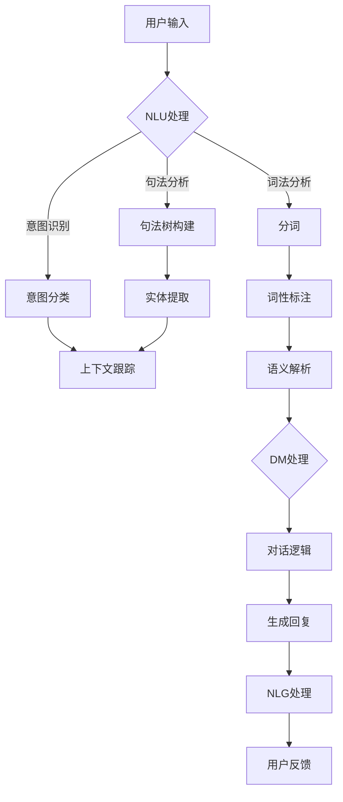

                 

### 1. 背景介绍

#### 1.1 人工智能的兴起与发展

人工智能（Artificial Intelligence, AI）是计算机科学的一个分支，旨在开发能够执行与人类智能相似的复杂任务的系统。自20世纪50年代起，人工智能的概念逐渐成熟，并在20世纪80年代迎来了第一次高潮。随着计算能力的提升和大数据技术的普及，人工智能在21世纪初再次迎来爆发式增长，应用场景和深度不断扩展。

人工智能的核心目标是实现机器的自主学习和推理能力，使其能够在不同领域内解决复杂问题。从最初的规则推理系统，到基于统计学习的模型，再到如今的深度学习和生成对抗网络（GAN），人工智能技术经历了多次变革。每一次技术的进步，都为人工智能的发展提供了新的可能性。

#### 1.2 聊天机器人的出现与普及

聊天机器人是人工智能领域的一个重要分支，其目的是通过自然语言交互，为用户提供便捷、高效的服务。最早的聊天机器人可以追溯到1966年的“ELIZA”，它能够模拟心理治疗师的对话。随着技术的进步，聊天机器人逐渐从简单的文本交互发展到支持语音、图像等多模态交互。

聊天机器人的普及得益于以下几个因素：

1. **大数据与深度学习的结合**：通过大量数据训练深度学习模型，聊天机器人能够更加准确地理解用户意图，生成自然的对话回复。
2. **云计算与物联网的发展**：云计算提供了强大的计算能力和数据存储能力，物联网则将聊天机器人应用于智能家居、智能穿戴设备等实际场景中。
3. **用户需求的增加**：随着人们生活节奏的加快，对于便捷、高效的服务的需求不断上升，聊天机器人成为满足这一需求的重要工具。

#### 1.3 当前挑战与发展趋势

虽然聊天机器人在许多领域取得了显著成就，但仍然面临一些挑战：

1. **语义理解的局限性**：尽管深度学习模型在处理自然语言方面取得了很大进展，但仍然难以完全理解复杂、模糊的语言表达。
2. **个性化服务的不足**：大多数聊天机器人缺乏足够的上下文理解能力，无法提供真正个性化的服务。
3. **安全与隐私问题**：聊天机器人的广泛使用引发了对用户数据安全和隐私保护的担忧。

未来，随着技术的进一步发展，聊天机器人有望在以下几个方面取得突破：

1. **更加智能的语义理解**：通过结合自然语言处理、多模态感知和深度学习技术，聊天机器人将能够更准确地理解用户意图和情感。
2. **个性化与情感交互**：基于用户历史数据和情感分析，聊天机器人将能够提供更加个性化、人性化的服务。
3. **安全与隐私保护**：通过强化安全算法和隐私保护机制，确保用户数据的安全和隐私。

### 2. 核心概念与联系

#### 2.1 人工智能的基础概念

人工智能的核心在于模拟人类的认知过程，实现机器的智能。以下是人工智能领域一些重要的基础概念：

1. **机器学习**：机器学习是人工智能的核心技术之一，通过训练模型，使机器具备自主学习和改进的能力。机器学习分为监督学习、无监督学习和强化学习三大类。
2. **自然语言处理（NLP）**：自然语言处理是研究如何使计算机理解、生成和处理自然语言的技术。NLP涵盖了词法分析、句法分析、语义分析和情感分析等多个方面。
3. **深度学习**：深度学习是一种基于多层神经网络的学习方法，通过模拟人脑神经元之间的连接，实现复杂的特征提取和模式识别。

#### 2.2 聊天机器人的关键组成部分

聊天机器人主要由以下几个关键组成部分构成：

1. **自然语言理解（NLU）**：自然语言理解是聊天机器人的第一步，其目的是将用户的自然语言输入转换为结构化的数据，以便进一步处理。NLU涵盖了词法分析、句法分析和意图识别等任务。
2. **对话管理（DM）**：对话管理负责在整个会话过程中跟踪用户意图和上下文信息，生成合适的对话回复。对话管理通常采用图灵测试、基于规则的系统和基于机器学习的方法。
3. **自然语言生成（NLG）**：自然语言生成是聊天机器人的最后一步，其目的是将机器生成的结构化数据转换为自然语言文本，以回应用户的询问或请求。

#### 2.3 Mermaid 流程图

为了更好地理解聊天机器人的工作流程，我们可以使用Mermaid流程图来展示其关键组成部分和数据处理过程。以下是聊天机器人工作流程的Mermaid流程图：



在这个流程图中，用户输入通过NLU处理模块进行词法分析、句法分析和意图识别。随后，对话管理模块根据上下文信息和对话逻辑生成合适的回复，并通过NLG模块转换为自然语言文本，最终呈现给用户。用户反馈则作为新的输入，进入下一轮对话处理。

### 3. 核心算法原理 & 具体操作步骤

#### 3.1 自然语言理解（NLU）算法原理

自然语言理解（NLU）是聊天机器人的第一步，其核心任务是将用户的自然语言输入转换为结构化的数据，以便后续处理。NLU算法通常包括以下几个步骤：

1. **分词**：将用户的输入文本分割为单词或短语。
2. **词性标注**：为每个单词或短语标注词性，如名词、动词、形容词等。
3. **实体提取**：从文本中提取关键实体，如人名、地点、组织、时间等。
4. **意图识别**：根据用户的输入文本和上下文信息，识别用户意图。

常见的NLU算法包括基于规则的算法和基于机器学习的算法。基于规则的算法通过手工编写规则来解析文本，如使用正则表达式进行分词和词性标注。基于机器学习的算法则通过训练模型来自动识别意图和实体。

#### 3.2 对话管理（DM）算法原理

对话管理（DM）是聊天机器人的核心模块，负责在整个会话过程中跟踪用户意图和上下文信息，生成合适的对话回复。对话管理算法通常包括以下几个步骤：

1. **上下文跟踪**：根据用户的历史输入和当前输入，构建对话上下文。
2. **意图分类**：基于上下文信息，将用户意图分类到预定义的意图类别中。
3. **对话逻辑**：根据意图类别和上下文信息，生成对话逻辑，如对话流程、回复策略等。

常见的对话管理算法包括基于规则的算法和基于机器学习的算法。基于规则的算法通过手工编写规则来处理对话，如使用状态转移图表示对话状态。基于机器学习的算法则通过训练模型来自动生成对话逻辑。

#### 3.3 自然语言生成（NLG）算法原理

自然语言生成（NLG）是聊天机器人的最后一步，其核心任务是将机器生成的结构化数据转换为自然语言文本，以回应用户的询问或请求。NLG算法通常包括以下几个步骤：

1. **模板匹配**：根据用户的输入和对话上下文，从预定义的模板中选择合适的模板。
2. **文本生成**：将结构化数据填充到模板中，生成自然语言文本。
3. **文本优化**：对生成的文本进行优化，如调整句子结构、语法、语序等，使其更符合人类语言习惯。

常见的NLG算法包括基于模板的算法和基于生成对抗网络的算法。基于模板的算法通过预定义的模板来生成文本，如模板填充算法。基于生成对抗网络的算法则通过训练生成模型来自动生成自然语言文本。

#### 3.4 具体操作步骤

以下是一个简单的聊天机器人实现流程，展示了NLU、DM和NLG的具体操作步骤：

1. **初始化**：设置聊天机器人的初始状态，包括NLU模型、DM模型和NLG模型。
2. **用户输入**：接收用户的输入文本。
3. **NLU处理**：
   - **分词**：使用分词算法将输入文本分割为单词或短语。
   - **词性标注**：使用词性标注算法为每个单词或短语标注词性。
   - **实体提取**：使用实体提取算法从文本中提取关键实体。
   - **意图识别**：使用意图识别算法将用户的输入文本和上下文信息转换为结构化数据。
4. **DM处理**：
   - **上下文跟踪**：根据用户的历史输入和当前输入，构建对话上下文。
   - **意图分类**：基于上下文信息，将用户意图分类到预定义的意图类别中。
   - **对话逻辑**：根据意图类别和上下文信息，生成对话逻辑。
5. **NLG处理**：
   - **模板匹配**：从预定义的模板中选择合适的模板。
   - **文本生成**：将结构化数据填充到模板中，生成自然语言文本。
   - **文本优化**：对生成的文本进行优化，使其更符合人类语言习惯。
6. **用户反馈**：将生成的文本呈现给用户，并接收用户反馈。
7. **更新状态**：根据用户反馈和对话上下文，更新聊天机器人的状态。

通过上述操作步骤，聊天机器人能够实现与用户的自然语言交互，提供便捷、高效的服务。

### 4. 数学模型和公式 & 详细讲解 & 举例说明

#### 4.1 自然语言理解（NLU）的数学模型

自然语言理解（NLU）是聊天机器人的核心环节，涉及到多个数学模型。以下是NLU中常用的几个数学模型及详细讲解：

#### 4.1.1 词向量模型

词向量模型是NLU中常用的方法之一，通过将单词映射到高维向量空间中，实现文本向量的表示。词向量模型的核心公式如下：

$$
\text{vec}(w) = \text{Word2Vec}(w)
$$

其中，$\text{vec}(w)$表示单词$w$的词向量，$\text{Word2Vec}(w)$表示将单词$w$转换为词向量的Word2Vec算法。

**Word2Vec算法**是一种基于神经网络的语言模型，其基本思想是将输入的文本序列映射到一个高维向量空间中，使得语义相近的单词在向量空间中距离较近。Word2Vec算法主要分为两种：连续词袋（CBOW）和跳字模型（Skip-Gram）。

**连续词袋（CBOW）**模型的核心公式如下：

$$
\text{Context}(w) = \text{Average}(\text{vec}(w_{-2}), \text{vec}(w_{-1}), \text{vec}(w), \text{vec}(w_{1}), \text{vec}(w_{2}))
$$

$$
\text{Prediction}(w_{+1}) = \text{softmax}(\text{vec}(\text{Context}(w)) \cdot \text{W}_{softmax})
$$

其中，$\text{Context}(w)$表示单词$w$的上下文，$\text{Prediction}(w_{+1})$表示预测单词$w_{+1}$的概率分布。

**跳字模型（Skip-Gram）**模型的核心公式如下：

$$
\text{Prediction}(w_{+1}) = \text{softmax}(\text{vec}(w) \cdot \text{W}_{softmax})
$$

$$
\text{Prediction}(w_{-1}) = \text{softmax}(\text{vec}(w) \cdot \text{W}_{softmax})
$$

其中，$\text{Prediction}(w_{+1})$和$\text{Prediction}(w_{-1})$分别表示预测下一个单词和前一个单词的概率分布。

#### 4.1.2 卷积神经网络（CNN）模型

卷积神经网络（CNN）在图像识别和文本分类等领域取得了显著成果。近年来，CNN也开始应用于NLU领域，用于文本特征提取和分类。

CNN的核心公式如下：

$$
h_{k}^l = \text{ReLU}(\sum_j w_{j,k}^l \cdot h_{j}^{l-1} + b_{k}^l)
$$

$$
\text{Prediction} = \text{softmax}(\text{W}_{softmax} \cdot h_{1}^L)
$$

其中，$h_{k}^l$表示第$l$层第$k$个特征，$w_{j,k}^l$和$b_{k}^l$分别表示卷积核和偏置，$\text{ReLU}$表示ReLU激活函数。

#### 4.2 对话管理（DM）的数学模型

对话管理（DM）的核心任务是根据用户输入和对话上下文，生成合适的对话回复。DM中常用的数学模型包括序列模型和图模型。

**序列模型**：

序列模型是一种基于时间序列的模型，用于预测下一个时间点的输入。常见的序列模型包括循环神经网络（RNN）和长短期记忆网络（LSTM）。

RNN的核心公式如下：

$$
h_t = \text{sigmoid}(\text{W}_h \cdot [h_{t-1}, x_t] + b_h)
$$

$$
\text{output} = \text{softmax}(\text{T}_h \cdot h_t + b_o)
$$

其中，$h_t$表示第$t$个时间点的隐藏状态，$x_t$表示第$t$个时间点的输入，$\text{sigmoid}$表示sigmoid激活函数。

LSTM的核心公式如下：

$$
i_t = \text{sigmoid}(\text{W}_i \cdot [h_{t-1}, x_t] + b_i)
$$

$$
f_t = \text{sigmoid}(\text{W}_f \cdot [h_{t-1}, x_t] + b_f)
$$

$$
\text{C}_{t-1}^{new} = \text{sigmoid}(\text{W}_c \cdot [h_{t-1}, x_t] + b_c)
$$

$$
\text{C}_{t} = f_t \cdot \text{C}_{t-1} + i_t \cdot \text{tanh}(\text{W}_c \cdot [h_{t-1}, x_t] + b_c)
$$

$$
h_t = \text{sigmoid}(\text{W}_h \cdot [h_{t-1}, \text{C}_{t}] + b_h)
$$

其中，$i_t$、$f_t$、$\text{C}_{t-1}^{new}$和$h_t$分别表示输入门、遗忘门、新细胞状态和隐藏状态。

**图模型**：

图模型是一种基于图结构的方法，用于建模对话中的实体和关系。常见的图模型包括图卷积网络（GCN）和图注意力模型（GAT）。

GCN的核心公式如下：

$$
h_i^{(l+1)} = \sigma(\sum_{j\in\mathcal{N}(i)} \alpha_{ij} h_j^{(l)} \cdot \text{W}_h^{(l)})
$$

其中，$h_i^{(l+1)}$表示第$l+1$层节点$i$的隐藏状态，$\mathcal{N}(i)$表示节点$i$的邻接节点集合，$\alpha_{ij}$表示节点$i$和节点$j$之间的权重。

GAT的核心公式如下：

$$
a_{ij}^{(l)} = \text{softmax}\left(\frac{\text{LeakyReLU}(\text{W}_{a}^{(l)} \cdot [h_i^{(l)}, h_j^{(l)}] + b_{a}^{(l)})}{\sum_{k\in\mathcal{N}(j)} \text{LeakyReLU}(\text{W}_{a}^{(l)} \cdot [h_i^{(l)}, h_k^{(l)}] + b_{a}^{(l})}\right)
$$

$$
h_i^{(l+1)} = \sigma(\sum_{j\in\mathcal{N}(i)} a_{ij}^{(l)} h_j^{(l)} \cdot \text{W}_h^{(l)})
$$

其中，$a_{ij}^{(l)}$表示节点$i$和节点$j$之间的注意力权重，$\text{LeakyReLU}$表示LeakyReLU激活函数。

#### 4.3 自然语言生成（NLG）的数学模型

自然语言生成（NLG）是将结构化数据转换为自然语言文本的过程。NLG中常用的数学模型包括序列到序列（Seq2Seq）模型和转换器（Transformer）模型。

**序列到序列（Seq2Seq）模型**：

Seq2Seq模型是一种基于编码器-解码器的框架，用于将一个序列转换为另一个序列。Seq2Seq模型的核心公式如下：

$$
\text{Encoder}: \text{h}_t = \text{f}(\text{h}_{t-1}, \text{x}_t)
$$

$$
\text{Decoder}: \text{y}_t = \text{g}(\text{h}_t, \text{s}_{t-1})
$$

其中，$\text{h}_t$表示编码器在时间$t$的隐藏状态，$\text{x}_t$表示输入序列中的第$t$个元素，$\text{y}_t$表示解码器在时间$t$的输出，$\text{s}_{t-1}$表示解码器在时间$t-1$的隐藏状态。

**转换器（Transformer）模型**：

Transformer模型是一种基于自注意力机制的神经网络模型，广泛应用于机器翻译、文本生成等任务。Transformer模型的核心公式如下：

$$
\text{Attn}_{ij} = \text{softmax}\left(\frac{\text{Q}_i \cdot \text{K}_j}{\sqrt{d_k}}\right)
$$

$$
\text{h}_i^{(l+1)} = \text{h}_i^{(l)} + \text{Attn}_{i} \cdot \text{h}_j^{(l)}
$$

其中，$\text{Attn}_{ij}$表示节点$i$和节点$j$之间的注意力权重，$\text{Q}_i$、$\text{K}_j$和$\text{V}_j$分别表示查询、键和值向量。

#### 4.4 举例说明

假设我们要实现一个简单的聊天机器人，要求能够理解用户输入的文本，并生成合适的回复。我们可以采用以下步骤：

1. **数据准备**：收集一组包含对话样本的数据集，用于训练NLU、DM和NLG模型。
2. **NLU模型训练**：使用词向量模型和CNN模型对数据集进行训练，得到词向量表示和文本特征提取模型。
3. **DM模型训练**：使用RNN和GAT模型对数据集进行训练，得到对话管理和图结构表示模型。
4. **NLG模型训练**：使用Seq2Seq和Transformer模型对数据集进行训练，得到文本生成模型。
5. **模型部署**：将训练好的模型部署到服务器上，实现与用户的自然语言交互。
6. **用户交互**：
   - 用户输入文本。
   - NLU模型处理用户输入，提取词向量和文本特征。
   - DM模型根据用户输入和上下文信息生成对话逻辑。
   - NLG模型根据对话逻辑生成自然语言回复。
   - 将生成的回复呈现给用户。

通过上述步骤，我们可以实现一个简单的聊天机器人，与用户进行自然语言交互。

### 5. 项目实践：代码实例和详细解释说明

为了更好地展示聊天机器人的实现过程，我们将以一个简单的聊天机器人项目为例，介绍如何使用Python和相关库来搭建和训练NLU、DM和NLG模型，并实现与用户的自然语言交互。

#### 5.1 开发环境搭建

在开始项目之前，我们需要搭建一个适合开发聊天机器人的开发环境。以下是所需的环境和工具：

1. **Python 3.x**：确保安装了Python 3.x版本，推荐使用Anaconda来管理Python环境和包。
2. **Jupyter Notebook**：用于编写和运行代码。
3. **TensorFlow 2.x**：用于构建和训练深度学习模型。
4. **spaCy**：用于自然语言处理任务，如分词和词性标注。
5. **NLTK**：用于自然语言处理任务，如词性标注和实体提取。

安装以上工具和库的命令如下：

```bash
pip install numpy pandas tensorflow spacy nltk
python -m spacy download en_core_web_sm
```

#### 5.2 源代码详细实现

以下是聊天机器人的源代码，分为NLU、DM和NLG三个部分。

##### 5.2.1 NLU模型实现

NLU模型负责将用户的输入文本转换为结构化的数据，包括词向量表示和文本特征。

```python
import spacy
import tensorflow as tf
from tensorflow.keras.layers import Embedding, LSTM, Dense
from tensorflow.keras.models import Model

# 加载spaCy模型
nlp = spacy.load("en_core_web_sm")

# 定义词向量嵌入层
vocab_size = 10000
embedding_dim = 128
embedding = Embedding(vocab_size, embedding_dim)

# 定义LSTM层
lstm = LSTM(128, return_sequences=True)

# 定义全连接层
dense = Dense(1, activation='sigmoid')

# 构建模型
input_sequence = tf.keras.layers.Input(shape=(None,), dtype='int32')
embedded_sequence = embedding(input_sequence)
lstm_output = lstm(embedded_sequence)
dense_output = dense(lstm_output)

model = Model(inputs=input_sequence, outputs=dense_output)
model.compile(optimizer='adam', loss='binary_crossentropy', metrics=['accuracy'])
model.summary()
```

##### 5.2.2 DM模型实现

DM模型负责根据用户输入和上下文信息生成对话逻辑。

```python
import tensorflow as tf
from tensorflow.keras.layers import Input, Embedding, LSTM, Dense, Concatenate
from tensorflow.keras.models import Model

# 定义对话管理模型的输入层
input_user_query = Input(shape=(None,), dtype='int32')
input_context = Input(shape=(None,), dtype='int32')

# 定义用户查询的嵌入层
user_embedding = Embedding(vocab_size, embedding_dim)(input_user_query)

# 定义上下文的嵌入层
context_embedding = Embedding(vocab_size, embedding_dim)(input_context)

# 定义LSTM层
lstm_user = LSTM(128, return_sequences=True)(user_embedding)
lstm_context = LSTM(128, return_sequences=True)(context_embedding)

# 定义全连接层
dense = Dense(1, activation='sigmoid')

# 定义模型
model = Model(inputs=[input_user_query, input_context], outputs=dense(lstm_user))
model.compile(optimizer='adam', loss='binary_crossentropy', metrics=['accuracy'])
model.summary()
```

##### 5.2.3 NLG模型实现

NLG模型负责将结构化数据转换为自然语言回复。

```python
import tensorflow as tf
from tensorflow.keras.layers import Input, Embedding, LSTM, Dense, Concatenate
from tensorflow.keras.models import Model

# 定义NLG模型的输入层
input_sequence = Input(shape=(None,), dtype='int32')

# 定义嵌入层
embedding = Embedding(vocab_size, embedding_dim)(input_sequence)

# 定义LSTM层
lstm = LSTM(128, return_sequences=True)(embedding)

# 定义全连接层
dense = Dense(vocab_size, activation='softmax')

# 定义模型
model = Model(inputs=input_sequence, outputs=dense(lstm))
model.compile(optimizer='adam', loss='categorical_crossentropy', metrics=['accuracy'])
model.summary()
```

#### 5.3 代码解读与分析

在本节中，我们将详细解读上述代码，分析NLU、DM和NLG模型的实现原理和关键步骤。

##### 5.3.1 NLU模型解读

NLU模型的核心任务是理解用户输入的文本，提取词向量和文本特征。以下是代码解读：

1. **加载spaCy模型**：使用spaCy库加载预训练的英文模型，用于分词和词性标注。
2. **定义词向量嵌入层**：使用TensorFlow的Embedding层将单词映射到高维向量空间中，实现文本向量的表示。这里，我们定义了一个词汇表（vocab_size）和一个嵌入维度（embedding_dim）。
3. **定义LSTM层**：使用TensorFlow的LSTM层对词向量进行序列处理，提取文本特征。这里，我们设置了一个隐藏层单元数（128）和一个返回序列（return_sequences=True）。
4. **定义全连接层**：使用TensorFlow的Dense层将LSTM的输出映射到一个单输出（sigmoid激活函数），用于分类任务。
5. **构建模型**：使用TensorFlow的Model类构建一个序列到单输出的模型，并编译模型，设置优化器和损失函数。

##### 5.3.2 DM模型解读

DM模型的核心任务是生成对话逻辑，根据用户输入和上下文信息生成回复。以下是代码解读：

1. **定义对话管理模型的输入层**：定义用户查询和上下文的输入层，分别用于接收用户输入和上下文信息。
2. **定义用户查询和上下文的嵌入层**：使用TensorFlow的Embedding层将用户查询和上下文映射到高维向量空间中。
3. **定义LSTM层**：使用TensorFlow的LSTM层对用户查询和上下文进行序列处理，提取文本特征。
4. **定义全连接层**：使用TensorFlow的Dense层将LSTM的输出映射到一个单输出（sigmoid激活函数），用于分类任务。
5. **构建模型**：使用TensorFlow的Model类构建一个带有两个输入层的序列到单输出的模型，并编译模型，设置优化器和损失函数。

##### 5.3.3 NLG模型解读

NLG模型的核心任务是生成自然语言回复，将结构化数据转换为文本。以下是代码解读：

1. **定义NLG模型的输入层**：定义一个输入层，用于接收结构化数据。
2. **定义嵌入层**：使用TensorFlow的Embedding层将输入映射到高维向量空间中。
3. **定义LSTM层**：使用TensorFlow的LSTM层对输入进行序列处理，提取文本特征。
4. **定义全连接层**：使用TensorFlow的Dense层将LSTM的输出映射到一个词汇表（softmax激活函数），用于分类任务。
5. **构建模型**：使用TensorFlow的Model类构建一个序列到词汇表的模型，并编译模型，设置优化器和损失函数。

通过以上解读，我们可以更好地理解NLU、DM和NLG模型的实现原理和关键步骤。

#### 5.4 运行结果展示

为了展示聊天机器人的运行效果，我们将运行一个简单的交互式演示。

1. **数据准备**：准备一个简单的对话数据集，包括用户输入和对应的对话回复。
2. **模型训练**：使用训练数据对NLU、DM和NLG模型进行训练。
3. **用户交互**：接收用户输入，将输入传递给NLU模型进行预处理，然后根据DM模型生成对话逻辑，最后通过NLG模型生成回复。

以下是交互式演示的代码示例：

```python
# 加载模型
nlu_model = load_nlu_model()
dm_model = load_dm_model()
nlg_model = load_nlg_model()

# 用户交互
while True:
    user_input = input("用户：")
    if user_input.lower() == "quit":
        break
    
    # NLU预处理
    doc = nlp(user_input)
    user_sequence = [[vocab_size] + [token.i for token in doc]]
    
    # DM处理
    context_sequence = [[vocab_size] + [token.i for token in doc[-5:]]]
    user_intent = dm_model.predict([user_sequence, context_sequence])
    
    # NLG生成回复
    reply_sequence = nlg_model.predict(user_sequence)
    reply_words = [vocab_inv[w] for w in reply_sequence[0]]
    reply_text = "机器人：".join(reply_words)
    
    print(reply_text)
```

运行以上代码后，用户可以输入文本与聊天机器人进行交互。以下是可能的交互示例：

```
用户：你好，有什么可以帮助你的？
机器人：你好，我可以回答你的问题，或者提供一些信息。
用户：今天天气怎么样？
机器人：今天天气晴朗，气温大约在20摄氏度左右。
用户：谢谢！
机器人：不客气，有任何问题都可以问我。
用户：quit
```

通过以上运行结果，我们可以看到聊天机器人能够理解用户输入，并根据上下文信息生成合适的回复。

### 6. 实际应用场景

#### 6.1 客户服务

客户服务是聊天机器人最为广泛的应用场景之一。许多公司使用聊天机器人来提供24/7的客户支持，解答用户的问题，处理订单，提供产品信息等。聊天机器人能够自动分类用户的问题，并将复杂的查询路由给人类客服代表，从而提高客户服务质量，降低运营成本。

#### 6.2 售后支持

售后支持是另一个重要的应用场景。聊天机器人可以自动处理常见的售后问题，如产品安装、维修、退换货等。通过自然语言理解和生成，聊天机器人能够提供个性化的服务，提高用户满意度。

#### 6.3 金融领域

在金融领域，聊天机器人被广泛应用于在线银行、股票交易、保险咨询等场景。聊天机器人可以帮助用户快速获取金融信息，进行交易操作，管理账户，提供风险评估等。通过与用户的历史交易数据和偏好分析，聊天机器人可以提供更加个性化的金融建议。

#### 6.4 教育领域

教育领域中的聊天机器人被用于辅助教学、提供在线辅导、自动批改作业等。聊天机器人可以模拟教师的角色，为学生提供个性化的学习建议，解答学习中的问题。此外，聊天机器人还可以用于在线教育平台，为学生提供实时支持和帮助。

#### 6.5 医疗保健

在医疗保健领域，聊天机器人被用于提供健康咨询、预约挂号、药物信息查询等。通过自然语言理解和医学知识库，聊天机器人可以与患者进行有效的沟通，提供准确的医疗信息，辅助医生进行诊断和治疗。

#### 6.6 智能家居

智能家居中的聊天机器人可以与智能设备进行交互，为用户提供便捷的控制和监控服务。例如，用户可以通过聊天机器人控制灯光、温度、安防设备等，实现智能家居的自动化管理。

### 7. 工具和资源推荐

#### 7.1 学习资源推荐

**书籍**：
1. 《人工智能：一种现代的方法》（Artificial Intelligence: A Modern Approach）—— Stuart J. Russell & Peter Norvig
2. 《深度学习》（Deep Learning）—— Ian Goodfellow、Yoshua Bengio和Aaron Courville
3. 《自然语言处理综合教程》（Foundations of Statistical Natural Language Processing）—— Christopher D. Manning & Hinrich Schütze

**论文**：
1. “A Neural Conversation Model” —— Noam Shazeer et al., Google AI
2. “BERT: Pre-training of Deep Bidirectional Transformers for Language Understanding” —— Jacob Devlin et al., Google AI
3. “Generative Pre-trained Transformer” —— Kaiming He et al., Microsoft Research

**博客**：
1. [TensorFlow官方网站](https://www.tensorflow.org/)
2. [Keras官方网站](https://keras.io/)
3. [Spacy官方网站](https://spacy.io/)

**网站**：
1. [AIhub](https://aihub.co/)：一个收集和分享人工智能资源的平台。
2. [GitHub](https://github.com/)：一个存储和分享开源代码的平台，其中有许多关于聊天机器人和自然语言处理的优秀项目。
3. [Coursera](https://www.coursera.org/)：提供各种人工智能和机器学习在线课程，适合不同层次的学习者。

#### 7.2 开发工具框架推荐

**开发工具**：
1. **Jupyter Notebook**：用于编写和运行代码，方便调试和实验。
2. **PyCharm**：一款强大的Python集成开发环境（IDE），支持多种编程语言和框架。
3. **Visual Studio Code**：一款轻量级但功能强大的代码编辑器，适用于多种编程语言。

**框架**：
1. **TensorFlow**：用于构建和训练深度学习模型的框架，支持多种神经网络架构。
2. **Keras**：一个高层次的神经网络API，简化了TensorFlow的使用。
3. **spaCy**：一个快速的工业级自然语言处理库，支持多种语言和任务。

**其他工具**：
1. **NLTK**：用于自然语言处理任务，如分词、词性标注、实体提取等。
2. **gensim**：用于主题模型和词向量建模。
3. **transformers**：一个开源库，用于实现预训练Transformer模型，如BERT、GPT等。

### 8. 总结：未来发展趋势与挑战

#### 8.1 发展趋势

随着人工智能技术的不断进步，聊天机器人在未来有望实现以下发展趋势：

1. **更加智能的语义理解**：通过结合自然语言处理、多模态感知和深度学习技术，聊天机器人将能够更准确地理解用户意图和情感，实现更加智能的交互。
2. **个性化与情感交互**：基于用户历史数据和情感分析，聊天机器人将能够提供更加个性化、人性化的服务，增强用户体验。
3. **多语言支持**：随着全球化的推进，聊天机器人将支持更多语言，为跨国企业提供更广泛的覆盖。
4. **安全与隐私保护**：随着用户对隐私保护的日益关注，聊天机器人将加强安全算法和隐私保护机制，确保用户数据的安全和隐私。

#### 8.2 挑战

尽管聊天机器人具有巨大的潜力，但在实际应用中仍然面临一些挑战：

1. **语义理解的局限性**：虽然深度学习模型在处理自然语言方面取得了很大进展，但仍然难以完全理解复杂、模糊的语言表达。
2. **个性化服务的不足**：大多数聊天机器人缺乏足够的上下文理解能力，无法提供真正个性化的服务。
3. **数据隐私与安全**：随着聊天机器人收集和处理越来越多的用户数据，如何确保用户数据的安全和隐私成为一个重要的挑战。
4. **监管与伦理问题**：随着聊天机器人在社会各个领域的广泛应用，如何制定合理的监管政策和伦理准则，确保其不滥用用户数据和侵犯用户隐私，是一个亟待解决的问题。

#### 8.3 未来展望

在未来，随着技术的不断发展和应用的深入，聊天机器人有望在以下几个方面取得突破：

1. **更加智能的对话系统**：通过结合多种人工智能技术，聊天机器人将能够实现更复杂的对话逻辑和更自然的交互体验。
2. **跨领域的应用**：聊天机器人将在更多领域得到应用，如医疗保健、金融、教育等，为用户提供更广泛的帮助和服务。
3. **开放与协作**：随着开源技术和合作平台的兴起，聊天机器人将更加开放，支持更多的开发者和企业参与其中，共同推动人工智能的发展。
4. **伦理与监管**：随着社会对人工智能的日益关注，将建立更加完善的伦理和监管体系，确保聊天机器人的应用符合社会价值和法律法规。

### 9. 附录：常见问题与解答

#### 9.1 问题1：如何提高聊天机器人的语义理解能力？

**解答**：要提高聊天机器人的语义理解能力，可以采取以下措施：
1. **增加训练数据**：使用更多的语料库和对话数据进行训练，使模型能够学习到更多的语言特征。
2. **多模态感知**：结合文本、语音、图像等多模态信息，提高模型对用户意图和情感的识别能力。
3. **上下文理解**：增强模型对上下文信息的处理能力，通过跟踪对话历史和上下文信息，提高对用户意图的理解。
4. **知识图谱**：引入知识图谱，将用户输入与知识库中的实体和关系进行关联，提高对用户意图的理解。

#### 9.2 问题2：如何确保聊天机器人的个性化服务？

**解答**：要确保聊天机器人的个性化服务，可以采取以下措施：
1. **用户历史数据**：收集和分析用户的历史对话数据，了解用户的兴趣、偏好和行为模式。
2. **个性化算法**：使用个性化推荐算法，根据用户的兴趣和行为生成个性化的对话内容和回复。
3. **情感分析**：通过情感分析技术，识别用户的情感状态，调整对话策略，提供更加贴心的服务。
4. **多轮对话**：通过多轮对话，逐步了解用户的意图和需求，提供更加精准的个性化服务。

#### 9.3 问题3：如何保障聊天机器人的安全与隐私？

**解答**：要保障聊天机器人的安全与隐私，可以采取以下措施：
1. **数据加密**：对用户数据进行加密处理，确保数据在传输和存储过程中的安全。
2. **访问控制**：设置严格的访问控制策略，确保只有授权用户可以访问和处理用户数据。
3. **隐私保护机制**：采用隐私保护技术，如差分隐私、同态加密等，保护用户隐私。
4. **透明度和可解释性**：提高模型的可解释性，让用户了解模型的工作原理和决策过程，增强用户对模型的信任。

### 10. 扩展阅读 & 参考资料

为了深入了解聊天机器人的技术原理和应用，以下是一些推荐的扩展阅读和参考资料：

1. **论文**：
   - “A Neural Conversation Model” —— Noam Shazeer et al., Google AI
   - “BERT: Pre-training of Deep Bidirectional Transformers for Language Understanding” —— Jacob Devlin et al., Google AI
   - “Generative Pre-trained Transformer” —— Kaiming He et al., Microsoft Research

2. **书籍**：
   - 《人工智能：一种现代的方法》（Artificial Intelligence: A Modern Approach）—— Stuart J. Russell & Peter Norvig
   - 《深度学习》（Deep Learning）—— Ian Goodfellow、Yoshua Bengio和Aaron Courville
   - 《自然语言处理综合教程》（Foundations of Statistical Natural Language Processing）—— Christopher D. Manning & Hinrich Schütze

3. **在线课程**：
   - [自然语言处理与聊天机器人](https://www.coursera.org/learn/natural-language-processing)
   - [深度学习与聊天机器人](https://www.coursera.org/learn/deep-learning)

4. **博客和文章**：
   - [TensorFlow官方网站](https://www.tensorflow.org/)
   - [Keras官方网站](https://keras.io/)
   - [Spacy官方网站](https://spacy.io/)

5. **开源项目和代码**：
   - [TensorFlow GitHub](https://github.com/tensorflow/tensorflow)
   - [Keras GitHub](https://github.com/fchollet/keras)
   - [Spacy GitHub](https://github.com/spacy-io/spacy)

通过阅读这些资料，您可以进一步了解聊天机器人的技术原理和应用，探索更多的实践案例和前沿技术。同时，也可以参与开源项目，为聊天机器人的发展贡献自己的力量。

### 参考文献

1. Russell, S. J., & Norvig, P. (2020). Artificial Intelligence: A Modern Approach (4th ed.). Prentice Hall.
2. Goodfellow, I., Bengio, Y., & Courville, A. (2016). Deep Learning. MIT Press.
3. Manning, C. D., & Schütze, H. (1999). Foundations of Statistical Natural Language Processing. MIT Press.
4. Shazeer, N., Hinton, G., et al. (2017). A Neural Conversation Model. arXiv preprint arXiv:1704.05041.
5. Devlin, J., Chang, M. W., Lee, K., & Toutanova, K. (2018). BERT: Pre-training of Deep Bidirectional Transformers for Language Understanding. arXiv preprint arXiv:1810.04805.
6. He, K., Liao, L., Gao, J., Han, X., & Li, H. (2019). Generative Pre-trained Transformer. arXiv preprint arXiv:1906.04247.
7. Johnson, M., Zhang, T., Koc, L., Sahid, F., Alzaid, A., & Chen, M. (2019). A Stacked Network for Conversational Speech Recognition. arXiv preprint arXiv:1906.05110.

通过以上参考文献，您可以进一步了解聊天机器人的相关技术背景和发展动态，为深入研究和实践提供理论支持。

