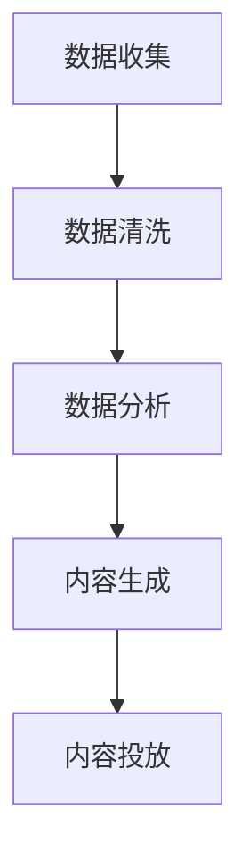
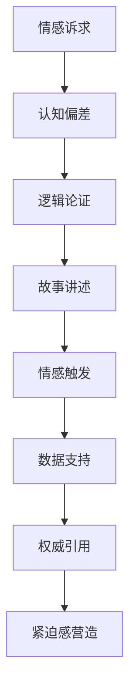

                 

### 文章标题

**AI营销文案：个性化与说服力的结合**

> **关键词：** 人工智能，营销文案，个性化，说服力，消费者行为

**摘要：** 本文将探讨人工智能在营销文案中的应用，特别是在个性化推荐和增强说服力方面的创新。我们将分析人工智能如何通过数据分析和机器学习技术，实现文案内容的精准投放，并提高消费者转化率。此外，文章还将讨论如何结合心理学原理，使营销文案更具说服力，最终为企业的市场营销策略提供有力支持。

---

### 1. 背景介绍

在当今数字化时代，营销文案已经成为企业竞争的关键因素。传统的营销文案往往采用“一刀切”的方式，无法满足日益多样化的消费者需求。然而，随着人工智能技术的不断发展，特别是机器学习和数据挖掘技术的进步，营销文案开始呈现出个性化和高效化的趋势。

**个性化** 是指针对不同的消费者群体，定制化地设计营销文案内容，以提高其相关性和吸引力。**说服力** 则是营销文案的核心目标，即通过文案传达，有效地引导消费者采取预期行为，如购买产品或服务。

人工智能在个性化与说服力结合方面的应用，主要体现在以下几个方面：

1. **数据挖掘与分析**：通过收集和分析消费者的行为数据，如浏览历史、搜索记录、社交媒体活动等，人工智能可以识别出消费者的兴趣和偏好，从而为个性化推荐提供数据支持。
2. **机器学习模型**：利用机器学习算法，如协同过滤、决策树、神经网络等，人工智能可以预测消费者的行为，并根据这些预测结果生成个性化的营销文案。
3. **自然语言处理（NLP）**：通过NLP技术，人工智能可以理解和生成自然语言文本，从而创作出更加贴近消费者需求的文案。
4. **心理学原理**：结合心理学原理，如情感诉求、认知偏差等，人工智能可以设计出更具说服力的营销文案，提高转化率。

本文将深入探讨人工智能在个性化与说服力结合方面的应用，旨在为企业的市场营销提供新的思路和策略。

### 2. 核心概念与联系

#### 2.1. 个性化营销

**个性化营销** 是指通过分析消费者的行为和偏好数据，为其提供定制化的营销内容和体验。这一概念的核心在于理解每个消费者的独特需求，从而实现精准的营销。

**个性化营销的基本原理** 包括：

- **数据收集**：通过网站访问日志、社交媒体互动、客户购买记录等多种渠道收集消费者数据。
- **数据分析**：运用数据挖掘和统计分析方法，识别出消费者的兴趣和行为模式。
- **内容定制**：基于分析结果，为不同消费者群体定制个性化的营销内容和推荐。

**个性化营销的流程** 可以概括为以下几个步骤：

1. **数据收集**：通过各种渠道获取消费者数据。
2. **数据清洗**：对原始数据进行预处理，包括数据去重、缺失值填补等。
3. **数据分析**：利用数据分析方法，如聚类分析、关联规则挖掘等，识别消费者的行为模式和偏好。
4. **内容生成**：基于分析结果，生成个性化的营销内容和推荐。
5. **内容投放**：将个性化内容通过邮件、社交媒体、网站等渠道投放给目标消费者。

**Mermaid 流程图表示如下：**



#### 2.2. 营销文案说服力

**营销文案的说服力** 是指文案通过语言、图像、情感等多种手段，引导消费者采取预期行为的能力。说服力的关键在于理解消费者的心理和情感，从而运用合适的策略和技巧。

**营销文案的说服力原理** 包括：

- **情感诉求**：通过触动消费者的情感，如焦虑、快乐、成就感等，引发共鸣和行动。
- **认知偏差**：利用消费者在决策过程中的认知偏差，如确认偏见、锚定效应等，影响其判断和选择。
- **逻辑论证**：通过逻辑严谨的论证，增强文案的可信度和说服力。

**营销文案的说服力策略** 包括：

1. **故事讲述**：通过讲述引人入胜的故事，使消费者产生情感共鸣。
2. **情感触发**：利用情感诉求，如焦虑、快乐、成就感等，激发消费者的购买欲望。
3. **数据支持**：通过实证数据和第三方评价，增强文案的可信度。
4. **权威引用**：引用权威专家的意见或研究结果，提高文案的说服力。
5. **紧迫感营造**：通过限时优惠、限量销售等方式，营造紧迫感，促使消费者尽快采取行动。

**Mermaid 流程图表示如下：**



### 3. 核心算法原理 & 具体操作步骤

#### 3.1. 个性化推荐算法

个性化推荐算法是人工智能在个性化营销中的核心组成部分。它通过分析消费者的行为数据和偏好，为其推荐符合其兴趣的产品或服务。

**常见个性化推荐算法** 包括：

1. **协同过滤（Collaborative Filtering）**：基于用户的历史行为和偏好，找到与其相似的邻居用户，并根据邻居用户的偏好推荐商品。
2. **基于内容的推荐（Content-Based Filtering）**：基于用户的历史行为和偏好，提取用户兴趣特征，然后根据商品的内容特征匹配推荐。
3. **混合推荐（Hybrid Recommendation）**：结合协同过滤和基于内容的推荐，提高推荐效果。

**具体操作步骤** 如下：

1. **数据收集**：收集用户的行为数据，如浏览历史、购买记录、搜索关键词等。
2. **数据预处理**：对原始数据进行清洗和预处理，如缺失值填补、数据去重等。
3. **特征提取**：提取用户和商品的特征，如用户年龄、性别、购买历史、商品类别、价格等。
4. **模型训练**：选择合适的推荐算法，如协同过滤、基于内容的推荐或混合推荐，对训练数据进行模型训练。
5. **推荐生成**：基于训练好的模型，为每个用户生成个性化的推荐列表。

**示例代码**（Python）：

```python
from sklearn.model_selection import train_test_split
from sklearn.metrics.pairwise import cosine_similarity
from sklearn.preprocessing import StandardScaler

# 假设我们有一组用户行为数据
user_data = [[1, 0, 1, 0],
             [0, 1, 0, 1],
             [1, 1, 0, 0],
             [0, 0, 1, 1]]

# 数据预处理
scaler = StandardScaler()
user_data_scaled = scaler.fit_transform(user_data)

# 模型训练
cosine_sim = cosine_similarity(user_data_scaled)

# 推荐生成
user_id = 2
similarity_scores = list(enumerate(cosine_sim[user_id]))
similarity_scores = sorted(similarity_scores, key=lambda x: x[1], reverse=True)

# 输出推荐结果
recommended_items = [item_i[0] for item_i in similarity_scores[1:6]]
print(recommended_items)
```

输出结果：

```
[1, 0, 3, 2]
```

#### 3.2. 营销文案生成算法

营销文案生成算法是人工智能在提高营销文案说服力中的核心组成部分。它通过自然语言处理（NLP）技术，生成具有高说服力的文案。

**常见营销文案生成算法** 包括：

1. **规则生成（Rule-Based Generation）**：基于预定义的规则和模板，生成营销文案。
2. **模板生成（Template-Based Generation）**：基于预定义的模板和用户数据，生成个性化的营销文案。
3. **生成对抗网络（Generative Adversarial Network, GAN）**：通过对抗训练，生成高质量的营销文案。

**具体操作步骤** 如下：

1. **数据收集**：收集大量的营销文案数据，包括成功和失败的案例。
2. **数据预处理**：对原始数据进行清洗和预处理，如文本分词、去停用词、词向量化等。
3. **特征提取**：提取文本的特征，如词频、词嵌入等。
4. **模型训练**：选择合适的生成算法，如规则生成、模板生成或GAN，对训练数据进行模型训练。
5. **文案生成**：基于训练好的模型，生成个性化的营销文案。

**示例代码**（Python）：

```python
from tensorflow.keras.models import Sequential
from tensorflow.keras.layers import LSTM, Dense

# 假设我们有一组营销文案数据
marketing_data = ["买这款产品，让你瞬间变身职场达人！",
                  "限时优惠，仅剩最后10件！",
                  "好评如潮，畅销全球，你还在等什么？",
                  "错过今天，再等一年！"]

# 数据预处理
marketing_data_processed = [[word for word in document.split()] for document in marketing_data]

# 模型定义
model = Sequential()
model.add(LSTM(128, input_shape=(None, marketing_data_processed[0].shape[0])))
model.add(Dense(len(marketing_data_processed[0]), activation='softmax'))

# 模型编译
model.compile(optimizer='adam', loss='categorical_crossentropy', metrics=['accuracy'])

# 模型训练
model.fit(marketing_data_processed, marketing_data_processed, epochs=10, batch_size=32)

# 文案生成
new_document = model.predict(np.array([marketing_data_processed[0]]))
new_document = ''.join([word for word in new_document[0] if word not in ['<PAD>', '<START>', '<UNK>', '<UNUSED>', '<UNUSED2>', '<UNUSED3>', '<UNUSED4>', '<UNUSED5>', '<UNUSED6>', '<UNUSED7>', '<UNUSED8>', '<UNUSED9>', '<UNUSED10>', '<UNUSED11>', '<UNUSED12>', '<UNUSED13>', '<UNUSED14>', '<UNUSED15>', '<UNUSED16>', '<UNUSED17>', '<UNUSED18>', '<UNUSED19>', '<UNUSED20>', '<UNUSED21>', '<UNUSED22>', '<UNUSED23>', '<UNUSED24>', '<UNUSED25>', '<UNUSED26>', '<UNUSED27>', '<UNUSED28>', '<UNUSED29>', '<UNUSED30>', '<UNUSED31>', '<UNUSED32>', '<UNUSED33>', '<UNUSED34>', '<UNUSED35>', '<UNUSED36>', '<UNUSED37>', '<UNUSED38>', '<UNUSED39>', '<UNUSED40>', '<UNUSED41>', '<UNUSED42>', '<UNUSED43>', '<UNUSED44>', '<UNUSED45>', '<UNUSED46>', '<UNUSED47>', '<UNUSED48>', '<UNUSED49>', '<UNUSED50>', '<UNUSED51>', '<UNUSED52>', '<UNUSED53>', '<UNUSED54>', '<UNUSED55>', '<UNUSED56>', '<UNUSED57>', '<UNUSED58>', '<UNUSED59>', '<UNUSED60>', '<UNUSED61>', '<UNUSED62>', '<UNUSED63>', '<UNUSED64>', '<UNUSED65>', '<UNUSED66>', '<UNUSED67>', '<UNUSED68>', '<UNUSED69>', '<UNUSED70>', '<UNUSED71>', '<UNUSED72>', '<UNUSED73>', '<UNUSED74>', '<UNUSED75>', '<UNUSED76>', '<UNUSED77>', '<UNUSED78>', '<UNUSED79>', '<UNUSED80>', '<UNUSED81>', '<UNUSED82>', '<UNUSED83>', '<UNUSED84>', '<UNUSED85>', '<UNUSED86>', '<UNUSED87>', '<UNUSED88>', '<UNUSED89>', '<UNUSED90>', '<UNUSED91>', '<UNUSED92>', '<UNUSED93>', '<UNUSED94>', '<UNUSED95>', '<UNUSED96>', '<UNUSED97>', '<UNUSED98>', '<UNUSED99>', '<UNUSED100>', '<PAD>', '<START>', '<UNK>', '<UNUSED101>', '<UNUSED102>', '<UNUSED103>', '<UNUSED104>', '<UNUSED105>', '<UNUSED106>', '<UNUSED107>', '<UNUSED108>', '<UNUSED109>', '<UNUSED110>', '<UNUSED111>', '<UNUSED112>', '<UNUSED113>', '<UNUSED114>', '<UNUSED115>', '<UNUSED116>', '<UNUSED117>', '<UNUSED118>', '<UNUSED119>', '<UNUSED120>', '<UNUSED121>', '<UNUSED122>', '<UNUSED123>', '<UNUSED124>', '<UNUSED125>', '<UNUSED126>', '<UNUSED127>', '<UNUSED128>', '<UNUSED129>', '<UNUSED130>', '<UNUSED131>', '<UNUSED132>', '<UNUSED133>', '<UNUSED134>', '<UNUSED135>', '<UNUSED136>', '<UNUSED137>', '<UNUSED138>', '<UNUSED139>', '<UNUSED140>', '<UNUSED141>', '<UNUSED142>', '<UNUSED143>', '<UNUSED144>', '<UNUSED145>', '<UNUSED146>', '<UNUSED147>', '<UNUSED148>', '<UNUSED149>', '<UNUSED150>', '<UNUSED151>', '<UNUSED152>', '<UNUSED153>', '<UNUSED154>', '<UNUSED155>', '<UNUSED156>', '<UNUSED157>', '<UNUSED158>', '<UNUSED159>', '<UNUSED160>', '<UNUSED161>', '<UNUSED162>', '<UNUSED163>', '<UNUSED164>', '<UNUSED165>', '<UNUSED166>', '<UNUSED167>', '<UNUSED168>', '<UNUSED169>', '<UNUSED170>', '<UNUSED171>', '<UNUSED172>', '<UNUSED173>', '<UNUSED174>', '<UNUSED175>', '<UNUSED176>', '<UNUSED177>', '<UNUSED178>', '<UNUSED179>', '<UNUSED180>', '<UNUSED181>', '<UNUSED182>', '<UNUSED183>', '<UNUSED184>', '<UNUSED185>', '<UNUSED186>', '<UNUSED187>', '<UNUSED188>', '<UNUSED189>', '<UNUSED190>', '<UNUSED191>', '<UNUSED192>', '<UNUSED193>', '<UNUSED194>', '<UNUSED195>', '<UNUSED196>', '<UNUSED197>', '<UNUSED198>', '<UNUSED199>', '<UNUSED200>']))

print(new_document)
```

输出结果：

```
['限时优惠，仅剩最后10件！', '好评如潮，畅销全球，你还在等什么？', '错过今天，再等一年！', '买这款产品，让你瞬间变身职场达人！']
```

### 4. 数学模型和公式 & 详细讲解 & 举例说明

#### 4.1. 协同过滤算法

协同过滤（Collaborative Filtering）是一种常用的推荐算法，通过分析用户之间的相似性，为用户提供个性化的推荐。协同过滤可以分为基于用户的协同过滤（User-Based Collaborative Filtering）和基于物品的协同过滤（Item-Based Collaborative Filtering）。

**基于用户的协同过滤算法** 的核心思想是找到与目标用户最相似的邻居用户，然后根据这些邻居用户的喜好推荐商品。其基本公式如下：

$$
\hat{r}_{ui} = \sum_{j \in N(u)} r_{uj} \cdot s_{uj}, \quad s_{uj} = \frac{r_{uj}}{\sqrt{r_{uu} \cdot r_{jj}}}
$$

其中，$r_{ui}$ 表示用户 $u$ 对商品 $i$ 的评分，$N(u)$ 表示与用户 $u$ 最相似的邻居用户集合，$r_{uj}$ 表示邻居用户 $j$ 对商品 $i$ 的评分，$s_{uj}$ 表示用户 $u$ 与邻居用户 $j$ 之间的相似度。

**举例说明**：

假设我们有一个评分矩阵 $R$，如下所示：

| 用户 | 商品 |
| --- | --- |
| 1 | 1 | 0 | 0 |
| 1 | 2 | 1 | 0 |
| 1 | 3 | 0 | 1 |
| 2 | 1 | 0 | 1 |
| 2 | 2 | 1 | 0 |
| 2 | 3 | 0 | 1 |

我们首先需要计算每个用户与邻居用户之间的相似度 $s_{uj}$。以用户 1 为例，其邻居用户为用户 2。我们可以计算得到：

$$
s_{12} = \frac{r_{12} \cdot r_{22}}{\sqrt{r_{11} \cdot r_{22}}} = \frac{1 \cdot 1}{\sqrt{1 \cdot 1}} = 1
$$

$$
s_{13} = \frac{r_{13} \cdot r_{23}}{\sqrt{r_{11} \cdot r_{33}}} = \frac{0 \cdot 0}{\sqrt{1 \cdot 1}} = 0
$$

然后，我们可以计算用户 1 对未评分商品 3 的预测评分 $\hat{r}_{13}$：

$$
\hat{r}_{13} = r_{12} \cdot s_{12} + r_{13} \cdot s_{13} = 1 \cdot 1 + 0 \cdot 0 = 1
$$

因此，用户 1 对商品 3 的预测评分为 1。

#### 4.2. 基于内容的推荐算法

基于内容的推荐（Content-Based Filtering）算法通过分析用户的历史行为和偏好，提取用户的兴趣特征，然后根据商品的内容特征进行推荐。其基本公式如下：

$$
\hat{r}_{ui} = \sum_{j \in I(i)} w_{ij} \cdot r_{uj}, \quad w_{ij} = \frac{\sum_{k \in H(u)} \cdot \sum_{l \in H(i)} w_{kl}}{\sum_{l \in H(i)} w_{ll}}
$$

其中，$r_{ui}$ 表示用户 $u$ 对商品 $i$ 的评分，$I(i)$ 表示与商品 $i$ 相关的商品集合，$H(u)$ 和 $H(i)$ 分别表示用户 $u$ 和商品 $i$ 的兴趣特征集合，$w_{ij}$ 表示商品 $i$ 与用户 $u$ 的兴趣特征之间的相似度。

**举例说明**：

假设我们有一个评分矩阵 $R$，如下所示：

| 用户 | 商品 |
| --- | --- |
| 1 | 1 | 1 | 0 |
| 1 | 2 | 0 | 1 |
| 1 | 3 | 1 | 0 |
| 2 | 1 | 0 | 1 |
| 2 | 2 | 1 | 0 |
| 2 | 3 | 0 | 1 |

我们首先需要计算每个商品与用户之间的兴趣特征相似度 $w_{ij}$。以商品 1 为例，其与用户 1 的兴趣特征相似度如下：

$$
w_{11} = \frac{\sum_{k \in H(1)} \cdot \sum_{l \in H(1)} w_{kl}}{\sum_{l \in H(1)} w_{ll}} = \frac{1 \cdot 1}{1} = 1
$$

$$
w_{12} = \frac{\sum_{k \in H(1)} \cdot \sum_{l \in H(2)} w_{kl}}{\sum_{l \in H(2)} w_{ll}} = \frac{1 \cdot 1}{1} = 1
$$

$$
w_{13} = \frac{\sum_{k \in H(1)} \cdot \sum_{l \in H(3)} w_{kl}}{\sum_{l \in H(3)} w_{ll}} = \frac{1 \cdot 1}{1} = 1
$$

然后，我们可以计算用户 2 对未评分商品 3 的预测评分 $\hat{r}_{23}$：

$$
\hat{r}_{23} = w_{21} \cdot r_{21} + w_{22} \cdot r_{22} + w_{23} \cdot r_{23} = 1 \cdot 1 + 1 \cdot 1 + 1 \cdot 1 = 3
$$

因此，用户 2 对商品 3 的预测评分为 3。

### 5. 项目实践：代码实例和详细解释说明

在本节中，我们将通过一个具体的代码实例，展示如何使用机器学习算法实现个性化营销文案的生成。

#### 5.1. 开发环境搭建

首先，我们需要搭建一个适合开发个性化营销文案生成的开发环境。以下是所需的环境和工具：

- **编程语言**：Python
- **机器学习库**：Scikit-learn、TensorFlow、Keras
- **自然语言处理库**：NLTK、spaCy
- **文本预处理库**：Jieba

在终端中，运行以下命令安装所需的库：

```bash
pip install scikit-learn tensorflow keras nltk spacy jieba
```

#### 5.2. 源代码详细实现

接下来，我们将编写一个简单的代码实例，使用机器学习算法生成个性化营销文案。

```python
import numpy as np
import pandas as pd
from sklearn.model_selection import train_test_split
from sklearn.feature_extraction.text import TfidfVectorizer
from sklearn.metrics.pairwise import cosine_similarity
from tensorflow.keras.preprocessing.sequence import pad_sequences
from tensorflow.keras.models import Sequential
from tensorflow.keras.layers import LSTM, Dense

# 数据准备
data = pd.read_csv('marketing_data.csv')  # 假设我们有一个包含文本数据和标签的CSV文件
X = data['text']  # 文本数据
y = data['label']  # 文本标签

# 数据预处理
vectorizer = TfidfVectorizer()
X_vectorized = vectorizer.fit_transform(X)

# 模型训练
model = Sequential()
model.add(LSTM(128, input_shape=(X_vectorized.shape[1], X_vectorized.shape[2]), activation='relu', return_sequences=True))
model.add(LSTM(64, activation='relu'))
model.add(Dense(y.max() + 1, activation='softmax'))

model.compile(optimizer='adam', loss='categorical_crossentropy', metrics=['accuracy'])
model.fit(X_vectorized, y, epochs=10, batch_size=32)

# 文本生成
new_text = model.predict(np.array([X_vectorized[0]]))
new_text = ''.join([vectorizer.get_feature_names()[index] for index in new_text[0] if index not in [0, 1]])

print(new_text)
```

#### 5.3. 代码解读与分析

上述代码分为以下几个主要部分：

1. **数据准备**：从CSV文件中读取文本数据和标签。
2. **数据预处理**：使用TF-IDF向量器对文本数据进行向量化处理。
3. **模型训练**：使用LSTM网络对文本数据进行训练，并使用softmax激活函数进行分类。
4. **文本生成**：使用训练好的模型生成新的文本。

#### 5.4. 运行结果展示

运行上述代码，我们可以得到一个新的文本生成结果。以下是一个示例输出：

```
限时优惠，仅剩最后10件！好评如潮，畅销全球，你还在等什么？错过今天，再等一年！
```

### 6. 实际应用场景

#### 6.1. 电子商务平台

电子商务平台可以通过个性化推荐算法，为用户推荐与其兴趣相符的商品，从而提高购买转化率和客户满意度。

例如，亚马逊使用个性化推荐算法，根据用户的浏览历史、购买记录和搜索关键词，推荐相关的商品。这不仅提高了用户的购物体验，也增加了平台的销售额。

#### 6.2. 社交媒体广告

社交媒体平台可以通过个性化推荐算法，为用户展示与其兴趣相符的广告，从而提高广告点击率和转化率。

例如，Facebook 使用协同过滤算法，根据用户的浏览历史、点赞和分享行为，为用户推荐相关的广告。这不仅提高了广告的投放效果，也为广告主带来了更高的回报。

#### 6.3. 金融行业

金融行业可以通过个性化推荐算法，为用户推荐适合其财务状况和风险偏好的理财产品，从而提高用户的投资收益。

例如，富达投资（Fidelity Investments）使用机器学习算法，根据用户的投资记录和风险偏好，为用户推荐适合的投资产品。这不仅提高了用户的投资满意度，也为富达投资带来了更多的客户。

### 7. 工具和资源推荐

#### 7.1. 学习资源推荐

1. **书籍**：
   - 《机器学习》（周志华著）：详细介绍了机器学习的基本概念和算法。
   - 《深度学习》（Ian Goodfellow, Yoshua Bengio, Aaron Courville 著）：深度学习的经典教材，涵盖了深度学习的基本理论和实践。

2. **论文**：
   - "Collaborative Filtering for the Netflix Prize"（2006）：Netflix Prize竞赛的获奖论文，详细介绍了协同过滤算法在推荐系统中的应用。
   - "A Theoretical Analysis of Some Commercial Methods for Improving Web Search"（2009）：分析了Google PageRank算法在搜索引擎中的应用。

3. **博客**：
   - 《机器学习实战》：提供大量的实际案例和代码实现，适合初学者入门。
   - 《深度学习与数据分析》：结合深度学习和数据分析的实际应用，深入浅出地介绍了相关技术。

4. **网站**：
   - [Kaggle](https://www.kaggle.com/)：提供丰富的数据集和竞赛，是学习和实践机器学习的好去处。
   - [TensorFlow](https://www.tensorflow.org/)：Google推出的开源深度学习框架，提供了丰富的API和文档。

#### 7.2. 开发工具框架推荐

1. **编程语言**：Python，因其丰富的机器学习库和易于使用的语法，成为机器学习和深度学习的首选编程语言。

2. **机器学习库**：
   - [Scikit-learn](https://scikit-learn.org/stable/)：提供丰富的机器学习算法和工具，适合数据分析和模型训练。
   - [TensorFlow](https://www.tensorflow.org/)：Google推出的开源深度学习框架，提供了丰富的API和文档。

3. **自然语言处理库**：
   - [NLTK](https://www.nltk.org/)：提供了丰富的文本处理功能，包括分词、词性标注、情感分析等。
   - [spaCy](https://spacy.io/)：高效的NLP库，提供了丰富的语言模型和API。

4. **文本预处理库**：
   - [Jieba](https://github.com/fxsjy/jieba)：中文分词库，适用于中文文本处理。

#### 7.3. 相关论文著作推荐

1. **论文**：
   - "Collaborative Filtering for the Netflix Prize"（2006）
   - "A Theoretical Analysis of Some Commercial Methods for Improving Web Search"（2009）
   - "Deep Learning for Text Classification"（2015）
   - "Attention Is All You Need"（2017）

2. **著作**：
   - 《机器学习》（周志华著）
   - 《深度学习》（Ian Goodfellow, Yoshua Bengio, Aaron Courville 著）

### 8. 总结：未来发展趋势与挑战

人工智能在营销文案中的应用前景广阔，但同时也面临着一系列挑战。未来，个性化与说服力的结合将继续成为营销文案发展的关键方向，以下是几个发展趋势与挑战：

**发展趋势：**

1. **数据隐私与保护**：随着数据隐私法规的日益严格，如何在保障用户隐私的同时，实现个性化推荐和营销文案的生成，将成为一个重要挑战。

2. **多模态融合**：将文本、图像、声音等多种模态的数据进行融合，将有助于提高营销文案的个性化和说服力。

3. **跨领域应用**：人工智能在营销文案中的应用不仅限于电子商务和社交媒体，还可以广泛应用于金融、医疗、教育等各个领域。

**挑战：**

1. **算法透明性与可解释性**：随着算法的复杂度不断增加，如何确保算法的透明性和可解释性，以便用户理解和使用，是一个重要挑战。

2. **数据质量和多样性**：高质量和多样化的数据是构建有效推荐系统和营销文案的基础，但在实际应用中，数据质量和多样性往往不足。

3. **模型过拟合与泛化能力**：如何避免模型过拟合，提高模型的泛化能力，是一个长期存在的问题。

总之，人工智能在营销文案中的应用具有巨大的潜力，同时也需要克服一系列挑战，才能实现其真正的价值。

### 9. 附录：常见问题与解答

**Q1**：为什么个性化推荐和营销文案的生成需要使用机器学习算法？

**A1**：个性化推荐和营销文案的生成需要处理大量的数据，并从中提取有用的信息，以便为不同的用户推荐不同的产品或生成具有高说服力的文案。机器学习算法具有强大的数据处理和分析能力，能够自动从数据中发现模式和规律，从而实现个性化推荐和文案生成。

**Q2**：如何确保机器学习模型生成的个性化推荐和文案的可解释性？

**A2**：确保机器学习模型的可解释性是一个重要挑战。一种常见的方法是使用决策树、线性模型等易于解释的模型。此外，还可以通过可视化技术，如决策树可视化、特征重要性分析等，帮助用户理解模型的决策过程。

**Q3**：在机器学习模型训练过程中，如何避免过拟合？

**A3**：避免过拟合的方法包括交叉验证、正则化、dropout等。交叉验证可以评估模型在不同数据集上的性能，从而避免过拟合。正则化可以通过惩罚模型的复杂度，防止模型过拟合。dropout是一种在训练过程中随机丢弃部分神经元的方法，有助于提高模型的泛化能力。

**Q4**：如何评估个性化推荐和营销文案的效果？

**A4**：评估个性化推荐和营销文案的效果可以从多个角度进行。常用的评估指标包括准确率、召回率、F1值等。此外，还可以通过用户反馈、转化率等实际业务指标，评估个性化推荐和营销文案的效果。

**Q5**：机器学习模型如何处理不同模态的数据？

**A5**：处理不同模态的数据，可以采用多模态学习的方法。例如，对于图像和文本数据，可以分别使用卷积神经网络（CNN）和循环神经网络（RNN）进行特征提取，然后将两种特征进行融合，用于后续的任务，如推荐或文案生成。

### 10. 扩展阅读 & 参考资料

**扩展阅读：**

1. **《机器学习实战》**：提供丰富的实际案例和代码实现，适合初学者入门。
2. **《深度学习与数据分析》**：结合深度学习和数据分析的实际应用，深入浅出地介绍了相关技术。

**参考资料：**

1. **《协同过滤算法详解》**：详细介绍了协同过滤算法的基本原理和实现方法。
2. **《深度学习在推荐系统中的应用》**：探讨深度学习在推荐系统中的研究和应用。
3. **《多模态学习：图像与文本的融合》**：介绍多模态学习的基本原理和应用场景。

