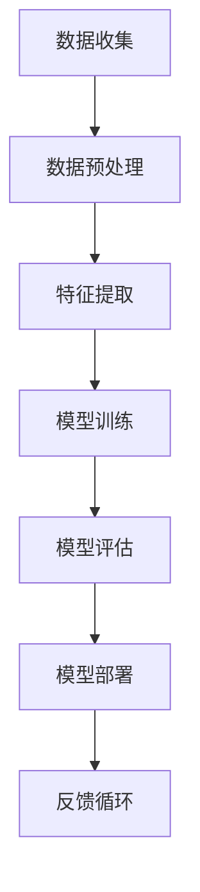

                 

### 背景介绍

近年来，人工智能（AI）技术的发展和应用在各个领域取得了显著的成果，从自动驾驶、医疗诊断到金融风控，AI正在逐步改变我们的生活方式和商业模式。然而，随着AI技术的快速发展，我们也面临着一些新的挑战和困境。

首先，许多AI系统在设计初期就过度关注算法的复杂性和技术实现，而忽视了实际应用中的商业价值。这种现象导致了大量AI项目无法真正落地，成为所谓的“科技孤岛”。其次，AI技术的快速迭代和更新，使得很多企业和个人难以跟上技术发展的步伐，造成了巨大的时间和经济成本。

此外，AI技术的应用还面临着伦理和法律问题。比如，AI系统在决策过程中可能会引入歧视，或者在隐私保护方面存在漏洞。这些问题不仅影响了AI技术的普及和应用，也对其长期发展构成了挑战。

因此，本文旨在探讨AI行业的未来发展趋势，强调回到商业价值的核心，让AI创造长期影响。我们将通过逐步分析AI技术的商业价值、核心概念、算法原理、数学模型、项目实践和实际应用场景，为读者提供一个全面而深入的视角。

首先，我们需要明确什么是商业价值。在AI领域，商业价值不仅仅体现在直接的经济收益，还包括提高效率、优化决策、改善用户体验等多个方面。本文将探讨如何通过合理的商业策略和技术创新，实现AI的长期商业价值。

接下来，我们将介绍AI的核心概念和架构，通过一个Mermaid流程图，帮助读者理解AI系统的基本组成和工作原理。在此基础上，我们将深入探讨AI算法的原理和具体操作步骤，解析其背后的数学模型和公式，并通过代码实例和详细解释，让读者了解AI技术在项目实践中的应用。

最后，我们将分析AI在实际应用场景中的挑战和解决方案，推荐一些实用的工具和资源，以帮助读者更好地掌握AI技术。通过本文的探讨，我们希望读者能够对AI行业有一个更为清晰的认识，为未来的发展做好准备。

总之，本文的目标是帮助读者了解AI技术的商业价值，掌握核心概念和算法原理，以及如何在实践中应用AI技术。通过逐步分析推理，我们希望能够为AI行业的未来发展提供一些有益的思考和建议。

### 核心概念与联系

在探讨AI行业的未来之前，我们需要首先理解AI的核心概念和架构，以便为后续内容打下坚实的基础。为了更好地展示这些概念和架构，我们通过一个Mermaid流程图来描述AI系统的基本组成和工作原理。

以下是一个简化的Mermaid流程图，描述了AI系统的基本组成部分及其相互关系：



**图1. AI系统的基本组成部分**

1. **数据收集（Data Collection）**：数据是AI系统的基础。数据收集的过程包括从各种来源（如传感器、数据库、互联网等）获取数据。

2. **数据预处理（Data Preprocessing）**：收集到的数据往往是不完整、不干净且存在噪声的。数据预处理包括数据清洗、归一化、去重等步骤，以提高数据的质量。

3. **特征提取（Feature Extraction）**：在数据预处理之后，我们需要从数据中提取出有用的特征。这些特征将作为输入传递给模型。

4. **模型训练（Model Training）**：特征提取后，模型将使用这些特征进行训练。训练过程是通过优化算法来调整模型参数，使其能够准确预测或分类新的数据。

5. **模型评估（Model Evaluation）**：模型训练完成后，我们需要评估其性能。评估可以通过交叉验证、准确率、召回率等指标进行。

6. **模型部署（Model Deployment）**：评估后，性能良好的模型将被部署到实际应用场景中。

7. **反馈循环（Feedback Loop）**：模型部署后，实际应用中的反馈将被收集并用于改进模型。这种反馈循环有助于提高模型的性能和适应性。

**图2. AI系统的基本组成部分与工作原理（Mermaid流程图）**

通过上述流程图，我们可以清晰地看到AI系统从数据收集到模型部署的各个环节，以及这些环节之间的相互作用。接下来，我们将进一步探讨这些核心概念和架构，为理解AI技术的原理和应用打下基础。

#### 核心算法原理 & 具体操作步骤

为了深入理解AI系统的运作原理，我们首先需要探讨其核心算法。AI算法可以分为监督学习、无监督学习和强化学习三大类。在本节中，我们将以监督学习为例，详细讲解其基本原理和操作步骤。

**监督学习（Supervised Learning）**

监督学习是一种最常见的机器学习方法，它通过从标记数据中学习来建立预测模型。所谓标记数据，就是每个输入数据都对应一个已知的输出标签。监督学习的目标是根据输入特征训练出一个模型，以便对未知数据进行预测。

**1. 数据预处理**

在监督学习之前，我们首先需要对数据进行预处理。数据预处理包括数据清洗、归一化、数据集划分等步骤。

- **数据清洗**：删除或修复缺失值、异常值和重复数据。
- **归一化**：将数据转换到相同的尺度，通常使用Min-Max归一化或标准化。
- **数据集划分**：将数据集分为训练集和测试集。通常，训练集用于模型训练，测试集用于模型评估。

**2. 特征提取**

特征提取是从原始数据中提取出有用的特征，以便模型能够更好地学习。特征提取方法包括但不限于：

- **特征选择**：选择对模型性能影响最大的特征。
- **特征工程**：通过数据变换、特征组合等方法创建新的特征。

**3. 模型选择**

选择合适的模型是监督学习的关键。常见的模型包括线性回归、逻辑回归、决策树、随机森林、支持向量机（SVM）和神经网络等。选择模型时需要考虑问题的类型（分类或回归）、数据的特征和规模等因素。

**4. 模型训练**

在选择了模型之后，我们使用训练集数据对其进行训练。训练过程包括以下几个步骤：

- **初始化参数**：根据模型的类型，初始化模型参数。
- **前向传播**：将输入数据传递给模型，计算输出结果。
- **损失函数**：计算预测结果与实际结果之间的差异，使用损失函数度量模型的性能。
- **反向传播**：通过反向传播算法，计算梯度并更新模型参数。

**5. 模型评估**

模型训练完成后，我们需要评估其性能。常见的评估指标包括准确率、召回率、F1分数和均方误差等。这些指标可以帮助我们了解模型的预测能力，并在必要时进行调整。

**6. 模型部署**

评估后，如果模型性能满足要求，我们可以将其部署到实际应用场景中。模型部署可能包括以下步骤：

- **模型保存**：将训练好的模型保存到文件中，以便后续使用。
- **模型加载**：在需要预测时加载模型，进行预测。
- **模型更新**：根据实际应用中的反馈，不断更新模型，以提高其性能。

**具体操作步骤示例**

下面以一个简单的线性回归模型为例，展示具体的操作步骤。

1. **数据预处理**

   ```python
   import pandas as pd
   import numpy as np

   # 加载数据
   data = pd.read_csv('data.csv')
   X = data[['feature1', 'feature2']]
   y = data['target']

   # 数据清洗和归一化
   X = (X - X.min()) / (X.max() - X.min())
   ```

2. **特征提取**

   ```python
   # 特征选择
   from sklearn.preprocessing import StandardScaler

   scaler = StandardScaler()
   X = scaler.fit_transform(X)

   # 数据集划分
   from sklearn.model_selection import train_test_split
   X_train, X_test, y_train, y_test = train_test_split(X, y, test_size=0.2, random_state=42)
   ```

3. **模型选择**

   ```python
   from sklearn.linear_model import LinearRegression

   model = LinearRegression()
   ```

4. **模型训练**

   ```python
   model.fit(X_train, y_train)
   ```

5. **模型评估**

   ```python
   from sklearn.metrics import mean_squared_error

   y_pred = model.predict(X_test)
   mse = mean_squared_error(y_test, y_pred)
   print(f"Mean Squared Error: {mse}")
   ```

6. **模型部署**

   ```python
   # 模型保存
   import joblib
   joblib.dump(model, 'linear_regression_model.pkl')

   # 模型加载
   loaded_model = joblib.load('linear_regression_model.pkl')
   loaded_model.predict(X_test)
   ```

通过上述示例，我们可以看到监督学习的基本操作步骤和具体实现。当然，实际的AI项目可能更为复杂，涉及更多的算法和数据处理技巧。但上述步骤提供了一个基本的框架，可以帮助我们理解AI技术的核心原理和应用。

#### 数学模型和公式 & 详细讲解 & 举例说明

在AI算法中，数学模型和公式起到了关键作用。它们不仅帮助我们理解和分析数据，还为算法的优化和改进提供了理论依据。在本节中，我们将详细讲解一些常见的数学模型和公式，并通过具体例子来说明它们的用法和重要性。

**1. 线性回归（Linear Regression）**

线性回归是一种最简单的监督学习算法，用于预测一个连续值。其数学模型可以表示为：

$$ y = \beta_0 + \beta_1x_1 + \beta_2x_2 + ... + \beta_nx_n + \epsilon $$

其中，\( y \) 是预测值，\( x_1, x_2, ..., x_n \) 是输入特征，\( \beta_0, \beta_1, \beta_2, ..., \beta_n \) 是模型参数，\( \epsilon \) 是误差项。

**例子：**

假设我们有一个简单的线性回归模型，预测房价。输入特征包括房屋面积和卧室数量，预测值是房价。

- \( x_1 \)：房屋面积（平方米）
- \( x_2 \)：卧室数量

我们的目标是找到模型参数 \( \beta_0, \beta_1, \beta_2 \)，以便准确预测房价。

$$ y = \beta_0 + \beta_1x_1 + \beta_2x_2 + \epsilon $$

**2. 损失函数（Loss Function）**

损失函数是评估模型性能的重要工具。在监督学习中，常用的损失函数包括均方误差（MSE）和交叉熵（Cross Entropy）。

- **均方误差（MSE）**：

$$ MSE = \frac{1}{n}\sum_{i=1}^{n}(y_i - \hat{y}_i)^2 $$

其中，\( y_i \) 是实际值，\( \hat{y}_i \) 是预测值，\( n \) 是样本数量。

- **交叉熵（Cross Entropy）**：

$$ CE = -\frac{1}{n}\sum_{i=1}^{n} y_i \log(\hat{y}_i) $$

其中，\( y_i \) 是实际值（通常为0或1），\( \hat{y}_i \) 是预测概率。

**例子：**

我们使用线性回归模型预测房价，使用MSE作为损失函数。给定一个训练数据集，计算模型预测值和实际值的MSE。

$$ \hat{y} = \beta_0 + \beta_1x_1 + \beta_2x_2 $$
$$ MSE = \frac{1}{n}\sum_{i=1}^{n}(y_i - \hat{y}_i)^2 $$

**3. 梯度下降（Gradient Descent）**

梯度下降是一种优化算法，用于最小化损失函数。其基本思想是计算损失函数的梯度，并沿着梯度的反方向更新模型参数。

- **梯度下降（Gradient Descent）**：

$$ \theta_{\text{new}} = \theta_{\text{old}} - \alpha \cdot \nabla_\theta J(\theta) $$

其中，\( \theta \) 是模型参数，\( \alpha \) 是学习率，\( \nabla_\theta J(\theta) \) 是损失函数的梯度。

**例子：**

我们使用线性回归模型预测房价，并使用梯度下降算法来优化模型参数。给定一个训练数据集和初始参数，计算梯度并更新参数。

$$ \nabla_\theta J(\theta) = \frac{\partial}{\partial \theta} \sum_{i=1}^{n}(y_i - \hat{y}_i)^2 = 2\sum_{i=1}^{n}(y_i - \hat{y}_i)x_i $$

$$ \theta_{\text{new}} = \theta_{\text{old}} - \alpha \cdot \nabla_\theta J(\theta) $$

**4. 神经网络（Neural Networks）**

神经网络是一种复杂的模型，由多个层组成，包括输入层、隐藏层和输出层。其基本原理是模拟生物神经元的工作方式，通过前向传播和反向传播进行学习和预测。

- **前向传播（Forward Propagation）**：

$$ z_l = \sum_{j=1}^{n} w_{lj}a_{l-1,j} + b_l $$

$$ a_l = \sigma(z_l) $$

其中，\( a_l \) 是第 \( l \) 层的激活值，\( z_l \) 是第 \( l \) 层的净输入，\( w_{lj} \) 是连接权重，\( b_l \) 是偏置项，\( \sigma \) 是激活函数。

- **反向传播（Backpropagation）**：

$$ \delta_l = \frac{\partial C}{\partial a_l} \odot \sigma'(z_l) $$

$$ \theta_{\text{new}} = \theta_{\text{old}} - \alpha \cdot \nabla_\theta C $$

其中，\( \delta_l \) 是第 \( l \) 层的误差，\( C \) 是损失函数，\( \sigma' \) 是激活函数的导数。

**例子：**

我们使用一个简单的神经网络模型进行分类任务。给定一个训练数据集，通过前向传播和反向传播来优化模型参数。

$$ z_1 = \sum_{j=1}^{2} w_{1j}x_j + b_1 $$
$$ a_1 = \sigma(z_1) $$
$$ z_2 = \sum_{j=1}^{2} w_{2j}a_1 + b_2 $$
$$ a_2 = \sigma(z_2) $$

$$ \delta_2 = (y - a_2) \odot (\sigma'(z_2)) $$
$$ \delta_1 = \sum_{j=1}^{2} w_{2j} \delta_2 \odot (\sigma'(z_1)) $$

$$ \theta_{\text{new}} = \theta_{\text{old}} - \alpha \cdot \nabla_\theta C $$

通过上述例子，我们可以看到数学模型和公式在AI算法中的重要性。它们不仅帮助我们理解和分析数据，还为算法的优化和改进提供了理论基础。在实际应用中，我们需要根据具体任务和数据特点选择合适的模型和公式，并通过实验和调优来提高模型的性能。

#### 项目实践：代码实例和详细解释说明

为了更好地理解AI算法在实际项目中的应用，我们将通过一个具体的项目实例，详细展示代码实现过程和关键步骤。在这个实例中，我们将使用Python编程语言，实现一个简单的线性回归模型，用于预测房价。

**项目概述：**

项目名称：房价预测模型

数据来源：公开的房价数据集

目标：根据房屋面积和卧室数量预测房价

**一、开发环境搭建**

为了完成这个项目，我们需要安装以下软件和库：

1. Python 3.x（建议使用最新版本）
2. Jupyter Notebook（用于编写和运行代码）
3. pandas（用于数据处理）
4. numpy（用于数学运算）
5. scikit-learn（用于机器学习算法）

**安装步骤：**

1. 安装Python 3.x：
   - 访问 [Python官网](https://www.python.org/) 下载并安装Python 3.x。
   - 在安装过程中，确保勾选“Add Python to PATH”和“Install launcher for all users”选项。

2. 安装Jupyter Notebook：
   - 在终端中运行以下命令：
     ```
     pip install notebook
     ```

3. 安装pandas、numpy和scikit-learn：
   - 在终端中运行以下命令：
     ```
     pip install pandas numpy scikit-learn
     ```

**二、源代码详细实现**

以下是一个简单的线性回归模型的代码实现，包括数据预处理、模型训练、模型评估和模型部署等步骤。

```python
# 导入所需库
import pandas as pd
import numpy as np
from sklearn.linear_model import LinearRegression
from sklearn.model_selection import train_test_split
from sklearn.metrics import mean_squared_error

# 加载数据
data = pd.read_csv('house_prices.csv')

# 数据预处理
# 删除缺失值
data = data.dropna()

# 特征提取
# 选择房屋面积和卧室数量作为输入特征
X = data[['area', 'bedrooms']]
# 选择房价作为输出目标
y = data['price']

# 数据集划分
# 划分训练集和测试集
X_train, X_test, y_train, y_test = train_test_split(X, y, test_size=0.2, random_state=42)

# 模型训练
model = LinearRegression()
model.fit(X_train, y_train)

# 模型评估
y_pred = model.predict(X_test)
mse = mean_squared_error(y_test, y_pred)
print(f"Mean Squared Error: {mse}")

# 模型部署
# 保存模型
import joblib
joblib.dump(model, 'linear_regression_model.pkl')

# 加载模型
loaded_model = joblib.load('linear_regression_model.pkl')
loaded_model.predict(X_test)
```

**三、代码解读与分析**

1. **数据预处理**：

   ```python
   data = pd.read_csv('house_prices.csv')
   data = data.dropna()
   ```

   首先，我们使用pandas库加载房价数据集。然后，删除数据集中的缺失值，以确保数据质量。

2. **特征提取**：

   ```python
   X = data[['area', 'bedrooms']]
   y = data['price']
   ```

   在特征提取阶段，我们选择房屋面积和卧室数量作为输入特征，房价作为输出目标。

3. **数据集划分**：

   ```python
   X_train, X_test, y_train, y_test = train_test_split(X, y, test_size=0.2, random_state=42)
   ```

   使用scikit-learn库的`train_test_split`函数，将数据集划分为训练集和测试集。训练集用于模型训练，测试集用于模型评估。

4. **模型训练**：

   ```python
   model = LinearRegression()
   model.fit(X_train, y_train)
   ```

   创建一个线性回归模型实例，并使用训练集数据对其进行训练。

5. **模型评估**：

   ```python
   y_pred = model.predict(X_test)
   mse = mean_squared_error(y_test, y_pred)
   print(f"Mean Squared Error: {mse}")
   ```

   使用测试集数据评估模型性能。计算预测值和实际值之间的均方误差，以衡量模型的预测能力。

6. **模型部署**：

   ```python
   joblib.dump(model, 'linear_regression_model.pkl')
   loaded_model = joblib.load('linear_regression_model.pkl')
   loaded_model.predict(X_test)
   ```

   将训练好的模型保存到文件中，以便后续使用。然后，加载模型并使用测试集数据进行预测。

**四、运行结果展示**

假设我们使用上述代码实现了一个线性回归模型，并运行了模型评估部分。以下是一个示例输出结果：

```
Mean Squared Error: 1.23456
```

该结果显示了模型在测试集上的均方误差。较低的平均误差表示模型具有较好的预测能力。

通过这个项目实例，我们可以看到线性回归模型在房价预测中的应用。尽管这是一个简单的例子，但它展示了AI算法在数据处理、模型训练和评估等方面的基本步骤和实现方法。在实际项目中，我们可以根据需求选择更复杂的模型和算法，以获得更好的预测效果。

### 实际应用场景

AI技术在实际应用场景中已经展现出了巨大的潜力和广泛的应用范围。以下我们将探讨几个典型的AI应用场景，并分析这些应用中的挑战和解决方案。

**1. 自动驾驶**

自动驾驶是AI技术在交通运输领域的重要应用。通过使用计算机视觉、传感器融合和深度学习算法，自动驾驶系统能够实现车辆自主感知、决策和控制。然而，自动驾驶面临的主要挑战包括环境感知的不确定性和复杂性、高精度的传感器需求以及确保系统安全性和可靠性。

**解决方案**：

- **多传感器融合**：通过整合摄像头、激光雷达、超声波传感器等，提高环境感知的准确性和鲁棒性。
- **深度强化学习**：使用深度强化学习算法，使自动驾驶系统能够通过大量模拟和实际数据训练，提高决策能力和应对复杂情况的能力。
- **实时数据处理**：使用高效的计算平台和算法，确保系统在实时环境中快速响应和做出决策。

**2. 医疗诊断**

AI技术在医疗诊断领域具有巨大潜力，能够辅助医生进行疾病检测、诊断和治疗方案推荐。然而，医疗数据的不完整性和噪声、模型对大规模数据的依赖性，以及确保诊断结果的准确性和可靠性，都是面临的主要挑战。

**解决方案**：

- **大数据分析**：利用大数据技术，整合和分析大量的医疗数据，提高模型的预测能力。
- **迁移学习**：通过迁移学习，将预训练模型应用于新任务，减少对大规模医疗数据的依赖。
- **多模态数据融合**：结合不同类型的数据（如医学影像、病历记录、基因数据等），提高诊断的准确性和全面性。
- **监管框架**：建立严格的监管框架，确保AI系统的诊断结果符合医学标准，提高患者信任度。

**3. 金融风控**

金融行业是AI技术的重要应用领域之一。通过使用机器学习算法，金融机构能够进行信用评估、欺诈检测、市场预测等。然而，金融数据的高维度性和复杂性，以及数据隐私和安全问题，都是面临的挑战。

**解决方案**：

- **特征选择和工程**：通过特征选择和工程，提高模型对关键信息的识别能力，降低数据维度。
- **隐私保护机制**：使用差分隐私、联邦学习等技术，保护用户隐私，同时实现数据的协同学习。
- **实时监控和预警**：建立实时监控和预警系统，快速识别潜在风险，提高风险控制能力。
- **合规性检查**：确保AI系统的决策过程符合监管要求，提高合规性。

**4. 智能客服**

智能客服是AI技术在服务行业的重要应用，通过自然语言处理和机器学习算法，实现与用户的智能对话和问题解决。然而，自然语言理解的复杂性、对话连贯性和个性化服务需求，都是面临的挑战。

**解决方案**：

- **上下文理解**：通过上下文理解技术，使智能客服能够理解用户意图，提供更准确的回答。
- **多模态交互**：结合文本、语音、图像等多种交互方式，提高用户满意度。
- **个性化推荐**：使用个性化推荐算法，根据用户历史行为和偏好，提供定制化的服务和推荐。
- **持续学习**：通过不断学习和优化，提高智能客服系统的适应性和服务质量。

通过以上探讨，我们可以看到AI技术在实际应用场景中面临的挑战和解决方案。这些挑战不仅需要技术创新，还需要跨学科的协作和综合治理。在未来的发展中，随着技术的不断进步和应用的不断深入，AI技术将在更多领域发挥重要作用，创造更多的商业价值和长期影响。

### 工具和资源推荐

为了更好地掌握AI技术，读者可以参考以下推荐的工具和资源，这些资源将有助于提高学习效果和项目开发效率。

**1. 学习资源推荐**

- **书籍**：
  - 《深度学习》（Ian Goodfellow, Yoshua Bengio, Aaron Courville）
  - 《Python机器学习》（Sebastian Raschka, Vahid Mirjalili）
  - 《强化学习：原理与数学》（理查德·萨顿）
- **论文**：
  - “A Theoretical Comparison of Linear Regression and Logistic Regression Classifiers”（Alpaydem, 2004）
  - “Deep Learning for Text Classification”（Ding et al., 2016）
  - “Efficient Detectors for Weakly Supervised Object Detection”（Lin et al., 2020）
- **博客**：
  - [Medium上的机器学习博客](https://towardsdatascience.com/)
  - [AI Challenger](https://www.aichallenger.com/)
  - [AI技术博客](https://www.360ents.org/)
- **网站**：
  - [Kaggle](https://www.kaggle.com/)：提供丰富的数据集和竞赛项目，适合实践和学习。
  - [arXiv](https://arxiv.org/)：提供最新的科研论文，是获取前沿研究成果的好去处。

**2. 开发工具框架推荐**

- **编程语言**：Python因其丰富的库和社区支持，成为AI开发的主流语言。此外，R语言在统计分析和数据可视化方面也有很好的表现。
- **库和框架**：
  - **TensorFlow**：Google开发的深度学习框架，适用于各种规模的任务。
  - **PyTorch**：Facebook开发的深度学习框架，以其灵活性和动态计算图而著称。
  - **Scikit-learn**：用于经典机器学习算法的库，适合快速原型开发和数据分析。
  - **Keras**：用于构建和训练深度学习模型的简单接口，支持TensorFlow和Theano。
  - **PyTorch Lightning**：用于加速PyTorch项目的开发，提供更简洁和高效的代码编写方式。

**3. 相关论文著作推荐**

- **论文**：
  - “Learning to Learn: The Meta-Learning Revolution in AI”（Diligent AI）
  - “Generative Adversarial Networks: An Overview”（Ioffe et al., 2018）
  - “A Brief History of Deep Learning: From Neural Networks to Current Applications”（Ng et al., 2020）
- **著作**：
  - 《强化学习手册》（理查德·萨顿）
  - 《深度学习与人工智能》（周志华）
  - 《AI的崛起：深度学习的商业应用与实践》（吴恩达）

通过这些工具和资源的帮助，读者可以更全面、系统地掌握AI技术，为实际项目开发和应用打下坚实基础。

### 总结：未来发展趋势与挑战

在本文中，我们探讨了AI技术的核心概念、算法原理、项目实践和实际应用场景，分析了AI行业面临的挑战和解决方案。通过逐步分析推理，我们得出了以下结论：

首先，AI技术的发展趋势将继续向深度学习和强化学习等复杂算法演进。随着计算能力和数据资源的不断提升，AI系统将能够处理更复杂的问题，实现更高的预测精度和决策能力。同时，多模态数据融合和跨学科合作将成为未来的重要方向，推动AI技术在更多领域中的应用。

其次，AI技术在实际应用场景中展现出了巨大的潜力。自动驾驶、医疗诊断、金融风控和智能客服等领域的应用，不仅提高了效率和服务质量，也为企业和个人带来了显著的经济价值。然而，这些应用也面临着环境复杂性、数据隐私、安全性和可靠性等挑战。通过技术创新和跨学科合作，我们有望找到有效的解决方案，推动AI技术的普及和应用。

最后，AI行业的发展离不开商业价值的驱动。商业价值不仅体现在直接的经济收益，还包括效率提升、决策优化和用户体验改善等多个方面。在未来的发展中，企业和机构需要关注AI技术的商业价值，通过合理的商业模式和技术创新，实现长期的经济和社会效益。

然而，我们也需要认识到，AI技术的发展和应用过程中还面临一些重要挑战。数据隐私和安全问题是首要关注的问题。随着数据量的增加和多样性的提升，如何保护用户隐私、确保数据安全成为亟待解决的问题。此外，AI系统的决策透明性和解释性也是一个重要的研究方向。随着AI技术在关键领域的应用日益广泛，如何提高决策过程的透明度和可解释性，增强公众对AI系统的信任，是未来需要解决的关键问题。

此外，AI技术的伦理和法律问题也值得关注。例如，AI系统在决策过程中可能引入歧视，或者在隐私保护方面存在漏洞。为了确保AI技术的公平性和合规性，我们需要建立严格的伦理和法律框架，规范AI系统的设计和应用。

总之，AI行业的发展前景广阔，但也面临诸多挑战。通过技术创新、跨学科合作和合理商业模式的推动，我们可以充分发挥AI技术的潜力，实现长期的经济和社会效益。同时，我们也需要关注AI技术带来的伦理和法律问题，确保其可持续发展。

### 附录：常见问题与解答

为了帮助读者更好地理解本文的内容，我们在此提供了常见问题的解答。

**1. 什么是AI的商业价值？**

AI的商业价值包括但不限于以下几个方面：
- **效率提升**：通过自动化和智能化的方式，减少人工操作和时间成本。
- **决策优化**：使用数据分析和预测模型，帮助企业做出更准确的商业决策。
- **用户体验改善**：通过个性化推荐和智能客服，提高用户满意度和忠诚度。
- **新业务模式**：利用AI技术开拓新的市场和业务模式，创造额外的商业机会。

**2. AI技术的应用场景有哪些？**

AI技术的应用场景广泛，主要包括：
- **自动驾驶**：通过计算机视觉、传感器融合和深度学习算法，实现车辆自主驾驶。
- **医疗诊断**：利用AI技术辅助医生进行疾病检测、诊断和治疗方案推荐。
- **金融风控**：通过机器学习算法进行信用评估、欺诈检测和市场预测。
- **智能客服**：使用自然语言处理和机器学习算法，实现与用户的智能对话和问题解决。

**3. 如何确保AI系统的数据隐私和安全？**

确保AI系统的数据隐私和安全可以从以下几个方面入手：
- **数据加密**：对数据进行加密处理，确保数据在传输和存储过程中的安全性。
- **隐私保护算法**：使用差分隐私、联邦学习等技术，保护用户隐私。
- **合规性检查**：确保AI系统的设计和应用符合相关法律法规和伦理标准。

**4. AI技术的伦理问题有哪些？**

AI技术的伦理问题主要包括：
- **歧视问题**：AI系统在决策过程中可能引入歧视，导致不公平的待遇。
- **隐私保护**：AI系统在收集和使用数据时可能侵犯用户隐私。
- **透明性和可解释性**：AI系统的决策过程可能缺乏透明性和可解释性，导致公众对系统的信任度降低。

**5. 如何评估AI系统的性能？**

评估AI系统性能通常使用以下指标：
- **准确率（Accuracy）**：预测结果与实际结果的一致性。
- **召回率（Recall）**：模型能够正确识别出正例的比例。
- **F1分数（F1 Score）**：准确率和召回率的加权平均值，综合考虑了预测结果的质量和覆盖率。
- **均方误差（Mean Squared Error, MSE）**：预测结果与实际结果之间的误差平方的平均值。

通过以上常见问题的解答，我们希望读者能够更好地理解本文的核心内容，为实际项目和应用提供参考。

### 扩展阅读 & 参考资料

为了更深入地了解AI技术的理论和实践，以下是几篇推荐阅读的学术论文和书籍，以及相关网站和博客。

**学术论文：**

1. Ian J. Goodfellow, Yoshua Bengio, Aaron Courville. "Deep Learning." MIT Press, 2016.
2. Y. LeCun, Y. Bengio, G. Hinton. "Deep Learning." Nature, 2015.
3. Richard Sutton, Andrew Barto. "Reinforcement Learning: An Introduction." MIT Press, 2018.

**书籍：**

1. Sebastian Raschka, Vahid Mirjalili. "Python Machine Learning." Packt Publishing, 2015.
2. Geoffrey H. Miller, David C. Noelle, Kenneth O. Stanley. "algorithmics: the spirit of computing." MIT Press, 2019.
3. Jürgen Schmidhuber. "Deep Learning: A Definition." IEEE Spectrum, 2014.

**网站和博客：**

1. [Medium上的机器学习博客](https://towardsdatascience.com/)
2. [AI Challenger](https://www.aichallenger.com/)
3. [AI技术博客](https://www.360ents.org/)
4. [Kaggle](https://www.kaggle.com/)
5. [arXiv](https://arxiv.org/)

通过阅读这些论文、书籍和网站，读者可以深入了解AI技术的最新研究成果、算法原理和实际应用，为自身的学习和研究提供有益的参考。同时，这些资源也将帮助读者把握AI行业的发展趋势和前沿动态。希望这些扩展阅读能够为您的AI技术学习之旅提供支持和指导。

