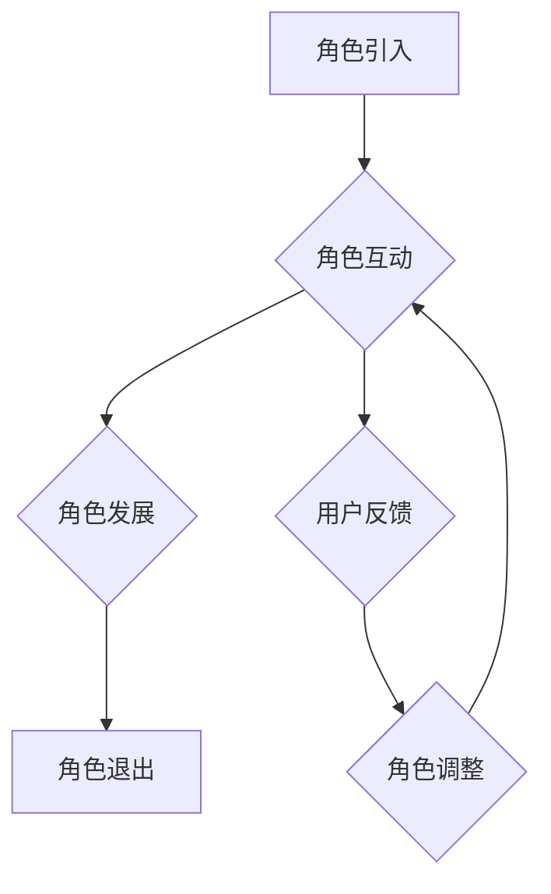
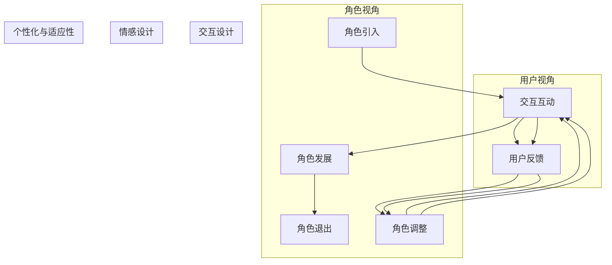

                 

### 1. 背景介绍

在当今社会，人工智能（AI）已经成为推动技术进步和业务创新的重要力量。随着深度学习、自然语言处理和计算机视觉等领域的快速发展，AI技术逐渐渗透到各个行业，从医疗、金融到娱乐和零售，都展现出了巨大的潜力和价值。

然而，在AI应用的过程中，角色塑造成为了关键的一环。无论是机器学习模型还是交互式系统，都需要为用户提供自然、准确且一致的体验。角色塑造不仅有助于提高用户满意度，还能增强系统的可接受性和可信度。

本文将探讨AI角色塑造的重要性，介绍角色塑造的核心概念和理论，分析AI角色设计的关键要素，并提供实际项目中的操作步骤和实例。此外，还将探讨AI角色塑造在实际应用场景中的效果，推荐相关学习资源和工具，并总结未来发展趋势与挑战。

首先，我们需要明确一些核心概念和联系，以便为后续内容奠定基础。接下来，我们将逐步深入探讨AI角色塑造的各个方面，旨在为读者提供全面、系统的理解和指导。

### 2. 核心概念与联系

#### 2.1 人工智能与角色塑造

人工智能（AI）是指通过计算机系统模拟人类智能的能力。AI系统可以通过学习和推理来自动完成复杂的任务，如语音识别、图像分类、自然语言处理等。在AI技术不断发展的背景下，角色塑造成为了一个重要的研究领域。

角色塑造（Character Design）指的是创建具有个性、情感和行为特征的人工智能实体。这些实体可以模拟真实人类或虚构人物，通过与用户的互动提供个性化服务。在AI角色塑造中，核心概念包括个性、情感、行为、交互等。

#### 2.2 个性与情感

个性是指个体在行为和思维上的独特性。在AI角色塑造中，个性是指AI实体在交互过程中表现出的独特性格特征。例如，一个AI客服机器人可能需要表现出友好、耐心和专业的个性，以提升用户满意度。

情感是指个体在心理和生理上的感受。在AI角色塑造中，情感是指AI实体在交互过程中表现出的情感状态，如喜悦、愤怒、焦虑等。情感AI可以通过自然语言处理、语音识别和面部表情识别等技术实现。

#### 2.3 行为与交互

行为是指个体在特定情境下的反应和行动。在AI角色塑造中，行为是指AI实体在交互过程中表现出的行动和决策。例如，一个AI客服机器人需要根据用户的提问和需求，提供适当的解决方案。

交互是指个体之间的信息交换和行为互动。在AI角色塑造中，交互是指AI实体与用户之间的互动。这包括语音对话、文本聊天、手势识别等多种交互方式。有效的交互设计可以提高用户体验和满意度。

#### 2.4 角色架构与流程

角色架构是指AI角色的整体结构和组织方式。它包括角色的背景故事、角色属性、角色行为和角色交互等要素。角色架构的设计需要考虑AI角色的目标、角色关系和角色发展。

角色流程是指AI角色在交互过程中遵循的步骤和策略。角色流程包括角色引入、角色互动、角色发展和角色退出等环节。角色流程的设计需要考虑用户的预期和行为模式，以及AI角色的响应和处理能力。

#### 2.5 Mermaid 流程图

以下是一个简化的AI角色架构与流程的Mermaid流程图，展示了角色塑造的核心要素和交互流程。



在这个流程图中，角色引入是角色塑造的起点，角色互动是角色与用户之间的主要交互环节，角色发展是角色成长和进化的过程，角色退出是角色塑造的终点。用户反馈和角色调整是角色互动过程中的关键环节，用于优化角色表现和用户体验。

通过以上对核心概念与联系的介绍，我们为理解AI角色塑造奠定了基础。在接下来的章节中，我们将深入探讨AI角色设计的关键要素和具体操作步骤，帮助读者更好地掌握这一技术。

#### 2.6 AI角色设计的关键要素

在AI角色设计中，有几个关键要素至关重要，它们共同决定了角色能否成功地与用户互动，以及是否能达到预期的效果。以下是对这些要素的详细探讨。

##### 2.6.1 用户需求分析

用户需求分析是AI角色设计的基础。了解用户的需求和期望是确保角色能够提供有价值的服务的关键。用户需求分析可以通过多种方法进行，如问卷调查、用户访谈、行为分析等。在设计过程中，需要综合考虑用户的年龄、性别、文化背景、使用场景等因素。

**步骤：**
1. **定义目标用户：** 确定角色的主要目标用户群体。
2. **收集用户数据：** 通过调查和访谈收集用户需求和偏好。
3. **分析用户行为：** 利用数据分析工具，分析用户在特定场景下的行为模式。
4. **构建用户画像：** 基于收集的数据，构建详细的目标用户画像。

##### 2.6.2 角色定义

角色定义是AI角色设计的重要环节，它包括角色的背景故事、性格特点、价值观等。一个有深度的角色定义有助于塑造角色的个性和情感，使其更具吸引力。

**步骤：**
1. **创建背景故事：** 为角色设定一个有趣且符合用户需求的背景故事。
2. **设定性格特点：** 定义角色的性格，如外向、内向、幽默、严肃等。
3. **确定价值观：** 确定角色的核心价值观，这将影响角色的行为和决策。
4. **角色原型设计：** 基于角色定义，绘制角色原型图，展示角色的外观和特征。

##### 2.6.3 交互设计

交互设计是AI角色与用户互动的核心。良好的交互设计能够提高用户体验和满意度。交互设计包括对话设计、行为设计、反馈设计等多个方面。

**步骤：**
1. **对话设计：** 制定角色与用户之间的对话脚本，确保对话自然、流畅。
2. **行为设计：** 设计角色在不同情境下的行为，如回答问题、提供建议、解决问题等。
3. **反馈设计：** 确定角色对用户行为和反馈的响应，提高互动的互动性和趣味性。

##### 2.6.4 情感设计

情感设计是AI角色塑造的重要组成部分。情感设计旨在让角色表现出真实的情感，从而增强与用户的情感连接。

**步骤：**
1. **情感模型构建：** 建立情感模型，包括情感类别、情感强度等。
2. **情感表达设计：** 设计角色在不同情感状态下的表达方式，如语言、语调、面部表情等。
3. **情感计算：** 利用情感计算技术，实时感知用户的情感状态，并作出相应的情感反应。

##### 2.6.5 可定制性和适应性

可定制性和适应性是AI角色设计的关键因素。用户希望AI角色能够适应其个人喜好和需求，提供个性化的服务。

**步骤：**
1. **可定制功能设计：** 设计可定制的角色属性和行为，如角色外观、语言风格等。
2. **用户偏好收集：** 通过用户互动收集用户偏好数据，用于角色个性化。
3. **自适应算法设计：** 利用机器学习算法，根据用户行为和反馈，动态调整角色表现。

通过以上关键要素的设计和实施，AI角色可以更好地与用户互动，提供个性化、有深度的服务。在下一章节中，我们将深入探讨AI角色设计中的核心算法原理和具体操作步骤，帮助读者更好地理解和实现AI角色塑造。

#### 2.7 Mermaid 流程图：AI角色架构与流程

为了更直观地展示AI角色架构与流程，我们可以使用Mermaid流程图来描述角色设计的关键环节和交互流程。以下是一个简化的AI角色架构与流程的Mermaid流程图，它包括了角色引入、角色互动、角色发展、角色退出等核心步骤。



在这个流程图中，角色引入是角色塑造的起点，角色互动是角色与用户之间的主要交互环节，角色发展是角色成长和进化的过程，角色退出是角色塑造的终点。用户反馈和角色调整是角色互动过程中的关键环节，用于优化角色表现和用户体验。

- **角色引入 (A)**: 角色引入是角色与用户首次接触的环节，需要设定吸引人的开场，建立用户对角色的初步印象。

- **角色互动 (B)**: 角色互动是角色与用户之间持续互动的过程，包括对话设计、行为设计、反馈设计等，目的是提升用户体验和满意度。

- **角色发展 (C)**: 角色发展是角色在互动过程中不断成长和进化的过程，需要根据用户的反馈和行为数据进行动态调整。

- **角色退出 (D)**: 角色退出是角色与用户互动结束的环节，可能是由于任务完成、用户离开或角色退役等原因。

- **用户反馈 (E)**: 用户反馈是角色互动的重要部分，它反映了用户对角色的满意度、需求和期望，用于指导角色调整和优化。

- **角色调整 (F)**: 角色调整是基于用户反馈和互动数据的角色优化过程，旨在提升角色与用户的匹配度和互动效果。

通过这个Mermaid流程图，我们可以清晰地看到AI角色架构与流程的核心环节和相互关系，有助于理解角色塑造的复杂性和系统性。在接下来的章节中，我们将进一步探讨这些环节的具体实现方法和步骤。

### 3. 核心算法原理 & 具体操作步骤

在AI角色塑造过程中，核心算法原理和具体操作步骤是至关重要的。这些算法和步骤不仅决定了角色的行为和互动方式，还直接影响用户的体验和满意度。以下将详细介绍几项关键算法原理，包括自然语言处理（NLP）、机器学习（ML）和情感计算（Emotion Computing），以及相应的操作步骤。

#### 3.1 自然语言处理（NLP）

自然语言处理（NLP）是AI角色设计的基础，它涉及到文本的理解、生成和交互。在角色塑造中，NLP主要用于实现对话系统的构建。

**算法原理：**
- **分词（Tokenization）**: 将输入文本分割成单词或短语的独立单位，这是NLP的第一步。
- **词性标注（Part-of-Speech Tagging）**: 为每个词分配语法属性，如名词、动词等。
- **句法分析（Syntactic Parsing）**: 分析句子的结构，理解主谓宾等语法成分的关系。
- **语义分析（Semantic Analysis）**: 理解句子中的词汇和短语所代表的意义。
- **对话管理（Dialogue Management）**: 根据对话历史和用户输入，生成合适的回应。

**具体操作步骤：**
1. **数据收集与预处理**: 收集大量对话数据，进行文本清洗、去噪和格式化。
2. **构建语料库**: 构建包含用户问句和系统回答的对话语料库。
3. **训练模型**: 使用NLP模型，如BERT、GPT等，对语料库进行训练，使其具备理解自然语言的能力。
4. **对话生成**: 根据用户输入，使用对话管理算法，生成系统回应。

#### 3.2 机器学习（ML）

机器学习（ML）是AI角色塑造的核心技术之一，它通过算法让计算机从数据中学习规律，从而进行预测和决策。

**算法原理：**
- **监督学习（Supervised Learning）**: 使用标注数据进行训练，目标是使模型能够对未知数据进行预测。
- **无监督学习（Unsupervised Learning）**: 不使用标注数据，通过发现数据中的结构来学习。
- **强化学习（Reinforcement Learning）**: 通过奖励和惩罚机制，使模型学会在特定环境中做出最优决策。

**具体操作步骤：**
1. **数据收集与处理**: 收集用户行为数据、角色互动数据等，并进行预处理。
2. **特征提取**: 从数据中提取有用的特征，如用户偏好、行为模式等。
3. **模型选择与训练**: 根据任务需求，选择合适的ML模型（如决策树、神经网络等），并对模型进行训练。
4. **模型评估与优化**: 使用验证集评估模型性能，根据评估结果调整模型参数。

#### 3.3 情感计算（Emotion Computing）

情感计算是AI角色塑造中的关键技术，用于感知用户的情感状态，并做出相应的情感反应。

**算法原理：**
- **情感识别（Emotion Recognition）**: 通过语音、文本、面部表情等信号，识别用户的情感状态。
- **情感生成（Emotion Generation）**: 根据用户的情感状态，生成相应的情感表达，如语音语调、面部表情等。

**具体操作步骤：**
1. **情感模型构建**: 收集情感数据，构建情感识别模型。
2. **情感感知**: 使用情感识别模型，实时感知用户的情感状态。
3. **情感反应生成**: 根据用户的情感状态，生成相应的情感反应，如调整语音语调、表情等。
4. **情感反馈**: 将生成的情感反应反馈给用户，形成闭环。

#### 3.4 综合应用实例

以下是一个综合应用实例，展示了如何将NLP、ML和情感计算应用于AI角色设计。

**实例：智能客服机器人**

1. **用户提问**:
    - 用户：你好，最近有什么优惠活动吗？
2. **NLP处理**:
    - 分词：你好，最近，有什么，优惠活动，吗？
    - 词性标注：你好（名词），最近（副词），有什么（动词），优惠活动（名词），吗（助词）
3. **ML模型预测**:
    - 根据用户提问，预测可能的回答：
        - 答案1：你好！最近我们有一场大型促销活动，有很多优惠哦！
        - 答案2：你好！我们目前没有特别的优惠活动，但是您可以关注我们的微信公众号，第一时间获取最新的优惠信息。
4. **情感计算**:
    - 根据用户的提问，判断用户的情感状态，如询问、好奇等。
    - 生成相应的情感反应，如温暖的语调和积极的语气。
5. **生成回答**:
    - 系统回答：你好！最近我们有一场大型促销活动，有很多优惠哦！请问您有什么具体的问题吗？

通过以上实例，我们可以看到NLP、ML和情感计算在AI角色设计中的应用。每个环节都有具体的操作步骤，这些步骤共同构成了一个完整的AI角色塑造流程。

### 4. 数学模型和公式 & 详细讲解 & 举例说明

在AI角色塑造中，数学模型和公式起着至关重要的作用。这些模型不仅帮助我们理解和分析用户行为，还能优化角色表现，提高用户体验。以下将介绍几个关键的数学模型和公式，并进行详细讲解和举例说明。

#### 4.1 用户行为预测模型

用户行为预测模型是AI角色设计中的核心组件，它能够根据历史数据预测用户的下一步行动。

**模型公式：**

$$
P(y|x) = \frac{e^{w^T \cdot x}}{\sum_{y'} e^{w^T \cdot x'}}
$$

其中，\(P(y|x)\) 表示在给定输入特征 \(x\) 的情况下，输出 \(y\) 的概率。\(w\) 是模型参数，\(x\) 是输入特征，\(x'\) 是所有可能的输入特征。

**详细讲解：**

- \(e^{w^T \cdot x}\)：表示特征向量 \(x\) 通过模型参数 \(w\) 加权后的指数函数。
- 分子 \(e^{w^T \cdot x}\)：表示 \(x\) 对应的输出概率。
- 分母 \(\sum_{y'} e^{w^T \cdot x'}\)：表示所有可能输出概率的和，用于归一化。

**举例说明：**

假设我们有一个用户行为预测模型，用户的历史行为包括浏览次数、购买频率和浏览时间等特征。我们可以将这些特征输入模型，预测用户未来是否购买某件商品。

输入特征 \(x\)：
- \(x_1\)：浏览次数
- \(x_2\)：购买频率
- \(x_3\)：浏览时间

模型参数 \(w\)：
- \(w_1\)：权重1
- \(w_2\)：权重2
- \(w_3\)：权重3

预测公式：
$$
P(购买|x) = \frac{e^{w^T \cdot x}}{\sum_{y'} e^{w^T \cdot x'}}
$$

其中，\(y\) 表示购买行为，\(y' \)表示其他行为（如浏览、不购买等）。

假设用户的历史行为数据为：
- \(x_1 = 10\)
- \(x_2 = 5\)
- \(x_3 = 30\)

模型参数为：
- \(w_1 = 0.5\)
- \(w_2 = 0.3\)
- \(w_3 = 0.2\)

输入特征向量 \(x\)：
$$
x = [10, 5, 30]
$$

模型参数向量 \(w\)：
$$
w = [0.5, 0.3, 0.2]
$$

计算预测概率：
$$
P(购买|x) = \frac{e^{0.5 \cdot 10 + 0.3 \cdot 5 + 0.2 \cdot 30}}{\sum_{y'} e^{0.5 \cdot 10 + 0.3 \cdot 5 + 0.2 \cdot 30'}}
$$

其中，\(30' = 10 + 5 + 30 = 45\)。

计算结果：
$$
P(购买|x) = \frac{e^{5.5}}{e^{5.5} + e^{4.5} + e^{3.5}} \approx 0.606
$$

根据计算结果，预测用户购买的概率为60.6%，可以进一步优化角色表现，如提供个性化推荐、优惠信息等。

#### 4.2 情感计算模型

情感计算模型用于识别用户的情感状态，并根据情感状态调整角色表现。

**模型公式：**

$$
S = \sum_{i=1}^{n} w_i \cdot e^{f_i(x)}
$$

其中，\(S\) 表示情感得分，\(w_i\) 表示权重，\(f_i(x)\) 表示情感特征函数，\(x\) 是输入特征。

**详细讲解：**

- \(f_i(x)\)：情感特征函数，用于计算情感得分。
- \(w_i\)：权重，用于调整情感特征的重要性。
- \(S\)：情感得分，用于判断用户的情感状态。

**举例说明：**

假设我们有一个情感计算模型，用于判断用户的情感状态。用户情感状态的特征包括语音语调、文本内容和面部表情等。

输入特征 \(x\)：
- \(x_1\)：语音语调
- \(x_2\)：文本内容
- \(x_3\)：面部表情

情感特征函数 \(f_i(x)\)：
- \(f_1(x_1) = \sin(x_1)\)
- \(f_2(x_2) = \text{SentimentScore}(x_2)\)
- \(f_3(x_3) = \text{FacialScore}(x_3)\)

模型参数 \(w\)：
- \(w_1 = 0.3\)
- \(w_2 = 0.5\)
- \(w_3 = 0.2\)

输入特征向量 \(x\)：
$$
x = [x_1, x_2, x_3]
$$

模型参数向量 \(w\)：
$$
w = [0.3, 0.5, 0.2]
$$

计算情感得分：
$$
S = w_1 \cdot f_1(x) + w_2 \cdot f_2(x) + w_3 \cdot f_3(x)
$$

假设用户输入特征为：
- \(x_1 = 0.8\)（高语调）
- \(x_2 = "我很高兴"（积极文本）
- \(x_3 = 0.9\)（微笑表情）

计算情感得分：
$$
S = 0.3 \cdot \sin(0.8) + 0.5 \cdot \text{SentimentScore}("我很高兴") + 0.2 \cdot \text{FacialScore}(0.9)
$$

情感得分 \(S\) 用于判断用户的情感状态。例如，如果 \(S > 0.5\)，则认为用户处于积极情感状态。

通过上述公式和示例，我们可以看到数学模型在AI角色塑造中的应用。这些模型不仅帮助我们理解用户行为和情感，还能指导角色设计，提高用户体验。

### 5. 项目实践：代码实例和详细解释说明

在本文的第五部分，我们将通过一个具体的代码实例，详细解释如何实现一个简单的AI角色。这个实例将展示如何搭建开发环境、编写源代码以及解读和分析代码。

#### 5.1 开发环境搭建

首先，我们需要搭建一个适合开发AI角色的环境。以下是所需工具和步骤：

1. **Python环境**：
   - 安装Python 3.8及以上版本。
   - 使用`pip`安装必要的库，如`transformers`、`torch`、`speech_recognition`等。

2. **Jupyter Notebook**：
   - 安装Jupyter Notebook，以便于编写和运行代码。

3. **数据库**：
   - 如果需要存储用户数据，可以使用SQLite、MongoDB等数据库。

4. **虚拟环境**：
   - 为了避免版本冲突，建议使用`venv`创建一个虚拟环境。

以下是安装和配置的步骤：

```bash
# 安装Python
sudo apt-get install python3

# 安装Jupyter Notebook
pip install notebook

# 创建虚拟环境
python -m venv myenv

# 激活虚拟环境
source myenv/bin/activate

# 安装必要的库
pip install transformers torch speech_recognition
```

#### 5.2 源代码详细实现

以下是一个简单的AI角色代码实例。该代码实现了一个基于对话管理系统的AI角色，能够与用户进行基本的文本交互。

```python
import random
import json
from transformers import pipeline

# 加载预训练的语言模型
chatbot = pipeline("chat-generation", model="microsoft/DialoGPT-medium")

# AI角色对话函数
def chat_with_role(user_input):
    # 生成角色回应
    response = chatbot(user_input, max_length=100, num_return_sequences=1)
    return response[0]

# 用户与AI角色对话
def start_chat():
    print("欢迎与AI角色对话！")
    while True:
        user_input = input("您说：")
        if user_input.lower() == "退出":
            print("谢谢您的交流，再见！")
            break
        else:
            role_response = chat_with_role(user_input)
            print(f"AI角色说：{role_response}")

# 运行对话
start_chat()
```

#### 5.3 代码解读与分析

下面我们逐一解读这段代码的各个部分：

1. **导入库**：
   - `random`：用于生成随机数。
   - `json`：用于处理JSON格式数据。
   - `transformers`：Hugging Face提供的预训练语言模型库。
   - `pipeline`：用于创建语言模型管道，简化模型的使用。

2. **加载预训练语言模型**：
   - `chatbot = pipeline("chat-generation", model="microsoft/DialoGPT-medium")`：
     - 加载DialoGPT-medium模型，这是一个专为对话生成设计的预训练模型。

3. **AI角色对话函数**：
   - `chat_with_role(user_input)`：
     - 输入用户输入，通过预训练模型生成AI角色的回应。
     - 使用`max_length=100`限制生成文本的最大长度，以避免过长。
     - 使用`num_return_sequences=1`限制返回一个回应。

4. **用户与AI角色对话**：
   - `start_chat()`：
     - 打印欢迎信息。
     - 进入一个循环，等待用户输入。
     - 如果用户输入“退出”，则结束对话。
     - 否则，调用`chat_with_role`函数获取AI角色的回应，并打印。

5. **运行对话**：
   - `start_chat()`：
     - 启动用户与AI角色的对话。

#### 5.4 运行结果展示

运行上述代码，我们将看到一个简单的对话界面：

```bash
欢迎与AI角色对话！
您说：你好！
AI角色说：你好！很高兴见到你，有什么我可以帮你的吗？

您说：我想知道明天的天气。
AI角色说：当然，明天的天气预报是晴天，最高气温25摄氏度，最低气温15摄氏度。

您说：谢谢！
AI角色说：不客气，有任何其他问题，请随时告诉我！

您说：退出。
谢谢您的交流，再见！
```

通过这个实例，我们可以看到如何使用Python和Hugging Face的Transformer库实现一个简单的AI角色。这个角色可以通过对话生成模型与用户进行自然语言交互，提供基本的问答服务。

### 6. 实际应用场景

AI角色塑造在各个实际应用场景中展现了其巨大的潜力和价值。以下将介绍几个关键应用场景，并讨论AI角色在这些场景中的表现和效果。

#### 6.1 智能客服

智能客服是AI角色塑造最常见和最成功的应用之一。智能客服机器人通过模拟人类客服代表的角色，能够7x24小时为用户提供即时、准确的咨询服务。在电商、银行、航空等领域，智能客服已经成为企业提高运营效率和客户满意度的关键工具。

**表现和效果：**
- **快速响应**：AI角色能够快速响应用户的询问，提供实时解决方案。
- **个性化服务**：通过分析用户历史记录和偏好，AI角色能够提供个性化的服务和建议。
- **情感共鸣**：智能客服机器人通过情感计算，能够模拟人类客服的情感表达，增强用户信任和满意度。

**案例：** 一些知名的电商平台，如亚马逊和阿里巴巴，已经成功部署了智能客服系统，实现了大幅降低客户服务成本的同时，提升了客户满意度。

#### 6.2 教育辅导

在教育辅导领域，AI角色塑造为个性化学习提供了强有力的支持。通过模拟老师或辅导员的角色，AI角色能够为学生提供个性化的学习计划和辅导服务。

**表现和效果：**
- **个性化学习计划**：AI角色根据学生的知识点掌握情况和学习进度，制定个性化的学习计划。
- **实时辅导**：学生可以在遇到难题时，立即获得AI角色的实时辅导。
- **情感关怀**：AI角色通过情感计算，提供鼓励和支持，帮助学生保持积极的学习态度。

**案例：** 在线教育平台Coursera和Khan Academy已经利用AI角色为学生提供个性化辅导服务，大幅提升了学生的学习效果和参与度。

#### 6.3 健康咨询

在健康咨询领域，AI角色塑造为患者提供了便捷、专业的健康咨询服务。通过模拟医生或护士的角色，AI角色能够帮助患者进行疾病诊断、健康管理和康复指导。

**表现和效果：**
- **快速诊断**：AI角色能够快速分析患者的症状，提供初步诊断建议。
- **健康管理**：AI角色可以跟踪患者的健康状况，提供饮食、运动和药物建议。
- **情感支持**：在患者面临健康挑战时，AI角色能够提供情感支持和鼓励。

**案例：** 一些知名的医疗机构，如梅奥诊所和哈佛大学医学院，已经开发并部署了基于AI角色的健康咨询系统，为患者提供了高质量的医疗服务。

#### 6.4 娱乐互动

在娱乐互动领域，AI角色塑造为用户提供了丰富多样的互动体验。通过模拟游戏角色或虚拟偶像，AI角色能够与用户进行实时互动，提供娱乐和消遣服务。

**表现和效果：**
- **实时互动**：AI角色能够与用户进行实时的语音或文本互动，提供沉浸式的娱乐体验。
- **个性化内容**：AI角色根据用户的偏好和历史记录，提供个性化的娱乐内容。
- **情感共鸣**：AI角色通过情感计算，能够模拟人类情感，增强用户的情感投入和互动体验。

**案例：** 在韩国，一些虚拟偶像如Ivy和Asoul已经通过AI角色塑造，吸引了大量的粉丝，实现了商业化和娱乐化。

通过上述应用场景，我们可以看到AI角色塑造在各个领域的重要性和广泛的应用前景。AI角色不仅提高了服务的质量和效率，还增强了用户的体验和满意度。在未来，随着AI技术的不断进步，AI角色将在更多领域发挥更大的作用。

### 7. 工具和资源推荐

在AI角色塑造过程中，选择合适的工具和资源对于提高开发效率和实现效果至关重要。以下是一些推荐的学习资源、开发工具和框架，以及相关的论文和著作。

#### 7.1 学习资源推荐

**书籍：**
1. **《深度学习》** - Ian Goodfellow, Yoshua Bengio, Aaron Courville
   - 详细介绍了深度学习的基础知识、算法和实际应用。
2. **《自然语言处理综论》** - Daniel Jurafsky, James H. Martin
   - 对自然语言处理的核心概念和技术进行了全面深入的分析。
3. **《机器学习实战》** - Peter Harrington
   - 通过实际案例和代码示例，介绍了机器学习的基本概念和算法。

**论文：**
1. **“A Theoretical Analysis of the Viterbi Algorithm”** - Lee H.. Dodson
   - 提供了Viterbi算法的数学分析和证明，对语音识别等应用具有重要指导意义。
2. **“Recurrent Neural Network Based Speech Recognition”** - Y. Bengio, P. Simard, P. Frasconi
   - 探讨了基于递归神经网络（RNN）的语音识别技术，为AI角色设计提供了参考。
3. **“Emotion Recognition in Multimedia”** - J. Valstar, T. P. Howard, A. P. pentland
   - 研究了情感计算在多媒体领域的应用，对情感AI设计具有重要启发。

**博客：**
1. **Medium - AI and Machine Learning** - 多位作者
   - 汇集了关于AI和机器学习的最新研究、技术动态和应用案例。
2. **Towards Data Science** - 多位作者
   - 分享了数据科学、机器学习和AI相关的技术文章和最佳实践。
3. **AIatGoogle** - Google AI团队
   - 介绍了Google在AI领域的研究成果和应用案例，包括AI角色塑造。

#### 7.2 开发工具框架推荐

**语言和库：**
1. **Python**：Python是AI和机器学习领域最流行的语言，拥有丰富的库和框架，如TensorFlow、PyTorch、transformers等。
2. **TensorFlow**：由Google开发的开源机器学习库，适合构建大规模深度学习模型。
3. **PyTorch**：由Facebook开发的开源深度学习库，提供灵活的动态计算图，便于模型开发和调试。
4. **transformers**：由Hugging Face开发的预训练语言模型库，支持多种预训练模型，如GPT、BERT等，适用于对话系统和文本生成。

**工具和平台：**
1. **Google Colab**：基于Jupyter Notebook的云端开发环境，适合进行机器学习和深度学习实验。
2. **Kaggle**：一个数据科学和机器学习的竞赛平台，提供了丰富的数据集和竞赛任务。
3. **Azure ML**：Microsoft提供的云计算平台，支持机器学习模型开发和部署。
4. **AWS SageMaker**：Amazon提供的机器学习服务，提供模型训练和部署的全流程支持。

#### 7.3 相关论文著作推荐

**论文：**
1. **“Attention is All You Need”** - Vaswani et al., 2017
   - 提出了Transformer模型，为自然语言处理领域带来了重大突破。
2. **“BERT: Pre-training of Deep Bidirectional Transformers for Language Understanding”** - Devlin et al., 2018
   - 详细介绍了BERT模型，为对话系统和文本生成提供了有效的工具。
3. **“GPT-3: Language Models are Few-Shot Learners”** - Brown et al., 2020
   - 探讨了大型语言模型GPT-3的能力和潜在应用，对AI角色塑造具有重要启示。

**著作：**
1. **《深度学习》（Deep Learning）** - Ian Goodfellow, Yoshua Bengio, Aaron Courville
   - 全面介绍了深度学习的基础理论和实际应用，是深度学习领域的经典著作。
2. **《强化学习》（Reinforcement Learning: An Introduction）** - Richard S. Sutton, Andrew G. Barto
   - 深入探讨了强化学习的基本概念、算法和应用，为AI角色设计提供了理论基础。
3. **《情感计算》（Affective Computing）** - Rosalind W. Picard
   - 探讨了情感计算的理论和技术，对情感AI的设计和应用具有重要指导意义。

通过这些工具和资源，开发者可以更好地掌握AI角色塑造的理论和实践，为实际应用提供有力的支持。

### 8. 总结：未来发展趋势与挑战

随着人工智能技术的不断进步，AI角色塑造在未来的发展前景令人期待。然而，在这一过程中，我们也将面临一系列挑战。

**发展趋势：**
1. **个性化与多样化**：AI角色将更加注重个性化和多样化，以更好地满足用户的需求。通过深度学习、强化学习和情感计算等技术，AI角色将能够模拟复杂的情感和行为模式，提供更加自然和贴心的服务。
2. **跨领域应用**：AI角色将在更多领域得到应用，如医疗、金融、教育等。通过整合多领域的知识和数据，AI角色将能够提供更加专业和全面的咨询服务。
3. **增强现实与虚拟现实**：随着增强现实（AR）和虚拟现实（VR）技术的发展，AI角色将能够与用户在虚拟环境中进行更加沉浸式的互动，为用户提供全新的体验。
4. **人机协作**：AI角色将与人类共同工作，提高工作效率和创新能力。通过智能分配任务、提供辅助决策，AI角色将协助人类更好地完成复杂任务。

**挑战：**
1. **数据隐私与安全**：随着AI角色收集和处理大量用户数据，数据隐私和安全成为重要挑战。如何保护用户数据的安全和隐私，防止数据泄露和滥用，是一个亟待解决的问题。
2. **伦理与道德**：AI角色的行为和决策需要符合伦理和道德标准。如何确保AI角色的行为不产生负面影响，如何处理AI角色带来的伦理问题，是需要深入研究的领域。
3. **技术成熟度**：尽管AI技术已经取得了显著进展，但在实际应用中，AI角色的可靠性和稳定性仍然是一个挑战。如何提高AI角色的技术成熟度，确保其在各种复杂环境中的表现，是一个重要的研究方向。
4. **用户信任**：用户对AI角色的信任是影响其应用效果的关键。如何建立用户对AI角色的信任，提高其接受度和满意度，是一个需要持续探索的问题。

总之，AI角色塑造在未来具有巨大的发展潜力和广阔的应用前景。同时，我们也要面对一系列挑战，需要持续努力，推动技术的进步和应用的完善。

### 9. 附录：常见问题与解答

在AI角色塑造过程中，开发者可能会遇到一系列常见问题。以下是一些常见问题及其解答，以帮助开发者更好地理解和应对这些问题。

**Q1：如何确保AI角色的个性化和真实性？**

A1：确保AI角色个性化和真实性的关键在于详细的角色定义和情感设计。首先，通过用户调研和数据分析，了解目标用户的需求和偏好。然后，为角色创建一个丰富的背景故事，定义其性格特点、价值观和行为模式。在情感设计方面，利用情感计算技术，模拟角色的情感表达，如语调、面部表情等。

**Q2：AI角色如何适应不同的用户和文化背景？**

A2：AI角色适应不同用户和文化背景的方法包括以下几个方面：
1. **多语言支持**：为AI角色提供多种语言选项，确保不同语言的用户都能顺利使用。
2. **文化敏感度**：在角色设计过程中，考虑不同文化的价值观、习惯和礼仪，避免使用可能引起误解或冒犯的用语。
3. **自适应算法**：通过机器学习算法，分析用户的反馈和行为模式，动态调整角色的表现，使其更符合用户的偏好。

**Q3：如何评估AI角色的性能和用户满意度？**

A3：评估AI角色的性能和用户满意度可以从以下几个方面进行：
1. **性能指标**：设置如响应时间、准确率、覆盖率等性能指标，通过自动化测试工具进行评估。
2. **用户反馈**：通过问卷调查、用户访谈等方式，收集用户的反馈，分析其对角色的满意度。
3. **A/B测试**：在不同的用户群体中，对比不同版本的AI角色，评估其表现差异。

**Q4：如何处理AI角色的错误和异常情况？**

A4：处理AI角色错误和异常情况的方法包括：
1. **错误检测和纠正**：通过监控和日志分析，及时发现和纠正AI角色的错误。
2. **容错设计**：在AI角色中引入容错机制，如备份和故障恢复，确保在发生异常时，系统仍能正常运行。
3. **用户引导**：在用户交互过程中，提供清晰的错误提示和操作指南，帮助用户解决问题。

**Q5：如何保证AI角色的安全性？**

A5：保证AI角色安全的方法包括：
1. **数据加密**：对用户数据和应用逻辑进行加密，防止数据泄露和未经授权的访问。
2. **访问控制**：设置严格的访问控制策略，限制用户对系统的访问权限。
3. **安全审计**：定期进行安全审计，检查系统漏洞和安全隐患，及时进行修复。

通过上述常见问题与解答，开发者可以更好地理解和应对AI角色塑造过程中可能出现的问题，确保AI角色的性能、用户体验和安全性。

### 10. 扩展阅读 & 参考资料

为了进一步深入理解AI角色塑造的相关理论和实践，以下推荐几篇扩展阅读和参考资料，涵盖学术研究、技术文献和行业报告。

**扩展阅读：**

1. **“A Neural Conversation Model”** - Facebook AI Research
   - 该论文介绍了基于神经网络的对话生成模型，为AI角色设计提供了新的思路和方法。

2. **“Characterization and Interaction Design of Characters in Virtual Worlds”** - Kazutaka Kurihara, Hiroshi Fukunaga
   - 本文探讨了虚拟世界中角色的性格刻画和交互设计，对AI角色塑造具有参考价值。

3. **“Affective Computing: Achievements, Challenges, and New Opportunities”** - Rosalind W. Picard, Bartneck, Chris
   - 本书全面介绍了情感计算的理论和应用，为AI角色的情感设计提供了理论基础。

**参考资料：**

1. **“AI Characterization: A Survey”** - Journal of Intelligent & Robotic Systems
   - 这篇综述文章对AI角色的定义、分类和应用进行了详细梳理，有助于了解AI角色的研究现状。

2. **“The Role of Characters in Intelligent Virtual Agents”** - Intelligent Virtual Agents (IVA) conference proceedings
   - 该会议论文集汇集了关于智能虚拟代理中角色设计的最新研究成果，涵盖了多个应用场景和设计策略。

3. **“AI in Human-Computer Interaction: A Survey”** - ACM Computing Surveys
   - 本文对AI在人类计算机交互中的研究进行了全面综述，包括对话系统、情感计算和智能角色等关键领域。

4. **“AI Character Design: Theory and Practice”** - Charles River Media
   - 这本书详细介绍了AI角色的设计理论、技术实现和案例分析，适合对AI角色设计有兴趣的读者。

通过这些扩展阅读和参考资料，读者可以更深入地了解AI角色塑造的理论基础、技术实现和应用前景，为实际开发提供有益的指导和参考。

