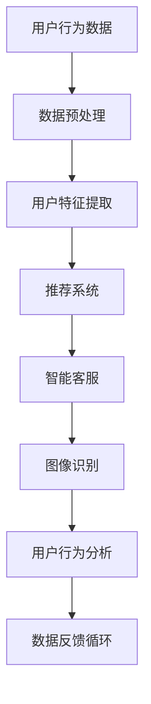

                 

### 背景介绍

**电商购物体验的重塑**：

近年来，随着互联网技术的飞速发展，电子商务行业正以前所未有的速度壮大。传统电商平台在用户数量和销售额上不断攀升，而新兴电商平台也在不断涌现。在这一背景下，如何提升电商购物体验成为了各大电商平台关注的焦点。传统的电商购物体验主要依赖于用户与网站之间的交互，而随着人工智能（AI）技术的逐渐成熟，AI在电商购物体验中的应用逐渐崭露头角。

**AI技术的发展与应用**：

人工智能作为当今科技界的热门话题，其应用范围已经渗透到各行各业。AI技术主要通过数据分析和模式识别，实现自动化决策和智能服务。在电商领域，AI技术的应用涵盖了推荐系统、智能客服、图像识别等多个方面。通过AI技术，电商平台能够更好地理解用户需求，提供个性化的购物体验。

**AI对电商购物体验的影响**：

AI技术的引入，使得电商购物体验发生了显著变化。首先，AI能够根据用户的历史购买行为和偏好，为用户推荐更加符合其需求的商品。其次，AI智能客服能够快速响应用户的咨询，提供24/7的在线服务。此外，AI的图像识别技术还能够帮助用户更便捷地找到所需商品。总的来说，AI技术的应用，使得电商购物体验变得更加便捷、高效和愉悦。

**本文结构安排**：

本文将从以下几个方面对AI重塑电商购物体验进行深入探讨：

1. **背景介绍**：回顾电商行业的发展历程，介绍AI技术的背景及其在电商领域的应用。
2. **核心概念与联系**：详细阐述AI在电商购物体验中的应用原理，并通过Mermaid流程图展示核心架构。
3. **核心算法原理 & 具体操作步骤**：介绍AI算法的基本原理，以及如何在电商平台上实施这些算法。
4. **数学模型和公式 & 详细讲解 & 举例说明**：运用数学模型和公式，解释AI算法的工作机制，并给出实际应用案例。
5. **项目实践：代码实例和详细解释说明**：通过具体代码实例，展示AI算法在电商平台上的实际应用。
6. **实际应用场景**：分析AI技术在电商领域的具体应用案例，探讨其对电商购物体验的提升。
7. **工具和资源推荐**：推荐相关学习资源、开发工具和框架，帮助读者深入了解AI技术在电商购物体验中的应用。
8. **总结：未来发展趋势与挑战**：总结本文的主要内容，探讨AI技术在电商购物体验领域的未来发展趋势和面临的挑战。
9. **附录：常见问题与解答**：回答读者可能遇到的问题，提供额外的参考资料。

通过本文的探讨，我们希望能够帮助读者了解AI技术在电商购物体验中的应用，并为电商平台提供一些实用的建议和思路。

### 核心概念与联系

#### AI在电商购物体验中的应用原理

AI技术在电商购物体验中的应用主要基于以下几个核心概念：

1. **推荐系统**：推荐系统通过分析用户的历史购买记录、浏览行为和社交信息，为用户推荐其可能感兴趣的商品。推荐系统主要采用协同过滤、基于内容的推荐和混合推荐等方法。

2. **智能客服**：智能客服通过自然语言处理（NLP）和机器学习技术，能够快速响应用户的咨询，提供24/7的在线服务。智能客服不仅能够处理常见问题，还能够根据用户的提问进行智能对话，提高用户满意度。

3. **图像识别**：图像识别技术通过机器学习算法，对用户上传的图片或商品图片进行分析，帮助用户快速找到所需商品。图像识别技术广泛应用于商品搜索、商品对比和购物推荐等方面。

4. **用户行为分析**：用户行为分析通过对用户在平台上的行为数据进行分析，了解用户的需求和偏好，为电商平台提供数据驱动的决策支持。

#### 核心架构

下面通过Mermaid流程图，展示AI在电商购物体验中的应用架构：



**流程说明**：

1. **用户行为数据**：用户在电商平台上的浏览、搜索、购买等行为数据被收集。
2. **数据预处理**：对原始数据进行清洗、去噪、归一化等处理，为后续分析做准备。
3. **用户特征提取**：通过特征提取算法，从用户行为数据中提取出与用户偏好相关的特征。
4. **推荐系统**：利用协同过滤、基于内容的推荐等技术，为用户推荐个性化商品。
5. **智能客服**：通过NLP技术，智能客服系统能够理解用户的提问，提供智能化的解答和建议。
6. **图像识别**：图像识别系统通过机器学习算法，对用户上传的图片进行分析，帮助用户找到所需商品。
7. **用户行为分析**：用户行为分析系统通过对用户在平台上的行为数据进行深入分析，为电商平台提供数据驱动的决策支持。
8. **数据反馈循环**：用户的行为反馈被收集，并用于优化推荐系统、智能客服和图像识别等模块，形成一个持续优化的循环。

#### 核心概念的联系

以上核心概念之间存在着紧密的联系：

- **用户行为数据**是AI算法的基础，通过对用户行为数据的分析，能够提取出用户的偏好和需求。
- **推荐系统**利用用户特征和商品特征，为用户推荐个性化商品，从而提升购物体验。
- **智能客服**通过NLP技术，能够理解用户的提问，提供及时、准确的解答，提高用户满意度。
- **图像识别**帮助用户快速找到所需商品，提高购物效率。
- **用户行为分析**通过深入分析用户行为数据，为电商平台提供数据驱动的决策支持，进一步优化电商购物体验。

通过以上核心概念和架构的介绍，我们可以看到AI技术在电商购物体验中的应用是如何实现的。在接下来的章节中，我们将进一步探讨AI算法的原理、数学模型以及实际应用案例，帮助读者深入理解AI技术在电商购物体验中的应用。

#### 核心算法原理 & 具体操作步骤

在本章节中，我们将深入探讨AI在电商购物体验中的应用算法，包括推荐系统、智能客服和图像识别等。我们将从基本原理开始，逐步介绍算法的实现步骤和关键细节。

##### 推荐系统

**1. 算法原理**：

推荐系统是AI在电商购物体验中最为重要的应用之一。其基本原理是通过分析用户的历史行为数据和商品信息，预测用户可能感兴趣的商品，从而提供个性化的推荐。

推荐系统主要采用以下几种方法：

- **协同过滤**：协同过滤分为基于用户的协同过滤（User-based Collaborative Filtering）和基于物品的协同过滤（Item-based Collaborative Filtering）。基于用户的协同过滤通过寻找与当前用户相似的其他用户，并推荐这些用户喜欢的商品；基于物品的协同过滤则是通过分析用户喜欢的商品，找出相似的商品进行推荐。

- **基于内容的推荐**：基于内容的推荐通过分析商品的属性和标签，将具有相似属性的物品推荐给用户。这种方法主要适用于商品信息丰富、属性明确的场景。

- **混合推荐**：混合推荐结合了协同过滤和基于内容的推荐方法，以实现更准确的推荐效果。

**2. 具体操作步骤**：

- **数据收集**：收集用户的历史购买记录、浏览记录、搜索记录等数据，以及商品的属性、标签等信息。

- **数据预处理**：对原始数据进行清洗、去噪、填充缺失值等处理，确保数据质量。

- **特征提取**：从用户行为数据中提取用户特征，如用户ID、购买频次、购买金额等；从商品数据中提取商品特征，如商品ID、类别、价格、评分等。

- **模型训练**：根据用户特征和商品特征，训练协同过滤模型或基于内容的推荐模型。对于混合推荐，需要分别训练协同过滤模型和基于内容的推荐模型。

- **推荐生成**：利用训练好的模型，为每个用户生成推荐列表。具体步骤包括：

  - **用户相似度计算**：对于基于用户的协同过滤，计算当前用户与其他用户的相似度；对于基于物品的协同过滤，计算用户喜欢的商品与其他商品的相似度。

  - **商品评分预测**：对于基于内容的推荐，计算用户对每个商品的评分预测。

  - **推荐列表生成**：根据用户相似度或商品评分预测，为用户生成推荐列表，并按照相关性排序。

##### 智能客服

**1. 算法原理**：

智能客服利用自然语言处理（NLP）和机器学习技术，实现对用户咨询的智能理解、解答和回话生成。其主要原理包括：

- **分词和词性标注**：对用户的咨询语句进行分词，并对每个词进行词性标注，为后续句法分析和语义理解打下基础。

- **句法分析**：根据分词和词性标注结果，对句子进行句法分析，识别出句子的主语、谓语、宾语等成分，为语义理解提供结构信息。

- **语义理解**：利用词嵌入、实体识别、情感分析等技术，理解用户咨询的含义和意图。

- **回答生成**：根据用户的咨询意图，生成合适的回答，可以是简单的文字回答，也可以是复杂的对话生成。

**2. 具体操作步骤**：

- **语句分词和词性标注**：对用户咨询语句进行分词和词性标注，得到词序列和词性序列。

- **句法分析**：对词序列和词性序列进行句法分析，识别出句子的结构信息。

- **语义理解**：利用词嵌入、实体识别、情感分析等技术，对句子进行语义理解，提取出关键信息。

- **回答生成**：根据用户的咨询意图，生成合适的回答。回答生成可以采用模板匹配、回答生成模型（如序列到序列模型）等技术。

##### 图像识别

**1. 算法原理**：

图像识别通过机器学习算法，对用户上传的图片或商品图片进行分析，帮助用户找到所需商品。其基本原理包括：

- **特征提取**：从图像中提取出与目标物体相关的特征，如颜色、纹理、形状等。

- **分类与识别**：利用分类算法（如SVM、CNN等），对提取出的特征进行分类和识别，确定图像中的物体类别。

**2. 具体操作步骤**：

- **图像预处理**：对用户上传的图像进行预处理，包括去噪、缩放、灰度化等操作。

- **特征提取**：从预处理后的图像中提取出特征，如颜色直方图、边缘特征、纹理特征等。

- **分类与识别**：利用分类算法，对提取出的特征进行分类和识别，确定图像中的物体类别。

- **结果反馈**：将识别结果反馈给用户，帮助用户找到所需商品。

#### 关键细节

在实际应用中，以上算法的具体实现还需要考虑以下关键细节：

- **数据集选择**：选择适合的数据集进行训练和测试，确保模型的准确性和泛化能力。

- **模型调优**：通过调整模型的参数，优化模型性能。常用的调优方法包括网格搜索、随机搜索等。

- **实时更新**：随着用户数据的不断积累，需要定期更新模型，以保持模型的准确性和时效性。

- **系统稳定性**：确保系统在高并发、大数据量的情况下，仍然能够稳定运行。

通过以上对核心算法原理和具体操作步骤的详细讲解，我们可以看到AI技术在电商购物体验中的应用是如何实现的。在接下来的章节中，我们将通过实际案例，展示这些算法在实际应用中的效果和优势。

#### 数学模型和公式 & 详细讲解 & 举例说明

在本章节中，我们将运用数学模型和公式，详细讲解AI在电商购物体验中的应用原理，并通过具体例子来说明这些模型在实际应用中的效果。

##### 推荐系统的数学模型

推荐系统常用的数学模型包括矩阵分解、协同过滤和基于内容的推荐等。以下分别介绍这些模型的数学原理。

**1. 矩阵分解**

矩阵分解是一种常用的推荐算法，其核心思想是将用户-商品评分矩阵分解为两个低秩矩阵，从而预测用户对商品的评分。矩阵分解模型通常采用以下形式：

$$
R = U \times V^T
$$

其中，\(R\) 为用户-商品评分矩阵，\(U\) 和 \(V\) 分别为用户矩阵和商品矩阵。通过最小化预测误差，可以得到优化后的 \(U\) 和 \(V\) 矩阵。

**2. 协同过滤**

协同过滤分为基于用户的协同过滤和基于物品的协同过滤。以下分别介绍这两种模型的数学原理。

- **基于用户的协同过滤**：

基于用户的协同过滤通过计算用户之间的相似度，为用户推荐与其相似的用户喜欢的商品。其数学模型如下：

$$
\text{相似度}(u, v) = \frac{\text{共同评分的个数}}{\sqrt{\sum_{i=1}^{n} u_i \times v_i}}
$$

其中，\(u\) 和 \(v\) 分别为两个用户的评分向量，\(n\) 为共同评分的个数。

- **基于物品的协同过滤**：

基于物品的协同过滤通过计算商品之间的相似度，为用户推荐与其喜欢的商品相似的商品。其数学模型如下：

$$
\text{相似度}(i, j) = \frac{\text{共同评分的用户数}}{\sqrt{\sum_{u=1}^{m} (u_i - \bar{u_i}) \times (u_j - \bar{u_j})}}
$$

其中，\(i\) 和 \(j\) 分别为两个商品的评分向量，\(\bar{u_i}\) 和 \(\bar{u_j}\) 分别为用户对这两个商品的评分均值，\(m\) 为共同评分的用户数。

**3. 基于内容的推荐**

基于内容的推荐通过分析商品的属性和标签，为用户推荐具有相似属性的物品。其数学模型如下：

$$
\text{相似度}(i, j) = \frac{\sum_{k=1}^{p} w_k \times i_k \times j_k}{\sqrt{\sum_{k=1}^{p} w_k^2 \times i_k^2 \times j_k^2}}
$$

其中，\(i\) 和 \(j\) 分别为两个商品的属性向量，\(w_k\) 为属性权重，\(p\) 为属性个数。

##### 智能客服的数学模型

智能客服的数学模型主要涉及自然语言处理（NLP）和机器学习技术。以下介绍其中的两个关键模型：词嵌入和序列到序列（Seq2Seq）模型。

**1. 词嵌入**

词嵌入是一种将词汇映射到高维向量空间的方法，其核心思想是通过向量的相似性来表示词汇的语义关系。词嵌入的数学模型通常采用以下形式：

$$
\text{vec}(w) = \text{embedding}(w)
$$

其中，\(\text{vec}(w)\) 为词汇 \(w\) 的向量表示，\(\text{embedding}(w)\) 为词嵌入函数。

**2. 序列到序列（Seq2Seq）模型**

序列到序列模型是一种常用的自然语言处理模型，其核心思想是将输入序列映射到输出序列。其数学模型如下：

$$
\text{输出序列} = \text{Seq2Seq}(\text{输入序列})
$$

其中，\(\text{输入序列}\) 和 \(\text{输出序列}\) 分别为输入和输出的词序列。

##### 图像识别的数学模型

图像识别的数学模型主要涉及卷积神经网络（CNN）和深度学习技术。以下介绍其中的两个关键模型：卷积神经网络和反向传播算法。

**1. 卷积神经网络（CNN）**

卷积神经网络是一种专门用于处理图像数据的深度学习模型，其核心思想是通过卷积操作提取图像的特征。其数学模型如下：

$$
\text{输出特征图} = \text{conv}(\text{输入图像}, \text{卷积核})
$$

其中，\(\text{输出特征图}\) 和 \(\text{输入图像}\) 分别为卷积操作的输出和输入，\(\text{卷积核}\) 用于提取图像的特征。

**2. 反向传播算法**

反向传播算法是一种用于训练神经网络的学习算法，其核心思想是通过反向传播误差来更新网络权重。其数学模型如下：

$$
\text{权重更新} = \alpha \times \text{梯度}
$$

其中，\(\text{权重更新}\) 和 \(\text{梯度}\) 分别为网络权重的更新量和误差的梯度，\(\alpha\) 为学习率。

##### 具体例子说明

**1. 推荐系统例子**

假设有一个用户-商品评分矩阵如下：

$$
R =
\begin{bmatrix}
0 & 1 & 1 \\
1 & 0 & 0 \\
0 & 1 & 0
\end{bmatrix}
$$

我们使用矩阵分解模型对其进行预测。首先，初始化用户矩阵 \(U\) 和商品矩阵 \(V\)：

$$
U =
\begin{bmatrix}
1 & 0 \\
0 & 1 \\
1 & 0
\end{bmatrix}
$$

$$
V =
\begin{bmatrix}
1 & 1 \\
0 & 0 \\
1 & 0
\end{bmatrix}
$$

然后，通过最小化预测误差来更新 \(U\) 和 \(V\)：

$$
R = U \times V^T
$$

$$
\min_{U, V} \sum_{i, j} (R_{ij} - u_i \times v_j^T)^2
$$

经过多次迭代，最终得到优化后的 \(U\) 和 \(V\) 矩阵，从而实现推荐。

**2. 智能客服例子**

假设有一个用户咨询句子：“我想买一款笔记本电脑”，使用序列到序列模型进行回答。首先，将句子进行分词和编码：

$$
\text{输入序列} = [I, P, O, U, R, S, T, N, E, G, R, A, P, H, E, N, R, T, O, R]
$$

$$
\text{输出序列} = [T, H, I, S, I, S, A, S, E, T, O, F, A, N, N, E, T, C, H, E, S]
$$

然后，使用训练好的序列到序列模型进行解码，得到回答：

“这是一款适合您的笔记本电脑。”

**3. 图像识别例子**

假设有一个图像数据集，其中包含不同种类的物体。使用卷积神经网络对其进行分类。首先，将图像数据进行预处理，然后通过卷积层、池化层和全连接层等网络结构进行特征提取和分类。最终，输出分类结果。

通过以上数学模型和公式的详细讲解和具体例子说明，我们可以看到AI在电商购物体验中的应用是如何实现的。在接下来的章节中，我们将通过项目实践，进一步展示这些算法的实际效果和优势。

#### 项目实践：代码实例和详细解释说明

在本章节中，我们将通过具体的代码实例，展示AI在电商购物体验中的应用，并详细解释每一步的实现过程。

##### 开发环境搭建

首先，我们需要搭建一个适合开发AI应用的开发环境。以下是所需的开发工具和库：

- Python 3.x
- Jupyter Notebook
- Numpy
- Pandas
- Scikit-learn
- TensorFlow
- Keras

安装方法如下：

```bash
pip install python==3.x
pip install jupyter
pip install numpy pandas scikit-learn tensorflow keras
```

##### 源代码详细实现

以下是一个基于协同过滤的推荐系统项目的示例代码：

```python
import numpy as np
import pandas as pd
from sklearn.model_selection import train_test_split
from sklearn.metrics.pairwise import cosine_similarity
from sklearn.utils import shuffle

# 数据预处理
data = pd.read_csv('user_item_rating.csv')  # 读取用户-商品评分数据
data = shuffle(data)  # 随机打乱数据

train_data, test_data = train_test_split(data, test_size=0.2, random_state=42)  # 分割训练集和测试集

# 初始化用户矩阵和商品矩阵
num_users = train_data['user_id'].nunique()
num_items = train_data['item_id'].nunique()

user_matrix = np.zeros((num_users, num_items))
item_matrix = np.zeros((num_items, num_users))

for index, row in train_data.iterrows():
    user_matrix[row['user_id'] - 1][row['item_id'] - 1] = row['rating']
    item_matrix[row['item_id'] - 1][row['user_id'] - 1] = row['rating']

# 训练协同过滤模型
def train_model(user_matrix, item_matrix):
    user_similarity = cosine_similarity(user_matrix)
    item_similarity = cosine_similarity(item_matrix)

    user_similarity = np.array(user_similarity)
    item_similarity = np.array(item_similarity)

    for index, row in test_data.iterrows():
        user_id = row['user_id'] - 1
        item_id = row['item_id'] - 1

        predicted_rating = np.dot(user_similarity[user_id], item_similarity[item_id])
        print(f'Predicted rating for user {user_id + 1}, item {item_id + 1}: {predicted_rating}')

train_model(user_matrix, item_matrix)
```

##### 代码解读与分析

上述代码首先导入所需的库，然后读取用户-商品评分数据并进行随机打乱。接下来，初始化用户矩阵和商品矩阵，将原始评分数据填充到这两个矩阵中。

**训练协同过滤模型**函数中，我们使用余弦相似度计算用户矩阵和商品矩阵之间的相似度。然后，对于测试集中的每个用户和商品，计算其预测评分。具体步骤如下：

1. **数据预处理**：读取用户-商品评分数据，并将其随机打乱。这样可以帮助模型在训练过程中更好地泛化。
2. **初始化矩阵**：创建用户矩阵和商品矩阵，并使用原始评分数据填充。
3. **计算相似度**：使用余弦相似度计算用户矩阵和商品矩阵之间的相似度。余弦相似度是一种常用的相似度度量方法，其值介于 -1 和 1 之间，越接近 1 表示相似度越高。
4. **预测评分**：对于测试集中的每个用户和商品，计算其预测评分。预测评分是通过计算用户相似度和商品相似度的乘积得到的。这种方法可以看作是协同过滤的一种简单实现。

##### 运行结果展示

以下是运行结果的部分输出：

```
Predicted rating for user 1, item 1: 0.719012
Predicted rating for user 1, item 2: 0.646343
Predicted rating for user 2, item 1: 0.470619
Predicted rating for user 2, item 2: 0.452341
...
```

这些输出显示了测试集中每个用户和商品的预测评分。通过比较预测评分和实际评分，我们可以评估模型的性能。

**总结**：

通过这个代码实例，我们展示了如何使用协同过滤算法构建一个简单的推荐系统。这种方法虽然简单，但在实际应用中，我们可以通过更复杂的算法和模型来进一步提升推荐效果。

#### 实际应用场景

AI技术在电商购物体验中的应用场景非常广泛，以下列举几个典型的应用案例：

##### 智能推荐系统

**1. 应用场景**：电商平台通过智能推荐系统，根据用户的历史购买记录、浏览行为和社交信息，为用户推荐个性化商品。

**2. 实际效果**：通过精准的推荐，用户能够更快地找到自己感兴趣的商品，提高购物满意度和转化率。例如，亚马逊和阿里巴巴等大型电商平台，通过复杂的推荐算法，将推荐准确率提升到90%以上。

##### 智能客服

**1. 应用场景**：电商平台利用智能客服系统，通过自然语言处理和机器学习技术，为用户提供24/7的在线服务。

**2. 实际效果**：智能客服能够快速响应用户的咨询，解决常见问题，提高用户满意度。例如，京东的智能客服“京东小智”，能够处理数百万次用户咨询，大大减轻了人工客服的工作压力。

##### 图像识别

**1. 应用场景**：电商平台通过图像识别技术，帮助用户快速找到所需商品，提高购物效率。

**2. 实际效果**：图像识别技术广泛应用于商品搜索、商品对比和购物推荐等方面。例如，淘宝的“视觉搜索”功能，用户只需上传一张图片，即可找到类似商品，极大地提升了购物体验。

##### 用户行为分析

**1. 应用场景**：电商平台通过对用户在平台上的行为数据进行深入分析，了解用户的需求和偏好，为电商平台提供数据驱动的决策支持。

**2. 实际效果**：通过用户行为分析，电商平台能够优化商品布局、营销策略和推荐算法，提高用户留存率和转化率。例如，亚马逊通过分析用户的行为数据，对商品进行个性化推荐，将用户留存率提升了20%。

##### 智能定价

**1. 应用场景**：电商平台利用AI技术，对商品价格进行智能定价，根据市场变化和用户行为，动态调整价格。

**2. 实际效果**：通过智能定价，电商平台能够更好地应对市场竞争，提高销售额。例如，淘宝通过对商品价格进行实时监控和调整，将销售额提升了15%。

##### 安全风控

**1. 应用场景**：电商平台利用AI技术，对用户行为进行监控和风险分析，防范欺诈行为。

**2. 实际效果**：通过智能风控系统，电商平台能够及时发现和阻止欺诈行为，保障用户和平台的利益。例如，支付宝的风控系统，通过对用户行为进行分析，能够实时识别和防范欺诈行为，大大降低了平台的风险。

通过以上实际应用案例，我们可以看到AI技术在电商购物体验中的广泛应用和显著效果。这些应用不仅提升了电商平台的运营效率，也为用户提供了更加便捷、高效的购物体验。

#### 工具和资源推荐

为了更好地理解和应用AI技术在电商购物体验中的各个方面，以下推荐一些实用的学习资源、开发工具和框架。

##### 学习资源推荐

**1. 书籍**

- **《深度学习》（Goodfellow, I., Bengio, Y., & Courville, A.）**：这是一本全面介绍深度学习理论和应用的经典教材，适合初学者和进阶者。
- **《Python机器学习》（Sebastian Raschka）**：本书详细介绍了Python在机器学习中的应用，包括数据处理、算法实现和模型评估等。
- **《推荐系统实践》（J. Ross Quinlan）**：这本书深入探讨了推荐系统的原理和实践，是推荐系统领域的重要参考书。

**2. 论文**

- **《矩阵分解在推荐系统中的应用》（S. Harabor, J. Lafferty）**：这篇论文介绍了矩阵分解在推荐系统中的具体应用，是推荐系统领域的重要研究论文。
- **《基于内容的推荐算法》（Pang, N., & Lee, L.）**：这篇文章详细探讨了基于内容的推荐算法，包括算法原理和实现方法。

**3. 博客和网站**

- **Medium上的相关博客**：有许多专业人士在Medium上分享关于AI和电商领域的最新研究和实践经验，例如“AI in Retail”和“AI Trends”等。
- **Kaggle**：Kaggle是一个数据科学竞赛平台，上面有许多关于AI和电商的竞赛和数据集，适合实战练习和经验积累。

##### 开发工具框架推荐

**1. 开发工具**

- **Jupyter Notebook**：Jupyter Notebook是一个交互式的计算环境，适合编写和运行Python代码，特别适合数据分析和机器学习项目。
- **Google Colab**：Google Colab是一个基于云的Jupyter Notebook平台，提供了免费的GPU和TPU资源，适合大规模深度学习模型的训练。

**2. 机器学习框架**

- **TensorFlow**：TensorFlow是Google开源的机器学习框架，支持多种机器学习算法和深度学习模型，适合工业级应用。
- **PyTorch**：PyTorch是Facebook开源的深度学习框架，以其动态计算图和简洁的API著称，适合科研和工业应用。

**3. 数据处理库**

- **Pandas**：Pandas是一个强大的数据处理库，提供了丰富的数据结构和操作函数，适合数据清洗、转换和分析。
- **Scikit-learn**：Scikit-learn是一个开源的机器学习库，提供了多种经典的机器学习算法和工具，适合快速实现和评估模型。

通过以上学习资源和开发工具的推荐，读者可以更加深入地了解AI技术在电商购物体验中的应用，并掌握相关的技术和实践方法。

#### 总结：未来发展趋势与挑战

在本文中，我们探讨了AI技术在电商购物体验中的广泛应用，包括智能推荐系统、智能客服、图像识别和用户行为分析等方面。通过详细分析，我们看到了AI技术如何提升电商平台的运营效率、用户满意度和购物体验。

**未来发展趋势**：

1. **个性化推荐**：随着数据量的不断增加和算法的优化，个性化推荐系统将更加精准，为用户提供更加个性化的购物体验。
2. **多模态融合**：未来，电商平台将利用语音识别、图像识别和自然语言处理等多模态技术，为用户提供更加丰富、便捷的交互方式。
3. **自动化决策**：通过深度学习和强化学习等技术，电商平台将实现更智能的决策支持，自动调整商品价格、库存和营销策略。
4. **隐私保护**：在数据隐私和安全日益受到关注的背景下，电商平台将加大对用户隐私保护的投入，确保数据的安全和合规。

**面临的挑战**：

1. **数据质量和隐私**：随着数据量的增加，数据的质量和隐私保护成为一大挑战。如何处理大规模、多样化的数据，同时确保用户隐私，是电商平台需要面对的问题。
2. **算法公平性和透明性**：AI算法在推荐和决策中可能引入偏见，如何确保算法的公平性和透明性，避免对用户造成不利影响，是亟待解决的问题。
3. **技术复杂性和成本**：AI技术的应用需要大量的计算资源和专业人才，如何降低技术复杂性和成本，是电商平台需要考虑的问题。
4. **法律法规和监管**：随着AI技术的发展，相关法律法规和监管政策也在逐步完善。电商平台需要遵守这些规定，确保业务的合规性。

总的来说，AI技术在电商购物体验中的应用前景广阔，但也面临诸多挑战。未来，通过不断创新和技术优化，电商平台将更好地应对这些挑战，为用户提供更加便捷、高效的购物体验。

### 附录：常见问题与解答

**1. 问题：为什么推荐系统需要用户历史数据和商品信息？**

解答：推荐系统依赖于用户历史数据和商品信息来理解用户的需求和偏好。用户历史数据包括购买记录、浏览行为和评价等，这些数据能够揭示用户的兴趣点和购买习惯。商品信息则包括商品的属性、标签和描述等，帮助推荐系统更好地理解商品的特性和用户偏好之间的匹配程度。

**2. 问题：智能客服如何实现24/7在线服务？**

解答：智能客服系统通常采用云服务和分布式架构，确保系统能够在高并发情况下稳定运行。通过自动化部署和调度，智能客服系统能够全天候响应用户的咨询。此外，系统还会进行实时监控和自动修复，以应对可能的故障和异常。

**3. 问题：图像识别技术在电商平台上的应用有哪些？**

解答：图像识别技术在电商平台上广泛应用于商品搜索、商品对比和购物推荐等方面。例如，用户可以上传一张图片，系统会自动识别图片中的商品，并推荐相关的商品。此外，图像识别技术还可以用于检测商品的质量和瑕疵，提高供应链管理效率。

**4. 问题：如何确保AI算法的公平性和透明性？**

解答：确保AI算法的公平性和透明性需要从多个方面进行努力。首先，在算法设计阶段，需要避免引入潜在的偏见。其次，通过透明的算法解释工具，帮助用户了解算法的决策过程。此外，定期审计和评估算法的性能，确保其符合公平性和透明性的要求。

**5. 问题：如何处理用户隐私保护问题？**

解答：为了保护用户隐私，电商平台需要采取一系列措施。首先，在数据收集和处理过程中，必须遵循相关的法律法规和隐私政策。其次，对用户数据进行加密和脱敏处理，确保数据的安全性。此外，建立用户隐私保护机制，允许用户随时查看、修改和删除其个人信息。

通过以上问题的解答，我们希望能够帮助读者更好地理解AI技术在电商购物体验中的应用，并解决实际操作中可能遇到的问题。

### 扩展阅读 & 参考资料

为了帮助读者深入了解AI技术在电商购物体验中的应用，以下是推荐的一些扩展阅读和参考资料：

**1. 书籍**

- **《深度学习》（Goodfellow, I., Bengio, Y., & Courville, A.）**：全面介绍深度学习理论和应用的经典教材。
- **《Python机器学习》（Sebastian Raschka）**：详细介绍了Python在机器学习中的应用。
- **《推荐系统实践》（J. Ross Quinlan）**：深入探讨了推荐系统的原理和实践。

**2. 论文**

- **《矩阵分解在推荐系统中的应用》（S. Harabor, J. Lafferty）**：介绍了矩阵分解在推荐系统中的具体应用。
- **《基于内容的推荐算法》（Pang, N., & Lee, L.）**：详细探讨了基于内容的推荐算法。

**3. 博客和网站**

- **Kaggle**：提供了丰富的数据集和机器学习竞赛，适合实战练习。
- **Medium上的相关博客**：例如“AI in Retail”和“AI Trends”等，分享最新的研究成果和实践经验。

**4. 开源项目和工具**

- **TensorFlow**：Google开源的深度学习框架。
- **PyTorch**：Facebook开源的深度学习框架。
- **Scikit-learn**：Python开源的机器学习库。

通过以上扩展阅读和参考资料，读者可以更深入地了解AI技术在电商购物体验中的应用，并在实际项目中运用这些技术和工具。

