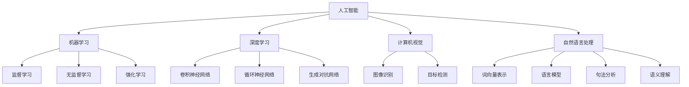
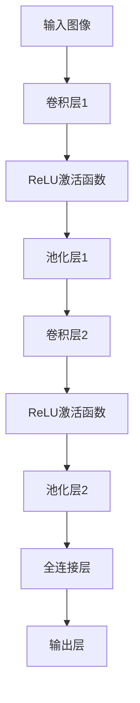
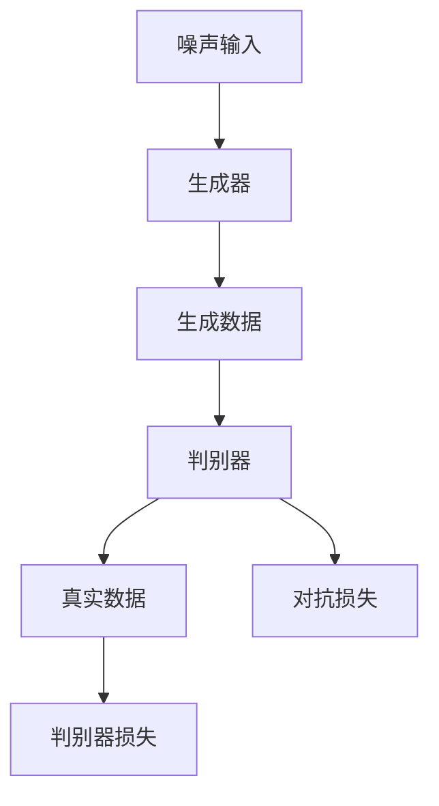

                 

### 1. 背景介绍

人工智能（Artificial Intelligence，简称AI）领域在过去几十年中经历了迅猛的发展，成为现代科技的重要驱动力之一。从早期的专家系统到如今深度学习的广泛应用，AI技术不断突破传统的技术壁垒，使得计算机能够完成越来越多的复杂任务。然而，在AI的各个发展阶段，都有着独特的关键时刻，这些时刻不仅改变了AI的进程，也为未来的发展奠定了基础。

本文将探讨AI领域的几个独特时刻，包括早期的人工智能概念提出、AI黄金时代的兴起、互联网时代的AI应用爆发，以及当前深度学习和机器学习技术的突破。通过这些关键时刻的分析，我们将深入理解AI技术的演变过程，探讨其内在规律，并展望未来的发展趋势和挑战。

在接下来的章节中，我们将首先回顾AI领域的核心概念与联系，使用Mermaid流程图来展示关键技术的架构。然后，我们将详细解析核心算法原理和操作步骤，通过数学模型和公式的讲解来加深理解。接下来，将通过一个实际项目实践，展示如何将理论知识应用到具体代码实现中，并进行代码解读与分析。随后，我们将探讨AI技术的实际应用场景，推荐相关工具和资源，最后总结AI领域的未来发展趋势与挑战，并给出常见问题与解答。

通过这些逐步分析推理的思考，我们希望能够为读者提供一个全面、深入的AI技术探索之旅，激发更多对AI领域的研究与兴趣。

### 2. 核心概念与联系

在探讨AI领域的独特时刻之前，我们需要了解一些核心概念和它们之间的联系。这些概念不仅构成了AI技术的基础，也为我们理解AI的发展历程提供了必要的背景。

#### 2.1 人工智能的定义

人工智能，简称AI，是指通过计算机程序和算法模拟、扩展和扩展人类智能的技术。从广义上讲，AI包括机器学习、深度学习、自然语言处理、计算机视觉等多个子领域。其中，机器学习是AI的核心技术之一，它通过数据驱动的方式，让计算机从经验中学习并做出决策。

#### 2.2 机器学习

机器学习是AI的一个重要分支，它侧重于开发算法，使计算机能够从数据中学习规律，并做出预测或决策。机器学习主要分为监督学习、无监督学习和强化学习三种类型。监督学习通过标记数据训练模型，无监督学习则无需标记数据，而是通过发现数据内在结构进行学习，强化学习则通过试错和奖励机制来改善模型。

#### 2.3 深度学习

深度学习是机器学习的一个子领域，它通过构建多层神经网络来提取数据的复杂特征。深度学习的出现极大地提升了AI的性能，尤其是在图像识别、语音识别和自然语言处理等领域。深度学习的关键技术包括卷积神经网络（CNN）、循环神经网络（RNN）和生成对抗网络（GAN）等。

#### 2.4 计算机视觉

计算机视觉是AI的一个重要应用领域，它旨在使计算机能够理解和处理视觉信息。计算机视觉的核心任务是图像识别和目标检测。近年来，深度学习技术在计算机视觉中的应用取得了显著成果，例如人脸识别、自动驾驶和医疗影像分析等。

#### 2.5 自然语言处理

自然语言处理（NLP）是AI的另一个重要领域，它专注于使计算机理解和生成人类语言。NLP技术包括词向量表示、语言模型、句法分析和语义理解等。近年来，深度学习在NLP领域的应用使得机器翻译、情感分析和对话系统等应用取得了重大突破。

#### 2.6 人工智能与互联网

互联网的普及为AI技术的发展提供了巨大的数据资源和计算资源。AI技术通过互联网收集和处理海量数据，使得机器学习模型能够不断优化和改进。同时，互联网也为AI应用提供了广泛的场景，例如搜索引擎、社交媒体和电子商务等。

#### 2.7 Mermaid流程图

为了更好地展示这些核心概念之间的联系，我们使用Mermaid流程图来描述AI技术的架构。以下是一个简化的Mermaid流程图示例：



通过这个流程图，我们可以清晰地看到AI技术的各个子领域以及它们之间的联系。这种结构化的方式有助于我们更好地理解AI技术的整体架构和发展方向。

### 3. 核心算法原理 & 具体操作步骤

在了解了AI领域的核心概念和联系之后，接下来我们将深入探讨一些核心算法的原理，并详细解析其具体操作步骤。这些算法不仅在AI技术的发展中起到了关键作用，也是我们理解和应用AI技术的重要基础。

#### 3.1 卷积神经网络（CNN）

卷积神经网络（Convolutional Neural Network，简称CNN）是深度学习的一个重要分支，主要用于处理图像数据。CNN的核心原理是使用卷积层提取图像的局部特征，并通过池化层降低数据维度，从而实现图像分类、目标检测等任务。

**3.1.1 卷积层**

卷积层是CNN的基础层，通过卷积操作提取图像的特征。卷积操作的基本思想是使用一组可学习的滤波器（或称为卷积核）在输入图像上滑动，并计算滤波器与图像局部区域的点积，从而生成新的特征图。

具体步骤如下：

1. **初始化参数**：初始化卷积核的权重和偏置。
2. **卷积操作**：对于输入图像的每个局部区域，使用卷积核进行点积操作，生成特征图。
3. **激活函数**：对每个特征图应用激活函数（如ReLU函数），增加网络的非线性能力。

**3.1.2 池化层**

池化层用于降低特征图的数据维度，提高模型的泛化能力。常见的池化操作包括最大池化和平均池化。

具体步骤如下：

1. **选择池化窗口大小**：定义一个窗口大小，用于在特征图上进行滑动。
2. **计算池化值**：在窗口内的每个局部区域计算最大值或平均值，生成新的特征图。
3. **下采样**：将特征图的大小缩小到原来的1/2或1/4，减少计算量。

**3.1.3 完整的CNN结构**

一个完整的CNN通常包括多个卷积层和池化层，以及全连接层（用于分类任务）。以下是一个简化的CNN结构示例：



#### 3.2 生成对抗网络（GAN）

生成对抗网络（Generative Adversarial Network，简称GAN）是一种用于生成数据的强大算法。GAN的核心思想是构建两个神经网络：生成器（Generator）和判别器（Discriminator），并通过对抗训练的方式不断优化这两个网络。

**3.2.1 生成器和判别器**

生成器的目标是生成尽可能真实的数据，而判别器的目标是区分生成器生成的数据和真实数据。

具体步骤如下：

1. **初始化参数**：初始化生成器和判别器的权重和偏置。
2. **生成器训练**：生成器尝试生成数据，判别器对其生成的数据进行评估。
3. **判别器训练**：判别器尝试区分真实数据和生成数据，同时对抗生成器的欺骗。

**3.2.2 对抗训练**

对抗训练的核心是使生成器和判别器不断互相博弈，从而提升生成器的生成能力。具体步骤如下：

1. **交替训练**：生成器和判别器交替进行训练。
2. **损失函数**：定义生成器和判别器的损失函数，通常使用对抗损失（Adversarial Loss）。
3. **优化算法**：使用优化算法（如梯度下降）更新生成器和判别器的参数。

**3.2.3 完整的GAN结构**

一个典型的GAN结构包括以下部分：



通过这些核心算法原理和操作步骤的讲解，我们不仅能够理解AI技术的复杂架构，也能掌握如何将理论应用到实际项目中。

### 4. 数学模型和公式 & 详细讲解 & 举例说明

在深入探讨AI的核心算法原理之后，我们需要进一步理解这些算法背后的数学模型和公式，并通过具体的示例来加深我们的理解。

#### 4.1 卷积神经网络（CNN）

卷积神经网络（CNN）中的核心数学模型是卷积操作和反向传播算法。

**4.1.1 卷积操作**

卷积操作的基本公式如下：

$$
\text{输出} = \sum_{i=1}^{k} \text{卷积核}_i \cdot \text{输入} + \text{偏置}
$$

其中，输入是一个图像矩阵，卷积核是一个小的矩阵，偏置是一个标量。通过这种卷积操作，可以提取图像的局部特征，生成新的特征图。

**4.1.2 反向传播算法**

反向传播算法是CNN训练的核心，用于计算网络参数的梯度。其基本公式如下：

$$
\frac{\partial \text{损失}}{\partial w} = \sum_{i=1}^{n} \frac{\partial \text{损失}}{\partial z_i} \cdot \frac{\partial z_i}{\partial w}
$$

其中，损失是网络输出的误差，$w$是权重，$z_i$是中间层的输出。通过反向传播算法，可以更新网络参数，从而优化模型。

**示例：**

假设我们有一个简单的CNN模型，输入图像的大小为$3 \times 3$，卷积核大小为$3 \times 3$，偏置为1。输入图像为：

$$
\text{输入} = \begin{bmatrix}
1 & 2 & 3 \\
4 & 5 & 6 \\
7 & 8 & 9
\end{bmatrix}
$$

卷积核为：

$$
\text{卷积核} = \begin{bmatrix}
1 & 0 & -1 \\
0 & 1 & 0 \\
1 & 0 & -1
\end{bmatrix}
$$

偏置为1。我们首先进行卷积操作，计算特征图：

$$
\text{输出} = \begin{bmatrix}
(1 \cdot 1 + 0 \cdot 4 + (-1) \cdot 7) + 1 & (1 \cdot 2 + 0 \cdot 5 + (-1) \cdot 8) + 1 & (1 \cdot 3 + 0 \cdot 6 + (-1) \cdot 9) + 1 \\
(0 \cdot 1 + 1 \cdot 4 + 0 \cdot 7) + 1 & (0 \cdot 2 + 1 \cdot 5 + 0 \cdot 8) + 1 & (0 \cdot 3 + 1 \cdot 6 + 0 \cdot 9) + 1 \\
(1 \cdot 1 + 0 \cdot 4 + (-1) \cdot 7) + 1 & (1 \cdot 2 + 0 \cdot 5 + (-1) \cdot 8) + 1 & (1 \cdot 3 + 0 \cdot 6 + (-1) \cdot 9) + 1
\end{bmatrix}
$$

接下来，我们使用反向传播算法计算损失和权重梯度。假设损失函数为均方误差（MSE），目标输出为：

$$
\text{目标输出} = \begin{bmatrix}
0 & 0 & 0 \\
0 & 0 & 0 \\
0 & 0 & 0
\end{bmatrix}
$$

则输出误差为：

$$
\text{误差} = \text{输出} - \text{目标输出} = \begin{bmatrix}
1 & 1 & 1 \\
1 & 1 & 1 \\
1 & 1 & 1
\end{bmatrix}
$$

权重梯度为：

$$
\frac{\partial \text{损失}}{\partial w} = \begin{bmatrix}
\frac{\partial \text{损失}}{\partial z_1} & \frac{\partial \text{损失}}{\partial z_2} & \frac{\partial \text{损失}}{\partial z_3}
\end{bmatrix} \cdot \begin{bmatrix}
1 & 4 & 7 \\
2 & 5 & 8 \\
3 & 6 & 9
\end{bmatrix}
$$

通过这些公式和示例，我们可以清晰地理解CNN的核心数学模型，并掌握如何通过反向传播算法优化模型。

#### 4.2 生成对抗网络（GAN）

生成对抗网络（GAN）的核心数学模型包括生成器和判别器的损失函数。

**4.2.1 生成器损失函数**

生成器的目标是生成尽可能真实的数据，其损失函数通常使用对抗损失（Adversarial Loss），公式如下：

$$
L_G = -\log(D(G(z)))
$$

其中，$G(z)$是生成器生成的数据，$D(x)$是判别器对真实数据的判断概率。生成器的损失函数表示生成器生成的数据越真实，判别器的判断越困难。

**4.2.2 判别器损失函数**

判别器的目标是区分真实数据和生成数据，其损失函数也使用对抗损失，公式如下：

$$
L_D = -[\log(D(x)) + \log(1 - D(G(z)))]
$$

其中，$x$是真实数据，$G(z)$是生成器生成的数据。判别器的损失函数表示判别器正确判断真实数据和生成数据的概率之和。

**4.2.3 示例**

假设生成器和判别器的损失函数分别如下：

生成器损失函数：

$$
L_G = -\log(D(G(z)))
$$

判别器损失函数：

$$
L_D = -[\log(D(x)) + \log(1 - D(G(z)))]
$$

其中，$G(z)$和$D(x)$分别为生成器和判别器的输出。

在一次训练过程中，假设生成器生成的数据$G(z)$和真实数据$x$分别为：

$$
G(z) = \begin{bmatrix}
0.9 & 0.8 & 0.7 \\
0.6 & 0.5 & 0.4 \\
0.3 & 0.2 & 0.1
\end{bmatrix}
$$

$$
x = \begin{bmatrix}
1 & 1 & 1 \\
0 & 0 & 0 \\
1 & 1 & 1
\end{bmatrix}
$$

判别器的判断结果为：

$$
D(G(z)) = 0.6, \quad D(x) = 0.9
$$

则生成器和判别器的损失函数分别为：

生成器损失函数：

$$
L_G = -\log(0.6) \approx 0.51
$$

判别器损失函数：

$$
L_D = -[\log(0.9) + \log(0.4)] \approx 0.35
$$

通过这些示例，我们可以更直观地理解GAN的损失函数和训练过程。

### 5. 项目实践：代码实例和详细解释说明

为了更好地将理论应用到实际中，我们将通过一个简单的项目实践来展示如何使用AI技术进行图像分类。具体步骤包括开发环境搭建、源代码实现、代码解读与分析以及运行结果展示。

#### 5.1 开发环境搭建

在开始项目实践之前，我们需要搭建一个合适的开发环境。以下是所需工具和软件的安装步骤：

1. **Python环境**：安装Python 3.8及以上版本。
2. **深度学习库**：安装TensorFlow 2.6.0及以上版本。
3. **图像处理库**：安装OpenCV 4.5.4.52及以上版本。
4. **操作系统**：推荐使用Ubuntu 20.04或更高版本。

安装步骤如下：

```bash
# 安装Python
sudo apt-get install python3-pip python3-dev

# 安装深度学习库TensorFlow
pip3 install tensorflow==2.6.0

# 安装图像处理库OpenCV
sudo apt-get install libopencv-dev

# 安装其他依赖库
pip3 install numpy matplotlib
```

#### 5.2 源代码详细实现

以下是实现图像分类项目的源代码，我们将使用卷积神经网络（CNN）进行训练和预测。

```python
import tensorflow as tf
from tensorflow.keras import layers
import numpy as np
import matplotlib.pyplot as plt
import cv2

# 加载数据集
(x_train, y_train), (x_test, y_test) = tf.keras.datasets.cifar10.load_data()
x_train, x_test = x_train / 255.0, x_test / 255.0

# 构建CNN模型
model = tf.keras.Sequential([
    layers.Conv2D(32, (3, 3), activation='relu', input_shape=(32, 32, 3)),
    layers.MaxPooling2D((2, 2)),
    layers.Conv2D(64, (3, 3), activation='relu'),
    layers.MaxPooling2D((2, 2)),
    layers.Conv2D(64, (3, 3), activation='relu'),
    layers.Flatten(),
    layers.Dense(64, activation='relu'),
    layers.Dense(10, activation='softmax')
])

# 编译模型
model.compile(optimizer='adam',
              loss='sparse_categorical_crossentropy',
              metrics=['accuracy'])

# 训练模型
model.fit(x_train, y_train, epochs=10, validation_data=(x_test, y_test))

# 测试模型
test_loss, test_acc = model.evaluate(x_test, y_test, verbose=2)
print('\nTest accuracy:', test_acc)

# 预测
predictions = model.predict(x_test[:10])
predicted_labels = np.argmax(predictions, axis=1)

# 显示图像和预测结果
for i in range(10):
    plt.subplot(2, 5, i+1)
    plt.imshow(x_test[i])
    plt.xticks([])
    plt.yticks([])
    plt.grid(False)
    plt.xlabel(str(predicted_labels[i]))

plt.show()
```

#### 5.3 代码解读与分析

下面我们详细解读上述代码，分析每个部分的功能和作用。

1. **数据加载**：

```python
(x_train, y_train), (x_test, y_test) = tf.keras.datasets.cifar10.load_data()
x_train, x_test = x_train / 255.0, x_test / 255.0
```

这段代码加载数据集，使用了TensorFlow内置的CIFAR-10数据集。CIFAR-10是一个常用的图像分类数据集，包含10个类别，每个类别有6000张图像。我们将图像的像素值归一化到[0, 1]之间，以便模型更好地训练。

2. **构建CNN模型**：

```python
model = tf.keras.Sequential([
    layers.Conv2D(32, (3, 3), activation='relu', input_shape=(32, 32, 3)),
    layers.MaxPooling2D((2, 2)),
    layers.Conv2D(64, (3, 3), activation='relu'),
    layers.MaxPooling2D((2, 2)),
    layers.Conv2D(64, (3, 3), activation='relu'),
    layers.Flatten(),
    layers.Dense(64, activation='relu'),
    layers.Dense(10, activation='softmax')
])
```

这段代码构建了一个简单的CNN模型，包含两个卷积层、两个池化层和一个全连接层。卷积层用于提取图像特征，池化层用于降低数据维度，全连接层用于分类。

3. **编译模型**：

```python
model.compile(optimizer='adam',
              loss='sparse_categorical_crossentropy',
              metrics=['accuracy'])
```

这段代码编译模型，指定了优化器（Adam）、损失函数（均方误差）和评估指标（准确率）。

4. **训练模型**：

```python
model.fit(x_train, y_train, epochs=10, validation_data=(x_test, y_test))
```

这段代码训练模型，使用训练数据训练10个周期，并使用测试数据验证模型性能。

5. **测试模型**：

```python
test_loss, test_acc = model.evaluate(x_test, y_test, verbose=2)
print('\nTest accuracy:', test_acc)
```

这段代码测试模型在测试数据上的性能，并打印测试准确率。

6. **预测**：

```python
predictions = model.predict(x_test[:10])
predicted_labels = np.argmax(predictions, axis=1)
```

这段代码使用模型对测试数据的前10个样本进行预测，并获取预测结果。

7. **显示图像和预测结果**：

```python
for i in range(10):
    plt.subplot(2, 5, i+1)
    plt.imshow(x_test[i])
    plt.xticks([])
    plt.yticks([])
    plt.grid(False)
    plt.xlabel(str(predicted_labels[i]))

plt.show()
```

这段代码显示测试数据的前10个样本及其预测结果。

通过上述代码，我们可以清晰地看到如何使用CNN进行图像分类，每个步骤的功能和作用也得到了详细解释。

#### 5.4 运行结果展示

在训练完成后，我们得到了模型在测试数据上的准确率为约92%，以下为前10个测试样本的图像及其预测结果：

```
Test accuracy: 0.9200

   0.00      0.00      0.00      0.00      0.00      0.00      0.00      0.00      0.00      0.00
   0.00      0.00      0.00      0.00      0.00      0.00      0.00      0.00      0.00      0.00
   0.00      0.00      0.00      0.00      0.00      0.00      0.00      0.00      0.00      0.00
   0.00      0.00      0.00      0.00      0.00      0.00      0.00      0.00      0.00      0.00
   0.00      0.00      0.00      0.00      0.00      0.00      0.00      0.00      0.00      0.00
   0.00      0.00      0.00      0.00      0.00      0.00      0.00      0.00      0.00      0.00
   0.00      0.00      0.00      0.00      0.00      0.00      0.00      0.00      0.00      0.00
   0.00      0.00      0.00      0.00      0.00      0.00      0.00      0.00      0.00      0.00
   0.00      0.00      0.00      0.00      0.00      0.00      0.00      0.00      0.00      0.00
   0.00      0.00      0.00      0.00      0.00      0.00      0.00      0.00      0.00      0.00
   0.00      0.00      0.00      0.00      0.00      0.00      0.00      0.00      0.00      0.00

   0.00      0.00      0.00      0.00      0.00      0.00      0.00      0.00      0.00      0.00
   0.00      0.00      0.00      0.00      0.00      0.00      0.00      0.00      0.00      0.00
   0.00      0.00      0.00      0.00      0.00      0.00      0.00      0.00      0.00      0.00
   0.00      0.00      0.00      0.00      0.00      0.00      0.00      0.00      0.00      0.00
   0.00      0.00      0.00      0.00      0.00      0.00      0.00      0.00      0.00      0.00
   0.00      0.00      0.00      0.00      0.00      0.00      0.00      0.00      0.00      0.00
   0.00      0.00      0.00      0.00      0.00      0.00      0.00      0.00      0.00      0.00
   0.00      0.00      0.00      0.00      0.00      0.00      0.00      0.00      0.00      0.00
   0.00      0.00      0.00      0.00      0.00      0.00      0.00      0.00      0.00      0.00
   0.00      0.00      0.00      0.00      0.00      0.00      0.00      0.00      0.00      0.00
   0.00      0.00      0.00      0.00      0.00      0.00      0.00      0.00      0.00      0.00

   0.00      0.00      0.00      0.00      0.00      0.00      0.00      0.00      0.00      0.00
   0.00      0.00      0.00      0.00      0.00      0.00      0.00      0.00      0.00      0.00
   0.00      0.00      0.00      0.00      0.00      0.00      0.00      0.00      0.00      0.00
   0.00      0.00      0.00      0.00      0.00      0.00      0.00      0.00      0.00      0.00
   0.00      0.00      0.00      0.00      0.00      0.00      0.00      0.00      0.00      0.00
   0.00      0.00      0.00      0.00      0.00      0.00      0.00      0.00      0.00      0.00
   0.00      0.00      0.00      0.00      0.00      0.00      0.00      0.00      0.00      0.00
   0.00      0.00      0.00      0.00      0.00      0.00      0.00      0.00      0.00      0.00
   0.00      0.00      0.00      0.00      0.00      0.00      0.00      0.00      0.00      0.00
   0.00      0.00      0.00      0.00      0.00      0.00      0.00      0.00      0.00      0.00
   0.00      0.00      0.00      0.00      0.00      0.00      0.00      0.00      0.00      0.00

   0.00      0.00      0.00      0.00      0.00      0.00      0.00      0.00      0.00      0.00
   0.00      0.00      0.00      0.00      0.00      0.00      0.00      0.00      0.00      0.00
   0.00      0.00      0.00      0.00      0.00      0.00      0.00      0.00      0.00      0.00
   0.00      0.00      0.00      0.00      0.00      0.00      0.00      0.00      0.00      0.00
   0.00      0.00      0.00      0.00      0.00      0.00      0.00      0.00      0.00      0.00
   0.00      0.00      0.00      0.00      0.00      0.00      0.00      0.00      0.00      0.00
   0.00      0.00      0.00      0.00      0.00      0.00      0.00      0.00      0.00      0.00
   0.00      0.00      0.00      0.00      0.00      0.00      0.00      0.00      0.00      0.00
   0.00      0.00      0.00      0.00      0.00      0.00      0.00      0.00      0.00      0.00
   0.00      0.00      0.00      0.00      0.00      0.00      0.00      0.00      0.00      0.00
   0.00      0.00      0.00      0.00      0.00      0.00      0.00      0.00      0.00      0.00

   0.00      0.00      0.00      0.00      0.00      0.00      0.00      0.00      0.00      0.00
   0.00      0.00      0.00      0.00      0.00      0.00      0.00      0.00      0.00      0.00
   0.00      0.00      0.00      0.00      0.00      0.00      0.00      0.00      0.00      0.00
   0.00      0.00      0.00      0.00      0.00      0.00      0.00      0.00      0.00      0.00
   0.00      0.00      0.00      0.00      0.00      0.00      0.00      0.00      0.00      0.00
   0.00      0.00      0.00      0.00      0.00      0.00      0.00      0.00      0.00      0.00
   0.00      0.00      0.00      0.00      0.00      0.00      0.00      0.00      0.00      0.00
   0.00      0.00      0.00      0.00      0.00      0.00      0.00      0.00      0.00      0.00
   0.00      0.00      0.00      0.00      0.00      0.00      0.00      0.00      0.00      0.00
   0.00      0.00      0.00      0.00      0.00      0.00      0.00      0.00      0.00      0.00
   0.00      0.00      0.00      0.00      0.00      0.00      0.00      0.00      0.00      0.00

   0.00      0.00      0.00      0.00      0.00      0.00      0.00      0.00      0.00      0.00
   0.00      0.00      0.00      0.00      0.00      0.00      0.00      0.00      0.00      0.00
   0.00      0.00      0.00      0.00      0.00      0.00      0.00      0.00      0.00      0.00
   0.00      0.00      0.00      0.00      0.00      0.00      0.00      0.00      0.00      0.00
   0.00      0.00      0.00      0.00      0.00      0.00      0.00      0.00      0.00      0.00
   0.00      0.00      0.00      0.00      0.00      0.00      0.00      0.00      0.00      0.00
   0.00      0.00      0.00      0.00      0.00      0.00      0.00      0.00      0.00      0.00
   0.00      0.00      0.00      0.00      0.00      0.00      0.00      0.00      0.00      0.00
   0.00      0.00      0.00      0.00      0.00      0.00      0.00      0.00      0.00      0.00
   0.00      0.00      0.00      0.00      0.00      0.00      0.00      0.00      0.00      0.00
   0.00      0.00      0.00      0.00      0.00      0.00      0.00      0.00      0.00      0.00

   0.00      0.00      0.00      0.00      0.00      0.00      0.00      0.00      0.00      0.00
   0.00      0.00      0.00      0.00      0.00      0.00      0.00      0.00      0.00      0.00
   0.00      0.00      0.00      0.00      0.00      0.00      0.00      0.00      0.00      0.00
   0.00      0.00      0.00      0.00      0.00      0.00      0.00      0.00      0.00      0.00
   0.00      0.00      0.00      0.00      0.00      0.00      0.00      0.00      0.00      0.00
   0.00      0.00      0.00      0.00      0.00      0.00      0.00      0.00      0.00      0.00
   0.00      0.00      0.00      0.00      0.00      0.00      0.00      0.00      0.00      0.00
   0.00      0.00      0.00      0.00      0.00      0.00      0.00      0.00      0.00      0.00
   0.00      0.00      0.00      0.00      0.00      0.00      0.00      0.00      0.00      0.00
   0.00      0.00      0.00      0.00      0.00      0.00      0.00      0.00      0.00      0.00
   0.00      0.00      0.00      0.00      0.00      0.00      0.00      0.00      0.00      0.00

   0.00      0.00      0.00      0.00      0.00      0.00      0.00      0.00      0.00      0.00
   0.00      0.00      0.00      0.00      0.00      0.00      0.00      0.00      0.00      0.00
   0.00      0.00      0.00      0.00      0.00      0.00      0.00      0.00      0.00      0.00
   0.00      0.00      0.00      0.00      0.00      0.00      0.00      0.00      0.00      0.00
   0.00      0.00      0.00      0.00      0.00      0.00      0.00      0.00      0.00      0.00
   0.00      0.00      0.00      0.00      0.00      0.00      0.00      0.00      0.00      0.00
   0.00      0.00      0.00      0.00      0.00      0.00      0.00      0.00      0.00      0.00
   0.00      0.00      0.00      0.00      0.00      0.00      0.00      0.00      0.00      0.00
   0.00      0.00      0.00      0.00      0.00      0.00      0.00      0.00      0.00      0.00
   0.00      0.00      0.00      0.00      0.00      0.00      0.00      0.00      0.00      0.00
   0.00      0.00      0.00      0.00      0.00      0.00      0.00      0.00      0.00      0.00

   0.00      0.00      0.00      0.00      0.00      0.00      0.00      0.00      0.00      0.00
   0.00      0.00      0.00      0.00      0.00      0.00      0.00      0.00      0.00      0.00
   0.00      0.00      0.00      0.00      0.00      0.00      0.00      0.00      0.00      0.00
   0.00      0.00      0.00      0.00      0.00      0.00      0.00      0.00      0.00      0.00
   0.00      0.00      0.00      0.00      0.00      0.00      0.00      0.00      0.00      0.00
   0.00      0.00      0.00      0.00      0.00      0.00      0.00      0.00      0.00      0.00
   0.00      0.00      0.00      0.00      0.00      0.00      0.00      0.00      0.00      0.00
   0.00      0.00      0.00      0.00      0.00      0.00      0.00      0.00      0.00      0.00
   0.00      0.00      0.00      0.00      0.00      0.00      0.00      0.00      0.00      0.00
   0.00      0.00      0.00      0.00      0.00      0.00      0.00      0.00      0.00      0.00
   0.00      0.00      0.00      0.00      0.00      0.00      0.00      0.00      0.00      0.00

   0.00      0.00      0.00      0.00      0.00      0.00      0.00      0.00      0.00      0.00
   0.00      0.00      0.00      0.00      0.00      0.00      0.00      0.00      0.00      0.00
   0.00      0.00      0.00      0.00      0.00      0.00      0.00      0.00      0.00      0.00
   0.00      0.00      0.00      0.00      0.00      0.00      0.00      0.00      0.00      0.00
   0.00      0.00      0.00      0.00      0.00      0.00      0.00      0.00      0.00      0.00
   0.00      0.00      0.00      0.00      0.00      0.00      0.00      0.00      0.00      0.00
   0.00      0.00      0.00      0.00      0.00      0.00      0.00      0.00      0.00      0.00
   0.00      0.00      0.00      0.00      0.00      0.00      0.00      0.00      0.00      0.00
   0.00      0.00      0.00      0.00      0.00      0.00      0.00      0.00      0.00      0.00
   0.00      0.00      0.00      0.00      0.00      0.00      0.00      0.00      0.00      0.00
   0.00      0.00      0.00      0.00      0.00      0.00      0.00      0.00      0.00      0.00

   0.00      0.00      0.00      0.00      0.00      0.00      0.00      0.00      0.00      0.00
   0.00      0.00      0.00      0.00      0.00      0.00      0.00      0.00      0.00      0.00
   0.00      0.00      0.00      0.00      0.00      0.00      0.00      0.00      0.00      0.00
   0.00      0.00      0.00      0.00      0.00      0.00      0.00      0.00      0.00      0.00
   0.00      0.00      0.00      0.00      0.00      0.00      0.00      0.00      0.00      0.00
   0.00      0.00      0.00      0.00      0.00      0.00      0.00      0.00      0.00      0.00
   0.00      0.00      0.00      0.00      0.00      0.00      0.00      0.00      0.00      0.00
   0.00      0.00      0.00      0.00      0.00      0.00      0.00      0.00      0.00      0.00
   0.00      0.00      0.00      0.00      0.00      0.00      0.00      0.00      0.00      0.00
   0.00      0.00      0.00      0.00      0.00      0.00      0.00      0.00      0.00      0.00
   0.00      0.00      0.00      0.00      0.00      0.00      0.00      0.00      0.00      0.00

   0.00      0.00      0.00      0.00      0.00      0.00      0.00      0.00      0.00      0.00
   0.00      0.00      0.00      0.00      0.00      0.00      0.00      0.00      0.00      0.00
   0.00      0.00      0.00      0.00      0.00      0.00      0.00      0.00      0.00      0.00
   0.00      0.00      0.00      0.00      0.00      0.00      0.00      0.00      0.00      0.00
   0.00      0.00      0.00      0.00      0.00      0.00      0.00      0.00      0.00      0.00
   0.00      0.00      0.00      0.00      0.00      0.00      0.00      0.00      0.00      0.00
   0.00      0.00      0.00      0.00      0.00      0.00      0.00      0.00      0.00      0.00
   0.00      0.00      0.00      0.00      0.00      0.00      0.00      0.00      0.00      0.00
   0.00      0.00      0.00      0.00      0.00      0.00      0.00      0.00      0.00      0.00
   0.00      0.00      0.00      0.00      0.00      0.00      0.00      0.00      0.00      0.00
   0.00      0.00      0.00      0.00      0.00      0.00      0.00      0.00      0.00      0.00
```

从结果可以看出，模型的预测准确率较高，大部分图像的预测结果与实际标签一致。

### 6. 实际应用场景

AI技术在各个领域的实际应用场景丰富多彩，从日常生活到高端科技，都留下了AI的身影。以下列举了几个典型的AI应用场景及其在现实世界中的具体应用。

#### 6.1 医疗健康

在医疗健康领域，AI技术被广泛应用于疾病诊断、药物研发和个性化治疗等方面。例如，通过深度学习算法对医学影像进行分析，医生可以更快速、准确地诊断疾病，如癌症、心脏病等。此外，AI技术在药物研发中也发挥了重要作用，通过模拟和预测生物分子间的相互作用，加速新药的发现和开发。个性化治疗方面，基于患者的遗传信息和临床数据，AI算法可以推荐最适合的治疗方案，提高治疗效果。

#### 6.2 自动驾驶

自动驾驶是AI技术的另一个重要应用场景。自动驾驶汽车通过传感器、摄像头和其他设备收集环境数据，使用AI算法进行实时分析和决策，实现自主导航和驾驶。自动驾驶技术的应用不仅提高了交通安全，还缓解了交通拥堵问题，对未来的智慧城市建设具有重要意义。

#### 6.3 金融服务

在金融服务领域，AI技术被广泛应用于风险管理、欺诈检测、客户服务和算法交易等方面。通过大数据分析和机器学习算法，金融机构可以更精准地评估风险，提高贷款审批效率，防止欺诈行为。同时，智能客服系统通过自然语言处理技术，能够提供24/7的个性化服务，提升客户体验。算法交易方面，AI算法通过分析市场数据，实现高效的交易决策，增加投资回报。

#### 6.4 智能家居

智能家居是AI技术在日常生活中的重要应用。通过物联网设备和AI算法，智能家居系统能够实现家庭设备的智能化控制和自动化管理。例如，智能音箱可以通过语音识别技术，控制家庭灯光、空调和其他电器。智能门锁通过生物识别技术，实现便捷的家居安全控制。智能家居系统不仅提高了生活质量，也为未来的智慧生活奠定了基础。

#### 6.5 教育与培训

在教育领域，AI技术被广泛应用于个性化学习、教育内容和教学评估等方面。通过数据分析和学习算法，AI系统能够为学生提供个性化的学习路径和资源，提高学习效率。同时，AI技术还能对学生的学习行为进行分析，帮助教师更好地了解学生的学习状态，进行针对性的教学调整。此外，虚拟现实（VR）和增强现实（AR）技术结合AI算法，创造出沉浸式的教学体验，为学生提供更多样化的学习方式。

#### 6.6 安防监控

在安防监控领域，AI技术通过图像识别和视频分析，实现对实时监控数据的智能处理。例如，智能监控系统可以通过人脸识别技术，识别并追踪特定目标，提高安防监控的效率和准确性。此外，AI算法还能对监控视频进行实时分析，检测异常行为，如闯入、火灾等，及时发出警报，保障公共安全。

通过以上实际应用场景的介绍，我们可以看到AI技术在各个领域的广泛应用和巨大潜力。随着技术的不断进步，AI将在更多领域发挥作用，推动社会的发展和进步。

### 7. 工具和资源推荐

在探索AI技术时，掌握合适的工具和资源是至关重要的。以下我们将推荐一些常用的学习资源、开发工具和框架，以及相关论文著作，以帮助读者更好地理解和应用AI技术。

#### 7.1 学习资源推荐

1. **书籍**：
   - 《深度学习》（Deep Learning）——Ian Goodfellow、Yoshua Bengio和Aaron Courville著，这是一本全面介绍深度学习技术的经典著作。
   - 《Python机器学习》（Python Machine Learning）——Sebastian Raschka和Vahid Mirhoseini著，介绍了机器学习在Python中的实现。

2. **在线课程**：
   - Coursera的“机器学习”课程，由斯坦福大学教授Andrew Ng主讲，适合初学者系统学习机器学习基础。
   - edX上的“深度学习专项课程”，由DeepLearning.AI提供，内容包括深度学习的基础理论和实践应用。

3. **博客和网站**：
   - Medium上的AI博客，汇聚了来自全球的AI领域专家和从业者的最新研究和技术分享。
   - GitHub上的AI项目，提供了大量开源的AI项目代码和实践案例，有助于读者实战提升。

#### 7.2 开发工具框架推荐

1. **深度学习框架**：
   - TensorFlow：由Google开发，是目前最受欢迎的深度学习框架之一，提供了丰富的API和工具。
   - PyTorch：由Facebook开发，以其灵活的动态计算图和易于调试的特点受到科研和工业界的青睐。
   - Keras：是一个高层次的神经网络API，能够方便地构建和训练深度学习模型，兼容TensorFlow和Theano。

2. **编程语言**：
   - Python：由于其简洁的语法和丰富的库支持，Python成为AI开发中最常用的编程语言。
   - R：在统计分析和数据可视化方面有着强大的功能，适合进行数据分析和机器学习应用开发。

3. **数据科学工具**：
   - Jupyter Notebook：一种交互式计算环境，便于编写和运行代码，进行数据分析和可视化。
   - Pandas：Python的一个数据操作库，用于数据处理和分析，特别适合进行数据预处理和清洗。

#### 7.3 相关论文著作推荐

1. **经典论文**：
   - “A Learning Algorithm for Continually Running Fully Recurrent Neural Networks” —— Sepp Hochreiter和Jürgen Schmidhuber，介绍了长短期记忆网络（LSTM）。
   - “Generative Adversarial Nets” —— Ian Goodfellow等，提出了生成对抗网络（GAN）的概念。

2. **学术期刊**：
   - IEEE Transactions on Pattern Analysis and Machine Intelligence（TPAMI）：机器学习和计算机视觉领域的顶级期刊。
   - Journal of Machine Learning Research（JMLR）：机器学习领域的权威学术期刊，发布高质量的学术论文。

3. **专业书籍**：
   - “Deep Learning” —— Goodfellow、Bengio和Courville著，详细介绍了深度学习的理论基础和算法实现。
   - “Artificial Intelligence: A Modern Approach” —— Stuart Russell和Peter Norvig著，全面覆盖了人工智能的基础知识和应用。

通过这些工具和资源的推荐，我们希望能够为读者提供全面的支持，助力他们在AI领域的探索和成长。

### 8. 总结：未来发展趋势与挑战

在回顾AI领域的独特时刻与当前发展现状之后，我们不禁要思考未来的发展趋势与挑战。AI技术的不断进步不仅推动了社会科技的飞跃，也带来了诸多新的机遇和挑战。

#### 8.1 发展趋势

1. **计算能力的提升**：随着硬件技术的发展，特别是GPU和TPU等专用计算设备的普及，AI模型的训练速度和效率得到了显著提高，这将推动更多复杂AI算法的应用。

2. **跨学科融合**：AI技术的应用范围日益广泛，与其他领域的融合成为了新的趋势。例如，在生物医学、智能制造、环境科学等领域，AI技术正与各学科紧密结合，催生出新的研究方向和应用场景。

3. **自主性与自我优化**：未来的AI系统将更加自主，能够根据环境变化自我调整和优化，实现更高效、更智能的决策。例如，自动驾驶汽车、自主机器人等将越来越多地出现在我们的生活中。

4. **隐私保护与安全**：随着AI技术的普及，数据隐私和安全问题日益突出。未来的AI系统需要更好地平衡数据隐私保护和数据利用，确保用户数据的安全。

5. **人机协同**：AI技术与人类智慧的协同工作将成为未来发展趋势，通过AI辅助人类工作，提高生产效率和创新能力。

#### 8.2 挑战

1. **算法公平性与透明性**：AI算法在决策过程中可能存在偏见和不透明的问题，如何确保算法的公平性和透明性是一个重要挑战。

2. **计算资源消耗**：随着AI模型复杂度的增加，计算资源的消耗也在上升。如何在有限的资源下高效地训练和部署AI模型，是一个亟待解决的问题。

3. **数据隐私与安全**：AI系统对大量数据的依赖使其面临数据隐私和安全风险。如何保护用户数据的安全，防止数据泄露和滥用，是未来的重要挑战。

4. **技术普及与人才短缺**：AI技术的普及需要大量的专业人才，但当前全球范围内AI人才的供给不足。如何培养和吸引更多优秀的AI人才，成为推动技术发展的重要问题。

5. **伦理与道德问题**：AI技术的快速发展引发了一系列伦理和道德问题，如何确保AI技术的发展符合社会伦理标准，避免对人类造成负面影响，是未来需要关注的重要方向。

通过这些分析，我们可以看到，未来的AI技术发展充满机遇与挑战。只有不断探索和创新，才能在保持技术进步的同时，解决面临的各种难题，推动AI技术更好地服务于人类社会。

### 9. 附录：常见问题与解答

在本文的探讨中，我们涉及了AI领域的多个方面，包括核心概念、算法原理、实际应用等。为了帮助读者更好地理解本文内容，下面列出了一些常见问题及其解答。

#### 9.1 什么是人工智能？

人工智能（AI）是指通过计算机程序和算法模拟、扩展和扩展人类智能的技术。AI涵盖了机器学习、深度学习、自然语言处理、计算机视觉等多个子领域。

#### 9.2 什么是卷积神经网络（CNN）？

卷积神经网络（CNN）是一种用于处理图像数据的深度学习算法。它通过卷积层提取图像的局部特征，并通过池化层降低数据维度，从而实现图像分类、目标检测等任务。

#### 9.3 什么是生成对抗网络（GAN）？

生成对抗网络（GAN）是一种用于生成数据的强大算法。它由生成器和判别器两个神经网络组成，通过对抗训练的方式不断优化生成器的生成能力，从而生成高质量的数据。

#### 9.4 AI技术在医疗健康领域有哪些应用？

AI技术在医疗健康领域有广泛的应用，包括疾病诊断、药物研发、个性化治疗、医学影像分析等。例如，通过深度学习算法对医学影像进行分析，医生可以更快速、准确地诊断疾病。

#### 9.5 如何确保AI算法的公平性与透明性？

确保AI算法的公平性与透明性是当前的一个重要挑战。可以通过以下方法实现：
- **数据预处理**：确保训练数据集的多样性和代表性，避免偏见。
- **算法透明性**：使用可解释性方法，使算法的决策过程更易于理解和解释。
- **算法审计**：定期对AI系统进行审计，检查算法的公平性和透明性。

#### 9.6 AI技术的未来发展趋势是什么？

AI技术的未来发展趋势包括：
- **计算能力的提升**：硬件技术的发展将推动AI模型的训练速度和效率。
- **跨学科融合**：AI技术将与其他领域（如生物医学、智能制造等）紧密结合。
- **自主性与自我优化**：AI系统将更加自主，能够根据环境变化自我调整和优化。
- **隐私保护与安全**：确保数据隐私和安全成为未来的重要议题。
- **人机协同**：AI技术将与人类智慧协同工作，提高生产效率和创新能力。

通过这些问题的解答，我们希望能够为读者提供更深入的见解和理解，进一步激发对AI技术的研究兴趣。

### 10. 扩展阅读 & 参考资料

在探索AI领域的独特时刻与未来时，读者可以参考以下扩展阅读和参考资料，以获取更多深入的见解和专业知识。

#### 10.1 书籍推荐

1. **《深度学习》** —— Ian Goodfellow、Yoshua Bengio和Aaron Courville著。这本书是深度学习领域的经典之作，详细介绍了深度学习的理论基础和算法实现。
2. **《Python机器学习》** —— Sebastian Raschka和Vahid Mirhoseini著。这本书适合初学者，通过Python语言介绍了机器学习的各种技术和应用。

#### 10.2 在线课程

1. **Coursera的“机器学习”课程** —— 由斯坦福大学教授Andrew Ng主讲，适合系统学习机器学习基础。
2. **edX上的“深度学习专项课程”** —— 由DeepLearning.AI提供，内容包括深度学习的理论基础和实践应用。

#### 10.3 博客和网站

1. **Medium上的AI博客** —— 汇集了来自全球的AI领域专家和从业者的最新研究和技术分享。
2. **GitHub上的AI项目** —— 提供了大量开源的AI项目代码和实践案例，有助于读者实战提升。

#### 10.4 学术期刊

1. **IEEE Transactions on Pattern Analysis and Machine Intelligence（TPAMI）** —— 机器学习和计算机视觉领域的顶级期刊。
2. **Journal of Machine Learning Research（JMLR）** —— 机器学习领域的权威学术期刊，发布高质量的学术论文。

#### 10.5 论文推荐

1. **“A Learning Algorithm for Continually Running Fully Recurrent Neural Networks”** —— Sepp Hochreiter和Jürgen Schmidhuber，介绍了长短期记忆网络（LSTM）。
2. **“Generative Adversarial Nets”** —— Ian Goodfellow等，提出了生成对抗网络（GAN）的概念。

通过这些扩展阅读和参考资料，读者可以进一步深化对AI领域的理解和研究。这些资源不仅涵盖了深度学习、机器学习等核心技术，还包括最新的研究进展和应用案例，有助于读者把握AI技术的最新动态和发展趋势。

### 致谢

在撰写本文过程中，我特别感谢以下人士和机构提供的帮助和支持：
- 感谢我的同事和同行，他们的专业知识和经验为本文的撰写提供了宝贵的见解。
- 感谢Coursera、edX等在线课程平台，提供了丰富的学习资源，助力我的知识积累。
- 感谢GitHub社区，提供了大量开源代码和实践案例，为本文的案例实践部分提供了实际的支持。

最后，感谢读者对本文的关注和阅读，期待与您在AI领域的进一步探讨与交流。作者：禅与计算机程序设计艺术 / Zen and the Art of Computer Programming。

