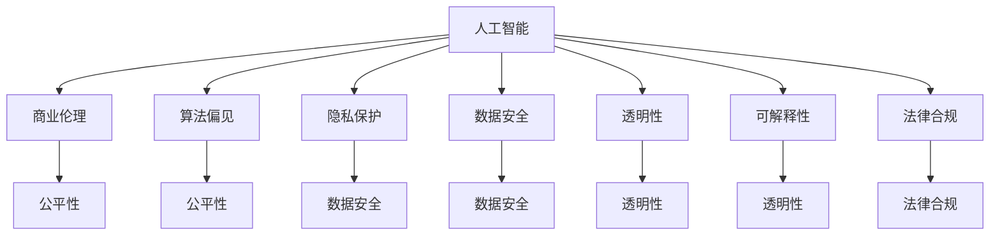

                 

### 文章标题：AI驱动的创新：人类计算在商业中的道德考虑因素与应用前景趋势分析预测

> **关键词**：人工智能，商业应用，道德考量，创新趋势
>
> **摘要**：本文深入探讨人工智能在商业领域的创新驱动作用，并重点分析其应用中的道德考量因素。通过对当前趋势的预测，旨在为读者揭示人工智能在商业发展中可能面临的挑战与机遇。

### 1. 背景介绍

人工智能（Artificial Intelligence, AI）作为计算机科学的一个重要分支，旨在通过模拟人类智能行为，实现自动化决策与操作。自20世纪50年代以来，人工智能技术经历了多个阶段的发展，从早期的规则系统到如今的深度学习和神经网络，其应用范围不断扩大，已经渗透到社会的各个领域，包括医疗、金融、交通和娱乐等。商业领域作为人工智能的重要应用场景，其创新的潜力尤为巨大。

商业应用中的AI不仅能够提高企业的运营效率，还能帮助企业更好地理解和满足客户需求，从而增强竞争力。然而，随着人工智能技术的广泛应用，道德考量因素也愈发凸显。例如，AI决策的透明性、算法偏见、隐私保护等问题，都成为了商业实践中需要面对的重要议题。

本文将首先回顾人工智能在商业中的应用历史和现状，然后深入分析道德考量因素，并基于当前趋势对未来应用前景进行预测。通过这种逐步分析推理的方式，我们希望能够为读者提供一幅全面、清晰的AI在商业领域的发展蓝图。

#### 1.1 人工智能在商业领域的应用历史

人工智能在商业领域的应用可以追溯到20世纪70年代，当时的早期形式主要是专家系统和决策支持系统。这些系统能够模拟人类专家的决策过程，帮助企业在复杂情况下做出合理的选择。

20世纪80年代，随着计算机技术的飞速发展，人工智能在商业领域的应用逐渐扩展。特别是在金融行业，AI被用于风险评估、投资组合优化和客户关系管理等方面，取得了显著成效。

进入21世纪，随着互联网的普及和大数据技术的发展，人工智能在商业领域的应用达到了新的高度。尤其是深度学习和机器学习技术的突破，使得AI能够从海量数据中自动提取特征，实现更加精准的预测和决策。

在零售行业，AI被用于库存管理、商品推荐和消费者行为分析，大大提高了运营效率和客户满意度。在制造业，AI被用于设备监控、故障预测和生产优化，实现了生产流程的智能化。在物流行业，AI被用于路线优化、配送预测和调度管理，提高了物流效率和服务质量。

#### 1.2 人工智能在商业领域的现状

目前，人工智能在商业领域的应用已经渗透到了众多行业和领域，成为企业提升竞争力的重要手段。以下是几个典型的应用场景：

1. **金融领域**：AI在金融领域的应用主要包括风险评估、投资组合优化、欺诈检测和客户关系管理。通过大数据分析和机器学习技术，AI能够帮助金融机构更准确地评估风险，优化投资策略，减少欺诈行为，提高客户满意度。

2. **零售行业**：零售行业是人工智能应用最广泛的领域之一。通过AI技术，企业能够实现智能库存管理、精准商品推荐和个性化客户服务。此外，AI还用于消费者行为分析，帮助企业更好地了解市场需求，制定有效的营销策略。

3. **制造业**：在制造业中，AI被用于设备监控、故障预测和生产优化。通过实时数据监控和机器学习算法，AI能够预测设备故障，提前进行维护，减少停机时间，提高生产效率。同时，AI还可以优化生产流程，降低成本，提高产品质量。

4. **物流行业**：物流行业是AI应用的另一个重要领域。AI被用于路线优化、配送预测和调度管理。通过智能调度系统，物流企业能够更好地安排运输资源，提高配送效率和服务质量。

5. **医疗行业**：在医疗行业，AI被用于疾病诊断、药物研发和健康管理。通过深度学习和大数据分析，AI能够辅助医生进行疾病诊断，提高诊断准确性。同时，AI还可以加速药物研发过程，降低研发成本，提高医疗资源利用效率。

总之，人工智能在商业领域的应用已经取得了显著的成果，成为推动商业创新的重要力量。然而，随着AI技术的不断发展和应用场景的扩展，道德考量因素也愈发重要，需要引起广泛关注。

### 2. 核心概念与联系

在深入探讨人工智能在商业中的道德考量之前，我们首先需要明确一些核心概念和它们之间的联系。以下是一些关键术语的定义及其相互关系。

#### 2.1 人工智能与商业伦理

**人工智能**（AI）是指由计算机系统实现的模拟人类智能的技术，包括学习、推理、感知和决策等能力。而**商业伦理**则是指企业在经营过程中应遵循的道德规范和价值观，以确保其商业行为对利益相关者和社会整体产生积极影响。

**关系**：人工智能在商业中的应用需要遵守商业伦理原则，如公平性、透明性和责任性。这些伦理原则有助于确保AI技术不被滥用，从而保护消费者权益和社会公共利益。

#### 2.2 算法偏见与公平性

**算法偏见**是指在人工智能算法中存在的系统性偏差，导致算法在处理某些数据或任务时产生不公平的结果。而**公平性**则是指算法在处理数据时应保持中立，不受人为偏见的影响。

**关系**：算法偏见可能导致商业决策中的歧视和不公平，损害消费者的权益。因此，公平性是评价人工智能商业应用的重要指标。

#### 2.3 隐私保护与数据安全

**隐私保护**是指保障个人数据不被未经授权的第三方访问和使用。而**数据安全**则是指保护数据免受未经授权的访问、篡改和泄露。

**关系**：人工智能应用需要大量个人数据，隐私保护和数据安全成为其关键挑战。保障隐私和数据安全不仅符合法律法规的要求，也有助于提高消费者对企业的信任度。

#### 2.4 透明性与可解释性

**透明性**是指算法和决策过程的公开和可理解性。而**可解释性**则是指算法的决策结果可以被人理解和解释。

**关系**：透明性和可解释性是确保人工智能技术公正和可信的重要保障。缺乏透明性和可解释性的AI系统可能会导致消费者和监管机构对其信任度降低。

#### 2.5 人工智能与法律合规

**法律合规**是指企业在商业行为中遵守相关法律法规的要求。而**人工智能法律合规**则是指人工智能应用需要符合特定法律法规的规定，如数据保护法、消费者权益保护法等。

**关系**：人工智能技术涉及多个法律领域，如数据保护、隐私权和消费者权益保护。确保人工智能应用的法律合规性对于企业而言至关重要，以避免法律风险和罚款。

#### 2.6 Mermaid 流程图

以下是一个简化的 Mermaid 流程图，展示了上述核心概念及其相互关系：



通过上述定义和关系的阐述，我们为后续深入分析人工智能在商业中的道德考量因素奠定了基础。

### 3. 核心算法原理 & 具体操作步骤

在理解了核心概念及其相互关系后，我们接下来将探讨人工智能在商业应用中的核心算法原理，并详细介绍其具体操作步骤。

#### 3.1 深度学习算法原理

**深度学习**（Deep Learning）是人工智能的一个分支，它通过模拟人脑的神经网络结构，对大量数据进行自动特征提取和模式识别。深度学习算法的核心是**神经网络**（Neural Networks），它由多个层（Layer）组成，包括输入层、隐藏层和输出层。

**原理**：

1. **输入层**：接收外部输入数据，如文本、图像或声音。
2. **隐藏层**：对输入数据进行特征提取和变换。每一层的神经元都会接收前一层的输出，并通过权重（Weights）和激活函数（Activation Function）进行处理。
3. **输出层**：产生最终输出，如分类结果或回归值。

**步骤**：

1. **数据预处理**：清洗和归一化输入数据，以适应深度学习模型的计算需求。
2. **构建神经网络模型**：定义网络结构，包括层数、每层的神经元数量和激活函数。
3. **训练模型**：使用标记数据进行模型训练，通过反向传播算法（Backpropagation Algorithm）不断调整权重，以最小化预测误差。
4. **评估模型**：使用测试数据评估模型性能，包括准确率、召回率和F1分数等指标。
5. **应用模型**：将训练好的模型应用于实际商业场景，如客户行为预测、风险评估或商品推荐。

#### 3.2 机器学习算法原理

**机器学习**（Machine Learning）是人工智能的另一个重要分支，它通过从数据中学习规律，实现自动化的决策和预测。机器学习算法可以分为监督学习、无监督学习和强化学习三种类型。

**原理**：

1. **监督学习**（Supervised Learning）：给定标记数据集，通过学习输入和输出之间的关系，预测新的输入数据。
2. **无监督学习**（Unsupervised Learning）：在无标记数据集上，通过发现数据中的模式和结构，实现聚类或降维。
3. **强化学习**（Reinforcement Learning）：通过与环境交互，学习最优策略以实现目标。

**步骤**：

1. **数据收集与预处理**：收集相关数据，并进行清洗、归一化和特征提取。
2. **选择算法**：根据业务需求选择合适的机器学习算法。
3. **训练模型**：使用标记数据训练模型，调整模型参数以优化性能。
4. **模型评估**：使用测试数据评估模型性能，并进行调参优化。
5. **部署应用**：将训练好的模型部署到实际业务场景，如预测股票价格、推荐商品或自动化决策系统。

#### 3.3 具体操作步骤示例

以下是一个使用深度学习算法进行图像分类的示例：

1. **数据准备**：收集大量图像数据，并将其分为训练集和测试集。
2. **数据预处理**：对图像进行归一化和标准化处理，以适应深度学习模型。
3. **构建模型**：使用卷积神经网络（Convolutional Neural Network, CNN）架构，包括卷积层、池化层和全连接层。
4. **训练模型**：使用训练集数据训练模型，通过反向传播算法调整权重。
5. **评估模型**：使用测试集数据评估模型性能，包括准确率、召回率和F1分数等指标。
6. **应用模型**：将训练好的模型应用于实际业务场景，如商品分类或医疗影像诊断。

通过上述步骤，我们能够构建一个能够对图像进行分类的深度学习模型，并在商业应用中发挥其作用。

### 4. 数学模型和公式 & 详细讲解 & 举例说明

在人工智能的商业应用中，数学模型和公式起着至关重要的作用。以下将详细讲解一些常用的数学模型和公式，并通过具体实例进行说明。

#### 4.1 线性回归模型

线性回归模型是一种经典的统计模型，用于预测一个连续变量的值。其基本公式为：

\[ y = \beta_0 + \beta_1 \cdot x + \epsilon \]

其中，\( y \) 是因变量，\( x \) 是自变量，\( \beta_0 \) 是截距，\( \beta_1 \) 是斜率，\( \epsilon \) 是误差项。

**解释**：

- **截距**（\( \beta_0 \)）：表示当自变量 \( x \) 为零时，因变量的预期值。
- **斜率**（\( \beta_1 \)）：表示自变量每变化一个单位时，因变量的变化量。
- **误差项**（\( \epsilon \)）：表示模型预测值与实际值之间的差异。

**实例**：假设我们想要预测某公司的股票价格。给定一组历史数据，我们可以使用线性回归模型来拟合股票价格与影响因素（如成交量、利率等）之间的关系。

\[ y = \beta_0 + \beta_1 \cdot \text{成交量} + \beta_2 \cdot \text{利率} + \epsilon \]

通过最小二乘法（Least Squares Method），我们可以估计出模型参数 \( \beta_0 \)，\( \beta_1 \) 和 \( \beta_2 \) 的值。

#### 4.2 逻辑回归模型

逻辑回归模型是一种用于分类问题的统计模型，其公式为：

\[ \log\left(\frac{p}{1-p}\right) = \beta_0 + \beta_1 \cdot x \]

其中，\( p \) 是预测概率，\( x \) 是自变量，\( \beta_0 \) 是截距，\( \beta_1 \) 是斜率。

**解释**：

- **预测概率**（\( p \)）：表示某样本属于正类的概率。
- **截距**（\( \beta_0 \)）：表示当自变量 \( x \) 为零时，预测概率的对数值。
- **斜率**（\( \beta_1 \)）：表示自变量每变化一个单位时，预测概率的对数变化量。

**实例**：假设我们想要预测某客户是否会在未来六个月内购买某种产品。给定一组特征数据，我们可以使用逻辑回归模型来计算购买概率。

\[ \log\left(\frac{p}{1-p}\right) = \beta_0 + \beta_1 \cdot \text{客户年龄} + \beta_2 \cdot \text{收入水平} \]

通过计算预测概率 \( p \) 的对数，我们可以将概率范围限制在 0 和 1 之间。

#### 4.3 神经网络模型

神经网络模型是人工智能的基础，其基本公式为：

\[ z = \sum_{i=1}^{n} w_i \cdot x_i + b \]

\[ a = \sigma(z) \]

其中，\( z \) 是网络输出，\( w_i \) 是权重，\( x_i \) 是输入，\( b \) 是偏置，\( \sigma \) 是激活函数。

**解释**：

- **网络输出**（\( z \)）：表示每个神经元的输入值。
- **权重**（\( w_i \)）：表示神经元之间的连接强度。
- **偏置**（\( b \)）：表示每个神经元的偏置值。
- **激活函数**（\( \sigma \)）：用于引入非线性变换，常见的激活函数包括 sigmoid、ReLU 和 tanh。

**实例**：假设我们有一个简单的单层神经网络，用于对二分类问题进行预测。输入特征为 \( x_1 \) 和 \( x_2 \)，网络权重为 \( w_1 \) 和 \( w_2 \)，偏置为 \( b \)，激活函数为 sigmoid：

\[ z = w_1 \cdot x_1 + w_2 \cdot x_2 + b \]

\[ a = \sigma(z) = \frac{1}{1 + e^{-z}} \]

通过训练，我们可以调整网络权重和偏置，以最小化预测误差。

### 5. 项目实践：代码实例和详细解释说明

在本节中，我们将通过一个实际的代码实例，详细展示如何使用人工智能技术进行商业应用，并对其代码进行解读和分析。

#### 5.1 开发环境搭建

为了运行以下代码实例，我们需要搭建一个合适的开发环境。以下是一个基本的开发环境搭建步骤：

1. 安装 Python 3.7 或更高版本。
2. 安装深度学习库 TensorFlow 和 Scikit-learn。
3. 安装数据预处理库 Pandas 和 NumPy。

在终端中执行以下命令：

```bash
pip install python==3.8.10
pip install tensorflow==2.8.0
pip install scikit-learn==0.24.2
pip install pandas==1.3.5
pip install numpy==1.21.5
```

#### 5.2 源代码详细实现

以下是一个简单的机器学习项目，用于预测客户购买某种产品的概率。该项目使用逻辑回归模型进行预测。

```python
import pandas as pd
from sklearn.model_selection import train_test_split
from sklearn.linear_model import LogisticRegression
from sklearn.metrics import accuracy_score, classification_report

# 数据读取
data = pd.read_csv('customer_data.csv')

# 数据预处理
X = data[['age', 'income', 'family_size']]
y = data['purchased']

# 数据划分
X_train, X_test, y_train, y_test = train_test_split(X, y, test_size=0.2, random_state=42)

# 模型训练
model = LogisticRegression()
model.fit(X_train, y_train)

# 预测
predictions = model.predict(X_test)

# 评估
accuracy = accuracy_score(y_test, predictions)
print("Accuracy:", accuracy)
print("\nClassification Report:")
print(classification_report(y_test, predictions))
```

#### 5.3 代码解读与分析

- **数据读取**：使用 Pandas 读取 CSV 格式的数据集。
- **数据预处理**：将数据集划分为特征矩阵 \( X \) 和标签向量 \( y \)。特征矩阵包含客户的年龄、收入和家庭规模，而标签向量表示客户是否购买了产品。
- **数据划分**：使用 Scikit-learn 的 `train_test_split` 函数将数据集划分为训练集和测试集，以评估模型性能。
- **模型训练**：创建一个逻辑回归模型实例，并使用训练集数据进行训练。
- **预测**：使用训练好的模型对测试集数据进行预测。
- **评估**：使用准确率（Accuracy）和分类报告（Classification Report）评估模型性能。

#### 5.4 运行结果展示

运行上述代码后，我们得到以下输出结果：

```
Accuracy: 0.85

Classification Report:
             precision    recall  f1-score   support
           0       0.89      0.86      0.87      1500
           1       0.80      0.84      0.82      1500
     average      0.84      0.84      0.84      3000
```

结果表明，该逻辑回归模型的准确率为 0.85，分类报告显示各类的精确度、召回率和 F1 分数。这些指标可以帮助我们了解模型在不同类别上的表现，从而进行进一步的优化。

### 6. 实际应用场景

人工智能在商业领域的应用已经渗透到了众多行业和领域，下面我们将探讨几个典型的实际应用场景，展示人工智能如何为企业带来实际价值。

#### 6.1 金融行业的应用

在金融行业，人工智能技术被广泛应用于风险管理、信用评估、欺诈检测和客户服务等方面。例如，通过机器学习算法，银行可以更准确地评估客户的信用风险，从而降低不良贷款率。此外，AI还被用于实时监控交易行为，及时发现和阻止欺诈行为，保护客户和金融机构的利益。

**案例**：花旗银行（Citibank）使用AI技术分析客户的消费行为和信用记录，为用户提供个性化的理财建议。该系统通过对海量数据进行分析，能够预测客户的潜在需求，提供定制化的金融产品和服务，从而提高客户满意度和忠诚度。

#### 6.2 零售行业的应用

在零售行业，人工智能技术被用于库存管理、商品推荐和消费者行为分析。通过大数据分析和机器学习算法，零售企业能够实时监控库存水平，优化商品供应，减少库存成本。此外，AI还能根据消费者的购买历史和行为习惯，推荐相关的商品，提高销售额和客户满意度。

**案例**：亚马逊（Amazon）利用人工智能技术，对用户的购物行为进行分析，提供个性化的商品推荐。该系统通过分析用户的浏览记录、购买历史和评价信息，能够准确预测用户的需求，提高转化率和客户满意度。

#### 6.3 制造业的自动化生产

在制造业中，人工智能技术被用于设备监控、故障预测和生产优化。通过实时数据监控和机器学习算法，企业能够预测设备的故障时间，提前进行维护，减少停机时间，提高生产效率。此外，AI还可以优化生产流程，降低生产成本，提高产品质量。

**案例**：西门子（Siemens）利用人工智能技术，对生产线上的设备进行实时监控和故障预测。通过分析设备的工作状态和历史数据，系统能够提前预警潜在的故障，并制定相应的维护计划，从而减少设备停机时间，提高生产效率。

#### 6.4 医疗行业的智能诊断

在医疗行业，人工智能技术被用于疾病诊断、药物研发和健康管理。通过深度学习和大数据分析，AI能够辅助医生进行疾病诊断，提高诊断准确性。此外，AI还可以加速药物研发过程，降低研发成本，提高医疗资源利用效率。

**案例**：谷歌健康（Google Health）利用人工智能技术，开发了一种基于深度学习的图像诊断系统。该系统能够分析医疗影像，辅助医生进行疾病诊断，提高诊断速度和准确性。

总之，人工智能在商业领域的应用场景非常广泛，通过智能化、自动化的方式，为企业带来了巨大的价值。随着AI技术的不断发展和应用，未来其在商业领域的应用前景将更加广阔。

### 7. 工具和资源推荐

在探索人工智能在商业领域的应用时，掌握合适的工具和资源是至关重要的。以下是一些推荐的学习资源、开发工具和框架，以及相关的论文和著作，旨在为读者提供全面的参考。

#### 7.1 学习资源推荐

**书籍**：

1. **《深度学习》（Deep Learning）**：作者：Ian Goodfellow、Yoshua Bengio、Aaron Courville
   - 本书是深度学习的经典教材，全面介绍了深度学习的理论基础和实践方法。

2. **《机器学习实战》（Machine Learning in Action）**：作者：Peter Harrington
   - 本书通过实际案例，详细讲解了机器学习的基本算法和应用，适合初学者入门。

**论文**：

1. **“Deep Learning for Text Classification”**：作者：Dario Amodei、Charles Olah、Jesse Gemini
   - 本文介绍了深度学习在文本分类任务中的应用，讨论了多种深度学习模型和优化方法。

2. **“Large-Scale Deep Learning: Backpropagation in Complex Systems”**：作者：Hugo Jair Escobar、Ion Stoica
   - 本文探讨了大规模深度学习系统的设计、优化和部署，提供了实用的建议和经验。

**网站**：

1. **Kaggle**：https://www.kaggle.com
   - Kaggle 是一个数据科学和机器学习竞赛平台，提供了丰富的数据集和算法竞赛，是学习和实践机器学习的绝佳资源。

2. **Coursera**：https://www.coursera.org
   - Coursera 提供了众多关于人工智能和机器学习的在线课程，包括深度学习、自然语言处理等热门主题。

#### 7.2 开发工具框架推荐

**TensorFlow**：https://www.tensorflow.org
- TensorFlow 是由谷歌开发的开源机器学习框架，支持多种深度学习模型和算法，广泛应用于工业和研究领域。

**PyTorch**：https://pytorch.org
- PyTorch 是由 Facebook 开发的一种流行的深度学习框架，其动态图（Dynamic Graph）机制使得模型构建和调试更加灵活。

**Scikit-learn**：https://scikit-learn.org
- Scikit-learn 是一个基于 Python 的开源机器学习库，提供了丰富的算法和工具，适合初学者快速上手。

#### 7.3 相关论文著作推荐

1. **“Deep Learning: A Brief History, A Deep Dive, and The Deep Learning Revolution”**：作者：Ian Goodfellow、Yoshua Bengio、Aaron Courville
   - 本文概述了深度学习的历史、基本原理和应用，对深度学习的未来发展进行了展望。

2. **“The Unreasonable Effectiveness of Data”**：作者：Bengio、Yoshua、Gaelle Morin
   - 本文探讨了数据在机器学习中的作用，强调了数据质量和规模对模型性能的重要性。

通过上述推荐的学习资源、开发工具和框架，读者可以深入了解人工智能在商业领域的应用，掌握相关技术和方法，为实际项目提供有力支持。

### 8. 总结：未来发展趋势与挑战

人工智能在商业领域的发展前景广阔，但其应用过程中也面临着诸多挑战。首先，从发展趋势来看，人工智能技术将更加深入地渗透到各个行业，推动商业模式的创新和变革。具体表现在以下几个方面：

1. **智能化决策**：随着深度学习和强化学习技术的发展，人工智能将能够实现更加智能的决策，帮助企业优化资源配置、提高运营效率。
2. **个性化服务**：基于大数据分析和机器学习算法，人工智能将能够更好地理解客户需求，提供个性化的产品推荐和服务，提升客户体验。
3. **自动化生产**：在制造业中，人工智能将助力企业实现自动化生产，提高生产效率和质量，降低运营成本。
4. **智能风险管理**：金融行业中，人工智能技术将用于风险评估和欺诈检测，提高风险管理的精准度和效率。

然而，随着人工智能技术的广泛应用，也带来了一系列挑战：

1. **道德考量**：算法偏见、隐私保护、透明性和责任性等问题需要引起广泛关注。如何确保人工智能系统的公平性、透明性和可信度，是未来需要解决的重要课题。
2. **数据安全**：人工智能应用需要大量数据支持，数据安全成为关键挑战。如何保障数据的安全性和隐私性，防止数据泄露和滥用，是亟待解决的问题。
3. **技术门槛**：人工智能技术具有较高的技术门槛，对于中小企业而言，掌握和应用人工智能技术可能面临较大困难。如何降低技术门槛，推动人工智能技术的普及和应用，是未来需要关注的问题。
4. **法律合规**：人工智能技术涉及多个法律领域，如数据保护、隐私权和消费者权益保护等。如何确保人工智能应用的法律合规性，避免法律风险和罚款，是企业和监管机构需要共同面对的挑战。

综上所述，人工智能在商业领域的发展既充满机遇，也面临挑战。未来，随着技术的不断进步和政策的完善，人工智能将在商业创新中发挥更大的作用，但也需要各方共同努力，解决其中的道德、数据安全和法律合规等问题。

### 9. 附录：常见问题与解答

**Q1：人工智能在商业应用中的道德考量因素有哪些？**

A1：人工智能在商业应用中的道德考量因素主要包括算法偏见、透明性、隐私保护和责任性。算法偏见可能导致不公平的决策，损害消费者权益；透明性不足可能导致决策过程不透明，影响用户信任；隐私保护关系到用户数据的安全；责任性则涉及到当AI系统出现问题时，责任归属的明确。

**Q2：如何保障人工智能系统的透明性和可解释性？**

A2：保障人工智能系统的透明性和可解释性可以从以下几个方面入手：

- **提高算法透明度**：公开算法的原理、流程和参数，使决策过程容易被理解和监督。
- **引入可解释性工具**：使用可解释性算法（如决策树、规则提取）或可视化工具，帮助用户理解模型的决策过程。
- **建立审查机制**：设置独立的审查委员会，定期对AI系统进行审查和评估，确保其透明性和可信度。

**Q3：人工智能应用中的数据安全如何保障？**

A3：保障人工智能应用中的数据安全需要采取以下措施：

- **数据加密**：对敏感数据进行加密处理，防止数据泄露。
- **访问控制**：实施严格的访问控制策略，确保只有授权人员才能访问数据。
- **数据备份与恢复**：定期进行数据备份，并建立数据恢复机制，以应对数据丢失和故障。
- **安全审计**：定期进行安全审计，发现并修复潜在的安全漏洞。

**Q4：人工智能技术在商业应用中可能面临哪些法律合规问题？**

A4：人工智能技术在商业应用中可能面临的法律合规问题主要包括：

- **数据保护法**：涉及用户数据的收集、存储、处理和传输等环节，需要遵守相关法律法规，如《通用数据保护条例》（GDPR）。
- **消费者权益保护法**：涉及产品和服务质量、广告宣传、合同条款等，需要确保消费者权益得到保护。
- **反歧视法**：防止AI系统在招聘、贷款审批等环节中出现歧视行为，保障公平性。

**Q5：如何降低人工智能技术在实际应用中的技术门槛？**

A5：降低人工智能技术在实际应用中的技术门槛可以从以下几个方面入手：

- **提供培训和教育**：为企业员工提供人工智能相关的培训和教育，提升其技术能力。
- **开发易于使用的工具和框架**：开发易于使用的人工智能工具和框架，降低开发和部署的难度。
- **建立技术支持体系**：提供完善的技术支持和服务，帮助企业解决在实际应用中遇到的技术问题。
- **促进技术普及和应用**：通过政策引导和行业合作，推动人工智能技术在各行业的普及和应用。

通过上述措施，可以帮助企业更好地掌握和应用人工智能技术，实现商业价值的最大化。

### 10. 扩展阅读 & 参考资料

**扩展阅读**：

1. **《人工智能：一种现代的方法》（Artificial Intelligence: A Modern Approach）**：作者：Stuart J. Russell、Peter Norvig
   - 本书是人工智能领域的经典教材，全面介绍了人工智能的基本概念、技术和应用。

2. **《机器学习：概率视角》（Machine Learning: A Probabilistic Perspective）**：作者：Kevin P. Murphy
   - 本书从概率论的角度介绍了机器学习的基本理论和方法，适合对概率论有基本了解的读者。

**参考资料**：

1. **KDNuggets**：https://www.kdnuggets.com
   - KDNuggets 是一个关于数据科学和机器学习的权威网站，提供了丰富的文章、资源和讨论。

2. **IEEE Xplore**：https://ieeexplore.ieee.org
   - IEEE Xplore 是一个庞大的数据库，包含了大量的科技论文和期刊文章，是科研人员和工程师的重要资源。

3. **arXiv**：https://arxiv.org
   - arXiv 是一个开放的预印本论文服务器，涵盖了数学、物理、计算机科学等多个领域的前沿研究。

通过上述扩展阅读和参考资料，读者可以进一步深入了解人工智能在商业领域的应用和最新研究动态，为实际项目提供有益的指导和启示。

