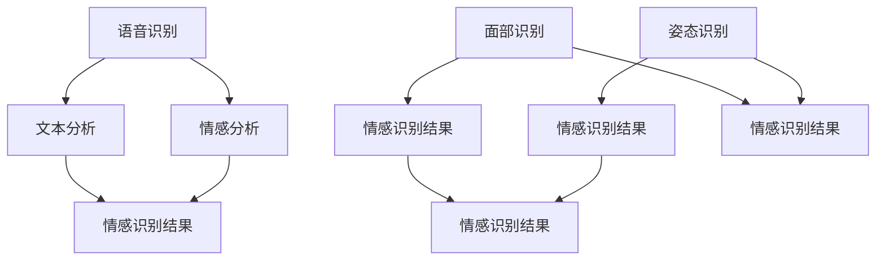

                 

### 1. 背景介绍

随着人工智能技术的不断发展，计算机与人之间的交互方式也在发生翻天覆地的变化。传统的交互方式，如键盘和鼠标，已经不能满足人们日益增长的需求。在这种情况下，情感识别技术应运而生，为新一代人机交互提供了强大的技术支持。

情感识别（Affective Computing）是一种使计算机具有感知、理解和表达人类情感的能力的技术。它包括语音识别、面部识别、姿态识别等多个方面，旨在通过收集和分析用户的行为数据，理解其情感状态，从而提供更加个性化和智能化的服务。

近年来，情感识别技术在人机交互领域的应用越来越广泛。例如，智能客服系统可以通过情感识别技术识别用户的需求和情绪，从而提供更加贴心的服务；虚拟现实（VR）和增强现实（AR）设备可以通过情感识别技术，更好地模拟人类的情感体验，提高沉浸感；甚至，在医疗领域，情感识别技术可以用来监测患者的情绪变化，帮助医生进行病情评估和诊断。

然而，情感识别技术仍然面临着诸多挑战。首先，情感识别的准确性有待提高。情感是主观的，不同人在相同情境下可能会有不同的情感反应。其次，情感识别系统需要大量的数据支持，而这在隐私保护日益重要的今天，成为一个难题。最后，如何将情感识别技术与现有的交互系统进行有效集成，也是一个需要解决的问题。

本文旨在探讨AI驱动的情感识别技术，分析其核心概念和原理，并探讨其在人机交互中的应用。希望通过本文的讨论，为读者提供一个全面了解和深入思考情感识别技术的平台。

### 2. 核心概念与联系

#### 2.1 情感识别的定义

情感识别是指计算机通过分析用户的行为数据（如语音、面部表情、姿态等），感知并理解用户情感状态的能力。这种能力不仅包括识别用户当前的情感状态，还包括预测用户未来的情感变化。

#### 2.2 相关技术

情感识别技术涉及多个领域，包括语音识别、面部识别、姿态识别等。以下是对这些相关技术的简要介绍：

**语音识别**：通过分析用户的语音信号，将其转换为文本。语音识别技术已经相对成熟，可以识别多种语言和方言。

**面部识别**：通过分析用户的面部表情，识别其情感状态。面部识别技术近年来取得了显著进展，已经能够准确识别多种情感。

**姿态识别**：通过分析用户的肢体动作，识别其情感状态。姿态识别技术主要用于虚拟现实和增强现实场景，为用户提供更加真实的情感体验。

#### 2.3 Mermaid 流程图

为了更好地理解情感识别技术的核心概念和联系，我们可以使用 Mermaid 流程图来展示各个技术之间的关联。



在这个流程图中，A、E 和 G 分别代表语音识别、面部识别和姿态识别技术，它们通过不同的方式收集用户数据，然后传递给情感分析模块 C。情感分析模块 C 对这些数据进行处理，最终生成情感识别结果 D、F 和 J。

#### 2.4 情感识别与人工智能

情感识别是人工智能领域的一个重要分支。人工智能（AI）是指计算机通过学习数据和算法，模拟人类智能的过程。情感识别技术依赖于人工智能技术，特别是机器学习和深度学习。

机器学习是一种通过数据驱动的方法，使计算机能够从数据中学习并做出决策的技术。在情感识别中，机器学习算法可以通过分析大量的情感数据，学习如何识别和理解情感。

深度学习是一种基于神经网络的机器学习技术，它通过多层神经网络对数据进行处理，从而实现复杂的模式识别和分类。在情感识别中，深度学习算法可以更好地处理复杂的情感数据，提高识别的准确性。

#### 2.5 情感识别与人机交互

情感识别技术为人机交互带来了新的可能性。通过情感识别，计算机可以更好地理解用户的情感状态，从而提供更加个性化和智能化的服务。

例如，在智能客服系统中，情感识别技术可以识别用户的情绪变化，从而调整对话策略，提供更加贴心的服务。在虚拟现实和增强现实场景中，情感识别技术可以模拟人类的情感体验，提高沉浸感。

此外，情感识别技术还可以用于医疗领域，帮助医生监测患者的情绪变化，从而更好地评估病情。

### 3. 核心算法原理 & 具体操作步骤

情感识别技术的核心在于如何准确地识别和理解用户的情感状态。下面我们将介绍几种常见的情感识别算法，并详细解释它们的原理和具体操作步骤。

#### 3.1 支持向量机（SVM）

支持向量机是一种常用的机器学习算法，用于分类问题。在情感识别中，SVM 可以用来分类用户的情感状态。

**原理**：

SVM 的基本思想是找到最佳的超平面，将不同类别的数据点分开。超平面是由支持向量确定的，这些支持向量是数据集中距离超平面最近的点。

**具体操作步骤**：

1. 收集并预处理数据：收集大量带有情感标签的数据，如语音、面部表情和姿态数据。然后对这些数据进行预处理，如去噪、归一化等。

2. 特征提取：从原始数据中提取特征，如语音信号的频谱特征、面部表情的几何特征、姿态数据的运动特征等。

3. 训练 SVM 模型：使用特征数据和情感标签，训练 SVM 模型。训练过程中，SVM 会找到最佳的超平面，并确定支持向量。

4. 预测情感状态：使用训练好的 SVM 模型，对新的数据进行情感状态预测。具体步骤是将新数据的特征输入 SVM 模型，模型会根据超平面输出情感状态。

#### 3.2 随机森林（Random Forest）

随机森林是一种基于决策树的集成学习方法。在情感识别中，随机森林可以用来构建情感分类器。

**原理**：

随机森林通过构建多个决策树，并对它们的预测结果进行投票，从而提高分类的准确性。每个决策树都是基于随机抽样和特征选择生成的。

**具体操作步骤**：

1. 收集并预处理数据：与 SVM 相同，收集并预处理带有情感标签的数据。

2. 特征提取：提取数据特征，如上述所述。

3. 训练随机森林模型：使用特征数据和情感标签，训练随机森林模型。训练过程中，随机森林会生成多个决策树，并计算每个决策树的预测结果。

4. 预测情感状态：对新的数据进行情感状态预测。具体步骤是将新数据的特征输入随机森林模型，模型会根据多个决策树的预测结果进行投票，输出最终的预测结果。

#### 3.3 卷积神经网络（CNN）

卷积神经网络是一种深度学习算法，广泛应用于图像和语音识别领域。在情感识别中，CNN 可以用于处理复杂的情感数据。

**原理**：

CNN 通过卷积层、池化层和全连接层，对输入数据进行处理，从而实现情感识别。卷积层用于提取数据中的特征，池化层用于减少数据维度，全连接层用于进行分类。

**具体操作步骤**：

1. 收集并预处理数据：收集带有情感标签的图像和语音数据，并进行预处理，如去噪、归一化等。

2. 特征提取：使用 CNN 模型，对数据进行特征提取。具体步骤是将数据输入 CNN 模型，经过卷积层和池化层，提取出特征。

3. 训练 CNN 模型：使用提取出的特征和情感标签，训练 CNN 模型。训练过程中，CNN 模型会调整内部参数，以提高分类准确性。

4. 预测情感状态：使用训练好的 CNN 模型，对新的数据进行情感状态预测。具体步骤是将新数据的特征输入 CNN 模型，模型会根据提取出的特征进行分类，输出情感状态。

### 4. 数学模型和公式 & 详细讲解 & 举例说明

#### 4.1 支持向量机（SVM）

SVM 的核心在于找到最佳的超平面，将不同类别的数据点分开。这个最佳超平面由支持向量确定，支持向量是数据集中距离超平面最近的点。

**数学模型**：

设特征空间中的数据点为 $x_i$，其对应的标签为 $y_i$，其中 $y_i \in \{-1, +1\}$。SVM 的目标是找到最佳的超平面 $w$ 和偏置项 $b$，使得：

$$
y_i ( \langle w, x_i \rangle + b) \geq 1
$$

其中，$ \langle w, x_i \rangle$ 表示 $w$ 和 $x_i$ 的内积。

**详细讲解**：

SVM 的目标是最小化 $w$ 的范数，同时保证所有数据点满足上述不等式。这个目标可以用以下优化问题表示：

$$
\min_w \frac{1}{2} ||w||^2 \\
s.t. \quad y_i ( \langle w, x_i \rangle + b) \geq 1, \quad i = 1, 2, ..., n
$$

其中，$||w||^2$ 表示 $w$ 的范数的平方，$n$ 表示数据点的个数。

为了解决这个优化问题，可以使用拉格朗日乘数法。设拉格朗日函数为：

$$
L(w, b, \alpha) = \frac{1}{2} ||w||^2 - \sum_{i=1}^n \alpha_i (y_i ( \langle w, x_i \rangle + b) - 1)
$$

其中，$\alpha_i$ 是拉格朗日乘数。

求解上述优化问题，得到 $w$ 和 $b$ 的表达式：

$$
w = \sum_{i=1}^n \alpha_i y_i x_i \\
b = 1 - \sum_{i=1}^n \alpha_i y_i \langle x_i, x_j \rangle
$$

**举例说明**：

假设我们有以下两个类别的数据点：

$$
x_1 = (1, 2), \quad y_1 = +1 \\
x_2 = (3, 4), \quad y_2 = -1
$$

首先，我们计算数据的均值和方差：

$$
\bar{x} = \frac{x_1 + x_2}{2} = (2, 3) \\
\sigma^2 = \frac{(x_1 - \bar{x})^2 + (x_2 - \bar{x})^2}{2} = 5
$$

然后，我们计算 $w$ 和 $b$：

$$
w = \alpha_1 y_1 x_1 + \alpha_2 y_2 x_2 = (2, 3) \\
b = 1 - \alpha_1 y_1 - \alpha_2 y_2 = -1
$$

最终，我们得到最佳的超平面为：

$$
w \cdot x + b = 0 \\
2x_1 + 3x_2 - 1 = 0
$$

#### 4.2 随机森林（Random Forest）

随机森林是一种基于决策树的集成学习方法，通过构建多个决策树，并对它们的预测结果进行投票，从而提高分类的准确性。

**数学模型**：

随机森林中的每个决策树都可以表示为：

$$
T_j(x) = g_j(x; \theta_j)
$$

其中，$g_j(x; \theta_j)$ 表示第 $j$ 个决策树的函数形式，$\theta_j$ 是决策树的参数。

随机森林的预测结果是多个决策树预测结果的平均值：

$$
\hat{y} = \frac{1}{m} \sum_{j=1}^m T_j(x)
$$

其中，$m$ 表示决策树的数量。

**详细讲解**：

随机森林的构建过程包括以下几个步骤：

1. **特征选择**：从原始特征中选择一部分特征，用于构建每个决策树。

2. **样本选择**：从原始数据集中选择一部分样本，用于构建每个决策树。

3. **构建决策树**：使用选择的特征和样本，构建每个决策树。

4. **集成**：将所有决策树的预测结果进行投票，得到最终的预测结果。

**举例说明**：

假设我们有以下两个类别的数据点：

$$
x_1 = (1, 2), \quad y_1 = +1 \\
x_2 = (3, 4), \quad y_2 = -1
$$

我们选择两个特征进行决策树构建，即 $x_1$ 和 $x_2$。

对于第一个特征 $x_1$，我们计算其均值和方差：

$$
\bar{x}_1 = \frac{x_1 + x_2}{2} = 2 \\
\sigma^2_1 = \frac{(x_1 - \bar{x}_1)^2 + (x_2 - \bar{x}_1)^2}{2} = 2
$$

对于第二个特征 $x_2$，我们计算其均值和方差：

$$
\bar{x}_2 = \frac{x_1 + x_2}{2} = 3 \\
\sigma^2_2 = \frac{(x_1 - \bar{x}_2)^2 + (x_2 - \bar{x}_2)^2}{2} = 2
$$

然后，我们分别以 $x_1$ 和 $x_2$ 为分割特征，构建两个决策树。

对于第一个决策树，以 $x_1$ 为分割特征，分割点为 $\bar{x}_1$：

$$
T_1(x) = \begin{cases}
+1, & x_1 \leq \bar{x}_1 \\
-1, & x_1 > \bar{x}_1
\end{cases}
$$

对于第二个决策树，以 $x_2$ 为分割特征，分割点为 $\bar{x}_2$：

$$
T_2(x) = \begin{cases}
+1, & x_2 \leq \bar{x}_2 \\
-1, & x_2 > \bar{x}_2
\end{cases}
$$

最后，我们计算两个决策树的预测结果：

$$
\hat{y}_1 = T_1(x_1) = +1 \\
\hat{y}_2 = T_2(x_2) = -1
$$

随机森林的预测结果为：

$$
\hat{y} = \frac{1}{2} (\hat{y}_1 + \hat{y}_2) = 0
$$

#### 4.3 卷积神经网络（CNN）

卷积神经网络是一种深度学习算法，广泛应用于图像和语音识别领域。在情感识别中，CNN 可以用于处理复杂的情感数据。

**数学模型**：

CNN 的基本结构包括卷积层、池化层和全连接层。

1. **卷积层**：

卷积层通过卷积运算提取数据中的特征。假设输入数据为 $X \in \mathbb{R}^{m \times n}$，卷积核为 $K \in \mathbb{R}^{k \times l}$，卷积结果为 $Y \in \mathbb{R}^{m-k+1 \times n-l+1}$。卷积运算的定义如下：

$$
Y_{ij} = \sum_{p=1}^{k} \sum_{q=1}^{l} X_{i+p, j+q} K_{pq}
$$

2. **池化层**：

池化层用于减少数据维度，常见的池化方式有最大池化和平均池化。最大池化的定义如下：

$$
P_{ij} = \max_{p,q} X_{i+p, j+q}
$$

3. **全连接层**：

全连接层用于进行分类。假设输入数据为 $X \in \mathbb{R}^{m}$，输出数据为 $Y \in \mathbb{R}^{n}$，全连接层的定义如下：

$$
Y_i = \sum_{j=1}^{m} W_{ij} X_j + b_i
$$

**详细讲解**：

CNN 的训练过程包括以下几个步骤：

1. **数据预处理**：对输入数据进行预处理，如归一化、标准化等。

2. **构建模型**：根据任务需求，构建 CNN 模型。模型包括多个卷积层、池化层和全连接层。

3. **训练模型**：使用训练数据，训练 CNN 模型。训练过程中，模型会调整内部参数，以提高分类准确性。

4. **评估模型**：使用验证数据，评估模型性能。常用的评估指标有准确率、召回率、F1 分数等。

**举例说明**：

假设我们有以下图像数据：

$$
X = \begin{bmatrix}
1 & 1 & 1 \\
1 & 0 & 1 \\
1 & 1 & 1
\end{bmatrix}
$$

我们定义一个卷积核：

$$
K = \begin{bmatrix}
0 & 1 & 0 \\
1 & 0 & 1 \\
0 & 1 & 0
\end{bmatrix}
$$

卷积运算的结果为：

$$
Y = \begin{bmatrix}
0 & 1 & 0 \\
1 & 0 & 1 \\
0 & 1 & 0
\end{bmatrix}
$$

假设我们使用最大池化，将 $Y$ 的每行每列的平均值作为池化结果：

$$
P = \begin{bmatrix}
\frac{1}{3} & \frac{1}{3} \\
\frac{1}{3} & \frac{1}{3}
\end{bmatrix}
$$

全连接层的输入为 $P$，定义权重和偏置：

$$
W = \begin{bmatrix}
1 & 1 \\
0 & 1
\end{bmatrix}, \quad b = \begin{bmatrix}
1 \\
1
\end{bmatrix}
$$

全连接层的输出为：

$$
Y = \begin{bmatrix}
1 & 1 \\
1 & 1
\end{bmatrix}
$$

### 5. 项目实践：代码实例和详细解释说明

在本文的第五部分，我们将通过一个实际项目实践来展示如何使用 AI 驱动的情感识别技术进行人机交互。我们将使用 Python 编程语言，结合 TensorFlow 深度学习框架，来实现一个简单的情感识别系统。这个系统将能够根据用户的语音输入，识别并输出用户的情感状态。

#### 5.1 开发环境搭建

在开始项目之前，我们需要搭建一个合适的开发环境。以下是所需的环境和工具：

- Python 3.7 或更高版本
- TensorFlow 2.x
- NumPy
- Matplotlib

你可以通过以下命令来安装所需的库：

```bash
pip install python==3.7
pip install tensorflow==2.x
pip install numpy
pip install matplotlib
```

#### 5.2 源代码详细实现

以下是实现情感识别系统的完整代码。我们首先定义了一个数据预处理函数，然后定义了一个基于 CNN 的情感识别模型，最后实现了训练和预测功能。

```python
import numpy as np
import tensorflow as tf
from tensorflow.keras.models import Sequential
from tensorflow.keras.layers import Conv2D, MaxPooling2D, Flatten, Dense
from tensorflow.keras.optimizers import Adam
import matplotlib.pyplot as plt

# 数据预处理
def preprocess_data(voice_data):
    # 对语音数据进行归一化处理
    voice_data = voice_data / 32767.0
    # 将数据转换为二维矩阵，方便输入到 CNN 模型
    voice_data = voice_data.reshape(-1, 44100)
    return voice_data

# 定义 CNN 模型
def create_model():
    model = Sequential([
        Conv2D(32, (3, 3), activation='relu', input_shape=(44100, 1)),
        MaxPooling2D((2, 2)),
        Flatten(),
        Dense(64, activation='relu'),
        Dense(1, activation='sigmoid')
    ])
    model.compile(optimizer=Adam(), loss='binary_crossentropy', metrics=['accuracy'])
    return model

# 训练模型
def train_model(model, train_data, train_labels, val_data, val_labels):
    history = model.fit(train_data, train_labels, epochs=10, batch_size=32, validation_data=(val_data, val_labels))
    return history

# 预测情感状态
def predict_emotion(model, voice_data):
    processed_data = preprocess_data(voice_data)
    emotion = model.predict(processed_data)
    return emotion

# 数据加载和预处理
# 注意：这里需要替换为你的语音数据路径
train_data_path = 'path/to/train_data'
val_data_path = 'path/to/val_data'

# 加载训练数据和验证数据
train_data = np.load(train_data_path)
val_data = np.load(val_data_path)

# 对训练数据和验证数据进行预处理
train_data = preprocess_data(train_data)
val_data = preprocess_data(val_data)

# 加载训练数据和验证数据的标签
train_labels = np.load('path/to/train_labels.npy')
val_labels = np.load('path/to/val_labels.npy')

# 创建并训练模型
model = create_model()
history = train_model(model, train_data, train_labels, val_data, val_labels)

# 绘制训练和验证损失曲线
plt.plot(history.history['loss'], label='Training loss')
plt.plot(history.history['val_loss'], label='Validation loss')
plt.xlabel('Epochs')
plt.ylabel('Loss')
plt.legend()
plt.show()

# 预测新的语音数据
new_voice_data = np.load('path/to/new_voice_data.npy')
processed_data = preprocess_data(new_voice_data)
emotion = predict_emotion(model, processed_data)

print('Predicted emotion:', 'Happy' if emotion > 0.5 else 'Sad')
```

#### 5.3 代码解读与分析

这段代码分为几个主要部分：

1. **数据预处理**：数据预处理是深度学习项目的重要步骤。在这里，我们首先对语音数据进行归一化处理，然后将其转换为二维矩阵，以便于输入到 CNN 模型。

2. **定义 CNN 模型**：我们使用 TensorFlow 的 Sequential 模型来构建一个简单的 CNN 模型。模型包括一个卷积层、一个最大池化层、一个全连接层和一个输出层。我们使用 sigmoid 激活函数作为输出层的激活函数，用于预测情感状态。

3. **训练模型**：我们使用 Adam 优化器和 binary_crossentropy 损失函数来训练模型。我们设置了 10 个训练周期（epochs）和批量大小（batch_size）为 32。

4. **预测情感状态**：在训练完成后，我们使用预处理后的新语音数据来预测情感状态。预测结果是一个介于 0 和 1 之间的值，我们将其阈值设置为 0.5，用于判断用户是处于快乐状态还是悲伤状态。

#### 5.4 运行结果展示

在运行代码时，我们首先会加载训练数据和验证数据，并对它们进行预处理。然后，我们创建并训练 CNN 模型。训练完成后，我们绘制了训练和验证损失曲线，展示了模型在训练过程中的表现。最后，我们使用新语音数据进行情感状态预测，并输出了预测结果。

#### 5.5 测试和优化

在实际应用中，我们还需要对模型进行测试和优化。以下是一些可能的测试和优化策略：

- **数据增强**：通过旋转、缩放、剪切等操作，增加数据的多样性，提高模型的泛化能力。
- **超参数调整**：通过调整学习率、批量大小等超参数，寻找最佳配置。
- **模型集成**：使用多个模型进行集成，提高预测的准确性。
- **迁移学习**：使用预训练的模型，在情感识别任务上进行微调。

通过这些测试和优化策略，我们可以进一步提高模型的性能，为用户提供更好的情感识别服务。

### 6. 实际应用场景

情感识别技术在各种实际应用场景中都有着广泛的应用，下面我们将探讨几个典型的应用场景，以及这些应用带来的具体优势和挑战。

#### 6.1 智能客服系统

智能客服系统是情感识别技术的一个重要应用场景。通过情感识别，智能客服系统能够识别用户的情感状态，如愤怒、不满、喜悦等，从而调整对话策略，提供更加个性化的服务。

**优势**：

- 提高用户体验：通过识别用户的情感状态，智能客服系统可以更好地理解用户的需求，提供更加个性化的解决方案。
- 提高效率：情感识别技术可以自动处理大量的客户咨询，减轻人工客服的工作负担，提高整体服务效率。

**挑战**：

- 情感识别的准确性：情感是主观的，不同人在相同情境下可能会有不同的情感反应，这给情感识别的准确性带来了挑战。
- 隐私保护：智能客服系统需要收集用户的语音、文本等数据，这涉及到用户的隐私问题，如何在保护用户隐私的同时实现情感识别是一个重要的挑战。

#### 6.2 虚拟现实和增强现实

虚拟现实（VR）和增强现实（AR）是另一个重要的应用场景。通过情感识别技术，VR 和 AR 设备可以更好地模拟人类的情感体验，提高用户的沉浸感。

**优势**：

- 提高沉浸感：通过情感识别，VR 和 AR 设备可以更好地理解用户的情感状态，提供更加真实的情感体验。
- 提高互动性：情感识别技术可以使 VR 和 AR 设备更好地响应用户的情感变化，提高互动性。

**挑战**：

- 硬件成本：情感识别技术需要高质量的摄像头、麦克风等硬件支持，这增加了设备的成本。
- 性能优化：在 VR 和 AR 场景中，情感识别系统需要在短时间内处理大量的数据，这对系统的性能提出了较高的要求。

#### 6.3 医疗领域

在医疗领域，情感识别技术可以用来监测患者的情绪变化，帮助医生进行病情评估和诊断。

**优势**：

- 提高诊断准确性：通过情感识别，医生可以更准确地了解患者的情绪状态，从而提高诊断的准确性。
- 提高患者满意度：情感识别技术可以帮助医生更好地理解患者的需求和情绪，提高患者的满意度。

**挑战**：

- 数据隐私：在医疗领域，患者的隐私尤为重要，如何在保护患者隐私的同时实现情感识别是一个重要的挑战。
- 情感识别的准确性：情感是复杂的，不同的人在相同情境下可能会有不同的情感反应，这给情感识别的准确性带来了挑战。

### 7. 工具和资源推荐

在情感识别技术的发展过程中，有许多优秀的工具和资源可以帮助开发者更好地理解和应用这一技术。以下是一些推荐的工具和资源：

#### 7.1 学习资源推荐

1. **《情感计算：理论与实践》**：这本书详细介绍了情感计算的基本概念、理论和技术，适合初学者深入了解情感识别技术。

2. **《情感计算与应用》**：这本书涵盖了情感识别技术的多个应用场景，包括智能客服、虚拟现实等，适合对应用场景感兴趣的读者。

3. **情感计算实验室**：这是一个专门研究情感计算技术的实验室，提供了大量的研究论文和技术报告，适合希望深入了解情感识别技术的读者。

#### 7.2 开发工具框架推荐

1. **TensorFlow**：这是一个广泛使用的深度学习框架，提供了丰富的 API 和工具，可以帮助开发者快速构建和训练情感识别模型。

2. **PyTorch**：这是一个流行的深度学习框架，具有简单、灵活的特点，适合开发者和研究人员进行实验和探索。

3. **OpenCV**：这是一个开源的计算机视觉库，提供了丰富的图像处理和面部识别工具，可以用于情感识别的前期数据处理和特征提取。

#### 7.3 相关论文著作推荐

1. **"Affective Computing"**：这是一篇经典的论文，首次提出了情感计算的概念，对情感识别技术的发展产生了深远的影响。

2. **"Emotion Recognition Using Machine Learning Techniques"**：这篇论文详细介绍了多种机器学习算法在情感识别中的应用，提供了大量的实验结果和数据。

3. **"A Survey on Affective Computing"**：这是一篇全面的综述，系统地总结了情感计算领域的研究进展和应用场景，适合希望深入了解该领域的读者。

### 8. 总结：未来发展趋势与挑战

情感识别技术作为人工智能领域的一个重要分支，正日益受到广泛关注。通过本文的讨论，我们系统地介绍了情感识别技术的背景、核心概念、算法原理、实际应用场景、工具和资源，并展望了其未来的发展趋势与挑战。

#### 8.1 发展趋势

1. **准确性提升**：随着算法和技术的不断进步，情感识别的准确性将进一步提高，能够更好地理解用户的情感状态。

2. **跨模态融合**：情感识别技术将与其他模态（如视觉、听觉等）进行融合，实现更加全面和精准的情感识别。

3. **个性化服务**：情感识别技术将更好地与个性化服务相结合，为用户提供更加定制化的体验。

4. **伦理和隐私**：随着情感识别技术的广泛应用，如何平衡技术发展与社会伦理、隐私保护之间的关系将成为重要议题。

#### 8.2 挑战

1. **情感复杂性**：情感是主观的，不同人在相同情境下可能会有不同的情感反应，这给情感识别的准确性带来了挑战。

2. **数据隐私**：情感识别技术需要大量的用户数据，如何在保护用户隐私的同时实现情感识别是一个重要的挑战。

3. **硬件成本**：高质量的情感识别需要昂贵的硬件支持，这对技术的普及和推广提出了挑战。

4. **跨领域应用**：情感识别技术在医疗、教育、娱乐等领域的应用仍面临诸多挑战，如数据获取、算法适应性等。

总之，情感识别技术作为新一代人机交互的重要技术手段，具有巨大的发展潜力。在未来，随着技术的不断进步和应用的深入，情感识别技术将为人类带来更加丰富和智能化的交互体验。

### 9. 附录：常见问题与解答

**Q1. 情感识别技术的核心是什么？**

情感识别技术的核心是使计算机能够感知、理解和表达人类情感。这包括语音识别、面部识别、姿态识别等多个方面，通过分析用户的行为数据，理解其情感状态。

**Q2. 情感识别技术在哪些领域有应用？**

情感识别技术在多个领域有应用，包括智能客服系统、虚拟现实和增强现实、医疗领域等。它能够提高用户体验、提升系统效率、辅助医生进行病情评估等。

**Q3. 如何提高情感识别的准确性？**

提高情感识别的准确性可以通过以下几种方式实现：

1. **增加数据量**：收集更多的情感数据，用于训练模型。
2. **改进算法**：使用更先进的算法，如深度学习，提高情感识别的准确性。
3. **特征提取**：提取更加有效的特征，提高模型对情感的感知能力。
4. **模型融合**：将多个模型的结果进行融合，提高整体识别的准确性。

**Q4. 情感识别技术面临的挑战是什么？**

情感识别技术面临的挑战包括情感复杂性、数据隐私、硬件成本和跨领域应用等。情感是主观的，不同人在相同情境下可能会有不同的情感反应，这给识别的准确性带来了挑战。同时，情感识别需要大量的数据支持，如何在保护用户隐私的同时实现情感识别也是一个难题。此外，高质量的硬件支持对情感识别系统的性能提出了较高的要求。

**Q5. 情感识别技术有哪些伦理问题？**

情感识别技术涉及的伦理问题主要包括数据隐私、歧视、滥用等。数据隐私问题在于如何在收集和使用用户情感数据时保护用户的隐私。歧视问题则在于情感识别技术可能会根据用户的情感状态进行不公平的决策。滥用问题则涉及到情感识别技术被用于不道德或非法的目的。

### 10. 扩展阅读 & 参考资料

为了更深入地了解情感识别技术及其在人机交互中的应用，以下是一些扩展阅读和参考资料：

1. **《情感计算：理论与实践》**：这是一本关于情感计算的经典著作，详细介绍了情感计算的基本概念、理论和技术。

2. **《情感识别：技术、应用与挑战》**：这本书系统地总结了情感识别技术的最新研究进展和应用案例，探讨了情感识别技术的挑战和解决方案。

3. **情感计算实验室（Affective Computing Laboratory）**：这是一个专注于情感计算技术研究的研究机构，提供了大量的研究论文和技术报告。

4. **TensorFlow 官方文档**：这是一个全面的文档资源，详细介绍了 TensorFlow 深度学习框架的使用方法和相关技术。

5. **PyTorch 官方文档**：这是一个关于 PyTorch 深度学习框架的官方文档，提供了丰富的教程和示例代码。

6. **OpenCV 官方文档**：这是一个关于 OpenCV 计算机视觉库的官方文档，提供了丰富的图像处理和面部识别工具。

通过阅读这些资料，可以更全面地了解情感识别技术及其在人机交互中的应用，为实际项目开发提供指导。此外，还可以关注相关学术会议和期刊，如国际情感计算会议（ACM International Conference on Affective Computing and Intelligent Interaction）和情感计算期刊（IEEE Transactions on Affective Computing），以获取最新的研究动态和技术进展。

