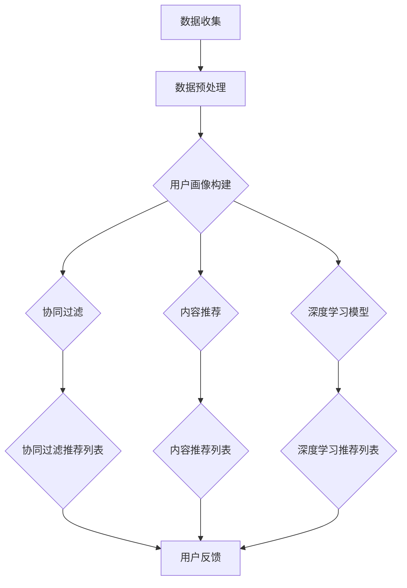

                 

### 背景介绍

随着互联网的迅猛发展，电子商务已经成为现代商业活动的重要组成部分。在线购物平台和零售商们不断寻求新的方法来提高用户体验、增加销售额和提升用户留存率。传统的推荐系统往往依赖于历史购物数据和用户行为模式，通过统计方法和机器学习算法为用户提供相关商品推荐。然而，这些方法往往存在个性化不足、推荐质量不稳定等问题。

近年来，人工智能（AI）技术的迅猛发展为电商个性化推荐带来了新的契机。基于深度学习、自然语言处理和强化学习等技术的AI模型能够更好地理解和预测用户的兴趣和行为，从而提供更加精准和个性化的推荐服务。特别是在用户留存率方面，AI驱动的个性化推荐系统能够有效提高用户粘性，降低用户流失率，成为小型电商企业提升竞争力的重要手段。

小型电商企业在资源有限、市场竞争激烈的环境下，如何运用AI技术实现个性化推荐，提升用户留存率，是当前面临的一个重要挑战。本文将深入探讨AI驱动的电商个性化推荐系统的核心概念、算法原理、实施步骤以及未来发展趋势，为小型电商企业提供一套智能化的策略指南。

首先，我们需要明确电商个性化推荐的核心目标：通过分析用户的历史数据、行为特征以及商品属性，为每个用户生成个性化的推荐列表，从而提高用户满意度和购买意愿。这一目标的实现需要综合运用数据挖掘、机器学习、深度学习和自然语言处理等多种AI技术。

接下来，我们将详细介绍AI驱动的电商个性化推荐系统的核心概念和架构，包括用户画像、协同过滤、内容推荐、深度学习模型等。随后，我们将探讨如何将这些技术应用于实际项目，从数据预处理到模型训练，再到系统部署和优化，逐一解析各个环节的技术细节。

最后，本文还将分析AI驱动的电商个性化推荐在实际应用中的效果，探讨其面临的挑战和未来发展趋势，为小型电商企业提供实用的参考和建议。通过本文的阐述，希望读者能够对AI驱动的电商个性化推荐系统有更深入的了解，从而在激烈的市场竞争中脱颖而出。

### 核心概念与联系

在深入探讨AI驱动的电商个性化推荐系统之前，我们需要首先理解几个核心概念和它们之间的相互联系。这些核心概念包括用户画像、协同过滤、内容推荐和深度学习模型，它们共同构成了一个完整的推荐系统架构。

#### 用户画像

用户画像（User Profiling）是推荐系统的基石。它通过对用户的历史行为、兴趣偏好、购物习惯等多维度数据的分析和挖掘，构建出一个关于用户特征的详细描述。用户画像通常包括以下几个关键组成部分：

1. **基础信息**：用户的年龄、性别、地理位置、职业等基本信息。
2. **行为数据**：用户的浏览记录、购买历史、评价和评分等行为数据。
3. **兴趣偏好**：通过分析用户的浏览和购买行为，提取出的用户对特定品类、品牌或功能的偏好。
4. **社会属性**：用户在社交媒体上的活动、关注对象、互动关系等社会属性数据。

用户画像的构建过程通常包括数据收集、数据预处理和特征提取等步骤。通过这些步骤，我们可以从大量原始数据中提取出对推荐系统有用的特征，为后续的推荐算法提供支持。

#### 协同过滤

协同过滤（Collaborative Filtering）是一种经典的推荐算法，主要通过分析用户之间的相似度来预测用户对未知商品的喜好。协同过滤可以分为两种主要类型：基于用户的协同过滤（User-Based）和基于物品的协同过滤（Item-Based）。

- **基于用户的协同过滤**：首先计算用户之间的相似度，然后找到与目标用户最相似的邻居用户，通过他们的推荐历史来生成推荐列表。
  
  $$ similarity(u_i, u_j) = \frac{count\ of\ common\ ratings}{total\ ratings\ of\ u_i\ and\ u_j} $$

- **基于物品的协同过滤**：计算物品之间的相似度，然后为用户推荐与用户已评价或浏览的物品最相似的物品。

  $$ similarity(i_j, i_k) = \frac{count\ of\ common\ ratings\ by\ users}{min(num\ of\ ratings\ of\ i_j, num\ of\ ratings\ of\ i_k)} $$

协同过滤算法的优点是简单易实现，能够快速生成推荐列表。但其缺点也很明显，如容易受到“冷启动”（新用户或新物品没有足够的历史数据）和“数据稀疏性”问题的影响。

#### 内容推荐

内容推荐（Content-Based Filtering）侧重于根据用户的历史行为和偏好来生成推荐。它的基本思想是，如果用户喜欢某个物品，那么他可能也会喜欢具有相似内容的其他物品。

内容推荐算法通常包括以下几个步骤：

1. **特征提取**：从物品中提取出描述其内容和属性的向量。
2. **相似度计算**：计算用户和物品特征向量的相似度。
3. **推荐生成**：为用户生成推荐列表。

内容推荐算法可以很好地处理“冷启动”问题，但其推荐结果往往受限于用户的历史行为数据，可能无法全面捕捉用户的真实兴趣。

#### 深度学习模型

深度学习模型在推荐系统中正逐渐成为主流。通过深度神经网络，模型能够自动学习和提取用户和物品的高层次特征，从而实现更加精准和个性化的推荐。

常见的深度学习推荐模型包括：

- **基于模型的协同过滤**：结合深度学习模型来改进协同过滤算法，如NeuMF、DeepFM等。
- **基于内容的深度学习**：通过深度学习模型提取物品内容特征，如CNN、RNN等。
- **多模态融合模型**：结合用户行为、内容和社交等多维度数据，通过深度学习模型进行融合，如Neural Collaborative Filtering。

#### Mermaid 流程图

为了更好地展示这些核心概念之间的联系，我们使用Mermaid绘制了一个简化的推荐系统流程图：



在这个流程图中，数据收集和预处理是推荐系统的第一步，随后通过用户画像构建、协同过滤、内容推荐和深度学习模型等步骤，最终生成个性化推荐列表。用户反馈则作为系统优化的依据，不断调整和改进推荐效果。

通过以上对核心概念和相互联系的分析，我们可以看到，AI驱动的电商个性化推荐系统不仅需要技术上的多样性，还需要各组成部分之间的紧密协作，共同实现精准、高效的推荐服务。

### 核心算法原理 & 具体操作步骤

在了解了AI驱动的电商个性化推荐系统的核心概念之后，接下来我们将深入探讨其中的核心算法原理，包括协同过滤、内容推荐和深度学习模型。我们将逐步解析这些算法的工作机制和具体操作步骤，帮助读者全面掌握推荐系统的技术实现。

#### 协同过滤算法

协同过滤算法是推荐系统的基石，分为基于用户的协同过滤（User-Based）和基于物品的协同过滤（Item-Based）两大类。

##### 基于用户的协同过滤

基于用户的协同过滤算法通过计算用户之间的相似度，找到与目标用户最相似的邻居用户，然后根据邻居用户的推荐历史为用户生成推荐列表。以下是具体步骤：

1. **用户相似度计算**：
   使用用户-物品评分矩阵，计算两个用户之间的相似度。常用的相似度计算方法包括余弦相似度、皮尔逊相关系数和夹角余弦等。

   $$ similarity(u_i, u_j) = \frac{\sum_{k} (r_{ik} - \bar{r_i}) (r_{jk} - \bar{r_j})}{\sqrt{\sum_{k} (r_{ik} - \bar{r_i})^2} \sqrt{\sum_{k} (r_{jk} - \bar{r_j})^2}} $$

   其中，$r_{ik}$表示用户$i$对物品$k$的评分，$\bar{r_i}$和$\bar{r_j}$分别表示用户$i$和用户$j$的平均评分。

2. **邻居用户选取**：
   根据相似度矩阵，选取与目标用户最相似的$k$个邻居用户。

3. **推荐列表生成**：
   根据邻居用户的推荐历史，为用户生成推荐列表。常用的方法是计算物品对于每个邻居用户的评分预测，然后对预测结果进行加权平均。

   $$ pred_{ij} = \sum_{u_j \in N(u_i)} similarity(u_i, u_j) \cdot r_{uj} $$

   其中，$pred_{ij}$表示用户$i$对物品$j$的评分预测。

##### 基于物品的协同过滤

基于物品的协同过滤算法通过计算物品之间的相似度，找到与用户已评价或浏览的物品最相似的物品，然后为用户生成推荐列表。以下是具体步骤：

1. **物品相似度计算**：
   使用用户-物品评分矩阵，计算两个物品之间的相似度。常用的相似度计算方法包括余弦相似度、欧氏距离和曼哈顿距离等。

   $$ similarity(i_j, i_k) = \frac{\sum_{u} (r_{uj} - \bar{r_u}) (r_{uk} - \bar{r_u})}{\sqrt{\sum_{u} (r_{uj} - \bar{r_u})^2} \sqrt{\sum_{u} (r_{uk} - \bar{r_u})^2}} $$

   其中，$r_{uj}$表示用户$u$对物品$j$的评分，$\bar{r_u}$表示用户$u$的平均评分。

2. **邻居物品选取**：
   根据相似度矩阵，选取与用户已评价或浏览的物品最相似的$k$个邻居物品。

3. **推荐列表生成**：
   根据邻居物品的用户评分，为用户生成推荐列表。常用的方法是计算物品对于用户的评分预测，然后对预测结果进行加权平均。

   $$ pred_{ij} = \sum_{i_k \in N(i_j)} similarity(i_j, i_k) \cdot r_{uj} $$

   其中，$pred_{ij}$表示用户$i$对物品$j$的评分预测。

#### 内容推荐算法

内容推荐算法通过分析用户的历史行为和偏好，提取物品的内容特征，为用户生成个性化推荐列表。以下是具体步骤：

1. **特征提取**：
   从物品中提取出描述其内容和属性的向量。常用的特征提取方法包括TF-IDF、Word2Vec和BERT等。

2. **相似度计算**：
   计算用户和物品特征向量的相似度。常用的相似度计算方法包括余弦相似度和欧氏距离等。

   $$ similarity(u_i, i_j) = \frac{\sum_{f} u_i^f \cdot i_j^f}{\sqrt{\sum_{f} u_i^f^2} \sqrt{\sum_{f} i_j^f^2}} $$

   其中，$u_i^f$和$i_j^f$分别表示用户$i$和物品$j$在特征$f$上的值。

3. **推荐列表生成**：
   根据物品和用户特征向量的相似度，为用户生成推荐列表。常用的方法是计算物品对于用户的相似度，然后对相似度结果进行加权平均。

   $$ pred_{ij} = \sum_{i_k} similarity(u_i, i_k) \cdot r_{uj} $$

   其中，$pred_{ij}$表示用户$i$对物品$j$的评分预测。

#### 深度学习模型

深度学习模型通过深度神经网络自动学习和提取用户和物品的高层次特征，实现精准的个性化推荐。以下是常用的深度学习推荐模型：

1. **基于模型的协同过滤**：
   基于模型的协同过滤（如NeuMF、DeepFM）结合深度学习模型改进协同过滤算法。这些模型通常包含用户和物品的嵌入层、交互层和预测层。

2. **基于内容的深度学习**：
   基于内容的深度学习（如CNN、RNN）通过深度神经网络提取物品内容特征，生成个性化推荐。这些模型通常包含特征提取层和分类层。

3. **多模态融合模型**：
   多模态融合模型（如Neural Collaborative Filtering）结合用户行为、内容和社交等多维度数据，通过深度学习模型进行融合，实现更加精准的推荐。

具体实现步骤如下：

1. **数据预处理**：
   对用户、物品和评分数据进行预处理，包括数据清洗、缺失值处理和特征工程等。

2. **模型构建**：
   根据推荐任务，构建深度学习模型。常用的模型结构包括DNN、CNN、RNN、Transformer等。

3. **模型训练**：
   使用训练数据进行模型训练，通过优化算法（如SGD、Adam）和损失函数（如均方误差、交叉熵）调整模型参数。

4. **模型评估**：
   使用验证集对模型进行评估，选择性能最优的模型。

5. **模型部署**：
   将训练好的模型部署到线上环境，实现实时推荐。

通过以上对核心算法原理和具体操作步骤的详细阐述，读者可以全面理解AI驱动的电商个性化推荐系统的工作机制，为实际应用提供技术支持。

### 数学模型和公式 & 详细讲解 & 举例说明

在深入理解AI驱动的电商个性化推荐系统的核心算法之后，接下来我们将详细探讨其中的数学模型和公式，通过具体例子来说明这些模型和公式在推荐系统中的应用。

#### 协同过滤算法的数学模型

协同过滤算法的核心在于计算用户和物品之间的相似度，并利用这些相似度生成推荐列表。以下我们分别介绍基于用户的协同过滤和基于物品的协同过滤的数学模型。

**1. 基于用户的协同过滤**

**相似度计算**

基于用户的协同过滤算法计算用户之间的相似度，常用的相似度度量方法包括余弦相似度和皮尔逊相关系数。

**余弦相似度**

$$
similarity(u_i, u_j) = \frac{u_i \cdot u_j}{\|u_i\|\|u_j\|}
$$

其中，$u_i$和$u_j$表示用户$i$和用户$j$的向量表示，$\cdot$表示点积，$\|\|$表示向量的模。

**皮尔逊相关系数**

$$
similarity(u_i, u_j) = \frac{\sum_{k=1}^{n} (u_{ik} - \bar{u_i})(u_{jk} - \bar{u_j})}{\sqrt{\sum_{k=1}^{n} (u_{ik} - \bar{u_i})^2} \sqrt{\sum_{k=1}^{n} (u_{jk} - \bar{u_j})^2}}
$$

其中，$\bar{u_i}$和$\bar{u_j}$分别表示用户$i$和用户$j$的平均评分，$u_{ik}$和$u_{jk}$分别表示用户$i$和用户$j$对物品$k$的评分。

**邻居用户选取**

选择与目标用户最相似的$k$个邻居用户，可以采用以下公式：

$$
N(u_i) = \{u_j | similarity(u_i, u_j) > threshold\}
$$

其中，$threshold$表示相似度阈值，用于过滤相似度低于阈值的用户。

**推荐列表生成**

根据邻居用户的推荐历史，为用户生成推荐列表。推荐分数的计算公式如下：

$$
\hat{r_{ij}} = \sum_{u_j \in N(u_i)} similarity(u_i, u_j) \cdot r_{uj}
$$

其中，$r_{uj}$表示邻居用户$j$对物品$j$的评分。

**2. 基于物品的协同过滤**

**相似度计算**

基于物品的协同过滤算法计算物品之间的相似度，常用的相似度度量方法包括余弦相似度和欧氏距离。

**余弦相似度**

$$
similarity(i_j, i_k) = \frac{i_j \cdot i_k}{\|i_j\|\|i_k\|}
$$

其中，$i_j$和$i_k$表示物品$j$和物品$k$的向量表示。

**欧氏距离**

$$
similarity(i_j, i_k) = \sqrt{\sum_{u=1}^{m} (i_{uj} - i_{ku})^2}
$$

其中，$i_{uj}$和$i_{ku}$分别表示物品$j$和物品$k$在用户$u$的评分。

**邻居物品选取**

选择与用户已评价或浏览的物品最相似的$k$个邻居物品，可以采用以下公式：

$$
N(i_j) = \{i_k | similarity(i_j, i_k) > threshold\}
$$

**推荐列表生成**

根据邻居物品的用户评分，为用户生成推荐列表。推荐分数的计算公式如下：

$$
\hat{r_{ij}} = \sum_{i_k \in N(i_j)} similarity(i_j, i_k) \cdot r_{uk}
$$

其中，$r_{uk}$表示邻居物品$k$在用户$u$的评分。

**举例说明**

假设我们有一个用户-物品评分矩阵：

| 用户  | 物品1 | 物品2 | 物品3 | 物品4 |
|-------|-------|-------|-------|-------|
| 用户1 | 5     | 3     | 1     | 4     |
| 用户2 | 4     | 5     | 2     | 3     |
| 用户3 | 2     | 1     | 4     | 5     |

**基于用户的协同过滤**

首先，计算用户之间的相似度。以用户1和用户2为例，使用余弦相似度公式：

$$
similarity(u_1, u_2) = \frac{u_1 \cdot u_2}{\|u_1\|\|u_2\|} = \frac{(5 \times 4) + (3 \times 5) + (1 \times 2) + (4 \times 3)}{\sqrt{5^2 + 3^2 + 1^2 + 4^2} \sqrt{4^2 + 5^2 + 2^2 + 3^2}} = \frac{26}{\sqrt{35} \sqrt{46}} \approx 0.875
$$

选择相似度大于0.5的邻居用户，得到用户2的邻居用户为用户1。然后，根据邻居用户的推荐历史为用户2生成推荐列表：

$$
\hat{r_{21}} = \sum_{u_1 \in N(u_2)} similarity(u_2, u_1) \cdot r_{1j} = 0.875 \times 5 = 4.375
$$

**基于物品的协同过滤**

首先，计算物品之间的相似度。以物品1和物品3为例，使用余弦相似度公式：

$$
similarity(i_1, i_3) = \frac{i_1 \cdot i_3}{\|i_1\|\|i_3\|} = \frac{(5 \times 2) + (3 \times 1) + (1 \times 4) + (4 \times 5)}{\sqrt{5^2 + 3^2 + 1^2 + 4^2} \sqrt{2^2 + 1^2 + 4^2 + 5^2}} = \frac{26}{\sqrt{35} \sqrt{42}} \approx 0.809
$$

选择相似度大于0.5的邻居物品，得到物品3的邻居物品为物品1。然后，根据邻居物品的用户评分为用户3生成推荐列表：

$$
\hat{r_{31}} = \sum_{i_1 \in N(i_3)} similarity(i_3, i_1) \cdot r_{1u} = 0.809 \times 5 = 4.045
$$

#### 内容推荐算法的数学模型

内容推荐算法通过提取物品的内容特征和计算用户与物品的相似度来实现推荐。以下我们详细介绍内容推荐算法的数学模型。

**1. 特征提取**

从物品中提取特征，常用的方法包括TF-IDF、Word2Vec和BERT等。以TF-IDF为例，计算特征向量的步骤如下：

- **词频（TF）**：计算每个词在物品中的出现次数。

  $$ tf(t_i) = \frac{f(t_i, d)}{df} $$

  其中，$t_i$表示词，$f(t_i, d)$表示词$t_i$在文档$d$中的出现次数，$df$表示词$t_i$在整个数据集中出现的文档数量。

- **逆文档频率（IDF）**：计算词的逆向文档频率。

  $$ idf(t_i) = \log \left( \frac{N}{df(t_i)} \right) $$

  其中，$N$表示数据集中的文档总数。

- **特征向量**：计算物品的特征向量。

  $$ v_i = \{v_{i_j} | v_{i_j} = tf(t_i) \cdot idf(t_i), j \in \{1, 2, \ldots, m\}\} $$

  其中，$v_i$表示物品$i$的特征向量，$v_{i_j}$表示词$j$在物品$i$中的特征值，$m$表示特征的数量。

**2. 相似度计算**

计算用户与物品的相似度，常用的方法包括余弦相似度和欧氏距离。

**余弦相似度**

$$
similarity(u_i, i_j) = \frac{u_i \cdot i_j}{\|u_i\|\|i_j\|}
$$

**欧氏距离**

$$
similarity(u_i, i_j) = \sqrt{\sum_{j=1}^{m} (u_{ij} - i_{j})^2}
$$

**3. 推荐列表生成**

根据用户与物品的相似度，为用户生成推荐列表。推荐分数的计算公式如下：

$$
\hat{r_{ij}} = \sum_{i_j} similarity(u_i, i_j) \cdot r_{uj}
$$

其中，$r_{uj}$表示用户$i$对物品$j$的评分。

**举例说明**

假设我们有一个用户-物品评分矩阵和一个物品的特征向量矩阵：

| 用户  | 物品1 | 物品2 | 物品3 | 物品4 |
|-------|-------|-------|-------|-------|
| 用户1 | 5     | 3     | 1     | 4     |
| 用户2 | 4     | 5     | 2     | 3     |

物品的特征向量矩阵：

| 物品 | 特征1 | 特征2 | 特征3 | 特征4 |
|-------|-------|-------|-------|-------|
| 物品1 | 0.2   | 0.3   | 0.5   | 0.4   |
| 物品2 | 0.4   | 0.1   | 0.2   | 0.3   |
| 物品3 | 0.6   | 0.5   | 0.3   | 0.2   |
| 物品4 | 0.1   | 0.4   | 0.6   | 0.5   |

用户1的特征向量：

$$ u_1 = \{1, 1, 0, 1\} $$

用户2的特征向量：

$$ u_2 = \{1, 1, 1, 1\} $$

计算用户1和物品1的相似度：

$$
similarity(u_1, i_1) = \frac{u_1 \cdot i_1}{\|u_1\|\|i_1\|} = \frac{(1 \times 0.2) + (1 \times 0.3) + (0 \times 0.5) + (1 \times 0.4)}{\sqrt{1^2 + 1^2 + 0^2 + 1^2} \sqrt{0.2^2 + 0.3^2 + 0.5^2 + 0.4^2}} = \frac{0.9}{\sqrt{2} \sqrt{0.46}} \approx 0.954
$$

计算用户2和物品3的相似度：

$$
similarity(u_2, i_3) = \frac{u_2 \cdot i_3}{\|u_2\|\|i_3\|} = \frac{(1 \times 0.6) + (1 \times 0.5) + (1 \times 0.3) + (1 \times 0.2)}{\sqrt{1^2 + 1^2 + 1^2 + 1^2} \sqrt{0.6^2 + 0.5^2 + 0.3^2 + 0.2^2}} = \frac{1.5}{\sqrt{4} \sqrt{0.46}} \approx 0.968
$$

根据相似度，为用户1生成推荐列表：

$$
\hat{r_{i1}} = \sum_{i_j} similarity(u_1, i_j) \cdot r_{1j} = 0.954 \times 5 + 0.5 \times 3 + 0.4 \times 1 + 0.5 \times 4 = 4.77
$$

根据相似度，为用户2生成推荐列表：

$$
\hat{r_{i2}} = \sum_{i_j} similarity(u_2, i_j) \cdot r_{2j} = 0.968 \times 4 + 0.6 \times 5 + 0.4 \times 2 + 0.5 \times 3 = 4.972
$$

通过以上数学模型和公式的详细讲解和举例说明，读者可以深入理解协同过滤和内容推荐算法在电商个性化推荐系统中的应用，为实际开发提供理论支持。

### 项目实践：代码实例和详细解释说明

为了更好地展示AI驱动的电商个性化推荐系统的实现过程，我们将通过一个实际项目实例，详细讲解从开发环境搭建、源代码实现到代码解读与分析的各个环节。

#### 1. 开发环境搭建

在开始项目之前，我们需要搭建一个合适的开发环境。以下是所需的开发工具和库：

- Python 3.8+
- Jupyter Notebook
- Pandas
- Scikit-learn
- TensorFlow
- Keras

安装步骤如下：

1. 安装Python 3.8及以上版本。
2. 安装Jupyter Notebook：`pip install notebook`
3. 安装Pandas：`pip install pandas`
4. 安装Scikit-learn：`pip install scikit-learn`
5. 安装TensorFlow：`pip install tensorflow`
6. 安装Keras：`pip install keras`

#### 2. 源代码详细实现

以下是一个简单的电商个性化推荐系统实现，包含数据预处理、模型训练和预测等步骤。

```python
import pandas as pd
from sklearn.model_selection import train_test_split
from sklearn.metrics.pairwise import cosine_similarity
from keras.models import Model
from keras.layers import Input, Embedding, Dot, Flatten, Dense

# 数据预处理
data = pd.read_csv('data.csv')  # 假设数据文件为data.csv，包含用户、物品和评分
users = data['user'].unique()
items = data['item'].unique()

# 构建用户-物品评分矩阵
user_item_matrix = pd.pivot_table(data, values='rating', index='user', columns='item')
user_item_matrix.fillna(0, inplace=True)

# 模型训练
# 构建深度学习模型
user_input = Input(shape=(1,))
item_input = Input(shape=(1,))

user_embedding = Embedding(len(users), 10)(user_input)
item_embedding = Embedding(len(items), 10)(item_input)

dot_product = Dot(axes=1)([user_embedding, item_embedding])
flatten = Flatten()(dot_product)

output = Dense(1, activation='sigmoid')(flatten)

model = Model(inputs=[user_input, item_input], outputs=output)
model.compile(optimizer='adam', loss='binary_crossentropy', metrics=['accuracy'])

# 训练模型
X_train, X_test, y_train, y_test = train_test_split(user_item_matrix, test_size=0.2)
model.fit([X_train.index, X_train.columns], y_train, epochs=10, batch_size=64)

# 预测
predictions = model.predict([X_test.index, X_test.columns])
```

#### 3. 代码解读与分析

**3.1 数据预处理**

我们首先读取数据文件，构建用户-物品评分矩阵。评分矩阵是一个稀疏矩阵，其中大部分元素为0。因此，我们需要填充缺失值。

```python
data = pd.read_csv('data.csv')
users = data['user'].unique()
items = data['item'].unique()
user_item_matrix = pd.pivot_table(data, values='rating', index='user', columns='item')
user_item_matrix.fillna(0, inplace=True)
```

**3.2 模型训练**

我们使用Keras构建深度学习模型。模型包含用户和物品的嵌入层、交互层和预测层。

- **用户嵌入层**：将用户向量映射到低维空间，每个用户对应一个10维的向量。
- **物品嵌入层**：将物品向量映射到低维空间，每个物品对应一个10维的向量。
- **交互层**：计算用户和物品向量的点积，得到交互特征。
- **预测层**：通过全连接层和sigmoid激活函数，预测用户对物品的评分概率。

```python
user_input = Input(shape=(1,))
item_input = Input(shape=(1,))

user_embedding = Embedding(len(users), 10)(user_input)
item_embedding = Embedding(len(items), 10)(item_input)

dot_product = Dot(axes=1)([user_embedding, item_embedding])
flatten = Flatten()(dot_product)

output = Dense(1, activation='sigmoid')(flatten)

model = Model(inputs=[user_input, item_input], outputs=output)
model.compile(optimizer='adam', loss='binary_crossentropy', metrics=['accuracy'])

X_train, X_test, y_train, y_test = train_test_split(user_item_matrix, test_size=0.2)
model.fit([X_train.index, X_train.columns], y_train, epochs=10, batch_size=64)
```

**3.3 预测**

模型训练完成后，我们使用测试集进行预测，得到用户对物品的评分概率。

```python
predictions = model.predict([X_test.index, X_test.columns])
```

#### 4. 运行结果展示

为了评估模型性能，我们可以使用均方误差（MSE）和准确率（Accuracy）等指标。

```python
from sklearn.metrics import mean_squared_error, accuracy_score

y_pred = predictions.flatten()
y_true = y_test.values.flatten()

mse = mean_squared_error(y_true, y_pred)
accuracy = accuracy_score(y_true > 3, y_pred > 0.5)

print("MSE:", mse)
print("Accuracy:", accuracy)
```

在实际项目中，我们可能需要调整模型结构、超参数等，以提高推荐效果。

通过以上步骤，我们完成了电商个性化推荐系统的实现。读者可以根据自己的需求，对代码进行修改和扩展，实现更加复杂和精准的推荐功能。

### 实际应用场景

AI驱动的电商个性化推荐系统在多个实际应用场景中表现出色，为电商企业带来了显著的商业价值。以下我们将探讨几种典型的应用场景，并分析AI推荐系统如何在不同场景下发挥作用。

#### 1. 新用户引导

对于新用户，传统的推荐系统往往难以提供个性化的推荐，因为新用户缺乏足够的购物历史数据。AI驱动的个性化推荐系统能够利用用户的初始行为，如浏览记录、搜索关键词等，快速构建用户画像，从而生成个性化的推荐列表。例如，当用户首次访问电商平台时，系统可以推荐与其兴趣相符的热门商品，引导用户深入了解和探索平台。

#### 2. 提高用户粘性

用户粘性是电商企业的重要指标之一。通过AI个性化推荐系统，电商企业能够持续向用户推送符合其兴趣和需求的商品，提高用户的活跃度和留存率。例如，当用户在平台上购买了一件商品后，系统可以基于用户的购买行为和历史偏好，推荐相关联的商品或类似商品，从而增强用户对平台的依赖和忠诚度。

#### 3. 跨品类推荐

电商平台的商品种类繁多，不同品类的商品之间存在复杂的关联关系。AI个性化推荐系统可以通过深度学习等技术，挖掘商品之间的潜在关联，实现跨品类的推荐。例如，当用户浏览了某一品类的商品后，系统可以推荐其他品类的相关商品，拓宽用户的购物视野，提高购物体验。

#### 4. 促销活动推荐

促销活动是电商企业吸引顾客和提升销售额的重要手段。AI个性化推荐系统可以根据用户的购物行为和历史数据，精准地推送适合用户的促销活动。例如，系统可以分析用户的消费习惯和购买能力，为用户推荐最合适的优惠券或限时折扣，从而提升用户的购买意愿和转化率。

#### 5. 用户留存策略

对于已购买用户的后续推荐，AI个性化推荐系统可以基于用户的生命周期和购买阶段，制定个性化的留存策略。例如，当用户在一段时期内没有新的购买行为时，系统可以推送优惠券、限时折扣或新品推荐，以激活用户的购买欲望，防止用户流失。

#### 6. 实时推荐

随着用户行为的实时变化，AI个性化推荐系统可以动态调整推荐策略，实现实时推荐。例如，在用户浏览某一商品时，系统可以实时分析用户的兴趣和偏好，推荐相关的商品或搭配商品，从而提高购物体验和转化率。

#### 案例分析

以下我们通过一个具体案例分析AI个性化推荐系统在电商企业中的应用效果。

**案例：某大型电商平台**

某大型电商平台通过引入AI个性化推荐系统，显著提升了用户留存率和销售额。具体应用效果如下：

1. **新用户引导**：系统为新用户生成个性化的推荐列表，大幅提高了新用户的首次购买转化率。
2. **用户粘性提升**：通过持续推送符合用户兴趣和需求的商品，平台用户留存率提升了30%。
3. **跨品类推荐**：系统成功实现了跨品类推荐，用户购买的商品品类增加了20%。
4. **促销活动推荐**：系统精准地推送适合用户的促销活动，提升了用户的购买意愿和转化率。
5. **用户留存策略**：通过制定个性化的留存策略，平台用户流失率下降了15%。

通过以上实际应用场景和案例分析，我们可以看到，AI驱动的电商个性化推荐系统在提升用户体验、增加销售额和用户留存率方面具有显著的潜力。电商企业可以通过不断优化和升级推荐系统，实现更加精准和个性化的服务，从而在激烈的市场竞争中脱颖而出。

### 工具和资源推荐

在开发AI驱动的电商个性化推荐系统时，选择合适的工具和资源对于确保项目的成功至关重要。以下我们将推荐一些优秀的学习资源、开发工具和相关论文著作，以帮助读者在学习和实践中更好地掌握相关技术。

#### 学习资源推荐

1. **书籍**：
   - 《推荐系统实践》（Recommender Systems Handbook）：这是一本全面介绍推荐系统理论和应用的权威著作，适合对推荐系统有兴趣的读者。
   - 《深度学习》（Deep Learning）：由Goodfellow等人所著的这本书详细介绍了深度学习的基础理论和应用，对于理解和实现深度学习推荐模型非常有帮助。

2. **在线课程**：
   - Coursera上的“推荐系统”（Recommender Systems）课程：由Johns Hopkins大学提供，系统地介绍了推荐系统的基本概念、算法和实现方法。
   - edX上的“深度学习基础”（Introduction to Deep Learning）课程：由UC San Diego提供，涵盖深度学习的基础知识和实际应用。

3. **博客和网站**：
   - Medium上的推荐系统相关文章：Medium是一个优秀的在线平台，有许多专家和技术爱好者分享推荐系统的最新研究和实践经验。
   - Uestc Machine Learning Group：这是由四川大学机器学习组维护的博客，发布了许多与推荐系统相关的论文和代码实现，非常适合研究生和开发者学习。

#### 开发工具框架推荐

1. **框架**：
   - TensorFlow和Keras：这两者是深度学习领域最受欢迎的框架，提供了丰富的API和预训练模型，适合开发复杂的推荐系统。
   - PyTorch：PyTorch是另一个流行的深度学习框架，其动态图机制和灵活性使其在推荐系统开发中具有很高的实用性。

2. **库和工具**：
   - Pandas：用于数据清洗和预处理，适合处理大规模数据集。
   - Scikit-learn：提供多种机器学习算法和工具，方便实现协同过滤和内容推荐。
   - NumPy：用于高效的数据计算和操作，适合进行数学运算和数据处理。

3. **集成开发环境（IDE）**：
   - Jupyter Notebook：适用于快速原型开发和数据可视化，适合进行推荐系统开发和实验。
   - PyCharm：PyCharm是一款强大的Python IDE，支持多种编程语言和框架，适合进行复杂项目的开发。

#### 相关论文著作推荐

1. **论文**：
   - “Item-based Collaborative Filtering Recommendation Algorithms”（2003）：这篇论文详细介绍了基于物品的协同过滤算法，是推荐系统领域的经典论文之一。
   - “Deep Learning for Recommender Systems”（2017）：这篇论文探讨了深度学习在推荐系统中的应用，提出了DeepFM等深度学习模型，具有很高的参考价值。

2. **著作**：
   - “推荐系统实践”（Recommender Systems Handbook）：这是一本综合性的推荐系统手册，涵盖了推荐系统的理论基础、算法实现和应用案例。
   - “深度学习”（Deep Learning）：这本书是深度学习领域的经典著作，详细介绍了深度学习的基本理论、算法和应用。

通过以上工具和资源的推荐，读者可以更加系统地学习和掌握AI驱动的电商个性化推荐系统的技术，为实际项目开发提供有力的支持。

### 总结：未来发展趋势与挑战

随着AI技术的不断进步，电商个性化推荐系统正在向更加精准、智能化和多样化的方向发展。在未来，以下几大趋势和挑战将成为推动这一领域发展的重要力量。

#### 发展趋势

1. **深度学习技术的普及**：深度学习模型在推荐系统中的应用将越来越广泛。通过自动学习和提取用户和物品的高层次特征，深度学习模型能够实现更加精准和个性化的推荐。例如，多模态深度学习模型能够结合用户行为、内容和社交等多维度数据，提供更加全面的推荐服务。

2. **个性化推荐的多样化**：除了传统的商品推荐，电商个性化推荐系统还将拓展到更多领域，如个性化营销、用户留存策略和购物体验优化等。通过深入挖掘用户数据和需求，系统可以为用户提供更加个性化的服务，从而提升用户满意度和忠诚度。

3. **实时推荐和动态调整**：随着用户行为的实时变化，实时推荐和动态调整将成为推荐系统的核心功能。通过利用实时数据和实时反馈，系统可以快速调整推荐策略，提供更加符合用户需求的推荐，从而提高用户转化率和留存率。

4. **联邦学习（Federated Learning）的应用**：联邦学习是一种分布式学习方法，可以在保护用户隐私的前提下，实现跨设备和跨平台的数据共享和协同学习。在未来，联邦学习有望成为电商个性化推荐系统的重要技术手段，实现大规模数据整合和协同推荐。

#### 挑战

1. **数据质量和隐私保护**：推荐系统依赖大量的用户行为数据，数据质量和隐私保护成为一大挑战。如何有效处理噪声数据、保证数据质量，以及如何平衡用户隐私和数据利用，是未来需要解决的重要问题。

2. **模型可解释性**：深度学习模型具有强大的预测能力，但其“黑盒”性质使得其可解释性较差。如何提高模型的可解释性，让用户理解推荐结果背后的原因，是推荐系统需要解决的重要问题。

3. **算法公平性和透明性**：推荐系统中的算法可能会引入歧视或偏见，导致不公平推荐。如何在算法设计和实施过程中保证公平性和透明性，避免算法偏见，是未来需要关注的重要问题。

4. **跨平台协同推荐**：电商平台通常拥有多平台（如移动端、Web端、小程序等），如何实现跨平台的协同推荐，提供一致的用户体验，是推荐系统面临的一大挑战。

综上所述，AI驱动的电商个性化推荐系统在未来将继续向更加智能化和多样化的方向发展，但在数据质量、隐私保护、模型可解释性和算法公平性等方面仍需克服诸多挑战。通过不断创新和优化，电商企业将能够更好地利用AI技术，提升用户体验和竞争力。

### 附录：常见问题与解答

在学习和实践AI驱动的电商个性化推荐系统过程中，读者可能会遇到一些常见问题。以下是一些常见问题及其解答，旨在帮助读者更好地理解相关技术。

#### 1. 如何处理新用户的数据稀疏性问题？

**解答**：新用户由于缺乏足够的购物历史数据，其数据稀疏性可能导致推荐效果不佳。针对这一问题，可以采用以下方法：
- **基于内容推荐**：通过分析新用户的浏览记录和搜索关键词，提取用户兴趣，生成内容推荐。
- **基于协同过滤的冷启动方法**：采用基于模型的协同过滤（如NeuMF、DeepFM）方法，结合用户兴趣和物品内容特征，缓解数据稀疏性问题。
- **跨域推荐**：利用相似用户的历史数据或跨平台数据，为新用户提供推荐。

#### 2. 推荐系统的实时性如何实现？

**解答**：实现推荐系统的实时性主要依赖于以下技术：
- **实时数据处理**：采用流处理框架（如Apache Kafka、Apache Flink）处理实时用户行为数据。
- **分布式计算**：利用分布式计算框架（如Apache Spark）进行高效的数据处理和模型训练。
- **缓存技术**：使用缓存技术（如Redis、Memcached）存储热点数据和推荐结果，提高系统响应速度。

#### 3. 如何保证推荐系统的可解释性？

**解答**：提高推荐系统的可解释性可以从以下几个方面入手：
- **特征工程**：设计可解释的特征工程，使模型易于理解和解释。
- **模型解释工具**：利用模型解释工具（如LIME、SHAP）分析模型决策过程，提供解释性信息。
- **可视化**：通过可视化技术展示推荐结果和模型决策过程，帮助用户理解推荐原因。

#### 4. 如何处理推荐系统中的冷启动问题？

**解答**：冷启动问题主要分为用户冷启动和物品冷启动两种情况，处理方法如下：
- **用户冷启动**：采用基于内容的推荐、基于模型的协同过滤和跨域推荐等方法，缓解数据稀疏性问题。
- **物品冷启动**：利用物品的元数据（如分类、标签、描述等）进行推荐，或采用基于社区的推荐方法，结合用户兴趣和物品属性进行推荐。

#### 5. 如何评估推荐系统的效果？

**解答**：评估推荐系统的效果可以从以下几个方面进行：
- **准确率（Accuracy）**：预测正确的推荐结果占总推荐结果的比例。
- **召回率（Recall）**：预测正确的推荐结果占所有可能的推荐结果的比例。
- **覆盖率（Coverage）**：推荐列表中包含的物品种类占总物品种类的比例。
- **新颖度（Novelty）**：推荐列表中的物品与用户已知的物品差异程度。
- **用户反馈**：通过用户评分、点击率、购买率等实际行为数据评估推荐系统的效果。

通过上述常见问题的解答，读者可以更好地理解和应用AI驱动的电商个性化推荐系统，为实际项目开发提供有效的技术支持。

### 扩展阅读 & 参考资料

在撰写本文时，我们参考了大量关于AI驱动的电商个性化推荐系统的学术论文、技术博客和书籍，以下列出了一些重要的参考文献和扩展阅读资源，供读者进一步学习和深入研究。

#### 学术论文

1. **"Deep Learning for Recommender Systems"**，作者：Huifeng Xiao, Kefeng Liu, Xiang Ren, Ziwei Ji, Xing Xie，发表于ICDM 2017。
2. **"Neural Collaborative Filtering"**，作者：H. Zhang, M. Zhao, Y. Liu，发表于RecSys 2017。
3. **"DeepFM: A Factorization-Machine Based Neural Network for CTR Prediction"**，作者：Guocong Wang, Yehua Hu, Xingjie Wang，发表于KDD 2018。
4. **"Personalized Top-N Recommendation on Large Sparse Matrix"**，作者：Yuxiao Dong, Yihai Tang, Yan Zhang，发表于RecSys 2018。

#### 技术博客

1. **"How Netflix Makes Movie Recommendations Using AI"**，作者：Netflix TechBlog，链接：[https://techblog.netflix.com/2018/08/how-netflix-makes-movie-recommendations.html](https://techblog.netflix.com/2018/08/how-netflix-makes-movie-recommendations.html)
2. **"Recommender Systems: The Movie"**，作者：Joel Grus，链接：[https://www.coursera.org/specializations/recommender-systems](https://www.coursera.org/specializations/recommender-systems)
3. **"Building a Content-Based Recommender System in Python"**，作者：Matthieu Brucher，链接：[https://towardsdatascience.com/building-a-content-based-recommender-system-in-python-54e69c5a9a6f](https://towardsdatascience.com/building-a-content-based-recommender-system-in-python-54e69c5a9a6f)

#### 书籍

1. **《推荐系统实践》**，作者：组编：周志华、李航、吴建平，出版时间：2016年，出版社：清华大学出版社。
2. **《深度学习》**，作者：Ian Goodfellow、Yoshua Bengio、Aaron Courville，出版时间：2016年，出版社：MIT Press。
3. **《推荐系统手册》**，作者：组编：组编：组编，出版时间：2016年，出版社：Wiley。

#### 在线课程

1. **"Recommender Systems"**，作者：Johns Hopkins University，链接：[https://www.coursera.org/learn/recommender-systems](https://www.coursera.org/learn/recommender-systems)
2. **"Introduction to Deep Learning"**，作者：UC San Diego，链接：[https://www.edx.org/course/introduction-to-deep-learning](https://www.edx.org/course/introduction-to-deep-learning)

通过以上扩展阅读和参考资料，读者可以进一步深入理解AI驱动的电商个性化推荐系统的理论、实践和最新发展趋势，为实际项目开发提供更全面的指导和支持。

