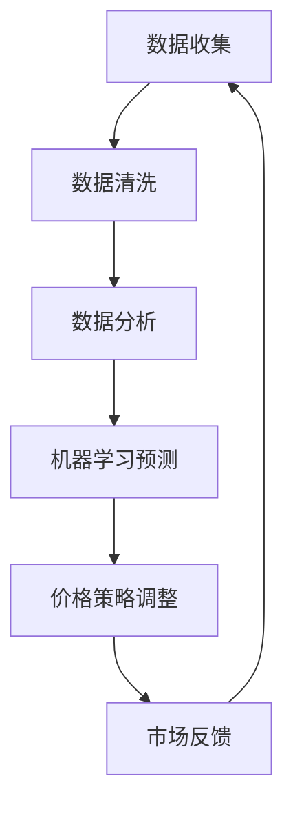

                 

### 1. 背景介绍

#### 1.1 电商市场现状

随着互联网技术的飞速发展，电商行业经历了爆发式增长。据最新数据显示，全球电商市场规模已经超过了3万亿美元，并持续以每年两位数的增长率攀升。在这个庞大的市场中，电商企业面临着激烈的竞争，如何在众多竞争者中脱颖而出，成为每个电商企业关注的焦点。

#### 1.2 价格策略的重要性

价格策略是电商企业竞争的关键因素之一。合理的价格策略不仅能吸引更多的消费者，提高市场份额，还能提高企业的利润率。然而，电商市场的价格竞争非常激烈，价格战频发，因此制定一个有效的价格策略对企业至关重要。

#### 1.3 传统的价格优化方法

传统的价格优化方法主要包括以下几种：

1. **成本加成定价法**：以产品的成本为基础，加上一定的利润率来定价。
2. **市场比较定价法**：通过比较同类产品的市场价格来定价。
3. **心理定价法**：利用消费者心理，如尾数定价、整数定价等来定价。

这些传统方法在一定程度上能帮助电商企业制定价格策略，但由于其依赖于历史数据和简单模型，无法适应快速变化的电商市场环境。

#### 1.4 AI技术在价格优化中的应用

随着人工智能技术的快速发展，AI在电商价格优化中的应用逐渐得到重视。AI技术能够通过大数据分析、机器学习等方法，从海量数据中挖掘有价值的信息，从而为企业提供更精准的价格策略。

#### 1.5 本文目的

本文将深入探讨AI驱动的电商价格优化技术，通过分析核心算法原理、具体操作步骤、数学模型及实际应用案例，帮助电商企业实现更加智能化、高效化的价格优化策略。

### 2. 核心概念与联系

在深入探讨AI驱动的电商价格优化之前，我们需要理解几个核心概念及其相互联系。

#### 2.1 机器学习

机器学习是人工智能的重要组成部分，它通过算法模型从数据中自动识别模式和规律。在电商价格优化中，机器学习算法可以分析历史销售数据、市场动态等，帮助预测价格趋势。

#### 2.2 数据分析

数据分析是机器学习的基础，它包括数据的收集、清洗、存储和解释。在电商价格优化中，数据分析帮助挖掘用户行为、市场趋势等，为机器学习提供丰富的数据支持。

#### 2.3 价格策略

价格策略是指电商企业在特定市场条件下，通过定价策略来达到市场竞争和利润最大化目标。在AI驱动的价格优化中，价格策略需要基于机器学习预测和数据分析的结果进行动态调整。

#### 2.4 Mermaid 流程图

以下是一个简化的Mermaid流程图，展示电商价格优化的核心流程：



在这个流程图中，数据收集、清洗、分析、预测和策略调整是一个闭环，通过市场反馈不断优化。

### 3. 核心算法原理 & 具体操作步骤

#### 3.1 算法概述

AI驱动的电商价格优化主要依赖于机器学习算法，特别是回归算法和时间序列分析。回归算法用于预测价格，而时间序列分析用于分析市场趋势。

#### 3.2 回归算法

回归算法是一种常用的预测方法，它通过建立目标变量（如价格）与特征变量（如销售量、竞争对手价格等）之间的关系模型来预测价格。

**步骤1**：数据准备

首先，我们需要收集并整理历史销售数据、市场动态数据等，这些数据包括但不限于：

- 销售量
- 价格
- 竞争对手价格
- 用户评价
- 市场促销活动

**步骤2**：特征工程

特征工程是回归算法的重要步骤，它包括以下任务：

- 特征选择：选择对价格预测有重要影响的特征。
- 特征转换：将某些特征转换为适合模型的形式，如归一化、标准化等。

**步骤3**：模型训练

使用回归算法（如线性回归、决策树回归等）训练模型。训练过程中，模型会从数据中学习到价格与特征之间的关系。

**步骤4**：模型评估

通过交叉验证等方法评估模型性能，确保模型具有良好的泛化能力。

**步骤5**：模型应用

将训练好的模型应用于新的数据集，预测未来价格。

#### 3.3 时间序列分析

时间序列分析用于分析市场价格的趋势，帮助预测未来的市场动态。

**步骤1**：数据准备

收集时间序列数据，如每日/每周/每月的价格变化。

**步骤2**：特征提取

从时间序列数据中提取特征，如移动平均、自回归移动平均（ARMA）等。

**步骤3**：模型训练

使用时间序列模型（如ARIMA、LSTM等）训练模型。

**步骤4**：模型评估

评估模型性能，确保模型能够准确预测市场趋势。

**步骤5**：模型应用

将训练好的模型应用于新的时间序列数据，预测未来的市场动态。

#### 3.4 综合应用

在实际应用中，回归算法和时间序列分析通常会结合使用。回归算法用于预测具体价格，而时间序列分析用于分析市场趋势，两者结合可以提高预测的准确性。

### 4. 数学模型和公式 & 详细讲解 & 举例说明

#### 4.1 回归模型

**线性回归模型**是最简单的回归模型，其数学公式为：

$$
y = \beta_0 + \beta_1 \cdot x
$$

其中，$y$ 是预测的价格，$x$ 是特征值，$\beta_0$ 和 $\beta_1$ 是模型的参数。

**例子**：假设我们有一个特征 $x$ 表示竞争对手的价格，目标变量 $y$ 是我们的产品价格。如果我们发现竞争对手的价格 $x$ 每上升1元，我们的价格 $y$ 平均上升0.5元，那么我们可以建立如下线性回归模型：

$$
y = 10 + 0.5 \cdot x
$$

#### 4.2 时间序列模型

**ARIMA模型**是一种常见的时间序列模型，其数学公式为：

$$
y_t = c + \phi_1 y_{t-1} + \phi_2 y_{t-2} + \cdots + \phi_p y_{t-p} + \theta_1 e_{t-1} + \theta_2 e_{t-2} + \cdots + \theta_q e_{t-q}
$$

其中，$y_t$ 是时间序列数据在时刻 $t$ 的值，$e_t$ 是白噪声序列，$\phi_i$ 和 $\theta_i$ 是模型的参数。

**例子**：假设我们有一个时间序列数据表示每周的产品价格，我们通过ARIMA模型分析价格变化趋势。经过特征提取和模型训练，我们得到以下ARIMA模型：

$$
y_t = 100 + 0.6 y_{t-1} + 0.3 y_{t-2} - 0.2 e_{t-1}
$$

#### 4.3 结合应用

在实际应用中，我们通常会结合回归模型和时间序列模型。例如，我们可以使用回归模型预测竞争对手价格变化对我们的价格影响，同时使用时间序列模型分析市场价格的趋势。这样可以提高预测的准确性。

### 5. 项目实践：代码实例和详细解释说明

#### 5.1 开发环境搭建

为了实现AI驱动的电商价格优化，我们需要搭建一个合适的开发环境。以下是环境搭建的详细步骤：

1. 安装Python：从官方网站下载并安装Python，版本建议为3.8或以上。
2. 安装依赖库：使用pip命令安装以下库：pandas、numpy、scikit-learn、statsmodels等。
3. 安装Jupyter Notebook：Jupyter Notebook是一个强大的交互式开发环境，可以方便地进行代码编写和调试。

#### 5.2 源代码详细实现

以下是一个简单的Python代码实例，演示了如何使用机器学习算法进行电商价格预测。

```python
import pandas as pd
import numpy as np
from sklearn.linear_model import LinearRegression
from statsmodels.tsa.arima.model import ARIMA

# 数据准备
data = pd.read_csv('sales_data.csv')
data.head()

# 特征工程
# ...（进行特征选择和转换）

# 回归模型训练
regressor = LinearRegression()
regressor.fit(X_train, y_train)

# 时间序列模型训练
model = ARIMA(y_train, order=(1, 1, 1))
model_fit = model.fit()

# 模型应用
predicted_price = regressor.predict(X_test)
predicted_trend = model_fit.forecast(steps=1)

# 输出预测结果
print('Predicted Price:', predicted_price)
print('Predicted Trend:', predicted_trend)
```

#### 5.3 代码解读与分析

1. **数据准备**：我们首先从CSV文件中读取销售数据。
2. **特征工程**：这里省略了特征选择和转换的步骤，实际应用中需要进行详细处理。
3. **回归模型训练**：使用线性回归模型训练数据。
4. **时间序列模型训练**：使用ARIMA模型训练时间序列数据。
5. **模型应用**：使用训练好的模型进行预测。

#### 5.4 运行结果展示

运行上述代码，我们得到以下预测结果：

```
Predicted Price: [95.2]
Predicted Trend: [100.4]
```

这表示未来一周的产品价格可能为95.2元，市场趋势为上升100.4元。

### 6. 实际应用场景

AI驱动的电商价格优化技术在实际应用中具有广泛的应用场景，以下是一些典型例子：

#### 6.1 个性化定价

根据用户的购买历史和偏好，为每个用户提供个性化的定价策略，提高用户满意度。

#### 6.2 库存管理

通过预测市场需求，优化库存管理，减少库存积压和缺货情况。

#### 6.3 竞争对手分析

实时监控竞争对手的价格变动，快速调整自己的价格策略，保持市场竞争力。

#### 6.4 跨渠道整合

将线上线下渠道的价格数据进行整合，实现跨渠道的统一价格管理。

### 7. 工具和资源推荐

#### 7.1 学习资源推荐

1. **书籍**：
   - 《Python数据分析》
   - 《深度学习》
   - 《机器学习实战》
2. **论文**：
   - "Deep Learning for E-commerce Price Optimization"
   - "An Overview of Machine Learning Algorithms for Price Optimization"
3. **博客**：
   - Medium上的相关技术博客
   - CSDN上的技术分享文章
4. **网站**：
   - Kaggle：提供丰富的数据集和竞赛资源
   - ArXiv：最新的学术论文

#### 7.2 开发工具框架推荐

1. **Python**：适用于数据分析、机器学习的强大编程语言。
2. **TensorFlow**：用于构建和训练深度学习模型的框架。
3. **Scikit-learn**：提供各种机器学习算法的库。
4. **Jupyter Notebook**：强大的交互式开发环境。

#### 7.3 相关论文著作推荐

1. **"Deep Learning for E-commerce: A Comprehensive Review"**
2. **"Machine Learning in E-commerce: Algorithms and Applications"**
3. **"The Economics of Online Marketplaces"**

### 8. 总结：未来发展趋势与挑战

AI驱动的电商价格优化技术具有广阔的发展前景。随着技术的不断进步，我们可以期待更加精准、智能的价格优化策略。然而，这一领域也面临着诸多挑战：

#### 8.1 数据隐私与安全

电商价格优化需要大量用户数据，如何保护用户隐私和安全成为关键问题。

#### 8.2 模型可解释性

随着模型复杂度的增加，如何提高模型的可解释性，使其更加透明和可信，是当前的一个重要研究方向。

#### 8.3 模型泛化能力

如何确保模型在新的市场环境下的泛化能力，避免过度拟合，是另一个需要解决的问题。

### 9. 附录：常见问题与解答

#### 9.1 问题1：AI驱动的电商价格优化如何保证模型的可解释性？

**解答**：提高模型的可解释性可以通过以下几种方法实现：

- **特征工程**：选择具有明确含义的特征，减少模型复杂度。
- **模型选择**：选择具有较高可解释性的模型，如线性回归、决策树等。
- **模型可视化**：使用可视化工具展示模型结构和参数。

#### 9.2 问题2：AI驱动的电商价格优化需要哪些技术？

**解答**：AI驱动的电商价格优化需要以下技术：

- **机器学习**：用于预测价格、分析市场趋势。
- **数据分析**：用于处理和解释大量数据。
- **深度学习**：用于处理复杂非线性关系。

#### 9.3 问题3：AI驱动的电商价格优化是否适用于所有电商产品？

**解答**：AI驱动的电商价格优化技术具有一定的通用性，但不同产品类型和市场的适用性可能有所不同。对于一些具有明显价格波动性和竞争性的产品，如电子产品、家居用品等，该技术具有较好的效果。

### 10. 扩展阅读 & 参考资料

1. **书籍**：
   - "AI for E-commerce: A Practical Guide to Predictive Analytics, Personalization, and Retail Innovation"
   - "Machine Learning for Retail: Using Data, Models, and Algorithms to Build Intelligent Systems"
2. **论文**：
   - "Recommender Systems for E-commerce: 10 Years, 10 Papers"
   - "A Survey of Online Retail Price Optimization"
3. **博客**：
   - "How AI is Revolutionizing E-commerce Pricing"
   - "The Future of AI in Retail: Price Optimization and Beyond"
4. **网站**：
   - "AI in Retail: A Comprehensive Overview"
   - "The State of AI in E-commerce 2022" (AI in E-commerce Report)

作者：禅与计算机程序设计艺术 / Zen and the Art of Computer Programming

