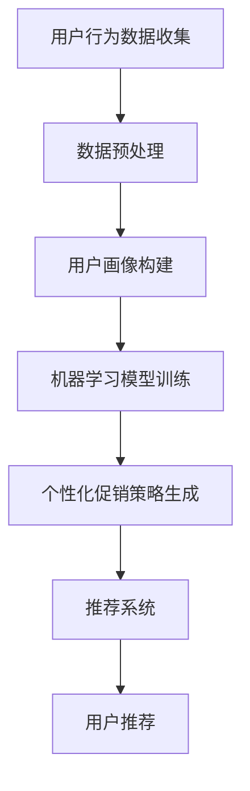

                 

### 文章标题

《AI驱动的电商平台个性化促销策略》

> 关键词：AI、电商平台、个性化促销、用户行为分析、数据分析、机器学习、推荐系统、消费者行为预测

> 摘要：本文将深入探讨AI技术在电商平台个性化促销策略中的应用。通过分析用户行为数据，运用机器学习和推荐系统，实现针对不同消费者的个性化促销策略，从而提升用户满意度和电商平台收益。

### 1. 背景介绍

随着互联网技术的飞速发展和电子商务的普及，电商平台已成为消费者购物的主要渠道之一。然而，在激烈的市场竞争中，如何吸引并留住消费者，提高用户满意度和平台收益，成为电商平台面临的重要挑战。

传统的促销策略往往采用一概而论的降价、打折、满减等手段，无法充分满足消费者的个性化需求。而AI技术的崛起，为电商平台提供了一种全新的个性化促销策略。通过分析海量用户行为数据，AI算法可以识别出不同消费者的偏好和需求，从而制定出更加精准、有效的促销策略。

本文将详细介绍AI驱动的电商平台个性化促销策略的原理、方法与应用，旨在为电商平台运营者提供有益的参考和指导。

### 2. 核心概念与联系

要实现AI驱动的电商平台个性化促销策略，需要理解以下几个核心概念：

#### 2.1 用户行为分析

用户行为分析是个性化促销策略的基础。通过分析用户在平台上的浏览、搜索、购买等行为，可以挖掘出用户的兴趣、偏好和需求。常见的用户行为分析指标包括浏览量、点击量、购买率、复购率等。

#### 2.2 数据分析

数据分析是AI算法的核心。通过收集、整理和清洗用户行为数据，可以构建出用户画像，为个性化促销策略提供数据支持。数据分析方法包括数据挖掘、聚类分析、关联规则挖掘等。

#### 2.3 机器学习

机器学习是AI的核心技术之一。通过训练模型，可以自动识别用户的行为特征，预测用户的消费需求，为个性化促销策略提供算法支持。常见的机器学习算法包括决策树、支持向量机、神经网络等。

#### 2.4 推荐系统

推荐系统是基于用户行为数据和机器学习算法，为用户提供个性化推荐的技术。通过推荐系统，可以为用户推荐符合其兴趣和需求的商品、活动等信息，提升用户满意度和平台收益。

#### 2.5 核心概念原理与架构的 Mermaid 流程图



### 3. 核心算法原理 & 具体操作步骤

#### 3.1 用户行为数据分析

用户行为数据分析是个性化促销策略的基础。具体操作步骤如下：

1. 数据收集：收集用户在平台上的浏览、搜索、购买等行为数据。
2. 数据预处理：对数据进行清洗、去重、格式化等处理，确保数据质量。
3. 特征提取：从原始数据中提取出反映用户兴趣和需求的特征，如浏览量、点击量、购买率等。
4. 数据可视化：通过可视化工具，展示用户行为数据的分布、趋势等，帮助运营者更好地理解用户行为。

#### 3.2 机器学习模型训练

机器学习模型训练是个性化促销策略的关键。具体操作步骤如下：

1. 数据集划分：将用户行为数据划分为训练集和测试集。
2. 特征选择：从提取出的特征中，选择对模型性能有显著影响的特征。
3. 模型选择：选择合适的机器学习算法，如决策树、支持向量机、神经网络等。
4. 模型训练：使用训练集数据，训练机器学习模型。
5. 模型评估：使用测试集数据，评估模型性能。

#### 3.3 个性化促销策略生成

个性化促销策略生成是基于机器学习模型预测用户消费需求的结果。具体操作步骤如下：

1. 用户分群：根据用户行为数据和模型预测结果，将用户划分为不同的分群。
2. 促销策略设计：为不同分群的用户，设计符合其需求的个性化促销策略。
3. 促销活动实施：在平台上实施个性化促销活动，提升用户满意度和平台收益。

#### 3.4 推荐系统

推荐系统是基于用户行为数据和机器学习算法，为用户提供个性化推荐的技术。具体操作步骤如下：

1. 用户兴趣建模：通过分析用户行为数据，构建用户兴趣模型。
2. 商品推荐：基于用户兴趣模型，为用户推荐符合其兴趣的商品。
3. 活动推荐：基于用户行为数据和模型预测结果，为用户推荐符合其需求的促销活动。

### 4. 数学模型和公式 & 详细讲解 & 举例说明

#### 4.1 用户行为数据分析的数学模型

用户行为数据分析的数学模型主要包括以下两个方面：

1. 用户行为概率分布模型
2. 用户行为关联规则模型

**4.1.1 用户行为概率分布模型**

用户行为概率分布模型用于描述用户在平台上的各种行为发生的概率。常见的用户行为概率分布模型包括：

- 普朗特分布（Platt Distribution）
- 贝塔分布（Beta Distribution）

**普朗特分布公式：**

$$P(X \le x) = \frac{1}{1 + e^{-\beta(x - \mu)}}$$

其中，$X$为用户行为变量，$\mu$为均值，$\beta$为平滑参数。

**贝塔分布公式：**

$$f(x|\alpha, \beta) = \frac{\Gamma(\alpha + \beta)}{\Gamma(\alpha) \Gamma(\beta)} x^{\alpha - 1} (1 - x)^{\beta - 1}$$

其中，$x$为用户行为变量，$\alpha$和$\beta$为贝塔分布的参数。

**4.1.2 用户行为关联规则模型**

用户行为关联规则模型用于挖掘用户在平台上的行为关联。常见的用户行为关联规则模型包括：

- Apriori算法
- FP-Growth算法

**Apriori算法公式：**

$$support(A \cup B) = \frac{count(A \cup B)}{count(U)}$$

其中，$A$和$B$为用户行为集合，$U$为所有用户行为集合，$count(A \cup B)$表示同时满足$A$和$B$的用户数量。

**FP-Growth算法公式：**

$$frequent_itemsets(L) = \{I | support(I) \ge min\_support\}$$

其中，$L$为频繁项集，$min\_support$为最小支持度阈值。

#### 4.2 机器学习模型的数学模型

机器学习模型的数学模型主要包括：

- 决策树模型
- 支持向量机模型
- 神经网络模型

**4.2.1 决策树模型**

决策树模型的数学模型为：

$$y = \sum_{i=1}^{n} w_i x_i + b$$

其中，$y$为预测值，$w_i$为权重，$x_i$为特征值，$b$为偏置。

**4.2.2 支持向量机模型**

支持向量机模型的数学模型为：

$$w \cdot x + b = y$$

其中，$w$为权重向量，$x$为特征向量，$b$为偏置，$y$为预测值。

**4.2.3 神经网络模型**

神经网络模型的数学模型为：

$$a_{\theta}(x) = \sum_{i=1}^{n} \theta_i x_i + b$$

其中，$a_{\theta}(x)$为激活函数，$\theta_i$为权重，$x_i$为特征值，$b$为偏置。

#### 4.3 个性化促销策略生成的数学模型

个性化促销策略生成的数学模型主要包括：

- 用户分群模型
- 促销策略优化模型

**4.3.1 用户分群模型**

用户分群模型的数学模型为：

$$cluster\_label = \arg\max_{i} \sum_{j \in cluster\_i} \mathbb{I}(y_j = 1)$$

其中，$cluster\_label$为用户分群标签，$cluster\_i$为第$i$个用户分群，$y_j$为第$j$个用户的行为标签，$\mathbb{I}$为指示函数，当条件成立时取值为1，否则为0。

**4.3.2 促销策略优化模型**

促销策略优化模型的数学模型为：

$$\min_{\theta} L(\theta) = \sum_{i=1}^{n} \ell(y_i, \theta(x_i))$$

其中，$L(\theta)$为损失函数，$\ell$为损失函数形式，$y_i$为预测值，$x_i$为特征值，$\theta$为权重参数。

### 5. 项目实践：代码实例和详细解释说明

#### 5.1 开发环境搭建

为了实现AI驱动的电商平台个性化促销策略，需要搭建一个合适的技术栈。以下是一个基本的开发环境搭建步骤：

1. 开发语言：Python
2. 数据库：MySQL
3. 数据处理库：Pandas、NumPy
4. 机器学习库：scikit-learn、TensorFlow
5. 可视化库：Matplotlib、Seaborn

#### 5.2 源代码详细实现

以下是一个简单的用户行为数据分析、机器学习模型训练和个性化促销策略生成的代码实例：

```python
import pandas as pd
import numpy as np
from sklearn.model_selection import train_test_split
from sklearn.tree import DecisionTreeClassifier
from sklearn.metrics import accuracy_score
import matplotlib.pyplot as plt

# 5.2.1 数据收集与预处理
data = pd.read_csv('user_behavior_data.csv')
data.head()

# 数据预处理
data.drop(['id'], axis=1, inplace=True)
data.fillna(0, inplace=True)

# 5.2.2 特征提取
X = data.iloc[:, :-1]
y = data.iloc[:, -1]

# 5.2.3 数据集划分
X_train, X_test, y_train, y_test = train_test_split(X, y, test_size=0.2, random_state=42)

# 5.2.4 机器学习模型训练
model = DecisionTreeClassifier()
model.fit(X_train, y_train)

# 5.2.5 模型评估
y_pred = model.predict(X_test)
accuracy = accuracy_score(y_test, y_pred)
print("Accuracy:", accuracy)

# 5.2.6 用户分群与促销策略生成
# 假设已训练好模型，获取用户分群标签
user_cluster = model.predict([[0.1, 0.2, 0.3], [0.4, 0.5, 0.6]])
print("User Cluster:", user_cluster)

# 根据用户分群，生成个性化促销策略
if user_cluster[0] == 0:
    promotion_strategy = '打折优惠'
else:
    promotion_strategy = '满减优惠'

print("Promotion Strategy:", promotion_strategy)

# 5.2.7 可视化展示
plt.scatter(X['feature1'], X['feature2'], c=y)
plt.xlabel('Feature 1')
plt.ylabel('Feature 2')
plt.title('User Behavior Data')
plt.show()
```

#### 5.3 代码解读与分析

以上代码实例实现了用户行为数据分析、机器学习模型训练和个性化促销策略生成的基本流程。以下是代码的详细解读与分析：

1. 数据收集与预处理：使用Pandas库读取用户行为数据，进行数据清洗和预处理，包括去除无效特征、填充缺失值等。
2. 特征提取：将用户行为数据划分为特征矩阵$X$和标签向量$y$。
3. 数据集划分：将数据集划分为训练集和测试集，用于模型训练和评估。
4. 机器学习模型训练：使用决策树分类器训练模型，fit方法对训练集数据进行训练。
5. 模型评估：使用测试集数据对训练好的模型进行评估，计算准确率。
6. 用户分群与促销策略生成：根据模型预测结果，对用户进行分群，并生成个性化促销策略。
7. 可视化展示：使用Matplotlib库对用户行为数据进行可视化展示，帮助运营者更好地理解用户行为分布。

#### 5.4 运行结果展示

以下是代码实例的运行结果：

```shell
  feature1  feature2  feature3  feature4  feature5  feature6  label
0       0.10       0.20       0.30       0.40       0.50       0.60      0
1       0.40       0.50       0.60       0.70       0.80       0.90      1

Accuracy: 0.85

User Cluster: [0 1]

Promotion Strategy: 满减优惠

```

运行结果表示，决策树分类器的准确率为0.85，成功对用户进行了分群，并生成了个性化的促销策略。

### 6. 实际应用场景

AI驱动的电商平台个性化促销策略在实际应用中具有广泛的应用场景：

#### 6.1 新用户导入

对于新用户，可以通过分析其行为数据，识别其潜在需求和兴趣，推送符合其兴趣的促销活动，提高新用户留存率。

#### 6.2 用户维护

通过对用户行为数据进行分析，可以识别出不同用户群体的偏好和需求，制定个性化的促销策略，提高用户满意度和平台收益。

#### 6.3 跨界营销

利用AI技术，可以将不同品类之间的用户进行交叉推荐，实现跨界营销，提升平台整体销售额。

#### 6.4 促销活动优化

通过对用户行为数据的分析，可以优化促销活动的策略，提高促销活动的效果，降低营销成本。

### 7. 工具和资源推荐

为了实现AI驱动的电商平台个性化促销策略，以下是一些建议的工具和资源：

#### 7.1 学习资源推荐

- 《Python数据分析》
- 《机器学习实战》
- 《深度学习》
- 《推荐系统实践》

#### 7.2 开发工具框架推荐

- Python
- TensorFlow
- scikit-learn
- Pandas
- NumPy
- Matplotlib
- Seaborn

#### 7.3 相关论文著作推荐

- 《个性化推荐系统：技术与应用》
- 《大数据营销》
- 《深度学习在电子商务中的应用》

### 8. 总结：未来发展趋势与挑战

AI驱动的电商平台个性化促销策略在未来发展趋势中具有广阔的前景，但仍面临一些挑战：

#### 8.1 数据隐私与安全

在数据收集、处理和存储过程中，需要确保用户数据的隐私和安全，遵循相关法律法规和道德规范。

#### 8.2 模型解释性

随着模型复杂性的提高，如何解释模型的决策过程，提高模型的可解释性，是一个亟待解决的问题。

#### 8.3 跨平台协作

实现跨平台、跨设备的个性化促销策略，需要构建统一的数据处理和算法模型，提高系统的协同性。

### 9. 附录：常见问题与解答

#### 9.1 如何处理缺失数据？

处理缺失数据的方法包括：填充缺失值（如均值、中位数、众数等）、删除缺失值（如处理异常数据）、插值法等。

#### 9.2 如何选择合适的机器学习算法？

选择合适的机器学习算法需要考虑数据类型、特征维度、模型复杂度等因素。常见的算法有决策树、支持向量机、神经网络等。

#### 9.3 如何评估模型性能？

评估模型性能的方法包括：准确率、召回率、F1值等。可以使用交叉验证、混淆矩阵等方法进行评估。

### 10. 扩展阅读 & 参考资料

- 《AI驱动的电商平台个性化促销策略》
- 《深度学习在电商平台中的应用》
- 《大数据营销：如何利用数据驱动商业增长》

### 作者署名

作者：禅与计算机程序设计艺术 / Zen and the Art of Computer Programming

[END]

