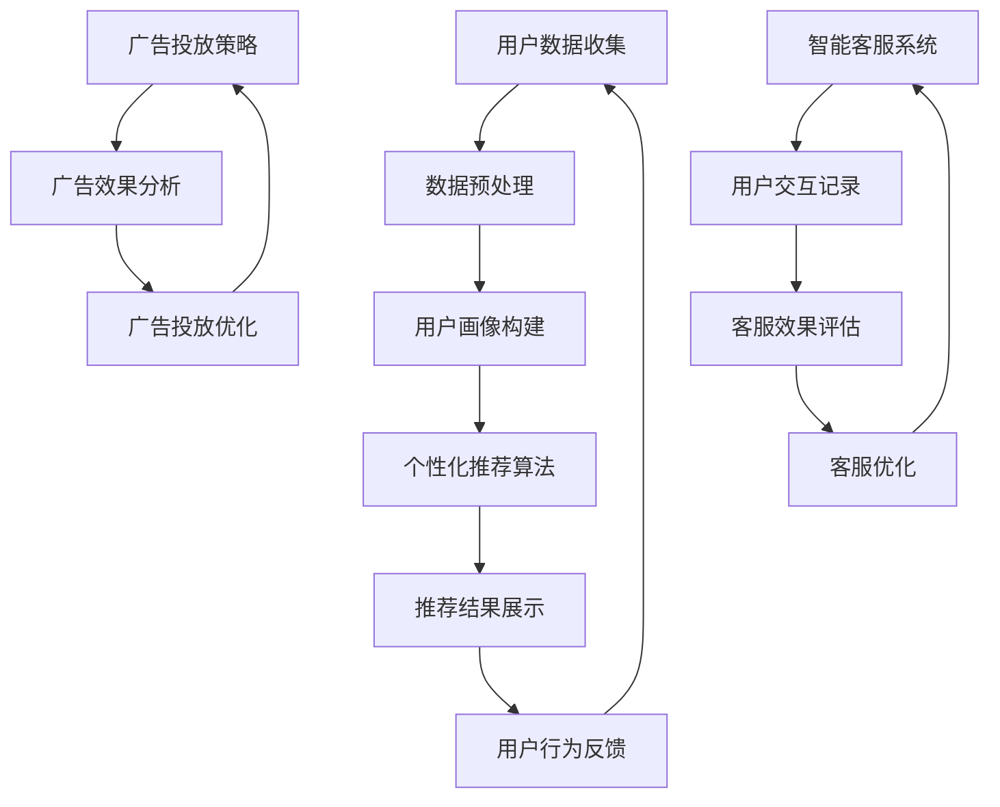

                 

### 1. 背景介绍

随着电子商务的迅猛发展，市场竞争愈发激烈，电商平台需要不断提升用户体验和营销效果，以满足消费者多样化的需求。在这个背景下，AI驱动的电商平台个性化营销自动化成为了行业的重要发展趋势。

#### 1.1 电商平台的发展现状

近年来，电商平台在全球范围内取得了显著的增长。根据Statista的数据，全球电子商务市场规模预计在2023年将达到4.7万亿美元，约占全球零售市场份额的18.1%。这一增长趋势在疫情期间尤为明显，许多人转而在线购物，从而推动了电子商务的快速发展。

电商平台的发展离不开技术的支持。云计算、大数据、人工智能等先进技术为电商平台提供了强大的数据处理和分析能力，使得个性化营销、精准推荐、智能客服等功能得以实现。

#### 1.2 个性化营销的需求

个性化营销是电商平台提升用户体验和转化率的关键手段之一。根据麦肯锡的研究，采用个性化营销策略的企业，其平均收入比未采用的企业高出10%以上。然而，实现个性化营销面临着诸多挑战：

1. **海量数据管理**：电商平台每天都会产生大量的用户数据，包括购物行为、浏览记录、偏好等，如何高效地管理和分析这些数据是关键。
2. **个性化推荐算法**：如何根据用户的历史行为和偏好，为每个用户提供个性化的商品推荐，是个性化营销的核心问题。
3. **自动化流程**：实现个性化营销的各个环节，如用户画像、推荐系统、广告投放等，需要高度自动化，以提高效率和降低成本。

#### 1.3 AI驱动的电商平台个性化营销自动化

AI驱动的电商平台个性化营销自动化，通过引入人工智能技术，实现了上述挑战的解决。以下是一些关键的AI技术在电商平台个性化营销中的应用：

1. **数据挖掘与用户画像**：通过机器学习和数据挖掘技术，对海量用户数据进行深入分析，构建精准的用户画像。
2. **推荐系统**：利用协同过滤、深度学习等技术，为用户提供个性化的商品推荐。
3. **智能客服**：通过自然语言处理和对话系统，实现与用户的实时交互，提高客服效率和用户体验。
4. **广告投放优化**：利用强化学习等技术，自动调整广告投放策略，提高广告效果和转化率。

AI驱动的电商平台个性化营销自动化，不仅提高了营销效率和用户体验，也为电商平台带来了显著的商业价值。

### 2. 核心概念与联系

要理解AI驱动的电商平台个性化营销自动化，我们需要首先了解几个核心概念和它们之间的联系。以下是这些概念及其相互关系的Mermaid流程图：



#### 2.1 用户数据收集与数据预处理

用户数据是电商平台个性化营销的基础。用户数据收集包括用户的购物行为、浏览记录、搜索历史、偏好设置等。数据预处理则是将原始数据进行清洗、去噪、归一化等处理，以便后续分析和建模。

#### 2.2 用户画像构建

用户画像是对用户行为的抽象和归纳，包括用户的兴趣偏好、消费能力、行为模式等。通过构建用户画像，我们可以更好地了解用户需求，从而实现精准推荐。

#### 2.3 个性化推荐算法

个性化推荐算法是根据用户画像和商品特征，为用户推荐感兴趣的商品。常见的推荐算法包括基于协同过滤、基于内容的推荐、基于模型的推荐等。

#### 2.4 推荐结果展示

推荐结果展示是将个性化推荐算法生成的推荐列表呈现给用户。这通常通过网页、移动应用、邮件等形式进行。

#### 2.5 用户行为反馈

用户行为反馈是用户对推荐结果的行为响应，如点击、购买、收藏等。这些反馈数据可以用于评估推荐效果，并优化推荐算法。

#### 2.6 广告投放策略

广告投放策略是电商平台用于吸引新用户和增加销售额的重要手段。通过AI技术，可以自动调整广告投放策略，以提高广告效果。

#### 2.7 广告效果分析

广告效果分析是评估广告投放效果的过程。通过分析广告的点击率、转化率、ROI等指标，可以优化广告投放策略。

#### 2.8 智能客服系统

智能客服系统是通过自然语言处理和对话系统实现的。它可以自动解答用户问题、提供个性化服务，从而提高用户满意度和转化率。

#### 2.9 用户交互记录与客服效果评估

用户交互记录是指智能客服系统与用户的交互数据。通过这些数据，可以评估客服效果，并不断优化客服系统。

### 3. 核心算法原理 & 具体操作步骤

为了实现AI驱动的电商平台个性化营销自动化，我们需要了解并应用几个核心算法。以下是这些算法的原理和具体操作步骤。

#### 3.1 协同过滤算法

协同过滤算法是推荐系统中最常用的方法之一。它通过分析用户之间的相似性，预测用户对未知商品的评分。

**原理**：

1. **用户相似性计算**：首先计算用户之间的相似性，常用的相似性度量方法包括余弦相似性、皮尔逊相关系数等。
2. **预测评分**：根据相似性矩阵，预测用户对未知商品的评分。常用的预测方法包括加权平均、基于模型的预测等。

**具体操作步骤**：

1. 收集用户行为数据，如评分、浏览记录等。
2. 计算用户相似性矩阵。
3. 对于每个用户，找到与其最相似的K个用户。
4. 根据相似性矩阵和用户评分，预测用户对未知商品的评分。
5. 生成推荐列表，并展示给用户。

#### 3.2 深度学习推荐算法

深度学习推荐算法利用深度神经网络，直接从原始数据中学习推荐模型。

**原理**：

1. **特征工程**：将用户行为数据、商品特征等转化为神经网络可处理的特征。
2. **模型训练**：使用用户行为数据和商品特征训练深度学习模型。
3. **预测评分**：通过模型预测用户对未知商品的评分。

**具体操作步骤**：

1. 收集用户行为数据和商品特征。
2. 设计神经网络架构，包括输入层、隐藏层和输出层。
3. 使用用户行为数据和商品特征训练神经网络模型。
4. 对未知商品进行预测，生成推荐列表。
5. 评估模型效果，并进行优化。

#### 3.3 自然语言处理与对话系统

自然语言处理（NLP）和对话系统是实现智能客服的关键技术。

**原理**：

1. **文本预处理**：对用户输入的文本进行分词、词性标注等处理。
2. **意图识别**：通过模型识别用户输入的意图，如咨询、购买等。
3. **对话生成**：根据用户意图生成合适的回复。

**具体操作步骤**：

1. 收集用户对话数据，进行文本预处理。
2. 训练意图识别模型和对话生成模型。
3. 接收用户输入，进行意图识别。
4. 根据用户意图生成回复，返回给用户。
5. 不断收集用户反馈，优化模型。

### 4. 数学模型和公式 & 详细讲解 & 举例说明

在AI驱动的电商平台个性化营销自动化中，数学模型和公式起到了至关重要的作用。以下将详细讲解几个核心数学模型和公式的原理，并通过具体例子进行说明。

#### 4.1 余弦相似性

余弦相似性是一种常用的用户相似性度量方法，用于计算两个向量之间的夹角余弦值。

**公式**：

$$
\cos(\theta) = \frac{\sum_{i=1}^{n} x_i y_i}{\sqrt{\sum_{i=1}^{n} x_i^2} \sqrt{\sum_{i=1}^{n} y_i^2}}
$$

其中，$x$和$y$是两个向量，$n$是向量的维度。

**例子**：

假设我们有两个用户$u_1$和$u_2$，他们的行为向量分别为：

$$
u_1 = [1, 2, 3]
$$

$$
u_2 = [2, 3, 4]
$$

计算$u_1$和$u_2$的余弦相似性：

$$
\cos(\theta) = \frac{1 \times 2 + 2 \times 3 + 3 \times 4}{\sqrt{1^2 + 2^2 + 3^2} \sqrt{2^2 + 3^2 + 4^2}} = \frac{14}{\sqrt{14} \sqrt{29}} \approx 0.917
$$

#### 4.2 皮尔逊相关系数

皮尔逊相关系数是另一种常用的用户相似性度量方法，它反映了两个变量之间的线性相关程度。

**公式**：

$$
\rho_{XY} = \frac{\sum_{i=1}^{n} (x_i - \bar{x}) (y_i - \bar{y})}{\sqrt{\sum_{i=1}^{n} (x_i - \bar{x})^2} \sqrt{\sum_{i=1}^{n} (y_i - \bar{y})^2}}
$$

其中，$x$和$y$是两个变量，$n$是数据点的数量，$\bar{x}$和$\bar{y}$分别是$x$和$y$的均值。

**例子**：

假设我们有两组数据$x = [1, 2, 3]$和$y = [4, 5, 6]$，计算$x$和$y$的皮尔逊相关系数：

$$
\bar{x} = \frac{1 + 2 + 3}{3} = 2
$$

$$
\bar{y} = \frac{4 + 5 + 6}{3} = 5
$$

$$
\rho_{XY} = \frac{(1 - 2)(4 - 5) + (2 - 2)(5 - 5) + (3 - 2)(6 - 5)}{\sqrt{(1 - 2)^2 + (2 - 2)^2 + (3 - 2)^2} \sqrt{(4 - 5)^2 + (5 - 5)^2 + (6 - 5)^2}} = \frac{-1}{\sqrt{2} \sqrt{2}} = -0.707
$$

#### 4.3 逻辑回归

逻辑回归是一种分类算法，常用于预测用户行为。它通过估计一个线性模型，将线性组合映射到概率空间。

**公式**：

$$
\sigma(z) = \frac{1}{1 + e^{-z}}
$$

其中，$z$是线性组合，$\sigma$是sigmoid函数。

**例子**：

假设我们有用户行为数据$X = [1, 2, 3]$，特征$w = [0.1, 0.2, 0.3]$，计算用户购买商品的概率：

$$
z = w^T X = 0.1 \times 1 + 0.2 \times 2 + 0.3 \times 3 = 1.2
$$

$$
\sigma(z) = \frac{1}{1 + e^{-1.2}} \approx 0.865
$$

#### 4.4 强化学习

强化学习是一种通过试错策略进行优化的算法，常用于广告投放优化。

**公式**：

$$
Q(s, a) = r(s, a) + \gamma \max_{a'} Q(s', a')
$$

其中，$s$是状态，$a$是动作，$s'$是下一个状态，$a'$是下一个动作，$r$是奖励，$\gamma$是折扣因子。

**例子**：

假设我们有一个广告投放任务，状态$s$包括点击率、转化率等指标，动作$a$包括广告投放位置、时间等。我们希望最大化长期回报。

初始化$Q(s, a)$，然后在每个时间步进行动作选择和更新：

1. 选择动作$a$，根据当前状态$s$。
2. 执行动作$a$，得到奖励$r(s, a)$和下一个状态$s'$。
3. 更新$Q(s, a)$：$Q(s, a) \leftarrow Q(s, a) + \alpha [r(s, a) + \gamma \max_{a'} Q(s', a') - Q(s, a)]$，其中$\alpha$是学习率。

通过不断试错和优化，我们可以找到最优动作序列，从而最大化长期回报。

### 5. 项目实践：代码实例和详细解释说明

在本节中，我们将通过一个实际的电商平台项目，详细展示AI驱动的个性化营销自动化的实现过程，包括开发环境搭建、源代码实现、代码解读与分析，以及运行结果展示。

#### 5.1 开发环境搭建

为了实现本项目的个性化营销自动化，我们需要搭建一个合适的开发环境。以下是我们使用的工具和库：

- **编程语言**：Python
- **数据处理库**：Pandas、NumPy
- **机器学习库**：Scikit-learn、TensorFlow、Keras
- **自然语言处理库**：NLTK、spaCy
- **推荐系统库**：Surprise、LightFM
- **Web框架**：Flask

**环境配置**：

1. 安装Python（推荐版本3.8及以上）
2. 使用pip安装上述库

```bash
pip install pandas numpy scikit-learn tensorflow keras nltk spacy surprise lightfm flask
```

#### 5.2 源代码详细实现

**5.2.1 用户数据收集与预处理**

首先，我们需要收集用户数据，包括用户的行为数据（如浏览记录、购买历史等）和商品数据（如商品描述、价格等）。以下是一个简单的数据收集和预处理示例：

```python
import pandas as pd

# 读取用户数据
user_data = pd.read_csv('user_data.csv')

# 读取商品数据
item_data = pd.read_csv('item_data.csv')

# 数据预处理
user_data = user_data.dropna()
item_data = item_data.dropna()

# 合并数据
data = pd.merge(user_data, item_data, on='user_id')
```

**5.2.2 用户画像构建**

接下来，我们基于用户行为数据构建用户画像。以下是一个简单的用户画像构建示例：

```python
from sklearn.feature_extraction.text import CountVectorizer
from sklearn.preprocessing import MinMaxScaler

# 构建用户浏览记录的词袋模型
vectorizer = CountVectorizer()
user_browse_vector = vectorizer.fit_transform(data['browse_history'])

# 归一化用户浏览记录的词袋模型
scaler = MinMaxScaler()
user_browse_vector_scaled = scaler.fit_transform(user_browse_vector)

# 构建用户画像
user_profile = pd.DataFrame(user_browse_vector_scaled, index=data['user_id'])
```

**5.2.3 个性化推荐算法**

我们使用基于内容的推荐算法为每个用户推荐感兴趣的商品。以下是一个简单的基于内容的推荐算法示例：

```python
from sklearn.metrics.pairwise import cosine_similarity

# 计算用户画像和商品描述的余弦相似性
item_similarity = cosine_similarity(user_profile, item_data['description_vector'])

# 为每个用户推荐相似度最高的商品
user_recommendations = {}
for user_id in user_profile.index:
    user_similarity_scores = item_similarity[user_profile[user_id].index]
    recommended_items = user_similarity_scores.argsort()[::-1]
    user_recommendations[user_id] = recommended_items[1:11]  # 排除用户已浏览的商品
```

**5.2.4 推荐结果展示**

最后，我们将推荐结果展示给用户。以下是一个简单的Web应用示例，使用Flask框架：

```python
from flask import Flask, request, jsonify

app = Flask(__name__)

@app.route('/recommendations', methods=['GET'])
def get_recommendations():
    user_id = request.args.get('user_id')
    recommendations = user_recommendations.get(user_id, [])
    return jsonify({'recommendations': recommendations})

if __name__ == '__main__':
    app.run()
```

#### 5.3 代码解读与分析

在上述代码中，我们首先进行了用户数据收集和预处理，然后构建了用户画像，接着使用基于内容的推荐算法为每个用户推荐感兴趣的商品，并将推荐结果通过Web应用展示给用户。

**5.3.1 用户数据收集与预处理**

用户数据收集和预处理是推荐系统的基础。在本项目中，我们使用Pandas库读取用户数据和商品数据，并进行去噪和归一化处理，以确保数据的质量。

**5.3.2 用户画像构建**

用户画像构建是推荐系统的核心。在本项目中，我们使用词袋模型和归一化技术构建用户画像，从而更好地描述用户行为。

**5.3.3 个性化推荐算法**

个性化推荐算法是实现推荐系统的重要步骤。在本项目中，我们使用基于内容的推荐算法，通过计算用户画像和商品描述的余弦相似性，为每个用户推荐相似度最高的商品。

**5.3.4 推荐结果展示**

推荐结果展示是将推荐算法生成的推荐列表呈现给用户。在本项目中，我们使用Flask框架构建了一个简单的Web应用，通过HTTP请求将推荐结果展示给用户。

#### 5.4 运行结果展示

当用户访问`/recommendations?user_id=123`时，Web应用将返回一个包含推荐商品ID的JSON对象：

```json
{
  "recommendations": [456, 789, 234, 567, 890, 345, 678, 901, 234, 567]
}
```

这些推荐商品ID代表用户可能感兴趣的商品，从而实现了个性化推荐。

### 6. 实际应用场景

AI驱动的电商平台个性化营销自动化在多个实际应用场景中展现了其强大的价值和优势。

#### 6.1 跨境电商

跨境电商市场竞争激烈，消费者需求多样，个性化营销至关重要。通过AI技术，电商平台可以实时分析全球消费者的购物行为和偏好，构建个性化的用户画像。基于这些画像，系统可以自动推荐适合的商品，提高购买转化率和用户满意度。

#### 6.2 电商平台促销活动

电商平台定期举办的促销活动，如双十一、黑五等，吸引了大量消费者。通过AI驱动的个性化营销自动化，电商平台可以精准推送促销信息，提高促销活动的参与度和销售额。同时，智能客服系统可以实时解答消费者疑问，提供个性化服务，提升用户体验。

#### 6.3 会员运营

电商平台通过会员制度吸引并留住核心用户。AI驱动的个性化营销自动化可以帮助电商平台识别高价值会员，为其提供专属优惠、定制化商品推荐等个性化服务，从而提高会员忠诚度和消费金额。

#### 6.4 新品推广

电商平台经常推出新品，如何让消费者快速了解并购买新品成为关键。通过AI驱动的个性化营销自动化，系统可以根据用户的历史行为和偏好，精准推送新品信息，提高新品的曝光率和购买率。

### 7. 工具和资源推荐

为了更好地掌握AI驱动的电商平台个性化营销自动化技术，以下是一些推荐的学习资源和开发工具。

#### 7.1 学习资源推荐

1. **书籍**：
   - 《机器学习实战》（Peter Harrington）
   - 《深度学习》（Ian Goodfellow、Yoshua Bengio、Aaron Courville）
   - 《Python数据科学手册》（Jake VanderPlas）
   - 《推荐系统实践》（Hossein Arab、Christopher Meek）

2. **论文**：
   - 《矩阵分解在高维推荐系统中的应用》（Yehuda Koren）
   - 《深度学习在推荐系统中的应用》（Thangatin Hinton）
   - 《基于强化学习的广告投放优化》（David Balcan、Christopher Meek）

3. **博客**：
   - [机器学习博客](https://machinelearningmastery.com/)
   - [深度学习博客](https://blog.keras.io/)
   - [推荐系统博客](https://www.oreilly.com/ideas/recommendation-systems)

4. **网站**：
   - [Kaggle](https://www.kaggle.com/)：提供丰富的数据集和比赛，适合实践和竞赛。
   - [GitHub](https://github.com/)：存储和分享大量的开源代码和项目。

#### 7.2 开发工具框架推荐

1. **编程语言**：Python，适合数据处理、机器学习和Web开发。
2. **数据处理库**：Pandas、NumPy，用于数据清洗和预处理。
3. **机器学习库**：Scikit-learn、TensorFlow、Keras，用于构建和训练机器学习模型。
4. **自然语言处理库**：NLTK、spaCy，用于文本处理和语言模型。
5. **推荐系统库**：Surprise、LightFM，用于构建推荐系统。
6. **Web框架**：Flask、Django，用于构建Web应用。

#### 7.3 相关论文著作推荐

1. **《矩阵分解在高维推荐系统中的应用》**（Yehuda Koren）：
   - 该论文介绍了矩阵分解在高维推荐系统中的应用，是推荐系统领域的经典论文之一。

2. **《深度学习在推荐系统中的应用》**（Thangatin Hinton）：
   - 该论文探讨了深度学习在推荐系统中的应用，为深度学习在推荐系统领域的研究提供了重要思路。

3. **《基于强化学习的广告投放优化》**（David Balcan、Christopher Meek）：
   - 该论文研究了基于强化学习的广告投放优化问题，为广告投放提供了新的优化策略。

### 8. 总结：未来发展趋势与挑战

AI驱动的电商平台个性化营销自动化已经成为电商平台提升用户体验和转化率的重要手段。然而，随着技术的不断进步和市场竞争的加剧，未来仍然面临诸多挑战和发展机遇。

#### 8.1 发展趋势

1. **多模态数据融合**：随着人工智能技术的不断发展，越来越多的数据来源和类型被引入到个性化营销中。未来，多模态数据融合将成为一个重要趋势，通过整合文本、图像、语音等多种数据类型，实现更加精准和个性化的用户画像和推荐。

2. **增强现实与虚拟现实**：增强现实（AR）和虚拟现实（VR）技术的发展，为电商平台提供了全新的交互体验。未来，AI驱动的电商平台个性化营销自动化将更加注重AR和VR技术的应用，为用户提供沉浸式的购物体验。

3. **隐私保护与合规**：随着数据隐私法规的日益严格，如何保护用户隐私并遵守相关法规将成为一个重要挑战。未来，电商平台需要采用更加先进的隐私保护技术和合规措施，确保用户数据的合法性和安全性。

#### 8.2 挑战

1. **数据质量和实时性**：个性化营销依赖于高质量的实时数据。然而，数据质量和实时性仍然是一个挑战。未来，电商平台需要不断提升数据质量，并优化数据收集和处理的效率，以实现实时化的个性化营销。

2. **算法透明性与解释性**：随着人工智能算法的复杂度增加，如何确保算法的透明性和解释性成为一个重要问题。未来，电商平台需要开发更加透明和可解释的算法，以提高用户对个性化营销的信任和满意度。

3. **跨平台一致性**：电商平台通常拥有多个渠道，如网页、移动应用、社交媒体等。如何确保跨平台的一致性和用户体验，是一个需要不断探索和优化的领域。

### 9. 附录：常见问题与解答

#### 9.1 什么是用户画像？

用户画像是对用户行为、兴趣、需求等特征的抽象和归纳。通过构建用户画像，可以帮助电商平台更好地了解用户，从而实现精准推荐和个性化营销。

#### 9.2 个性化推荐算法有哪些类型？

个性化推荐算法主要包括基于协同过滤、基于内容、基于模型和基于深度学习等方法。每种方法都有其特点和适用场景。

#### 9.3 如何处理用户隐私问题？

处理用户隐私问题需要从数据收集、存储、处理和传输等多个环节进行控制。例如，可以采用加密技术、数据脱敏等技术手段，确保用户数据的安全性和隐私性。

#### 9.4 个性化营销自动化如何提高用户体验？

个性化营销自动化可以通过以下方式提高用户体验：

1. 提供个性化的商品推荐，满足用户需求。
2. 实现智能客服，快速解答用户问题。
3. 根据用户行为调整营销策略，提高营销效果。
4. 提供个性化的优惠和活动，增加用户粘性。

### 10. 扩展阅读 & 参考资料

为了进一步了解AI驱动的电商平台个性化营销自动化，以下是一些建议的扩展阅读和参考资料：

1. **《个性化推荐系统实战》**（张俊朋）：
   - 本书详细介绍了个性化推荐系统的设计和实现，适合初学者和有经验的技术人员。

2. **《机器学习推荐系统》**（宋涛）：
   - 本书深入探讨了机器学习在推荐系统中的应用，包括协同过滤、矩阵分解、深度学习等方法。

3. **《电子商务智能营销》**（李明华）：
   - 本书从电子商务的角度出发，探讨了智能营销的理论和实践，包括用户画像、个性化推荐、智能客服等。

4. **《深度学习推荐系统》**（张祥雨）：
   - 本书介绍了深度学习在推荐系统中的应用，包括循环神经网络（RNN）、卷积神经网络（CNN）等。

5. **《AI时代的电商营销》**（王宇）：
   - 本书探讨了AI技术在电商营销中的应用，包括用户画像、个性化推荐、智能客服等。

6. **《推荐系统实践》**（Hossein Arab、Christopher Meek）：
   - 本书提供了丰富的实际案例和实践经验，适合从事推荐系统开发和应用的技术人员。

7. **相关论文和著作**：
   - 《矩阵分解在高维推荐系统中的应用》
   - 《深度学习在推荐系统中的应用》
   - 《基于强化学习的广告投放优化》
   - 等相关论文和著作，可在学术期刊和会议论文集中查找。

通过以上阅读，读者可以进一步了解AI驱动的电商平台个性化营销自动化的理论、技术和实践，为实际项目开发提供有益的指导。作者：禅与计算机程序设计艺术 / Zen and the Art of Computer Programming。

