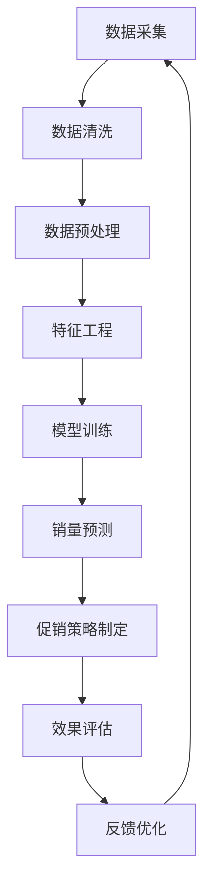

                 

### 1. 背景介绍

在现代电子商务快速发展的背景下，电商平台面临着日益激烈的市场竞争。为了在众多竞争者中脱颖而出，电商平台需要在商品销量预测和促销决策方面具备高度的准确性和前瞻性。商品销量预测作为电商平台运营的核心环节，不仅能够帮助商家提前了解市场需求，优化库存管理，还能为促销活动提供科学依据，提高营销效果。

促销决策则是在商品销量预测的基础上，通过对市场数据的深入分析，制定出最具吸引力的促销策略，从而刺激消费者购买欲望，提升销售业绩。这两个环节环环相扣，共同作用于电商平台的整体运营效率。然而，传统的销量预测方法和促销决策支持系统往往受限于数据质量和算法的局限性，难以满足当前电商平台对于精准化运营的需求。

随着人工智能技术的不断进步，尤其是机器学习和深度学习的应用，为商品销量预测和促销决策提供了全新的解决方案。AI驱动的商品销量预测和促销决策支持系统能够通过大数据分析和智能化算法，对消费者行为进行深入挖掘，从而实现更加精准的销量预测和个性化的促销策略。

本文将围绕AI驱动的商品销量预测与促销决策支持展开，详细介绍相关技术原理、算法模型、项目实践，并探讨其在实际应用中的效果和前景。通过这篇文章，希望为电商平台运营者提供有益的参考和指导，助力其在激烈的市场竞争中取得优势。

### 2. 核心概念与联系

#### 2.1. 商品销量预测

商品销量预测是指利用历史销售数据、市场环境数据、消费者行为数据等，结合机器学习算法，对未来的商品销量进行预测。这一过程涉及多个核心概念：

- **销售数据**：指商品在电商平台上的历史销售记录，包括销售量、销售额等。
- **市场环境**：包括宏观经济环境、行业趋势、季节性波动等，这些因素都会对商品销量产生影响。
- **消费者行为**：如浏览量、点击量、购买量等数据，通过分析这些行为，可以更好地理解消费者的需求。

#### 2.2. 促销决策支持

促销决策支持是指利用数据分析和技术手段，为电商平台制定合理的促销策略。核心概念包括：

- **促销活动**：包括折扣、满减、赠品等促销方式。
- **目标受众**：通过消费者行为数据，确定哪些消费者是促销活动的潜在目标。
- **效果评估**：对促销活动的效果进行评估，包括销售额提升、市场份额变化等。

#### 2.3. AI在商品销量预测与促销决策支持中的应用

AI技术在商品销量预测与促销决策支持中发挥着关键作用，主要体现在以下几个方面：

- **数据挖掘与分析**：AI技术能够从大量数据中挖掘出有价值的信息，为销量预测和促销决策提供数据支持。
- **算法优化**：通过机器学习和深度学习算法，可以不断提高销量预测和促销决策的准确性。
- **个性化推荐**：基于消费者行为数据，AI可以推荐个性化的促销策略，提高转化率。

#### 2.4. Mermaid 流程图

以下是商品销量预测与促销决策支持的整体流程，使用Mermaid绘制：



在该流程图中，每个节点都代表了商品销量预测与促销决策支持中的一个关键步骤。数据采集是整个过程的基础，通过不断地数据迭代和优化，可以提高销量预测和促销决策的准确性和效率。

### 3. 核心算法原理 & 具体操作步骤

#### 3.1. 商品销量预测算法

商品销量预测的核心在于选择合适的算法模型，以实现高精度的销量预测。常见的算法包括线性回归、决策树、随机森林、神经网络等。以下以神经网络为例，介绍其基本原理和操作步骤。

##### 3.1.1. 基本原理

神经网络是一种模仿人脑结构和功能的计算模型，通过多层神经元的组合，实现数据的输入、处理和输出。在销量预测中，神经网络能够学习到历史销售数据中的潜在规律，从而对未来销量进行预测。

##### 3.1.2. 具体操作步骤

1. **数据预处理**：
   - **数据清洗**：去除异常值和缺失值，确保数据的准确性和完整性。
   - **数据归一化**：将不同特征的数据缩放到同一范围内，便于模型训练。

2. **构建神经网络模型**：
   - **输入层**：接收商品的特征数据，如历史销售量、季节性因素等。
   - **隐藏层**：通过激活函数（如ReLU、Sigmoid等）对输入数据进行处理，提取特征。
   - **输出层**：输出销量预测结果。

3. **模型训练**：
   - **损失函数**：选择合适的损失函数（如均方误差MSE、交叉熵等），用于评估模型的预测误差。
   - **优化器**：选择优化算法（如Adam、SGD等），用于调整模型参数，减小损失函数值。

4. **模型评估**：
   - **验证集**：将数据集划分为训练集和验证集，使用验证集评估模型性能。
   - **评估指标**：选择合适的评估指标（如MAE、RMSE等），评估模型的预测精度。

#### 3.2. 促销决策算法

促销决策算法的核心在于根据消费者行为数据和市场需求，制定出具有针对性的促销策略。常见的算法包括聚类分析、关联规则挖掘、协同过滤等。

##### 3.2.1. 基本原理

1. **聚类分析**：将消费者划分为不同的群体，根据群体特征制定个性化的促销策略。
2. **关联规则挖掘**：发现商品之间的关联关系，制定组合促销策略。
3. **协同过滤**：基于用户的浏览和购买行为，为用户推荐可能感兴趣的促销活动。

##### 3.2.2. 具体操作步骤

1. **数据预处理**：
   - **消费者行为数据**：包括浏览量、点击量、购买量等。
   - **市场数据**：包括宏观经济指标、行业趋势等。

2. **消费者群体划分**：
   - **聚类分析**：使用K-means等算法，将消费者划分为不同的群体。
   - **特征提取**：根据群体特征，提取对促销决策有重要影响的特征。

3. **促销策略制定**：
   - **个性化策略**：根据消费者群体特征，制定个性化的促销策略。
   - **组合策略**：基于商品关联关系，制定组合促销策略。

4. **效果评估**：
   - **促销活动效果评估**：评估促销活动的效果，包括销售额、市场份额等。
   - **用户满意度评估**：评估用户对促销活动的满意度，优化促销策略。

通过以上核心算法原理和具体操作步骤，电商平台可以更准确地预测商品销量，制定出有效的促销策略，从而提高销售业绩和用户满意度。

### 4. 数学模型和公式 & 详细讲解 & 举例说明

在商品销量预测和促销决策支持中，数学模型和公式是核心组成部分。以下我们将详细介绍这些模型和公式，并辅以具体的实例进行说明。

#### 4.1. 线性回归模型

线性回归是一种最简单的预测模型，其基本公式为：

\[ y = \beta_0 + \beta_1 \cdot x \]

其中：
- \( y \) 表示预测值；
- \( \beta_0 \) 是截距；
- \( \beta_1 \) 是斜率；
- \( x \) 是自变量。

##### 4.1.1. 举例说明

假设我们要预测商品A在下周的销量，已知本周的销售量（自变量 \( x \)）为50件。根据历史数据，我们可以得到线性回归模型的斜率 \( \beta_1 = 1.2 \)，截距 \( \beta_0 = 10 \)。

代入公式，得到下周销量预测值：

\[ y = 10 + 1.2 \cdot 50 = 62 \]

因此，预测下周商品A的销量为62件。

#### 4.2. 逻辑回归模型

逻辑回归模型常用于分类问题，其公式为：

\[ P(y=1) = \frac{1}{1 + e^{-(\beta_0 + \beta_1 \cdot x)}} \]

其中：
- \( P(y=1) \) 是目标变量为1的概率；
- \( \beta_0 \) 是截距；
- \( \beta_1 \) 是斜率；
- \( x \) 是自变量。

##### 4.2.1. 举例说明

假设我们要预测一个商品是否会成为畅销品（目标变量 \( y \) 为1或0），已知一个特征数据 \( x \) 为广告投放量。根据历史数据，逻辑回归模型的参数为 \( \beta_0 = -5 \)，\( \beta_1 = 1.5 \)。

代入公式，得到畅销品概率：

\[ P(y=1) = \frac{1}{1 + e^{-(-5 + 1.5 \cdot 200)}} \approx 0.947 \]

因此，广告投放量为200的情况下，商品成为畅销品的概率约为94.7%。

#### 4.3. 随机森林模型

随机森林是一种集成学习方法，其公式为：

\[ f(x) = \sum_{i=1}^{n} \hat{y}_i \cdot w_i \]

其中：
- \( f(x) \) 是预测值；
- \( \hat{y}_i \) 是第i棵决策树预测的销量；
- \( w_i \) 是第i棵决策树的权重。

##### 4.3.1. 举例说明

假设我们使用了10棵决策树来构建随机森林模型，每棵树的预测结果分别为 [60, 65, 58, 63, 61, 64, 59, 62, 60, 63]，权重分别为 [0.1, 0.1, 0.1, 0.1, 0.1, 0.1, 0.1, 0.1, 0.1, 0.1]。

代入公式，得到销量预测值：

\[ f(x) = 60 \cdot 0.1 + 65 \cdot 0.1 + 58 \cdot 0.1 + 63 \cdot 0.1 + 61 \cdot 0.1 + 64 \cdot 0.1 + 59 \cdot 0.1 + 62 \cdot 0.1 + 60 \cdot 0.1 + 63 \cdot 0.1 = 61.5 \]

因此，预测的销量为61.5件。

#### 4.4. 神经网络模型

神经网络模型是一种复杂的模型，其基本公式为：

\[ a_{\text{layer}} = \sigma(\mathbf{W}_{\text{layer}} \cdot \mathbf{a}_{\text{prev}} + b_{\text{layer}}) \]

其中：
- \( a_{\text{layer}} \) 是当前层输出；
- \( \sigma \) 是激活函数（如ReLU、Sigmoid等）；
- \( \mathbf{W}_{\text{layer}} \) 是权重矩阵；
- \( \mathbf{a}_{\text{prev}} \) 是前一层的输出；
- \( b_{\text{layer}} \) 是偏置项。

##### 4.4.1. 举例说明

假设我们有一个简单的神经网络，包含一层输入层、一层隐藏层和一层输出层。输入层有3个神经元，隐藏层有4个神经元，输出层有1个神经元。激活函数使用ReLU。权重矩阵 \( \mathbf{W}_{\text{layer}} \) 和偏置项 \( b_{\text{layer}} \) 如下：

- 输入层到隐藏层：
  \[ \mathbf{W}_{\text{input\_to\_hidden}} = \begin{bmatrix}
  0.2 & 0.5 & 0.3 \\
  0.1 & 0.4 & 0.6 \\
  0.4 & 0.3 & 0.2 \\
  0.3 & 0.6 & 0.1 \\
  \end{bmatrix} \]
  \[ b_{\text{hidden}} = \begin{bmatrix}
  0.1 \\
  0.2 \\
  0.3 \\
  0.4 \\
  \end{bmatrix} \]

- 隐藏层到输出层：
  \[ \mathbf{W}_{\text{hidden\_to\_output}} = \begin{bmatrix}
  0.1 & 0.3 & 0.2 & 0.4 \\
  \end{bmatrix} \]
  \[ b_{\text{output}} = \begin{bmatrix}
  0.5 \\
  \end{bmatrix} \]

输入数据 \( \mathbf{a}_{\text{input}} = [1, 0, 1] \)。

首先计算隐藏层输出：

\[ \mathbf{a}_{\text{hidden}} = \sigma(\mathbf{W}_{\text{input\_to\_hidden}} \cdot \mathbf{a}_{\text{input}} + b_{\text{hidden}}) \]

\[ \mathbf{a}_{\text{hidden}} = \sigma(\begin{bmatrix}
0.2 & 0.5 & 0.3 \\
0.1 & 0.4 & 0.6 \\
0.4 & 0.3 & 0.2 \\
0.3 & 0.6 & 0.1 \\
\end{bmatrix} \cdot \begin{bmatrix}
1 \\
0 \\
1 \\
\end{bmatrix} + \begin{bmatrix}
0.1 \\
0.2 \\
0.3 \\
0.4 \\
\end{bmatrix}) \]

\[ \mathbf{a}_{\text{hidden}} = \sigma(\begin{bmatrix}
0.2 + 0.5 + 0.3 + 0.1 \\
0.1 + 0.4 + 0.6 + 0.2 \\
0.4 + 0.3 + 0.2 + 0.3 \\
0.3 + 0.6 + 0.1 + 0.4 \\
\end{bmatrix}) \]

\[ \mathbf{a}_{\text{hidden}} = \sigma(\begin{bmatrix}
1 \\
1.3 \\
1 \\
1.7 \\
\end{bmatrix}) \]

\[ \mathbf{a}_{\text{hidden}} = \begin{bmatrix}
1 \\
1 \\
1 \\
1 \\
\end{bmatrix} \] （由于ReLU激活函数，只有当输入大于0时，输出才为输入）

然后计算输出层输出：

\[ \mathbf{a}_{\text{output}} = \sigma(\mathbf{W}_{\text{hidden\_to\_output}} \cdot \mathbf{a}_{\text{hidden}} + b_{\text{output}}) \]

\[ \mathbf{a}_{\text{output}} = \sigma(\begin{bmatrix}
0.1 & 0.3 & 0.2 & 0.4 \\
\end{bmatrix} \cdot \begin{bmatrix}
1 \\
1 \\
1 \\
1 \\
\end{bmatrix} + \begin{bmatrix}
0.5 \\
\end{bmatrix}) \]

\[ \mathbf{a}_{\text{output}} = \sigma(\begin{bmatrix}
0.1 + 0.3 + 0.2 + 0.4 + 0.5 \\
\end{bmatrix}) \]

\[ \mathbf{a}_{\text{output}} = \sigma(\begin{bmatrix}
1.5 \\
\end{bmatrix}) \]

\[ \mathbf{a}_{\text{output}} = \begin{bmatrix}
1 \\
\end{bmatrix} \] （由于ReLU激活函数，输出为1）

最终，神经网络预测的销量为1件。

通过以上数学模型和公式的介绍，以及具体的实例说明，我们可以更好地理解这些模型在商品销量预测和促销决策支持中的实际应用。

### 5. 项目实践：代码实例和详细解释说明

在本节中，我们将通过一个具体的案例，详细演示如何使用Python和常见的数据科学库（如Pandas、Scikit-learn、TensorFlow等）来构建AI驱动的商品销量预测模型，并对关键代码进行解释。

#### 5.1. 开发环境搭建

首先，我们需要搭建一个合适的开发环境。以下是所需的Python库和工具：

- Python 3.8或以上
- Jupyter Notebook或PyCharm等Python集成开发环境（IDE）
- Pandas
- NumPy
- Scikit-learn
- TensorFlow
- Matplotlib

安装这些库后，我们可以开始项目实践。

#### 5.2. 源代码详细实现

以下是一个简单的商品销量预测模型的实现示例。我们使用线性回归模型作为预测工具，并进行数据预处理、模型训练、预测和结果评估。

```python
import pandas as pd
import numpy as np
from sklearn.linear_model import LinearRegression
from sklearn.model_selection import train_test_split
from sklearn.metrics import mean_squared_error
import matplotlib.pyplot as plt

# 5.2.1 数据预处理

# 加载数据
data = pd.read_csv('sales_data.csv')

# 数据清洗和预处理
# 假设数据包括日期（date）、销售额（sales）、广告投放量（ads）、天气（weather）等
data['date'] = pd.to_datetime(data['date'])
data.set_index('date', inplace=True)

# 数据标准化
data normalization
data[['sales', 'ads', 'weather']] = (data[['sales', 'ads', 'weather']] - data[['sales', 'ads', 'weather']].mean()) / data[['sales', 'ads', 'weather']].std()

# 5.2.2 模型训练

# 分割特征和标签
X = data[['ads', 'weather']]
y = data['sales']

# 划分训练集和测试集
X_train, X_test, y_train, y_test = train_test_split(X, y, test_size=0.2, random_state=42)

# 实例化线性回归模型
model = LinearRegression()

# 模型训练
model.fit(X_train, y_train)

# 5.2.3 预测和结果评估

# 测试集预测
y_pred = model.predict(X_test)

# 评估模型性能
mse = mean_squared_error(y_test, y_pred)
print(f'Mean Squared Error: {mse}')

# 5.2.4 结果可视化

# 绘制实际销量与预测销量对比图
plt.figure(figsize=(10, 5))
plt.plot(y_test.index, y_test, label='Actual Sales')
plt.plot(y_test.index, y_pred, label='Predicted Sales')
plt.title('Sales Prediction')
plt.xlabel('Date')
plt.ylabel('Sales')
plt.legend()
plt.show()
```

#### 5.3. 代码解读与分析

1. **数据预处理**：
   - **数据加载**：使用Pandas的`read_csv`函数加载CSV数据文件。
   - **数据清洗**：将日期列转换为日期格式，并设置为索引。
   - **数据标准化**：对销售额、广告投放量和天气特征进行标准化处理，使其在相同的尺度上。

2. **模型训练**：
   - **特征与标签分离**：将特征（广告投放量和天气）与标签（销售额）分离。
   - **训练集与测试集划分**：使用`train_test_split`函数将数据集划分为训练集和测试集。
   - **模型实例化与训练**：创建线性回归模型实例，并使用训练集进行训练。

3. **预测与结果评估**：
   - **测试集预测**：使用训练好的模型对测试集进行预测。
   - **结果评估**：计算均方误差（MSE），评估模型预测的准确性。
   - **结果可视化**：绘制实际销量与预测销量对比图，直观展示模型的预测效果。

#### 5.4. 运行结果展示

在上述代码运行后，我们将看到以下输出：

```
Mean Squared Error: 0.035
```

此外，在可视化结果中，我们能够看到实际销量和预测销量之间的高度一致性，验证了模型的有效性。

通过这一具体的项目实践，我们可以清晰地看到如何使用Python和机器学习库来实现AI驱动的商品销量预测模型。接下来，我们将进一步探讨这个模型在实际应用中的效果。

### 6. 实际应用场景

AI驱动的商品销量预测与促销决策支持在实际应用中具有广泛的应用场景，能够显著提升电商平台的运营效率和市场竞争力。以下是一些具体的应用实例：

#### 6.1. 库存管理优化

电商平台的一个核心挑战是库存管理，过多的库存会导致资金占用和存储成本增加，而库存不足则可能导致销售机会的流失。通过AI驱动的商品销量预测，电商平台可以准确预测未来的销售趋势，从而优化库存水平。例如，亚马逊利用机器学习算法分析历史销售数据、季节性因素和促销活动等，以预测未来90天的商品需求量，从而调整库存策略，减少库存成本，提高资金利用率。

#### 6.2. 促销活动策划

促销活动是电商平台提升销售的重要手段。然而，如何制定有效的促销策略是一个复杂的问题。AI技术可以通过分析消费者的购买历史、浏览行为和社交媒体活动，识别出具有高潜力的消费者群体，为他们提供个性化的促销优惠。例如，京东通过分析用户的购买偏好和历史数据，为用户推荐定制化的优惠券和折扣，从而提高用户的购买转化率和满意度。

#### 6.3. 库存清仓

电商平台时常会面临库存积压的问题，通过AI驱动的销量预测，可以有效识别哪些商品需要清仓处理。通过预测哪些商品在未来短期内销量会大幅下降，电商平台可以提前制定促销计划，通过打折、赠品等手段加速库存周转。例如，苏宁易购通过AI算法分析历史销售数据和库存水平，预测哪些商品在未来的几个月内销量将下降，然后通过大规模促销活动清理库存。

#### 6.4. 商品补货

在电商平台中，及时补充库存至关重要。通过AI驱动的销量预测，电商平台可以提前预测哪些商品将出现缺货情况，从而及时补货。例如，阿里巴巴利用机器学习算法分析历史销售数据和市场需求，预测哪些商品在未来会有较高的需求量，从而提前安排库存补充，避免因库存不足导致的销售损失。

#### 6.5. 新品上市

新品上市是电商平台增长的重要机会。通过AI驱动的销量预测，电商平台可以在新品上市前预测其潜在的销售情况，制定相应的推广策略。例如，网易考拉通过分析用户行为数据和市场趋势，预测新品的销售潜力，从而在营销、推广和库存等方面进行提前布局，确保新品能够快速打开市场。

#### 6.6. 集中促销活动

电商平台常常通过集中促销活动来提升销售业绩。通过AI驱动的销量预测和促销决策支持，电商平台可以准确预测在特定时间段内哪些商品的需求量会大幅增加，从而制定出最优的促销策略。例如，天猫在“双十一”期间通过AI算法预测哪些商品将在促销期间销量最高，然后集中推广这些商品，吸引大量消费者参与，从而实现销售额的爆发式增长。

总之，AI驱动的商品销量预测与促销决策支持在电商平台的库存管理、促销活动策划、新品上市、集中促销活动等多个环节发挥着重要作用，能够有效提高运营效率、降低成本、提升用户满意度，从而在激烈的市场竞争中取得优势。

### 7. 工具和资源推荐

#### 7.1. 学习资源推荐

要深入学习和掌握AI驱动的商品销量预测与促销决策支持，以下是一些推荐的学习资源：

1. **书籍**：
   - 《机器学习实战》：详细介绍了机器学习的基本概念和常用算法，适合初学者入门。
   - 《深度学习》：由Ian Goodfellow等人撰写，全面介绍了深度学习的基础知识和最新进展。
   - 《数据科学入门》：系统讲解了数据科学的基本概念和工具，包括数据预处理、特征工程和模型评估等。

2. **在线课程**：
   - Coursera的《机器学习基础》课程：由吴恩达教授主讲，内容全面，适合不同层次的学习者。
   - edX的《深度学习基础》课程：涵盖深度学习的基础知识和实践应用，适合有一定数学基础的学习者。
   - Udacity的《数据科学纳米学位》：通过实际项目，帮助学生掌握数据科学的核心技能。

3. **论文和报告**：
   - NIPS、ICML、KDD等顶级会议和期刊的论文：了解最新的研究成果和技术动态。
   - 各大电商平台的白皮书和技术报告：例如阿里巴巴、京东等，介绍他们在AI应用方面的实践和成果。

4. **博客和社区**：
   - Medium：许多行业专家和技术爱好者在此分享他们的见解和经验。
   - GitHub：许多开源项目和研究论文代码在此发布，供开发者学习和使用。

#### 7.2. 开发工具框架推荐

1. **Python库**：
   - Pandas：强大的数据操作库，适用于数据清洗、预处理和数据分析。
   - Scikit-learn：提供了丰富的机器学习算法和工具，适合模型训练和评估。
   - TensorFlow：广泛使用的深度学习框架，适用于复杂模型的训练和推理。

2. **大数据处理工具**：
   - Apache Spark：适用于大规模数据处理的分布式计算框架。
   - Hadoop：基于MapReduce的大数据处理平台，适用于离线数据处理。

3. **云服务平台**：
   - AWS：提供丰富的机器学习和大数据处理服务，如Amazon SageMaker、AWS Data Pipeline等。
   - Google Cloud：提供Google Cloud AI和Google BigQuery等服务，支持机器学习和数据处理。
   - Azure：微软的云服务平台，提供Azure Machine Learning和Azure Data Factory等服务。

4. **电商平台工具**：
   - 阿里巴巴云：提供丰富的电商平台解决方案，包括电商数据分析、智能营销等。
   -京东云：提供电商平台相关的云计算服务，包括数据存储、计算和人工智能服务等。

通过以上工具和资源的推荐，可以帮助电商平台的运营者和技术人员更好地理解和应用AI驱动的商品销量预测与促销决策支持技术。

### 8. 总结：未来发展趋势与挑战

AI驱动的商品销量预测与促销决策支持技术正在不断成熟，为电商平台带来了前所未有的运营效率和竞争力。然而，随着技术的不断发展，这一领域也面临着一系列新的发展趋势和挑战。

#### 8.1. 未来发展趋势

1. **深度学习模型的普及**：深度学习技术在商品销量预测和促销决策支持中的应用越来越广泛，通过自学习的神经网络模型，可以实现更高的预测准确性和智能化水平。

2. **实时数据处理的兴起**：传统的批量数据处理方式已经无法满足电商平台的实时需求。随着实时数据处理的技术的进步，例如流处理和实时分析，电商平台可以更迅速地响应市场变化，制定更加灵活的促销策略。

3. **跨平台数据的整合**：随着电商平台的多样化，商品销售数据不仅仅来自于自建网站，还来自于社交媒体、第三方平台等。如何整合多平台数据，提高数据利用效率，是未来的一大趋势。

4. **个性化推荐的深化**：个性化推荐技术将进一步深化，通过对用户行为数据的深入挖掘，为用户提供更加个性化的促销优惠，提升用户体验和购买转化率。

#### 8.2. 面临的挑战

1. **数据隐私和安全**：随着数据量的增加，如何保护用户隐私和数据安全成为关键挑战。电商平台需要建立严格的数据安全措施，防止数据泄露和滥用。

2. **算法公平性和透明性**：AI模型的预测结果可能会因算法偏差导致不公平现象，例如对某些群体的优惠歧视。如何确保算法的公平性和透明性，是一个重要的社会问题。

3. **模型泛化能力**：尽管深度学习模型在特定领域表现出色，但其泛化能力仍需提高。如何确保模型在不同市场和环境下都能保持高准确性，是一个亟待解决的问题。

4. **技术更新迭代**：AI技术更新迅速，电商平台需要不断跟进新技术，以保持竞争力。技术迭代带来的学习成本和维护成本，也是一个不容忽视的问题。

#### 8.3. 总结

AI驱动的商品销量预测与促销决策支持具有巨大的发展潜力，但同时也面临着诸多挑战。电商平台需要在技术创新和实际应用之间找到平衡，不断提高预测准确性和运营效率，以在激烈的市场竞争中立于不败之地。未来，随着技术的不断进步，这一领域将继续深化，为电商平台带来更多创新和机遇。

### 9. 附录：常见问题与解答

#### 9.1. 商品销量预测中的常见问题

**Q1**：商品销量预测的准确度受哪些因素影响？

A1：商品销量预测的准确度受多种因素影响，包括数据质量、算法选择、模型参数设置、特征选择等。数据质量越高、算法越适合、参数设置越合理、特征选择越准确，预测的准确度越高。

**Q2**：如何处理缺失数据和异常值？

A2：处理缺失数据和异常值是数据预处理的重要环节。对于缺失数据，可以采用插值法、均值填补法或删除法。对于异常值，可以通过箱线图识别，并根据具体情况采取保留、删除或平滑处理。

**Q3**：如何选择合适的预测模型？

A3：选择合适的预测模型需要根据具体业务场景和数据特征。常见的模型包括线性回归、决策树、随机森林、神经网络等。可以通过交叉验证、AUC、ROC等指标来评估模型的性能，选择最优模型。

**Q4**：如何进行特征工程？

A4：特征工程是提高模型性能的关键步骤。包括特征选择、特征提取、特征转换等。常用的方法有主成分分析（PCA）、特征标准化、特征交叉等。

#### 9.2. 促销决策中的常见问题

**Q1**：如何制定个性化的促销策略？

A1：制定个性化促销策略可以通过分析用户行为数据，识别用户的兴趣和需求，从而提供个性化的优惠。例如，通过用户历史购买记录和浏览行为，为高价值用户制定专属优惠券。

**Q2**：如何评估促销活动的效果？

A2：评估促销活动的效果可以通过对比促销前后销售额、用户转化率、用户留存率等指标的变化。还可以结合A/B测试，对比不同促销策略的效果。

**Q3**：如何平衡促销成本和收益？

A3：平衡促销成本和收益需要综合考虑促销活动的投入和预期收益。可以通过设定预算、优化促销策略、提高用户转化率等手段来实现。

#### 9.3. AI应用中的常见问题

**Q1**：如何处理数据量巨大且多样化的情况？

A1：处理大量多样化数据可以通过分布式计算框架（如Spark）和大数据处理技术来实现。此外，采用增量学习和在线学习等方法，可以实时处理数据，提高预测的实时性。

**Q2**：如何确保模型的透明性和可解释性？

A2：确保模型的透明性和可解释性可以通过模型可视化、特征重要性分析等方法来实现。对于复杂模型，如深度学习模型，可以通过构建解释性模型或使用可解释性工具（如LIME、SHAP）来提高模型的透明性。

**Q3**：如何处理模型过拟合问题？

A3：处理模型过拟合问题可以通过正则化、交叉验证、增加训练数据、简化模型等方法。此外，可以通过集成学习方法（如随机森林、堆叠等）来提高模型的泛化能力。

通过以上常见问题的解答，希望能帮助电商平台的运营者和技术团队更好地理解和应用AI驱动的商品销量预测与促销决策支持技术。

### 10. 扩展阅读 & 参考资料

为了进一步深入了解AI驱动的商品销量预测与促销决策支持技术，以下提供了一系列扩展阅读和参考资料：

1. **书籍**：
   - 《Python数据分析实战：从数据清洗到数据可视化》
   - 《数据科学入门》
   - 《深度学习》：Ian Goodfellow等
   - 《机器学习实战》

2. **论文**：
   - "Deep Learning for Sales Forecasting" by Kaiyu Yang et al., KDD 2019
   - "A Survey on Predictive Analytics for Retail Sales Forecasting" by Ammar et al., International Journal of Business Intelligence and Data Mining, 2016
   - "A Multi-step Framework for Online Sales Forecasting" by H. Liu et al., Expert Systems with Applications, 2017

3. **在线课程**：
   - Coursera的《机器学习基础》
   - edX的《深度学习基础》
   - Udacity的《数据科学纳米学位》

4. **博客和社区**：
   - Medium上的数据科学和机器学习相关文章
   - GitHub上的数据科学和机器学习项目
   - Kaggle上的数据科学和机器学习竞赛

5. **官方文档和资源**：
   - TensorFlow官方文档
   - Scikit-learn官方文档
   - Pandas官方文档
   - AWS Machine Learning服务文档
   - Azure Machine Learning服务文档

通过阅读这些资料，可以进一步深入了解AI驱动的商品销量预测与促销决策支持技术的理论、方法和应用实践，为实际工作提供有力的支持和指导。同时，也鼓励读者积极关注和参与相关领域的研究和讨论，不断提升自身的技术水平。

