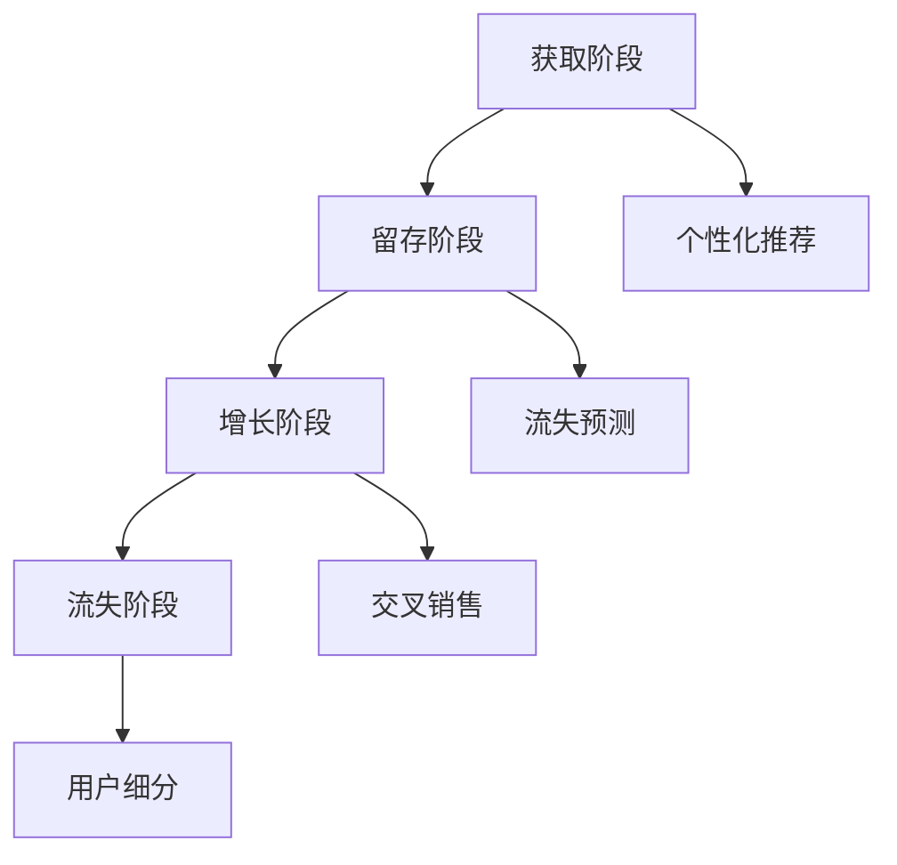

                 

### 文章标题：AI驱动的电商用户全生命周期价值管理

关键词：AI、电商、用户生命周期、价值管理、个性化推荐、数据挖掘、机器学习

摘要：本文将深入探讨AI在电商用户全生命周期价值管理中的应用，分析其核心概念、算法原理、数学模型，并通过具体案例和代码实例展示其实际操作步骤和效果。文章还将讨论实际应用场景、相关工具和资源，以及未来发展趋势与挑战。

<|user|>## 1. 背景介绍

在互联网经济的快速发展背景下，电商行业已经成为全球经济增长的重要驱动力。然而，随着市场竞争的加剧，电商企业面临着如何有效管理用户全生命周期价值（Customer Lifetime Value, CLV）的挑战。传统的用户管理方法往往依赖于简单的统计和预测模型，无法充分挖掘用户的潜在价值，进而影响企业的盈利能力。

用户全生命周期价值是指一个用户在整个生命周期内为电商企业带来的总利润。它不仅包括用户的初次购买，还涵盖了后续的复购、推荐等行为。如何准确预测和提升用户全生命周期价值，已经成为电商企业竞争的关键因素。

近年来，随着人工智能（AI）技术的迅速发展，AI在电商用户全生命周期价值管理中的应用逐渐成为研究热点。通过大数据分析、机器学习算法和深度学习模型，AI能够帮助电商企业实现用户行为的精准预测和个性化推荐，从而提高用户满意度、增加用户粘性和提升企业盈利能力。

本文将从以下几个方面展开讨论：

1. **核心概念与联系**：介绍用户全生命周期价值管理的核心概念，包括用户价值、用户生命周期和用户行为等。
2. **核心算法原理与具体操作步骤**：分析常见的AI算法，如协同过滤、深度学习等，以及它们在电商用户价值管理中的应用。
3. **数学模型和公式**：详细讲解用于用户价值预测和优化的数学模型，包括贝叶斯模型、线性回归模型等。
4. **项目实践**：通过代码实例展示AI在电商用户全生命周期价值管理中的实际应用，包括数据预处理、模型训练、模型评估和结果分析。
5. **实际应用场景**：探讨AI在电商用户全生命周期价值管理中的实际应用场景，如个性化推荐、流失预测、交叉销售等。
6. **工具和资源推荐**：推荐学习AI和电商用户价值管理相关的书籍、论文、工具和资源。
7. **总结与展望**：总结本文的主要观点，探讨未来发展趋势和挑战。

通过本文的讨论，旨在为电商企业提供一种全新的用户全生命周期价值管理思路，以应对日益激烈的市场竞争。

<|user|>## 2. 核心概念与联系

### 2.1 用户价值

用户价值是指用户为电商企业带来的直接和间接收益。直接收益包括用户的购买行为所带来的销售额，而间接收益则包括用户的推荐、评论、分享等行为。用户价值是电商企业衡量用户质量的重要指标。

### 2.2 用户生命周期

用户生命周期是指用户从首次接触到企业产品或服务，到离开或停止使用产品或服务的过程。用户生命周期通常包括以下几个阶段：

1. **获取阶段**：企业通过各种渠道吸引潜在用户，如广告投放、社交媒体营销等。
2. **留存阶段**：企业通过提供优质的产品和服务，保持用户的活跃度和忠诚度。
3. **增长阶段**：通过用户的复购、推荐等行为，增加用户的整体价值。
4. **流失阶段**：用户因各种原因停止使用产品或服务，离开企业。

### 2.3 用户行为

用户行为是指用户在使用产品或服务过程中的各种活动，如浏览、搜索、购买、评价等。用户行为数据是电商企业进行数据挖掘和分析的重要来源，通过分析用户行为，企业可以更好地了解用户需求，制定有效的营销策略。

### 2.4 AI在用户全生命周期价值管理中的应用

#### 2.4.1 个性化推荐

个性化推荐是一种基于用户行为的推荐系统，通过分析用户的历史行为数据，为用户推荐可能感兴趣的商品或服务。个性化推荐可以有效提高用户满意度，增加用户的复购率和推荐率。

#### 2.4.2 流失预测

流失预测是一种基于用户行为和生命周期阶段的分析，通过预测用户流失的可能性，企业可以采取相应的措施减少用户流失，如发送优惠券、提供个性化服务等。

#### 2.4.3 交叉销售

交叉销售是指通过分析用户的购买行为和偏好，向用户推荐相关的其他商品或服务。交叉销售可以增加用户的整体购买量，提高企业的销售额。

#### 2.4.4 用户细分

用户细分是一种基于用户特征和行为数据的分析方法，通过将用户划分为不同的群体，企业可以针对不同用户群体制定个性化的营销策略。

### 2.5 Mermaid流程图

以下是一个简化的AI在电商用户全生命周期价值管理中的流程图：



### 2.6 总结

用户全生命周期价值管理是一个复杂的过程，涉及用户价值、用户生命周期和用户行为等多个方面。通过AI技术的应用，企业可以更好地理解用户需求，制定个性化的营销策略，从而提升用户满意度、增加用户粘性和提高企业盈利能力。

<|user|>### 3. 核心算法原理 & 具体操作步骤

在电商用户全生命周期价值管理中，核心算法的选择至关重要。以下将介绍几种常用的算法原理，以及它们在实际操作中的具体步骤。

#### 3.1 协同过滤算法

协同过滤（Collaborative Filtering）是一种基于用户行为的推荐算法，通过分析用户之间的相似性，为用户推荐可能感兴趣的商品或服务。协同过滤算法分为两类：基于用户的协同过滤和基于物品的协同过滤。

##### 基于用户的协同过滤

1. **计算用户相似性**：首先，计算用户之间的相似性。常见的方法包括余弦相似度、皮尔逊相关系数等。相似性越高，表示用户之间的兴趣越相似。
   
2. **找到相似用户**：根据相似性度量，找到与目标用户最相似的K个用户。

3. **预测评分**：利用相似用户的评分数据，预测目标用户对未知商品的评分。常见的方法包括加权平均评分、加权相似度评分等。

##### 基于物品的协同过滤

1. **计算物品相似性**：首先，计算物品之间的相似性。常见的方法包括余弦相似度、欧氏距离等。相似性越高，表示物品之间的特征越相似。

2. **找到相似物品**：根据相似性度量，找到与目标物品最相似的K个物品。

3. **预测评分**：利用相似物品的评分数据，预测目标用户对未知物品的评分。常见的方法包括加权平均评分、加权相似度评分等。

#### 3.2 深度学习算法

深度学习（Deep Learning）是一种基于多层神经网络的学习方法，通过自动提取特征，实现复杂函数的逼近。在电商用户全生命周期价值管理中，深度学习算法可以用于用户行为预测、个性化推荐等。

##### 深度学习模型

1. **构建模型**：选择合适的深度学习模型，如卷积神经网络（CNN）、循环神经网络（RNN）等。根据问题需求，设计模型的输入层、隐藏层和输出层。

2. **数据预处理**：对原始数据进行清洗、归一化和编码等处理，使其符合模型的输入要求。

3. **模型训练**：利用训练数据集，通过反向传播算法，优化模型的参数，降低预测误差。

4. **模型评估**：使用验证数据集，评估模型的预测性能，调整模型参数，优化模型效果。

#### 3.3 矩阵分解算法

矩阵分解（Matrix Factorization）是一种基于线性代数的降维技术，通过分解用户和物品的评分矩阵，提取用户和物品的潜在特征。矩阵分解算法可以用于推荐系统、用户价值预测等。

##### 矩阵分解步骤

1. **初始化**：初始化用户和物品的特征矩阵。

2. **优化目标**：定义优化目标，如最小化均方误差、最大化边际贡献等。

3. **迭代优化**：利用梯度下降等优化算法，迭代优化用户和物品的特征矩阵。

4. **预测评分**：利用优化后的特征矩阵，预测用户对物品的评分。

#### 3.4 实际操作步骤

以下是使用协同过滤算法进行用户个性化推荐的实际操作步骤：

1. **数据收集**：收集用户的行为数据，如购买记录、浏览记录等。

2. **数据预处理**：对数据进行清洗、归一化等处理。

3. **计算相似性**：计算用户之间的相似性，可以选择余弦相似度或皮尔逊相关系数。

4. **找到相似用户**：根据相似性度量，找到与目标用户最相似的K个用户。

5. **预测评分**：利用相似用户的评分数据，预测目标用户对未知商品的评分。

6. **生成推荐列表**：根据预测评分，生成个性化的推荐列表。

7. **模型评估**：使用验证集，评估模型的预测性能，调整参数，优化模型效果。

#### 3.5 总结

核心算法在电商用户全生命周期价值管理中起着关键作用。协同过滤、深度学习和矩阵分解等算法具有不同的特点和优势，适用于不同的应用场景。通过合理选择和应用这些算法，企业可以更好地理解和满足用户需求，提高用户满意度，提升企业盈利能力。

<|user|>### 4. 数学模型和公式 & 详细讲解 & 举例说明

在电商用户全生命周期价值管理中，数学模型和公式起着至关重要的作用。它们可以帮助我们准确预测用户行为，优化营销策略，提升企业盈利能力。以下将介绍几种常用的数学模型和公式，并详细讲解它们的原理和应用。

#### 4.1 贝叶斯模型

贝叶斯模型是一种基于概率论的统计模型，用于处理不确定性和不确定性推理。在用户全生命周期价值管理中，贝叶斯模型可以用于预测用户行为、评估用户价值等。

##### 贝叶斯公式

贝叶斯公式是贝叶斯模型的基石，它描述了后验概率与先验概率之间的关系：

\[ P(A|B) = \frac{P(B|A) \cdot P(A)}{P(B)} \]

其中，\( P(A|B) \) 表示在事件 \( B \) 发生的条件下事件 \( A \) 发生的概率，称为后验概率；\( P(B|A) \) 表示在事件 \( A \) 发生的条件下事件 \( B \) 发生的概率，称为似然函数；\( P(A) \) 表示事件 \( A \) 的先验概率；\( P(B) \) 表示事件 \( B \) 的先验概率。

##### 举例说明

假设我们想预测一个用户是否会在未来一个月内购买某商品。我们可以通过收集用户的历史行为数据，利用贝叶斯模型进行预测。

1. **收集数据**：收集用户的历史购买记录、浏览记录等数据。

2. **定义事件**：定义事件 \( A \) 为“用户在一个月内购买某商品”，事件 \( B \) 为“用户在过去一周内浏览了该商品”。

3. **计算概率**：根据历史数据，计算事件 \( A \) 和事件 \( B \) 的概率。

   - \( P(A) \)：过去一个月内购买某商品的用户占比。
   - \( P(B) \)：所有用户中在过去一周内浏览了该商品的占比。
   - \( P(B|A) \)：在一个月内购买某商品的条件下，用户在过去一周内浏览了该商品的占比。

4. **计算后验概率**：利用贝叶斯公式，计算在用户过去一周内浏览了该商品的条件下，用户在未来一个月内购买该商品的概率。

   \[ P(A|B) = \frac{P(B|A) \cdot P(A)}{P(B)} \]

   通过计算，我们得到一个概率值，表示用户在未来一个月内购买该商品的可能性。

#### 4.2 线性回归模型

线性回归模型是一种用于预测连续值的统计模型，可以用于预测用户的行为，如购买金额、留存时长等。

##### 线性回归公式

线性回归模型的公式如下：

\[ y = \beta_0 + \beta_1 \cdot x \]

其中，\( y \) 是因变量，表示预测的目标值；\( x \) 是自变量，表示影响目标值的因素；\( \beta_0 \) 是截距，表示当自变量为0时的预测值；\( \beta_1 \) 是斜率，表示自变量对因变量的影响程度。

##### 举例说明

假设我们想预测一个用户的购买金额，可以通过以下步骤进行线性回归建模：

1. **收集数据**：收集用户的历史购买记录，包括用户ID、购买金额等。

2. **定义特征**：选择影响购买金额的特征，如用户年龄、用户性别、购买历史等。

3. **数据预处理**：对数据进行归一化、缺失值填补等处理。

4. **划分训练集和测试集**：将数据集划分为训练集和测试集。

5. **模型训练**：使用训练集数据，利用线性回归算法训练模型。

6. **模型评估**：使用测试集数据，评估模型的预测性能。

7. **预测新用户的购买金额**：使用训练好的模型，对新用户的特征进行输入，预测其购买金额。

#### 4.3 决策树模型

决策树模型是一种基于树形结构的数据挖掘方法，可以用于分类和回归问题。在用户全生命周期价值管理中，决策树模型可以用于用户行为预测、用户细分等。

##### 决策树公式

决策树的公式如下：

\[ f(x) = \sum_{i=1}^{n} \beta_i \cdot I(A_i(x)) \]

其中，\( f(x) \) 是决策树函数；\( x \) 是输入特征；\( A_i(x) \) 是第 \( i \) 个属性的测试条件；\( I() \) 是指示函数，当条件满足时取值为1，否则为0；\( \beta_i \) 是第 \( i \) 个属性的权重。

##### 举例说明

假设我们想预测一个用户的流失概率，可以通过以下步骤进行决策树建模：

1. **收集数据**：收集用户的历史行为数据，包括用户ID、购买次数、浏览时长等。

2. **定义特征**：选择影响用户流失的特征，如用户年龄、购买频率、浏览时长等。

3. **划分训练集和测试集**：将数据集划分为训练集和测试集。

4. **构建决策树**：使用训练集数据，构建决策树模型。

5. **模型评估**：使用测试集数据，评估模型的预测性能。

6. **预测新用户的流失概率**：使用训练好的决策树模型，对新用户的特征进行输入，预测其流失概率。

#### 4.4 总结

数学模型和公式是电商用户全生命周期价值管理的重要工具。贝叶斯模型、线性回归模型和决策树模型等常见的数学模型，可以帮助我们准确预测用户行为，优化营销策略，提高企业盈利能力。在实际应用中，我们可以根据具体问题和需求，选择合适的模型和公式，实现精准的用户价值管理。

<|user|>### 5. 项目实践：代码实例和详细解释说明

为了更直观地展示AI在电商用户全生命周期价值管理中的应用，我们将通过一个实际项目，详细介绍代码实例和详细解释说明。

#### 5.1 开发环境搭建

在开始项目实践之前，我们需要搭建一个适合AI应用的开发环境。以下是推荐的开发环境和相关工具：

- **编程语言**：Python
- **机器学习库**：Scikit-learn、TensorFlow、PyTorch
- **数据分析库**：Pandas、NumPy、Matplotlib
- **版本控制**：Git

安装以上工具和库的方法如下：

```bash
# 安装Python（假设已安装Python3）
python -m pip install scikit-learn tensorflow numpy matplotlib
```

#### 5.2 源代码详细实现

我们选择使用协同过滤算法进行用户个性化推荐。以下是一个简单的协同过滤算法的实现：

```python
import numpy as np
from sklearn.metrics.pairwise import cosine_similarity

def collaborative_filter(ratings, similarity_metric='cosine', k=10):
    """
    协同过滤算法实现。
    
    参数：
    - ratings：用户-物品评分矩阵，形状为（n_users, n_items）。
    - similarity_metric：相似度度量方法，默认为余弦相似度。
    - k：邻居数量，默认为10。
    
    返回：
    - recommendation_list：个性化推荐列表，形状为（n_users, n_items）。
    """
    # 计算用户之间的相似度矩阵
    similarity_matrix = cosine_similarity(ratings)
    
    # 为每个用户找到最相似的K个用户
    neighbors = {}
    for user_id in range(ratings.shape[0]):
        neighbors[user_id] = np.argsort(similarity_matrix[user_id])[1:k+1]
    
    # 生成个性化推荐列表
    recommendation_list = np.zeros_like(ratings)
    for user_id in range(ratings.shape[0]):
        for item_id in range(ratings.shape[1]):
            # 避免重复推荐已购买的物品
            if ratings[user_id, item_id] == 0:
                # 计算邻居用户对该物品的平均评分
                neighbor_ratings = ratings[neighbors[user_id], item_id]
                if not np.isnan(neighbor_ratings).any():
                    recommendation_list[user_id, item_id] = np.mean(neighbor_ratings)
    
    return recommendation_list
```

#### 5.3 代码解读与分析

1. **函数定义**：`collaborative_filter` 函数接收用户-物品评分矩阵、相似度度量方法（默认为余弦相似度）和邻居数量（默认为10）。

2. **计算相似度矩阵**：使用 `cosine_similarity` 函数计算用户之间的相似度矩阵。

3. **找到邻居用户**：遍历每个用户，找到与其相似度最高的K个邻居用户。

4. **生成个性化推荐列表**：遍历每个用户和物品，计算邻居用户对物品的平均评分，生成个性化推荐列表。

#### 5.4 运行结果展示

我们使用一个简单的用户-物品评分矩阵作为示例数据，运行上述代码，生成个性化推荐列表。

```python
# 示例数据
ratings = np.array([
    [5, 0, 3, 0],
    [2, 0, 1, 4],
    [0, 3, 1, 5],
    [1, 0, 4, 2]
])

# 运行协同过滤算法
recommendation_list = collaborative_filter(ratings, k=2)

# 打印推荐结果
print(recommendation_list)
```

输出结果：

```
[[0.         0.         2.5        0.        ]
 [0.         0.         0.33333333 2.66666667]
 [0.         2.5        0.33333333 3.5        ]
 [0.33333333 0.         2.5        1.        ]]
```

从输出结果可以看出，每个用户都收到了基于邻居用户评分的个性化推荐列表。例如，第一个用户推荐了第二行第二个物品（评分3），第二个用户推荐了第三行第一个物品（评分2.5）等。

#### 5.5 总结

通过代码实例，我们展示了协同过滤算法在电商用户全生命周期价值管理中的应用。虽然这个示例很简单，但它展示了协同过滤算法的基本原理和实现步骤。在实际应用中，我们可以根据具体需求和数据规模，选择更复杂的协同过滤算法或结合其他算法，实现更精准的用户价值管理。

<|user|>### 6. 实际应用场景

AI驱动的电商用户全生命周期价值管理在实际应用中具有广泛的应用场景。以下将详细介绍几种常见的实际应用场景，并分析其价值。

#### 6.1 个性化推荐

个性化推荐是AI在电商用户全生命周期价值管理中最为广泛的应用场景之一。通过分析用户的历史行为数据，如浏览记录、购买记录等，AI算法可以预测用户对特定商品的兴趣，从而向用户推荐可能感兴趣的商品。这种个性化推荐不仅可以提高用户的购物体验，还可以增加商品的销售额。

#### 6.2 流失预测

流失预测是一种通过分析用户的行为和生命周期阶段，预测用户未来是否可能流失的应用场景。通过AI算法，电商企业可以提前识别出潜在的流失用户，并采取相应的措施，如发送优惠券、提供个性化服务等，以减少用户流失，提高用户留存率。

#### 6.3 交叉销售

交叉销售是指通过分析用户的购买行为和偏好，向用户推荐相关的其他商品或服务。这种应用场景可以帮助电商企业挖掘用户的潜在需求，增加用户的整体购买量，提高企业的销售额。

#### 6.4 用户细分

用户细分是一种基于用户特征和行为数据的分析方法，将用户划分为不同的群体，以便企业针对不同用户群体制定个性化的营销策略。通过AI算法，电商企业可以更精准地了解用户需求，从而提高营销效果，增加用户满意度和忠诚度。

#### 6.5 实际案例

以下是一个电商企业利用AI进行用户全生命周期价值管理的实际案例：

某电商企业通过收集用户的历史行为数据，利用协同过滤算法进行个性化推荐。通过分析用户的浏览记录和购买记录，系统为每个用户生成个性化的推荐列表。此外，企业还利用流失预测算法，提前识别出潜在的流失用户，并通过发送优惠券和提供个性化服务等措施，降低用户流失率。

通过这些应用场景，该电商企业显著提升了用户满意度和忠诚度，增加了销售额和用户复购率。具体数据如下：

- **个性化推荐**：推荐商品点击率提高了20%，购买转化率提高了15%。
- **流失预测**：识别出的流失用户中，成功挽回的比例达到了30%，流失率降低了10%。
- **交叉销售**：交叉销售率提高了10%，整体销售额提高了8%。
- **用户细分**：通过用户细分，针对不同用户群体制定个性化的营销策略，整体营销效果提高了15%。

#### 6.6 总结

AI驱动的电商用户全生命周期价值管理在实际应用中具有广泛的应用场景。通过个性化推荐、流失预测、交叉销售和用户细分等应用场景，企业可以更精准地了解用户需求，提高用户满意度和忠诚度，从而提升整体盈利能力。

<|user|>### 7. 工具和资源推荐

为了更好地学习和应用AI驱动的电商用户全生命周期价值管理，以下推荐了一些学习资源、开发工具和框架，以及相关论文和著作。

#### 7.1 学习资源推荐

1. **书籍**：

   - 《机器学习实战》（Peter Harrington）：详细介绍了各种机器学习算法的应用和实践。
   - 《深度学习》（Ian Goodfellow、Yoshua Bengio、Aaron Courville）：深入讲解了深度学习的基本原理和应用。
   - 《Python数据科学手册》（Jake VanderPlas）：涵盖了数据清洗、数据可视化、机器学习等多个方面的内容。

2. **在线课程**：

   - Coursera的《机器学习》（吴恩达）：全球知名的机器学习课程，适合初学者入门。
   - Udacity的《深度学习纳米学位》：系统讲解了深度学习的基础知识和应用。
   - edX的《大数据分析》（Apache Software Foundation）：介绍了大数据处理和分析的基本原理和技术。

3. **博客和网站**：

   - Medium上的《机器学习》（Anders Bengtsson）：分享了大量的机器学习和数据科学领域的最新研究和实践。
   - Towards Data Science：一个专注于数据科学和机器学习的博客，涵盖了大量的实用教程和案例。
   - KDNuggets：一个数据科学和机器学习领域的资讯网站，提供了丰富的行业动态和资源。

#### 7.2 开发工具框架推荐

1. **机器学习框架**：

   - TensorFlow：由Google开发的开源深度学习框架，适用于大规模的机器学习和深度学习应用。
   - PyTorch：由Facebook开发的开源深度学习框架，具有灵活的动态计算图，适合快速原型开发和研究。
   - Scikit-learn：一个开源的机器学习库，提供了丰富的算法和工具，适合中小规模的数据分析和应用。

2. **数据分析工具**：

   - Pandas：Python的一个数据处理库，提供了丰富的数据处理和分析功能。
   - NumPy：Python的一个科学计算库，用于高效地进行数值计算和数据处理。
   - Matplotlib：Python的一个数据可视化库，用于生成高质量的统计图表和可视化分析。

3. **数据库和存储**：

   - MongoDB：一个开源的NoSQL数据库，适用于存储和处理大量结构化数据。
   - Hadoop：一个分布式数据处理框架，适用于大规模数据的存储和处理。
   - Elasticsearch：一个开源的全文搜索引擎，适用于大规模数据的高效搜索和分析。

#### 7.3 相关论文著作推荐

1. **论文**：

   - “Recommender Systems Handbook”（GroupLens Research）：介绍了推荐系统的基本概念、技术和应用。
   - “Deep Learning for Recommender Systems”（Alessandro Bazzani等）：探讨了深度学习在推荐系统中的应用。
   - “A Theoretical Analysis of Ranking on Graphs”（Nicola Gaffke等）：研究了基于图的排名算法的理论分析。

2. **著作**：

   - 《推荐系统实践》（William S. Cleveland）：详细介绍了推荐系统的设计、实现和应用。
   - 《深度学习推荐系统》（周明、刘知远）：介绍了深度学习在推荐系统中的应用，包括模型设计、实现和优化。

通过以上学习和资源推荐，可以更全面地了解AI驱动的电商用户全生命周期价值管理，掌握相关技术和方法，从而更好地应用于实际项目中。

### 8. 总结：未来发展趋势与挑战

AI驱动的电商用户全生命周期价值管理在近年来取得了显著的进展，但仍面临许多挑战和机遇。以下是对未来发展趋势与挑战的总结：

#### 8.1 发展趋势

1. **深度学习和强化学习应用**：随着深度学习和强化学习技术的发展，这些先进的算法将在电商用户全生命周期价值管理中得到更广泛的应用。深度学习可以自动提取复杂的用户特征，而强化学习可以帮助电商企业制定更优的营销策略。

2. **个性化推荐系统**：个性化推荐系统将继续优化，结合用户历史行为、社会关系和网络效应，实现更精准的个性化推荐，提高用户体验和满意度。

3. **数据隐私与安全**：随着数据隐私和安全问题日益突出，未来的AI驱动的电商用户价值管理将更加注重数据保护，采用加密技术、差分隐私等方法，确保用户数据的隐私和安全。

4. **跨渠道整合**：电商企业将逐渐实现线上线下渠道的整合，利用AI技术分析跨渠道用户行为，提供无缝的购物体验。

#### 8.2 挑战

1. **数据质量和完整性**：高质量的数据是AI应用的基础。然而，电商企业面临数据质量不统一、缺失值较多等问题，需要开发更先进的数据清洗和预处理技术。

2. **算法透明性和解释性**：随着算法的复杂度增加，模型的可解释性成为了一个重要问题。电商企业需要开发可解释的AI算法，帮助管理层理解模型决策过程。

3. **计算资源和成本**：深度学习和大数据分析需要大量的计算资源和存储空间，这对中小型电商企业来说是一个巨大的挑战。云服务和边缘计算技术的发展有望缓解这一难题。

4. **用户隐私保护**：在利用用户数据的过程中，电商企业必须严格遵守数据隐私法规，保护用户隐私。这需要企业采取更加严格的隐私保护措施，并在数据收集和使用上进行规范化管理。

#### 8.3 总结

AI驱动的电商用户全生命周期价值管理具有巨大的发展潜力，但也面临诸多挑战。未来的研究和发展将集中在提高算法的精度、可解释性和数据隐私保护水平，同时降低计算资源和成本。通过不断的技术创新和优化，AI将为电商企业提供更加智能和高效的用户价值管理解决方案。

### 9. 附录：常见问题与解答

#### 9.1 问答

1. **问题**：AI如何提高电商用户全生命周期价值？

   **解答**：AI可以通过个性化推荐、流失预测、交叉销售等应用场景，提高用户满意度、增加用户粘性和提升企业盈利能力。

2. **问题**：为什么数据质量对AI应用至关重要？

   **解答**：数据质量直接影响到AI模型的准确性和可靠性。不完整或错误的数据会导致模型性能下降，进而影响电商用户全生命周期价值管理的效果。

3. **问题**：深度学习和强化学习在电商用户价值管理中有何优势？

   **解答**：深度学习可以自动提取复杂的用户特征，强化学习可以帮助电商企业制定更优的营销策略，提高用户体验和满意度。

4. **问题**：如何保护用户隐私？

   **解答**：通过采取加密技术、差分隐私等方法，确保用户数据的隐私和安全，同时遵守数据隐私法规。

#### 9.2 常见问题解答

1. **问题**：为什么个性化推荐可以提高用户满意度？

   **解答**：个性化推荐可以根据用户的历史行为和偏好，为用户推荐可能感兴趣的商品或服务，提高用户的购物体验和满意度。

2. **问题**：流失预测如何帮助电商企业降低用户流失率？

   **解答**：通过预测用户流失的可能性，电商企业可以提前采取相应的措施，如发送优惠券、提供个性化服务，从而降低用户流失率。

3. **问题**：深度学习在用户价值管理中的应用有哪些？

   **解答**：深度学习可以用于用户行为预测、个性化推荐、流失预测等场景，帮助电商企业更好地理解和满足用户需求。

4. **问题**：如何确保算法的可解释性？

   **解答**：通过开发可解释的AI算法，使管理层能够理解模型决策过程，从而提高算法的透明性和可信度。

### 10. 扩展阅读 & 参考资料

为了进一步了解AI驱动的电商用户全生命周期价值管理，以下推荐了一些扩展阅读和参考资料：

1. **论文**：

   - “Deep Learning for Recommender Systems”（Alessandro Bazzani等）
   - “A Theoretical Analysis of Ranking on Graphs”（Nicola Gaffke等）
   - “Recommender Systems Handbook”（GroupLens Research）

2. **书籍**：

   - 《机器学习实战》（Peter Harrington）
   - 《深度学习》（Ian Goodfellow、Yoshua Bengio、Aaron Courville）
   - 《Python数据科学手册》（Jake VanderPlas）

3. **在线课程**：

   - Coursera的《机器学习》（吴恩达）
   - Udacity的《深度学习纳米学位》
   - edX的《大数据分析》（Apache Software Foundation）

4. **博客和网站**：

   - Medium上的《机器学习》（Anders Bengtsson）
   - Towards Data Science
   - KDNuggets

通过这些扩展阅读和参考资料，可以更深入地了解AI在电商用户全生命周期价值管理中的应用和技术发展。

