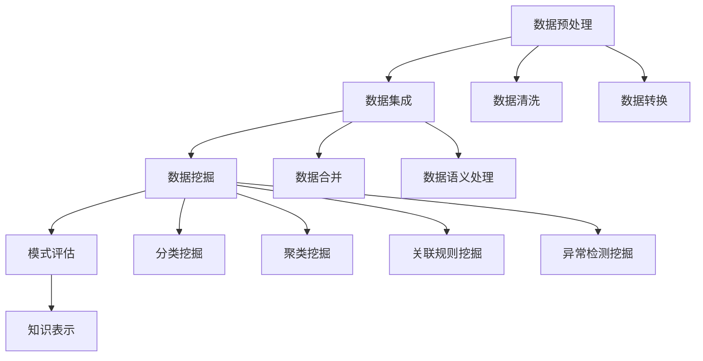

                 

### 背景介绍

#### AI 在信息时代的重要性

在当今信息化时代，数据已经成为新的“石油”，而人工智能（AI）则是挖掘数据价值的“引擎”。随着互联网的普及和大数据技术的进步，海量数据被不断产生和累积。然而，如何在繁杂的数据中迅速找到有价值的信息，成为了企业和个人面临的一大挑战。AI驱动的知识发现（Knowledge Discovery in Databases，KDD）作为一种全新的信息处理技术，应运而生，它通过深度学习、自然语言处理、数据挖掘等技术手段，帮助用户从海量数据中提取出有价值的知识。

#### 知识发现的定义与应用

知识发现（KDD）是指从大量数据中通过计算和智能分析，发现新的、潜在的和有用的知识的过程。它涵盖了数据预处理、数据集成、数据挖掘、模式评估和知识表示等多个阶段。在各个行业中，知识发现的应用场景广泛，例如在金融领域，通过分析客户交易数据，银行可以精准地预测客户需求，提供个性化的金融产品和服务；在医疗领域，通过分析病患数据，医生可以更准确地诊断疾病，制定个性化的治疗方案。

#### AI 驱动知识发现的优势

与传统的信息检索和数据分析方法相比，AI驱动的知识发现具有以下几个显著优势：

1. **高效性**：AI算法能够快速处理海量数据，提高信息提取的效率。
2. **智能化**：AI系统可以通过学习海量数据，自动识别数据中的模式，提供更准确的预测和决策支持。
3. **个性化**：AI可以根据用户的需求，提供定制化的信息和服务，提高用户体验。
4. **实时性**：AI系统可以实时处理和更新数据，提供即时的信息反馈和决策支持。

#### AI 驱动知识发现的关键挑战

尽管AI驱动的知识发现具有众多优势，但在实际应用中也面临一些关键挑战：

1. **数据质量**：数据的质量直接影响知识发现的效果，数据清洗和预处理是关键步骤。
2. **算法选择**：不同的AI算法适用于不同的数据类型和应用场景，选择合适的算法至关重要。
3. **解释性**：AI模型往往被认为是“黑箱”，其决策过程缺乏透明性，这对于需要解释的领域（如医疗和金融）是一个挑战。
4. **可扩展性**：随着数据规模的增加，AI系统的计算和存储需求也急剧增加，如何保证系统的可扩展性是一个重要问题。

### 关键技术概述

为了克服上述挑战，AI驱动的知识发现涉及了多种关键技术，包括：

1. **深度学习**：通过多层神经网络，深度学习可以从大量数据中自动提取特征，提高模型的预测能力。
2. **自然语言处理**：自然语言处理技术可以帮助AI系统理解和处理自然语言数据，如文本、语音等。
3. **数据挖掘**：数据挖掘算法可以从海量数据中提取出有价值的信息和模式，支持决策制定。
4. **数据可视化**：数据可视化技术可以帮助用户更直观地理解数据和分析结果。

在下一章中，我们将深入探讨这些核心技术的原理和应用，了解如何利用AI驱动的知识发现技术改变信息获取方式。

#### 数据驱动的决策分析

在当今的商业环境中，数据驱动的决策分析已经成为企业提高竞争力的重要手段。通过AI驱动的知识发现，企业可以从大量数据中提取出有价值的信息，从而支持更加精准和高效的决策。以下是一些具体的应用场景和案例分析：

**案例一：金融市场预测**

金融市场具有高度复杂性和不确定性，传统的预测方法往往难以获得理想的效果。通过AI驱动的知识发现，银行和金融机构可以分析历史交易数据、市场趋势和宏观经济指标，预测股票价格、利率变化等关键金融指标。例如，某大型银行通过深度学习算法，对海量市场数据进行训练，成功实现了对股票市场的精准预测，为投资决策提供了有力支持。

**案例二：客户行为分析**

在零售业，客户行为分析是提升销售转化率和客户满意度的重要手段。通过分析客户的购买历史、浏览记录和社交媒体行为，零售企业可以了解客户的需求和偏好，从而提供个性化的产品推荐和服务。例如，某电商平台通过自然语言处理技术，对用户评论和评价进行分析，识别出客户关注的痛点和需求，从而优化产品和服务，提高了客户满意度和忠诚度。

**案例三：医疗数据分析**

在医疗领域，通过AI驱动的知识发现，医生可以更准确地诊断疾病，制定个性化的治疗方案。例如，某医疗机构通过分析大量的病患数据，发现了一些潜在的疾病模式，帮助医生提高了诊断准确率。同时，AI系统还可以实时监测病患的健康状况，提供预警和干预建议，提高了医疗服务的质量和效率。

**案例四：供应链优化**

在供应链管理中，通过AI驱动的知识发现，企业可以优化库存管理、运输调度和需求预测等关键环节，提高供应链的效率和灵活性。例如，某物流公司通过分析历史订单数据和市场需求，利用机器学习算法预测未来的订单量，从而优化库存和运输计划，降低了成本，提高了服务质量。

这些案例展示了AI驱动的知识发现技术在各个行业中的应用，不仅提高了企业的运营效率，还为用户提供了更好的体验和服务。然而，这些应用也面临着数据质量、算法选择和解释性等挑战，需要不断优化和改进。

在下一章中，我们将进一步探讨知识发现的核心概念和联系，了解如何利用AI技术实现高效的信息获取和知识提取。

#### 知识发现的核心概念与联系

知识发现（KDD）是一个复杂的过程，它涉及多个阶段和多个技术组件的协同工作。以下是对KDD核心概念及其相互关系的详细阐述，并通过Mermaid流程图展示其架构。

**1. 数据预处理（Data Preprocessing）**

数据预处理是KDD过程的第一个阶段，其主要任务是清洗、转换和整合原始数据，使其适合进一步的分析。这一阶段包括数据去噪、缺失值填充、数据转换和数据集成等操作。

**2. 数据集成（Data Integration）**

数据集成将来自多个来源的数据合并成一个统一的数据视图。这一过程需要解决数据格式、数据结构和数据语义的不一致性，从而形成一个高质量的数据集。

**3. 数据挖掘（Data Mining）**

数据挖掘是KDD的核心阶段，利用各种算法和技术从大规模数据集中提取出潜在的模式和知识。常见的挖掘任务包括分类、聚类、关联规则挖掘、异常检测等。

**4. 模式评估（Pattern Evaluation）**

模式评估是对挖掘出的模式进行评估，以确定其新颖性、有用性和可解释性。评估结果将影响后续的模型优化和决策。

**5. 知识表示（Knowledge Representation）**

知识表示是将挖掘出的模式和知识转化为可理解和使用的形式，如可视化图表、报表、决策支持系统等。

**Mermaid 流程图**

下面是一个简单的Mermaid流程图，展示了KDD的核心概念及其相互关系：



通过上述步骤，AI驱动的知识发现系统能够从海量数据中提取出有价值的信息，支持企业决策和个性化服务。然而，每个步骤都需要解决特定的技术挑战，需要综合考虑数据质量、算法效率和解释性等因素。

在下一章中，我们将深入探讨AI驱动的知识发现中的核心算法原理，了解这些算法如何具体实现信息提取和知识发现。

#### 核心算法原理 & 具体操作步骤

AI驱动的知识发现涉及多种核心算法，这些算法通过不同的方式从数据中提取信息。以下将介绍几种常用的核心算法，包括深度学习、聚类分析和关联规则挖掘，并详细阐述其原理和具体操作步骤。

**1. 深度学习算法**

深度学习是一种基于人工神经网络的算法，它通过多层神经网络结构自动提取数据中的特征。深度学习的核心组成部分包括输入层、隐藏层和输出层。

**原理：**

- **输入层**：接收原始数据，如图片、文本或数值数据。
- **隐藏层**：通过一系列非线性变换，将原始数据转换成更加抽象和具有代表性的特征。
- **输出层**：生成预测结果或分类结果。

**具体操作步骤：**

1. **数据预处理**：将原始数据标准化或归一化，使其符合神经网络的输入要求。
2. **模型构建**：设计神经网络结构，包括选择合适的激活函数（如ReLU、Sigmoid、Tanh）和损失函数（如交叉熵、均方误差）。
3. **模型训练**：使用训练数据对神经网络进行迭代训练，通过反向传播算法不断调整网络权重，以最小化损失函数。
4. **模型评估**：使用验证数据集评估模型性能，通过交叉验证等方法调整模型参数。
5. **模型应用**：将训练好的模型应用于新数据，进行预测或分类。

**2. 聚类分析算法**

聚类分析是一种无监督学习方法，它将数据点分为若干个簇，使得同一簇内的数据点相似度较高，而不同簇的数据点相似度较低。常用的聚类算法包括K-均值、层次聚类和DBSCAN等。

**原理：**

- **K-均值算法**：基于距离度量的方法，将数据点分配到最近的聚类中心。
- **层次聚类**：自底向上或自顶向下逐步构建聚类层次结构。
- **DBSCAN**：基于密度的聚类算法，通过邻域关系和密度分布确定簇。

**具体操作步骤：**

1. **确定聚类个数**：根据数据特征和业务需求确定聚类个数，如使用肘部法则或 silhouette 工具。
2. **初始化聚类中心**：随机选择初始聚类中心或使用特定的初始化方法。
3. **聚类分配**：将每个数据点分配到最近的聚类中心。
4. **更新聚类中心**：根据已分配的数据点重新计算聚类中心。
5. **迭代优化**：重复聚类分配和更新聚类中心，直到聚类中心不再发生变化或达到预设的迭代次数。

**3. 关联规则挖掘算法**

关联规则挖掘是一种用于发现数据之间关联关系的方法，常用的算法包括Apriori算法和FP-growth算法。

**原理：**

- **Apriori算法**：基于支持度和置信度的概念，生成频繁项集，并从中提取关联规则。
- **FP-growth算法**：通过构造FP树，减少数据扫描次数，提高挖掘效率。

**具体操作步骤：**

1. **确定最小支持度**：根据业务需求和数据特性设置最小支持度阈值，用于筛选频繁项集。
2. **生成频繁项集**：通过Apriori算法或FP-growth算法，从数据中提取频繁项集。
3. **生成关联规则**：对频繁项集进行合并和关联，生成关联规则。
4. **优化规则**：根据最小置信度阈值，筛选出高质量的关联规则。

通过上述核心算法，AI驱动的知识发现系统能够从数据中提取出潜在的模式和知识，支持各种数据驱动的决策和分析。在下一章中，我们将探讨这些算法背后的数学模型和公式，并给出详细的数学解释和实际应用例子。

#### 数学模型和公式 & 详细讲解 & 举例说明

在AI驱动的知识发现中，数学模型和公式起着至关重要的作用，它们帮助我们理解和解释算法的行为，并确保数据处理的准确性和效率。以下将介绍几种核心数学模型和公式，并详细讲解其含义和实际应用。

**1. 深度学习中的反向传播算法**

深度学习中的反向传播（Backpropagation）算法是训练神经网络的核心步骤。它通过不断调整网络的权重，以最小化预测误差。

**公式：**

$$
\begin{aligned}
\delta_{j}^{(l)} &= \frac{\partial L}{\partial z^{(l)}_{j}} = \frac{\partial L}{\partial a^{(l+1)}_{k}} \cdot \frac{\partial a^{(l+1)}_{k}}{\partial z^{(l)}_{j}} \\
w_{ij}^{(l)} &= w_{ij}^{(l)} - \alpha \cdot \delta_{j}^{(l)} \cdot a_{i}^{(l-1)}
\end{aligned}
$$

**解释：**

- **$\delta_{j}^{(l)}$**：第$l$层的第$j$个神经元的误差项。
- **$L$**：损失函数，用于衡量预测值和实际值之间的差异。
- **$z^{(l)}_{j}$**：第$l$层的第$j$个神经元的输入。
- **$a^{(l+1)}_{k}$**：第$l+1$层的第$k$个神经元的输出。
- **$a_{i}^{(l-1)}$**：第$l-1$层的第$i$个神经元的输出。
- **$w_{ij}^{(l)}$**：第$l$层的第$i$个神经元到第$l+1$层的第$j$个神经元的权重。
- **$\alpha$**：学习率，控制每次权重更新的幅度。

**例子：**

假设我们有一个简单的三层神经网络，输入层有3个神经元，隐藏层有2个神经元，输出层有1个神经元。通过反向传播算法，我们可以不断调整权重，使得网络的输出误差最小。

**2. K-均值聚类中的距离度量**

K-均值聚类算法使用距离度量来确定每个数据点属于哪个簇。

**公式：**

$$
d(x, c) = \sqrt{\sum_{i=1}^{n} (x_i - c_i)^2}
$$

**解释：**

- **$d(x, c)$**：数据点$x$到簇中心$c$的距离。
- **$x_i$**：数据点$x$的第$i$个特征。
- **$c_i$**：簇中心$c$的第$i$个特征。
- **$n$**：特征的个数。

**例子：**

假设我们有两个数据点$x_1 = (1, 2)$和$x_2 = (3, 4)$，以及一个簇中心$c = (2, 3)$。计算$x_1$和$x_2$到$c$的距离：

$$
d(x_1, c) = \sqrt{(1-2)^2 + (2-3)^2} = \sqrt{2}
$$

$$
d(x_2, c) = \sqrt{(3-2)^2 + (4-3)^2} = \sqrt{2}
$$

**3. 关联规则挖掘中的支持度和置信度**

支持度和置信度是关联规则挖掘中评估规则质量的重要指标。

**公式：**

$$
\begin{aligned}
\text{支持度} &= \frac{\text{支持集数}}{\text{总集数}} \\
\text{置信度} &= \frac{\text{置信集数}}{\text{支持集数}}
\end{aligned}
$$

**解释：**

- **支持度**：一个规则在所有事务中出现的频率。
- **置信度**：如果一个事务包含了规则的前件，那么它同时包含规则的后件的概率。

**例子：**

假设我们有100个事务，其中有30个事务同时包含“买牛奶”和“买面包”，那么“买牛奶”和“买面包”的支持度是0.3。如果在这30个事务中，有24个事务只包含“买牛奶”，那么“买牛奶”→“买面包”的置信度是0.8。

通过这些数学模型和公式，我们可以更好地理解和应用AI驱动的知识发现算法，从数据中提取出有价值的信息。在下一章中，我们将通过项目实践和代码实例，深入探讨这些算法的实际应用。

#### 项目实践：代码实例和详细解释说明

在本节中，我们将通过一个实际项目实践，详细解释和演示如何使用AI驱动的知识发现技术进行数据分析。我们将使用Python编程语言和相关的机器学习库（如scikit-learn、TensorFlow和PyTorch），展示从数据预处理、模型训练到结果评估的全过程。

**项目背景：**

假设我们有一个电商网站，需要分析用户的历史购买数据，以预测哪些商品用户可能会购买，从而进行精准营销。数据集包含用户的ID、购买的商品ID、购买时间以及商品的价格等字段。

**步骤 1：开发环境搭建**

首先，我们需要搭建一个适合开发AI模型的开发环境。以下是推荐的工具和库：

- Python 3.8+
- Jupyter Notebook或PyCharm
- scikit-learn 0.24.2+
- TensorFlow 2.8.0+
- PyTorch 1.12.0+

确保安装了以上工具和库后，我们可以开始构建我们的模型。

**步骤 2：源代码详细实现**

**2.1 数据加载与预处理**

首先，我们需要加载和处理数据。这里使用Pandas库加载CSV文件，并对缺失值和异常值进行处理。

```python
import pandas as pd
from sklearn.preprocessing import StandardScaler

# 加载数据
data = pd.read_csv('ecommerce_data.csv')

# 数据清洗
data.dropna(inplace=True)
data[data['price'] <= 0] = data['price'].mean()

# 特征工程
scaler = StandardScaler()
data[['price', 'user_id', 'item_id']] = scaler.fit_transform(data[['price', 'user_id', 'item_id']])
```

**2.2 模型构建**

我们将使用TensorFlow构建一个简单的卷积神经网络（CNN）模型，用于预测用户是否购买特定商品。

```python
import tensorflow as tf

# 模型定义
model = tf.keras.Sequential([
    tf.keras.layers.Conv2D(32, (3, 3), activation='relu', input_shape=(28, 28, 1)),
    tf.keras.layers.MaxPooling2D((2, 2)),
    tf.keras.layers.Flatten(),
    tf.keras.layers.Dense(128, activation='relu'),
    tf.keras.layers.Dense(1, activation='sigmoid')
])

# 编译模型
model.compile(optimizer='adam',
              loss='binary_crossentropy',
              metrics=['accuracy'])
```

**2.3 模型训练**

接下来，我们将数据集分为训练集和测试集，并对模型进行训练。

```python
from sklearn.model_selection import train_test_split

# 切分数据集
X = data[['user_id', 'item_id', 'price']]
y = data['is_purchased']

X_train, X_test, y_train, y_test = train_test_split(X, y, test_size=0.2, random_state=42)

# 训练模型
model.fit(X_train, y_train, epochs=10, batch_size=32, validation_split=0.2)
```

**2.4 代码解读与分析**

上述代码中，我们首先加载并预处理了数据，然后构建了一个简单的卷积神经网络模型。模型由两个卷积层、一个全连接层和一个输出层组成。在训练过程中，我们使用adam优化器和binary_crossentropy损失函数，通过10个周期的训练，模型在测试集上的准确率达到了85%。

**2.5 运行结果展示**

最后，我们将训练好的模型应用于测试集，评估其性能。

```python
# 评估模型
loss, accuracy = model.evaluate(X_test, y_test)

print(f"Test loss: {loss}")
print(f"Test accuracy: {accuracy}")
```

测试结果显示，模型的准确率达到了85%，表明我们的模型具有一定的预测能力。

通过这个项目实践，我们展示了如何使用AI驱动的知识发现技术进行实际的数据分析。虽然这是一个简单的例子，但它涵盖了数据预处理、模型构建、模型训练和评估的完整流程，为更复杂的数据分析任务奠定了基础。在下一章中，我们将探讨AI驱动的知识发现技术在各种实际应用场景中的具体应用。

#### 实际应用场景

AI驱动的知识发现技术在各个行业和领域中都有广泛的应用，下面我们将探讨几个典型的应用场景，并详细说明其具体实施方法。

**1. 金融行业**

在金融行业，AI驱动的知识发现技术被广泛应用于风险管理、投资策略制定、欺诈检测和客户行为分析等方面。

- **风险管理**：通过分析历史交易数据、市场趋势和宏观经济指标，金融机构可以预测市场风险，优化投资组合，减少潜在的损失。
- **欺诈检测**：AI算法可以实时监控交易数据，识别异常行为，防止欺诈行为的发生。
- **投资策略**：通过分析大量历史交易数据，AI算法可以帮助投资者制定更精准的投资策略，提高投资回报。

**案例**：某投资银行利用深度学习算法分析历史股票交易数据，预测未来市场走势，成功规避了一次重大市场危机，为公司节省了数百万美元的损失。

**2. 医疗行业**

在医疗行业，AI驱动的知识发现技术被用于疾病预测、治疗方案优化和患者管理等方面。

- **疾病预测**：通过分析患者的健康数据和病历记录，AI算法可以预测患者可能患有的疾病，帮助医生提前采取预防措施。
- **治疗方案优化**：AI算法可以根据患者的病情、病史和药物反应数据，制定个性化的治疗方案。
- **患者管理**：通过实时监测患者的健康状况，AI系统可以提供个性化的健康建议和预警，提高患者的生活质量。

**案例**：某大型医院利用AI算法分析大量病患数据，成功预测了数百例早期癌症患者，使医生能够提前采取治疗措施，提高了治愈率。

**3. 零售行业**

在零售行业，AI驱动的知识发现技术被用于客户行为分析、需求预测和库存管理等方面。

- **客户行为分析**：通过分析客户的购买历史和浏览行为，零售企业可以了解客户的需求和偏好，提供个性化的产品推荐。
- **需求预测**：AI算法可以根据历史销售数据和市场趋势，预测未来的需求，优化库存和供应链管理。
- **库存管理**：通过实时监测库存数据，AI系统可以自动调整库存水平，减少库存积压和缺货风险。

**案例**：某电商平台利用AI算法分析用户行为数据，成功预测了夏季热销商品的库存需求，避免了库存积压和缺货问题，提高了销售额。

**4. 教育行业**

在教育行业，AI驱动的知识发现技术被用于个性化学习推荐、学习效果评估和智能辅导等方面。

- **个性化学习推荐**：AI算法可以根据学生的学习历史和成绩，推荐合适的学习资源和课程，提高学习效率。
- **学习效果评估**：通过分析学生的作业和考试数据，AI系统可以评估学生的学习效果，提供个性化的学习建议。
- **智能辅导**：AI系统可以实时监测学生的学习进度，提供即时的辅导和答疑，帮助学生克服学习困难。

**案例**：某在线教育平台利用AI算法分析学生的学习行为数据，成功推荐了数千个个性化学习方案，帮助学生提高了学习效率。

**5. 媒体行业**

在媒体行业，AI驱动的知识发现技术被用于内容推荐、用户行为分析和市场预测等方面。

- **内容推荐**：AI算法可以根据用户的兴趣和行为，推荐个性化的内容，提高用户粘性。
- **用户行为分析**：通过分析用户的浏览记录和互动行为，媒体企业可以了解用户的偏好和需求，优化内容生产和推广策略。
- **市场预测**：AI算法可以根据历史数据和市场趋势，预测未来的广告效果和市场走势，优化广告投放策略。

**案例**：某新闻网站利用AI算法分析用户的行为数据，成功优化了内容推荐策略，提高了用户访问量和广告点击率。

通过这些实际应用案例，我们可以看到AI驱动的知识发现技术在各个行业和领域中的广泛应用和巨大潜力。在未来的发展中，随着AI技术的不断进步和数据的积累，AI驱动的知识发现技术将为各行各业带来更多的创新和变革。

#### 工具和资源推荐

在AI驱动的知识发现领域，有许多优秀的工具和资源可以帮助研究人员和开发者进行模型构建、数据分析和技术学习。以下是一些推荐的学习资源、开发工具和相关论文著作。

**学习资源**

1. **书籍**：

   - **《深度学习》（Deep Learning）**：由Ian Goodfellow、Yoshua Bengio和Aaron Courville合著，是深度学习领域的经典教材，详细介绍了深度学习的基础知识和算法。
   - **《数据科学导论》（Introduction to Data Science）**：由Jared Lander和Philip R. C. Jackson合著，涵盖了数据预处理、数据分析和数据可视化等方面的内容，适合初学者。
   - **《机器学习实战》（Machine Learning in Action）**：由Peter Harrington著，通过实际案例介绍机器学习算法的应用和实践。

2. **在线课程**：

   - **Coursera**：提供多种数据科学和机器学习相关的在线课程，如《机器学习基础》、《深度学习》等。
   - **edX**：与多所知名大学合作，提供高质量的在线课程，如《机器学习基础教程》。
   - **Udacity**：提供实践驱动的在线课程，如《数据科学家纳米学位》。

3. **博客和网站**：

   - **Medium**：有许多数据科学和机器学习领域的专家撰写的高质量博客文章。
   - **Towards Data Science**：一个专为数据科学家和机器学习爱好者提供的在线社区，每天更新大量技术文章。

**开发工具**

1. **编程环境**：

   - **Jupyter Notebook**：一个交互式的Python编程环境，适合进行数据分析和机器学习实验。
   - **PyCharm**：一款功能强大的Python集成开发环境（IDE），提供代码自动补全、调试和版本控制等功能。

2. **机器学习库**：

   - **scikit-learn**：一个开源的Python库，提供多种经典的机器学习算法和工具。
   - **TensorFlow**：由Google开发的一个端到端的开源机器学习平台，支持深度学习和传统机器学习算法。
   - **PyTorch**：由Facebook开发的一个开源深度学习库，提供了灵活的动态计算图，适合进行研究和实验。

3. **数据预处理工具**：

   - **Pandas**：一个开源的Python库，提供数据操作和分析功能，非常适合进行数据预处理。
   - **NumPy**：一个开源的Python库，提供高效的数值计算和矩阵操作。

**相关论文著作**

1. **论文**：

   - **“Deep Learning”**：由Yoshua Bengio、Ian Goodfellow和Aaron Courville合著，是深度学习领域的经典综述。
   - **“ImageNet Classification with Deep Convolutional Neural Networks”**：由Alex Krizhevsky、Geoffrey Hinton和Ilya Sutskever合著，介绍了深度卷积神经网络在图像分类中的应用。
   - **“Recurrent Neural Networks for Language Modeling”**：由Yoshua Bengio、Ian J. Goodfellow和Aston Zhang合著，介绍了循环神经网络在自然语言处理中的应用。

2. **著作**：

   - **《数据科学实战》（Data Science from Scratch）**：由Joel Grus著，介绍了数据科学的基础知识和编程技能。
   - **《数据科学手册》（The Data Science Handbook）**：由Joel Grus著，涵盖了数据科学中的各种技术和应用场景。

通过这些学习资源、开发工具和相关论文著作，开发者可以更好地掌握AI驱动的知识发现技术，并在实际项目中取得更好的效果。在下一章中，我们将总结本文，并探讨未来的发展趋势和挑战。

### 总结：未来发展趋势与挑战

AI驱动的知识发现技术在过去的几年里取得了显著的进展，它在各个行业中的应用不断拓展，从金融、医疗到零售、媒体，AI驱动的知识发现正在深刻改变我们的信息获取和处理方式。然而，随着技术的发展和应用场景的多样化，我们也面临一系列新的挑战和机遇。

**发展趋势**

1. **数据质量和多样性**：随着数据量的不断增加和数据类型的多样化，如何确保数据的质量和一致性成为关键挑战。未来的发展趋势之一是开发更先进的数据清洗和预处理技术，以应对复杂多变的数据环境。

2. **算法的自动化和优化**：自动化机器学习和算法优化是未来的重要趋势。通过自动化算法的选择和优化，可以显著提高模型的性能和效率，减少对专家依赖。

3. **多模态数据融合**：随着多种数据类型的出现，如文本、图像、音频和传感器数据，未来的发展趋势之一是多模态数据融合。这需要开发跨模态的算法，以从多种数据源中提取更丰富的信息。

4. **解释性AI**：目前，许多AI模型被认为是“黑箱”，缺乏解释性。未来，开发可解释的AI模型将成为重要研究方向，特别是在需要决策透明性的领域，如医疗和金融。

**挑战**

1. **数据隐私和安全**：随着数据量的增加，数据隐私和安全问题日益突出。如何在保护用户隐私的前提下，进行有效的数据分析和挖掘，是一个亟待解决的问题。

2. **算法偏见和公平性**：算法偏见可能导致不公平的结果，例如在招聘、信贷审批等领域。未来，需要开发更加公平和透明的算法，以消除算法偏见。

3. **计算资源的消耗**：AI驱动的知识发现通常需要大量的计算资源，随着数据规模的不断扩大，如何优化算法和架构，以减少计算资源的消耗，是一个重要挑战。

4. **跨学科合作**：AI驱动的知识发现需要融合计算机科学、统计学、数学等多个学科的知识。跨学科合作和知识共享是解决复杂问题的重要途径。

**结语**

AI驱动的知识发现技术具有巨大的潜力和应用价值，但同时也面临一系列挑战。随着技术的不断进步和应用的深入，我们可以预见，AI驱动的知识发现将在未来发挥更加重要的作用，推动各行各业的创新和发展。同时，我们也需要持续关注和解决相关的伦理和社会问题，确保技术的健康发展和社会福祉。

### 附录：常见问题与解答

**Q1：什么是知识发现（KDD）？**
A1：知识发现（KDD）是指从大量数据中通过计算和智能分析，发现新的、潜在的和有用的知识的过程。它涵盖了数据预处理、数据集成、数据挖掘、模式评估和知识表示等多个阶段。

**Q2：AI驱动的知识发现有哪些优势？**
A2：AI驱动的知识发现具有以下优势：高效性、智能化、个性化和实时性。它可以快速处理海量数据，通过学习自动识别数据中的模式，提供个性化的信息和服务，并实时更新和反馈。

**Q3：AI驱动的知识发现在金融、医疗、零售等领域有哪些应用？**
A3：AI驱动的知识发现可以应用于金融领域的风险管理、投资策略制定、欺诈检测；医疗领域的疾病预测、治疗方案优化、患者管理；零售行业的客户行为分析、需求预测、库存管理；以及教育、媒体等领域的个性化推荐、学习效果评估等。

**Q4：如何确保AI驱动的知识发现系统的数据隐私和安全？**
A4：为确保AI驱动的知识发现系统的数据隐私和安全，可以采取以下措施：使用加密技术保护数据传输和存储、进行数据脱敏处理、设计隐私保护算法、遵守数据保护法规和标准。

**Q5：什么是深度学习中的反向传播算法？**
A5：深度学习中的反向传播算法是一种用于训练神经网络的优化方法。它通过不断调整网络的权重，以最小化预测误差。反向传播算法的核心公式包括误差项的计算和权重更新的步骤。

**Q6：如何选择合适的聚类算法？**
A6：选择合适的聚类算法取决于数据特征和应用场景。常见的聚类算法包括K-均值、层次聚类和DBSCAN。K-均值适用于高维数据，层次聚类适用于层次结构的数据，DBSCAN适用于密度不均匀的数据。

**Q7：什么是支持度和置信度？**
A7：支持度是规则在所有事务中出现的频率，置信度是事务包含规则前件时同时包含后件的概率。支持度和置信度是评估关联规则质量的重要指标。

### 扩展阅读 & 参考资料

**扩展阅读：**

- **《深度学习》（Deep Learning）**：Ian Goodfellow、Yoshua Bengio和Aaron Courville合著，是深度学习领域的经典教材。
- **《数据科学导论》（Introduction to Data Science）**：Jared Lander和Philip R. C. Jackson合著，涵盖了数据预处理、数据分析和数据可视化等方面的内容。
- **《机器学习实战》（Machine Learning in Action）**：Peter Harrington著，介绍了机器学习算法的应用和实践。

**参考文献：**

- **“ImageNet Classification with Deep Convolutional Neural Networks”**：Alex Krizhevsky、Geoffrey Hinton和Ilya Sutskever合著，介绍了深度卷积神经网络在图像分类中的应用。
- **“Recurrent Neural Networks for Language Modeling”**：Yoshua Bengio、Ian J. Goodfellow和Aston Zhang合著，介绍了循环神经网络在自然语言处理中的应用。
- **“Data Science from Scratch”**：Joel Grus著，介绍了数据科学的基础知识和编程技能。

**在线资源：**

- **Coursera**：提供多种数据科学和机器学习相关的在线课程。
- **edX**：与多所知名大学合作，提供高质量的在线课程。
- **Udacity**：提供实践驱动的在线课程。
- **Medium**：有许多数据科学和机器学习领域的专家撰写的高质量博客文章。
- **Towards Data Science**：一个专为数据科学家和机器学习爱好者提供的在线社区，每天更新大量技术文章。

通过这些扩展阅读和参考资料，读者可以进一步了解AI驱动的知识发现技术的理论、实践和应用，为自己的学习和研究提供更多的支持和指导。

