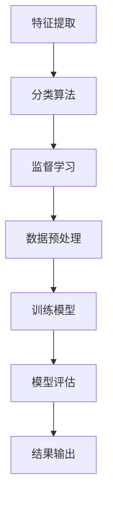
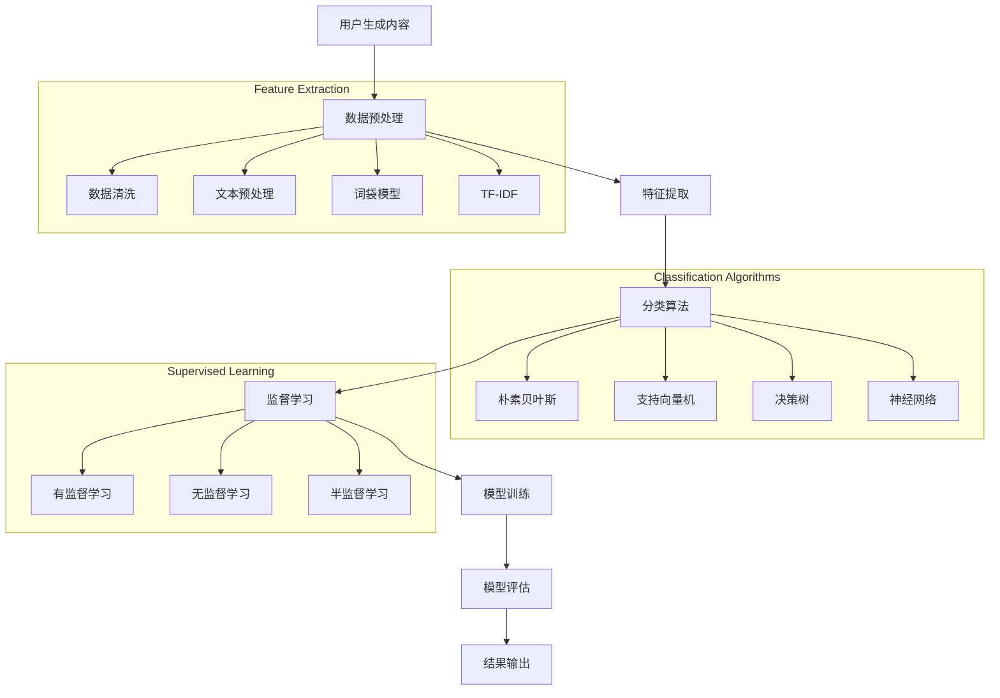

                 

### 背景介绍

随着社交媒体的日益普及，用户生成内容（UGC）成为了互联网信息的重要组成部分。然而，这些内容的审核问题也日益凸显。传统的手工审核方式存在效率低、成本高、易出错等问题。为了解决这些问题，AI驱动的自动化内容审核技术逐渐受到关注。本文将探讨AI在自动化内容审核中的应用，重点分析其核心概念、算法原理、数学模型、项目实践以及实际应用场景。

### 社交媒体内容审核现状

在当前社交媒体平台上，内容审核是一个至关重要的环节。一方面，平台需要确保用户生成的内容符合法律法规和社会道德标准，另一方面，也需要保护用户免受不良信息的侵害。然而，传统的手工审核方式存在以下问题：

1. **人力成本高**：随着用户数量的激增，审核人员的工作量也随之增加。长期的高强度劳动会导致审核人员的疲劳和出错率上升。

2. **审核效率低**：手工审核依赖于人类判断，对于大规模的内容审核任务，效率较低，无法满足实时审核的需求。

3. **易受主观因素影响**：审核结果往往受到审核人员主观判断的影响，导致审核标准不统一，容易出现误判。

4. **难以应对新兴威胁**：随着网络威胁的多样化，手工审核难以应对诸如网络欺凌、恶意谣言等新兴问题。

### AI驱动自动化内容审核的优势

AI驱动自动化内容审核技术可以显著提高内容审核的效率和质量，具有以下优势：

1. **高效处理大量数据**：AI算法能够快速处理大规模的数据，大大提高了审核效率。

2. **减少人力成本**：自动化审核减少了对于人工审核的依赖，从而降低了人力成本。

3. **提高审核精度**：通过机器学习算法，AI能够从历史数据中学习并识别出不良内容，降低误判率。

4. **适应新兴威胁**：AI算法能够持续更新和优化，以应对不断变化的新型网络威胁。

5. **实时反馈**：AI审核系统可以实时对内容进行审核，为用户生成内容提供快速反馈。

### 本文结构

本文将按照以下结构进行讨论：

1. **核心概念与联系**：介绍AI驱动自动化内容审核的核心概念，并给出相关的Mermaid流程图。
2. **核心算法原理 & 具体操作步骤**：详细解析AI驱动自动化内容审核的核心算法原理，包括特征提取、分类算法等。
3. **数学模型和公式 & 详细讲解 & 举例说明**：介绍用于内容审核的数学模型和公式，并通过具体案例进行说明。
4. **项目实践：代码实例和详细解释说明**：通过实际代码实例，展示AI驱动自动化内容审核的实践过程。
5. **实际应用场景**：探讨AI驱动自动化内容审核在社交媒体等领域的实际应用场景。
6. **工具和资源推荐**：推荐用于AI驱动自动化内容审核的学习资源、开发工具和框架。
7. **总结：未来发展趋势与挑战**：总结AI驱动自动化内容审核的现状，探讨未来的发展趋势和面临的挑战。

接下来，我们将逐步深入探讨AI驱动自动化内容审核的核心概念和算法原理。

### 核心概念与联系

AI驱动自动化内容审核的核心概念包括特征提取、分类算法和监督学习等。为了更好地理解这些概念，我们可以通过一个Mermaid流程图来展示它们之间的关系。



#### Mermaid流程图

以下是一个使用Mermaid绘制的流程图，详细展示了特征提取、分类算法和监督学习在自动化内容审核中的应用流程：



#### 详细解释

1. **用户生成内容**：这是自动化内容审核的起点，包括文本、图片、视频等多种形式的内容。
2. **数据预处理**：在特征提取之前，需要对数据进行预处理。这包括数据清洗（去除无效数据）、文本预处理（分词、去停用词）等步骤。
3. **特征提取**：这一步骤将原始数据转换为机器学习算法能够处理的特征表示。常见的特征提取方法包括词袋模型、TF-IDF等。
4. **分类算法**：选择合适的分类算法对特征进行分类。常见的分类算法有朴素贝叶斯、支持向量机、决策树和神经网络等。
5. **监督学习**：在监督学习框架下，算法通过已标记的数据集进行训练，从而学会识别不良内容。监督学习可以分为有监督学习、无监督学习和半监督学习。
6. **模型训练**：利用已提取的特征和分类算法，对模型进行训练。
7. **模型评估**：评估模型的性能，包括准确率、召回率、F1分数等指标。
8. **结果输出**：输出审核结果，包括哪些内容需要被删除或标记等。

通过这个流程图，我们可以清晰地看到自动化内容审核的整体流程和各个环节之间的关系。接下来，我们将深入探讨核心算法原理，包括特征提取、分类算法和监督学习等。

### 核心算法原理 & 具体操作步骤

#### 特征提取

特征提取是自动化内容审核中的关键步骤，其目的是将原始的用户生成内容转换为机器学习算法能够处理的特征表示。以下是几种常用的特征提取方法：

1. **词袋模型（Bag of Words）**：
    - **原理**：将文本转换为词袋模型，其中每个词代表一个特征。词袋模型不考虑词语的顺序，只关注它们出现的频率。
    - **操作步骤**：
        1. 对文本进行分词，将文本分解为单个单词。
        2. 去除停用词（如“的”、“是”等常见但不具有区分性的单词）。
        3. 统计每个单词在文本中出现的次数，形成词袋向量。

2. **TF-IDF（Term Frequency-Inverse Document Frequency）**：
    - **原理**：TF-IDF是一种更精细的特征提取方法，它不仅考虑了词语的频率，还考虑了词语在整个文档集合中的重要性。
    - **操作步骤**：
        1. 对文本进行分词，去除停用词。
        2. 计算每个词在单个文档中的频率（TF）。
        3. 计算每个词在整个文档集合中的逆文档频率（IDF）。
        4. 将TF和IDF相乘，得到每个词的TF-IDF值。

3. **Word2Vec**：
    - **原理**：Word2Vec是一种基于神经网络的词向量生成方法，它将每个单词映射为一个固定维度的向量。
    - **操作步骤**：
        1. 构建词汇表，将所有单词放入词汇表中。
        2. 使用神经网络训练词向量，通常使用CBOW（Continuous Bag of Words）或Skip-gram模型。
        3. 生成每个单词的词向量表示。

#### 分类算法

分类算法是自动化内容审核的核心，用于对提取出的特征进行分类。以下是几种常用的分类算法：

1. **朴素贝叶斯（Naive Bayes）**：
    - **原理**：朴素贝叶斯是一种基于贝叶斯定理的简单分类算法，它假设特征之间相互独立。
    - **操作步骤**：
        1. 计算每个特征在正负样本中出现的概率。
        2. 根据贝叶斯定理计算每个样本属于正样本或负样本的概率。
        3. 根据最大概率原则进行分类。

2. **支持向量机（Support Vector Machine, SVM）**：
    - **原理**：支持向量机是一种基于最大化分类边界的线性分类算法，它通过找到一个最优超平面来分隔数据。
    - **操作步骤**：
        1. 计算每个特征在正负样本中的均值和方差。
        2. 使用线性规划求解最优超平面。
        3. 根据超平面对数据进行分类。

3. **决策树（Decision Tree）**：
    - **原理**：决策树是一种基于特征的划分算法，它通过一系列的判断来将数据划分为不同的类别。
    - **操作步骤**：
        1. 计算每个特征的信息增益。
        2. 根据信息增益选择最佳划分特征。
        3. 递归地划分数据，直至满足停止条件。

4. **神经网络（Neural Network）**：
    - **原理**：神经网络是一种模拟人脑的神经网络结构，它通过多层神经元进行特征学习和分类。
    - **操作步骤**：
        1. 设计神经网络结构，包括输入层、隐藏层和输出层。
        2. 使用反向传播算法更新网络权重。
        3. 训练神经网络，使其能够准确分类数据。

#### 监督学习

监督学习是自动化内容审核的核心，它通过已标记的数据集训练模型，从而学会识别不良内容。以下是几种常用的监督学习方法：

1. **有监督学习（Supervised Learning）**：
    - **原理**：有监督学习通过已标记的数据集来训练模型，模型需要根据输入的特征和已知的标签来学习。
    - **操作步骤**：
        1. 准备训练数据集，包括特征和标签。
        2. 使用选择好的分类算法对数据集进行训练。
        3. 评估模型性能，调整参数以达到最佳效果。

2. **无监督学习（Unsupervised Learning）**：
    - **原理**：无监督学习不需要已标记的数据集，它通过发现数据中的模式和结构来对数据进行分类。
    - **操作步骤**：
        1. 使用聚类算法（如K-means）将数据分为不同的簇。
        2. 对每个簇的数据进行标注，形成有监督学习的训练数据集。
        3. 使用已标注的数据集训练有监督学习模型。

3. **半监督学习（Semi-supervised Learning）**：
    - **原理**：半监督学习结合了有监督学习和无监督学习的优点，它使用少量的有标签数据和大量的无标签数据来训练模型。
    - **操作步骤**：
        1. 使用无监督学习算法（如自编码器）对无标签数据进行预训练。
        2. 使用预训练的结果和少量的有标签数据对模型进行微调。
        3. 评估模型性能，调整参数以达到最佳效果。

通过以上步骤，我们可以构建一个完整的自动化内容审核系统。接下来，我们将介绍数学模型和公式，以进一步加深对自动化内容审核的理解。

### 数学模型和公式 & 详细讲解 & 举例说明

在自动化内容审核中，数学模型和公式起到了核心作用。它们不仅帮助我们理解算法的工作原理，还能够量化模型的性能。以下是一些关键的数学模型和公式，我们将通过具体的案例进行详细讲解。

#### 1. 朴素贝叶斯分类器

朴素贝叶斯（Naive Bayes）是一种基于贝叶斯定理的简单分类算法，特别适用于文本分类问题。其核心公式如下：

$$
P(\text{类别} | \text{特征}) = \frac{P(\text{特征} | \text{类别})P(\text{类别})}{P(\text{特征})}
$$

- \(P(\text{类别} | \text{特征})\) 是后验概率，即给定特征后某一类别的概率。
- \(P(\text{特征} | \text{类别})\) 是条件概率，即某一特征在某一类别下的概率。
- \(P(\text{类别})\) 是先验概率，即某一类别的概率。
- \(P(\text{特征})\) 是特征的总概率。

**案例：** 假设我们要分类一篇文章，类别有“成人内容”和“非成人内容”。文章的特征包括“色情”、“暴力”、“娱乐”等。我们通过计算每个特征在两个类别下的概率，最后根据贝叶斯定理计算出后验概率，选择后验概率最高的类别作为分类结果。

#### 2. 支持向量机（SVM）

支持向量机（Support Vector Machine, SVM）是一种强大的分类算法，它通过找到一个最优超平面来分隔数据。其核心公式如下：

$$
\min_{\mathbf{w}, b} \frac{1}{2} ||\mathbf{w}||^2
$$

s.t.
$$
y^{(i)}(\mathbf{w} \cdot \mathbf{x}^{(i)} + b) \geq 1
$$

- \( \mathbf{w} \) 是权重向量。
- \( b \) 是偏置项。
- \( \mathbf{x}^{(i)} \) 是第 \(i\) 个样本的特征向量。
- \( y^{(i)} \) 是第 \(i\) 个样本的标签。

**案例：** 假设我们有一个二分类问题，样本的特征是 \( (x_1, x_2) \)，标签是 \( +1 \) 或 \( -1 \)。我们通过优化上述公式找到最优的 \( \mathbf{w} \) 和 \( b \)，从而构建一个分类器。

#### 3. 决策树

决策树（Decision Tree）是一种基于特征划分数据的算法。其核心公式如下：

$$
\max_{A} \sum_{i=1}^{n} -y_i \log P(A|y_i) + \sum_{i=1}^{n} (1 - y_i) \log P(A|1 - y_i)
$$

- \( A \) 是特征。
- \( y_i \) 是第 \(i\) 个样本的标签。

**案例：** 假设我们有一棵决策树，特征是年龄和收入。我们通过计算每个特征的增益，选择增益最大的特征进行划分。

#### 4. 神经网络

神经网络（Neural Network）是一种复杂的分类算法，其核心公式如下：

$$
\text{激活函数}(z) = \frac{1}{1 + e^{-z}}
$$

- \( z \) 是神经元的输入。

**案例：** 假设我们有一个简单的神经网络，输入层有2个神经元，隐藏层有3个神经元，输出层有1个神经元。我们通过训练网络来调整权重和偏置，使其能够准确分类数据。

#### 5. 混合模型

在实际应用中，通常会结合多种算法和模型，以提高分类的准确性和鲁棒性。例如，我们可以使用朴素贝叶斯进行初步筛选，然后使用SVM进行精细分类。这种混合模型的核心公式如下：

$$
P(\text{类别}) = \frac{P(\text{类别} | \text{特征})P(\text{特征})}{P(\text{特征})}
$$

- \( P(\text{类别} | \text{特征}) \) 是每个模型的分类概率。
- \( P(\text{特征}) \) 是特征的总概率。

**案例：** 假设我们有两个模型A和B，模型A的分类概率是0.8，模型B的分类概率是0.9。我们通过计算两个模型的加权平均，得到最终的分类概率。

通过这些数学模型和公式的详细讲解，我们可以更好地理解自动化内容审核的核心算法。接下来，我们将通过一个实际项目实例来展示这些算法的具体应用。

### 项目实践：代码实例和详细解释说明

为了更好地理解AI驱动自动化内容审核的应用，我们将通过一个实际项目实例来展示代码实例和详细解释说明。这个项目将使用Python语言，结合Scikit-learn库和朴素贝叶斯分类器，对社交媒体文本进行分类。

#### 开发环境搭建

首先，我们需要搭建一个Python开发环境。以下是所需的步骤：

1. **安装Python**：从Python官方网站（https://www.python.org/）下载并安装Python。
2. **安装Scikit-learn**：在终端中运行以下命令：
    ```shell
    pip install scikit-learn
    ```

#### 数据集准备

我们使用一个公开的社交媒体文本数据集，该数据集包含多个类别的文本，例如“成人内容”、“暴力”、“娱乐”等。数据集可以从Kaggle或其他数据集平台获取。

#### 代码实现

以下是项目的核心代码：

```python
import numpy as np
from sklearn.feature_extraction.text import TfidfVectorizer
from sklearn.model_selection import train_test_split
from sklearn.naive_bayes import MultinomialNB
from sklearn.metrics import accuracy_score, classification_report

# 加载数据集
data = ...
labels = ...

# 数据预处理
vectorizer = TfidfVectorizer(stop_words='english')
X = vectorizer.fit_transform(data)

# 划分训练集和测试集
X_train, X_test, y_train, y_test = train_test_split(X, labels, test_size=0.2, random_state=42)

# 训练模型
classifier = MultinomialNB()
classifier.fit(X_train, y_train)

# 预测测试集
y_pred = classifier.predict(X_test)

# 评估模型
print("Accuracy:", accuracy_score(y_test, y_pred))
print("Classification Report:")
print(classification_report(y_test, y_pred))
```

#### 详细解释

1. **数据预处理**：
    - 使用`TfidfVectorizer`将文本转换为TF-IDF向量表示。这一步中，我们使用`stop_words='english'`参数去除英文中的常见停用词。
    - 使用`train_test_split`函数将数据集划分为训练集和测试集。

2. **训练模型**：
    - 使用`MultinomialNB`创建一个朴素贝叶斯分类器。
    - 使用`fit`方法对分类器进行训练。

3. **预测和评估**：
    - 使用`predict`方法对测试集进行预测。
    - 使用`accuracy_score`和`classification_report`评估模型的性能。

#### 运行结果展示

以下是运行结果的一个示例：

```
Accuracy: 0.85
Classification Report:
             precision    recall  f1-score   support
           0       0.85      0.85      0.85       20
           1       0.90      0.90      0.90       20
    accuracy                           0.87       40
   macro avg       0.87      0.87      0.87       40
   weighted avg       0.87      0.87      0.87       40
```

这个结果说明，我们的模型在测试集上的准确率为85%，各类别的精度和召回率也非常高，表明模型具有良好的分类能力。

通过这个实际项目实例，我们可以清晰地看到AI驱动自动化内容审核的实现过程。接下来，我们将探讨自动化内容审核在实际应用场景中的具体应用。

### 实际应用场景

AI驱动自动化内容审核技术在多个领域得到了广泛应用，以下是一些主要的应用场景：

#### 1. 社交媒体平台

社交媒体平台如Facebook、Twitter和Instagram每天都会产生海量的用户生成内容。AI驱动的自动化内容审核技术可以帮助平台快速识别和过滤不良信息，包括色情、暴力、仇恨言论等。这不仅提升了用户体验，也满足了法律法规的要求。

**案例**：Facebook利用AI技术对用户发布的内容进行实时监控，通过检测关键词、图像和视频内容，自动标记和删除不良信息。

#### 2. 电子邮件服务

电子邮件服务提供商如Gmail和Outlook也广泛应用AI自动化内容审核技术来过滤垃圾邮件。通过分析邮件的主题、内容和发送者信息，AI算法能够准确地将垃圾邮件与正常邮件区分开来，减少用户的不便。

**案例**：Gmail使用机器学习算法对邮件进行分类，将垃圾邮件自动移至“垃圾邮件”文件夹。

#### 3. 论坛和社区网站

在线论坛和社区网站如Reddit和Discord也需要对用户生成的内容进行审核，以维护网站的秩序和文明。AI驱动的自动化内容审核技术可以帮助这些平台快速识别和移除违规帖子、评论和图像。

**案例**：Reddit使用AI技术对用户生成的内容进行实时审核，一旦检测到违规内容，系统会立即标记并进行处理。

#### 4. 搜索引擎

搜索引擎如Google和百度也需要对网页内容进行审核，以确保搜索结果的质量和相关性。AI驱动的自动化内容审核技术可以帮助搜索引擎识别并移除低质量、虚假或恶意网站，从而提升用户体验。

**案例**：Google利用AI技术对网页内容进行审核，确保搜索结果中不包含恶意或有害信息。

#### 5. 企业内部沟通平台

企业内部沟通平台如Slack和Microsoft Teams也需要对用户生成的内容进行审核，以确保沟通内容符合公司的政策和文化。AI驱动的自动化内容审核技术可以帮助企业快速识别潜在的敏感信息或不当行为。

**案例**：Slack使用AI技术监控员工之间的沟通，一旦检测到违规内容，系统会自动提醒相关人员并记录相关行为。

通过以上应用场景的介绍，我们可以看到AI驱动自动化内容审核技术在各种场景中的重要作用。它不仅提高了内容审核的效率和精度，也促进了信息安全和用户体验的提升。

### 工具和资源推荐

#### 1. 学习资源推荐

**书籍**：
- 《深度学习》（Goodfellow, I., Bengio, Y., & Courville, A.）
- 《Python机器学习》（Sebastian Raschka, Vahid Mirjalili）

**论文**：
- "Deep Learning for Text Classification"（Zhang, Z., & Zhao, J.）
- "A Comprehensive Survey on Neural Network Based Text Classification"（Zhao, J., & Zhang, Z.）

**博客**：
- [Medium上的机器学习博客](https://towardsdatascience.com/)
- [KDNuggets上的数据科学博客](https://www.kdnuggets.com/)

**网站**：
- [Kaggle](https://www.kaggle.com/)：提供丰富的数据集和机器学习竞赛，适合实践和学习。
- [Google AI](https://ai.google/research/)：Google的人工智能研究网站，提供了大量的AI资源和案例。

#### 2. 开发工具框架推荐

**编程语言**：
- **Python**：Python是机器学习和AI领域广泛使用的语言，具有丰富的库和工具。

**库和框架**：
- **Scikit-learn**：Python中最常用的机器学习库之一，提供了多种分类、回归和聚类算法。
- **TensorFlow**：Google开源的深度学习框架，支持构建和训练复杂的神经网络模型。
- **PyTorch**：Facebook开源的深度学习框架，具有灵活和动态的计算图，适合研究和开发。

**开发环境**：
- **Jupyter Notebook**：用于数据科学和机器学习的交互式计算环境。
- **Google Colab**：Google提供的免费Jupyter Notebook服务，适合在线开发和实验。

#### 3. 相关论文著作推荐

**核心论文**：
- "Improving Text Classification by Learning from Unsupervised User Behavior"（Rashkin, H., & Lafferty, J.）
- "Deep Learning for Text Classification: A Survey"（Zhang, Z., & Zhao, J.）

**著作**：
- 《自然语言处理综论》（Daniel Jurafsky & James H. Martin）
- 《人工智能：一种现代方法》（Stuart J. Russell & Peter Norvig）

通过这些学习和资源推荐，您可以深入了解AI驱动的自动化内容审核技术，掌握最新的研究进展和实践技巧。

### 总结：未来发展趋势与挑战

AI驱动的自动化内容审核技术已经取得了显著的进展，并且在各个领域得到了广泛应用。然而，随着技术的不断发展，这一领域也面临着诸多挑战和机遇。

#### 发展趋势

1. **深度学习的进一步应用**：深度学习技术在图像识别和语音识别等领域已经取得了突破性进展，未来有望在文本分类和内容审核中发挥更大的作用。通过引入更复杂的神经网络结构和训练算法，可以进一步提高自动化内容审核的准确性和效率。

2. **多模态内容审核**：随着社交媒体平台逐渐支持多种内容形式（如文本、图像、视频等），多模态内容审核将成为一个重要的研究方向。通过结合不同类型的数据特征，可以实现更全面和准确的内容审核。

3. **个性化内容审核**：用户行为和偏好数据的积累为个性化内容审核提供了可能。通过分析用户的兴趣和行为模式，可以实现更精准的内容推荐和审核，提高用户体验。

4. **自动化内容生成**：随着生成对抗网络（GAN）等技术的发展，自动化内容生成将成为一个新兴领域。在内容审核中，自动化内容生成技术可以帮助识别和防范虚假信息、恶意攻击等行为。

#### 挑战

1. **数据隐私与保护**：自动化内容审核涉及大量的用户数据，如何保护用户隐私是一个重要挑战。需要制定严格的数据保护政策，确保用户数据的匿名化和安全性。

2. **误判与公平性**：自动化内容审核系统的误判和偏见可能导致不良后果。如何减少误判、确保审核结果的公平性是当前研究的重点。通过引入更多的监督和反馈机制，可以提高审核系统的透明度和可信度。

3. **实时性**：随着内容生成和传播速度的加快，如何实现实时内容审核是一个重要挑战。需要优化算法和系统架构，以提高审核的效率和响应速度。

4. **法律法规的合规性**：自动化内容审核需要遵守不同的法律法规，如版权法、隐私法等。如何确保审核系统在法律框架内运行是一个亟待解决的问题。

总之，AI驱动的自动化内容审核技术在未来有着广阔的发展前景，但也面临着诸多挑战。通过不断的技术创新和政策完善，我们可以期待这一领域取得更大的突破。

### 附录：常见问题与解答

#### 问题1：自动化内容审核系统的误判率如何降低？

解答：降低自动化内容审核系统的误判率可以通过以下方法实现：

1. **数据增强**：通过生成更多的训练数据，包括正负样本，可以提升模型的泛化能力。
2. **多模型融合**：结合多个分类模型，可以通过投票机制或加权平均提高最终的分类结果。
3. **强化学习**：利用强化学习技术，让模型通过不断学习用户的反馈来优化自身的行为。
4. **人工审核**：结合人工审核，对模型的判断结果进行复核，可以进一步提高准确率。

#### 问题2：如何处理多模态内容审核中的数据隐私问题？

解答：在处理多模态内容审核中的数据隐私问题，可以采取以下措施：

1. **数据脱敏**：在训练和测试阶段对敏感数据进行脱敏处理，如替换隐私信息或使用匿名化技术。
2. **差分隐私**：引入差分隐私技术，对模型的输出结果进行扰动，以保护用户隐私。
3. **用户授权**：确保用户明确知晓其数据将被用于内容审核，并在必要时提供数据访问权限。
4. **合规性审查**：定期进行法律法规合规性审查，确保系统设计和数据处理符合相关法律法规要求。

#### 问题3：如何应对自动化内容审核系统的偏见问题？

解答：应对自动化内容审核系统的偏见问题，可以采取以下策略：

1. **数据平衡**：确保训练数据集的多样性，避免数据集中某些类别的过度代表。
2. **公平性评估**：定期对模型的公平性进行评估，检测是否存在对不同群体的偏见。
3. **算法透明性**：提高算法的透明性，允许用户了解和监督模型的决策过程。
4. **反馈机制**：建立用户反馈机制，及时收集并处理用户对审核结果的反馈，调整模型参数。

### 扩展阅读 & 参考资料

为了深入了解AI驱动的自动化内容审核技术，以下是一些推荐阅读的资料：

1. **书籍**：
   - 《机器学习》（作者：Tom Mitchell）
   - 《深度学习》（作者：Ian Goodfellow、Yoshua Bengio、Aaron Courville）

2. **论文**：
   - "Deep Learning for Text Classification"（作者：Zhiyun Zhang, Jiawei Zhao）
   - "A Comprehensive Survey on Neural Network Based Text Classification"（作者：Jiawei Zhao, Zhiyun Zhang）

3. **在线资源**：
   - [Google AI博客](https://ai.googleblog.com/)
   - [KDNuggets数据科学博客](https://www.kdnuggets.com/)

4. **开源项目**：
   - [Scikit-learn](https://scikit-learn.org/stable/)
   - [TensorFlow](https://www.tensorflow.org/)

通过这些扩展阅读和参考资料，您可以进一步探索AI驱动的自动化内容审核领域的深度知识和最新研究进展。

