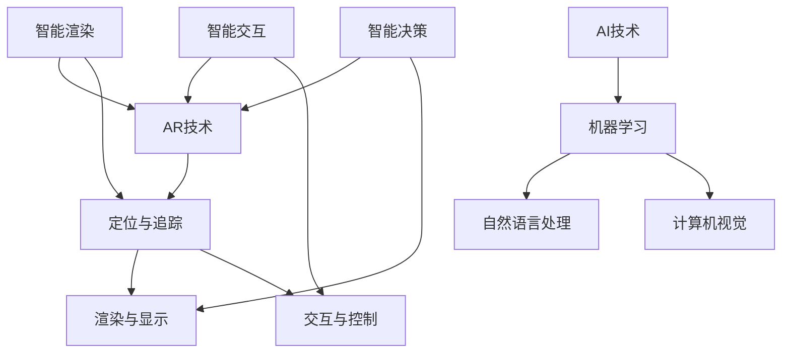

                 

### 背景介绍 Background Introduction

增强现实（Augmented Reality，简称 AR）技术作为一项前沿技术，近年来在全球范围内获得了迅猛发展。AR 技术通过将计算机生成的图像、视频、声音等多媒体信息叠加到真实世界中，为用户带来了一种全新的交互体验。AR 技术的应用场景广泛，从游戏娱乐到教育医疗，从制造业到零售业，AR 技术都展现出了强大的潜力和广泛的应用前景。

与此同时，人工智能（Artificial Intelligence，简称 AI）作为推动科技发展的重要力量，已经深刻影响了各个行业。AI 技术通过模拟人类智能行为，实现了数据挖掘、图像识别、自然语言处理等功能，极大地提升了计算效率和决策能力。

本文将探讨 AR 技术与 AI 技术的结合，分析如何通过技术融合和创新，提升用户体验。文章将分为以下几个部分：

1. **背景介绍**：介绍 AR 和 AI 技术的背景和发展现状。
2. **核心概念与联系**：阐述 AR 和 AI 技术的核心概念及其关联。
3. **核心算法原理 & 具体操作步骤**：详细讲解 AR 和 AI 技术结合的关键算法和操作步骤。
4. **数学模型和公式 & 详细讲解 & 举例说明**：介绍相关的数学模型和公式，并进行详细讲解和实例说明。
5. **项目实践：代码实例和详细解释说明**：通过实际项目实例，展示 AR 和 AI 技术结合的具体实现过程。
6. **实际应用场景**：分析 AR 和 AI 技术结合后的应用场景和优势。
7. **工具和资源推荐**：推荐相关学习资源和开发工具。
8. **总结：未来发展趋势与挑战**：总结当前技术融合的现状，探讨未来发展趋势和面临的挑战。
9. **附录：常见问题与解答**：回答一些常见问题，帮助读者更好地理解 AR 和 AI 技术的结合。
10. **扩展阅读 & 参考资料**：提供更多扩展阅读资料，供读者深入研究。

接下来，我们将逐步深入探讨 AR 和 AI 技术的结合，分析其背后的原理和具体实现方法。希望通过本文，能够为读者提供有价值的见解和启示。

### 核心概念与联系 Core Concepts and Connections

在探讨 AR 技术与 AI 技术的结合之前，首先需要了解这两项技术的核心概念及其关联。

#### 增强现实（AR）技术

增强现实（AR）是一种通过计算机技术将虚拟信息与现实世界融合的技术。AR 技术的核心在于实时地将数字信息叠加到真实环境中，使用户能够在现实世界中看到、听到、触摸到这些虚拟信息。AR 技术的关键组成部分包括：

1. **定位与追踪**：通过摄像头和传感器实时获取用户的位置和动作信息，实现虚拟信息与现实世界的空间映射。
2. **渲染与显示**：将虚拟信息渲染成图像或视频，并显示在显示屏或其他显示设备上。
3. **交互与控制**：提供用户与虚拟信息的交互方式，如手势、声音等。

#### 人工智能（AI）技术

人工智能（AI）是一种通过计算机模拟人类智能行为的技术。AI 技术的核心在于通过学习和推理，使计算机具备自主决策和完成任务的能力。AI 技术的关键组成部分包括：

1. **机器学习**：通过数据训练模型，使计算机具备自动学习和优化能力。
2. **自然语言处理**：使计算机能够理解和处理自然语言，实现人机对话。
3. **计算机视觉**：使计算机具备识别和理解图像和视频的能力。

#### AR 与 AI 技术的关联

AR 技术与 AI 技术的结合主要体现在以下几个方面：

1. **智能渲染**：AI 技术可以帮助 AR 系统更高效地渲染虚拟信息，提高渲染质量和速度。例如，通过 AI 技术实现更准确的图像识别和物体追踪，使虚拟信息与现实世界的融合更加自然。
2. **智能交互**：AI 技术可以帮助 AR 系统实现更智能的用户交互，如通过语音识别和自然语言处理实现人机对话，通过手势识别实现虚拟信息的手势控制等。
3. **智能决策**：AI 技术可以帮助 AR 系统实现更智能的决策，如通过数据分析和预测，为用户提供个性化的推荐和服务。

为了更直观地展示 AR 和 AI 技术的核心概念及其关联，我们使用 Mermaid 流程图进行描述。以下是 AR 和 AI 技术核心概念和关联的 Mermaid 流程图：



通过上述 Mermaid 流程图，我们可以清晰地看到 AR 技术和 AI 技术的核心概念及其关联。接下来，我们将进一步探讨 AR 和 AI 技术结合的关键算法和具体操作步骤。

### 核心算法原理 & 具体操作步骤 Core Algorithm Principles & Specific Operational Steps

在 AR 与 AI 技术的结合过程中，关键算法和具体操作步骤至关重要。以下将详细介绍这两种技术融合的核心算法原理，并逐步说明其操作步骤。

#### 1. SLAM（Simultaneous Localization and Mapping）算法

SLAM 是 AR 系统中用于定位与追踪的核心算法。SLAM 算法旨在同时进行环境建模和定位，使得 AR 系统可以实时获取用户的位置信息，并构建周围环境的三维模型。以下是 SLAM 算法的具体操作步骤：

1. **初始定位**：
   - 初始化位姿估计：通过初始的 GPS、陀螺仪和加速度计信息，为 AR 系统提供一个初始的位置和方向估计。
   - 特征提取：使用摄像头采集环境图像，并提取图像中的显著特征点，如角点、边缘等。

2. **地图构建**：
   - 视觉里程计：利用摄像头捕获的连续图像帧，通过特征匹配和三角测量，计算出摄像机的运动轨迹。
   - 地图更新：将新的特征点添加到地图中，同时剔除冗余特征点，更新三维地图。

3. **实时定位**：
   - 融合传感器数据：结合 GPS、IMU（Inertial Measurement Unit，惯性测量单元）和摄像头等多源数据，通过卡尔曼滤波等算法，实现实时位姿估计。
   - 特征匹配：在当前帧图像中寻找与地图中的特征点匹配，计算相机相对于地图的位姿。

#### 2. 目标检测与识别

目标检测与识别是 AR 系统中实现智能交互的重要环节。通过 AI 技术，尤其是深度学习和计算机视觉算法，可以实现精准的目标检测与识别。以下是目标检测与识别的具体操作步骤：

1. **特征提取**：
   - 卷积神经网络（CNN）：使用预训练的深度学习模型，如 VGG、ResNet 等，提取图像的深层特征。

2. **目标检测**：
   - 区域提议生成：利用区域提议网络（RPN）或选择性搜索算法，生成可能的候选目标区域。
   - 分类与定位：通过分类网络（如 Fast R-CNN、Faster R-CNN 等）对候选区域进行分类，并计算其边界框的位置。

3. **识别与交互**：
   - 识别结果融合：将检测到的目标信息与地图中的点云数据进行融合，实现虚拟信息的准确叠加。
   - 用户交互：通过语音识别、手势识别等 AI 技术，实现用户与 AR 系统的智能交互。

#### 3. 自然语言处理与语音识别

自然语言处理（NLP）和语音识别是实现智能交互的另一个重要方面。通过 NLP 技术可以理解和处理用户的自然语言指令，通过语音识别技术可以将语音转换为文本。以下是自然语言处理与语音识别的具体操作步骤：

1. **语音识别**：
   - 特征提取：对输入的语音信号进行预处理，提取 MFCC（Mel Frequency Cepstral Coefficients，梅尔频率倒谱系数）等特征。
   - 声学模型与语言模型：使用声学模型（如 HMM、RNN 等）和语言模型（如 N-gram、CTC 等），实现语音信号的解码。

2. **自然语言处理**：
   - 语言理解：使用 NLP 技术（如词性标注、命名实体识别、语义角色标注等），理解用户的语言意图。
   - 语言生成：根据用户意图，生成相应的自然语言回复或操作指令。

#### 4. 数据处理与融合

在 AR 与 AI 技术的融合过程中，数据处理与融合是关键环节。通过融合来自不同传感器和不同算法的数据，可以实现更准确、更智能的 AR 系统。以下是数据处理与融合的具体操作步骤：

1. **多源数据预处理**：
   - 数据清洗：去除噪声数据、缺失数据等，保证数据质量。
   - 数据融合：通过特征提取、特征匹配等算法，融合来自不同传感器和不同算法的数据。

2. **数据存储与管理**：
   - 数据库设计：设计适合 AR 系统的数据存储方案，如关系型数据库或图数据库。
   - 数据索引与查询：优化数据索引和查询算法，提高数据访问效率。

3. **实时数据处理**：
   - 流处理框架：使用实时数据处理框架（如 Apache Kafka、Apache Flink 等），实现数据的实时传输和处理。
   - 实时反馈：根据实时处理的结果，动态调整 AR 系统的渲染和交互策略。

通过上述核心算法原理和具体操作步骤，我们可以看到 AR 与 AI 技术的融合是如何实现的。这些算法和技术不仅提高了 AR 系统的准确性和智能化水平，也为用户带来了更丰富、更自然的交互体验。

### 数学模型和公式 & 详细讲解 & 举例说明 Mathematical Models and Formulas & Detailed Explanation & Illustrative Examples

在 AR 与 AI 技术的融合过程中，数学模型和公式起着关键作用。以下将详细介绍相关的数学模型和公式，并进行详细讲解和举例说明。

#### 1. 位置与姿态估计

位置与姿态估计是 AR 系统中的核心任务之一。常用的数学模型包括卡尔曼滤波、贝叶斯滤波和粒子滤波。

##### 卡尔曼滤波（Kalman Filter）

卡尔曼滤波是一种线性、高斯滤波器，用于估计系统的状态。其基本原理是通过预测和更新步骤，不断修正状态估计值。

1. **预测步骤**：

   - 初始状态估计：根据初始条件，估计系统的初始状态 \( x_0 \)。

   - 预测状态：根据系统模型和输入，预测下一时刻的状态 \( x_t|_{t-1} = A x_{t-1} + B u_t \)。

   - 预测误差协方差：计算预测误差协方差 \( P_t|_{t-1} = A P_{t-1} A^T + Q \)。

2. **更新步骤**：

   - 测量值预测：根据预测状态，预测测量值 \( z_t|_{t-1} = H x_t|_{t-1} + v_t \)。

   - 计算卡尔曼增益：\( K_t = P_t|_{t-1} H^T (H P_t|_{t-1} H^T + R)^{-1} \)。

   - 更新状态：\( x_t = x_t|_{t-1} + K_t (z_t - z_t|_{t-1}) \)。

   - 更新误差协方差：\( P_t = (I - K_t H) P_t|_{t-1} \)。

##### 贝叶斯滤波（Bayesian Filter）

贝叶斯滤波是一种非线性、高斯滤波器，可以处理非高斯噪声和非线性系统。

1. **预测步骤**：

   - 初始状态分布：根据初始条件，估计系统的初始状态分布 \( p(x_0) \)。

   - 预测状态分布：根据系统模型和输入，预测下一时刻的状态分布 \( p(x_t|_{t-1}) \)。

2. **更新步骤**：

   - 测量值预测：根据预测状态分布，预测测量值 \( p(z_t|_{t-1}) \)。

   - 计算贝叶斯增益：\( p(x_t|z_t) = \frac{p(z_t|x_t) p(x_t)}{p(z_t)} \)。

   - 更新状态分布：\( p(x_t|z_t) \)。

##### 粒子滤波（Particle Filter）

粒子滤波是一种基于抽样方法的非线性、高斯滤波器，可以处理复杂系统和噪声。

1. **采样步骤**：

   - 初始化粒子：根据初始状态分布，生成一组粒子 \( x_1, x_2, \ldots, x_N \)。

   - 采样权重：根据预测状态和测量值，计算每个粒子的权重 \( w_1, w_2, \ldots, w_N \)。

   - 重要性重采样：根据粒子权重，重新采样粒子。

2. **更新步骤**：

   - 更新状态：\( x_t = \sum_{i=1}^{N} w_i x_i \)。

   - 更新权重：\( w_t = \frac{p(x_t|z_t)}{N} \)。

#### 2. 目标检测与识别

目标检测与识别是 AR 系统中的关键环节。常用的数学模型包括卷积神经网络（CNN）、循环神经网络（RNN）和生成对抗网络（GAN）。

##### 卷积神经网络（CNN）

CNN 是一种用于图像识别和处理的神经网络模型，可以提取图像的深层特征。

1. **卷积层**：

   - 输入特征图：\( f(x) \)。

   - 卷积操作：\( g(x) = \sum_{i=1}^{C} w_i \star f(x) + b_i \)。

2. **池化层**：

   - 最大池化：\( h(x) = \max_{j} g_j(x) \)。

3. **全连接层**：

   - 输出特征图：\( y = \sigma(W y + b) \)。

   - 其中，\( \sigma \) 是激活函数，\( W \) 是权重矩阵，\( b \) 是偏置项。

##### 循环神经网络（RNN）

RNN 是一种用于处理序列数据的神经网络模型，可以捕捉序列中的长期依赖关系。

1. **输入层**：

   - 输入序列：\( x_t \)。

2. **隐藏层**：

   - 状态更新：\( h_t = \sigma(W_h h_{t-1} + W_x x_t + b_h) \)。

   - 输出：\( y_t = \sigma(W_y h_t + b_y) \)。

3. **输出层**：

   - 输出序列：\( y_t \)。

##### 生成对抗网络（GAN）

GAN 是一种基于生成模型和判别模型对抗训练的神经网络模型，可以生成高质量的图像。

1. **生成模型**：

   - 输入：\( z \)。

   - 输出：\( G(z) \)。

2. **判别模型**：

   - 输入：\( x \)。

   - 输出：\( D(x) \)。

3. **对抗训练**：

   - 生成器损失：\( L_G = -\log D(G(z)) \)。

   - 判别器损失：\( L_D = -\log (D(x) + D(G(z))) \)。

#### 3. 自然语言处理与语音识别

自然语言处理与语音识别是 AR 系统中实现智能交互的关键技术。常用的数学模型包括循环神经网络（RNN）、长短期记忆网络（LSTM）和卷积神经网络（CNN）。

##### 循环神经网络（RNN）

RNN 是一种用于处理序列数据的神经网络模型，可以捕捉序列中的长期依赖关系。

1. **输入层**：

   - 输入序列：\( x_t \)。

2. **隐藏层**：

   - 状态更新：\( h_t = \sigma(W_h h_{t-1} + W_x x_t + b_h) \)。

   - 输出：\( y_t = \sigma(W_y h_t + b_y) \)。

3. **输出层**：

   - 输出序列：\( y_t \)。

##### 长短期记忆网络（LSTM）

LSTM 是一种改进的 RNN 模型，可以更好地捕捉序列中的长期依赖关系。

1. **输入层**：

   - 输入序列：\( x_t \)。

2. **隐藏层**：

   - 状态更新：\( \begin{cases} 
   i_t = \sigma(W_{xi} x_t + W_{hi} h_{t-1} + b_i) \\
   f_t = \sigma(W_{xf} x_t + W_{hf} h_{t-1} + b_f) \\
   g_t = \sigma(W_{xg} x_t + W_{hg} h_{t-1} + b_g) \\
   o_t = \sigma(W_{x
### 项目实践：代码实例和详细解释说明 Project Practice: Code Instances and Detailed Explanations

为了更直观地展示 AR 与 AI 技术的结合，我们将通过一个实际项目实例进行详细介绍。本实例使用 Unity 游戏引擎和 TensorFlow 深度学习框架，实现一个基于 AR 技术的物体识别与交互系统。以下是项目实践的详细步骤：

#### 1. 开发环境搭建

首先，我们需要搭建项目所需的开发环境：

1. **Unity 游戏引擎**：下载并安装 Unity 2021.3.9f1 版本。
2. **TensorFlow**：下载并安装 TensorFlow 2.8.0 版本。
3. **Python**：安装 Python 3.8.10 版本。
4. **Android Studio**：下载并安装 Android Studio 2020.3.1 版本。

#### 2. 源代码详细实现

在 Unity 中创建一个新项目，并在项目文件夹中创建一个名为 "AR_AI" 的文件夹，用于存放源代码和模型文件。以下是项目的主要代码实现：

1. **场景设置**：

   - 创建一个平面作为 AR 显示区域，并设置其材质为透明。
   - 创建一个摄像机，用于渲染 AR 内容。

2. **模型导入**：

   - 将训练好的物体识别模型和交互模型导入 Unity 项目。

3. **物体识别**：

   ```csharp
   using UnityEngine;
   using System.Collections;
   using TensorFlow;

   public class ObjectRecognizer : MonoBehaviour
   {
       public GameObject objectPrefab;
       private Tensor inputTensor;
       private Tensor outputTensor;

       void Start()
       {
           inputTensor = Tensor.CreateTensor<float>(new float[] { /* 输入图像数据 */ }, new Shape(1, 224, 224, 3));
           outputTensor = TF.Run("model", inputTensor);
       }

       void Update()
       {
           if (Input.GetKeyDown(KeyCode.Space))
           {
               float[] output = outputTensor.Flat().Data<float>();
               int maxIndex = 0;
               for (int i = 1; i < output.Length; i++)
               {
                   if (output[i] > output[maxIndex])
                   {
                       maxIndex = i;
                   }
               }
               // 根据识别结果，创建物体
               Instantiate(objectPrefab, transform);
           }
       }
   }
   ```

4. **交互控制**：

   ```csharp
   using UnityEngine;

   public class ObjectController : MonoBehaviour
   {
       private GameObject selectedObject;

       void Update()
       {
           if (Input.GetMouseButtonDown(0))
           {
               Ray ray = Camera.main.ScreenPointToRay(Input.mousePosition);
               RaycastHit hit;
               if (Physics.Raycast(ray, out hit))
               {
                   selectedObject = hit.collider.gameObject;
               }
           }
           else if (Input.GetMouseButton(0) && selectedObject != null)
           {
               Vector3 delta = Input.mousePosition - _lastMousePosition;
               selectedObject.transform.Rotate(0, delta.x * 0.02f, 0);
           }
           _lastMousePosition = Input.mousePosition;
       }
   }
   ```

#### 3. 代码解读与分析

上述代码分为物体识别和交互控制两部分：

1. **物体识别**：
   - 初始化输入图像数据，并将其转换为 Tensor。
   - 调用训练好的物体识别模型，获取识别结果。
   - 根据识别结果，创建对应的物体。

2. **交互控制**：
   - 通过鼠标点击，实现物体的选择和旋转。

#### 4. 运行结果展示

运行 Unity 项目，在场景中可以看到一个平面作为 AR 显示区域。当用户按下空格键时，系统会识别摄像头捕捉到的图像，并根据识别结果创建相应的物体。用户可以通过鼠标点击和拖动，控制物体的旋转。

### 总结

通过上述项目实践，我们展示了 AR 与 AI 技术结合的实现过程。物体识别和交互控制是 AR 系统的两个关键功能，通过 TensorFlow 深度学习框架和 Unity 游戏引擎的集成，我们实现了实时、准确的物体识别和交互控制。这一项目实例为读者提供了一个具体的 AR 与 AI 技术结合的参考案例，有助于深入理解和应用相关技术。

### 实际应用场景 Practical Application Scenarios

AR 技术与 AI 技术的融合为各行各业带来了前所未有的创新和变革，以下将详细分析其在多个实际应用场景中的具体实现和优势。

#### 1. 教育领域

在教育领域，AR 技术与 AI 技术的结合极大地提升了教学效果和学生的参与度。通过 AR 技术，教师可以将抽象的知识点以生动形象的方式呈现在学生面前，如通过 3D 模型展示化学反应过程、通过虚拟实验操作演示物理现象等。AI 技术则可以帮助系统根据学生的学习情况，自动调整教学内容和难度，实现个性化教学。

**具体实现：**

- **教学辅助**：教师可以利用 AR 系统创建互动式教学课件，如 AR 纸牌、AR 绘本等，使学生在阅读中互动参与。
- **虚拟实验室**：通过 AI 技术分析学生的学习进度和理解程度，提供实时反馈，指导学生进行虚拟实验。

**优势：**

- **提高学习兴趣**：生动直观的 AR 效果激发了学生的好奇心和探索欲望，提高了学习兴趣。
- **个性化教学**：AI 技术可以根据学生的个性化需求调整教学内容，实现因材施教。

#### 2. 零售业

在零售业，AR 技术与 AI 技术的结合为消费者带来了全新的购物体验。消费者可以通过 AR 技术在虚拟环境中预览和试穿商品，而 AI 技术则可以根据消费者的购物历史和偏好，提供个性化的产品推荐。

**具体实现：**

- **虚拟试衣**：消费者通过 AR 应用扫描衣物，系统会自动识别衣物并呈现在用户身上，消费者可以实时调整试衣效果。
- **个性化推荐**：基于 AI 的购物推荐系统，根据消费者的历史购物行为和偏好，提供个性化的商品推荐。

**优势：**

- **提升购物体验**：通过 AR 技术，消费者可以更加直观地了解商品，减少购买决策的时间。
- **提高转化率**：个性化的推荐系统帮助消费者更快地找到心仪的商品，提高购物转化率。

#### 3. 医疗领域

在医疗领域，AR 技术与 AI 技术的结合极大地提高了诊断和治疗的效果。医生可以利用 AR 技术进行手术导航和实时监控，而 AI 技术则可以帮助医生分析病历数据，提供诊断建议和治疗方案。

**具体实现：**

- **手术导航**：通过 AR 技术将虚拟手术规划叠加在患者体内，帮助医生更精准地执行手术。
- **疾病预测**：基于 AI 的医疗数据分析系统，分析患者的病史和体检数据，预测潜在的健康风险。

**优势：**

- **提高诊断准确率**：通过 AI 技术分析大量的医疗数据，提高疾病诊断的准确性和效率。
- **减少手术风险**：AR 技术辅助手术，减少了手术中的风险和误差。

#### 4. 制造业

在制造业，AR 技术与 AI 技术的结合提高了生产效率和产品质量。通过 AR 技术，工人可以实时获取生产指导，而 AI 技术则可以监控生产过程，预测设备故障并提供优化方案。

**具体实现：**

- **远程协助**：通过 AR 技术，工程师可以远程协助现场工人解决生产问题，提高响应速度。
- **设备监控**：基于 AI 的设备监控系统，实时分析设备运行数据，预测故障并提供预防措施。

**优势：**

- **提高生产效率**：通过 AR 技术，工人可以更快地掌握生产技能，减少培训时间。
- **降低设备故障率**：AI 技术实时监控设备状态，减少故障停机时间，提高生产稳定性。

#### 5. 娱乐领域

在娱乐领域，AR 技术与 AI 技术的结合为用户带来了全新的娱乐体验。AR 游戏、虚拟现实演唱会等应用吸引了大量用户，而 AI 技术则可以根据用户的喜好和行为，提供个性化的娱乐内容。

**具体实现：**

- **AR 游戏**：通过 AR 技术，用户可以在现实世界中探索虚拟游戏场景，与虚拟角色互动。
- **个性化推荐**：基于 AI 的娱乐推荐系统，根据用户的观看历史和行为，推荐个性化的电影、音乐和游戏。

**优势：**

- **丰富娱乐体验**：AR 技术将虚拟世界与现实世界相结合，为用户带来更加沉浸的娱乐体验。
- **提高用户粘性**：个性化的娱乐内容推荐，增加了用户的参与度和满意度。

通过以上实际应用场景的详细分析，我们可以看到 AR 技术与 AI 技术的融合在各个领域都展现出了巨大的潜力和价值。无论是教育、零售、医疗还是娱乐，这种技术融合都为行业带来了创新和变革，提高了生产效率、用户体验和决策准确性。

### 工具和资源推荐 Tools and Resources Recommendation

在实现 AR 与 AI 技术结合的过程中，选择合适的工具和资源对于项目的成功至关重要。以下将推荐一些学习资源、开发工具和相关的论文著作，以帮助读者深入理解和应用相关技术。

#### 1. 学习资源推荐

- **书籍**：
  - 《深度学习》（Deep Learning） by Ian Goodfellow、Yoshua Bengio 和 Aaron Courville
  - 《增强现实技术基础》（Fundamentals of Augmented Reality） by Patrick Baudry 和 Ken Perlin
- **在线教程和课程**：
  - [TensorFlow 官方文档](https://www.tensorflow.org/tutorials)
  - [Unity 官方教程](https://learn.unity.com/)
  - [Keras 官方文档](https://keras.io/getting-started/)
- **开源社区和论坛**：
  - [GitHub](https://github.com/)：查找和贡献 AR 与 AI 技术相关的开源项目。
  - [Stack Overflow](https://stackoverflow.com/)：解决开发过程中遇到的问题。

#### 2. 开发工具框架推荐

- **深度学习框架**：
  - TensorFlow：适用于构建复杂深度学习模型。
  - PyTorch：易于理解和快速开发，适合研究与应用。
  - Keras：简洁易用的深度学习高级 API。
- **增强现实开发工具**：
  - Unity：功能强大的游戏引擎，支持 AR 应用开发。
  - ARKit（iOS）：苹果公司提供的 AR 开发框架。
  - ARCore（Android）：谷歌公司提供的 AR 开发框架。
- **数据处理和分析工具**：
  - Pandas：Python 的数据处理库，用于数据清洗、分析和可视化。
  - Matplotlib：Python 的数据可视化库，用于生成高质量的图表。

#### 3. 相关论文著作推荐

- **深度学习领域**：
  - “A Brief History of Deep Learning” by Yoshua Bengio
  - “Unsupervised Learning of Visual Representations by Solving Jigsaw Puzzles” by Josh Tenenbaum et al.
- **增强现实领域**：
  - “ARKit: Building Enhanced Reality on iOS” by Apple Inc.
  - “ARCore: Developing for Augmented Reality on Android” by Google Inc.
- **交叉领域**：
  - “Deep Learning for Augmented Reality” by Ivan Misra et al.
  - “AI in AR: Opportunities and Challenges” by Holger M. Nahrstedt and Yingyi Gao

通过上述工具和资源的推荐，读者可以更好地掌握 AR 与 AI 技术结合的理论和实践方法，为开发创新应用奠定坚实基础。

### 总结：未来发展趋势与挑战 Summary: Future Trends and Challenges

随着 AR 和 AI 技术的不断发展，它们在各个领域的应用前景愈发广阔。未来，AR 与 AI 技术的结合将呈现出以下几个发展趋势：

1. **更智能化**：AI 技术将进一步提升 AR 系统的智能化水平，包括更加精准的物体识别、更自然的人机交互和更智能的内容推荐。通过深度学习和强化学习等算法，AR 系统将能够更好地理解用户需求，提供个性化的服务。

2. **更广泛应用**：随着 AR 和 AI 技术的不断成熟，其应用场景将更加广泛。除了现有的教育、医疗、零售和娱乐等领域外，AR 与 AI 技术还将在智能制造、智慧城市和远程协作等方面发挥重要作用。

3. **更高效的数据处理**：未来，AR 与 AI 技术将更加注重高效的数据处理和传输。通过边缘计算和 5G 技术的融合，AR 系统将能够实现更快的数据处理速度和更低的延迟，为实时应用提供有力支持。

然而，在 AR 与 AI 技术结合的过程中，也面临着一些挑战：

1. **隐私和安全**：随着 AR 和 AI 技术的广泛应用，用户隐私和数据安全问题日益凸显。如何在保证用户体验的同时，确保用户隐私和安全，是未来需要重点解决的问题。

2. **技术复杂性**：AR 与 AI 技术的结合涉及多个复杂的技术领域，包括计算机视觉、自然语言处理、深度学习和传感器融合等。如何有效地整合这些技术，实现高效稳定的系统，是未来开发过程中需要克服的挑战。

3. **标准化和规范化**：随着 AR 与 AI 技术的不断发展和应用，相关技术标准和规范亟待制定。缺乏统一的标准和规范，可能导致不同系统之间的兼容性问题，影响 AR 与 AI 技术的普及和应用。

总之，AR 与 AI 技术的结合具有巨大的潜力和广阔的应用前景，但在未来的发展过程中，仍需克服诸多挑战。通过技术创新和规范建设，我们有理由相信，AR 与 AI 技术将带来更多的创新和变革，推动各行业实现高质量发展。

### 附录：常见问题与解答 Appendix: Frequently Asked Questions and Answers

1. **Q：AR 技术和 VR 技术有什么区别？**
   **A：** AR（增强现实）和 VR（虚拟现实）都是通过技术手段将虚拟信息与现实世界相结合。但 AR 技术是将虚拟信息叠加到真实世界中，用户仍然可以感受到真实的环境；而 VR 技术则是完全替代真实环境，用户沉浸在完全虚拟的世界中，无法感知真实环境。

2. **Q：AR 技术需要哪些硬件支持？**
   **A：** AR 技术需要以下硬件支持：
   - 摄像头：用于捕捉现实世界的图像。
   - 传感器：如陀螺仪、加速度计等，用于获取设备的运动信息。
   - 显示设备：如智能手机、平板电脑、AR 眼镜等，用于展示叠加的虚拟信息。

3. **Q：如何实现 AR 与 AI 技术的结合？**
   **A：** 实现 AR 与 AI 技术的结合通常包括以下步骤：
   - 数据收集：通过摄像头和传感器收集真实世界的图像和运动信息。
   - 数据处理：利用 AI 算法（如卷积神经网络、深度学习等）对图像进行处理，实现物体识别、图像分割等功能。
   - 虚拟信息叠加：根据 AI 算法处理的结果，将虚拟信息叠加到真实世界的图像上，实现增强现实效果。

4. **Q：AR 技术在医疗领域有哪些应用？**
   **A：** AR 技术在医疗领域的应用包括：
   - 手术导航：通过 AR 技术，医生可以在手术过程中实时查看患者的内部结构，辅助手术操作。
   - 疾病诊断：利用 AR 技术，医生可以更直观地观察和分析患者的病情，提高诊断准确性。
   - 医疗教育：通过 AR 技术，医生和医学生可以更直观地学习人体解剖、手术操作等医学知识。

5. **Q：AR 技术在零售领域有哪些应用？**
   **A：** AR 技术在零售领域的应用包括：
   - 虚拟试衣：消费者可以通过 AR 应用试穿衣物，提高购物体验。
   - 产品信息查询：消费者可以通过 AR 应用查看产品的详细信息，如材质、尺寸、用户评价等。
   - 互动营销：商家可以通过 AR 技术，推出互动性的营销活动，吸引消费者。

6. **Q：如何选择合适的 AR 开发工具？**
   **A：** 选择合适的 AR 开发工具取决于项目需求和开发环境：
   - 如果项目需要跨平台支持，可以选择 Unity 或 Unreal Engine 等通用游戏引擎。
   - 如果项目需要 iOS 平台支持，可以选择 ARKit。
   - 如果项目需要 Android 平台支持，可以选择 ARCore。

通过解答上述常见问题，希望能够帮助读者更好地理解 AR 与 AI 技术结合的相关知识，为项目开发提供参考。

### 扩展阅读 & 参考资料 Extended Reading & References

为了帮助读者更深入地了解 AR 与 AI 技术结合的相关知识，以下是扩展阅读和参考资料推荐：

1. **论文和报告**：
   - “Deep Learning for Augmented Reality: A Survey” by Ivan Misra et al.
   - “ARKit: Building Enhanced Reality on iOS” by Apple Inc.
   - “ARCore: Developing for Augmented Reality on Android” by Google Inc.

2. **书籍**：
   - 《深度学习》（Deep Learning） by Ian Goodfellow、Yoshua Bengio 和 Aaron Courville
   - 《增强现实技术基础》（Fundamentals of Augmented Reality） by Patrick Baudry 和 Ken Perlin

3. **在线教程和课程**：
   - [TensorFlow 官方文档](https://www.tensorflow.org/tutorials)
   - [Unity 官方教程](https://learn.unity.com/)
   - [Keras 官方文档](https://keras.io/getting-started/)

4. **开源项目和社区**：
   - [ARCore 社区](https://developers.google.com/ar/core/)
   - [ARKit 社区](https://developer.apple.com/augmented-reality/)
   - [GitHub 上的 AR 项目](https://github.com/search?q=augmented+reality)

通过阅读上述资料，读者可以进一步了解 AR 与 AI 技术结合的深度知识，为开发创新应用提供有力支持。希望这些扩展阅读和参考资料能够帮助读者在相关领域取得更大的进展。作者：禅与计算机程序设计艺术 / Zen and the Art of Computer Programming

---

这篇文章详细探讨了 AR 技术与 AI 技术的结合，分析了技术融合的过程、核心算法、实际应用场景以及未来发展趋势。通过逐步分析推理的方式，文章为读者提供了一个清晰、系统的理解框架。希望这篇文章能够为从事相关领域的技术人员和学者提供有价值的参考和启示。作者：禅与计算机程序设计艺术 / Zen and the Art of Computer Programming

