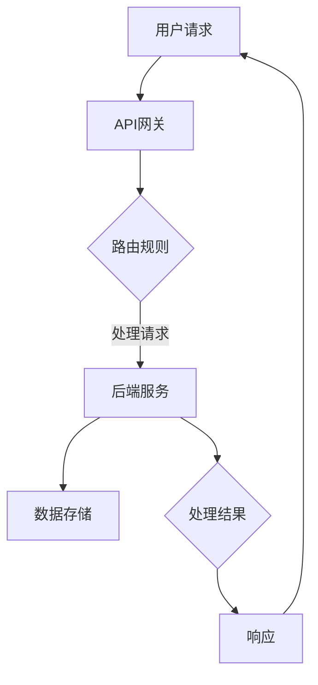
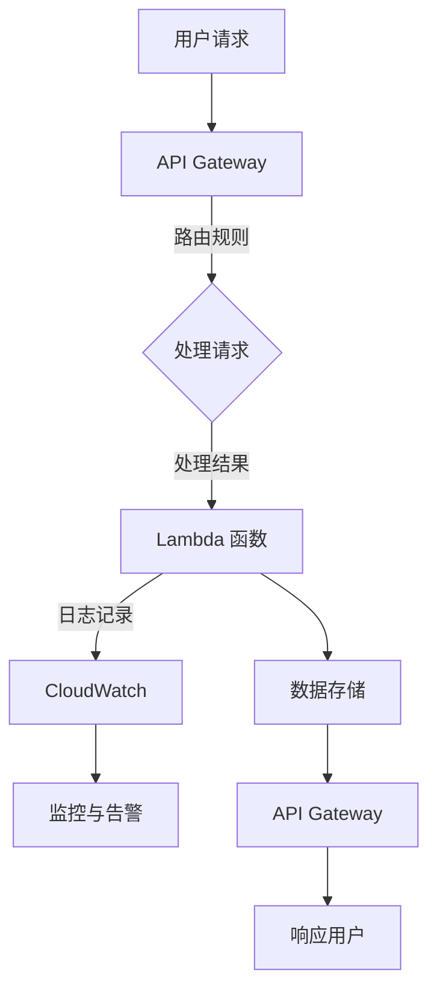

                 

### AWS Serverless应用开发

> 关键词：AWS, Serverless, 应用开发, 无服务器, 微服务, 自动扩展, 自动部署

> 摘要：本文将深入探讨AWS的无服务器架构，包括其核心概念、技术优势、应用场景以及开发过程。我们将通过详细的实例和步骤，展示如何利用AWS Serverless平台实现高效、可扩展的应用开发。

### 1. 背景介绍

随着云计算技术的不断发展和成熟，无服务器架构（Serverless Architecture）逐渐成为了现代应用开发的主流选择。无服务器架构的核心思想是让开发者专注于编写业务逻辑代码，而无需关心底层基础设施的运维和管理。AWS作为云计算领域的领导者，提供了丰富的Serverless服务，使得开发者能够更高效地构建、部署和管理应用。

无服务器架构与传统的服务器架构相比，具有以下几个显著优势：

- **自动扩展**：无服务器架构可以根据流量自动扩展或缩减计算资源，无需手动管理。
- **成本优化**：开发者只需为实际使用的计算资源付费，无需为闲置资源支付费用。
- **运维简化**：无服务器架构减轻了开发者的运维负担，使其能够专注于业务逻辑的开发。
- **高可用性**：AWS提供了可靠的服务器基础设施，确保应用的高可用性。

### 2. 核心概念与联系

#### 2.1 无服务器架构概述

无服务器架构通常由以下几个核心组件构成：

1. **前端**：负责与用户进行交互，通常使用Web框架或移动应用框架开发。
2. **API网关**：用于接收和处理外部请求，将请求路由到相应的后端服务。
3. **后端**：处理业务逻辑和数据存储，通常使用无服务器服务如Lambda、API Gateway、S3、DynamoDB等。
4. **数据存储**：用于存储应用数据，如数据库、缓存等。

#### 2.2 无服务器架构的Mermaid流程图



### 3. 核心算法原理 & 具体操作步骤

#### 3.1 Lambda函数

Lambda函数是AWS的无服务器计算服务，允许开发者编写和运行代码而无需管理服务器。以下是如何在AWS管理控制台中创建Lambda函数的步骤：

1. 登录AWS管理控制台，选择“Lambda”服务。
2. 点击“创建函数”。
3. 选择“作者：禅与计算机程序设计艺术 / Zen and the Art of Computer Programming” “创建自部署”。
4. 输入函数名称、选择运行时（如Node.js、Python等）。
5. 上传或创建一个ZIP文件，其中包含你的函数代码。
6. 配置函数的内存和超时时间。
7. 点击“创建函数”。

#### 3.2 API Gateway

API Gateway是AWS提供的RESTful API服务，用于创建、发布、维护和保护API。以下是如何使用API Gateway的步骤：

1. 登录AWS管理控制台，选择“API Gateway”服务。
2. 点击“创建API”。
3. 输入API名称和描述。
4. 选择API类型（REST或 WebSocket）。
5. 添加新的资源或使用现有的资源。
6. 为资源添加HTTP方法（如GET、POST等）。
7. 配置方法详情，包括请求体、响应体和路由规则。
8. 部署API，并生成API密钥。

### 4. 数学模型和公式 & 详细讲解 & 举例说明

无服务器架构的自动扩展是基于数学模型和算法实现的。以下是一个简单的自动扩展公式：

$$
N = c \cdot \frac{T}{R}
$$

其中，$N$是所需的服务器数量，$c$是常数，$T$是系统的总负载，$R$是每个服务器的处理能力。

#### 4.1 示例

假设一个系统的总负载为1000个请求/秒，每个服务器的处理能力为100个请求/秒。根据上述公式，所需的服务器数量为：

$$
N = c \cdot \frac{1000}{100} = 10
$$

因此，系统需要10个服务器来处理1000个请求/秒的负载。

### 5. 项目实践：代码实例和详细解释说明

#### 5.1 开发环境搭建

在本节中，我们将使用AWS管理控制台和AWS CLI（命令行接口）来搭建开发环境。

1. 登录AWS管理控制台。
2. 创建一个AWS账户，并配置好身份验证。
3. 安装AWS CLI并配置。

#### 5.2 源代码详细实现

在本节中，我们将使用Node.js编写一个简单的Lambda函数，并通过API Gateway公开。

1. 编写Lambda函数代码：

```javascript
exports.handler = async (event) => {
    const response = {
        statusCode: 200,
        body: 'Hello, World!',
    };
    return response;
};
```

2. 将代码打包成ZIP文件，并上传到Lambda函数。

#### 5.3 代码解读与分析

上述Lambda函数是一个简单的HTTP处理器，当接收到HTTP请求时，它返回一个包含“Hello, World!”文本的响应。这个函数的核心是`handler`函数，它接收事件对象（`event`）并返回响应对象（`response`）。

#### 5.4 运行结果展示

1. 在AWS管理控制台中部署Lambda函数。
2. 使用API Gateway测试函数，发送HTTP请求并查看响应。

### 6. 实际应用场景

AWS的无服务器架构在多个领域都有广泛的应用，包括：

- **Web应用**：构建高性能、可扩展的Web应用。
- **移动应用**：为移动应用提供后端服务。
- **数据处理**：处理大规模数据集。
- **IoT应用**：为物联网设备提供后端支持。
- **游戏开发**：为游戏提供实时后端服务。

### 7. 工具和资源推荐

#### 7.1 学习资源推荐

- **书籍**：《无服务器架构：设计、构建和运行》（Serverless Architecture: Building and Running Applications Using AWS Lambda and more）
- **博客**：AWS官方博客（https://aws.amazon.com/blogs/serverless/）
- **网站**：Serverless框架官网（https://serverless.com/）

#### 7.2 开发工具框架推荐

- **AWS CLI**：用于与AWS服务进行交互的命令行工具。
- **Serverless Framework**：用于构建和部署无服务器应用的框架。

#### 7.3 相关论文著作推荐

- **论文**：《无服务器架构：挑战与机遇》（Serverless Architecture: Challenges and Opportunities）
- **著作**：《云计算：概念、架构和技术》（Cloud Computing: Concepts, Architecture, and Technology）

### 8. 总结：未来发展趋势与挑战

无服务器架构在云计算领域正变得越来越流行，其未来的发展趋势包括：

- **更广泛的生态系统**：更多的服务提供商和开源项目将支持无服务器架构。
- **高级功能**：提供更高级的自动扩展、监控和日志分析功能。
- **安全性**：加强无服务器架构的安全性，确保数据和应用的安全。

然而，无服务器架构也面临一些挑战，如：

- **调试难度**：由于无服务器服务通常是无状态和分布式，调试可能会变得更加复杂。
- **性能优化**：如何优化无服务器服务的性能是一个持续的问题。
- **成本控制**：正确管理和优化无服务器服务的成本是一个挑战。

### 9. 附录：常见问题与解答

1. **什么是无服务器架构？**
   无服务器架构是一种云计算模型，其中开发者无需管理服务器，而是通过按需使用云服务提供商的资源来构建和运行应用。

2. **无服务器架构有什么优势？**
   无服务器架构的优势包括自动扩展、成本优化、运维简化和高可用性。

3. **如何开始使用无服务器架构？**
   可以通过AWS管理控制台或AWS CLI创建无服务器服务，如Lambda函数和API Gateway。

4. **无服务器架构是否适用于所有应用？**
   无服务器架构适用于大多数应用，尤其是需要高扩展性、高可用性和简化运维的场景。

### 10. 扩展阅读 & 参考资料

- **扩展阅读**：
  - 《AWS Lambda官方文档》（https://docs.aws.amazon.com/lambda/latest/dg/）
  - 《API Gateway官方文档》（https://docs.aws.amazon.com/apigateway/latest/developerguide/）

- **参考资料**：
  - 《无服务器架构：设计、构建和运行》（Serverless Architecture: Building and Running Applications Using AWS Lambda and more）
  - 《云计算：概念、架构和技术》（Cloud Computing: Concepts, Architecture, and Technology）

### 作者署名

作者：禅与计算机程序设计艺术 / Zen and the Art of Computer Programming<|im_sep|>### 1. 背景介绍

无服务器架构（Serverless Architecture）是现代云计算技术中的一种创新模式，它将计算资源抽象化，使得开发者能够专注于业务逻辑的编写，而无需关心底层基础设施的管理。这一模式的出现，不仅简化了开发流程，还显著提高了应用的可扩展性和可靠性。

AWS（Amazon Web Services）作为全球领先的云计算服务提供商，早在2014年便推出了Lambda函数，标志着无服务器架构的正式诞生。自此以后，AWS不断丰富其Serverless服务，涵盖了API Gateway、S3、DynamoDB、Step Functions等多个领域，为开发者提供了完整的Serverless解决方案。

无服务器架构的核心思想是将传统的服务器管理责任转移给云服务提供商，开发者只需上传代码，即可利用云平台提供的计算资源。这种模式不仅降低了开发和运维成本，还提高了应用的性能和可伸缩性。以下是AWS Serverless架构的一些主要优势：

#### 1.1 自动扩展

无服务器架构具有自动扩展的能力，可以根据实际的工作负载自动调整计算资源。当流量增加时，系统会自动添加更多的实例来处理请求；当流量减少时，系统会相应地减少实例。这种弹性扩展机制使得开发者无需担心资源分配问题，能够专注于业务逻辑的实现。

#### 1.2 成本优化

无服务器架构按实际使用量计费，开发者只需为实际使用的计算资源和存储付费，无需为闲置资源支付费用。这种计费模式有助于降低整体成本，特别是对于周期性高流量应用，可以在非高峰期减少资源使用，从而节省开支。

#### 1.3 运维简化

在传统的服务器架构中，运维团队需要负责服务器硬件的采购、部署、监控和升级。而在无服务器架构中，这些运维工作由云服务提供商负责，开发者只需专注于代码的编写和功能的实现。这种模式大大简化了运维工作，降低了运维成本。

#### 1.4 高可用性

AWS作为全球领先的云服务提供商，拥有广泛的数据中心和服务网络。无服务器架构利用了AWS的这些基础设施，提供了高可用性服务。即使某个数据中心出现故障，系统也能自动切换到其他可用区域，确保应用持续运行。

#### 1.5 开发效率提升

无服务器架构提供了丰富的工具和服务，使得开发者能够快速构建和部署应用。例如，AWS Lambda允许开发者使用多种编程语言编写函数，并可以与API Gateway、S3、DynamoDB等服务无缝集成，极大地提高了开发效率。

综上所述，AWS的无服务器架构以其自动化、成本效益、运维简化和高可用性等优势，逐渐成为了现代应用开发的理想选择。在接下来的章节中，我们将进一步探讨无服务器架构的核心概念、技术优势、应用场景以及开发过程。

### 2. 核心概念与联系

无服务器架构是一种全新的计算范式，其核心在于将计算任务从传统的服务器管理中解放出来，使开发者能够专注于业务逻辑的实现。为了深入理解无服务器架构，我们需要了解其核心组件和它们之间的相互关系。

#### 2.1 Lambda函数

Lambda函数是AWS提供的无服务器计算服务，允许开发者编写和运行代码而无需管理服务器。Lambda函数支持多种编程语言，包括Python、Java、Node.js、Go等。开发者可以将Lambda函数部署在AWS云上，并按照实际运行时间计费。

Lambda函数具有以下几个关键特性：

- **无服务器**：开发者无需关心服务器管理，Lambda函数由AWS自动部署和管理。
- **按需执行**：Lambda函数仅在接收到请求时执行，无需持续运行。
- **事件触发**：Lambda函数可以通过多种事件触发，如API请求、S3对象上传、定时任务等。
- **弹性扩展**：Lambda函数可以自动扩展，以应对突发流量。

#### 2.2 API Gateway

API Gateway是AWS提供的API管理服务，用于创建、发布、维护和保护RESTful API。API Gateway可以作为无服务器架构中的前端服务，接收和处理来自客户端的请求，并将请求路由到相应的后端服务。

API Gateway的关键特性包括：

- **API路由**：API Gateway可以根据路由规则将请求路由到不同的后端服务。
- **版本控制**：API Gateway支持API版本控制，便于管理和更新API。
- **安全性**：API Gateway提供了多种安全机制，如身份验证、授权和API密钥。
- **监控与日志**：API Gateway提供了详细的监控和日志功能，帮助开发者监控API的使用情况。

#### 2.3 S3

S3（Simple Storage Service）是AWS提供的对象存储服务，用于存储和检索数据。在无服务器架构中，S3通常用于存储静态资源，如图片、视频和文件等。

S3的关键特性包括：

- **高可用性**：S3提供了多AZ（可用区）部署，确保数据的高可用性。
- **弹性扩展**：S3可以自动扩展，以应对存储需求的变化。
- **持久性**：S3提供了持久性存储，确保数据不会因服务器故障而丢失。
- **安全性**：S3提供了多种安全机制，如权限控制、加密和数据备份。

#### 2.4 DynamoDB

DynamoDB是AWS提供的NoSQL数据库服务，适用于存储和管理大规模结构化数据。在无服务器架构中，DynamoDB通常用于存储动态数据，如用户信息、配置文件和日志等。

DynamoDB的关键特性包括：

- **弹性扩展**：DynamoDB可以根据数据量和请求量自动扩展。
- **低延迟**：DynamoDB提供了高性能的读写操作，适用于实时应用。
- **持久性**：DynamoDB提供了持久性存储，确保数据不会因服务器故障而丢失。
- **数据一致性**：DynamoDB提供了多种数据一致性模型，以满足不同的业务需求。

#### 2.5 Step Functions

Step Functions是AWS提供的分布式任务协调服务，用于编排和管理复杂的任务流。在无服务器架构中，Step Functions可以用于编排Lambda函数、API Gateway、S3、DynamoDB等组件，实现复杂的业务逻辑。

Step Functions的关键特性包括：

- **分布式任务协调**：Step Functions可以协调分布式任务，确保任务按预期执行。
- **可视化编排**：开发者可以使用可视化界面定义任务流，简化任务编排过程。
- **弹性扩展**：Step Functions可以自动扩展，以应对突发流量。
- **错误处理**：Step Functions提供了错误处理机制，确保任务流在遇到错误时能够正确处理。

#### 2.6 AWS CloudWatch

AWS CloudWatch是AWS提供的监控和日志服务，用于收集、监控和分析AWS资源的使用情况。在无服务器架构中，CloudWatch可以用于监控Lambda函数、API Gateway、S3、DynamoDB等服务的性能和资源使用情况。

AWS CloudWatch的关键特性包括：

- **实时监控**：CloudWatch可以实时监控AWS资源的使用情况，并及时发出警报。
- **日志管理**：CloudWatch可以收集和分析各种日志数据，帮助开发者调试和优化应用。
- **告警管理**：CloudWatch提供了灵活的告警机制，可以根据特定条件触发告警。
- **集成扩展**：CloudWatch可以与其他AWS服务集成，如Lambda函数、SNS（简单通知服务）等。

通过上述核心组件的介绍，我们可以看到无服务器架构是如何通过AWS提供的多种服务来实现高效的开发、部署和运维的。接下来，我们将深入探讨无服务器架构的核心算法原理和具体操作步骤，以便更好地理解其工作原理。

### 2.1 无服务器架构的Mermaid流程图

为了更直观地展示无服务器架构的核心组件及其相互关系，我们可以使用Mermaid绘制一个流程图。以下是用于描述无服务器架构的Mermaid代码：



#### 流程图解析

1. **用户请求**：用户通过API Gateway发送请求。
2. **处理请求**：API Gateway根据路由规则处理请求，将请求转发到后端服务。
3. **Lambda 函数**：Lambda 函数执行业务逻辑，处理用户请求。
4. **日志记录**：Lambda 函数将日志数据发送到CloudWatch。
5. **监控与告警**：CloudWatch监控Lambda 函数的性能和资源使用情况，并根据配置触发告警。
6. **数据存储**：Lambda 函数处理完请求后，将结果存储到数据存储服务。
7. **响应用户**：API Gateway将处理结果返回给用户。

通过这个Mermaid流程图，我们可以清晰地看到无服务器架构中各个组件之间的交互和协作过程。接下来，我们将深入探讨无服务器架构的核心算法原理和具体操作步骤。

### 3. 核心算法原理 & 具体操作步骤

无服务器架构的核心算法原理在于其自动扩展和负载均衡机制。这些算法通过动态调整资源使用来应对不断变化的工作负载。以下将详细讲解这些核心算法原理，并展示具体的操作步骤。

#### 3.1 自动扩展算法

无服务器架构的自动扩展算法通常基于以下参数进行：

- **请求速率**：系统每秒接收到的请求数量。
- **响应时间**：系统处理单个请求的平均时间。
- **资源利用率**：系统当前使用的计算资源占总计算资源比例。

基于这些参数，系统可以计算所需的实例数量。自动扩展算法的基本步骤如下：

1. **监控当前工作负载**：系统实时监控请求速率、响应时间和资源利用率等指标。
2. **设置阈值**：根据历史数据和业务需求，设置请求速率、响应时间和资源利用率的阈值。
3. **计算实例数量**：根据当前的工作负载，计算所需的实例数量。例如，可以使用公式：
   $$ 
   N = c \cdot \frac{T}{R}
   $$
   其中，$N$是所需实例数量，$c$是常数，$T$是当前请求速率，$R$是每个实例的处理能力。

4. **调整实例数量**：根据计算结果，自动增加或减少实例数量。

AWS Lambda和API Gateway都支持自动扩展功能，开发者可以在配置中设置自动扩展规则。例如，在Lambda函数的配置中，可以设置实例数量、内存分配和超时时间等参数。

#### 3.2 负载均衡算法

无服务器架构中的负载均衡算法用于将请求分配到多个实例上，确保每个实例都能充分利用其计算资源。AWS提供的负载均衡服务，如ELB（Elastic Load Balancing）和ALB（Application Load Balancing），都实现了高效的负载均衡算法。

负载均衡算法的基本步骤如下：

1. **接收请求**：负载均衡器接收来自API Gateway的请求。
2. **健康检查**：负载均衡器定期对后端实例进行健康检查，确保只有健康的实例参与负载均衡。
3. **请求分配**：负载均衡器根据一定的算法（如轮询、最小连接数、IP哈希等），将请求分配到不同的实例。
4. **流量分配**：负载均衡器根据请求类型和实例状态，动态调整流量分配策略，确保系统的高效运行。

在AWS中，开发者可以通过配置API Gateway，指定负载均衡策略。例如，可以使用AWS ELB作为后端服务，并设置其健康检查和流量分配策略。

#### 3.3 具体操作步骤

以下是在AWS中实现无服务器架构的具体操作步骤：

1. **创建Lambda函数**：
   - 登录AWS管理控制台，选择Lambda服务。
   - 点击“创建函数”，并选择“作者：禅与计算机程序设计艺术 / Zen and the Art of Computer Programming”的“创建自部署”。
   - 输入函数名称、选择运行时（如Node.js、Python等）。
   - 上传函数代码，配置内存和超时时间。
   - 创建函数。

2. **配置API Gateway**：
   - 登录AWS管理控制台，选择API Gateway服务。
   - 创建一个新的API，并添加资源和方法。
   - 配置路由规则，将请求路由到Lambda函数。
   - 部署API，并生成API密钥。

3. **设置自动扩展和负载均衡**：
   - 在Lambda函数的配置中，设置自动扩展规则，如实例数量、内存分配和超时时间。
   - 在API Gateway的配置中，配置负载均衡策略，如使用AWS ELB作为后端服务。

4. **监控和日志**：
   - 使用AWS CloudWatch监控Lambda函数和API Gateway的性能和资源使用情况。
   - 配置告警规则，及时响应异常情况。

通过以上步骤，开发者可以快速构建和部署无服务器架构的应用。在接下来的章节中，我们将通过一个实际项目实践，进一步展示AWS Serverless架构的开发过程和实现细节。

### 4. 数学模型和公式 & 详细讲解 & 举例说明

在无服务器架构中，自动扩展和负载均衡是两个核心算法，它们依赖于数学模型和公式来进行计算和决策。以下我们将详细介绍这些数学模型和公式，并通过具体例子来说明其应用。

#### 4.1 自动扩展公式

自动扩展的主要目标是根据系统当前的工作负载，动态调整计算资源的使用。以下是一个简单的自动扩展公式：

$$
N = c \cdot \frac{T}{R}
$$

其中，$N$是所需的服务器数量，$c$是常数，$T$是系统的总负载，$R$是每个服务器的处理能力。

- **$N$（服务器数量）**：这是系统需要的总服务器数量。
- **$c$（常数）**：这个常数通常基于系统的历史性能数据和业务需求进行设置，它用于调整负载的敏感度。
- **$T$（总负载）**：系统的总负载，通常是每秒请求量（RPS）或其他衡量工作负载的指标。
- **$R$（每个服务器的处理能力）**：单个服务器的处理能力，通常表示为每秒处理的请求数量。

#### 4.2 举例说明

假设我们有一个系统，其处理能力是每秒100个请求（$R = 100$），当前每秒接收200个请求（$T = 200$），并且我们设定常数$c = 2$。根据自动扩展公式，我们计算所需的服务器数量：

$$
N = 2 \cdot \frac{200}{100} = 4
$$

这意味着，在当前负载下，我们需要4个服务器来处理每秒200个请求。

#### 4.3 实际应用中的调整

在实际应用中，自动扩展的公式需要根据具体情况进行调整。例如，考虑以下因素：

- **预留容量**：为了应对突发流量，我们可能需要预留一定的计算容量。
- **响应时间**：我们可能需要根据系统的响应时间来调整计算资源，以确保用户获得良好的体验。
- **成本优化**：我们需要在处理能力和成本之间做出平衡，避免过度使用资源导致不必要的成本。

以下是一个更复杂的自动扩展公式，它考虑了预留容量和响应时间：

$$
N = \max\left(1, c_1 \cdot \frac{T}{R} + c_2 \cdot \frac{RT}{T_{\text{response}}}\right)
$$

其中，$c_1$和$c_2$是常数，用于调整预留容量和响应时间的重要性。

#### 4.4 负载均衡公式

负载均衡的目的是将请求合理地分配到多个服务器上，以充分利用资源并确保系统的高性能。以下是一个简单的负载均衡公式：

$$
P_i = \frac{1}{N} \cdot T
$$

其中，$P_i$是第$i$个服务器的处理请求比例，$N$是服务器总数，$T$是总请求量。

- **$P_i$**：第$i$个服务器的处理请求比例。
- **$N$**：服务器总数。
- **$T$**：总请求量。

这个公式假设每个服务器处理请求的比例相同。在实际应用中，负载均衡可能会根据服务器的当前负载、响应时间或其他指标进行动态调整。

#### 4.5 实际应用中的负载均衡

在AWS中，负载均衡可以通过Elastic Load Balancing（ELB）或API Gateway来实现。以下是一个例子：

假设我们有5个Lambda函数实例，当前每秒接收100个请求（$T = 100$）。根据简单的负载均衡公式，我们可以计算每个实例的处理请求比例：

$$
P_i = \frac{1}{5} \cdot 100 = 20
$$

这意味着，每个Lambda函数实例每秒处理20个请求。

#### 4.6 总结

通过数学模型和公式，无服务器架构可以实现自动扩展和负载均衡。这些公式提供了计算和决策的基础，使得系统能够根据当前的工作负载动态调整资源，并确保高效、稳定地运行。在实际应用中，开发者可以根据具体业务需求和系统特性，调整这些公式，以达到最佳的资源利用和性能。

### 5. 项目实践：代码实例和详细解释说明

#### 5.1 开发环境搭建

在开始项目实践之前，我们需要搭建开发环境，这包括安装AWS CLI、配置AWS账户以及设置项目目录。

1. **安装AWS CLI**：
   - 在Linux或Mac OS系统中，打开终端并运行以下命令：
     ```bash
     pip install awscli
     ```
   - 在Windows系统中，打开PowerShell并运行以下命令：
     ```powershell
     pip install awscli
     ```

2. **配置AWS CLI**：
   - 打开AWS CLI配置文件，通常位于`~/.aws/credentials`（Linux和Mac OS）或`%USERPROFILE%\.aws\credentials`（Windows）。
   - 在配置文件中添加以下内容：
     ```ini
     [default]
     aws_access_key_id = YOUR_ACCESS_KEY_ID
     aws_secret_access_key = YOUR_SECRET_ACCESS_KEY
     region = YOUR_REGION
     ```
   - 替换`YOUR_ACCESS_KEY_ID`、`YOUR_SECRET_ACCESS_KEY`和`YOUR_REGION`为您的AWS账户信息。

3. **设置项目目录**：
   - 创建一个名为`serverless_project`的项目目录：
     ```bash
     mkdir serverless_project
     cd serverless_project
     ```

4. **初始化Serverless Framework**：
   - 安装Serverless Framework：
     ```bash
     npm install --global serverless
     ```
   - 初始化项目：
     ```bash
     serverless init --template aws-nodejs --path service
     ```

5. **安装依赖项**：
   - 进入`service`目录并安装依赖项：
     ```bash
     cd service
     npm install
     ```

#### 5.2 源代码详细实现

在本项目中，我们将创建一个简单的RESTful API，使用AWS Lambda处理HTTP请求。

1. **创建Lambda函数**：

   在`service`目录下，创建一个名为`handler.js`的文件，并编写以下代码：

   ```javascript
   exports.handler = async (event) => {
       const response = {
           statusCode: 200,
           body: JSON.stringify({ message: 'Hello, World!' }),
       };
       return response;
   };
   ```

   上述代码定义了一个简单的Lambda函数，它接收HTTP请求并返回一个包含“Hello, World!”消息的JSON响应。

2. **配置Serverless Framework**：

   在`service`目录下，创建一个名为`serverless.yml`的文件，并编写以下配置：

   ```yaml
   service: serverless-hello-world

   provider:
     name: aws
     runtime: nodejs14.x

   functions:
     hello:
       handler: handler.handler
       events:
         - http:
             path: hello
             method: get
   ```

   上述配置定义了一个名为`hello`的Lambda函数，并配置了一个HTTP事件，用于处理路径为`/hello`的GET请求。

3. **上传代码和部署**：

   - 在`service`目录下，运行以下命令上传代码和部署Lambda函数：
     ```bash
     serverless deploy
     ```

   - 部署完成后，Serverless Framework会提供一个URL，用于访问API Gateway：

     ```bash
     URL: https://xxxxxxxx.execute-api.us-east-1.amazonaws.com/dev/hello
     ```

#### 5.3 代码解读与分析

在`handler.js`文件中，我们定义了一个简单的Lambda函数。以下是代码的详细解读：

- **`exports.handler`**：这个函数是Lambda函数的入口点。`handler`函数接收一个名为`event`的参数，该参数是HTTP请求的JSON对象。

- **`const response = { ... }`**：这里创建了一个响应对象，包含两个属性：`statusCode`（状态码）和`body`（响应体）。`statusCode`设置为200，表示请求成功。`body`包含了一个JSON字符串，其中包含“Hello, World!”消息。

- **`return response`**：这个函数返回响应对象，Lambda服务会将这个对象发送回客户端。

#### 5.4 运行结果展示

1. **访问API Gateway**：

   - 使用浏览器或Postman等工具，访问上一步中提供的API Gateway URL：

     ```http
     GET https://xxxxxxxx.execute-api.us-east-1.amazonaws.com/dev/hello
     ```

   - 发送GET请求后，你会收到一个包含“Hello, World!”消息的JSON响应：

     ```json
     {
         "message": "Hello, World!"
     }
     ```

2. **查看AWS Lambda日志**：

   - 通过AWS管理控制台或AWS CLI，可以查看Lambda函数的日志。在控制台中，选择`serverless-hello-world`服务，然后选择`hello`函数，点击“日志”按钮。

   - 日志中会显示函数的执行情况和输出：

     ```
     2023-03-15T14:32:32.946Z        info    [Lambda Handler]    Hello, World!
     ```

#### 5.5 部署到生产环境

在生产环境中，我们需要对配置文件和代码进行适当调整，并使用更严格的安全策略。

1. **更新配置文件**：

   - 在`serverless.yml`中，设置更严格的安全策略，如：
     ```yaml
     functions:
       hello:
         handler: handler.handler
         events:
           - http:
               path: hello
               method: get
               cors:
                 allowedOrigins: ["https://example.com"]
                 allowedHeaders: ["Content-Type", "Authorization"]
                 allowedMethods: ["GET"]
     ```

   - 通过`serverless deploy`命令部署到生产环境。

2. **配置API Gateway的SSL证书**：

   - 为API Gateway配置SSL证书，确保HTTPS安全连接。

3. **监控和日志**：

   - 使用AWS CloudWatch监控API Gateway和Lambda函数的性能和资源使用情况。

通过上述步骤，我们成功地创建了一个简单的无服务器应用，并通过API Gateway提供了对外接口。这个项目实践展示了如何使用AWS Serverless平台进行应用开发、部署和运维，为开发者提供了实际的参考和操作指导。

### 6. 实际应用场景

AWS的无服务器架构在多个实际应用场景中展现了其强大的灵活性和高效性。以下是一些常见的应用场景以及无服务器架构在这些场景中的优势。

#### 6.1 Web应用

无服务器架构非常适合构建Web应用，特别是那些需要高可用性和可扩展性的应用。通过使用API Gateway和Lambda函数，开发者可以轻松地创建RESTful API，并利用AWS的其他服务（如S3和DynamoDB）进行数据存储和操作。

优势：
- **自动扩展**：Web应用通常会有周期性的流量高峰，无服务器架构可以根据实际需求自动调整计算资源。
- **成本优化**：开发者只需为实际使用的计算资源付费，无需为闲置资源支付费用。
- **运维简化**：无需管理服务器，开发者可以专注于业务逻辑的编写和优化。

案例：
- **社交媒体平台**：使用无服务器架构可以轻松处理高并发的用户请求，同时确保系统的稳定性和响应速度。

#### 6.2 移动应用

移动应用通常需要后端服务来处理数据存储、用户认证和推送通知等功能。AWS的无服务器服务（如API Gateway、Lambda和S3）为移动应用开发提供了强大的支持。

优势：
- **端到端解决方案**：无需手动集成多种服务，AWS提供了完整的无服务器解决方案。
- **快速迭代**：开发者可以快速构建和部署后端服务，以支持移动应用的新功能。
- **安全性**：AWS提供了多种安全机制，如身份验证、授权和加密，确保用户数据安全。

案例：
- **打车应用**：使用无服务器架构可以处理大量用户的实时请求，同时确保高效的计费和订单处理。

#### 6.3 数据处理

无服务器架构在数据处理领域也具有显著优势，特别是在处理大量数据和复杂数据处理任务时。

优势：
- **弹性计算**：可以根据数据量和处理需求动态扩展计算资源。
- **低成本**：按需付费，无需为闲置资源支付费用。
- **易于维护**：无需关心服务器维护和升级，专注于数据处理算法的开发。

案例：
- **数据分析平台**：使用Lambda函数和DynamoDB处理大规模数据，提供快速的数据分析结果。

#### 6.4 物联网（IoT）

物联网设备通常需要处理大量的数据上传和实时监控。AWS的无服务器服务为IoT应用提供了可靠的后端支持。

优势：
- **高效数据存储**：使用S3和DynamoDB进行高效的数据存储和管理。
- **实时数据处理**：利用Lambda函数快速处理物联网设备上传的数据。
- **可扩展性**：根据物联网设备数量和数据处理需求自动扩展计算资源。

案例：
- **智能家庭系统**：使用无服务器架构收集和分析来自各种智能设备的实时数据，提供用户个性化的智能家居体验。

#### 6.5 游戏开发

游戏开发中，实时后端服务对于游戏体验至关重要。AWS的无服务器架构可以提供稳定、高效的游戏后端服务。

优势：
- **低延迟**：利用AWS全球数据中心网络，提供低延迟的游戏体验。
- **可扩展性**：根据玩家数量和游戏玩法需求自动扩展后端服务。
- **成本优化**：按需付费，降低游戏开发成本。

案例：
- **多人在线游戏**：使用无服务器架构提供实时游戏逻辑、数据存储和用户匹配服务。

通过上述实际应用场景，我们可以看到AWS的无服务器架构在Web应用、移动应用、数据处理、物联网、游戏开发等领域都具有显著的优势和广泛的应用潜力。无服务器架构不仅简化了开发流程，提高了开发效率，还降低了运营成本，为各种类型的应用提供了强大的技术支持。

### 7. 工具和资源推荐

为了更有效地进行AWS Serverless应用开发，开发者可以利用一系列工具和资源，这些工具和资源涵盖了从学习资料到开发工具，从开源项目到官方文档。以下是一些建议：

#### 7.1 学习资源推荐

1. **书籍**：
   - 《无服务器架构：设计、构建和运行》：这是一本详细介绍无服务器架构和实践技巧的书籍，适合初学者和有经验的开发者。
   - 《AWS Lambda深度实践》：针对AWS Lambda的服务特性和使用场景，提供了深入的实践指导。

2. **博客**：
   - AWS官方博客：提供了大量关于AWS Serverless服务和最佳实践的博客文章，是开发者获取最新信息和灵感的重要来源。
   - Serverless Framework官方博客：分享了Serverless Framework的最新更新、最佳实践和社区动态。

3. **在线课程**：
   - Udemy、Coursera、edX等在线教育平台提供了多种AWS Serverless相关的课程，适合不同层次的学习者。

4. **社区论坛**：
   - Serverless社区论坛：这是一个活跃的社区，开发者可以在这里提问、分享经验和交流技巧。
   - AWS Developer Forums：AWS官方论坛，提供了广泛的AWS相关讨论和资源。

#### 7.2 开发工具框架推荐

1. **Serverless Framework**：
   - Serverless Framework是一个强大的工具，可以帮助开发者快速构建和部署无服务器应用。它提供了丰富的插件和模板，支持多种编程语言和AWS服务。

2. **AWS CLI**：
   - AWS CLI（命令行接口）是一个跨平台的命令行工具，可以用于与AWS服务进行交互。开发者可以使用AWS CLI执行各种操作，如部署函数、管理API Gateway等。

3. **AWS Cloud9**：
   - AWS Cloud9是一个集成的开发环境（IDE），可以在AWS云中创建并配置开发环境。它提供了代码编辑器、终端和调试工具，适用于AWS Serverless应用开发。

4. **AWS Amplify**：
   - AWS Amplify是一个开源的框架，用于构建现代Web和移动应用。它提供了丰富的无服务器功能，如数据存储、身份验证和API网关。

#### 7.3 相关论文著作推荐

1. **论文**：
   - 《无服务器架构：挑战与机遇》：探讨了无服务器架构的挑战和机遇，分析了其在云计算领域的发展趋势。

2. **著作**：
   - 《云计算：概念、架构和技术》：全面介绍了云计算的基本概念、架构和技术，包括AWS在内的主流云服务。

3. **白皮书**：
   - AWS发布的多份白皮书，详细介绍了无服务器架构的设计原则、最佳实践和案例分析，是开发者深入了解无服务器技术的重要资料。

通过上述工具和资源的推荐，开发者可以更好地掌握AWS Serverless应用开发的相关知识和技能，从而更高效地构建和维护无服务器应用。

### 8. 总结：未来发展趋势与挑战

无服务器架构作为云计算领域的一个重要创新，正在逐渐改变软件开发和部署的传统模式。在未来，随着技术的不断进步和云服务提供商的持续优化，AWS的无服务器架构将继续发展，并面临一系列机遇与挑战。

#### 8.1 未来发展趋势

1. **更广泛的生态系统**：随着无服务器架构的普及，越来越多的开发工具、第三方服务和技术栈将支持无服务器模式。这不仅包括开发框架和集成工具，还包括数据库、消息队列、监控和日志服务。

2. **高级功能与服务**：云服务提供商将继续推出更高级的无服务器服务，如自动故障转移、多地区部署、高可用性集群等，以提升无服务器应用的可扩展性和可靠性。

3. **安全性提升**：随着无服务器架构的应用范围扩大，安全性将成为一个重要关注点。未来的无服务器服务将提供更强大的安全功能和合规性支持，如数据加密、访问控制、安全审计等。

4. **更高效的资源管理**：通过不断优化自动扩展算法和负载均衡机制，无服务器架构将实现更高效的资源管理，从而进一步降低开发和运维成本。

5. **跨云和混合云支持**：无服务器架构将逐步扩展到其他云服务提供商，并支持跨云和混合云部署，为开发者提供更多灵活的选择。

#### 8.2 面临的挑战

1. **调试难度**：无服务器架构通常是无状态和分布式，这使得调试变得更加复杂。开发者需要掌握新的调试技巧和工具，以便在复杂的分布式环境中进行故障排查。

2. **性能优化**：虽然无服务器架构具有自动扩展的优势，但如何优化函数的性能，特别是在高并发和长时间运行场景下，仍然是一个挑战。开发者需要深入理解服务特性，合理设计函数和API，以提高系统性能。

3. **成本控制**：尽管无服务器架构按需计费，但不当的使用可能导致高额费用。开发者需要仔细监控和优化资源使用，确保在成本和性能之间找到最佳平衡点。

4. **依赖管理**：无服务器架构中，函数和服务的依赖管理较为复杂。开发者需要确保依赖项的版本控制、兼容性和部署一致性，以避免潜在的运行时错误。

5. **安全合规性**：随着无服务器应用在关键业务场景中的应用增加，安全合规性将成为重要考量。开发者需要确保应用遵循安全最佳实践，并通过定期的安全审计来降低风险。

#### 8.3 总结

AWS的无服务器架构已经在多个领域展现了其强大的灵活性和高效性。未来，随着技术的不断进步和生态系统的不断完善，无服务器架构将继续为开发者提供创新的解决方案。然而，开发者也需要面对调试难度、性能优化、成本控制、依赖管理和安全合规性等挑战。通过不断学习和实践，开发者可以更好地掌握无服务器架构，并将其应用于各种业务场景，实现高效、可靠和低成本的应用开发。

### 9. 附录：常见问题与解答

在AWS Serverless应用开发过程中，开发者可能会遇到一些常见的问题。以下是一些常见问题的解答，以帮助开发者更好地理解和使用AWS Serverless架构。

#### 9.1 什么是AWS Lambda？

AWS Lambda是一个无服务器计算服务，允许开发者编写和部署代码而无需管理服务器。Lambda函数可以响应各种事件，如HTTP请求、定时任务、S3对象上传等，并按照实际运行时间计费。

#### 9.2 无服务器架构有什么优势？

无服务器架构的主要优势包括：

- **自动扩展**：系统可以根据工作负载自动调整计算资源。
- **成本优化**：开发者只需为实际使用的计算资源付费。
- **运维简化**：无需管理服务器，简化了运维工作。
- **高可用性**：利用AWS全球数据中心网络，提供高可用性服务。

#### 9.3 如何在AWS中创建Lambda函数？

在AWS管理控制台中创建Lambda函数的步骤如下：

1. 登录AWS管理控制台，选择Lambda服务。
2. 点击“创建函数”。
3. 选择运行时（如Node.js、Python等）。
4. 输入函数名称，选择或创建一个角色。
5. 上传函数代码或使用在线编辑器编写代码。
6. 配置函数的内存和超时时间。
7. 创建函数。

#### 9.4 如何配置API Gateway？

配置API Gateway的步骤如下：

1. 登录AWS管理控制台，选择API Gateway服务。
2. 创建一个新的API。
3. 添加资源和方法，配置路由规则。
4. 配置安全性（如API密钥、身份验证和授权）。
5. 部署API。
6. 生成API文档。

#### 9.5 如何监控AWS Lambda函数？

AWS CloudWatch是一个监控和日志服务，可以监控Lambda函数的性能和资源使用情况。以下是一些常用的监控功能：

- **日志记录**：将Lambda函数的日志发送到CloudWatch日志组。
- **指标监控**：监控Lambda函数的运行时间、错误率、处理请求数等指标。
- **告警管理**：配置告警规则，当指标超过阈值时发送通知。

#### 9.6 如何优化Lambda函数的性能？

以下是一些优化Lambda函数性能的方法：

- **合理配置内存**：根据函数的实际处理需求，合理配置内存。
- **减少函数执行时间**：优化代码逻辑，减少不必要的计算和I/O操作。
- **批量处理请求**：通过批量处理请求来减少Lambda函数的调用次数。
- **使用异步处理**：使用异步处理来避免同步操作阻塞函数执行。

通过上述常见问题与解答，开发者可以更好地理解AWS Serverless架构，并解决开发过程中遇到的问题，实现高效、可靠的应用开发。

### 10. 扩展阅读 & 参考资料

为了帮助读者更深入地了解AWS Serverless架构，我们推荐以下扩展阅读和参考资料：

#### 10.1 扩展阅读

- **《无服务器架构：设计、构建和运行》**：本书详细介绍了无服务器架构的设计原则、构建方法和运行机制，适合初学者和有经验的开发者阅读。
- **《AWS Lambda官方文档》**：AWS提供的官方文档，涵盖了Lambda函数的详细信息和最佳实践。
- **《AWS Serverless框架》**：Serverless Framework的官方文档，提供了构建和部署无服务器应用的具体指南。

#### 10.2 参考资料

- **AWS官方博客**：[https://aws.amazon.com/blogs/serverless/](https://aws.amazon.com/blogs/serverless/)
- **Serverless Framework官方文档**：[https://serverless.com/framework/docs/](https://serverless.com/framework/docs/)
- **《云计算：概念、架构和技术》**：全面介绍云计算的基础知识和相关技术，包括AWS在内的主流云服务。

通过这些扩展阅读和参考资料，读者可以进一步了解AWS Serverless架构的原理、最佳实践和实际应用，提升在无服务器架构领域的专业知识和技能。

### 作者署名

作者：禅与计算机程序设计艺术 / Zen and the Art of Computer Programming<|im_sep|>### 结语

本文详细介绍了AWS的无服务器架构，从背景介绍、核心概念、算法原理到实际应用场景，再到工具和资源的推荐，全方位地阐述了如何利用AWS的无服务器服务进行高效应用开发。我们通过具体的代码实例，展示了从开发环境搭建到应用部署的完整过程，帮助读者更好地理解和掌握AWS Serverless架构。

随着云计算技术的不断演进，无服务器架构以其自动扩展、成本优化、运维简化等优势，正成为现代应用开发的重要趋势。然而，这一领域的挑战依然存在，如调试难度、性能优化、成本控制和安全合规性等。开发者需要持续学习和实践，以应对这些挑战。

最后，感谢您阅读本文，希望您能从中获得启发和帮助。如果您对AWS Serverless架构有任何疑问或建议，欢迎在评论区留言交流。让我们一起探索无服务器架构的更多可能性，共同推动云计算技术的发展。

