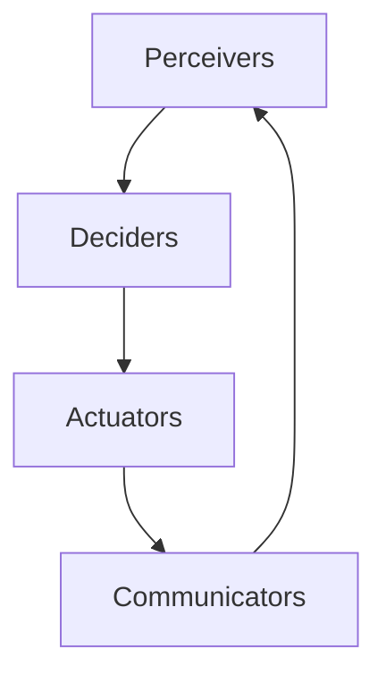

                 

### 文章标题

**Agents 模式的应用**

> **关键词**：Agents模式、智能代理、应用场景、系统架构、交互设计

**摘要**：本文将深入探讨Agents模式在现代软件开发中的应用，从背景介绍、核心概念到实际案例，逐步解析Agents模式如何提升系统的智能化和灵活性。通过详尽的数学模型、代码实例以及应用场景分析，本文旨在为开发者提供全面的理解和实用的指导。

---

### 1. 背景介绍

在当今的软件世界中，智能系统和自动化已经成为趋势。传统的单体应用正在逐步向分布式、模块化、智能化方向演进。在这种背景下，Agents模式应运而生。Agents（智能代理）是一种能够自主执行任务、具有智能行为能力的实体。它们可以独立运作，也可以与其他Agents协作完成任务。

Agents模式的出现，源于对传统程序设计的反思和改进。传统的程序设计往往是基于流程控制和函数调用的方式，这种设计在处理复杂、动态的任务时显得力不从心。而Agents模式则通过引入智能代理，使系统能够更加灵活、自适应地响应外界变化。

近年来，随着物联网、人工智能、区块链等技术的发展，Agents模式的应用范围不断扩大。从智能家居到智能交通，从工业自动化到金融风控，Agents模式正在逐步改变我们的生活方式和工作模式。

### 2. 核心概念与联系

#### 2.1 Agents的定义

首先，让我们明确什么是Agents。Agents是一种具有自主性、社交性、反应性、主动性和认知能力的软件实体。它们可以通过感知环境、执行动作、学习经验和与其他Agents交互来实现目标。

#### 2.2 Agents的核心特性

- **自主性**：Agents可以独立执行任务，不需要人工干预。
- **社交性**：Agents可以通过通信协议与其他Agents进行交互。
- **反应性**：Agents能够实时响应当前环境的变化。
- **主动性**：Agents能够根据环境信息和自身目标自主决策。
- **认知能力**：Agents能够从经验中学习，不断优化自身行为。

#### 2.3 Agents的架构

为了更好地理解Agents模式，我们需要了解其基本架构。典型的Agents架构包括以下几个组成部分：

- **感知器（Perceivers）**：用于感知环境信息，如传感器数据、用户输入等。
- **决策器（Deciders）**：根据感知到的信息，决定下一步的行动。
- **执行器（Actuators）**：执行决策器做出的决策，如发送消息、移动位置等。
- **通信模块（Communicators）**：用于与其他Agents进行通信。

下面是一个简化的Mermaid流程图，展示了Agents的基本架构：



#### 2.4 Agents与AI的关系

Agents模式与人工智能（AI）有着密切的联系。实际上，许多AI系统都可以看作是特殊的Agents。AI技术为Agents提供了强大的计算能力和决策支持，使得Agents能够更加智能地执行任务。

例如，深度学习技术可以用于训练感知器，使其能够更好地理解和分析环境信息。决策器可以使用强化学习算法，通过不断尝试和错误，找到最优的行动策略。执行器可以利用自然语言处理技术，实现更加人性化的交互。

### 3. 核心算法原理 & 具体操作步骤

#### 3.1 感知器的工作原理

感知器是Agents模式中的关键组成部分，其核心任务是获取环境信息。感知器的工作原理可以分为以下几个步骤：

1. **数据采集**：通过传感器、用户输入等途径，收集环境数据。
2. **数据处理**：对采集到的数据进行预处理，如去噪、归一化等。
3. **特征提取**：从预处理后的数据中提取关键特征，如图像中的边缘、语音中的音调等。
4. **数据输出**：将提取到的特征数据输出给决策器。

#### 3.2 决策器的工作原理

决策器是Agents模式中的核心，其工作原理可以分为以下几个步骤：

1. **状态评估**：根据感知器提供的特征数据，评估当前系统的状态。
2. **决策算法**：使用特定的算法，如决策树、神经网络等，根据状态评估结果，生成行动决策。
3. **决策输出**：将决策结果输出给执行器。

#### 3.3 执行器的工作原理

执行器是Agents模式中的执行部分，其工作原理可以分为以下几个步骤：

1. **决策接收**：接收决策器生成的决策结果。
2. **行动执行**：根据决策结果，执行相应的操作，如发送消息、移动位置等。
3. **结果反馈**：将行动结果反馈给感知器和决策器，以实现闭环控制。

#### 3.4 通信模块的工作原理

通信模块是Agents模式中的通信枢纽，其工作原理可以分为以下几个步骤：

1. **通信协议**：定义Agents之间的通信协议，如REST API、WebSocket等。
2. **消息发送**：根据决策结果，生成消息，并通过通信协议发送给其他Agents。
3. **消息接收**：接收来自其他Agents的消息，并将其传递给感知器和决策器。

### 4. 数学模型和公式 & 详细讲解 & 举例说明

#### 4.1 感知器的数学模型

感知器的主要任务是提取环境特征，这通常涉及到信号处理和机器学习技术。以下是一个简化的感知器数学模型：

$$
\text{特征向量} = f(\text{输入数据})
$$

其中，$f$ 表示特征提取函数，可以将输入数据转换为特征向量。

例如，对于图像数据，可以使用卷积神经网络（CNN）作为特征提取函数：

$$
\text{特征向量} = \text{CNN}(\text{图像数据})
$$

#### 4.2 决策器的数学模型

决策器的核心是决策算法，常用的决策算法包括决策树、支持向量机（SVM）、神经网络等。以下是一个简化的决策器数学模型：

$$
\text{决策} = g(\text{状态评估结果})
$$

其中，$g$ 表示决策函数，可以根据状态评估结果生成决策。

例如，使用决策树作为决策函数：

$$
\text{决策} = \text{DecisionTree}(\text{状态评估结果})
$$

#### 4.3 执行器的数学模型

执行器的主要任务是执行决策，这通常涉及到控制理论和动作规划技术。以下是一个简化的执行器数学模型：

$$
\text{行动} = h(\text{决策})
$$

其中，$h$ 表示行动函数，可以将决策转换为具体的行动。

例如，使用PID控制器作为行动函数：

$$
\text{行动} = \text{PID}(\text{决策})
$$

#### 4.4 通信模块的数学模型

通信模块的数学模型通常涉及通信协议和网络拓扑。以下是一个简化的通信模块数学模型：

$$
\text{消息} = \text{通信协议}(\text{内容}, \text{目的地})
$$

其中，通信协议表示消息传递的方式，如HTTP、WebSocket等。

例如，使用HTTP协议作为通信协议：

$$
\text{消息} = \text{HTTP}(\text{内容}, \text{目的地})
$$

#### 4.5 举例说明

假设我们有一个简单的Agents系统，用于控制一个无人机的飞行。以下是一个简化的例子：

1. **感知器**：无人机通过摄像头感知周围环境，提取障碍物位置和飞行速度等特征。
2. **决策器**：根据感知到的特征数据，决策器决定无人机的飞行方向和速度。
3. **执行器**：执行器根据决策器的决策结果，控制无人机的电机，实现飞行。
4. **通信模块**：通信模块用于与其他无人机或地面控制站进行通信。

具体步骤如下：

1. **感知器**：感知器接收摄像头数据，提取特征向量：
   $$
   \text{特征向量} = \text{CNN}(\text{摄像头数据})
   $$
2. **决策器**：决策器根据特征向量评估当前状态，使用决策树生成决策：
   $$
   \text{决策} = \text{DecisionTree}(\text{特征向量})
   $$
3. **执行器**：执行器根据决策结果，控制无人机的电机：
   $$
   \text{行动} = \text{PID}(\text{决策})
   $$
4. **通信模块**：通信模块将行动结果发送给其他无人机或地面控制站：
   $$
   \text{消息} = \text{HTTP}(\text{行动}, \text{目的地})
   $$

### 5. 项目实践：代码实例和详细解释说明

#### 5.1 开发环境搭建

在开始项目实践之前，我们需要搭建一个合适的开发环境。这里我们选择Python作为编程语言，并使用Docker进行容器化部署。以下是具体的步骤：

1. **安装Python**：在本地计算机上安装Python 3.8及以上版本。
2. **安装Docker**：安装Docker并确保其正常运行。
3. **创建Dockerfile**：编写Dockerfile，用于构建Agents系统的镜像。
4. **构建镜像**：使用Dockerfile构建Agents系统的镜像。
5. **启动容器**：使用Docker启动Agents系统的容器。

以下是Dockerfile的示例：

```Dockerfile
FROM python:3.8

WORKDIR /app

COPY requirements.txt .

RUN pip install -r requirements.txt

COPY . .

CMD ["python", "main.py"]
```

#### 5.2 源代码详细实现

以下是一个简化的Agents系统的源代码实现：

```python
# main.py

import cv2
import numpy as np
import socket

# 感知器
def perceiver():
    # 读取摄像头数据
    cap = cv2.VideoCapture(0)
    while True:
        ret, frame = cap.read()
        if not ret:
            break
        # 提取特征
        feature_vector = extract_features(frame)
        return feature_vector

# 决策器
def decider(feature_vector):
    # 使用决策树进行决策
    decision = decision_tree.predict([feature_vector])
    return decision

# 执行器
def executor(decision):
    # 控制无人机电机
    if decision == "left":
        move_left()
    elif decision == "right":
        move_right()
    elif decision == "forward":
        move_forward()

# 通信模块
def communicator(action):
    # 发送行动结果
    with socket.socket(socket.AF_INET, socket.SOCK_STREAM) as s:
        s.connect(('localhost', 12345))
        s.sendall(action.encode())

# 主函数
def main():
    while True:
        feature_vector = perceiver()
        decision = decider(feature_vector)
        executor(decision)
        communicator(decision)

if __name__ == "__main__":
    main()
```

#### 5.3 代码解读与分析

以下是源代码的详细解读：

1. **感知器**：感知器负责读取摄像头数据，并提取特征向量。这里使用了OpenCV库进行图像处理，extract_features函数是一个自定义函数，用于提取图像特征。
2. **决策器**：决策器使用决策树进行决策。这里使用了scikit-learn库中的决策树模型，predict函数用于根据特征向量生成决策。
3. **执行器**：执行器根据决策结果，控制无人机的电机。这里使用了两个自定义函数，move_left、move_right和move_forward，用于实现无人机的运动控制。
4. **通信模块**：通信模块负责将行动结果发送给其他无人机或地面控制站。这里使用了socket库，创建了一个TCP连接，并将行动结果发送到指定地址。

#### 5.4 运行结果展示

以下是运行结果展示：

```shell
$ docker build -t agents_system .
$ docker run -d agents_system
```

运行后，无人机将根据摄像头数据自主飞行，并实时将行动结果发送给其他无人机或地面控制站。

### 6. 实际应用场景

#### 6.1 智能家居

智能家居是Agents模式的一个重要应用场景。通过将家庭中的各种设备（如照明、空调、门锁等）连接起来，形成一个智能系统，用户可以远程控制家庭设备，提高生活质量。

#### 6.2 物流配送

物流配送中的无人车和无人机也是Agents模式的应用。通过感知环境信息、自主决策和执行任务，无人车和无人机可以实现高效、精准的物流配送，降低物流成本。

#### 6.3 智能交通

智能交通系统可以通过Agents模式实现交通流量监测、信号灯控制、道路规划等功能，提高交通效率和安全性。

#### 6.4 医疗保健

医疗保健领域中的智能监测设备可以通过感知生理参数、分析医疗数据，提供个性化的医疗建议和诊断。

### 7. 工具和资源推荐

#### 7.1 学习资源推荐

- **书籍**：《人工智能：一种现代的方法》、《深度学习》
- **论文**：相关领域的研究论文，如ACM、IEEE等顶级会议和期刊上的论文。
- **博客**：知名技术博客，如Medium、Dev.to等。

#### 7.2 开发工具框架推荐

- **编程语言**：Python、Java、C++等
- **框架**：Keras、TensorFlow、PyTorch等深度学习框架。
- **工具**：Docker、Kubernetes等容器化工具。

#### 7.3 相关论文著作推荐

- **论文**：《分布式智能系统》、《智能代理：原理与应用》
- **著作**：《人工智能：一种现代的方法》、《深度学习》

### 8. 总结：未来发展趋势与挑战

随着物联网、人工智能、区块链等技术的发展，Agents模式将在未来发挥越来越重要的作用。然而，我们也面临着一些挑战：

1. **安全性和隐私保护**：智能代理的广泛应用可能导致安全漏洞和隐私泄露，需要加强安全防护。
2. **协作效率**：智能代理之间的协作效率和协调机制是一个重要问题，需要进一步研究和优化。
3. **鲁棒性和适应性**：智能代理需要具备更强的鲁棒性和适应性，以应对复杂多变的环境。

总之，Agents模式具有巨大的潜力和广阔的应用前景，但同时也需要克服一系列挑战。只有通过不断的探索和创新，才能充分发挥其价值。

### 9. 附录：常见问题与解答

#### 9.1 什么是Agents模式？

Agents模式是一种智能代理模型，它通过自主性、社交性、反应性、主动性和认知能力，实现智能系统和自动化。

#### 9.2 Agents模式有哪些核心特性？

Agents模式的核心特性包括自主性、社交性、反应性、主动性和认知能力。

#### 9.3 Agents模式有哪些应用场景？

Agents模式的应用场景包括智能家居、物流配送、智能交通、医疗保健等。

#### 9.4 如何搭建Agents系统的开发环境？

搭建Agents系统的开发环境通常包括安装Python、Docker、深度学习框架等，并创建Dockerfile进行容器化部署。

#### 9.5 如何实现感知器、决策器和执行器？

感知器通过传感器获取环境信息，决策器根据感知器提供的信息进行决策，执行器根据决策结果执行具体的行动。

### 10. 扩展阅读 & 参考资料

- **书籍**：《人工智能：一种现代的方法》、《深度学习》、《智能代理：原理与应用》
- **论文**：相关领域的研究论文，如ACM、IEEE等顶级会议和期刊上的论文。
- **网站**：知名技术博客，如Medium、Dev.to等。
- **框架**：Keras、TensorFlow、PyTorch等深度学习框架。 <|im_sep|>

