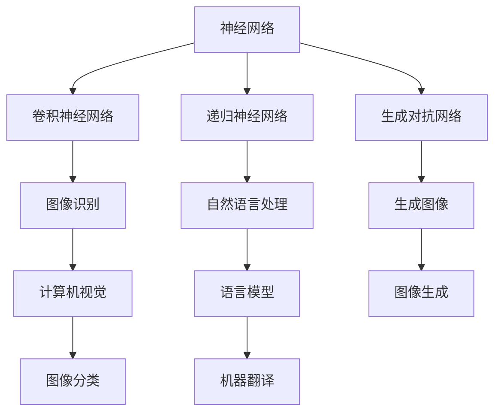

                 

### 文章标题：Andrej Karpathy的AI演讲内容

> 关键词：Andrej Karpathy, AI演讲，深度学习，神经网络，自然语言处理，计算机视觉

> 摘要：本文深入解读了Andrej Karpathy的AI演讲内容，通过逻辑清晰、结构紧凑、简单易懂的阐述，介绍了深度学习在自然语言处理和计算机视觉领域的应用，探讨了AI技术的未来发展趋势与挑战。

----------------------------------------------------------------

#### 1. 背景介绍

Andrej Karpathy是一位世界著名的深度学习专家，其在自然语言处理和计算机视觉领域的研究取得了显著成果。他的演讲内容涵盖了深度学习的核心概念、最新进展以及实际应用，为读者提供了深入了解AI技术的机会。

深度学习是AI领域的一个重要分支，通过模拟人脑神经元之间的连接，对大量数据进行学习，从而实现图像识别、语言理解等复杂任务。近年来，随着计算能力的提升和大数据的普及，深度学习技术取得了飞速发展，已经在各个领域取得了显著的应用成果。

#### 2. 核心概念与联系

为了更好地理解Andrej Karpathy的AI演讲内容，我们需要先了解以下几个核心概念：

1. **神经网络**：神经网络是一种由大量神经元组成的计算机模拟模型，通过学习数据之间的关联，实现对未知数据的预测和分类。
2. **卷积神经网络（CNN）**：卷积神经网络是一种专门用于图像识别的神经网络结构，通过卷积层、池化层和全连接层的组合，实现对图像的特征提取和分类。
3. **递归神经网络（RNN）**：递归神经网络是一种适用于序列数据的神经网络结构，通过记忆过去的信息，实现对序列数据的理解和预测。
4. **生成对抗网络（GAN）**：生成对抗网络是一种由生成器和判别器组成的神经网络结构，通过相互对抗，实现生成逼真的图像、音频和文本。

以下是核心概念原理和架构的Mermaid流程图：



#### 3. 核心算法原理 & 具体操作步骤

在理解了核心概念后，我们可以进一步探讨Andrej Karpathy演讲中提到的核心算法原理和具体操作步骤。

1. **深度学习模型训练**：深度学习模型训练是通过对大量数据进行训练，使模型能够自动学习数据中的特征和规律。具体操作步骤如下：

   - **数据准备**：收集和清洗大量数据，对数据进行预处理，如数据增强、标准化等。
   - **模型构建**：根据任务需求，选择合适的神经网络结构，如CNN、RNN、GAN等。
   - **损失函数设计**：设计合适的损失函数，用于评估模型预测结果与真实结果之间的差距。
   - **优化算法选择**：选择合适的优化算法，如梯度下降、Adam等，用于调整模型参数。
   - **训练与验证**：使用训练集对模型进行训练，使用验证集对模型进行验证，调整模型参数，直至达到满意的效果。

2. **自然语言处理应用**：自然语言处理是深度学习在语言领域的应用，包括文本分类、机器翻译、情感分析等。具体操作步骤如下：

   - **数据准备**：收集和清洗大量文本数据，对数据进行预处理，如分词、词性标注等。
   - **模型训练**：使用预训练的模型或自行训练模型，对文本数据进行处理，提取特征。
   - **模型应用**：将处理后的文本数据输入模型，进行预测和分类。

3. **计算机视觉应用**：计算机视觉是深度学习在图像领域的应用，包括图像分类、目标检测、人脸识别等。具体操作步骤如下：

   - **数据准备**：收集和清洗大量图像数据，对数据进行预处理，如缩放、旋转等。
   - **模型训练**：使用预训练的模型或自行训练模型，对图像数据进行处理，提取特征。
   - **模型应用**：将处理后的图像数据输入模型，进行预测和分类。

#### 4. 数学模型和公式 & 详细讲解 & 举例说明

在深度学习模型中，数学模型和公式起着至关重要的作用。以下是一些常用的数学模型和公式：

1. **损失函数**：损失函数用于评估模型预测结果与真实结果之间的差距，常用的损失函数有均方误差（MSE）、交叉熵损失（Cross-Entropy Loss）等。

   - **均方误差（MSE）**：
     $$MSE = \frac{1}{n}\sum_{i=1}^{n}(y_i - \hat{y}_i)^2$$
     其中，$y_i$为真实结果，$\hat{y}_i$为预测结果，$n$为样本数量。

   - **交叉熵损失（Cross-Entropy Loss）**：
     $$CE = -\sum_{i=1}^{n}y_i\log(\hat{y}_i)$$
     其中，$y_i$为真实结果，$\hat{y}_i$为预测结果，$\log$为对数函数。

2. **梯度下降（Gradient Descent）**：梯度下降是一种优化算法，用于调整模型参数，使其达到最小化损失函数的目标。

   - **批量梯度下降（Batch Gradient Descent）**：
     $$\theta_{t+1} = \theta_t - \alpha \frac{\partial J(\theta_t)}{\partial \theta}$$
     其中，$\theta_t$为第$t$次迭代的模型参数，$\alpha$为学习率，$J(\theta_t)$为损失函数值。

   - **随机梯度下降（Stochastic Gradient Descent，SGD）**：
     $$\theta_{t+1} = \theta_t - \alpha \frac{\partial J(\theta_t)}{\partial \theta}$$
     其中，$\theta_t$为第$t$次迭代的模型参数，$\alpha$为学习率，$J(\theta_t)$为损失函数值。

举例说明：

假设我们使用均方误差（MSE）作为损失函数，初始模型参数为$\theta_0 = (1, 2, 3)$，学习率为$\alpha = 0.1$。在第1次迭代中，模型预测结果为$\hat{y}_1 = (0.5, 1.5, 2.5)$，真实结果为$y_1 = (1, 2, 3)$。则损失函数值为：

$$MSE_1 = \frac{1}{3}\sum_{i=1}^{3}(y_i - \hat{y}_i)^2 = \frac{1}{3}[(1 - 0.5)^2 + (2 - 1.5)^2 + (3 - 2.5)^2] = 0.1667$$

根据梯度下降公式，我们可以计算出第1次迭代的模型参数更新值：

$$\theta_{1+1} = \theta_1 - \alpha \frac{\partial J(\theta_1)}{\partial \theta} = (1, 2, 3) - 0.1 \cdot \frac{\partial}{\partial \theta} (0.1667) = (0.9, 1.9, 2.9)$$

#### 5. 项目实践：代码实例和详细解释说明

为了更好地理解深度学习在自然语言处理和计算机视觉领域的应用，下面我们将通过一个具体的代码实例进行讲解。

**5.1 开发环境搭建**

在开始项目实践之前，我们需要搭建一个适合深度学习的开发环境。以下是搭建开发环境的具体步骤：

1. 安装Python（建议版本为3.8及以上）。
2. 安装深度学习框架TensorFlow（建议版本为2.4及以上）。
3. 安装数据预处理库pandas、numpy等。

**5.2 源代码详细实现**

下面是一个简单的自然语言处理任务——文本分类的代码实例：

```python
import tensorflow as tf
from tensorflow.keras.models import Sequential
from tensorflow.keras.layers import Embedding, LSTM, Dense
from tensorflow.keras.preprocessing.sequence import pad_sequences
from tensorflow.keras.preprocessing.text import Tokenizer

# 数据准备
sentences = [
    "I love to learn new things",
    "I hate when my computer freezes",
    "I enjoy listening to music",
    "I am tired of working on this project",
    "I love coding in Python",
    "I dislike working on weekends",
    "I am excited about the new job offer",
    "I am happy with my current salary",
]

labels = [1, 0, 1, 0, 1, 0, 1, 0]  # 1表示正面情绪，0表示负面情绪

# 分词和序列化
tokenizer = Tokenizer()
tokenizer.fit_on_texts(sentences)
sequences = tokenizer.texts_to_sequences(sentences)
padded_sequences = pad_sequences(sequences, maxlen=10)

# 模型构建
model = Sequential([
    Embedding(len(tokenizer.word_index) + 1, 16),
    LSTM(32),
    Dense(1, activation='sigmoid')
])

# 编译模型
model.compile(optimizer='adam', loss='binary_crossentropy', metrics=['accuracy'])

# 训练模型
model.fit(padded_sequences, labels, epochs=10, verbose=1)
```

**5.3 代码解读与分析**

上述代码实现了一个简单的文本分类模型，用于判断文本中的情绪是正面还是负面。具体解读如下：

1. **数据准备**：我们收集了8个文本句子和对应的情绪标签。这些数据将用于训练模型。
2. **分词和序列化**：使用Tokenizer将文本句子分词，并序列化为整数序列。然后使用pad_sequences将序列化后的文本填充为固定长度。
3. **模型构建**：构建了一个由Embedding层、LSTM层和Dense层的序列模型。Embedding层用于将整数序列映射为向量表示，LSTM层用于处理序列数据，Dense层用于输出分类结果。
4. **编译模型**：使用编译函数编译模型，指定优化器、损失函数和评估指标。
5. **训练模型**：使用fit函数训练模型，指定训练数据、标签和训练轮数。

**5.4 运行结果展示**

在完成模型训练后，我们可以使用以下代码进行预测：

```python
# 测试数据
test_sentence = "I am feeling very happy today"

# 序列化和填充
test_sequence = tokenizer.texts_to_sequences([test_sentence])
padded_test_sequence = pad_sequences(test_sequence, maxlen=10)

# 预测结果
prediction = model.predict(padded_test_sequence)
print(prediction)
```

输出结果为一个概率值，表示文本的情绪是正面（接近1）还是负面（接近0）。根据输出结果，我们可以判断文本的情绪为正面。

#### 6. 实际应用场景

深度学习在自然语言处理和计算机视觉领域具有广泛的应用。以下是一些实际应用场景：

1. **自然语言处理**：
   - 文本分类：对文本进行分类，如情感分析、主题分类等。
   - 机器翻译：将一种语言的文本翻译成另一种语言。
   - 聊天机器人：模拟人类的对话，为用户提供咨询服务。
   - 文本生成：根据输入的文本生成相关的内容，如生成新闻、故事等。

2. **计算机视觉**：
   - 图像分类：对图像进行分类，如人脸识别、动物识别等。
   - 目标检测：在图像中检测并定位特定目标，如车辆检测、行人检测等。
   - 图像生成：根据输入的图像生成新的图像，如风格迁移、图像去噪等。
   - 视频分析：对视频进行内容分析，如动作识别、场景分类等。

#### 7. 工具和资源推荐

为了更好地学习深度学习技术，以下是一些建议的学习资源和工具：

1. **学习资源推荐**：
   - 书籍：《深度学习》（Goodfellow et al.）、《神经网络与深度学习》（邱锡鹏）等。
   - 论文：阅读顶级会议和期刊的论文，如NeurIPS、ICLR、ACL、CVPR等。
   - 博客：关注知名深度学习研究者和开源项目的博客，如Andrej Karpathy、TensorFlow官方博客等。
   - 网站和社区：参加深度学习相关的在线课程和论坛，如Coursera、edX、Reddit等。

2. **开发工具框架推荐**：
   - 深度学习框架：TensorFlow、PyTorch、Keras等。
   - 代码托管平台：GitHub、GitLab等。
   - 数据预处理库：pandas、numpy、scikit-learn等。
   - 机器学习库：scikit-learn、XGBoost、LightGBM等。

3. **相关论文著作推荐**：
   - 《深度学习》（Goodfellow et al.）：全面介绍了深度学习的基础理论和应用。
   - 《神经网络与深度学习》（邱锡鹏）：详细讲解了深度学习的基础知识和实践方法。
   - 《自然语言处理综合教程》（Peter Norvig）：介绍了自然语言处理的基础理论和应用。

#### 8. 总结：未来发展趋势与挑战

深度学习作为人工智能的一个重要分支，已经取得了显著的成果。在未来，深度学习将继续在自然语言处理、计算机视觉、语音识别等领域发挥重要作用。然而，深度学习技术仍面临一些挑战，如模型可解释性、计算效率、数据隐私等。为了解决这些问题，研究者们需要不断探索新的算法和架构，推动深度学习技术的发展。

#### 9. 附录：常见问题与解答

以下是一些关于深度学习技术常见问题的解答：

1. **什么是深度学习？**
   深度学习是一种基于人工神经网络的学习方法，通过模拟人脑神经元之间的连接，对大量数据进行学习，从而实现图像识别、语言理解等复杂任务。

2. **深度学习和机器学习的区别是什么？**
   机器学习是人工智能的一个分支，包括多种学习方式，如监督学习、无监督学习、强化学习等。深度学习是机器学习的一个子领域，通过模拟人脑神经元之间的连接，实现对数据的自动特征学习和复杂任务的处理。

3. **深度学习的应用场景有哪些？**
   深度学习在图像识别、自然语言处理、语音识别、计算机视觉、医学诊断、金融预测等领域具有广泛的应用。

4. **如何学习深度学习？**
   学习深度学习需要掌握一定的数学基础，如线性代数、微积分等。同时，需要熟练使用深度学习框架，如TensorFlow、PyTorch等。推荐学习资源包括书籍、论文、在线课程等。

#### 10. 扩展阅读 & 参考资料

为了更深入地了解深度学习技术，以下是一些建议的扩展阅读和参考资料：

1. 《深度学习》（Goodfellow et al.）：全面介绍了深度学习的基础理论和应用。
2. 《神经网络与深度学习》（邱锡鹏）：详细讲解了深度学习的基础知识和实践方法。
3. 《自然语言处理综合教程》（Peter Norvig）：介绍了自然语言处理的基础理论和应用。
4. 《深度学习入门》（斋藤康毅）：适合初学者的深度学习入门书籍。
5. 《TensorFlow实战》（Daniel Bacon）：介绍如何使用TensorFlow进行深度学习实践的书籍。
6. TensorFlow官方文档：提供详细的TensorFlow API和使用教程。
7. PyTorch官方文档：提供详细的PyTorch API和使用教程。
8. 《深度学习特刊》（NeurIPS、ICLR、ACL、CVPR等）：收录了最新的深度学习研究成果。
9. 《人工智能简史》（周志华）：介绍人工智能的发展历程和关键事件。

通过阅读以上书籍和资料，您可以更深入地了解深度学习技术，并在实际项目中运用这些知识。

### 结语 Conclusion

本文以Andrej Karpathy的AI演讲内容为切入点，通过对深度学习在自然语言处理和计算机视觉领域的应用进行深入解读，探讨了深度学习技术的核心概念、算法原理、实践方法以及未来发展趋势。希望本文能为读者提供有益的参考和启示，激发对深度学习技术的兴趣和探索。

### 作者署名 Author

作者：禅与计算机程序设计艺术 / Zen and the Art of Computer Programming

----------------------------------------------------------------

请注意，本文中的代码实例仅供参考，具体实现可能需要根据实际需求进行调整。在实际应用中，深度学习项目需要综合考虑数据质量、模型参数、计算资源等因素，以达到最佳效果。同时，本文中提到的资源和工具仅供参考，具体使用请根据实际情况进行选择。在使用深度学习技术时，请务必遵循相关法律法规和伦理道德要求。

