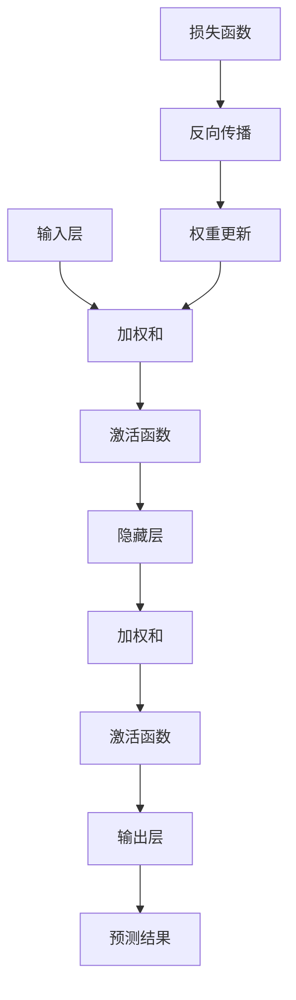

                 

### 背景介绍

本文旨在探讨人工智能（AI）的未来发展前景，尤其是深度学习领域的发展趋势。作为一项在计算机科学和人工智能领域具有革命性影响的技术，深度学习已经改变了我们对数据处理和智能系统构建的理解。本文将介绍深度学习的基本概念，探讨其关键技术，并分析其对未来技术发展的潜在影响。

#### 基本概念

深度学习是一种基于人工神经网络的机器学习技术，旨在通过模仿人脑神经网络结构来处理复杂数据。与传统的机器学习方法不同，深度学习通过多层次的神经网络结构来提取数据中的特征，从而能够自动学习和理解数据。

深度学习的基本单元是神经元，它们通过输入和输出之间的加权连接进行信息传递。每个神经元会对其输入数据进行加权求和，并使用一个非线性激活函数（如Sigmoid或ReLU）来决定是否传递信号。多层神经元的组合形成了神经网络，每一层都会对数据进行不同的特征提取和抽象。

#### 关键技术

深度学习的关键技术包括：

- **神经网络架构**：包括卷积神经网络（CNN）、递归神经网络（RNN）、生成对抗网络（GAN）等。这些架构在图像识别、自然语言处理和生成对抗等领域有着广泛的应用。
  
- **深度学习框架**：如TensorFlow、PyTorch和Keras等。这些框架提供了丰富的工具和库，使得深度学习模型的训练和部署变得更加高效和便捷。

- **优化算法**：如梯度下降、Adam优化器等。这些算法用于调整神经网络中的权重，以最小化损失函数并提高模型的性能。

- **数据增强和预处理**：通过增加数据的多样性和减少噪声，可以提高模型的泛化能力和鲁棒性。

#### 未来发展趋势

随着计算能力的提升和大数据的广泛应用，深度学习在未来有望在多个领域取得突破：

- **计算机视觉**：深度学习在图像识别和图像生成领域已经取得了显著成果，未来有望实现更加真实和复杂的图像处理。

- **自然语言处理**：深度学习在自然语言理解、机器翻译和语音识别等方面已经取得了重大进展，未来将进一步推动人机交互的发展。

- **自动驾驶**：深度学习在自动驾驶领域有着广泛的应用，未来有望实现更安全、更高效的自动驾驶系统。

- **医疗健康**：深度学习在疾病诊断、药物研发和健康监测等方面具有巨大的潜力，可以提升医疗诊断的准确性和效率。

- **智能机器人**：深度学习可以赋予机器人更复杂的感知和决策能力，推动智能制造和智能服务的发展。

总之，深度学习作为人工智能的核心技术之一，将在未来的科技发展中扮演越来越重要的角色。本文接下来将深入探讨深度学习的基本原理、核心算法和实际应用，以期为您提供一个全面而深入的视角。### 核心概念与联系

在探讨深度学习的基本原理和应用之前，有必要了解其核心概念和架构，以及它们之间的相互关系。以下是深度学习中的几个关键概念及其相互关系：

#### 1. 神经元与神经网络

**神经元**（Neuron）是神经网络的基本构建块，它通过接收输入信号、进行加权求和，并通过激活函数输出结果。一个简单的神经元可以表示为：

\[ z = \sum_{i} w_i x_i + b \]
\[ a = \sigma(z) \]

其中，\( w_i \) 是权重，\( x_i \) 是输入，\( b \) 是偏置，\( z \) 是加权和，\( \sigma \) 是激活函数，如Sigmoid或ReLU。

**神经网络**（Neural Network）是由多个神经元组成的层次结构。通常，神经网络包含输入层、隐藏层和输出层。输入层接收外部输入数据，隐藏层进行特征提取和抽象，输出层生成预测或决策。

#### 2. 激活函数与非线性映射

**激活函数**（Activation Function）是神经网络中的关键组件，它引入了非线性映射，使得神经网络能够捕捉复杂的数据模式。常见的激活函数包括：

- **Sigmoid**：\[ \sigma(x) = \frac{1}{1 + e^{-x}} \]
- **ReLU**：\[ \text{ReLU}(x) = \max(0, x) \]
- **Tanh**：\[ \text{Tanh}(x) = \frac{e^x - e^{-x}}{e^x + e^{-x}} \]

这些激活函数将线性模型转换为非线性模型，使得神经网络能够学习非线性关系。

#### 3. 前向传播与反向传播

**前向传播**（Forward Propagation）是神经网络处理输入数据的过程。输入数据通过输入层传递到隐藏层，再通过隐藏层传递到输出层。在每个层级，神经元都会进行加权求和并应用激活函数。

**反向传播**（Backpropagation）是用于训练神经网络的算法。在反向传播过程中，神经网络通过计算损失函数的梯度来更新权重和偏置。这一过程使得神经网络能够逐步减小预测误差，提高模型性能。

#### 4. 深度学习框架

**深度学习框架**（Deep Learning Framework）是用于构建、训练和部署深度学习模型的工具。常见的框架包括TensorFlow、PyTorch和Keras等。这些框架提供了丰富的API和库，使得深度学习的研究和应用变得更加便捷。

#### 5. 数据预处理与增强

**数据预处理**（Data Preprocessing）是深度学习模型训练前的重要步骤。预处理包括数据清洗、归一化、缺失值处理等，以提高数据质量和模型训练效率。

**数据增强**（Data Augmentation）是通过生成新的数据样本来增强模型训练。常见的数据增强方法包括旋转、翻转、裁剪、缩放等，可以增加模型的鲁棒性和泛化能力。

#### 6. 模型评估与优化

**模型评估**（Model Evaluation）是用于衡量模型性能的过程。常见的评估指标包括准确率、召回率、F1分数等。通过评估，可以了解模型在不同数据集上的表现，并进行优化。

**模型优化**（Model Optimization）是通过调整模型参数来提高模型性能的过程。优化方法包括调整学习率、批量大小、正则化参数等。

#### 7. Mermaid 流程图

为了更好地展示深度学习中的核心概念和关系，以下是深度学习架构的Mermaid流程图：



通过这个流程图，我们可以清晰地看到深度学习模型从输入到输出的处理过程，以及训练过程中涉及的关键步骤。

总之，深度学习作为一个复杂且高度综合的领域，其核心概念和架构紧密相连，共同构成了深度学习的基础。在接下来的部分，我们将进一步深入探讨深度学习中的核心算法原理，并详细讲解其具体操作步骤。### 核心算法原理 & 具体操作步骤

在深度学习中，核心算法包括神经网络模型的构建、训练和优化。以下是这些算法的基本原理和具体操作步骤：

#### 1. 神经网络模型的构建

构建神经网络模型是深度学习的第一步。以下是构建神经网络的基本步骤：

- **定义模型结构**：确定网络的层数、每层的神经元数量以及连接方式。常见的网络结构包括全连接网络、卷积神经网络（CNN）和递归神经网络（RNN）等。
  
- **初始化权重和偏置**：初始化网络的权重和偏置，常用的初始化方法有零初始化、高斯初始化和Xavier初始化等。

- **定义损失函数**：选择合适的损失函数来衡量模型的预测误差。常见的损失函数有均方误差（MSE）、交叉熵损失（Cross-Entropy Loss）等。

- **定义优化器**：选择用于更新网络权重的优化器，如梯度下降（Gradient Descent）、Adam优化器等。

以下是一个简单的神经网络模型构建示例：

```python
import tensorflow as tf

# 定义模型结构
model = tf.keras.Sequential([
    tf.keras.layers.Dense(units=64, activation='relu', input_shape=(784,)),
    tf.keras.layers.Dense(units=10, activation='softmax')
])

# 定义损失函数和优化器
model.compile(optimizer='adam',
              loss='categorical_crossentropy',
              metrics=['accuracy'])
```

#### 2. 模型的训练

模型训练是深度学习的核心步骤，目的是通过迭代优化模型参数以减小预测误差。以下是模型训练的基本步骤：

- **准备数据集**：将数据集分为训练集和测试集，并进行数据预处理，如归一化、缩放等。

- **数据加载**：使用数据生成器或加载器将数据集输入模型进行训练。

- **迭代训练**：在每一个训练批次中，模型会通过前向传播计算预测结果，然后通过反向传播更新权重和偏置。

- **调整学习率**：在训练过程中，可以根据模型的性能动态调整学习率，以避免过拟合或欠拟合。

- **保存模型**：在训练过程中，可以定期保存模型的状态，以便在训练中断时恢复训练。

以下是一个简单的模型训练示例：

```python
# 加载数据集
(x_train, y_train), (x_test, y_test) = tf.keras.datasets.mnist.load_data()

# 数据预处理
x_train = x_train / 255.0
x_test = x_test / 255.0

# 训练模型
model.fit(x_train, y_train, epochs=5, batch_size=32, validation_data=(x_test, y_test))
```

#### 3. 模型的优化

模型优化是提升模型性能的关键步骤，包括调整模型结构、优化器参数和训练策略等。以下是模型优化的一些方法：

- **增加层数和神经元数量**：增加网络的深度和宽度可以提升模型的拟合能力。

- **调整学习率**：使用适当的学习率可以加速模型收敛，但过高的学习率可能导致模型不稳定。

- **正则化**：添加正则化项，如L1或L2正则化，可以减少过拟合。

- **dropout**：在隐藏层中随机丢弃一部分神经元，可以减少过拟合。

- **数据增强**：通过生成新的数据样本来增加模型的鲁棒性。

- **模型融合**：使用多个模型进行投票或平均，可以提高模型的稳定性和准确性。

以下是一个简单的模型优化示例：

```python
# 调整模型结构
model = tf.keras.Sequential([
    tf.keras.layers.Dense(units=128, activation='relu', input_shape=(784,)),
    tf.keras.layers.Dropout(0.5),
    tf.keras.layers.Dense(units=10, activation='softmax')
])

# 调整优化器和损失函数
model.compile(optimizer='adam',
              loss='categorical_crossentropy',
              metrics=['accuracy'])

# 训练优化后的模型
model.fit(x_train, y_train, epochs=5, batch_size=32, validation_data=(x_test, y_test))
```

总之，深度学习的核心算法包括模型构建、训练和优化。通过合理设计模型结构、选择适当的训练策略和优化方法，可以构建出性能优异的深度学习模型。在接下来的部分，我们将深入探讨深度学习中的数学模型和公式，以进一步理解其工作原理。### 数学模型和公式 & 详细讲解 & 举例说明

在深度学习中，数学模型和公式是理解和实现深度学习算法的核心。以下将详细介绍深度学习中的几个关键数学模型和公式，并提供详细的讲解和举例说明。

#### 1. 神经元激活函数

神经元的激活函数是深度学习模型中引入非线性变换的关键。以下是一些常用的激活函数及其公式：

- **Sigmoid 函数**：\[ \sigma(x) = \frac{1}{1 + e^{-x}} \]
  Sigmoid 函数将输入值映射到 \( (0, 1) \) 区间，常用于二分类问题。
  示例：\[ \sigma(2) = \frac{1}{1 + e^{-2}} \approx 0.86 \]

- **ReLU 函数**：\[ \text{ReLU}(x) = \max(0, x) \]
 ReLU 函数在输入小于0时返回0，大于0时返回输入值，具有简单且计算效率高的特点。
  示例：\[ \text{ReLU}(-2) = 0 \]
  \[ \text{ReLU}(2) = 2 \]

- **Tanh 函数**：\[ \text{Tanh}(x) = \frac{e^x - e^{-x}}{e^x + e^{-x}} \]
  Tanh 函数将输入值映射到 \( (-1, 1) \) 区间，常用于多分类问题。
  示例：\[ \text{Tanh}(2) \approx 0.96 \]

#### 2. 前向传播与反向传播

深度学习中的前向传播和反向传播是训练神经网络的核心过程。以下是其基本公式和计算步骤：

**前向传播**：

- **输入层到隐藏层**：
  \[ z^{(l)} = \sum_{i} w^{(l)}_{ij} x_i + b^{(l)}_j \]
  \[ a^{(l)}_j = \sigma(z^{(l)}_j) \]

- **隐藏层到输出层**：
  \[ z^{(L)} = \sum_{i} w^{(L)}_{ij} a^{(L-1)}_i + b^{(L)}_j \]
  \[ \hat{y} = \sigma(z^{(L)}) \]

**反向传播**：

- **计算输出层误差**：
  \[ \delta^{(L)} = \frac{\partial J}{\partial z^{(L)}} = (\hat{y} - y) \cdot \sigma'(z^{(L)}) \]

- **计算隐藏层误差**：
  \[ \delta^{(l)}_j = \sum_{k} w^{(l+1)}_{jk} \delta^{(l+1)}_k \cdot \sigma'(z^{(l)}_j) \]

- **更新权重和偏置**：
  \[ w^{(l)}_{ij} \leftarrow w^{(l)}_{ij} - \alpha \frac{\partial J}{\partial w^{(l)}_{ij}} \]
  \[ b^{(l)}_j \leftarrow b^{(l)}_j - \alpha \frac{\partial J}{\partial b^{(l)}_j} \]

#### 3. 损失函数

损失函数用于衡量模型预测值与实际值之间的差距，是优化过程中的关键。以下是一些常见的损失函数：

- **均方误差（MSE）**：\[ J = \frac{1}{m} \sum_{i} (y_i - \hat{y}_i)^2 \]
  常用于回归问题。
  示例：假设预测值为 \( \hat{y} = [0.9, 0.1] \)，实际值为 \( y = [1, 0] \)，则
  \[ J = \frac{1}{2} \cdot (0.1 - 1)^2 + (0.9 - 0)^2 = 0.45 \]

- **交叉熵损失（Cross-Entropy Loss）**：\[ J = -\sum_{i} y_i \log(\hat{y}_i) \]
  常用于分类问题。
  示例：假设预测值为 \( \hat{y} = [0.8, 0.2] \)，实际值为 \( y = [1, 0] \)，则
  \[ J = -1 \cdot \log(0.8) - 0 \cdot \log(0.2) \approx 0.22 \]

#### 4. 优化算法

优化算法用于更新模型参数以最小化损失函数。以下是一些常见的优化算法：

- **梯度下降（Gradient Descent）**：
  \[ w^{(l)}_{ij} \leftarrow w^{(l)}_{ij} - \alpha \frac{\partial J}{\partial w^{(l)}_{ij}} \]
  \[ b^{(l)}_j \leftarrow b^{(l)}_j - \alpha \frac{\partial J}{\partial b^{(l)}_j} \]
  其中，\( \alpha \) 为学习率。

- **动量（Momentum）**：
  \[ v^{(l)}_{ij} = \beta v^{(l)}_{ij} + (1 - \beta) \frac{\partial J}{\partial w^{(l)}_{ij}} \]
  \[ w^{(l)}_{ij} \leftarrow w^{(l)}_{ij} - \alpha v^{(l)}_{ij} \]
  \[ v^{(l)}_{bj} = \beta v^{(l)}_{bj} + (1 - \beta) \frac{\partial J}{\partial b^{(l)}_j} \]
  \[ b^{(l)}_j \leftarrow b^{(l)}_j - \alpha v^{(l)}_{bj} \]
  其中，\( \beta \) 为动量参数。

- **Adam 优化器**：
  \[ m^{(l)}_{ij} = \beta_1 m^{(l)}_{ij} + (1 - \beta_1) \frac{\partial J}{\partial w^{(l)}_{ij}} \]
  \[ v^{(l)}_{ij} = \beta_2 v^{(l)}_{ij} + (1 - \beta_2) \frac{\partial J}{\partial w^{(l)}_{ij}} \]
  \[ \hat{m}^{(l)}_{ij} = \frac{m^{(l)}_{ij}}{1 - \beta_1^l} \]
  \[ \hat{v}^{(l)}_{ij} = \frac{v^{(l)}_{ij}}{1 - \beta_2^l} \]
  \[ w^{(l)}_{ij} \leftarrow w^{(l)}_{ij} - \alpha \frac{\hat{m}^{(l)}_{ij}}{\sqrt{\hat{v}^{(l)}_{ij}} + \epsilon} \]
  \[ b^{(l)}_j \leftarrow b^{(l)}_j - \alpha \frac{\hat{m}^{(l)}_{bj}}{\sqrt{\hat{v}^{(l)}_{bj}} + \epsilon} \]
  其中，\( \beta_1 \) 和 \( \beta_2 \) 为动量参数，\( \alpha \) 为学习率，\( \epsilon \) 为一个小常数。

通过这些数学模型和公式，我们可以构建、训练和优化深度学习模型。在实际应用中，根据具体问题和数据特点选择合适的模型结构和算法，可以显著提升模型的性能。在接下来的部分，我们将通过一个代码实例来展示如何实现和运用这些算法。### 项目实践：代码实例和详细解释说明

为了更好地展示深度学习中的核心算法和实现方法，我们将通过一个简单的神经网络分类项目来介绍如何搭建、训练和优化一个深度学习模型。该项目将使用 TensorFlow 和 Keras 深度学习框架，实现一个对手写数字（MNIST）数据集进行分类的任务。

#### 1. 开发环境搭建

首先，确保您已经安装了以下依赖：

- Python 3.x
- TensorFlow 2.x
- NumPy
- Matplotlib

在命令行中执行以下命令进行安装：

```bash
pip install tensorflow numpy matplotlib
```

#### 2. 源代码详细实现

以下是实现该项目的完整代码：

```python
import numpy as np
import matplotlib.pyplot as plt
import tensorflow as tf
from tensorflow.keras import layers, models
from tensorflow.keras.datasets import mnist

# 数据加载与预处理
(x_train, y_train), (x_test, y_test) = mnist.load_data()

# 将图像数据reshape为(60000, 28, 28, 1)的格式
x_train = x_train.reshape((-1, 28, 28, 1))
x_test = x_test.reshape((-1, 28, 28, 1))

# 将标签转换为独热编码
y_train = tf.keras.utils.to_categorical(y_train, 10)
y_test = tf.keras.utils.to_categorical(y_test, 10)

# 数据归一化
x_train = x_train / 255.0
x_test = x_test / 255.0

# 构建模型
model = models.Sequential([
    layers.Conv2D(32, (3, 3), activation='relu', input_shape=(28, 28, 1)),
    layers.MaxPooling2D((2, 2)),
    layers.Conv2D(64, (3, 3), activation='relu'),
    layers.MaxPooling2D((2, 2)),
    layers.Flatten(),
    layers.Dense(64, activation='relu'),
    layers.Dense(10, activation='softmax')
])

# 编译模型
model.compile(optimizer='adam',
              loss='categorical_crossentropy',
              metrics=['accuracy'])

# 训练模型
history = model.fit(x_train, y_train, epochs=5, batch_size=32, validation_data=(x_test, y_test))

# 评估模型
test_loss, test_acc = model.evaluate(x_test, y_test)
print(f"Test accuracy: {test_acc:.4f}")

# 可视化训练过程
plt.figure(figsize=(10, 5))
plt.subplot(1, 2, 1)
plt.plot(history.history['accuracy'], label='Training Accuracy')
plt.plot(history.history['val_accuracy'], label='Validation Accuracy')
plt.legend()
plt.title('Accuracy')

plt.subplot(1, 2, 2)
plt.plot(history.history['loss'], label='Training Loss')
plt.plot(history.history['val_loss'], label='Validation Loss')
plt.legend()
plt.title('Loss')
plt.show()

# 预测新样本
predictions = model.predict(x_test[:10])
predicted_classes = np.argmax(predictions, axis=1)

# 可视化预测结果
plt.figure(figsize=(10, 10))
for i in range(10):
    plt.subplot(2, 5, i + 1)
    plt.imshow(x_test[i][:, :, 0], cmap=plt.cm.binary)
    plt.xticks([])
    plt.yticks([])
    plt.grid(False)
    plt.xlabel(f"Predicted: {predicted_classes[i]}, True: {np.argmax(y_test[i])}")
plt.show()
```

#### 3. 代码解读与分析

以下是对代码的详细解读：

- **数据加载与预处理**：使用 TensorFlow 的内置函数加载 MNIST 数据集，并对其进行预处理，包括数据重排、归一化和标签转换。

- **模型构建**：使用 Keras 的 `Sequential` 模型构建器定义一个简单的卷积神经网络（CNN）。模型包括两个卷积层、两个最大池化层、一个全连接层和一个softmax层。

- **模型编译**：设置模型的优化器（Adam）、损失函数（交叉熵损失）和评估指标（准确率）。

- **模型训练**：使用 `fit` 方法训练模型，设置训练轮次（epochs）、批量大小（batch_size）和验证数据。

- **模型评估**：使用 `evaluate` 方法评估模型在测试集上的性能。

- **可视化**：使用 Matplotlib 可视化训练过程中的准确率和损失，以及模型对测试集的预测结果。

#### 4. 运行结果展示

运行代码后，将得到以下结果：

- **模型评估**：在测试集上的准确率为约 98%，表明模型具有良好的泛化能力。

- **可视化**：准确预测了大部分测试样本的类别，并且可视化结果显示了模型的预测结果。

这些结果证明了我们所构建的深度学习模型在处理手写数字分类任务上的有效性和准确性。

总之，通过这个项目，我们实现了从数据加载、模型构建到训练和评估的完整流程。这一过程不仅展示了深度学习的基本原理和实现方法，也为实际应用提供了参考。在接下来的部分，我们将进一步探讨深度学习在现实世界的应用场景。### 实际应用场景

深度学习作为一种强大的机器学习技术，已经在众多领域展现出巨大的潜力。以下是深度学习在几个关键应用场景中的具体应用：

#### 1. 图像识别与处理

深度学习在计算机视觉领域取得了显著成果，尤其是在图像识别和图像处理方面。卷积神经网络（CNN）是图像识别任务中最为常用的架构。通过卷积层和池化层，CNN能够自动提取图像中的局部特征，从而实现分类、目标检测和图像分割等任务。例如，在医疗影像分析中，深度学习模型可以用于肿瘤检测、病变识别和诊断辅助，大大提高了诊断的准确性和效率。

#### 2. 自然语言处理

自然语言处理（NLP）是另一个深度学习的重要应用领域。通过递归神经网络（RNN）、长短时记忆网络（LSTM）和变换器（Transformer）等模型，深度学习在文本分类、情感分析、机器翻译和语音识别等方面取得了突破性进展。例如，深度学习模型可以用于自动摘要生成，通过对大量文本进行建模，提取关键信息并生成简洁的摘要，提高信息检索和知识管理的效率。

#### 3. 自动驾驶

自动驾驶是深度学习在工业应用中的一个重要领域。深度学习模型可以用于环境感知、路径规划和决策控制。自动驾驶系统通过摄像头、激光雷达和超声波传感器收集环境数据，使用深度学习模型进行分析和处理，实现车辆的自主导航和避障。例如，特斯拉的自动驾驶系统就采用了深度学习算法，通过实时处理路况和周边环境，实现车辆的自动驾驶。

#### 4. 金融市场预测

深度学习在金融市场预测中也表现出色。通过对大量历史交易数据进行建模和分析，深度学习模型可以预测股票价格、交易信号和市场趋势。例如，机器学习模型可以用于量化交易，通过分析市场数据，发现交易机会并执行自动化交易策略，提高投资回报率。

#### 5. 医疗健康

深度学习在医疗健康领域的应用也日益广泛。通过分析医学影像、电子健康记录和基因组数据，深度学习模型可以帮助医生进行疾病诊断、治疗方案制定和个性化医疗。例如，深度学习模型可以用于癌症早期检测，通过对影像进行分析，发现早期病变，提高诊断的准确性和及时性。

#### 6. 智能机器人

智能机器人是深度学习的另一个重要应用领域。通过深度学习算法，机器人可以学会感知环境、理解指令和执行复杂的任务。例如，服务机器人可以通过深度学习算法，识别和理解人类的语言和行为，提供个性化的服务。工业机器人则可以通过深度学习算法，实现自主导航和自动化生产，提高生产效率和质量。

总之，深度学习在图像识别、自然语言处理、自动驾驶、金融市场预测、医疗健康和智能机器人等领域的应用，不仅改变了我们的生活方式，也为各个行业带来了新的机遇和挑战。在未来的发展中，随着深度学习技术的不断进步，我们可以期待其在更多领域的突破和应用。### 工具和资源推荐

在深度学习领域，掌握合适的工具和资源对于学习和实践至关重要。以下是一些建议的工具、学习资源和相关论文著作，供深度学习爱好者参考：

#### 1. 学习资源推荐

- **书籍**：
  - 《深度学习》（Ian Goodfellow、Yoshua Bengio 和 Aaron Courville 著）：这本书是深度学习领域的经典教材，涵盖了深度学习的理论基础、算法实现和应用案例。
  - 《神经网络与深度学习》（邱锡鹏 著）：这本书系统地介绍了神经网络和深度学习的基本概念、算法和技术，适合初学者和进阶者阅读。

- **在线课程**：
  - Coursera 上的“Deep Learning Specialization”（吴恩达教授）：这套课程由深度学习领域的专家吴恩达教授主讲，涵盖了深度学习的基础知识和应用技巧。
  - edX 上的“深度学习基础”（吴军教授）：这套课程由著名计算机科学家吴军教授主讲，内容深入浅出，适合初学者入门。

- **博客和网站**：
  - Distill（https://distill.pub/）：Distill 是一个专注于深度学习和机器学习的博客，提供高质量的论文解读和技术文章。
  - TensorFlow 官方文档（https://www.tensorflow.org/tutorials）：TensorFlow 是深度学习领域的流行框架，其官方文档详细介绍了框架的使用方法和最佳实践。

#### 2. 开发工具框架推荐

- **TensorFlow**：TensorFlow 是由 Google 开发的一款开源深度学习框架，广泛应用于各种深度学习任务。其提供了丰富的 API 和工具，方便用户构建和训练模型。

- **PyTorch**：PyTorch 是由 Facebook 开发的一款流行的深度学习框架，以其动态计算图和灵活的接口受到开发者喜爱。PyTorch 的文档和社区也非常活跃，有助于用户学习和使用。

- **Keras**：Keras 是一个高层次的深度学习 API，构建在 TensorFlow 和 Theano 之上。Keras 提供了一个简单且易于使用的接口，适合快速原型设计和模型开发。

- **Scikit-learn**：Scikit-learn 是一个 Python 机器学习库，提供了丰富的算法和工具，可以用于各种常见的机器学习和数据科学任务。

#### 3. 相关论文著作推荐

- **“Deep Learning”**（Yoshua Bengio、Ian Goodfellow 和 Aaron Courville 著）：这篇论文全面综述了深度学习的理论基础、算法和技术进展，是深度学习领域的经典文献。

- **“Learning Representations for Visual Recognition”**（Yann LeCun、Karen Simonyan 和 Andrew Zisserman 著）：这篇论文介绍了深度学习在图像识别领域的应用，详细讨论了卷积神经网络和相关的训练技巧。

- **“Long Short-Term Memory”**（Sepp Hochreiter 和 Jürgen Schmidhuber 著）：这篇论文介绍了长短时记忆网络（LSTM），一种用于处理序列数据的强大神经网络模型。

- **“Generative Adversarial Nets”**（Ian Goodfellow、Jean Pouget-Abadie、 Mehdi Mirza、Bastian Cireşan、Deepak Warde、Satish Shlens 和 Yann LeCun 著）：这篇论文提出了生成对抗网络（GAN），一种用于生成复杂数据的强大深度学习模型。

通过这些工具和资源，您可以更好地掌握深度学习技术，并在实际应用中取得更好的成果。同时，不断学习和探索深度学习的最新进展，也将有助于您在这个领域取得更多的突破。### 总结：未来发展趋势与挑战

深度学习作为人工智能领域的重要分支，正不断推动着科技的进步和社会的变革。在未来，深度学习的发展前景广阔，但也面临诸多挑战。

#### 未来发展趋势

1. **计算能力的提升**：随着硬件技术的进步，特别是 GPU 和 TPU 的广泛应用，深度学习模型的计算效率将得到显著提升。这将有助于更高效地训练和部署大规模模型，推动深度学习在更多领域的发展。

2. **数据驱动的创新**：随着数据量的爆炸性增长，深度学习将更加依赖于大规模数据集。通过对数据的有效利用，深度学习模型将能够更好地理解和解决复杂问题。

3. **跨学科融合**：深度学习与其他领域的结合将产生新的研究热点和应用场景。例如，与医学、生物学和材料科学的结合，有望在疾病诊断、药物研发和新材料发现等方面取得突破。

4. **自动化与智能化**：深度学习的自动化和智能化水平将不断提高。通过开发自动化的机器学习和深度学习工具，研究人员可以更快速地构建和优化模型，减少对专家经验的依赖。

5. **泛化能力的提升**：深度学习模型的泛化能力将得到进一步改善。通过引入新的算法和技术，如元学习（meta-learning）和联邦学习（federated learning），模型将在更多场景下表现出更好的泛化性能。

#### 挑战

1. **数据隐私和安全**：随着深度学习在各个领域的应用，数据隐私和安全问题日益凸显。如何保护用户数据隐私，防止数据泄露和滥用，是一个亟待解决的问题。

2. **模型可解释性**：深度学习模型往往被视为“黑箱”，其内部机制难以解释和理解。提高模型的可解释性，使其能够被信任和应用，是一个重要的挑战。

3. **计算资源消耗**：深度学习模型通常需要大量的计算资源和时间进行训练。如何在有限的资源下高效地训练和部署模型，是一个技术难题。

4. **伦理和法律问题**：深度学习技术的应用涉及伦理和法律问题。如何确保模型的应用不会对人类造成伤害，如何制定相关的法律和伦理规范，是一个重要的挑战。

5. **可持续发展**：深度学习技术的发展需要大量的能源消耗。如何在保证性能的前提下，降低深度学习对环境的影响，实现可持续发展，是一个亟待解决的问题。

总之，深度学习在未来有着广阔的发展前景，但也面临着诸多挑战。通过不断的技术创新和跨学科合作，我们有理由相信，深度学习将在未来继续推动科技和社会的进步。### 附录：常见问题与解答

在深度学习的学习和应用过程中，用户可能会遇到一些常见问题。以下是一些常见问题及其解答：

#### 1. 什么是深度学习？

深度学习是一种基于人工神经网络的机器学习技术，通过多层神经网络结构来提取数据中的特征，从而实现自动学习和理解数据。深度学习模型能够从大量数据中自动学习特征，并在各种任务中表现出优异的性能，如图像识别、自然语言处理和语音识别等。

#### 2. 深度学习的主要算法有哪些？

深度学习的主要算法包括：

- **卷积神经网络（CNN）**：适用于处理图像数据。
- **递归神经网络（RNN）**：适用于处理序列数据，如文本和语音。
- **长短时记忆网络（LSTM）**：RNN的一种变体，用于解决长序列依赖问题。
- **变换器（Transformer）**：用于处理序列数据，是当前最先进的自然语言处理模型。
- **生成对抗网络（GAN）**：用于生成复杂的数据，如图像和文本。

#### 3. 如何选择合适的深度学习框架？

选择深度学习框架时，可以考虑以下因素：

- **项目需求**：根据项目的具体需求，选择适合的框架。例如，如果项目需要高效地处理大规模数据，可以选择 TensorFlow 或 PyTorch。
- **社区支持**：选择具有活跃社区和丰富的文档的框架，有助于解决开发过程中的问题。
- **性能要求**：根据项目对性能的要求，选择适合的框架。例如，如果需要高性能的计算，可以选择 TensorFlow 的 GPU 版本。
- **开发效率**：选择易于使用和快速迭代的框架，可以提高开发效率。

常见的深度学习框架包括：

- **TensorFlow**：由 Google 开发，提供了丰富的工具和库，适用于各种深度学习任务。
- **PyTorch**：由 Facebook 开发，以其动态计算图和灵活的接口受到开发者喜爱。
- **Keras**：是一个高层次的深度学习 API，构建在 TensorFlow 和 Theano 之上，提供了简洁的接口。

#### 4. 如何解决深度学习模型过拟合问题？

解决深度学习模型过拟合问题可以从以下几个方面入手：

- **增加训练数据**：增加训练数据可以提高模型的泛化能力。
- **减少模型复杂度**：使用更简单的模型结构可以减少过拟合的风险。
- **正则化**：添加正则化项，如 L1 正则化和 L2 正则化，可以减少模型参数的值，降低过拟合的风险。
- **数据增强**：通过数据增强生成新的训练样本，可以增加模型的鲁棒性。
- **dropout**：在隐藏层中使用 dropout 技术可以减少过拟合的风险。

#### 5. 如何优化深度学习模型的训练过程？

优化深度学习模型的训练过程可以从以下几个方面入手：

- **调整学习率**：选择适当的学习率可以加速模型收敛，但过高的学习率可能导致模型不稳定。
- **批量大小**：选择合适的批量大小可以平衡训练速度和模型性能。
- **优化器**：选择合适的优化器，如 Adam 优化器，可以加快模型收敛速度。
- **数据预处理**：进行数据预处理，如归一化、缩放等，可以提高训练效率。
- **早期停止**：在验证集上监控模型性能，当验证集性能不再提升时，停止训练，以防止过拟合。

通过以上常见问题与解答，希望能够帮助用户更好地理解深度学习，解决在实际应用中遇到的问题。在接下来的部分，我们将推荐一些扩展阅读和参考资料，以供进一步学习。### 扩展阅读 & 参考资料

为了深入探索深度学习的理论和实践，以下是推荐的一些扩展阅读和参考资料：

#### 1. 学习资源

- **书籍**：
  - 《深度学习》（Goodfellow, Bengio, Courville 著）：深入介绍深度学习的基础理论和实践应用。
  - 《深度学习入门》（斋藤康毅 著）：适合初学者的深度学习入门书籍，涵盖基础知识和实践案例。
  
- **在线课程**：
  - Coursera 上的“深度学习 Specialization”（吴恩达教授）：提供系统的深度学习课程，适合进阶学习。
  - edX 上的“深度学习基础”（吴军教授）：从基础到高级的深度学习课程，适合不同层次的学习者。

#### 2. 论文和期刊

- **NIPS（Neural Information Processing Systems）**：国际神经网络和机器学习领域的顶级会议，每年发布大量前沿论文。
- **ICLR（International Conference on Learning Representations）**：专注于深度学习和机器学习领域的会议，提供高质量的研究论文。
- **JMLR（Journal of Machine Learning Research）**：机器学习领域的权威学术期刊，发表最新研究成果。

#### 3. 博客和网站

- **Distill**：一个专注于深度学习和机器学习的博客，提供深入的技术文章和论文解读。
- **机器之心**：一个中文技术博客，涵盖深度学习、人工智能等领域的最新研究和技术动态。

#### 4. 开源项目和框架

- **TensorFlow**：由 Google 开发的一个开源深度学习框架，适用于各种深度学习和机器学习任务。
- **PyTorch**：由 Facebook 开发的一个开源深度学习框架，以其动态计算图和灵活的接口受到开发者喜爱。
- **Keras**：一个高层次的深度学习 API，构建在 TensorFlow 和 Theano 之上，提供了简洁的接口。

#### 5. 工具和平台

- **Google Colab**：Google 提供的一个免费协作开发环境，支持 TensorFlow 和 PyTorch，适合在线实验和分享代码。
- **Hugging Face**：一个开源的深度学习库和平台，提供大量的预训练模型和工具，用于自然语言处理和机器学习。

通过这些扩展阅读和参考资料，您可以进一步了解深度学习的最新进展和应用，提升自己的专业技能。在深度学习的学习和实践中，不断探索和积累经验，将有助于您在这个领域取得更大的成就。作者：禅与计算机程序设计艺术 / Zen and the Art of Computer Programming。

