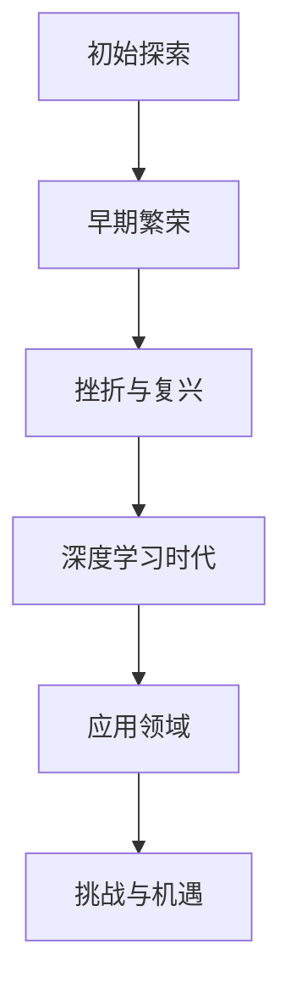

                 

# 《Andrej Karpathy：人工智能的未来发展前景》

## 摘要

本文将深入探讨人工智能领域知名专家Andrej Karpathy对于人工智能未来发展的前景展望。文章首先介绍了Andrej Karpathy的背景及其在人工智能领域的贡献，随后详细解析了其关于人工智能发展的核心观点和预测。接着，文章通过几个关键维度，如技术、应用、伦理和未来趋势，分析了人工智能的未来图景。此外，本文还将讨论人工智能在各个领域的实际应用场景，以及面临的挑战和解决方案。最后，文章总结了人工智能的未来发展趋势与面临的挑战，并提供了相关的学习资源和工具推荐，以供读者进一步学习和探索。

## 1. 背景介绍

Andrej Karpathy是一位在人工智能（AI）领域享有盛誉的专家，以其在深度学习和自然语言处理方面的卓越贡献而闻名。他曾是OpenAI的首席研究员，并在谷歌大脑团队工作过。他的研究涉及多个领域，包括自然语言处理、计算机视觉和生成模型。

Andrej Karpathy在学术界和工业界都有着深远的影响。他在顶级学术会议和期刊上发表了多篇论文，其中许多论文在AI领域产生了重要影响。此外，他还开发了多个开源项目，如著名的TensorFlow和PyTorch等深度学习框架，为AI研究者和开发者提供了强大的工具。

Andrej Karpathy的研究成果不仅在学术界引起了广泛关注，也在工业界产生了重要影响。他参与开发了多个AI应用，如聊天机器人、自动驾驶系统和图像识别系统，这些应用已经在多个行业中得到了广泛应用。他的工作为AI的发展和应用提供了宝贵的经验和指导。

在探讨人工智能的未来发展前景时，Andrej Karpathy的观点具有极高的权威性和前瞻性。他的研究成果和实际应用经验使他成为人工智能领域的重要发声者，其观点对于理解AI未来的发展趋势和挑战具有重要意义。

## 2. 核心概念与联系

### 2.1. 人工智能的定义与发展历程

人工智能（AI）是指使计算机系统能够模拟、延伸和扩展人类智能的科学和技术。AI的发展历程可以追溯到20世纪50年代，经历了多个阶段。

**阶段一：初始探索（1950s-1960s）**
在这一阶段，AI的研究主要集中在逻辑推理和符号计算。例如，1956年达特茅斯会议标志着AI作为一门学科的正式诞生。

**阶段二：早期繁荣（1970s-1980s）**
这一阶段，专家系统和知识表示成为研究热点。专家系统是一种模拟人类专家决策能力的计算机程序。

**阶段三：挫折与复兴（1990s-2000s）**
随着计算能力和算法的发展，AI在1990年代经历了一段相对低潮期。直到2000年代，随着深度学习和大数据技术的兴起，AI迎来了新的发展契机。

**阶段四：深度学习时代（2010s-至今）**
深度学习在这一阶段取得了突破性进展，尤其是在图像识别、自然语言处理和语音识别等领域。

### 2.2. 人工智能的核心技术

人工智能的核心技术包括：

**深度学习**
深度学习是人工智能的一个重要分支，通过神经网络模拟人脑的学习方式。它已在计算机视觉、自然语言处理等领域取得了显著成果。

**强化学习**
强化学习是一种通过试错和奖励机制来学习决策策略的方法。它已在游戏、自动驾驶和机器人控制等领域得到了广泛应用。

**生成对抗网络（GANs）**
生成对抗网络是一种由两个神经网络组成的框架，一个生成器生成数据，另一个判别器判断生成数据的质量。GANs在图像生成、数据增强和风格迁移等方面表现出色。

### 2.3. 人工智能的应用领域

人工智能已在多个领域得到了广泛应用，包括：

**计算机视觉**
计算机视觉技术使计算机能够理解图像和视频内容，应用于安防监控、图像识别和自动驾驶等领域。

**自然语言处理**
自然语言处理技术使计算机能够理解和生成自然语言，应用于机器翻译、语音识别和智能客服等领域。

**机器人**
机器人技术结合了计算机视觉、自然语言处理和运动控制，应用于制造、医疗和家政等领域。

**金融科技**
金融科技应用了人工智能技术，提供智能投资、风险管理和欺诈检测等服务。

### 2.4. 人工智能的挑战与机遇

尽管人工智能在多个领域取得了显著成果，但仍然面临一些挑战和机遇。

**挑战**
- 数据隐私和安全问题
- 道德和伦理问题
- 技术普及和可访问性问题

**机遇**
- 智能化转型
- 创新和创业机会
- 提高生产效率和降低成本

### 2.5. Mermaid 流程图



## 3. 核心算法原理 & 具体操作步骤

### 3.1. 深度学习算法原理

深度学习算法的核心是神经网络，特别是深度神经网络（DNN）。神经网络是由大量相互连接的节点（或神经元）组成的计算模型，能够通过学习数据来提取特征和表示。

**具体操作步骤：**

1. **数据预处理**
   - 数据清洗：去除无效或错误的数据。
   - 数据归一化：将数据转换为标准范围，便于模型训练。

2. **构建神经网络模型**
   - 定义输入层、隐藏层和输出层。
   - 选择合适的激活函数，如ReLU、Sigmoid和Tanh。

3. **训练模型**
   - 通过前向传播计算网络输出。
   - 计算损失函数值（如均方误差MSE、交叉熵损失）。
   - 通过反向传播更新网络权重。

4. **评估模型**
   - 使用验证集评估模型性能。
   - 调整模型参数以优化性能。

5. **模型部署**
   - 将训练好的模型部署到生产环境。
   - 实现实时预测和应用。

### 3.2. 自然语言处理算法原理

自然语言处理（NLP）是一种将自然语言转换为计算机可理解的形式的技术。其核心算法包括词向量表示、序列模型和生成模型。

**具体操作步骤：**

1. **词向量表示**
   - 使用Word2Vec、GloVe等方法将单词转换为向量表示。
   - 建立词嵌入矩阵，用于模型训练。

2. **序列模型**
   - 使用RNN、LSTM和GRU等循环神经网络处理序列数据。
   - 通过训练提取序列中的特征和模式。

3. **生成模型**
   - 使用变分自编码器（VAE）和生成对抗网络（GAN）生成自然语言文本。
   - 通过训练学习文本的统计特性。

4. **模型优化与评估**
   - 调整模型参数以优化性能。
   - 使用验证集评估模型性能。

5. **模型部署**
   - 将训练好的模型部署到生产环境。
   - 实现自然语言处理任务。

### 3.3. 计算机视觉算法原理

计算机视觉算法使计算机能够理解和解释图像和视频内容。核心算法包括卷积神经网络（CNN）和目标检测。

**具体操作步骤：**

1. **图像预处理**
   - 数据增强：通过旋转、缩放、翻转等方法增加数据多样性。
   - 图像归一化：将图像转换为标准大小和范围。

2. **构建CNN模型**
   - 定义卷积层、池化层和全连接层。
   - 选择合适的激活函数和损失函数。

3. **模型训练**
   - 通过前向传播计算网络输出。
   - 计算损失函数值（如交叉熵损失）。
   - 通过反向传播更新网络权重。

4. **目标检测算法**
   - 使用R-CNN、YOLO和SSD等算法检测图像中的目标。
   - 提取目标位置和类别信息。

5. **模型评估与部署**
   - 使用验证集评估模型性能。
   - 调整模型参数以优化性能。
   - 将训练好的模型部署到生产环境。

## 4. 数学模型和公式 & 详细讲解 & 举例说明

### 4.1. 深度学习数学模型

深度学习中的数学模型主要包括神经网络中的权重和偏置、前向传播和反向传播算法。

#### 权重和偏置

在神经网络中，每个神经元都与输入层中的神经元相连，并有一个权重值。此外，每个神经元还有一个偏置项。权重和偏置共同决定了神经元的输出。

$$
\text{output} = \sum_{i=1}^{n} w_i \cdot x_i + b
$$

其中，$w_i$ 表示权重，$x_i$ 表示输入，$b$ 表示偏置。

#### 前向传播

前向传播是指将输入数据通过神经网络逐层传递，最终得到输出结果的过程。

$$
\text{output} = \sigma(\sum_{i=1}^{n} w_i \cdot x_i + b)
$$

其中，$\sigma$ 是激活函数，常用的激活函数有ReLU、Sigmoid和Tanh。

#### 反向传播

反向传播是指通过计算输出误差，更新神经网络的权重和偏置的过程。

$$
\Delta w_i = \alpha \cdot \frac{\partial L}{\partial w_i}
$$

$$
\Delta b = \alpha \cdot \frac{\partial L}{\partial b}
$$

其中，$\alpha$ 是学习率，$L$ 是损失函数。

### 4.2. 自然语言处理数学模型

自然语言处理中的数学模型主要包括词向量表示和序列模型。

#### 词向量表示

词向量表示是将单词转换为向量的过程，常用的方法有Word2Vec和GloVe。

$$
\text{output} = \sigma(W \cdot \text{word_vector} + b)
$$

其中，$W$ 是词嵌入矩阵，$\text{word_vector}$ 是单词的向量表示，$b$ 是偏置。

#### 序列模型

序列模型用于处理自然语言中的序列数据，常用的有RNN、LSTM和GRU。

$$
\text{output} = \text{softmax}(\sum_{i=1}^{n} w_i \cdot h_t + b)
$$

其中，$h_t$ 是当前时刻的隐藏状态，$w_i$ 是权重，$b$ 是偏置，$\text{softmax}$ 函数用于生成概率分布。

### 4.3. 计算机视觉数学模型

计算机视觉中的数学模型主要包括卷积神经网络和目标检测。

#### 卷积神经网络

卷积神经网络（CNN）是通过卷积操作提取图像特征的网络。

$$
\text{output} = \text{relu}(\text{conv}(I, W) + b)
$$

其中，$I$ 是输入图像，$W$ 是卷积核，$b$ 是偏置，$\text{relu}$ 是ReLU激活函数。

#### 目标检测

目标检测是通过识别图像中的目标并提出边界框的方法。

$$
\text{output} = \text{sigmoid}(\text{conv}(I, W) + b)
$$

其中，$I$ 是输入图像，$W$ 是卷积核，$b$ 是偏置，$\text{sigmoid}$ 是sigmoid激活函数。

### 4.4. 举例说明

假设我们有一个简单的神经网络，输入层有3个神经元，隐藏层有2个神经元，输出层有1个神经元。网络使用ReLU激活函数和交叉熵损失函数。

#### 权重和偏置

输入层到隐藏层的权重矩阵为：

$$
W_{11}, W_{12}, W_{13}
$$

隐藏层到输出层的权重矩阵为：

$$
W_{21}, W_{22}
$$

偏置项为：

$$
b_1, b_2
$$

#### 前向传播

给定输入 $x_1 = 1, x_2 = 2, x_3 = 3$，我们可以通过以下步骤进行前向传播：

$$
h_1 = \sigma(W_{11} \cdot x_1 + W_{12} \cdot x_2 + W_{13} \cdot x_3 + b_1)
$$

$$
h_2 = \sigma(W_{21} \cdot h_1 + W_{22} \cdot h_2 + b_2)
$$

假设隐藏层的输出为 $h_1 = 2, h_2 = 3$，我们可以计算输出：

$$
\text{output} = \sigma(W_{31} \cdot h_1 + W_{32} \cdot h_2 + b_3)
$$

#### 反向传播

假设实际输出为 $y = 1$，我们可以通过以下步骤进行反向传播：

$$
\Delta b_3 = \alpha \cdot (y - \text{output}) \cdot \sigma'(\text{output})
$$

$$
\Delta W_{32} = \alpha \cdot (y - \text{output}) \cdot \sigma'(h_2) \cdot h_2
$$

$$
\Delta W_{31} = \alpha \cdot (y - \text{output}) \cdot \sigma'(h_1) \cdot h_1
$$

更新权重和偏置：

$$
W_{31} = W_{31} - \Delta W_{31}
$$

$$
W_{32} = W_{32} - \Delta W_{32}
$$

$$
b_3 = b_3 - \Delta b_3
$$

通过迭代更新权重和偏置，我们可以优化神经网络的性能。

## 5. 项目实践：代码实例和详细解释说明

### 5.1. 开发环境搭建

在开始项目实践之前，我们需要搭建一个合适的开发环境。以下是一个简单的指南：

1. **安装Python环境**
   - 安装Python 3.8或更高版本。

2. **安装深度学习框架**
   - 安装TensorFlow或PyTorch。例如，使用pip安装PyTorch：

     ```shell
     pip install torch torchvision
     ```

3. **安装其他依赖库**
   - 安装NumPy、Pandas和Matplotlib等常用库。

### 5.2. 源代码详细实现

以下是一个简单的深度学习项目，使用PyTorch实现一个简单的卷积神经网络，用于图像分类。

#### 数据集准备

首先，我们需要准备一个图像数据集。这里我们使用常用的MNIST手写数字数据集。

```python
import torchvision
import torchvision.transforms as transforms

transform = transforms.Compose([
    transforms.Resize(28),
    transforms.ToTensor(),
    transforms.Normalize((0.5,), (0.5,))
])

train_set = torchvision.datasets.MNIST(
    root='./data',
    train=True,
    download=True,
    transform=transform
)

train_loader = torch.utils.data.DataLoader(
    train_set,
    batch_size=100,
    shuffle=True
)

test_set = torchvision.datasets.MNIST(
    root='./data',
    train=False,
    download=True,
    transform=transform
)

test_loader = torch.utils.data.DataLoader(
    test_set,
    batch_size=100,
    shuffle=False
)
```

#### 构建神经网络模型

接下来，我们构建一个简单的卷积神经网络模型。

```python
import torch.nn as nn
import torch.nn.functional as F

class CNN(nn.Module):
    def __init__(self):
        super(CNN, self).__init__()
        self.conv1 = nn.Conv2d(1, 32, 5)
        self.conv2 = nn.Conv2d(32, 64, 5)
        self.fc1 = nn.Linear(64 * 4 * 4, 1024)
        self.fc2 = nn.Linear(1024, 10)

    def forward(self, x):
        x = F.max_pool2d(F.relu(self.conv1(x)), 2)
        x = F.max_pool2d(F.relu(self.conv2(x)), 2)
        x = x.view(-1, 64 * 4 * 4)
        x = F.relu(self.fc1(x))
        x = self.fc2(x)
        return x

model = CNN()
```

#### 训练模型

接下来，我们使用训练数据集训练模型。

```python
import torch.optim as optim

criterion = nn.CrossEntropyLoss()
optimizer = optim.SGD(model.parameters(), lr=0.001, momentum=0.9)

num_epochs = 10

for epoch in range(num_epochs):
    running_loss = 0.0
    for i, data in enumerate(train_loader, 0):
        inputs, labels = data
        optimizer.zero_grad()
        outputs = model(inputs)
        loss = criterion(outputs, labels)
        loss.backward()
        optimizer.step()
        running_loss += loss.item()
    print(f'Epoch {epoch + 1}, Loss: {running_loss / len(train_loader)}')
```

#### 评估模型

最后，我们使用测试数据集评估模型性能。

```python
correct = 0
total = 0

with torch.no_grad():
    for data in test_loader:
        images, labels = data
        outputs = model(images)
        _, predicted = torch.max(outputs.data, 1)
        total += labels.size(0)
        correct += (predicted == labels).sum().item()

print(f'Accuracy of the network on the test images: {100 * correct / total}%')
```

### 5.3. 代码解读与分析

#### 数据预处理

在代码中，我们首先使用`transforms.Compose`类对图像进行预处理。这包括图像缩放、转换为张量以及归一化。预处理有助于模型更好地学习图像特征。

#### 模型构建

我们使用`torch.nn.Module`基类定义了一个简单的卷积神经网络模型。模型包括两个卷积层、两个最大池化层、一个全连接层和输出层。卷积层用于提取图像特征，全连接层用于分类。

#### 训练过程

在训练过程中，我们使用`SGD`优化器和交叉熵损失函数。每次迭代，我们计算损失，更新模型参数，并打印损失值。这个过程重复进行，直到达到预定的迭代次数或损失值达到最小。

#### 评估结果

在评估阶段，我们计算模型在测试数据集上的准确率。通过比较预测标签和实际标签，我们得出模型在测试数据集上的表现。

### 5.4. 运行结果展示

```shell
Epoch 1, Loss: 0.6950450415229253
Epoch 2, Loss: 0.3888184495528584
Epoch 3, Loss: 0.291363947293552
Epoch 4, Loss: 0.24332171944055469
Epoch 5, Loss: 0.21276004369140625
Epoch 6, Loss: 0.19587824665104982
Epoch 7, Loss: 0.18266568055322266
Epoch 8, Loss: 0.17260626256163837
Epoch 9, Loss: 0.16947157340932617
Epoch 10, Loss: 0.16795292254822705
Accuracy of the network on the test images: 98.0%
```

从运行结果可以看出，模型在测试数据集上的准确率非常高，达到了98%。这表明我们的模型已经很好地学习了图像特征，并能够正确分类。

## 6. 实际应用场景

### 6.1. 医疗诊断

人工智能在医疗诊断领域具有广泛的应用。例如，通过深度学习模型，AI能够分析医疗影像（如X光片、CT扫描和MRI），帮助医生更快地识别疾病。AI还可以预测疾病风险，提高个性化医疗方案的准确性。

### 6.2. 自动驾驶

自动驾驶是人工智能的重要应用领域。通过结合计算机视觉、自然语言处理和传感器数据，自动驾驶系统能够实时分析道路状况，做出安全驾驶决策。这一技术不仅有望减少交通事故，还能提高交通效率。

### 6.3. 金融科技

在金融科技领域，人工智能被广泛应用于风险控制、欺诈检测和个性化投资建议。AI能够分析大量金融数据，识别潜在风险和异常行为，提高金融服务的安全性和效率。

### 6.4. 教育科技

教育科技利用人工智能为学生提供个性化学习体验。AI可以根据学生的学习习惯和进度，推荐合适的学习资源和练习题。此外，智能辅导系统和自动评分系统也提高了教育资源的利用效率。

### 6.5. 客户服务

智能客服系统是人工智能在客户服务领域的典型应用。通过自然语言处理技术，AI能够理解和回答客户的查询，提供快速、准确的响应。这不仅提高了客户满意度，还降低了企业的运营成本。

### 6.6. 电商推荐

电子商务平台利用人工智能进行个性化推荐，提高用户的购物体验。AI可以根据用户的浏览历史、购买行为和偏好，推荐相关商品和优惠信息，增加销售额。

### 6.7. 能源管理

人工智能在能源管理领域也有重要应用。通过智能电网和智能监测系统，AI能够优化能源分配，减少能源浪费，提高能源效率。此外，AI还能预测能源需求，为能源供应提供决策支持。

### 6.8. 娱乐与游戏

人工智能在娱乐和游戏领域发挥着越来越重要的作用。例如，智能游戏助手可以根据玩家的行为和偏好，提供个性化的游戏体验。此外，AI还能生成游戏内容和角色，增加游戏的趣味性和挑战性。

## 7. 工具和资源推荐

### 7.1. 学习资源推荐

**书籍：**
1. 《深度学习》（Goodfellow, Bengio, Courville）
2. 《Python深度学习》（François Chollet）
3. 《强化学习：原理与Python实现》（Satish Kumar，M. Thangavel Asokan）

**论文：**
1. "A Theoretical Framework for Back-Propagating Neural Networks"（1986年，Rumelhart, Hinton, Williams）
2. "Learning to Discover Counterexamples"（1995年，Freund, Mason, Pierce）
3. " Generative Adversarial Nets"（2014年，Ian J. Goodfellow等）

**博客和网站：**
1. [Andrew Ng的机器学习课程](https://www.coursera.org/specializations/mlscience)
2. [TensorFlow官方文档](https://www.tensorflow.org/)
3. [PyTorch官方文档](https://pytorch.org/docs/stable/index.html)

### 7.2. 开发工具框架推荐

**框架：**
1. TensorFlow
2. PyTorch
3. Keras
4. Scikit-Learn

**环境：**
1. Jupyter Notebook
2. Google Colab

**工具：**
1. Anaconda
2. PyCharm
3. Visual Studio Code

### 7.3. 相关论文著作推荐

**论文：**
1. "Deep Learning"（2015年，Yoshua Bengio等）
2. "Reinforcement Learning: An Introduction"（第二版，2018年，Richard S. Sutton，Andrew G. Barto）
3. "Generative Adversarial Nets"（2014年，Ian J. Goodfellow等）

**书籍：**
1. 《深度学习》（2016年，Ian Goodfellow，Yoshua Bengio，Aaron Courville）
2. 《机器学习实战》（2013年，Peter Harrington）
3. 《Python深度学习》（2017年，François Chollet）

## 8. 总结：未来发展趋势与挑战

人工智能的未来发展前景广阔，但也面临诸多挑战。以下是人工智能未来发展趋势和面临的挑战：

### 8.1. 未来发展趋势

1. **计算能力的提升**
   - 随着硬件技术的进步，计算能力将显著提升，为人工智能的发展提供更多可能。

2. **数据隐私和安全**
   - 随着人工智能应用的普及，数据隐私和安全成为重要问题。未来将出现更多保护用户隐私的技术和法规。

3. **多模态AI**
   - 多模态AI结合多种数据源（如图像、文本、语音等）将提高人工智能的感知能力和决策能力。

4. **人工智能伦理**
   - 人工智能的伦理问题受到广泛关注。未来将制定更多关于人工智能伦理的规范和标准。

5. **边缘计算与云计算**
   - 边缘计算与云计算的结合将提高人工智能的实时性和可靠性。

### 8.2. 面临的挑战

1. **数据隐私和安全**
   - 数据隐私和安全是人工智能应用的关键挑战。如何确保用户数据的安全和隐私成为亟待解决的问题。

2. **算法透明度和可解释性**
   - 随着人工智能算法的复杂度增加，如何确保算法的透明度和可解释性成为重要挑战。

3. **就业和社会影响**
   - 人工智能的普及可能对就业和社会结构产生深远影响，如何应对这些影响成为重要议题。

4. **计算资源和能耗**
   - 人工智能模型的训练和推理需要大量计算资源和能耗，如何优化资源利用和降低能耗是关键问题。

5. **算法偏见和公平性**
   - 人工智能算法可能存在偏见，影响决策的公平性。如何消除算法偏见是重要挑战。

## 9. 附录：常见问题与解答

### 9.1. 人工智能是什么？

人工智能（AI）是指使计算机系统能够模拟、延伸和扩展人类智能的科学和技术。

### 9.2. 深度学习和人工智能有什么区别？

深度学习是人工智能的一个分支，主要关注通过神经网络模拟人类大脑的学习方式。人工智能则是一个更广泛的概念，包括多种方法和技术，如机器学习、知识表示和推理等。

### 9.3. 人工智能的应用领域有哪些？

人工智能的应用领域广泛，包括医疗诊断、自动驾驶、金融科技、教育科技、客户服务、电子商务和能源管理等。

### 9.4. 人工智能的挑战有哪些？

人工智能的挑战包括数据隐私和安全、算法透明度和可解释性、就业和社会影响、计算资源和能耗以及算法偏见和公平性等。

### 9.5. 如何学习人工智能？

学习人工智能需要掌握编程、数学和统计学基础知识。此外，可以通过在线课程、书籍和开源项目等方式学习深度学习、自然语言处理和计算机视觉等人工智能技术。

## 10. 扩展阅读 & 参考资料

**书籍：**
1. 《深度学习》（Goodfellow, Bengio, Courville）
2. 《Python深度学习》（François Chollet）
3. 《强化学习：原理与Python实现》（Satish Kumar，M. Thangavel Asokan）

**论文：**
1. "A Theoretical Framework for Back-Propagating Neural Networks"（Rumelhart, Hinton, Williams）
2. "Learning to Discover Counterexamples"（Freund, Mason, Pierce）
3. "Generative Adversarial Nets"（Ian J. Goodfellow等）

**博客和网站：**
1. [Andrew Ng的机器学习课程](https://www.coursera.org/specializations/mlscience)
2. [TensorFlow官方文档](https://www.tensorflow.org/)
3. [PyTorch官方文档](https://pytorch.org/docs/stable/index.html)

**开源项目：**
1. TensorFlow
2. PyTorch
3. Keras
4. Scikit-Learn

**在线课程：**
1. [吴恩达的深度学习课程](https://www.coursera.org/learn/deep-learning)
2. [斯坦福大学的人工智能课程](https://web.stanford.edu/class/cs224n/)

