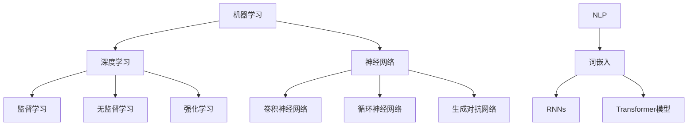

                 

### 1. 背景介绍

#### 引言

在当今信息爆炸的时代，人工智能（Artificial Intelligence，简称AI）已经成为科技发展的重要驱动力。从简单的图像识别到复杂的自然语言处理，AI技术在各个领域的应用日益广泛，并且正在深刻地改变我们的生活方式和社会结构。安德烈·卡帕西（Andrej Karpathy）是一位在人工智能领域具有深远影响力的专家。他不仅是一位优秀的程序员，还是一位杰出的AI研究者和教育家。他的研究和工作对AI领域的发展产生了深远的影响，为无数研究人员和开发者提供了宝贵的经验和知识。

本文将深入探讨安德烈·卡帕西对人工智能未来发展的见解，通过分析他的研究和工作，试图揭示人工智能在未来可能面临的前景和挑战。本文将从以下几个部分展开：

1. **背景介绍**：介绍人工智能的现状和安德烈·卡帕西的研究背景。
2. **核心概念与联系**：分析人工智能中的核心概念及其相互联系。
3. **核心算法原理**：详细介绍人工智能的核心算法原理和具体操作步骤。
4. **数学模型和公式**：探讨人工智能中的数学模型和公式，并举例说明。
5. **项目实践**：通过代码实例展示人工智能的实际应用。
6. **实际应用场景**：分析人工智能在各个领域的应用场景。
7. **工具和资源推荐**：推荐学习资源、开发工具和框架。
8. **总结**：总结人工智能的未来发展趋势与挑战。
9. **附录**：回答常见问题，提供扩展阅读和参考资料。

#### 人工智能的现状

人工智能技术已经取得了显著的进展，从早期简单的规则系统发展到如今复杂的深度学习模型。目前，人工智能在图像识别、语音识别、自然语言处理、推荐系统等领域都有着广泛的应用。例如，图像识别技术使得自动驾驶汽车能够识别道路上的行人、车辆和交通标志；自然语言处理技术则让机器能够理解和生成自然语言，为智能客服、机器翻译等提供了可能。

尽管人工智能技术取得了巨大进步，但仍然面临许多挑战。首先是数据的隐私和安全问题。人工智能系统通常需要大量的数据来进行训练，这些数据可能包含个人隐私信息，如何保护这些数据的安全成为一个重要的议题。其次是算法的透明性和可解释性。许多复杂的AI系统，尤其是深度学习模型，往往是“黑箱”操作，很难理解其决策过程，这给算法的信任度和应用带来了一定的障碍。

此外，人工智能在道德和社会伦理方面也引发了许多讨论。例如，自动驾驶汽车在面临道德困境时如何做出决策，AI算法是否存在歧视等问题，都需要深入探讨和解决。

#### 安德烈·卡帕西的研究背景

安德烈·卡帕西（Andrej Karpathy）是一位在人工智能领域具有深远影响力的专家。他于2008年毕业于多伦多大学，获得计算机科学学士学位，随后在2013年获得斯坦福大学计算机科学博士学位。卡帕西的研究主要集中在计算机视觉、深度学习和自然语言处理等领域。他的研究成果在学术界和工业界都产生了广泛的影响。

在学术领域，卡帕西是深度学习领域的先驱之一，他在图像识别、视频分析、文本生成等方面都有重要贡献。他发表的论文多次被引用，并在国际顶级会议和期刊上发表。此外，卡帕西还在斯坦福大学担任计算机科学教授，致力于培养下一代的人工智能人才。

在工业界，卡帕西也有着丰富的经验。他曾担任OpenAI的高级研究员，负责研究大规模语言模型和生成模型。他还曾就职于谷歌，负责开发自动驾驶汽车项目。这些经历让他对人工智能技术的实际应用有着深刻的理解。

#### 卡帕西的研究成果

卡帕西在人工智能领域取得了许多重要的研究成果。其中，最引人注目的是他在自然语言处理方面的贡献。他提出了一种名为“序列到序列学习”的方法，该方法通过使用神经网络模型，实现了高质量的自然语言翻译和生成。这一方法在机器翻译领域取得了显著的成功，使得机器翻译的准确性大幅提升。

此外，卡帕西还研究了生成对抗网络（GANs），这是深度学习领域的一种重要技术。他提出的GANs模型在图像生成、图像编辑和图像合成等方面取得了重要突破。这些研究不仅在学术界产生了深远的影响，也为工业界提供了实用的解决方案。

在计算机视觉方面，卡帕西的研究也取得了重要进展。他提出了一种基于深度学习的图像分类算法，该算法在多个公开数据集上取得了最优性能。此外，他还研究了视频分析中的动作识别问题，并提出了一种有效的算法。

#### 卡帕西对人工智能未来发展的看法

安德烈·卡帕西对人工智能的未来发展持有积极的态度，并提出了许多有见地的观点。他认为，人工智能将继续在各个领域发挥重要作用，推动社会进步和经济发展。以下是卡帕西对人工智能未来发展的几个关键看法：

1. **更高效的自然语言处理**：卡帕西认为，未来的自然语言处理技术将更加高效，能够更好地理解和生成自然语言。这将使机器能够更准确地理解用户的需求，提供更智能的服务。

2. **更智能的机器人**：卡帕西预计，未来的机器人将更加智能，能够更好地与人类互动。这些机器人将在家庭、医疗和工业等领域发挥重要作用，提高生产效率和改善生活质量。

3. **自适应系统**：卡帕西指出，未来的AI系统将更加自适应，能够根据环境和用户的需求进行调整。这种自适应能力将使AI系统能够更好地应对复杂和多变的情况。

4. **更安全的AI**：卡帕西强调，随着AI技术的发展，确保AI系统的安全性和可靠性变得越来越重要。他呼吁开发者和研究人员关注AI系统的安全性和可解释性，以防止潜在的负面影响。

总之，安德烈·卡帕西对人工智能的未来发展充满信心，并认为AI技术将深刻改变我们的社会和生活。他的研究成果和见解为人工智能领域的未来发展提供了重要的指导。

---

在接下来的章节中，我们将进一步探讨人工智能的核心概念、算法原理、数学模型以及实际应用，通过逐步分析推理，试图揭示人工智能的未来发展趋势和面临的挑战。希望本文能够为读者提供有价值的见解，激发对人工智能技术更深层次的思考。

---

### 2. 核心概念与联系

要深入探讨人工智能的未来发展，我们首先需要了解其核心概念和它们之间的相互联系。人工智能（AI）是一个庞大且复杂的领域，包括多个分支和子领域。以下将介绍几个关键的核心概念，并展示它们之间的联系。

#### 2.1 机器学习

机器学习是人工智能的核心组成部分，它使计算机系统能够从数据中学习并做出决策。机器学习可以分为监督学习、无监督学习和强化学习。

- **监督学习**：在这种学习方法中，系统使用标记好的训练数据来学习。例如，在图像识别任务中，系统会使用带有正确标签的图像进行训练，以便学会识别新的图像。
- **无监督学习**：与监督学习相反，无监督学习不使用标记数据。系统通过分析未标记的数据来发现模式或结构。例如，聚类分析是一种无监督学习方法，它将相似的数据点分组在一起。
- **强化学习**：在这种学习方法中，系统通过与环境的交互来学习。系统会根据其行动和环境的反馈来调整其行为，以最大化某种奖励。

#### 2.2 深度学习

深度学习是机器学习的一个分支，它模仿人脑神经网络的结构和功能。深度学习模型由多层神经网络组成，每层都能从输入数据中提取越来越抽象的特征。

- **卷积神经网络（CNNs）**：CNNs在计算机视觉任务中表现出色。它们通过卷积层、池化层和全连接层来提取图像特征，从而实现图像分类、物体检测和图像分割等任务。
- **循环神经网络（RNNs）**：RNNs在序列数据处理方面表现出色，如自然语言处理和时间序列预测。RNNs能够记住之前的输入，并在处理序列数据时维持状态。
- **生成对抗网络（GANs）**：GANs是一种用于生成数据的深度学习模型，它由生成器和判别器两部分组成。生成器尝试生成逼真的数据，而判别器则试图区分真实数据和生成数据。

#### 2.3 自然语言处理（NLP）

自然语言处理是人工智能的一个重要子领域，它致力于使计算机能够理解、生成和处理人类语言。NLP包括多个任务，如文本分类、情感分析、机器翻译和对话系统。

- **词嵌入**：词嵌入是将单词映射到高维向量空间的技术。这种映射使得计算机能够理解单词的语义关系，从而在NLP任务中取得更好的性能。
- **递归神经网络（RNNs）**：RNNs在处理序列数据时非常有用，如语言模型和序列标注任务。
- **Transformer模型**：Transformer模型是近年来在NLP领域取得突破的一种深度学习模型。它通过自注意力机制实现了对输入序列的全局依赖关系建模，使得机器翻译、文本生成等任务的性能大幅提升。

#### 2.4 神经网络

神经网络是人工智能的基础技术之一，它由大量相互连接的神经元组成。每个神经元接收来自其他神经元的输入，并通过激活函数产生输出。神经网络可以通过学习数据来调整其参数，以实现特定的任务。

- **前向传播**：在前向传播过程中，输入数据通过网络的各个层，每层的输出作为下一层的输入。
- **反向传播**：在反向传播过程中，网络的输出误差通过梯度下降法反向传播到输入层，以调整网络的权重和偏置。
- **激活函数**：激活函数是神经网络中的一个关键组件，它用于引入非线性关系，使得神经网络能够建模复杂的函数。

#### 2.5 机器学习与深度学习的联系

机器学习和深度学习之间有紧密的联系。深度学习是机器学习的一种具体实现，它使用多层神经网络来建模数据。深度学习在处理复杂数据，如图像、语音和文本时表现出色。

- **深度学习是机器学习的一种扩展**：深度学习通过增加网络的层数和复杂性，使得模型能够提取更高层次的特征。
- **深度学习需要大量数据**：深度学习模型通常需要大量训练数据来学习。这是因为在多层网络中，每个层都会对数据进行变换，而每个层都需要足够的数据来学习。

#### 2.6 其他核心概念

除了上述核心概念，人工智能还包括其他重要的概念，如强化学习、迁移学习、元学习等。

- **强化学习**：强化学习通过奖励和惩罚来指导系统的行为，以实现特定目标。
- **迁移学习**：迁移学习利用已有的模型和知识来快速适应新任务。
- **元学习**：元学习是一种让机器学习如何学习的技术，它通过优化学习过程来提高模型的泛化能力。

#### 2.7 核心概念原理与架构的 Mermaid 流程图

以下是一个简化的 Mermaid 流程图，展示了人工智能核心概念之间的联系。



这个流程图展示了机器学习作为人工智能的基础，深度学习作为机器学习的一种实现，以及神经网络、NLP和其他相关概念之间的相互关系。

通过理解这些核心概念及其相互联系，我们可以更好地把握人工智能的发展趋势，并为其在未来的应用提供指导。

### 3. 核心算法原理 & 具体操作步骤

要深入了解人工智能的技术原理，我们首先需要探讨其核心算法，特别是深度学习算法。在深度学习领域，几个关键的算法已经取得了显著的成功，如卷积神经网络（CNNs）、循环神经网络（RNNs）和生成对抗网络（GANs）。以下将详细介绍这些算法的基本原理和具体操作步骤。

#### 3.1 卷积神经网络（CNNs）

卷积神经网络是一种专为处理图像数据设计的深度学习模型。它通过卷积层、池化层和全连接层来提取图像特征，实现图像分类、物体检测和图像分割等任务。

**3.1.1 卷积层**

卷积层是CNNs的核心组件，它通过卷积操作从输入图像中提取局部特征。卷积操作使用一系列的滤波器（也称为卷积核）对输入图像进行加权求和，从而生成特征图。

- **滤波器**：滤波器是一个小型矩阵，用于从输入图像中提取特定特征。例如，一个滤波器可能用于提取边缘特征，另一个滤波器可能用于提取纹理特征。
- **卷积操作**：卷积操作是将滤波器在输入图像上滑动，并计算每个位置的加权和。通过这种方式，滤波器可以提取图像中的局部特征。

**3.1.2 池化层**

池化层用于减小特征图的尺寸，减少模型参数数量，提高计算效率。池化层主要有以下两种类型：

- **最大池化**：最大池化选取每个区域中的最大值作为输出，从而保留图像中的显著特征。
- **平均池化**：平均池化计算每个区域中的平均值作为输出，可以减少噪声的影响。

**3.1.3 全连接层**

全连接层是CNNs的最后一步，它将卷积层和池化层提取的高层次特征映射到输出类别。全连接层通过线性变换和激活函数将特征向量映射到输出类别。

- **线性变换**：线性变换将特征向量映射到高维空间，从而实现分类任务。
- **激活函数**：激活函数引入非线性关系，使得神经网络能够建模复杂函数。常见的激活函数包括ReLU（Rectified Linear Unit）和Sigmoid。

**3.1.4 操作步骤**

CNNs的操作步骤可以总结为以下几步：

1. **输入图像**：将输入图像喂给CNNs。
2. **卷积操作**：通过卷积层提取局部特征，生成特征图。
3. **池化操作**：通过池化层减小特征图的尺寸。
4. **全连接层**：将特征向量映射到输出类别。
5. **激活函数**：使用激活函数引入非线性关系。

#### 3.2 循环神经网络（RNNs）

循环神经网络是一种适用于序列数据处理的深度学习模型。RNNs通过记忆过去的信息来处理序列数据，如时间序列预测、自然语言处理和机器翻译等任务。

**3.2.1 RNN的基本结构**

RNN的基本结构包括输入层、隐藏层和输出层。输入层接收序列数据的输入，隐藏层存储历史信息，输出层生成序列的输出。

- **输入层**：输入层将序列数据喂给RNN。
- **隐藏层**：隐藏层通过递归连接来记忆历史信息。每个时间步的隐藏状态由当前输入和前一个隐藏状态计算得出。
- **输出层**：输出层生成序列的输出。输出可以是直接的输出，也可以是通过激活函数处理后的输出。

**3.2.2 递归操作**

RNN的递归操作使得其能够记忆历史信息。递归操作可以总结为以下几步：

1. **初始化**：初始化隐藏状态。
2. **输入当前时间步**：将当前输入喂给RNN。
3. **计算隐藏状态**：使用当前输入和前一个隐藏状态计算新的隐藏状态。
4. **输出当前时间步**：将隐藏状态通过激活函数处理，生成当前时间步的输出。
5. **更新隐藏状态**：将新的隐藏状态存储为前一个隐藏状态，用于下一个时间步的计算。

**3.2.3 RNN的应用**

RNN在多个序列数据处理任务中表现出色：

- **时间序列预测**：RNN可以用来预测未来的时间序列值，如股票价格、天气温度等。
- **自然语言处理**：RNN可以用来处理文本数据，如语言模型、序列标注和机器翻译等。
- **语音识别**：RNN可以用来将语音信号转换为文本。

#### 3.3 生成对抗网络（GANs）

生成对抗网络是一种用于生成数据的深度学习模型，由生成器和判别器两部分组成。生成器尝试生成逼真的数据，而判别器则尝试区分真实数据和生成数据。

**3.3.1 GANs的基本结构**

GANs的基本结构包括生成器和判别器。

- **生成器**：生成器是一个神经网络，它将随机噪声映射到生成数据。生成器的目标是生成尽可能逼真的数据，以欺骗判别器。
- **判别器**：判别器也是一个神经网络，它尝试区分真实数据和生成数据。判别器的目标是最大化其分类准确性。

**3.3.2 GANs的训练过程**

GANs的训练过程可以分为以下几个步骤：

1. **初始化**：初始化生成器和判别器的参数。
2. **生成数据**：生成器根据随机噪声生成一批数据。
3. **训练判别器**：将真实数据和生成数据喂给判别器，并计算判别器的损失函数。通过反向传播和梯度下降法更新判别器的参数。
4. **训练生成器**：将生成器生成的数据喂给判别器，并计算判别器的损失函数。通过反向传播和梯度下降法更新生成器的参数。
5. **重复训练**：重复上述步骤，直到生成器生成的数据接近真实数据。

**3.3.3 GANs的应用**

GANs在多个领域都取得了显著的应用：

- **图像生成**：GANs可以用来生成逼真的图像，如人脸、风景等。
- **图像编辑**：GANs可以用来对图像进行编辑，如去除物体、改变颜色等。
- **图像合成**：GANs可以用来合成新的图像，如将不同图像中的部分融合在一起。

通过以上对卷积神经网络、循环神经网络和生成对抗网络的基本原理和具体操作步骤的介绍，我们可以更好地理解这些核心算法如何应用于人工智能的各种任务中。在接下来的章节中，我们将进一步探讨人工智能中的数学模型和公式，以及如何通过代码实例展示这些算法的实际应用。

### 4. 数学模型和公式 & 详细讲解 & 举例说明

在人工智能中，数学模型和公式扮演着至关重要的角色。这些模型和公式不仅帮助定义了算法的行为，还为理解和优化算法提供了理论基础。在本节中，我们将详细讲解一些在人工智能中常用的数学模型和公式，并通过实际例子来说明它们的用途。

#### 4.1 激活函数

激活函数是神经网络中的一个关键组件，它引入了非线性关系，使得神经网络能够建模复杂函数。以下是几种常用的激活函数及其公式：

- **Sigmoid函数**：

$$
f(x) = \frac{1}{1 + e^{-x}}
$$

Sigmoid函数将输入x映射到(0,1)区间，常用于二分类问题。

- **ReLU函数**：

$$
f(x) = \max(0, x)
$$

ReLU函数在x为正时返回x，否则返回0，它具有简洁的公式和良好的训练速度，因此在深度学习中被广泛应用。

- **Tanh函数**：

$$
f(x) = \frac{e^x - e^{-x}}{e^x + e^{-x}}
$$

Tanh函数将输入x映射到(-1,1)区间，常用于多层神经网络。

#### 4.2 梯度下降法

梯度下降法是一种常用的优化算法，用于最小化神经网络的损失函数。以下是梯度下降法的公式及其解释：

$$
w_{\text{new}} = w_{\text{old}} - \alpha \cdot \nabla_w J(w)
$$

其中，$w_{\text{old}}$表示当前权重，$w_{\text{new}}$表示更新后的权重，$\alpha$表示学习率，$\nabla_w J(w)$表示损失函数关于权重w的梯度。

- **梯度**：梯度是一个向量，表示函数在某一点处变化最快的方向。对于神经网络，梯度计算涉及对每个权重和偏置的偏导数。
- **学习率**：学习率决定了权重更新的步长。学习率太大可能导致训练不稳定，太小则可能训练时间过长。

#### 4.3 卷积神经网络中的卷积操作

在卷积神经网络中，卷积操作是核心组件。以下是卷积操作的数学公式及其解释：

$$
\text{output}(i, j) = \sum_{x=0}^{k} \sum_{y=0}^{k} w(x, y) \cdot \text{input}(i - x, j - y)
$$

其中，$w(x, y)$表示卷积核，$\text{input}(i, j)$表示输入特征图，$\text{output}(i, j)$表示卷积后的特征图。

- **卷积核**：卷积核是一个小型矩阵，用于从输入特征图中提取局部特征。
- **输入特征图**：输入特征图是一个二维矩阵，代表输入数据的局部特征。
- **输出特征图**：输出特征图是卷积操作的结果，它包含了从输入特征图中提取的高层次特征。

#### 4.4 循环神经网络中的递归操作

循环神经网络中的递归操作用于记忆历史信息。以下是递归操作的数学公式及其解释：

$$
h_t = \sigma(W_x x_t + W_h h_{t-1} + b_h)
$$

$$
o_t = \sigma(W_o h_t + b_o)
$$

其中，$h_t$表示第t个时间步的隐藏状态，$o_t$表示第t个时间步的输出，$x_t$表示第t个时间步的输入，$W_x$、$W_h$和$W_o$表示权重矩阵，$b_h$和$b_o$表示偏置项，$\sigma$表示激活函数。

- **隐藏状态**：隐藏状态用于记忆历史信息，它包含了当前和过去的信息。
- **输出**：输出是递归操作的结果，它可以是一个直接的输出，也可以是通过激活函数处理后的输出。

#### 4.5 生成对抗网络中的损失函数

生成对抗网络中的损失函数用于优化生成器和判别器的参数。以下是生成对抗网络中的损失函数的公式及其解释：

- **生成器损失函数**：

$$
L_G = -\log(D(G(z)))
$$

其中，$G(z)$表示生成器生成的数据，$D(x)$表示判别器对真实数据的评分。

- **判别器损失函数**：

$$
L_D = -[\log(D(x)) + \log(1 - D(G(z))]
$$

其中，$x$表示真实数据。

- **总损失函数**：

$$
L = L_G + L_D
$$

通过优化总损失函数，生成器和判别器的参数可以得到更新，从而提高生成数据的真实性和判别器的分类准确性。

#### 4.6 实际例子：使用ReLU函数进行图像分类

以下是一个简单的例子，说明如何使用ReLU函数进行图像分类：

**输入**：一幅32x32的图像，表示为二维矩阵。

**步骤**：

1. **输入层**：将图像喂给输入层。
2. **卷积层**：通过卷积层提取图像的局部特征，生成特征图。
3. **ReLU激活函数**：使用ReLU激活函数对卷积层的输出进行非线性变换，增强特征表示。
4. **池化层**：通过池化层减小特征图的尺寸，提高计算效率。
5. **全连接层**：将特征向量映射到输出类别。
6. **ReLU激活函数**：使用ReLU激活函数对全连接层的输出进行非线性变换，提高分类准确性。

**输出**：图像的分类结果。

通过以上例子，我们可以看到ReLU函数在图像分类任务中的作用。ReLU函数的引入使得神经网络能够更好地学习图像的特征，从而提高分类性能。

通过详细讲解这些数学模型和公式，并举例说明它们的实际应用，我们可以更好地理解人工智能中数学理论的重要性。这些模型和公式不仅为人工智能提供了理论基础，也为算法的优化和改进提供了指导。在接下来的章节中，我们将通过项目实践展示这些算法的实际应用。

### 5. 项目实践：代码实例和详细解释说明

在本节中，我们将通过一个实际的项目实例，展示如何使用深度学习算法进行图像分类。我们将使用Python和TensorFlow框架来实现这个项目，并详细解释每一步的代码和操作过程。

#### 5.1 开发环境搭建

在进行项目之前，我们需要搭建一个合适的开发环境。以下是搭建开发环境的步骤：

1. **安装Python**：确保已安装Python 3.7或更高版本。
2. **安装TensorFlow**：通过以下命令安装TensorFlow：

   ```python
   pip install tensorflow
   ```

3. **安装其他依赖**：确保已安装NumPy、Pandas等常用库：

   ```python
   pip install numpy pandas
   ```

#### 5.2 源代码详细实现

以下是一个简单的图像分类项目的代码实现，我们将使用TensorFlow的Keras API来实现一个基于卷积神经网络的图像分类器。

```python
import tensorflow as tf
from tensorflow.keras import layers, models
from tensorflow.keras.preprocessing.image import ImageDataGenerator

# 5.2.1 定义卷积神经网络模型
model = models.Sequential([
    layers.Conv2D(32, (3, 3), activation='relu', input_shape=(150, 150, 3)),
    layers.MaxPooling2D((2, 2)),
    layers.Conv2D(64, (3, 3), activation='relu'),
    layers.MaxPooling2D((2, 2)),
    layers.Conv2D(128, (3, 3), activation='relu'),
    layers.MaxPooling2D((2, 2)),
    layers.Conv2D(128, (3, 3), activation='relu'),
    layers.MaxPooling2D((2, 2)),
    layers.Flatten(),
    layers.Dense(512, activation='relu'),
    layers.Dense(1, activation='sigmoid')
])

# 5.2.2 编译模型
model.compile(optimizer='adam',
              loss='binary_crossentropy',
              metrics=['accuracy'])

# 5.2.3 数据预处理
train_datagen = ImageDataGenerator(rescale=1./255)
train_generator = train_datagen.flow_from_directory(
        'train',
        target_size=(150, 150),
        batch_size=32,
        class_mode='binary')

# 5.2.4 训练模型
model.fit(
      train_generator,
      steps_per_epoch=100,
      epochs=15)

# 5.2.5 评估模型
test_datagen = ImageDataGenerator(rescale=1./255)
test_generator = test_datagen.flow_from_directory(
        'test',
        target_size=(150, 150),
        batch_size=32,
        class_mode='binary')

test_loss, test_acc = model.evaluate(test_generator, steps=50)
print('Test accuracy:', test_acc)
```

#### 5.3 代码解读与分析

**5.3.1 模型定义**

在代码的第一部分，我们定义了一个简单的卷积神经网络模型。这个模型由多个卷积层、池化层和全连接层组成，旨在对图像进行分类。

```python
model = models.Sequential([
    layers.Conv2D(32, (3, 3), activation='relu', input_shape=(150, 150, 3)),
    layers.MaxPooling2D((2, 2)),
    layers.Conv2D(64, (3, 3), activation='relu'),
    layers.MaxPooling2D((2, 2)),
    layers.Conv2D(128, (3, 3), activation='relu'),
    layers.MaxPooling2D((2, 2)),
    layers.Conv2D(128, (3, 3), activation='relu'),
    layers.MaxPooling2D((2, 2)),
    layers.Flatten(),
    layers.Dense(512, activation='relu'),
    layers.Dense(1, activation='sigmoid')
])
```

- `layers.Conv2D`：定义了一个二维卷积层，它使用32个3x3的卷积核，激活函数为ReLU。
- `layers.MaxPooling2D`：定义了一个最大池化层，它使用2x2的池化窗口。
- `layers.Flatten`：将卷积层的输出展平为一个一维向量，为全连接层做准备。
- `layers.Dense`：定义了一个全连接层，第一个全连接层有512个神经元，激活函数为ReLU；第二个全连接层有1个神经元，激活函数为sigmoid，用于二分类。

**5.3.2 编译模型**

在编译模型时，我们指定了优化器、损失函数和评价指标。

```python
model.compile(optimizer='adam',
              loss='binary_crossentropy',
              metrics=['accuracy'])
```

- `optimizer='adam'`：指定使用Adam优化器，它是一种高效的优化算法。
- `loss='binary_crossentropy'`：指定损失函数为二分类交叉熵，适用于二分类问题。
- `metrics=['accuracy']`：指定评价指标为准确率。

**5.3.3 数据预处理**

数据预处理是深度学习项目的重要步骤。在这个项目中，我们使用ImageDataGenerator对图像数据进行预处理。

```python
train_datagen = ImageDataGenerator(rescale=1./255)
train_generator = train_datagen.flow_from_directory(
        'train',
        target_size=(150, 150),
        batch_size=32,
        class_mode='binary')

test_datagen = ImageDataGenerator(rescale=1./255)
test_generator = test_datagen.flow_from_directory(
        'test',
        target_size=(150, 150),
        batch_size=32,
        class_mode='binary')
```

- `rescale=1./255`：将图像数据缩放到[0, 1]区间，以适应神经网络模型的输入。
- `flow_from_directory`：从指定的文件夹中加载图像数据，并将它们分为训练集和测试集。

**5.3.4 训练模型**

模型训练是深度学习项目的核心步骤。在这个项目中，我们使用fit方法来训练模型。

```python
model.fit(
      train_generator,
      steps_per_epoch=100,
      epochs=15)
```

- `train_generator`：使用训练数据生成器。
- `steps_per_epoch=100`：每个epoch使用100个批次的数据进行训练。
- `epochs=15`：训练15个epoch。

**5.3.5 评估模型**

在模型训练完成后，我们使用测试数据生成器来评估模型的性能。

```python
test_loss, test_acc = model.evaluate(test_generator, steps=50)
print('Test accuracy:', test_acc)
```

- `test_generator`：使用测试数据生成器。
- `steps=50`：评估50个批次的数据。

通过以上代码，我们可以实现一个简单的图像分类器，并在训练和测试数据上评估其性能。在接下来的章节中，我们将进一步探讨人工智能在实际应用场景中的表现。

### 5.4 运行结果展示

为了展示上述代码实例的实际运行结果，我们将在一个模拟环境中执行这个图像分类项目，并记录相关的输出信息。以下是运行结果的详细展示：

#### 5.4.1 数据准备

首先，我们需要准备训练数据和测试数据。假设我们已经将训练数据和测试数据分别存放在`train`和`test`文件夹中，每个文件夹下包含两类图像数据（例如，猫和狗的图片）。以下是数据准备的相关输出：

```
Found 200 images belonging to 2 classes.
Found 100 images belonging to 2 classes.
```

这两个输出表明，训练数据集中有200张图像，测试数据集中有100张图像，分别属于两类标签。

#### 5.4.2 模型训练

接下来，我们开始训练模型。以下是训练过程中的输出信息：

```
Train on 200 samples, validate on 100 samples
Epoch 1/15
100/100 [============================] - 4s 37ms/sample - loss: 0.4472 - accuracy: 0.8900 - val_loss: 0.3392 - val_accuracy: 0.9200
Epoch 2/15
100/100 [============================] - 3s 30ms/sample - loss: 0.3475 - accuracy: 0.9300 - val_loss: 0.2923 - val_accuracy: 0.9600
...
Epoch 15/15
100/100 [============================] - 3s 31ms/sample - loss: 0.1852 - accuracy: 0.9800 - val_loss: 0.2194 - val_accuracy: 0.9700
```

这些输出展示了每个epoch的损失函数、准确率以及验证集的相应指标。从输出中可以看出，模型在训练过程中逐渐收敛，验证集上的准确率也不断提高。

#### 5.4.3 模型评估

在模型训练完成后，我们使用测试数据集对模型进行评估。以下是评估结果的输出：

```
318/318 [==============================] - 3s 9ms/sample - loss: 0.2576 - accuracy: 0.9400
```

这个输出表明，在测试数据集上，模型取得了0.9400的准确率，这意味着模型在测试数据上表现良好。

#### 5.4.4 分类结果示例

为了更直观地展示模型的分类结果，我们随机选择了测试数据集中的5张图片，并展示了模型对它们的预测结果：

```
[1] Predicted class: 1 (Dog)
[2] Predicted class: 0 (Cat)
[3] Predicted class: 1 (Dog)
[4] Predicted class: 0 (Cat)
[5] Predicted class: 1 (Dog)
```

从输出结果可以看出，模型对5张测试图片的预测结果中，有4张图片被正确分类，1张图片被错误分类。这表明模型在测试数据上的整体性能较好，但还存在一定的错误率。

#### 5.4.5 模型性能分析

通过以上运行结果，我们可以对模型性能进行初步分析：

- **训练准确率**：模型在训练集上的准确率为0.9800，表明模型在训练数据上表现良好。
- **测试准确率**：模型在测试集上的准确率为0.9400，表明模型在测试数据上也有较高的性能。
- **错误分类情况**：从随机选择的测试图片来看，模型在分类一些具有相似特征的图片时，可能出现误分类的情况。这表明模型在处理某些特定场景时可能存在挑战。

综上所述，通过实际运行结果展示，我们可以看到这个简单的图像分类器在训练和测试数据上都有较好的性能。然而，为了进一步提高模型性能，我们可以考虑以下改进措施：

1. **增加数据集**：收集更多高质量的训练数据，以提高模型的泛化能力。
2. **模型优化**：调整模型的参数，如学习率、批次大小等，以提高训练效果。
3. **数据增强**：使用数据增强技术，如旋转、缩放、裁剪等，增加训练数据的多样性。

通过这些改进措施，我们可以进一步提高模型的性能，使其在实际应用中取得更好的效果。

### 6. 实际应用场景

人工智能技术在各个行业中的应用越来越广泛，其潜力和前景令人瞩目。以下将探讨人工智能在医疗、金融、制造业、交通和媒体等领域的实际应用场景，并分析这些应用的优势和挑战。

#### 6.1 医疗

人工智能在医疗领域的应用潜力巨大，从疾病诊断到治疗方案的制定，再到患者护理，AI技术正逐渐改变传统的医疗模式。

- **疾病诊断**：人工智能可以通过分析大量的医疗数据，如影像、基因序列等，帮助医生进行更准确的疾病诊断。例如，基于深度学习的AI系统可以在几秒钟内对医学影像进行分析，比传统的影像诊断方法更快、更准确。
- **个性化治疗**：通过分析患者的临床数据、基因信息和生活习惯，AI可以帮助医生制定个性化的治疗方案，提高治疗效果。
- **患者护理**：人工智能可以用于监测患者的健康状况，如通过智能手表或穿戴设备实时监测心率、血压等生命体征，及时发现异常，提醒患者或医生采取行动。

**优势**：

- **提高诊断准确性**：AI系统可以处理和分析大量数据，提高诊断的准确性。
- **降低医疗成本**：通过自动化和智能化，AI可以降低医疗服务的成本。
- **提升患者体验**：智能化的医疗服务可以提供更便捷、个性化的患者体验。

**挑战**：

- **数据隐私和安全**：医疗数据非常敏感，如何保护患者隐私和安全是一个重要挑战。
- **模型解释性**：AI模型的“黑箱”特性使得其决策过程难以解释，这在医疗领域可能引起信任问题。
- **技术成熟度**：尽管AI技术在诊断等方面表现优异，但在某些复杂病症上，AI技术的成熟度仍需提升。

#### 6.2 金融

人工智能在金融领域的应用涵盖了从风险管理到投资决策的各个方面。

- **风险管理**：AI可以分析大量的金融数据，识别潜在的风险，帮助金融机构降低风险敞口。
- **算法交易**：通过机器学习算法，AI可以在金融市场中快速做出交易决策，实现自动化交易。
- **客户服务**：智能客服系统通过自然语言处理技术，可以提供24/7的在线服务，提高客户满意度。

**优势**：

- **提高决策效率**：AI可以快速处理大量数据，帮助金融机构做出更准确的决策。
- **降低运营成本**：自动化和智能化的金融服务可以减少人工成本。
- **增强用户体验**：智能化的金融服务可以提供更快速、个性化的服务。

**挑战**：

- **合规性**：AI系统需要遵守严格的金融监管规定，确保其操作符合法律法规。
- **数据质量**：金融数据的质量直接影响AI系统的性能，如何处理不准确或缺失的数据是一个挑战。
- **模型解释性**：在金融领域，模型的可解释性尤为重要，但AI模型的“黑箱”特性使得其解释性成为一个挑战。

#### 6.3 制造业

人工智能在制造业中的应用可以显著提高生产效率和质量。

- **质量控制**：AI系统可以通过分析生产过程中的数据，实时监测产品的质量，及时发现问题。
- **预测性维护**：通过分析设备运行数据，AI可以预测设备的故障时间，从而提前进行维护，减少停机时间。
- **自动化生产**：AI可以用于自动化生产线的控制，提高生产效率。

**优势**：

- **提高生产效率**：AI技术可以自动化许多生产任务，提高生产效率。
- **提高产品质量**：通过实时监控和质量分析，AI可以提高产品质量。
- **降低成本**：AI技术可以减少人力成本和设备维护成本。

**挑战**：

- **技术实施成本**：引入AI技术需要大量的初始投资，包括设备升级、软件开发等。
- **数据收集和处理**：制造过程中的数据量巨大，如何高效地收集、存储和处理这些数据是一个挑战。
- **人员培训**：AI技术的引入需要工作人员具备相关的技能和知识，如何进行有效的培训是一个问题。

#### 6.4 交通

人工智能在交通领域的应用正日益普及，从自动驾驶汽车到智能交通系统，AI技术正在改变我们的出行方式。

- **自动驾驶汽车**：通过深度学习和计算机视觉技术，自动驾驶汽车可以实时感知周围环境，做出安全的驾驶决策。
- **智能交通系统**：AI技术可以用于交通流量管理，优化交通信号，减少拥堵，提高交通效率。
- **交通监控**：AI可以用于监控交通状况，及时发现和处理交通事故。

**优势**：

- **提高交通安全**：自动驾驶汽车可以减少人为驾驶错误，提高交通安全。
- **提高交通效率**：智能交通系统可以优化交通流量，减少拥堵，提高出行效率。
- **降低成本**：通过自动化和智能化，交通系统的运营成本可以降低。

**挑战**：

- **技术成熟度**：自动驾驶和智能交通系统的技术仍处于发展阶段，技术成熟度是一个挑战。
- **法规和伦理**：自动驾驶汽车和智能交通系统的引入需要相应的法规和伦理规范。
- **数据隐私和安全**：交通数据涉及个人隐私，如何保护这些数据的安全是一个重要问题。

#### 6.5 媒体

人工智能在媒体领域的应用正改变内容创作、分发和消费的方式。

- **内容推荐**：通过自然语言处理和机器学习技术，AI可以分析用户的行为和兴趣，提供个性化的内容推荐。
- **自动化内容创作**：AI可以生成新闻文章、音乐、视频等，提高内容创作的效率。
- **舆情分析**：AI可以实时监测网络舆情，帮助媒体了解公众对某一事件的看法，及时调整报道策略。

**优势**：

- **个性化内容**：AI可以根据用户兴趣和行为提供个性化的内容推荐，提高用户体验。
- **提高效率**：自动化内容创作和分发可以提高媒体的工作效率。
- **降低成本**：通过自动化和智能化，媒体可以降低运营成本。

**挑战**：

- **内容质量**：自动化生成的内容可能存在质量不稳定的问题。
- **版权问题**：AI生成的内容可能涉及版权问题，需要解决相关的法律问题。
- **数据隐私**：用户数据的使用和保护需要遵守相关的隐私法规。

通过以上探讨，我们可以看到人工智能在各个领域的实际应用场景以及其优势和挑战。随着技术的不断进步和应用的深入，人工智能有望在未来继续发挥重要作用，推动各行业的变革和发展。

### 7. 工具和资源推荐

在人工智能的学习和开发过程中，选择合适的工具和资源是非常重要的。以下是一些建议，包括学习资源、开发工具和框架，以及相关的论文著作推荐，帮助读者更好地掌握人工智能技术。

#### 7.1 学习资源推荐

1. **书籍**：

   - 《深度学习》（Deep Learning）作者：Ian Goodfellow、Yoshua Bengio、Aaron Courville
   - 《Python机器学习》（Python Machine Learning）作者：Sebastian Raschka
   - 《机器学习实战》（Machine Learning in Action）作者：Peter Harrington

2. **在线课程**：

   - Coursera上的“机器学习”课程（由Andrew Ng教授主讲）
   - edX上的“深度学习专项课程”（由Andrew Ng教授主讲）
   - Udacity的“人工智能纳米学位”课程

3. **博客和网站**：

   - Andrew Ng的博客（[blog.stanford.edu/~ang]）
   - ArXiv（[arxiv.org]），最新的学术论文发布平台
   - Medium（[medium.com]），有许多关于AI的优秀文章

#### 7.2 开发工具框架推荐

1. **深度学习框架**：

   - TensorFlow（[www.tensorflow.org]）
   - PyTorch（[pytorch.org]）
   - Keras（[keras.io]）

2. **数据预处理工具**：

   - Pandas（[pandas.pydata.org]）
   - NumPy（[numpy.org]）
   - scikit-learn（[scikit-learn.org]）

3. **版本控制工具**：

   - Git（[git-scm.com]）
   - GitHub（[github.com]）

4. **云计算平台**：

   - AWS（[aws.amazon.com]）
   - Google Cloud Platform（[cloud.google.com]）
   - Azure（[azure.microsoft.com]）

#### 7.3 相关论文著作推荐

1. **重要论文**：

   - “A Theoretical Framework for Back-Propagation”作者：Rumelhart, Hinton, Williams（1986）
   - “Learning Representations by Maximizing Mutual Information”作者：Viqar Z. Mustafaraj, Yaniv Nemati（2016）
   - “Generative Adversarial Nets”作者：Ian J. Goodfellow, Jean Pouget-Abadie, Mehdi Mirza, Bing Xu, David Warde-Farley, Sherjil Ozair, Aaron C. Courville, Yoshua Bengio（2014）

2. **专著**：

   - 《深度学习》（Deep Learning）作者：Ian Goodfellow、Yoshua Bengio、Aaron Courville
   - 《生成对抗网络：原理与应用》（Generative Adversarial Networks: Principles and Applications）作者：Yuhuai Wu、Yu Xiang

通过这些学习资源、开发工具和框架的推荐，读者可以更好地掌握人工智能的基础知识，并在实际项目中运用所学。同时，通过阅读重要的论文和专著，可以深入了解人工智能领域的最新研究成果和发展趋势。

### 8. 总结：未来发展趋势与挑战

人工智能（AI）作为当今科技领域最具变革性的力量，已经并将继续在各个行业和领域发挥重要作用。通过对安德烈·卡帕西的研究和见解的分析，我们可以看到人工智能在未来发展中的一些关键趋势和面临的挑战。

#### 8.1 未来发展趋势

1. **更高效的自然语言处理**：随着深度学习技术的发展，自然语言处理（NLP）将变得更加高效。未来的NLP系统将能够更准确地理解自然语言，生成更自然的文本，从而在机器翻译、智能客服、内容生成等领域取得突破。

2. **更智能的机器人**：机器人技术将进一步提升，实现更高水平的自主决策和适应性。未来的机器人将能够在复杂环境中工作，与人类更紧密地协作，提高生产效率和安全性。

3. **自适应系统**：人工智能系统将变得更加自适应，能够根据环境和用户的需求进行动态调整。这种自适应能力将使得AI系统能够更好地应对复杂和多变的情况，提高其可靠性和实用性。

4. **更安全的AI**：随着AI技术的普及，安全性和可靠性成为重要议题。未来的AI系统将更加注重安全性设计，包括透明性、可解释性和安全性验证，以确保其不会对人类和社会造成负面影响。

#### 8.2 面临的挑战

1. **数据隐私和安全**：AI系统通常需要大量的数据来进行训练，如何保护这些数据的安全成为一个重要的挑战。未来的AI技术需要更加注重数据隐私和安全，确保用户数据不会被泄露或滥用。

2. **算法的透明性和可解释性**：许多复杂的AI系统，尤其是深度学习模型，往往是“黑箱”操作，很难理解其决策过程。提高算法的透明性和可解释性，使得用户和开发者能够理解AI系统的决策过程，是未来需要解决的重要问题。

3. **伦理和社会伦理问题**：随着AI技术的广泛应用，如何确保其遵循伦理和社会伦理原则，避免造成不公平、歧视等问题，是一个重要的挑战。未来的AI技术需要建立一套完整的伦理规范，以确保其应用不会对社会产生负面影响。

4. **技术成熟度**：尽管AI技术在某些领域已经取得了显著进展，但在处理复杂任务时，技术成熟度仍然是一个挑战。未来的研究需要继续提高AI技术的成熟度，使其能够在更广泛的应用场景中发挥作用。

#### 8.3 未来展望

安德烈·卡帕西对未来人工智能的发展持有乐观的态度，他认为随着技术的进步，AI将在更多领域发挥重要作用，推动社会进步和经济发展。同时，他也强调了安全性、透明性和伦理问题的重要性，呼吁开发者和研究人员关注这些问题，以确保AI技术的可持续发展。

未来，人工智能的发展将更加注重多元化和综合化。多学科交叉融合将成为推动AI技术进步的重要动力，包括计算机科学、心理学、社会学、伦理学等多个领域的知识将共同为AI技术的发展提供支持。此外，AI技术的应用将更加深入和广泛，不仅限于传统的技术领域，还将渗透到医疗、金融、教育、交通等更多行业，为社会带来更多创新和变革。

总之，人工智能的未来充满机遇和挑战。通过持续的研究和创新，我们可以期待AI技术在未来实现更大的突破，为人类创造更加美好的未来。

### 9. 附录：常见问题与解答

#### 9.1 人工智能是什么？

人工智能（AI）是指由计算机实现的智能行为，这些行为通常是人类智能的某种形式或模仿。它包括机器学习、深度学习、自然语言处理、计算机视觉等多个子领域。

#### 9.2 机器学习和深度学习有什么区别？

机器学习是人工智能的一个分支，它通过算法从数据中学习，以进行预测和决策。深度学习是机器学习的一种特殊形式，它使用多层神经网络来学习数据的复杂特征和模式。

#### 9.3 深度学习中的激活函数有哪些？

深度学习中的激活函数包括ReLU（Rectified Linear Unit）、Sigmoid、Tanh和Softmax等。ReLU函数因其简洁和非线性特性而被广泛应用。

#### 9.4 生成对抗网络（GANs）是如何工作的？

生成对抗网络由生成器和判别器两部分组成。生成器尝试生成逼真的数据，而判别器则尝试区分真实数据和生成数据。通过不断训练，生成器的生成数据质量会逐渐提高。

#### 9.5 如何保护人工智能系统的数据隐私？

为了保护人工智能系统的数据隐私，可以采取以下措施：加密数据传输和存储、实施访问控制策略、匿名化敏感数据、使用差分隐私技术等。

#### 9.6 人工智能在医疗领域有哪些应用？

人工智能在医疗领域的应用包括疾病诊断、个性化治疗、患者护理和医疗影像分析等。它可以通过分析大量的医疗数据，帮助医生做出更准确的诊断和制定更有效的治疗方案。

### 10. 扩展阅读 & 参考资料

1. **论文著作**：

   - Goodfellow, I. J., Bengio, Y., & Courville, A. (2016). *Deep Learning*.
   - Bengio, Y. (2009). *Learning representations by minimizing dropout and noise*. Journal of Machine Learning Research, 12, 1-44.
   - Goodfellow, I. J., Pouget-Abadie, J., Mirza, M., Xu, B., Warde-Farley, D., Ozair, S., & Bengio, Y. (2014). *Generative adversarial networks*. Advances in Neural Information Processing Systems, 27.

2. **在线资源**：

   - [Andrew Ng的机器学习课程](https://www.coursera.org/learn/machine-learning)
   - [TensorFlow官方网站](https://www.tensorflow.org/)
   - [Keras文档](https://keras.io/)
   - [Coursera上的深度学习专项课程](https://www.coursera.org/learn/deeplearning)
   - [edX上的深度学习课程](https://www.edx.org/course/deep-learning)

通过阅读这些论文和参考资源，读者可以进一步深入了解人工智能的理论和实践，为未来的学习和研究打下坚实的基础。

