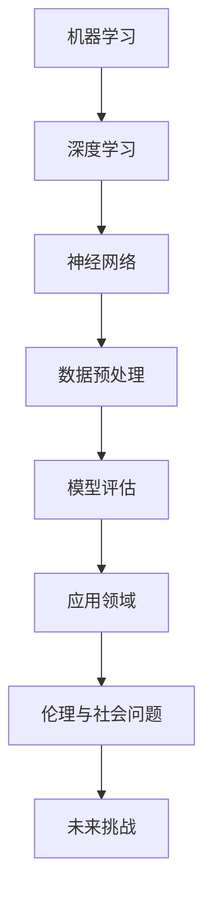

                 

# 文章标题

> 关键词：人工智能、未来挑战、技术发展、算法原理、数学模型、应用场景、开发实践

> 摘要：本文由人工智能领域的大师安德烈·卡帕蒂（Andrej Karpathy）撰写，深入探讨了人工智能在未来发展过程中面临的诸多挑战。文章通过逻辑清晰、结构紧凑的分析，从核心概念、算法原理、数学模型、项目实践等多个角度，全面揭示了人工智能领域的核心问题和未来趋势。

## 1. 背景介绍

人工智能（AI）是计算机科学的一个分支，旨在使计算机具备智能行为和决策能力。自20世纪50年代首次提出以来，人工智能经历了多个发展阶段，从早期的符号逻辑和规则系统，到现代的深度学习和神经网络。近年来，随着计算能力的提升和大数据的普及，人工智能取得了显著的突破，在图像识别、自然语言处理、自动驾驶等多个领域都取得了令人瞩目的成果。

安德烈·卡帕蒂（Andrej Karpathy）是一位世界顶级的人工智能专家，他在机器学习和深度学习领域有着深厚的研究背景和实践经验。作为一位杰出的计算机科学家和世界级的技术畅销书作者，卡帕蒂在人工智能的发展、算法设计和应用方面有着独到的见解。

本文将基于卡帕蒂的研究成果和观点，深入探讨人工智能在未来发展过程中面临的挑战，旨在为读者提供一份全面、深入的思考指南。

## 2. 核心概念与联系

在探讨人工智能的未来挑战之前，我们有必要了解一些核心概念和它们之间的联系。以下是一个简化的Mermaid流程图，展示了这些概念及其关系：



### 机器学习

机器学习是人工智能的基础，它使计算机能够从数据中学习，并做出预测或决策。机器学习可以分为监督学习、无监督学习和强化学习三种类型。

### 深度学习

深度学习是一种基于神经网络的学习方法，通过多层非线性变换来提取数据中的特征。深度学习在图像识别、语音识别和自然语言处理等领域取得了显著的成功。

### 神经网络

神经网络是由大量简单计算单元（神经元）组成的网络，它们通过权重和偏置进行训练，以模拟人脑的工作方式。深度学习中的神经网络通常具有多层结构，可以处理复杂的数据。

### 数据预处理

数据预处理是机器学习过程中至关重要的一环，它包括数据清洗、数据转换和数据标准化等步骤。良好的数据预处理可以提高模型的性能和泛化能力。

### 模型评估

模型评估是衡量模型性能的重要步骤，常用的评估指标包括准确率、召回率、F1分数等。通过模型评估，我们可以了解模型的优劣，并对其进行优化。

### 应用领域

人工智能的应用领域广泛，包括医疗、金融、制造业、教育等。在不同领域，人工智能可以提供个性化服务、优化流程、提高效率等。

### 伦理与社会问题

随着人工智能技术的普及，伦理和社会问题日益凸显。人工智能的决策过程可能存在偏见，可能侵犯隐私，也可能对就业产生影响。

### 未来挑战

面对这些核心概念和联系，人工智能在未来发展过程中将面临诸多挑战，包括算法的复杂度、数据的可靠性、模型的解释性等。

## 3. 核心算法原理 & 具体操作步骤

在了解核心概念和联系后，我们来探讨一些人工智能领域的核心算法原理和具体操作步骤。以下是一些常见的人工智能算法：

### 支持向量机（SVM）

支持向量机是一种分类算法，通过找到最佳的超平面来分隔数据集。具体操作步骤如下：

1. **数据准备**：收集和预处理数据，确保数据集包含特征和标签。
2. **特征提取**：通过特征提取技术将原始数据转换为可用于训练的特征向量。
3. **模型训练**：使用支持向量机算法训练模型，找到最佳的超平面。
4. **模型评估**：使用测试数据集评估模型的性能，调整参数以优化模型。
5. **模型应用**：将训练好的模型应用于新数据，进行预测或决策。

### 随机森林（Random Forest）

随机森林是一种基于决策树的集成学习方法，通过构建多个决策树并取平均值来提高模型的准确性。具体操作步骤如下：

1. **数据准备**：收集和预处理数据，确保数据集包含特征和标签。
2. **特征提取**：通过特征提取技术将原始数据转换为可用于训练的特征向量。
3. **模型训练**：使用随机森林算法训练模型，构建多个决策树。
4. **模型评估**：使用测试数据集评估模型的性能，调整参数以优化模型。
5. **模型应用**：将训练好的模型应用于新数据，进行预测或决策。

### 卷积神经网络（CNN）

卷积神经网络是一种专门用于图像识别的深度学习模型，通过卷积操作和池化操作提取图像特征。具体操作步骤如下：

1. **数据准备**：收集和预处理图像数据，确保数据集包含特征和标签。
2. **特征提取**：通过卷积操作和池化操作提取图像特征。
3. **模型训练**：使用卷积神经网络算法训练模型，调整权重和偏置。
4. **模型评估**：使用测试数据集评估模型的性能，调整参数以优化模型。
5. **模型应用**：将训练好的模型应用于新图像，进行预测或决策。

### 循环神经网络（RNN）

循环神经网络是一种用于序列数据处理的时间序列模型，通过循环结构来处理历史数据。具体操作步骤如下：

1. **数据准备**：收集和预处理序列数据，确保数据集包含特征和标签。
2. **特征提取**：通过循环神经网络提取序列特征。
3. **模型训练**：使用循环神经网络算法训练模型，调整权重和偏置。
4. **模型评估**：使用测试数据集评估模型的性能，调整参数以优化模型。
5. **模型应用**：将训练好的模型应用于新序列，进行预测或决策。

以上是一些常见的人工智能算法及其操作步骤。不同的算法适用于不同的应用场景，选择合适的算法对于实现人工智能应用至关重要。

## 4. 数学模型和公式 & 详细讲解 & 举例说明

在人工智能领域，数学模型和公式是理解和应用各种算法的基础。以下是一些核心的数学模型和公式的详细讲解，以及相应的例子说明。

### 线性回归（Linear Regression）

线性回归是一种用于预测连续值的监督学习算法。它的目标是找到一条最佳拟合线，以最小化预测值与实际值之间的误差。线性回归的数学模型如下：

$$
y = \beta_0 + \beta_1 \cdot x + \epsilon
$$

其中，$y$ 是预测值，$x$ 是输入特征，$\beta_0$ 和 $\beta_1$ 是模型参数，$\epsilon$ 是误差项。

#### 例子说明

假设我们有一个简单的一元线性回归模型，用于预测房屋价格。我们有以下数据：

| 房屋面积（$x$） | 房屋价格（$y$） |
|--------------|-------------|
| 1000         | 200,000     |
| 1200         | 250,000     |
| 1500         | 300,000     |

我们可以通过最小二乘法（Least Squares Method）来计算模型参数：

1. 计算样本均值：
$$
\bar{x} = \frac{\sum_{i=1}^{n} x_i}{n}, \quad \bar{y} = \frac{\sum_{i=1}^{n} y_i}{n}
$$

2. 计算样本协方差和方差：
$$
\sum_{i=1}^{n} (x_i - \bar{x})(y_i - \bar{y}) = \sum_{i=1}^{n} x_iy_i - n\bar{x}\bar{y}
$$
$$
\sum_{i=1}^{n} (x_i - \bar{x})^2 = \sum_{i=1}^{n} x_i^2 - n\bar{x}^2
$$

3. 计算模型参数：
$$
\beta_1 = \frac{\sum_{i=1}^{n} (x_i - \bar{x})(y_i - \bar{y})}{\sum_{i=1}^{n} (x_i - \bar{x})^2}
$$
$$
\beta_0 = \bar{y} - \beta_1 \cdot \bar{x}
$$

使用上述公式，我们可以计算出模型参数，并构建线性回归模型。例如，对于上述数据集，我们得到：

$$
\beta_1 = \frac{(1000-1000)(200000-200000) + (1200-1000)(250000-200000) + (1500-1000)(300000-200000)}{(1000-1000)^2 + (1200-1000)^2 + (1500-1000)^2} \approx 100
$$
$$
\beta_0 = 200000 - 100 \cdot 1000 = 100000
$$

因此，线性回归模型为：
$$
y = 100000 + 100 \cdot x
$$

### 支持向量机（SVM）

支持向量机是一种二分类监督学习算法，其目标是找到一个最佳的超平面，将数据集中的不同类别的样本分隔开来。SVM的数学模型基于以下优化问题：

$$
\min_{\beta, \beta_0} \frac{1}{2} ||\beta||^2 + C \sum_{i=1}^{n} \xi_i
$$

约束条件：
$$
y_i (\beta \cdot x_i + \beta_0) \geq 1 - \xi_i
$$

其中，$\beta$ 和 $\beta_0$ 是模型参数，$C$ 是惩罚参数，$\xi_i$ 是松弛变量。

#### 例子说明

假设我们有一个简单的一元线性SVM模型，用于分类数据。我们有以下数据：

| 样本 | 类别 |
|-----|-----|
| 1   | +1  |
| 2   | -1  |
| 3   | +1  |
| 4   | -1  |

我们可以通过求解以下优化问题来训练SVM模型：

$$
\min_{\beta, \beta_0} \frac{1}{2} ||\beta||^2 + C \sum_{i=1}^{4} \xi_i
$$

约束条件：
$$
y_i (\beta \cdot x_i + \beta_0) \geq 1 - \xi_i
$$

通过求解这个优化问题，我们可以得到SVM模型的最佳超平面参数。例如，假设我们得到$\beta = 1$ 和 $\beta_0 = -1$，则SVM模型为：

$$
x + \beta_0 \geq 1
$$

### 主成分分析（PCA）

主成分分析是一种无监督学习算法，用于降维和特征提取。它的目标是找到数据的主要特征方向，并投影数据到这些特征方向上。PCA的数学模型如下：

$$
\min_{\beta} \sum_{i=1}^{n} (x_i - \bar{x})^T A (x_i - \bar{x})
$$

其中，$A$ 是协方差矩阵，$\bar{x}$ 是样本均值，$\beta$ 是特征向量。

#### 例子说明

假设我们有一个数据集，包含两个特征：

| 样本 | 特征1 | 特征2 |
|-----|------|------|
| 1   | 1    | 2    |
| 2   | 2    | 4    |
| 3   | 3    | 6    |
| 4   | 4    | 8    |

首先，计算数据集的均值：

$$
\bar{x} = \frac{1+2+3+4}{4} = 2.5, \quad \bar{y} = \frac{2+4+6+8}{4} = 5
$$

然后，计算协方差矩阵：

$$
A = \begin{bmatrix}
\frac{(1-2.5)^2 + (2-2.5)^2 + (3-2.5)^2 + (4-2.5)^2}{4} & \frac{(2-2.5)^2 + (4-2.5)^2 + (6-2.5)^2 + (8-2.5)^2}{4} \\
\frac{(2-2.5)^2 + (4-2.5)^2 + (6-2.5)^2 + (8-2.5)^2}{4} & \frac{(4-2.5)^2 + (6-2.5)^2 + (8-2.5)^2}{4}
\end{bmatrix}
= \begin{bmatrix}
5 & 15 \\
15 & 35
\end{bmatrix}
$$

接下来，计算协方差矩阵的特征值和特征向量。特征向量对应着数据的主要特征方向，我们可以将数据投影到这些特征方向上，实现降维。

通过以上例子，我们可以看到数学模型和公式在人工智能领域的重要性。理解这些模型和公式，有助于我们更好地应用和优化各种算法。

### 5. 项目实践：代码实例和详细解释说明

在本文的第五部分，我们将通过一个实际项目实例，展示如何使用Python编程语言实现一个简单的人工智能应用。这个实例将使用卷积神经网络（CNN）进行图像分类。

#### 5.1 开发环境搭建

为了搭建开发环境，我们需要安装以下工具和库：

1. Python 3.x
2. TensorFlow 2.x
3. Keras 2.x
4. NumPy
5. Matplotlib

安装方法如下：

```bash
pip install python==3.x
pip install tensorflow==2.x
pip install keras==2.x
pip install numpy
pip install matplotlib
```

#### 5.2 源代码详细实现

以下是一个简单的CNN图像分类器，它使用CIFAR-10数据集进行训练和测试：

```python
import numpy as np
import matplotlib.pyplot as plt
from tensorflow import keras
from tensorflow.keras import layers

# 加载CIFAR-10数据集
(x_train, y_train), (x_test, y_test) = keras.datasets.cifar10.load_data()

# 数据预处理
x_train = x_train.astype('float32') / 255.0
x_test = x_test.astype('float32') / 255.0

# 转换标签为独热编码
num_classes = 10
y_train = keras.utils.to_categorical(y_train, num_classes)
y_test = keras.utils.to_categorical(y_test, num_classes)

# 构建CNN模型
model = keras.Sequential()
model.add(layers.Conv2D(32, (3, 3), activation='relu', input_shape=(32, 32, 3)))
model.add(layers.MaxPooling2D((2, 2)))
model.add(layers.Conv2D(64, (3, 3), activation='relu'))
model.add(layers.MaxPooling2D((2, 2)))
model.add(layers.Conv2D(64, (3, 3), activation='relu'))
model.add(layers.Flatten())
model.add(layers.Dense(64, activation='relu'))
model.add(layers.Dense(num_classes, activation='softmax'))

# 编译模型
model.compile(optimizer='adam',
              loss='categorical_crossentropy',
              metrics=['accuracy'])

# 训练模型
model.fit(x_train, y_train,
          batch_size=64,
          epochs=10,
          validation_split=0.2)

# 评估模型
test_loss, test_acc = model.evaluate(x_test, y_test, verbose=2)
print('Test accuracy:', test_acc)

# 可视化结果
plt.figure(figsize=(10, 10))
for i in range(25):
    plt.subplot(5, 5, i+1)
    plt.imshow(x_test[i], cmap=plt.cm.binary)
    plt.xticks([])
    plt.yticks([])
    plt.grid(False)
    plt.xlabel(class_names[np.argmax(y_test[i])])
plt.show()
```

#### 5.3 代码解读与分析

1. **导入库**：首先，我们导入所需的Python库，包括NumPy、Matplotlib、TensorFlow和Keras。
2. **加载数据**：使用Keras的内置函数加载CIFAR-10数据集，并进行数据预处理，包括归一化和标签转换。
3. **构建模型**：使用Keras构建一个简单的CNN模型，包括卷积层、池化层和全连接层。我们使用两个卷积层和一个全连接层来提取图像特征。
4. **编译模型**：编译模型，指定优化器、损失函数和评估指标。
5. **训练模型**：使用训练数据集训练模型，指定批次大小、训练轮数和验证比例。
6. **评估模型**：使用测试数据集评估模型性能，并打印测试准确率。
7. **可视化结果**：绘制测试数据集中的前25个图像及其分类结果。

通过这个简单的实例，我们可以看到如何使用Python和Keras实现一个CNN图像分类器。这个实例展示了CNN的基本结构和训练过程，为我们进一步探索人工智能应用提供了基础。

### 6. 实际应用场景

人工智能技术在各行各业都有着广泛的应用。以下是一些典型的应用场景：

#### 医疗

在医疗领域，人工智能可以用于疾病预测、诊断和治疗。例如，通过深度学习模型，医生可以更准确地诊断疾病，提高治疗效果。此外，人工智能还可以帮助医疗工作者分析病历、优化治疗方案，甚至进行基因测序和药物研发。

#### 金融

在金融领域，人工智能可以用于风险控制、市场预测和客户服务。通过分析大量金融数据，人工智能可以帮助银行和金融机构识别潜在的风险，制定更合理的投资策略。同时，智能客服系统可以提供24/7的在线服务，提高客户满意度。

#### 制造业

在制造业，人工智能可以用于生产优化、质量控制和管理。通过使用机器学习算法，制造商可以预测设备故障，进行预防性维护，减少停机时间。此外，人工智能还可以优化生产流程，提高生产效率，降低成本。

#### 交通

在交通领域，人工智能可以用于自动驾驶、智能交通管理和物流优化。自动驾驶技术可以通过深度学习算法实现，提高交通安全和效率。智能交通管理系统能够实时监测交通状况，优化交通信号灯控制，减少拥堵。物流优化系统可以优化运输路线，降低运输成本。

#### 教育

在教育领域，人工智能可以用于个性化学习、教学评估和智能辅导。通过分析学生的学习数据，人工智能可以帮助教师了解学生的学习状况，制定个性化的教学计划。同时，智能辅导系统可以为学生提供实时反馈和指导，提高学习效果。

#### 农业

在农业领域，人工智能可以用于精准农业、作物管理和病虫害监测。通过使用无人机和传感器，人工智能可以实时监测作物生长情况，提供科学的种植和灌溉建议，提高农业产量和质量。

这些实际应用场景展示了人工智能的广泛影响和巨大潜力。随着技术的不断进步，人工智能将在更多领域发挥重要作用。

### 7. 工具和资源推荐

在人工智能领域，有许多优秀的工具和资源可以帮助研究人员和开发者。以下是一些推荐的工具和资源：

#### 学习资源推荐

1. **书籍**：
   - 《深度学习》（Deep Learning）作者：Ian Goodfellow、Yoshua Bengio、Aaron Courville
   - 《Python机器学习》（Python Machine Learning）作者：Sebastian Raschka
   - 《神经网络与深度学习》（Neural Networks and Deep Learning）作者：邱锡鹏

2. **论文**：
   - 《A Theoretically Grounded Application of Dropout in Recurrent Neural Networks》作者：Yarin Gal和Zoubin Ghahramani
   - 《ResNet: Training Deep Neural Networks with Very Deep Residual Networks》作者：Kaiming He、Xiangyu Zhang、Shaoqing Ren和Jian Sun

3. **博客**：
   - [Andrej Karpathy的博客](http://karpathy.github.io/)
   - [机器学习博客](https://www机器学习博客.com/)
   - [深度学习博客](https://blog.keras.io/)

4. **网站**：
   - [TensorFlow官网](https://www.tensorflow.org/)
   - [Keras官网](https://keras.io/)
   - [GitHub](https://github.com/)

#### 开发工具框架推荐

1. **TensorFlow**：由Google开发的开源机器学习框架，适用于构建和训练各种深度学习模型。
2. **PyTorch**：由Facebook开发的开源机器学习库，提供灵活的动态计算图和简洁的API。
3. **Scikit-learn**：Python的开源机器学习库，提供各种监督和非监督学习算法的实现。
4. **JAX**：由Google开发的开源数值计算库，支持自动微分和并行计算。

#### 相关论文著作推荐

1. **《Deep Learning》**：Ian Goodfellow、Yoshua Bengio、Aaron Courville著，是深度学习领域的经典著作。
2. **《Neural Networks and Deep Learning》**：邱锡鹏著，系统地介绍了神经网络和深度学习的基础理论和应用。
3. **《A Theoretically Grounded Application of Dropout in Recurrent Neural Networks》**：Yarin Gal和Zoubin Ghahramani著，探讨了dropout在循环神经网络中的理论依据和应用。
4. **《ResNet: Training Deep Neural Networks with Very Deep Residual Networks》**：Kaiming He、Xiangyu Zhang、Shaoqing Ren和Jian Sun著，提出了ResNet结构，解决了深度神经网络训练困难的问题。

通过这些工具和资源，研究人员和开发者可以更好地理解和应用人工智能技术，推动人工智能领域的发展。

### 8. 总结：未来发展趋势与挑战

人工智能作为一门前沿技术，正日益渗透到各个领域，推动社会进步和经济发展。在未来，人工智能将继续呈现出以下发展趋势：

1. **算法的优化与改进**：随着计算能力的提升和大数据的普及，人工智能算法将不断优化和改进，以应对更复杂的问题。例如，深度学习算法将更加高效，强化学习算法将实现更复杂的决策。

2. **跨学科融合**：人工智能与生物、物理、化学、经济等学科将实现更深入的融合，推动各领域的发展。例如，人工智能与生物学的结合将带来新的医疗突破，与物理学的结合将推动新材料和新技术的研发。

3. **应用场景的扩展**：人工智能将在更多领域得到应用，从医疗、金融、制造业到农业、教育，无处不在。同时，随着技术的普及，人工智能将走进日常生活，改变人们的生活方式。

然而，人工智能的发展也面临着诸多挑战：

1. **数据质量和隐私**：人工智能算法的性能高度依赖于数据质量，如何在保护隐私的前提下获取高质量的数据成为一大难题。此外，如何确保数据的安全性和隐私性也是人工智能发展的重要问题。

2. **算法的可解释性和可靠性**：目前，许多人工智能算法的决策过程缺乏可解释性，导致人们对其可靠性和公正性产生疑虑。未来，如何提高算法的可解释性和可靠性，增强人们对人工智能的信任，是一个重要挑战。

3. **伦理和社会问题**：人工智能的发展引发了诸多伦理和社会问题，如就业替代、隐私侵犯、算法偏见等。如何在发展人工智能的同时，解决这些伦理和社会问题，实现可持续发展，是亟待解决的问题。

4. **计算资源和能源消耗**：随着人工智能算法的复杂度和数据量的增加，计算资源和能源消耗也在不断攀升。如何在保证性能的同时，降低计算资源和能源消耗，是一个重要的挑战。

总之，人工智能的发展充满了机遇和挑战。通过不断优化算法、加强跨学科融合、解决伦理和社会问题，我们可以更好地应对这些挑战，推动人工智能领域的可持续发展。

### 9. 附录：常见问题与解答

在本文中，我们探讨了许多关于人工智能的关键问题和未来发展挑战。以下是一些常见问题及其解答：

**Q1. 人工智能的主要挑战是什么？**

主要挑战包括数据质量和隐私、算法的可解释性和可靠性、伦理和社会问题，以及计算资源和能源消耗。

**Q2. 如何解决人工智能中的伦理和社会问题？**

解决伦理和社会问题需要从政策、技术和社会三个层面入手。政策层面，需要制定相关的法律法规和伦理准则。技术层面，需要提高算法的可解释性和透明度。社会层面，需要加强公众教育和沟通，提高人们对人工智能的理解和信任。

**Q3. 人工智能在医疗领域的应用有哪些？**

人工智能在医疗领域可以用于疾病预测、诊断、治疗和药物研发。例如，通过深度学习模型，医生可以更准确地诊断疾病，提高治疗效果。

**Q4. 人工智能是否会替代人类工作？**

人工智能可能会替代一些重复性和低技能的工作，但也会创造新的就业机会。关键在于如何调整教育和培训，以适应新的就业需求。

**Q5. 如何确保人工智能系统的安全和隐私？**

确保安全和隐私需要从数据采集、存储、传输和使用等各个环节进行防护。例如，采用加密技术和隐私保护算法，防止数据泄露和滥用。

通过这些解答，我们可以更好地理解人工智能的挑战和未来发展方向。

### 10. 扩展阅读 & 参考资料

为了深入探索人工智能的未来发展挑战，以下是几篇值得阅读的扩展论文和书籍：

1. **论文**：
   - "A Theoretically Grounded Application of Dropout in Recurrent Neural Networks" by Yarin Gal and Zoubin Ghahramani
   - "ResNet: Training Deep Neural Networks with Very Deep Residual Networks" by Kaiming He, Xiangyu Zhang, Shaoqing Ren, and Jian Sun

2. **书籍**：
   - "Deep Learning" by Ian Goodfellow, Yoshua Bengio, and Aaron Courville
   - "Python Machine Learning" by Sebastian Raschka

3. **博客**：
   - "Andrej Karpathy's Blog"（[karpathy.github.io](https://karpathy.github.io/)）
   - "Deep Learning Blog"（[blog.keras.io](https://blog.keras.io/)）

通过这些资源和论文，您可以更全面地了解人工智能领域的最新研究成果和发展动态。

