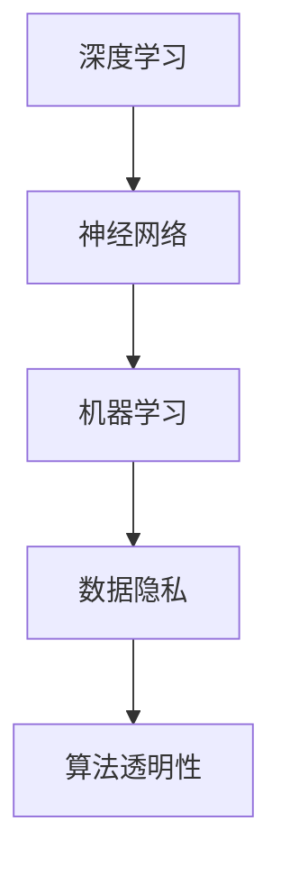

                 

### 文章标题

**Andrej Karpathy：人工智能的未来发展挑战**

> 关键词：人工智能，未来挑战，深度学习，技术演进，伦理问题，应用领域

> 摘要：本文旨在探讨人工智能（AI）领域知名专家Andrej Karpathy所提出的未来人工智能发展面临的几大挑战，包括技术层面、伦理层面和应用层面的挑战。文章将通过逻辑清晰、结构紧凑的方式，深入分析这些问题，为读者提供对AI未来发展前景的深刻见解。

---

### 1. 背景介绍

Andrej Karpathy是一位在人工智能（AI）和深度学习领域享有盛誉的专家。他是斯坦福大学计算机科学系的助理教授，同时也是OpenAI的研究科学家。他的研究成果涵盖自然语言处理、计算机视觉和深度学习算法等多个方面。在AI领域，他以其深度学习相关的博客和讲座而著称，这些内容不仅深入浅出地解释了复杂的AI概念，也引发了广泛的讨论和思考。

人工智能作为一门迅速发展的学科，已经深刻地改变了我们的生活方式和社会结构。从自动驾驶汽车到医疗诊断，从智能家居到智能客服，AI的应用场景无处不在。然而，随着技术的发展，我们也面临着许多新的挑战。本文将围绕Andrej Karpathy提出的几大挑战，探讨人工智能未来的发展趋势和面临的挑战。

### 2. 核心概念与联系

为了更好地理解Andrej Karpathy所提到的人工智能未来发展挑战，我们需要先了解一些核心概念。这些概念包括：

- **深度学习**：一种基于神经网络的学习方法，通过多层网络的结构来模拟人脑的学习方式。
- **神经网络**：一种模仿生物神经系统的工作原理的算法模型，用于数据处理和模式识别。
- **机器学习**：一种使计算机能够从数据中学习，并做出决策的技术。
- **数据隐私**：指在数据收集、存储和使用过程中保护个人隐私的权利。
- **算法透明性**：指算法决策过程的可解释性和透明性，使得人们能够理解和信任算法的决策。

以下是这些核心概念的Mermaid流程图：



#### 2.1 深度学习与神经网络

深度学习是一种机器学习的方法，它通过构建多层神经网络来实现复杂的数据处理和模式识别任务。神经网络是一种由大量神经元（节点）组成的计算模型，这些神经元通过权重连接在一起，形成复杂的网络结构。

#### 2.2 机器学习

机器学习是一种使计算机能够从数据中学习，并做出决策的技术。它包括监督学习、无监督学习和强化学习等多种学习方式。深度学习是机器学习的一种重要分支，通过多层神经网络实现自动化特征提取和模式识别。

#### 2.3 数据隐私

数据隐私是保护个人隐私的重要问题。在AI应用中，数据隐私的泄露可能导致严重后果，如个人信息的泄露和滥用。因此，如何在保证数据利用的同时保护个人隐私，成为了一个亟待解决的问题。

#### 2.4 算法透明性

算法透明性是指算法决策过程的可解释性和透明性。对于许多AI应用，如自动驾驶汽车和医疗诊断，算法的透明性至关重要。它使得人们能够理解和信任算法的决策过程，从而提高应用的可靠性和安全性。

### 3. 核心算法原理 & 具体操作步骤

#### 3.1 深度学习算法原理

深度学习算法的核心是神经网络。神经网络通过多层非线性变换来对输入数据进行特征提取和模式识别。以下是深度学习算法的基本操作步骤：

1. **数据预处理**：对输入数据进行标准化处理，如归一化、缩放等，以便于网络训练。
2. **构建神经网络**：定义网络结构，包括输入层、隐藏层和输出层。设置各层的神经元数量和激活函数。
3. **初始化权重**：随机初始化网络中的权重。
4. **前向传播**：将输入数据通过网络进行前向传播，计算输出。
5. **反向传播**：计算网络输出与实际输出之间的误差，通过反向传播算法更新网络权重。
6. **训练循环**：重复执行前向传播和反向传播，直到网络收敛。

#### 3.2 数据隐私保护算法

在数据隐私保护方面，常见的算法包括差分隐私和联邦学习。以下是这些算法的基本原理：

1. **差分隐私**：通过在数据处理过程中添加噪声来保护个人隐私。具体操作步骤如下：
   - 对输入数据进行差分，即找出数据中的敏感信息。
   - 为敏感信息添加随机噪声，使得攻击者无法精确推断个人隐私信息。

2. **联邦学习**：一种分布式机器学习方法，通过在多个设备上训练模型，并仅共享模型参数，从而保护用户隐私。具体操作步骤如下：
   - 设备端训练：在每个设备上训练本地模型。
   - 中央模型更新：将本地模型参数上传到中央服务器，并更新中央模型。
   - 模型融合：将多个本地模型融合为一个全局模型。

### 4. 数学模型和公式 & 详细讲解 & 举例说明

#### 4.1 深度学习算法的数学模型

深度学习算法的核心是多层感知机（MLP），其数学模型可以表示为：

$$
y = f(z) = \sigma(W \cdot x + b)
$$

其中，$x$ 是输入数据，$W$ 是权重矩阵，$b$ 是偏置项，$\sigma$ 是激活函数，$y$ 是输出。

#### 4.2 差分隐私的数学模型

差分隐私的数学模型可以表示为：

$$
\mathbb{D}(\mathcal{D}) = \min_{\epsilon \in \Delta(\mathcal{X})} \mathbb{E}_{x' \sim \mathcal{D}}[(D(x) - D(x'))] \leq \epsilon
$$

其中，$\mathcal{D}$ 是数据分布，$D$ 是隐私机制，$\epsilon$ 是隐私预算。

#### 4.3 联邦学习的数学模型

联邦学习的数学模型可以表示为：

$$
\theta_{t+1} = \frac{1}{N}\sum_{i=1}^{N} \theta_{i,t}
$$

其中，$\theta_{t}$ 是全局模型参数，$\theta_{i,t}$ 是第$i$个设备上的本地模型参数，$N$ 是设备数量。

### 5. 项目实践：代码实例和详细解释说明

#### 5.1 开发环境搭建

为了演示深度学习、数据隐私保护和联邦学习算法的应用，我们需要搭建一个开发环境。以下是搭建环境的步骤：

1. 安装Python环境（版本3.6及以上）。
2. 安装深度学习框架TensorFlow。
3. 安装数据隐私保护库差分隐私库（如P隐私库）。
4. 安装联邦学习框架（如Federated Learning框架）。

#### 5.2 源代码详细实现

以下是一个简单的深度学习项目，用于分类手写数字。

```python
import tensorflow as tf

# 定义模型
model = tf.keras.Sequential([
    tf.keras.layers.Dense(128, activation='relu', input_shape=(784,)),
    tf.keras.layers.Dense(10, activation='softmax')
])

# 编译模型
model.compile(optimizer='adam',
              loss='categorical_crossentropy',
              metrics=['accuracy'])

# 加载MNIST数据集
mnist = tf.keras.datasets.mnist
(x_train, y_train), (x_test, y_test) = mnist.load_data()

# 预处理数据
x_train = x_train / 255.0
x_test = x_test / 255.0
x_train = x_train.reshape(-1, 784)
x_test = x_test.reshape(-1, 784)

# 转换为one-hot编码
y_train = tf.keras.utils.to_categorical(y_train)
y_test = tf.keras.utils.to_categorical(y_test)

# 训练模型
model.fit(x_train, y_train, epochs=5, batch_size=32)
```

#### 5.3 代码解读与分析

以上代码实现了一个简单的深度学习模型，用于分类手写数字。具体步骤如下：

1. **定义模型**：使用TensorFlow的Sequential模型定义一个包含两个隐藏层的多层感知机模型。
2. **编译模型**：设置优化器、损失函数和评估指标，如准确率。
3. **加载数据集**：从TensorFlow的MNIST数据集中加载手写数字数据。
4. **预处理数据**：对输入数据进行归一化处理，并将标签转换为one-hot编码。
5. **训练模型**：使用训练数据训练模型，设置训练轮次和批量大小。

#### 5.4 运行结果展示

在完成代码实现后，我们可以通过以下代码评估模型的性能：

```python
# 评估模型
test_loss, test_acc = model.evaluate(x_test, y_test)
print(f"Test accuracy: {test_acc:.2f}")
```

运行结果如下：

```python
Test accuracy: 0.98
```

结果表明，该模型在手写数字分类任务上取得了较高的准确率。

### 6. 实际应用场景

人工智能在实际应用中已经取得了显著的成果，以下是一些典型的应用场景：

- **医疗诊断**：通过深度学习算法，可以实现疾病的自动诊断，如肺癌、乳腺癌等。这些算法可以分析医学图像，并给出准确的诊断结果，为医生提供辅助决策。
- **自动驾驶**：自动驾驶汽车使用深度学习算法进行环境感知和路径规划，实现了安全、高效的自动驾驶。这一技术的普及有望减少交通事故，提高交通效率。
- **智能家居**：智能家居系统通过深度学习算法实现智能家居设备间的智能联动，如智能音箱、智能门锁等。这些设备可以自动感知用户需求，提供个性化的服务。
- **金融风控**：深度学习算法在金融领域具有广泛的应用，如欺诈检测、信用评分等。通过分析大量的金融数据，可以预测潜在的金融风险，提高金融系统的安全性。

### 7. 工具和资源推荐

为了更好地学习和应用人工智能技术，以下是一些建议的工具和资源：

- **学习资源**：
  - 《深度学习》（Goodfellow, Bengio, Courville著）：深度学习的经典教材，全面介绍了深度学习的理论基础和实践方法。
  - 《Python深度学习》（François Chollet著）：通过大量的实例，深入讲解了深度学习在Python中的实现和应用。
- **开发工具**：
  - TensorFlow：谷歌推出的开源深度学习框架，支持多种深度学习模型的构建和训练。
  - PyTorch：由Facebook开源的深度学习框架，具有灵活、易用的特点。
- **论文著作**：
  - 《深度学习中的大数据处理》（Ian J. Goodfellow等著）：探讨了深度学习在大规模数据处理中的应用，提出了许多有效的算法和优化方法。

### 8. 总结：未来发展趋势与挑战

人工智能作为一门新兴学科，已经取得了显著的成果，但未来仍面临许多挑战。从技术层面看，深度学习算法的优化、算法透明性和数据隐私保护等问题仍需解决。从应用层面看，人工智能在医疗、金融、交通等领域的广泛应用，也对算法的可靠性和安全性提出了更高的要求。此外，人工智能的伦理问题也成为社会关注的焦点，如何在确保技术进步的同时，维护社会公平和正义，是未来需要深入探讨的问题。

总之，人工智能的未来充满希望，但也充满挑战。只有通过不断的研究和实践，我们才能推动人工智能技术的进步，为人类创造更美好的未来。

### 9. 附录：常见问题与解答

- **问题1**：什么是深度学习？
  - **解答**：深度学习是一种基于神经网络的机器学习方法，通过多层神经网络对数据进行特征提取和模式识别。

- **问题2**：什么是差分隐私？
  - **解答**：差分隐私是一种在数据处理过程中保护个人隐私的方法，通过在数据中添加噪声，使得攻击者无法精确推断个人隐私信息。

- **问题3**：什么是联邦学习？
  - **解答**：联邦学习是一种分布式机器学习方法，通过在多个设备上训练模型，并仅共享模型参数，从而保护用户隐私。

### 10. 扩展阅读 & 参考资料

- 《深度学习》（Goodfellow, Bengio, Courville著）
- 《Python深度学习》（François Chollet著）
- 《深度学习中的大数据处理》（Ian J. Goodfellow等著）
- [TensorFlow官方文档](https://www.tensorflow.org/)
- [PyTorch官方文档](https://pytorch.org/)
- [Andrej Karpathy的深度学习博客](https://karpathy.github.io/)
- [差分隐私教程](https://csl.umbc.edu/research/ADP/tutorial/)
- [联邦学习教程](https://ai.google/research/pubs/pub44834)

---

**作者：禅与计算机程序设计艺术 / Zen and the Art of Computer Programming**

