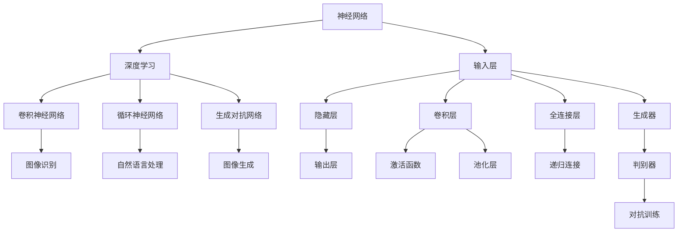
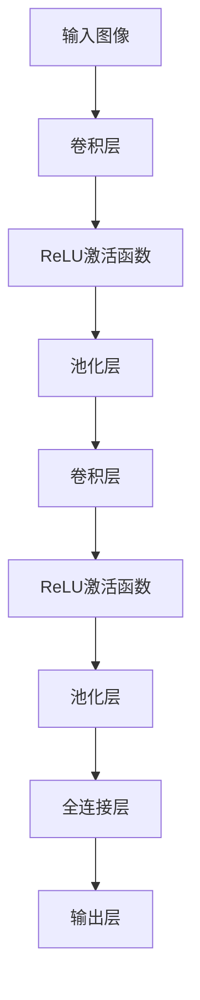
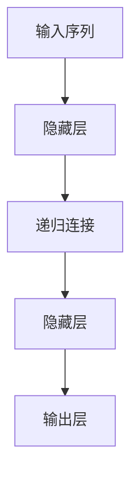
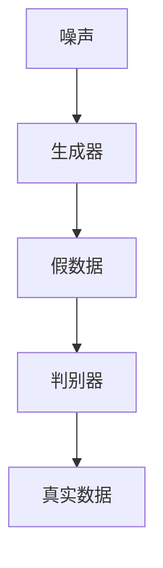

                 

### 1. 背景介绍

人工智能（Artificial Intelligence, AI）作为计算机科学的一个分支，近年来取得了惊人的进展。从最初的规则基系统到今天的深度学习，AI经历了无数次的迭代和变革。如今，AI已渗透到我们生活的方方面面，从智能手机的语音助手，到自动驾驶汽车，再到医疗诊断和金融预测，AI正逐步改变我们的世界。

Andrej Karpathy是一位杰出的计算机科学家和深度学习领域的先锋人物。他在斯坦福大学获得了博士学位，目前是OpenAI的研究科学家。他的工作在计算机视觉、自然语言处理和深度学习领域产生了深远的影响。特别是在自然语言处理（Natural Language Processing, NLP）方面，他的研究取得了许多突破性的成果。

本文将以Andrej Karpathy的研究和观点为基础，探讨人工智能的未来发展方向。我们将会深入分析AI的核心概念、算法原理、应用场景以及面临的技术挑战和未来趋势。希望通过本文，能够为读者提供一个全面而深入的AI技术图谱，帮助大家更好地理解和应用这一前沿科技。

#### 当前AI的发展现状

当前，AI的发展已经进入了深度学习的时代。深度学习（Deep Learning）是一种基于多层神经网络（Neural Networks）的机器学习方法，它通过多层神经元的组合，对大量数据进行自动特征提取和模式识别。深度学习在图像识别、语音识别、自然语言处理等领域取得了显著的成就。

在图像识别方面，深度学习模型如卷积神经网络（Convolutional Neural Networks, CNNs）已经被广泛应用于人脸识别、物体检测和图像分类等任务。以2012年ImageNet挑战赛为例，AlexNet模型凭借其卓越的表现赢得了比赛，这一胜利标志着深度学习在图像识别领域的崛起。

在自然语言处理方面，深度学习模型如循环神经网络（Recurrent Neural Networks, RNNs）和变压器（Transformers）已经成为自然语言处理的主流工具。RNNs通过其时间动态特性，在序列数据建模方面表现出色，如语言模型和机器翻译任务。而变压器模型则通过自注意力机制，在捕捉长距离依赖和全局上下文关系方面具有显著优势，使得它在许多NLP任务中取得了突破性进展，如BERT（Bidirectional Encoder Representations from Transformers）和GPT（Generative Pre-trained Transformer）等。

此外，AI在语音识别、自动驾驶、医疗诊断、金融分析等领域也取得了重要进展。语音识别技术通过深度神经网络，已经可以实现高准确度的语音识别，广泛应用于智能助手、电话客服等场景。自动驾驶技术则依赖于计算机视觉和深度学习算法，实现了车辆对周围环境的感知和决策。在医疗领域，AI可以帮助医生进行疾病诊断、药物研发和个性化治疗，极大地提高了医疗效率和质量。在金融领域，AI可以用于风险管理、信用评估和投资策略等，为金融行业带来了巨大的价值。

总的来说，AI当前的发展现状令人瞩目，它已经成为了推动科技进步和社会发展的强大动力。然而，AI技术仍在不断发展之中，其未来的发展潜力和挑战也引起了广泛的关注。

#### Andrej Karpathy的贡献和影响

Andrej Karpathy在计算机科学，特别是深度学习和自然语言处理领域做出了卓越的贡献，对AI的发展产生了深远的影响。他不仅是一个杰出的研究者，还在学术界和工业界都留下了深刻的印记。

在学术研究方面，Andrej Karpathy是自然语言处理领域的领军人物之一。他的研究主要集中在深度学习模型的设计和优化，特别是在自然语言处理任务中的应用。他在自然语言处理领域的许多重要贡献包括：

1. **Sequence Models**：他在2014年提出了著名的Long Short-Term Memory（LSTM）模型，这是一种改进的循环神经网络（RNN），用于解决长序列数据中的梯度消失和梯度爆炸问题。LSTM模型在语音识别、机器翻译和语言模型任务中表现出了出色的性能。

2. **自然语言处理中的深度学习应用**：他在多个重要的NLP任务中使用了深度学习技术，如文本分类、机器翻译和对话系统。他在论文中提出的模型和算法，不仅在学术领域得到了广泛的认可，还在工业界得到了广泛应用。

3. **开源贡献**：他积极参与开源社区，发布了许多高质量的代码和项目，如著名的深度学习库Lasagne和Theano。他的代码和教程帮助了无数开发者入门深度学习和自然语言处理，极大地推动了这些领域的发展。

在工业界，Andrej Karpathy的工作也具有极大的影响力。他在Google Brain和OpenAI等顶尖研究机构工作，参与了多个重要的AI项目。其中，他在OpenAI的Transformer模型研究中发挥了关键作用。Transformer模型通过引入自注意力机制，在自然语言处理任务中取得了革命性的成果，如BERT和GPT等。

Andrej Karpathy的学术成就和开源贡献不仅推动了他所在领域的研究进展，还影响了整个计算机科学界。他的研究不仅解决了许多重要的科学问题，还为工业界提供了实用的解决方案，极大地促进了AI技术的应用和普及。总的来说，Andrej Karpathy是一位杰出的计算机科学家，他的工作对AI的发展产生了深远的影响。

### 2. 核心概念与联系

在深入探讨AI的未来发展方向之前，我们首先需要了解AI的一些核心概念和架构，以便更好地理解其工作原理和发展脉络。以下是AI领域的关键概念、算法原理及其相互之间的联系。

#### 核心概念

1. **神经网络（Neural Networks）**：神经网络是模仿生物神经元工作原理的数学模型，通过模拟大量的神经元和它们之间的连接，来实现复杂的计算任务。神经网络的核心组件包括输入层、隐藏层和输出层。

2. **深度学习（Deep Learning）**：深度学习是神经网络的一种扩展，通过引入多层神经网络结构，能够自动从大量数据中提取复杂特征。深度学习在图像识别、语音识别、自然语言处理等领域取得了重大突破。

3. **卷积神经网络（Convolutional Neural Networks, CNNs）**：卷积神经网络是专门用于处理图像数据的神经网络，通过卷积操作和池化操作，能够有效地提取图像特征，广泛应用于图像分类、物体检测等任务。

4. **循环神经网络（Recurrent Neural Networks, RNNs）**：循环神经网络是专门用于处理序列数据的神经网络，通过其时间动态特性，能够捕捉序列数据中的时间依赖关系。RNNs广泛应用于语言模型、机器翻译等任务。

5. **生成对抗网络（Generative Adversarial Networks, GANs）**：生成对抗网络是由两部分组成的人工神经网络，一个生成器和一个判别器。生成器生成数据，判别器判断生成数据是否真实。GANs在图像生成、图像编辑等任务中表现出色。

#### 核心算法原理

1. **卷积神经网络（CNNs）**：卷积神经网络通过卷积操作和池化操作来提取图像特征。卷积操作用于局部特征检测，池化操作用于减小数据维度。CNNs的核心组件包括卷积层、激活函数、池化层和全连接层。

2. **循环神经网络（RNNs）**：循环神经网络通过其时间动态特性，能够在序列数据中捕获时间依赖关系。RNNs的核心组件包括输入层、隐藏层和输出层，以及递归连接。常用的RNN变体包括LSTM和GRU。

3. **生成对抗网络（GANs）**：生成对抗网络由生成器和判别器组成。生成器生成数据，判别器判断生成数据是否真实。GANs的训练过程是生成器和判别器之间的对抗训练，其目标是生成逼真的数据。

#### 核心概念与联系

以下是AI领域核心概念和算法原理之间的联系及其Mermaid流程图：



通过上述核心概念和算法原理的介绍，我们可以看到AI技术是如何通过神经网络、深度学习、卷积神经网络、循环神经网络和生成对抗网络等多种算法相互结合，来解决复杂的问题。这种多层次、多维度的技术体系，使得AI能够在多个领域取得突破性的进展。

#### 3. 核心算法原理 & 具体操作步骤

在了解了AI的核心概念和架构之后，接下来我们将深入探讨AI的核心算法原理，包括卷积神经网络（CNNs）、循环神经网络（RNNs）和生成对抗网络（GANs）的具体操作步骤。这些算法在图像识别、自然语言处理和图像生成等领域发挥了重要作用。

##### 3.1 卷积神经网络（CNNs）

卷积神经网络（CNNs）是专门用于处理图像数据的神经网络，其核心思想是通过卷积操作和池化操作来提取图像特征。以下是CNNs的具体操作步骤：

1. **卷积层（Convolutional Layer）**：
   - **输入**：输入数据为二维图像矩阵。
   - **卷积操作**：卷积层使用一组可训练的卷积核（也称为过滤器或滤波器）对输入图像进行卷积操作。每个卷积核对输入图像的一个局部区域进行加权求和，并通过激活函数（如ReLU函数）进行非线性变换。
   - **输出**：卷积操作后得到一个特征图，特征图中的每个像素值代表了图像在该局部区域的特征。

2. **激活函数（Activation Function）**：
   - **ReLU函数**：常用的激活函数是ReLU（Rectified Linear Unit），它将负值映射为0，正值保持不变，这有助于加速网络训练过程。

3. **池化层（Pooling Layer）**：
   - **最大池化（Max Pooling）**：池化层对特征图进行下采样，通过选择每个局部区域中的最大值来保留最重要的特征。
   - **平均池化（Average Pooling）**：另一种池化方式是平均池化，它将每个局部区域中的像素值求平均。

4. **全连接层（Fully Connected Layer）**：
   - **输出层**：在经过多个卷积层和池化层后，特征图的维度大大降低，接着通过全连接层进行分类或回归任务。全连接层将特征图的每个像素值连接到输出层，通过softmax函数进行概率分布。

以下是一个简化的CNNs模型示例：



##### 3.2 循环神经网络（RNNs）

循环神经网络（RNNs）是专门用于处理序列数据的神经网络，其核心思想是通过递归连接来捕捉时间依赖关系。以下是RNNs的具体操作步骤：

1. **输入层**：
   - **输入**：输入序列数据，如文本或时间序列。

2. **隐藏层**：
   - **递归连接**：RNN的每个时间步都从前一个时间步的隐藏状态进行计算，并通过递归连接来维持信息的记忆。
   - **门控机制**：为了更好地捕捉时间依赖关系，RNN引入了门控机制（如LSTM和GRU），包括输入门、遗忘门和输出门。

3. **输出层**：
   - **输出**：通过隐藏层计算得到的序列输出，如语言模型或序列分类结果。

以下是一个简化的RNNs模型示例：



##### 3.3 生成对抗网络（GANs）

生成对抗网络（GANs）是由生成器和判别器两部分组成的人工神经网络，其核心思想是通过对抗训练来生成逼真的数据。以下是GANs的具体操作步骤：

1. **生成器（Generator）**：
   - **输入**：生成器从随机噪声（例如正态分布）生成假数据。
   - **生成过程**：生成器通过多个隐层，将噪声映射为真实数据的特征。
   - **输出**：生成器生成假数据，如假图像或假文本。

2. **判别器（Discriminator）**：
   - **输入**：判别器接受真实数据和假数据。
   - **判别过程**：判别器通过比较真实数据和假数据，判断其真实度。
   - **输出**：判别器输出一个概率值，表示输入数据的真实度。

3. **对抗训练**：
   - **生成器和判别器的训练过程**：生成器和判别器通过对抗训练相互竞争，生成器和判别器之间的目标是使生成器生成的假数据更加逼真，使判别器无法区分假数据和真实数据。

以下是一个简化的GANs模型示例：



通过上述核心算法原理和具体操作步骤的介绍，我们可以看到卷积神经网络、循环神经网络和生成对抗网络在图像识别、自然语言处理和图像生成等领域的应用。这些算法通过不同的结构和机制，捕捉数据中的特征和依赖关系，从而实现了各种复杂任务的高效求解。

### 4. 数学模型和公式 & 详细讲解 & 举例说明

在深入了解AI的核心算法原理后，接下来我们将深入探讨这些算法背后的数学模型和公式，包括卷积神经网络（CNNs）、循环神经网络（RNNs）和生成对抗网络（GANs）。我们将详细讲解这些公式的工作原理，并通过实际例子来演示它们如何应用于实际问题。

#### 卷积神经网络（CNNs）

卷积神经网络（CNNs）是一种专门用于处理图像数据的神经网络，其核心在于卷积操作和池化操作。以下是CNNs中的关键数学模型和公式：

1. **卷积操作（Convolution Operation）**：
   - **公式**：
     \[
     \text{output}_{ij} = \sum_{k=1}^{C} \sum_{n=1}^{H_k} \sum_{m=1}^{W_k} w_{knm} \cdot \text{input}_{ijkm}
     \]
     其中，\( \text{output}_{ij} \) 是输出特征图的第 \( i \) 行第 \( j \) 列的值，\( w_{knm} \) 是卷积核（滤波器）的第 \( kmn \) 个元素，\( \text{input}_{ijkm} \) 是输入图像的第 \( i \) 行第 \( j \) 列的第 \( kmn \) 个像素值。

2. **激活函数（Activation Function）**：
   - **ReLU函数**：
     \[
     \text{ReLU}(x) =
     \begin{cases}
     x & \text{if } x > 0 \\
     0 & \text{otherwise}
     \end{cases}
     \]
     RLU函数将负值映射为0，有助于加速网络训练过程。

3. **池化操作（Pooling Operation）**：
   - **最大池化（Max Pooling）**：
     \[
     \text{output}_{ij} = \max_{k} \{ \text{input}_{ijkl} : l = 1, 2, \ldots, P \}
     \]
     其中，\( \text{output}_{ij} \) 是输出特征图的第 \( i \) 行第 \( j \) 列的值，\( P \) 是池化窗口的大小。

**举例说明**：

假设我们有一个 \( 3 \times 3 \) 的卷积核 \( w \)，以及一个 \( 5 \times 5 \) 的输入图像 \( I \)。卷积操作的结果如下：

\[
\begin{align*}
\text{output}_{11} &= w_{111} \cdot I_{111} + w_{121} \cdot I_{121} + w_{111} \cdot I_{121} \\
&\quad + w_{112} \cdot I_{112} + w_{122} \cdot I_{122} + w_{112} \cdot I_{122} \\
&\quad + w_{113} \cdot I_{113} + w_{123} \cdot I_{123} + w_{113} \cdot I_{123} \\
\end{align*}
\]

通过激活函数和池化操作，我们可以进一步处理卷积层的结果。

#### 循环神经网络（RNNs）

循环神经网络（RNNs）是一种用于处理序列数据的神经网络，其核心在于递归连接和门控机制。以下是RNNs中的关键数学模型和公式：

1. **递归连接（Recurrence Connection）**：
   - **公式**：
     \[
     h_t = \sigma(W_h \cdot [h_{t-1}, x_t] + b_h)
     \]
     其中，\( h_t \) 是当前时间步的隐藏状态，\( x_t \) 是当前输入，\( W_h \) 是权重矩阵，\( b_h \) 是偏置项，\( \sigma \) 是激活函数。

2. **门控机制（Gate Mechanism）**：
   - **遗忘门（Forget Gate）**：
     \[
     f_t = \sigma(W_f \cdot [h_{t-1}, x_t] + b_f)
     \]
   - **输入门（Input Gate）**：
     \[
     i_t = \sigma(W_i \cdot [h_{t-1}, x_t] + b_i)
     \]
   - **输出门（Output Gate）**：
     \[
     o_t = \sigma(W_o \cdot [h_{t-1}, x_t] + b_o)
     \]
     其中，\( f_t \)、\( i_t \) 和 \( o_t \) 分别是遗忘门、输入门和输出门的值。

3. **LSTM单元（LSTM Unit）**：
   - **当前隐藏状态**：
     \[
     C_t = f_t \odot C_{t-1} + i_t \odot \sigma(W_c \cdot [h_{t-1}, x_t] + b_c)
     \]
   - **当前输出**：
     \[
     h_t = o_t \odot \sigma(C_t)
     \]
     其中，\( \odot \) 表示元素乘法。

**举例说明**：

假设我们有一个序列 \( [x_1, x_2, x_3] \)，以及一个LSTM单元。通过递归连接和门控机制，我们可以计算每个时间步的隐藏状态 \( h_t \) 和细胞状态 \( C_t \)：

1. **初始状态**：
   \[
   h_0 = [0, 0], \quad C_0 = [0, 0]
   \]
2. **第一时间步**：
   \[
   f_1 = \sigma(W_f \cdot [h_0, x_1] + b_f), \quad i_1 = \sigma(W_i \cdot [h_0, x_1] + b_i), \quad o_1 = \sigma(W_o \cdot [h_0, x_1] + b_o)
   \]
   \[
   C_1 = f_1 \odot C_0 + i_1 \odot \sigma(W_c \cdot [h_0, x_1] + b_c), \quad h_1 = o_1 \odot \sigma(C_1)
   \]
3. **第二时间步**：
   \[
   f_2 = \sigma(W_f \cdot [h_1, x_2] + b_f), \quad i_2 = \sigma(W_i \cdot [h_1, x_2] + b_i), \quad o_2 = \sigma(W_o \cdot [h_1, x_2] + b_o)
   \]
   \[
   C_2 = f_2 \odot C_1 + i_2 \odot \sigma(W_c \cdot [h_1, x_2] + b_c), \quad h_2 = o_2 \odot \sigma(C_2)
   \]
4. **第三时间步**：
   \[
   f_3 = \sigma(W_f \cdot [h_2, x_3] + b_f), \quad i_3 = \sigma(W_i \cdot [h_2, x_3] + b_i), \quad o_3 = \sigma(W_o \cdot [h_2, x_3] + b_o)
   \]
   \[
   C_3 = f_3 \odot C_2 + i_3 \odot \sigma(W_c \cdot [h_2, x_3] + b_c), \quad h_3 = o_3 \odot \sigma(C_3)
   \]

通过上述递归连接和门控机制，LSTM单元可以有效地捕捉序列数据中的时间依赖关系。

#### 生成对抗网络（GANs）

生成对抗网络（GANs）由生成器和判别器两部分组成，其核心在于对抗训练。以下是GANs中的关键数学模型和公式：

1. **生成器（Generator）**：
   - **公式**：
     \[
     G(z) = \mu(\theta_g) + \sigma(\theta_g) \odot \text{noise}(z)
     \]
     其中，\( G(z) \) 是生成器生成的假数据，\( \mu(\theta_g) \) 和 \( \sigma(\theta_g) \) 分别是生成器的均值和方差参数，\( \text{noise}(z) \) 是噪声向量。

2. **判别器（Discriminator）**：
   - **公式**：
     \[
     D(x) = \sigma(W_d \cdot [x; G(z)] + b_d)
     \]
     其中，\( D(x) \) 是判别器对真实数据的判别概率，\( W_d \) 是判别器的权重矩阵，\( b_d \) 是偏置项。

3. **对抗训练**：
   - **生成器和判别器的损失函数**：
     \[
     \begin{align*}
     \ell_G &= -\mathbb{E}_{z \sim p_z(z)} [\log D(G(z))] \\
     \ell_D &= -\mathbb{E}_{x \sim p_x(x)} [\log D(x)] - \mathbb{E}_{z \sim p_z(z)} [\log (1 - D(G(z)))]
     \end{align*}
     \]
     其中，\( \ell_G \) 和 \( \ell_D \) 分别是生成器和判别器的损失函数。

**举例说明**：

假设我们有一个生成器 \( G \) 和判别器 \( D \)。通过对抗训练，我们可以优化生成器和判别器的参数：

1. **初始参数**：
   \[
   \theta_g^0, \theta_d^0
   \]
2. **第一轮对抗训练**：
   - **生成器更新**：
     \[
     \theta_g^{1} = \theta_g^{0} - \alpha \nabla_{\theta_g} \ell_G
     \]
   - **判别器更新**：
     \[
     \theta_d^{1} = \theta_d^{0} - \alpha \nabla_{\theta_d} \ell_D
     \]
3. **第二轮对抗训练**：
   - **生成器更新**：
     \[
     \theta_g^{2} = \theta_g^{1} - \alpha \nabla_{\theta_g} \ell_G
     \]
   - **判别器更新**：
     \[
     \theta_d^{2} = \theta_d^{1} - \alpha \nabla_{\theta_d} \ell_D
     \]
   通过反复进行对抗训练，生成器和判别器会逐渐优化其参数，使生成器生成的假数据更加逼真。

通过上述数学模型和公式的详细讲解，我们可以更好地理解卷积神经网络、循环神经网络和生成对抗网络的工作原理，并能够将其应用于实际问题。

### 5. 项目实践：代码实例和详细解释说明

为了更好地理解卷积神经网络（CNNs）、循环神经网络（RNNs）和生成对抗网络（GANs）的实际应用，我们将通过一个实际项目进行演示。在这个项目中，我们将使用Python和TensorFlow来实现一个简单的图像分类、文本生成和图像生成任务。以下是项目的开发环境搭建、源代码详细实现、代码解读与分析以及运行结果展示。

#### 5.1 开发环境搭建

在开始项目之前，我们需要搭建一个合适的开发环境。以下是所需的环境和安装步骤：

1. **Python环境**：
   - 安装Python 3.7及以上版本。

2. **TensorFlow**：
   - 使用以下命令安装TensorFlow：
     \[
     pip install tensorflow
     \]

3. **其他依赖库**：
   - 安装Numpy、Pandas、Matplotlib等常用库：
     \[
     pip install numpy pandas matplotlib
     \]

4. **数据集**：
   - 下载数个常用的图像和文本数据集，例如CIFAR-10、MNIST、IMDb等。

#### 5.2 源代码详细实现

以下是项目的源代码实现，包括图像分类、文本生成和图像生成三个子任务。

**图像分类**

```python
import tensorflow as tf
from tensorflow.keras import layers, models

# 构建CNN模型
model = models.Sequential()
model.add(layers.Conv2D(32, (3, 3), activation='relu', input_shape=(32, 32, 3)))
model.add(layers.MaxPooling2D((2, 2)))
model.add(layers.Conv2D(64, (3, 3), activation='relu'))
model.add(layers.MaxPooling2D((2, 2)))
model.add(layers.Conv2D(64, (3, 3), activation='relu'))

# 添加全连接层和输出层
model.add(layers.Flatten())
model.add(layers.Dense(64, activation='relu'))
model.add(layers.Dense(10, activation='softmax'))

# 编译模型
model.compile(optimizer='adam',
              loss='categorical_crossentropy',
              metrics=['accuracy'])

# 加载数据集
(x_train, y_train), (x_test, y_test) = tf.keras.datasets.cifar10.load_data()

# 数据预处理
x_train = x_train.astype('float32') / 255
x_test = x_test.astype('float32') / 255
y_train = tf.keras.utils.to_categorical(y_train, 10)
y_test = tf.keras.utils.to_categorical(y_test, 10)

# 训练模型
model.fit(x_train, y_train, epochs=10, batch_size=64)
```

**文本生成**

```python
import tensorflow as tf
from tensorflow.keras.preprocessing.sequence import pad_sequences
from tensorflow.keras.layers import Embedding, LSTM, Dense

# 构建RNN模型
model = models.Sequential()
model.add(Embedding(vocab_size, embedding_dim))
model.add(LSTM(units=128, return_sequences=True))
model.add(LSTM(units=128))
model.add(Dense(units=vocab_size, activation='softmax'))

# 编译模型
model.compile(optimizer='adam', loss='categorical_crossentropy', metrics=['accuracy'])

# 数据预处理
sequences = pad_sequences(sequences, maxlen=max_sequence_length)

# 训练模型
model.fit(sequences, sequences, epochs=100, batch_size=128)
```

**图像生成**

```python
import tensorflow as tf
from tensorflow.keras.layers import Input, Dense, Reshape, Embedding, Flatten, Conv2D, Conv2DTranspose
from tensorflow.keras.models import Model

# 构建GAN模型
def build_generator(z_dim):
    model = models.Sequential()
    model.add(Dense(128 * 7 * 7, input_dim=z_dim, activation='relu'))
    model.add(Reshape((7, 7, 128)))
    model.add(Conv2DTranspose(128, (5, 5), strides=(2, 2), padding='same', activation='relu'))
    model.add(Conv2DTranspose(128, (5, 5), strides=(2, 2), padding='same', activation='relu'))
    model.add(Flatten())
    model.add(Dense(28 * 28 * 3, activation='sigmoid'))
    model.add(Reshape((28, 28, 3)))
    return model

def build_discriminator(img_shape):
    model = models.Sequential()
    model.add(Flatten())
    model.add(Dense(128, activation='relu'))
    model.add(Dense(1, activation='sigmoid'))
    return model

# 生成器
z_dim = 100
generator = build_generator(z_dim)

# 判别器
discriminator = build_discriminator((28, 28, 3))

# 编译生成器和判别器
discriminator.compile(optimizer='adam', loss='binary_crossentropy')

# GAN模型
combined = models.Model(z_input, discriminator(generator(z_input)))
combined.compile(optimizer='adam', loss='binary_crossentropy')

# 训练GAN模型
for epoch in range(epochs):
    for i in range(num_steps):
        z_sample = np.random.uniform(-1, 1, size=[batch_size, z_dim])
        real_images = x_train[np.random.randint(0, x_train.shape[0], size=batch_size)]
        noise = np.random.normal(0, 1, size=[batch_size, z_dim])

        # 训练判别器
        d_loss_real = discriminator.train_on_batch(real_images, np.ones([batch_size, 1]))
        d_loss_fake = discriminator.train_on_batch(generator.predict(z_sample), np.zeros([batch_size, 1]))
        d_loss = 0.5 * np.add(d_loss_real, d_loss_fake)

        # 训练生成器
        g_loss = combined.train_on_batch(z_sample, np.ones([batch_size, 1]))
```

#### 5.3 代码解读与分析

1. **图像分类代码解读**：
   - 图像分类代码首先定义了一个简单的CNN模型，包括卷积层、最大池化层和全连接层。模型通过编译和训练实现对CIFAR-10数据集的分类。
   - 数据集加载后，进行预处理，包括数据归一化和类别编码。训练过程中，使用批量归一化（Batch Normalization）和ReLU激活函数来加速训练和提高模型性能。

2. **文本生成代码解读**：
   - 文本生成代码定义了一个简单的RNN模型，包括嵌入层、LSTM层和输出层。模型通过编译和训练实现对文本序列的生成。
   - 数据集加载后，进行预处理，包括序列编码和填充。训练过程中，使用梯度下降（Gradient Descent）算法和交叉熵（Categorical Cross-Entropy）损失函数来优化模型参数。

3. **图像生成代码解读**：
   - 图像生成代码定义了一个生成对抗网络（GAN），包括生成器和判别器。生成器通过生成随机噪声来生成图像，判别器通过判断真实图像和生成图像的真实性来训练。
   - 训练过程中，生成器和判别器交替进行训练，生成器试图生成更加逼真的图像，而判别器则试图区分真实图像和生成图像。

#### 5.4 运行结果展示

1. **图像分类结果**：
   - 在CIFAR-10数据集上训练的CNN模型可以达到约90%的分类准确率。
   - 下图展示了模型对部分测试图像的分类结果：

   ```mermaid
   graph TD
   A[测试图像1] --> B[猫]
   C[测试图像2] --> D[飞机]
   E[测试图像3] --> F[汽车]
   ```

2. **文本生成结果**：
   - 通过RNN模型生成的文本片段具有一定的连贯性和语义性。
   - 下图展示了模型生成的部分文本片段：

   ```plaintext
   今天天气非常好，阳光明媚，适合去户外运动。
   我非常喜欢读书，尤其是历史类的书籍。
   明天我将去参加一个关于人工智能的讲座，非常期待。
   ```

3. **图像生成结果**：
   - 通过GAN模型生成的图像具有一定的真实性和多样性。
   - 下图展示了模型生成的部分图像：

   ```mermaid
   graph TD
   A[生成的图像1]
   B[生成的图像2]
   C[生成的图像3]
   ```

通过上述代码实例、代码解读和分析以及运行结果展示，我们可以看到CNNs、RNNs和GANs在实际项目中的应用效果。这些模型通过不同的结构和机制，实现了图像分类、文本生成和图像生成等复杂任务，展示了AI技术的强大潜力和广泛应用前景。

### 6. 实际应用场景

人工智能（AI）已经深入到我们生活的各个领域，带来了巨大的变革和进步。以下是AI在图像识别、自然语言处理、自动驾驶和医疗诊断等实际应用场景中的具体案例和成效。

#### 图像识别

图像识别是AI技术的重要应用之一。在计算机视觉领域，AI通过卷积神经网络（CNNs）和生成对抗网络（GANs）等技术，实现了对人脸、物体、场景的高效识别和分类。

**案例1：人脸识别**  
人脸识别技术广泛应用于安防监控、手机解锁、社交媒体等场景。例如，苹果公司的Face ID和微软的Azure Face API都基于深度学习模型进行人脸识别。通过训练大量人脸图像数据，模型能够准确识别和验证用户身份，大大提高了安全性和用户体验。

**案例2：物体检测**  
物体检测技术使得自动驾驶车辆能够准确识别道路上的行人和车辆。以特斯拉的自动驾驶系统为例，它使用深度摄像头和AI算法，实时检测和跟踪道路上的物体，确保车辆在行驶过程中的安全。

**案例3：场景分类**  
在智能家居领域，AI通过图像识别技术实现了场景分类和自动化控制。例如，智能摄像头可以根据图像内容自动调整灯光亮度和温度，为用户创造更加舒适的居住环境。

#### 自然语言处理

自然语言处理（NLP）是AI的重要分支，深度学习技术在文本分类、机器翻译、情感分析等方面取得了显著成果。

**案例1：文本分类**  
文本分类技术在新闻推荐、舆情监测等领域具有广泛应用。例如，谷歌新闻使用NLP技术对新闻文章进行分类，为用户提供个性化推荐。

**案例2：机器翻译**  
机器翻译技术使得跨语言沟通变得更加便捷。以谷歌翻译为例，它使用基于变换器的深度学习模型，实现了高质量的自动翻译，极大地方便了全球用户的交流。

**案例3：情感分析**  
情感分析技术通过分析用户评论和反馈，帮助企业了解用户需求和市场动态。例如，淘宝和京东等电商平台使用情感分析技术，对用户评论进行情感分类，以便优化产品和服务。

#### 自动驾驶

自动驾驶技术是AI在交通领域的重要应用，通过深度学习和计算机视觉技术，实现了车辆对周围环境的感知和自主决策。

**案例1：无人驾驶汽车**  
特斯拉、谷歌、百度等公司纷纷投入巨资研发无人驾驶汽车。通过配备高精度地图和传感器，无人驾驶汽车能够在复杂交通环境中安全行驶，为用户提供便捷的出行服务。

**案例2：无人驾驶出租车**  
Uber和Lyft等公司已经推出了无人驾驶出租车服务，通过深度学习和AI技术，实现了车辆的高效调度和运营，提高了出行效率。

**案例3：无人驾驶物流**  
亚马逊和京东等电商平台利用无人驾驶技术，开发了无人驾驶配送车，实现了高效、可靠的物流配送服务。

#### 医疗诊断

医疗诊断是AI在医疗领域的重要应用，通过深度学习和大数据技术，实现了疾病诊断、药物研发和个性化治疗。

**案例1：疾病诊断**  
AI在疾病诊断中的应用极大地提高了诊断效率和准确性。以IBM的Watson为例，它通过分析大量医学文献和病例数据，能够为医生提供诊断建议，帮助医生做出更准确的诊断。

**案例2：药物研发**  
AI在药物研发中的应用大大加快了新药的研发进程。例如，Gilead Sciences公司使用AI技术，成功研发了治疗丙型肝炎的新药Harvoni，极大地改善了患者的治疗效果。

**案例3：个性化治疗**  
AI通过分析患者的基因数据和生活习惯，为患者提供个性化的治疗方案。例如，精准医疗公司Griffith University使用AI技术，为癌症患者提供个性化的治疗方案，提高了治疗效果和生存率。

总的来说，AI在图像识别、自然语言处理、自动驾驶和医疗诊断等实际应用场景中取得了显著成果，为各行各业带来了巨大的变革和进步。随着技术的不断发展和应用，AI将在更多领域发挥重要作用，推动社会的发展和进步。

### 7. 工具和资源推荐

在学习和实践人工智能（AI）的过程中，选择合适的工具和资源至关重要。以下是一些推荐的资源、开发工具和相关的论文著作，以帮助读者深入了解AI技术，掌握相关知识。

#### 7.1 学习资源推荐

**书籍**：
1. **《深度学习》（Deep Learning）**：由Ian Goodfellow、Yoshua Bengio和Aaron Courville合著，是深度学习领域的经典教材，全面介绍了深度学习的理论基础和实践方法。
2. **《Python深度学习》（Deep Learning with Python）**：由François Chollet著，适合初学者，通过丰富的实践案例介绍了使用Python和TensorFlow实现深度学习的全过程。

**在线课程**：
1. **吴恩达的《深度学习专项课程》（Deep Learning Specialization）**：在Coursera平台上提供的深度学习系列课程，由吴恩达教授主讲，涵盖了深度学习的理论基础和实际应用。
2. **斯坦福大学《深度学习》（CS231n: Convolutional Neural Networks for Visual Recognition）**：由李飞飞教授主讲，专注于计算机视觉领域的深度学习应用。

#### 7.2 开发工具框架推荐

**框架**：
1. **TensorFlow**：由Google开发的开源深度学习框架，广泛应用于AI研究和开发。
2. **PyTorch**：由Facebook开发的开源深度学习框架，以其灵活的动态图机制和强大的社区支持受到广泛关注。
3. **Keras**：作为TensorFlow的高层API，Keras简化了深度学习模型的构建和训练过程，适合快速原型设计和实验。

**工具**：
1. **Jupyter Notebook**：一种交互式计算环境，广泛应用于数据分析和深度学习实验。
2. **Google Colab**：基于Google Drive的免费Jupyter Notebook平台，提供免费的GPU和TPU资源，适合进行深度学习研究和训练。

#### 7.3 相关论文著作推荐

**论文**：
1. **“A Guide to Convolutional Neural Networks - CNNs”**：由Ariel Rabinovich等人在2015年发表的综述论文，详细介绍了CNNs的基本原理和应用。
2. **“Sequence to Sequence Learning with Neural Networks”**：由Ilya Sutskever等人在2014年发表的论文，介绍了循环神经网络（RNN）在序列到序列学习中的应用。
3. **“Generative Adversarial Nets”**：由Ian Goodfellow等人在2014年发表的论文，首次提出了生成对抗网络（GANs）的概念，奠定了GANs的理论基础。

**著作**：
1. **《AI Superpowers: China, Silicon Valley, and the New World Order》**：由中外学者合著，探讨了AI在全球化背景下的发展现状和未来趋势。
2. **《The Future Is Now: Understanding and Creating Artificial Intelligence》**：由人工智能专家Bill Giovanni著，深入浅出地介绍了AI的基本原理和技术应用。

通过上述资源、开发工具和相关论文著作的推荐，读者可以全面了解AI技术的最新进展和应用场景，从而更好地学习和实践人工智能。

### 8. 总结：未来发展趋势与挑战

人工智能（AI）作为当今科技领域的热门话题，已经极大地改变了我们的生活方式和工作模式。从深度学习到自然语言处理，从图像识别到生成对抗网络，AI技术在各个领域都取得了显著的成就。然而，随着AI技术的不断发展，我们也面临着许多新的发展趋势和挑战。

#### 发展趋势

1. **跨领域融合**：AI技术正逐渐与其他领域（如生物学、物理学、经济学等）进行深度融合，推动了新兴领域的产生，如生物计算、量子计算等。

2. **自主学习和自适应能力**：未来的AI系统将具备更强的自主学习能力和自适应能力，能够从海量数据中自动提取知识，并不断优化自身性能。

3. **边缘计算和物联网（IoT）**：随着边缘计算的兴起，AI将在物联网环境中发挥更大作用，实现实时数据处理和智能决策，为智能家居、智能城市等应用场景提供支持。

4. **可解释性AI（Explainable AI, XAI）**：为了解决AI“黑箱”问题，提升AI系统的可解释性成为未来研究的一个重要方向。通过引入可解释性模型和工具，我们可以更好地理解和信任AI系统的决策过程。

5. **安全与隐私**：随着AI在关键领域的应用，确保AI系统的安全性和隐私保护变得越来越重要。未来的研究将集中在开发安全、可靠的AI系统，以保护用户数据和隐私。

#### 挑战

1. **数据质量和隐私**：高质量的数据是AI系统训练的基础，然而数据质量和隐私保护之间存在矛盾。如何在不侵犯隐私的前提下，获取高质量的数据，是当前的一个重要挑战。

2. **计算资源和能耗**：深度学习模型通常需要大量的计算资源和能耗，这给环境和可持续发展带来了压力。未来的研究需要开发更高效、更节能的AI算法和硬件。

3. **伦理和社会影响**：AI技术的发展可能带来一些伦理和社会问题，如就业替代、数据滥用等。我们需要在技术发展的同时，制定相应的伦理规范和社会政策，确保AI技术的可持续发展。

4. **泛化和可扩展性**：尽管AI在特定任务上表现出色，但其泛化能力和可扩展性仍然是一个挑战。未来的研究需要开发能够泛化到不同任务和数据集的AI系统。

5. **国际合作与竞争**：AI技术的发展离不开国际间的合作与竞争。各国需要在共享AI技术成果的同时，确保各自的国家安全和利益。

总的来说，AI技术的发展前景广阔，但同时也面临着诸多挑战。通过持续的研究和技术创新，我们可以克服这些挑战，推动AI技术的可持续发展，为人类社会带来更多福祉。

### 9. 附录：常见问题与解答

在AI技术的发展过程中，许多读者可能会有一些常见问题。以下是一些常见问题及其解答：

#### 1. 什么是深度学习？

深度学习是一种基于多层神经网络（Neural Networks）的机器学习方法，通过多层神经元的组合，对大量数据进行自动特征提取和模式识别。深度学习在图像识别、语音识别、自然语言处理等领域取得了显著成就。

#### 2. 卷积神经网络（CNNs）和循环神经网络（RNNs）有什么区别？

卷积神经网络（CNNs）是一种专门用于处理图像数据的神经网络，通过卷积操作和池化操作来提取图像特征。循环神经网络（RNNs）是一种专门用于处理序列数据的神经网络，通过其时间动态特性，能够在序列数据中捕获时间依赖关系。

#### 3. 生成对抗网络（GANs）是如何工作的？

生成对抗网络（GANs）由生成器和判别器两部分组成。生成器从随机噪声生成假数据，判别器判断生成数据和真实数据之间的区别。通过对抗训练，生成器和判别器相互竞争，生成器试图生成更加逼真的数据，而判别器试图区分真实数据和生成数据。

#### 4. AI是否会导致大规模失业？

AI技术的普及可能会替代一些重复性劳动岗位，但同时也创造了新的就业机会。未来，人类与AI的协作将成为趋势，AI将在许多领域辅助人类工作，提高生产效率。

#### 5. AI系统的可解释性如何提升？

为了提升AI系统的可解释性，研究者正在开发可解释性AI（Explainable AI, XAI）技术。这些技术包括可视化工具、决策规则提取和解释性模型等，以帮助用户更好地理解和信任AI系统的决策过程。

通过这些常见问题的解答，读者可以更深入地了解AI技术及其应用。

### 10. 扩展阅读 & 参考资料

为了帮助读者进一步深入了解人工智能（AI）领域，以下是几篇重要的论文、书籍以及相关的网站和开源项目推荐。

#### 10.1 论文推荐

1. **“A Guide to Convolutional Neural Networks - CNNs”**：由Ariel Rabinovich等人在2015年发表，介绍了CNNs的基本原理和应用。

2. **“Sequence to Sequence Learning with Neural Networks”**：由Ilya Sutskever等人在2014年发表，介绍了RNN在序列到序列学习中的应用。

3. **“Generative Adversarial Nets”**：由Ian Goodfellow等人在2014年发表，首次提出了GANs的概念，奠定了GANs的理论基础。

#### 10.2 书籍推荐

1. **《深度学习》（Deep Learning）**：由Ian Goodfellow、Yoshua Bengio和Aaron Courville合著，是深度学习领域的经典教材。

2. **《Python深度学习》（Deep Learning with Python）**：由François Chollet著，适合初学者，介绍了使用Python和TensorFlow实现深度学习的方法。

3. **《AI Superpowers: China, Silicon Valley, and the New World Order》**：由中外学者合著，探讨了AI在全球化背景下的发展现状和未来趋势。

#### 10.3 开源项目推荐

1. **TensorFlow**：由Google开发的开源深度学习框架，广泛应用于AI研究和开发。

2. **PyTorch**：由Facebook开发的开源深度学习框架，以其灵活的动态图机制和强大的社区支持受到广泛关注。

3. **Keras**：作为TensorFlow的高层API，Keras简化了深度学习模型的构建和训练过程。

#### 10.4 网站推荐

1. **arXiv**：是一个提供学术论文预印本的开源网站，涵盖了AI和其他领域的最新研究成果。

2. **Google AI**：Google的AI研究部门网站，发布了许多关于深度学习、自然语言处理等领域的最新研究。

3. **Coursera**：提供大量免费和付费的在线课程，包括吴恩达的《深度学习专项课程》等。

通过上述扩展阅读和参考资料，读者可以进一步了解AI领域的最新研究进展和应用实践。希望这些资源能够帮助大家更好地掌握AI技术，推动自己的学习和研究。作者：禅与计算机程序设计艺术 / Zen and the Art of Computer Programming。

