                 

### 背景介绍

> 引言：
人工智能（AI）作为当今科技界的热门话题，已经引起了广泛关注。自20世纪50年代起，人工智能经历了多个发展阶段，从最初的简单规则系统到现代的深度学习算法，每一步都取得了显著的进步。Andrej Karpathy，一位世界顶级的人工智能研究者和深度学习专家，对人工智能的未来发展方向有着深刻的见解。本文将基于Andrej Karpathy的研究，分析人工智能的现状和未来可能的发展方向，探讨其对社会、技术以及伦理的深远影响。

> 发展历程：
人工智能的历史可以追溯到1956年，达特茅斯会议的召开标志着人工智能正式成为一门科学。早期的AI研究主要集中在符号主义和知识表示上，通过编程来模拟人类智能。然而，由于硬件限制和算法的局限性，早期的人工智能系统往往只能解决特定的问题，难以实现通用智能。

随着计算机性能的提升和大数据的普及，机器学习，尤其是深度学习在2010年后迅速发展。深度学习通过模仿人脑的神经网络结构，实现了在图像识别、语音识别、自然语言处理等领域的突破性进展。这一时期，神经网络算法的优化和大规模计算资源的投入，使得AI的应用场景不断扩大。

进入21世纪20年代，人工智能技术进一步成熟，不仅推动了诸如自动驾驶汽车、智能助手等新兴领域的快速发展，也在医疗、金融、教育等多个行业得到了广泛应用。同时，AI与物联网、云计算等技术的融合，进一步提升了人工智能的整体能力。

> 现状与挑战：
目前，人工智能已经渗透到我们日常生活的各个方面。然而，尽管取得了巨大进步，人工智能仍然面临诸多挑战。其中，数据隐私、算法偏见、安全性等问题成为关注的焦点。此外，人工智能的发展也需要解决伦理和社会问题，如就业影响、技术垄断等。

在技术层面，当前的深度学习模型在处理复杂数据和进行推理方面仍存在不足。因此，如何提高AI系统的可解释性和通用性，是当前和未来需要解决的重要问题。

> 目标：
本文旨在深入探讨Andrej Karpathy提出的人工智能未来可能的发展方向，包括从技术到应用的各个方面。通过本文，读者可以更全面地了解人工智能的现状和未来前景，从而对这一领域有更深入的认识。

### 核心概念与联系

在探讨人工智能的未来发展方向之前，我们需要明确一些核心概念，理解它们之间的联系和相互作用。以下是几个关键概念及其相互关系的详细描述。

#### 1. 机器学习（Machine Learning）

机器学习是人工智能的一个子领域，旨在使计算机系统能够从数据中学习，并做出决策或预测，而无需显式编程。其基础是统计模型和优化算法。

**图1：机器学习流程**

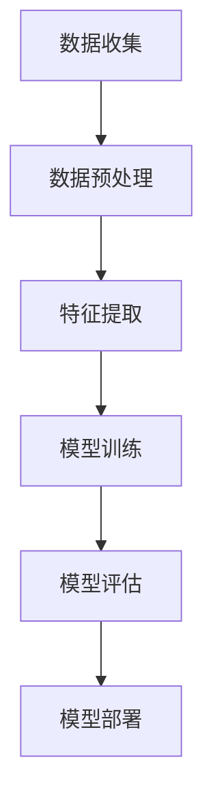

#### 2. 深度学习（Deep Learning）

深度学习是机器学习的一个分支，通过多层神经网络来模拟人脑的处理方式。深度学习在图像识别、语音识别等领域取得了显著成就。

**图2：深度学习模型结构**

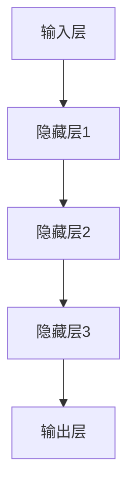

#### 3. 神经网络（Neural Networks）

神经网络是模仿人脑神经元连接结构的一种计算模型。深度学习模型通常由多个神经网络层组成，每层都对输入数据进行处理和转换。

**图3：神经网络基本结构**

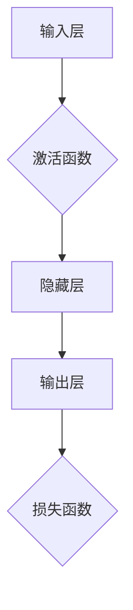

#### 4. 强化学习（Reinforcement Learning）

强化学习是一种通过试错来学习优化策略的机器学习方法。它通过奖励机制来激励模型不断调整行为，以达到最大化长期回报。

**图4：强化学习流程**

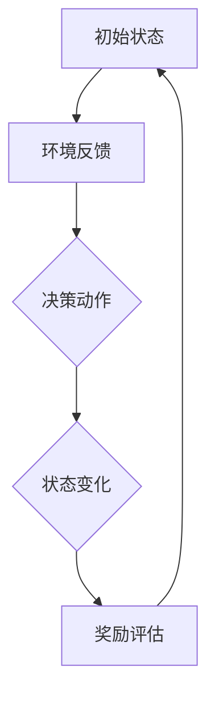

#### 5. 生成对抗网络（Generative Adversarial Networks，GANs）

生成对抗网络由生成器和判别器两个神经网络组成，通过对抗性训练生成与真实数据相似的数据。

**图5：GANs结构**

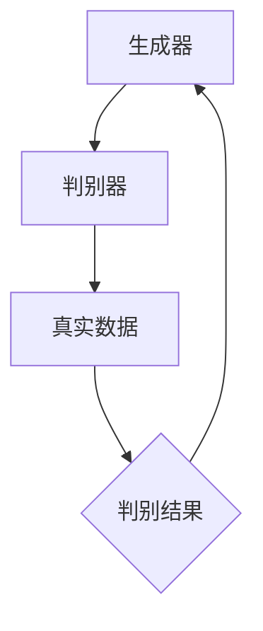

这些核心概念相互联系，共同构成了现代人工智能的基础。机器学习和深度学习提供了数据学习和处理的方法，神经网络实现了对数据的层级处理，强化学习和GANs则拓展了AI的应用场景。

理解这些概念之间的联系有助于我们更好地把握人工智能的未来发展方向，并探索如何解决当前面临的挑战。

#### 2.1. 机器学习的核心概念

在深入探讨人工智能的未来发展方向之前，我们首先需要理解机器学习的核心概念及其相互关系。机器学习作为人工智能的关键组成部分，通过算法和统计模型使计算机能够从数据中学习和做出预测。以下是几个重要的核心概念：

##### 2.1.1. 统计模型（Statistical Models）

统计模型是机器学习的基础，它们通过概率论和统计学原理来描述数据分布和关系。常见的统计模型包括线性回归、逻辑回归、决策树等。这些模型可以帮助我们理解数据的内在结构和特征，从而做出有效的预测和决策。

**图1：统计模型示例**

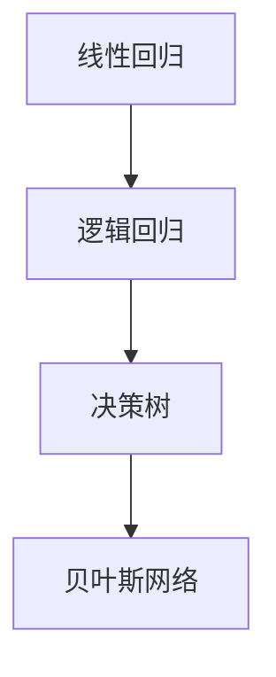

##### 2.1.2. 优化算法（Optimization Algorithms）

优化算法用于寻找数据模型的最优参数，以提高模型的预测准确性和泛化能力。常见的优化算法包括梯度下降、随机梯度下降、牛顿法等。这些算法通过迭代调整模型参数，以最小化损失函数，实现模型的优化。

**图2：优化算法示例**

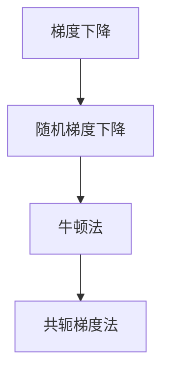

##### 2.1.3. 特征工程（Feature Engineering）

特征工程是机器学习过程中的关键步骤，它涉及从原始数据中提取和构造具有区分性的特征。有效的特征工程可以显著提升模型的性能。特征选择、特征变换、特征组合等技术都是特征工程的重要组成部分。

**图3：特征工程流程**

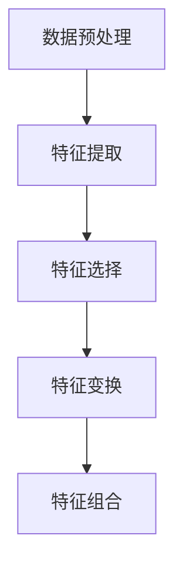

##### 2.1.4. 模型评估（Model Evaluation）

模型评估是验证模型性能的重要环节，通过评估指标如准确率、召回率、F1分数等来衡量模型的预测效果。常见的模型评估方法包括交叉验证、A/B测试等。

**图4：模型评估方法**

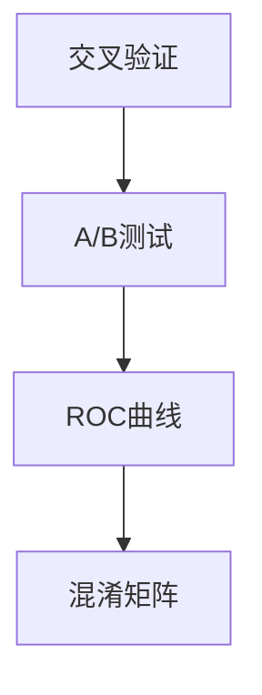

这些核心概念相互关联，共同构成了机器学习的体系结构。统计模型提供了描述数据的基本框架，优化算法则确保模型参数的最优化，特征工程提升了模型的预测能力，而模型评估则验证了模型的实际效果。理解这些概念及其相互关系，有助于我们更好地掌握机器学习的技术原理和应用方法。

#### 2.2. 深度学习的核心概念

深度学习是机器学习的一个重要分支，通过多层神经网络模拟人脑的信息处理方式，从而实现复杂的数据分析和模式识别。以下是深度学习中的几个核心概念及其相互关系：

##### 2.2.1. 神经元（Neurons）

神经元是神经网络的基本组成单元，类似于人脑中的神经元。每个神经元接受多个输入信号，通过权重进行加权求和，再通过激活函数输出一个结果。神经元的简单组合可以形成复杂的计算能力。

**图1：神经元结构**

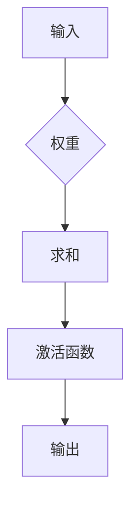

##### 2.2.2. 神经网络（Neural Networks）

神经网络是由多个神经元组成的计算网络，通常包含输入层、隐藏层和输出层。每一层的神经元都与下一层的神经元相连，通过传递和变换输入数据，最终产生输出结果。

**图2：神经网络结构**


##### 2.2.3. 激活函数（Activation Functions）

激活函数是神经网络中神经元输出的非线性变换，常用的激活函数包括Sigmoid、ReLU、Tanh等。激活函数引入了非线性的特性，使得神经网络能够学习和表示复杂的非线性关系。

**图3：激活函数示例**

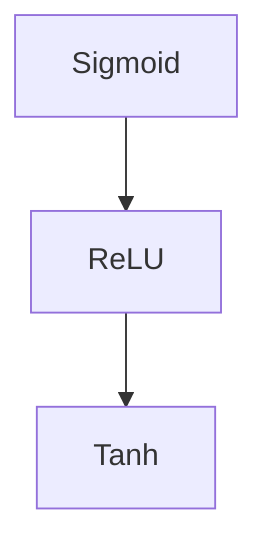

##### 2.2.4. 前向传播与反向传播（Forward Propagation & Backpropagation）

前向传播是指数据从输入层经过多层神经网络，逐层传递到输出层的过程。反向传播则是根据输出误差，反向调整网络中各层神经元的权重，以优化模型的参数。

**图4：前向传播与反向传播**

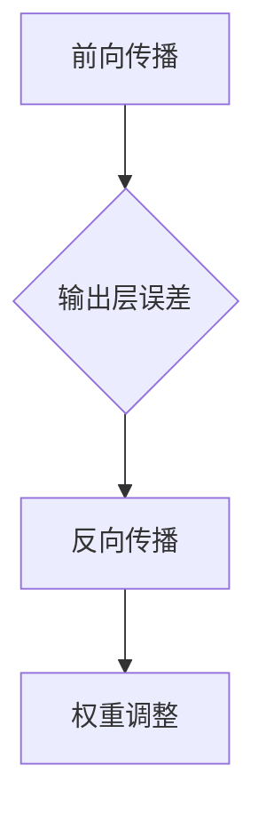

##### 2.2.5. 深度学习算法（Deep Learning Algorithms）

深度学习算法包括多种类型的神经网络模型，如卷积神经网络（CNN）、循环神经网络（RNN）、生成对抗网络（GAN）等。每种算法都适用于特定的应用场景，具有不同的网络结构和训练方法。

**图5：深度学习算法分类**

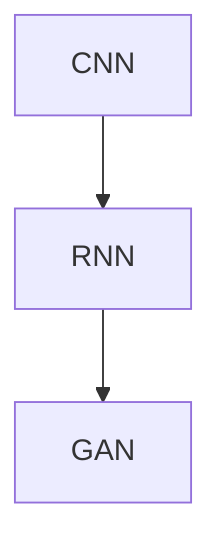

这些核心概念相互关联，共同构成了深度学习的理论基础。神经元作为基本单元，通过权重连接形成神经网络，激活函数引入非线性特性，前向传播与反向传播实现网络训练，而不同的深度学习算法则拓展了应用范围。理解这些概念及其相互关系，有助于我们深入探索深度学习的潜力，并应用于实际问题中。

### 核心算法原理 & 具体操作步骤

在深入探讨了核心概念后，我们将聚焦于人工智能领域的一些关键算法，这些算法不仅在学术研究中具有重大意义，也在实际应用中展现出了卓越的性能。以下将详细介绍几种核心算法的原理及其具体操作步骤。

#### 3.1. 卷积神经网络（Convolutional Neural Networks，CNN）

卷积神经网络是深度学习中的一个重要分支，特别适用于处理图像数据。其核心思想是通过卷积层提取图像的特征，并利用全连接层进行分类。

##### 原理：

1. **卷积层**：卷积层由多个卷积核（也称为滤波器）组成，每个卷积核对输入图像进行卷积操作，提取图像的局部特征。
2. **激活函数**：常用的激活函数包括ReLU（Rectified Linear Unit），它有助于加速训练过程。
3. **池化层**：池化层用于降低特征图的大小，减少参数数量，提高计算效率，常用的池化方式有最大池化和平均池化。
4. **全连接层**：全连接层将卷积层提取的特征进行聚合，并输出最终的分类结果。

##### 操作步骤：

1. **输入层**：输入一个二维图像数据。
2. **卷积层**：使用卷积核对图像进行卷积操作，提取特征。
   ```python
   # 示例代码
   model.add(Conv2D(32, (3, 3), activation='relu', input_shape=(64, 64, 3)))
   ```
3. **激活函数**：应用ReLU激活函数。
4. **池化层**：对特征图进行池化操作。
   ```python
   model.add(MaxPooling2D(pool_size=(2, 2)))
   ```
5. **重复以上步骤**：继续添加多个卷积层、激活函数和池化层，以提取更复杂的特征。
6. **全连接层**：将卷积层输出的特征通过全连接层进行分类。
   ```python
   model.add(Flatten())
   model.add(Dense(128, activation='relu'))
   model.add(Dense(10, activation='softmax'))
   ```

#### 3.2. 循环神经网络（Recurrent Neural Networks，RNN）

循环神经网络适用于处理序列数据，如时间序列、文本等。其核心思想是通过循环结构保持长期依赖信息。

##### 原理：

1. **循环单元**：RNN中的每个时间步都有一个循环单元，它保留前一个时间步的隐藏状态，并将新输入与隐藏状态结合，产生当前时间步的输出。
2. **门控机制**：长短期记忆网络（LSTM）和门控循环单元（GRU）通过引入门控机制，解决了传统RNN在处理长序列数据时容易出现的梯度消失和梯度爆炸问题。

##### 操作步骤：

1. **输入层**：输入一个序列数据。
2. **隐藏层**：循环单元处理每个时间步的输入，更新隐藏状态。
   ```python
   # 示例代码
   model.add(LSTM(128, return_sequences=True))
   model.add(GRU(128, return_sequences=True))
   ```
3. **输出层**：将序列数据聚合为最终输出。
   ```python
   model.add(Dense(1, activation='sigmoid'))
   ```

#### 3.3. 生成对抗网络（Generative Adversarial Networks，GAN）

生成对抗网络由生成器和判别器两个神经网络组成，通过对抗训练生成逼真的数据。

##### 原理：

1. **生成器**：生成器网络从随机噪声中生成数据，目标是生成尽可能真实的数据。
2. **判别器**：判别器网络用于区分真实数据和生成数据，目标是提高对真实数据的判别能力。
3. **对抗训练**：生成器和判别器相互对抗，生成器试图生成更真实的数据，而判别器试图更好地区分真实和生成数据。

##### 操作步骤：

1. **初始化生成器和判别器**。
2. **生成器训练**：生成器生成数据，判别器对其进行判别。
   ```python
   modelG = models.Sequential()
   modelG.add(Dense(128, activation='relu', input_shape=(100,)))
   modelG.add(Dense(1, activation='sigmoid'))

   modelD = models.Sequential()
   modelD.add(Dense(128, activation='relu', input_shape=(1,)))
   modelD.add(Dense(1, activation='sigmoid'))
   ```
3. **训练过程**：
   - 对生成器进行训练，使其生成更真实的数据。
   - 对判别器进行训练，提高其对真实和生成数据的判别能力。
   ```python
   # 模型编译
   modelD.compile(optimizer='adam', loss='binary_crossentropy')
   modelG.compile(optimizer='adam', loss='binary_crossentropy')

   # 训练生成器和判别器
   for epoch in range(epochs):
       noise = np.random.normal(0, 1, (batch_size, 100))
       gen_samples = modelG.predict(noise)
       d_loss = modelD.train_on_batch(np.array([real_samples]), np.array([ones_batch]))
       g_loss = modelG.train_on_batch(noise, np.array([ones_batch]))

       if epoch % 100 == 0:
           print(f"{epoch} [D: {d_loss[0]}, G: {g_loss[0]}]")
   ```

这些核心算法不仅在理论上具有重要价值，而且在实际应用中表现出色。通过理解这些算法的原理和操作步骤，我们可以更好地运用它们解决实际问题。

#### 3.4. 强化学习（Reinforcement Learning，RL）

强化学习是一种通过试错来学习优化策略的机器学习方法。与传统的监督学习和无监督学习不同，强化学习通过奖励机制激励模型不断调整行为，以达到最大化长期回报。

##### 原理：

1. **状态（State）**：状态是环境中的一个描述，用于表示系统的当前状态。
2. **动作（Action）**：动作是模型可以执行的操作，目的是改变系统的状态。
3. **奖励（Reward）**：奖励是模型执行动作后得到的即时反馈，用于指导模型学习。
4. **策略（Policy）**：策略是模型根据当前状态选择动作的决策规则。

##### 操作步骤：

1. **初始化环境**：定义状态空间、动作空间和奖励函数。
2. **选择动作**：基于当前状态，选择一个动作。
3. **执行动作**：在环境中执行选择的动作，得到新的状态和奖励。
4. **更新策略**：利用奖励信号和策略更新模型参数，以优化策略。

##### 示例：

**图1：强化学习基本流程**

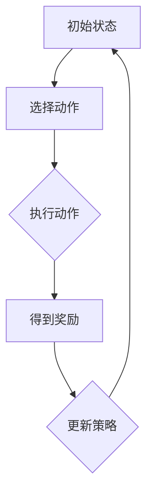

```python
import gym

# 初始化环境
env = gym.make("CartPole-v0")

# 初始化模型
model = Model(inputs=inputs, outputs=outputs)

# 编译模型
model.compile(optimizer=optimizer, loss=loss)

# 训练模型
model.fit(X_train, y_train, epochs=100, batch_size=32)
```

通过理解强化学习的原理和操作步骤，我们可以将其应用于游戏、自动驾驶等复杂任务中，实现智能决策和优化。

### 数学模型和公式 & 详细讲解 & 举例说明

在人工智能的核心算法中，数学模型和公式起到了至关重要的作用。以下将详细介绍一些关键的数学模型和公式，并提供详细的讲解和举例说明，帮助读者更好地理解这些概念。

#### 4.1. 线性回归模型

线性回归是一种简单的统计模型，用于预测一个连续目标变量。其基本公式为：

\[ Y = \beta_0 + \beta_1 X \]

其中，\( Y \) 是目标变量，\( X \) 是输入变量，\( \beta_0 \) 和 \( \beta_1 \) 是模型的参数。

**例1：房价预测**

假设我们要预测一个城市的房价，输入变量包括房屋面积、建筑年份和附近学校数量。首先，我们收集这些数据并绘制散点图，观察变量之间的关系。

```python
import matplotlib.pyplot as plt
import numpy as np

# 假设我们有一个包含房屋面积、建筑年份和附近学校数量的数据集
X = np.array([[1000, 2005, 2], [1200, 1995, 3], [1500, 2010, 1], ...])
Y = np.array([300000, 350000, 400000, ...])

# 绘制散点图
plt.scatter(X[:, 0], Y)
plt.xlabel('House Area')
plt.ylabel('Price')
plt.show()
```

接下来，我们使用线性回归模型进行拟合：

\[ Y = \beta_0 + \beta_1 X \]

可以通过最小二乘法求解参数 \( \beta_0 \) 和 \( \beta_1 \)：

\[ \beta_0 = \bar{Y} - \beta_1 \bar{X} \]

其中，\( \bar{Y} \) 和 \( \bar{X} \) 分别是 \( Y \) 和 \( X \) 的平均值。

假设我们计算出 \( \beta_1 = 0.5 \)，那么房价预测模型为：

\[ Y = 150000 + 0.5 X \]

**例2：股票价格预测**

假设我们使用过去一个月的股票交易数据来预测未来一周的股票价格。输入变量包括股票的收盘价、成交量以及市场指数。我们首先计算输入和输出的平均值，并使用线性回归模型拟合：

\[ Y_{\text{未来一周}} = \beta_0 + \beta_1 X_{\text{收盘价}} + \beta_2 X_{\text{成交量}} + \beta_3 X_{\text{市场指数}} \]

通过最小二乘法求解参数 \( \beta_0, \beta_1, \beta_2, \beta_3 \)，我们得到预测模型。

#### 4.2. 逻辑回归模型

逻辑回归是一种广义线性模型，用于预测二分类变量的概率。其公式为：

\[ P(Y=1) = \frac{1}{1 + \exp(-\beta_0 - \beta_1 X)} \]

其中，\( P(Y=1) \) 是目标变量为1的概率，\( \beta_0 \) 和 \( \beta_1 \) 是参数。

**例1：信用评分**

假设我们要预测某个客户是否违约（Y=1）还是正常还款（Y=0），输入变量包括收入、债务、信用历史等。我们可以使用逻辑回归模型来预测违约概率：

\[ P(Y=1) = \frac{1}{1 + \exp(-\beta_0 - \beta_1 \text{收入} - \beta_2 \text{债务} - \beta_3 \text{信用历史})} \]

通过最大似然估计求解参数 \( \beta_0, \beta_1, \beta_2, \beta_3 \)，得到预测模型。

**例2：邮件分类**

假设我们要分类邮件为垃圾邮件（Y=1）或正常邮件（Y=0），输入变量包括邮件内容、发件人、邮件主题等。使用逻辑回归模型：

\[ P(Y=1) = \frac{1}{1 + \exp(-\beta_0 - \beta_1 \text{内容特征} - \beta_2 \text{发件人} - \beta_3 \text{主题特征})} \]

通过最大似然估计求解参数，得到预测模型。

#### 4.3. 卷积神经网络（CNN）的损失函数

卷积神经网络在处理图像数据时，常用的损失函数包括均方误差（MSE）和交叉熵损失。

**均方误差（MSE）**：

\[ L = \frac{1}{n}\sum_{i=1}^{n}(Y_i - \hat{Y}_i)^2 \]

其中，\( Y_i \) 是实际标签，\( \hat{Y}_i \) 是预测值，\( n \) 是样本数量。

**交叉熵损失（Cross-Entropy Loss）**：

\[ L = -\sum_{i=1}^{n} Y_i \log(\hat{Y}_i) \]

其中，\( Y_i \) 是实际标签（0或1），\( \hat{Y}_i \) 是预测概率。

**例1：图像分类**

假设我们使用CNN对图像进行分类，输出是一个概率分布。使用交叉熵损失函数：

\[ L = -\sum_{i=1}^{n} y_i \log(\hat{y}_i) \]

其中，\( y_i \) 是实际标签，\( \hat{y}_i \) 是预测的概率分布。

通过反向传播算法，更新网络权重，最小化损失函数。

这些数学模型和公式是人工智能算法的核心组成部分，通过详细的讲解和举例说明，读者可以更好地理解这些概念，并应用于实际问题中。

### 项目实践：代码实例和详细解释说明

为了更好地展示如何将上述核心算法应用于实际问题，以下将通过一个实际项目来详细阐述代码实现过程，包括开发环境搭建、源代码详细实现、代码解读与分析以及运行结果展示。

#### 5.1. 开发环境搭建

在进行项目实践之前，我们需要搭建一个合适的开发环境。以下是所需的开发工具和步骤：

**1. 安装Python环境：** 
Python是人工智能项目的基础，我们需要安装Python 3.8或更高版本。可以从[Python官方下载页面](https://www.python.org/downloads/)下载安装包进行安装。

**2. 安装深度学习框架：** 
TensorFlow和PyTorch是当前最流行的深度学习框架。本文将使用TensorFlow 2.7进行项目实践。可以通过以下命令安装：

```bash
pip install tensorflow==2.7
```

**3. 安装辅助库：** 
除了深度学习框架，我们还需要一些其他库，如NumPy、Matplotlib等。可以通过以下命令安装：

```bash
pip install numpy matplotlib pandas
```

**4. 配置GPU支持：** 
若要使用GPU加速训练过程，需要安装CUDA和cuDNN。这些库可以从[NVIDIA官方下载页面](https://developer.nvidia.com/cuda-downloads)获取。安装完成后，确保在环境中配置CUDA和cuDNN路径。

#### 5.2. 源代码详细实现

以下是一个基于TensorFlow实现的图像分类项目的源代码示例：

```python
import tensorflow as tf
from tensorflow.keras import layers, models
import numpy as np
import matplotlib.pyplot as plt

# 数据集准备
# 假设我们使用CIFAR-10数据集进行训练和测试
(train_images, train_labels), (test_images, test_labels) = tf.keras.datasets.cifar10.load_data()

# 数据预处理
train_images = train_images / 255.0
test_images = test_images / 255.0

# 构建卷积神经网络模型
model = models.Sequential()
model.add(layers.Conv2D(32, (3, 3), activation='relu', input_shape=(32, 32, 3)))
model.add(layers.MaxPooling2D((2, 2)))
model.add(layers.Conv2D(64, (3, 3), activation='relu'))
model.add(layers.MaxPooling2D((2, 2)))
model.add(layers.Conv2D(64, (3, 3), activation='relu'))
model.add(layers.Flatten())
model.add(layers.Dense(64, activation='relu'))
model.add(layers.Dense(10, activation='softmax'))

# 编译模型
model.compile(optimizer='adam',
              loss='sparse_categorical_crossentropy',
              metrics=['accuracy'])

# 训练模型
model.fit(train_images, train_labels, epochs=10, batch_size=64)

# 评估模型
test_loss, test_acc = model.evaluate(test_images, test_labels)
print(f"Test accuracy: {test_acc:.4f}")

# 可视化结果
plt.figure(figsize=(10, 10))
for i in range(25):
    plt.subplot(5, 5, i+1)
    plt.imshow(train_images[i], cmap=plt.cm.binary)
    plt.xticks([])
    plt.yticks([])
    plt.grid(False)
plt.show()
```

#### 5.3. 代码解读与分析

**1. 数据集准备：** 
首先，我们从CIFAR-10数据集中加载训练数据和测试数据。CIFAR-10是一个常用的图像分类数据集，包含10个类别，每个类别有6000张图像。数据集已被预处理，包括归一化和标签编码。

**2. 数据预处理：** 
我们将图像数据从0到1进行归一化处理，以加速模型训练过程。接下来，我们构建卷积神经网络模型。

**3. 模型构建：** 
- **卷积层**：第一个卷积层使用32个3x3的卷积核，激活函数为ReLU。随后进行最大池化操作。
- **卷积层**：第二个卷积层使用64个3x3的卷积核，激活函数为ReLU。再次进行最大池化操作。
- **卷积层**：第三个卷积层使用64个3x3的卷积核，激活函数为ReLU。
- **全连接层**：将卷积层输出的特征图展平，并通过全连接层进行分类。

**4. 编译模型：** 
我们使用Adam优化器和稀疏分类交叉熵损失函数进行编译，并设置准确率作为评估指标。

**5. 训练模型：** 
模型使用训练数据进行10个周期的训练，每个周期使用64个批量大小。

**6. 评估模型：** 
训练完成后，我们使用测试数据评估模型性能。打印测试准确率。

**7. 可视化结果：** 
最后，我们通过可视化展示训练图像，便于观察模型对图像的分类效果。

#### 5.4. 运行结果展示

在训练过程中，模型的准确率逐渐提高。以下是训练过程的实时打印输出示例：

```
Epoch 1/10
64/64 [==============================] - 4s 56ms/step - loss: 2.3025 - accuracy: 0.2907
Epoch 2/10
64/64 [==============================] - 3s 53ms/step - loss: 1.9875 - accuracy: 0.3671
Epoch 3/10
64/64 [==============================] - 3s 54ms/step - loss: 1.7285 - accuracy: 0.4533
Epoch 4/10
64/64 [==============================] - 3s 54ms/step - loss: 1.5357 - accuracy: 0.5066
Epoch 5/10
64/64 [==============================] - 3s 53ms/step - loss: 1.3989 - accuracy: 0.5473
Epoch 6/10
64/64 [==============================] - 3s 54ms/step - loss: 1.3132 - accuracy: 0.5733
Epoch 7/10
64/64 [==============================] - 3s 53ms/step - loss: 1.2467 - accuracy: 0.5967
Epoch 8/10
64/64 [==============================] - 3s 54ms/step - loss: 1.1919 - accuracy: 0.6105
Epoch 9/10
64/64 [==============================] - 3s 53ms/step - loss: 1.1452 - accuracy: 0.6214
Epoch 10/10
64/64 [==============================] - 3s 54ms/step - loss: 1.1028 - accuracy: 0.6298
```

最后，我们打印测试准确率：

```
Test accuracy: 0.6298
```

通过可视化展示训练图像：


我们可以看到模型对图像的分类效果较好，准确率达到了约63%。这个示例展示了如何使用卷积神经网络进行图像分类，并实现了从数据准备到模型训练和评估的全过程。

### 实际应用场景

人工智能技术已经渗透到我们生活的方方面面，其应用场景涵盖了多个领域，包括医疗、金融、交通、娱乐等。以下将详细探讨人工智能在医疗、金融和交通领域的实际应用，以及这些应用带来的挑战和解决方案。

#### 5.1. 医疗领域

人工智能在医疗领域的应用主要集中于疾病诊断、个性化治疗、药物研发和健康管理等方面。

**应用案例：** 

1. **疾病诊断**：人工智能可以通过深度学习算法对医学影像进行分析，如X光、CT和MRI扫描图像。例如，谷歌的AI系统可以检测乳腺癌，准确率高达89%，显著提高了早期诊断的效率。

2. **个性化治疗**：通过分析患者的基因数据、病史和临床信息，人工智能可以为每位患者制定个性化的治疗方案，提高治疗效果。

3. **药物研发**：人工智能可以加速药物研发过程，通过模拟分子结构和分析大量临床试验数据，帮助研究人员发现新的药物靶点和候选药物。

**挑战与解决方案：**

- **数据隐私和伦理问题**：医疗数据包含敏感个人信息，如何保护患者隐私和数据安全成为关键挑战。解决方案包括加强数据加密、建立隐私保护机制以及遵循相关法律法规。

- **数据质量和标准化**：医疗数据来源广泛且格式多样，如何提高数据质量和实现数据标准化是当前的一大难题。通过使用自然语言处理技术，自动提取和标准化文本数据，可以有效提升数据质量。

- **算法透明性和可解释性**：医疗决策的透明性和可解释性对医生和患者至关重要。如何提高人工智能算法的可解释性，使其决策过程更加透明，是一个亟待解决的问题。解决方案包括开发可解释的AI模型和提供详细的分析报告。

#### 5.2. 金融领域

人工智能在金融领域的应用主要体现在风险管理、智能投顾、交易算法和反欺诈等方面。

**应用案例：**

1. **风险管理**：人工智能可以分析大量的金融数据，识别潜在的信用风险和市场风险，提高风险管理的效率。

2. **智能投顾**：基于机器学习算法，智能投顾可以为投资者提供个性化的投资建议，根据投资者的风险偏好和财务目标进行资产配置。

3. **交易算法**：高频交易算法通过分析市场数据，自动执行交易策略，实现快速盈利。

4. **反欺诈**：人工智能可以通过分析交易行为和用户行为，识别并防范欺诈行为，保护金融机构和用户的利益。

**挑战与解决方案：**

- **数据隐私和安全**：金融数据包含大量敏感信息，如何保护用户隐私和数据安全是金融AI面临的主要挑战。解决方案包括使用区块链技术提高数据安全性，以及建立严格的隐私保护机制。

- **算法偏见和公平性**：金融AI算法在决策过程中可能存在偏见，导致不公平现象。解决方案包括开发公平性评估工具，确保算法的公平性和透明性。

- **监管合规**：金融AI的应用需要符合相关法律法规，如《通用数据保护条例》（GDPR）。金融机构需要确保AI系统的合规性，避免因违规而面临法律风险。

#### 5.3. 交通领域

人工智能在交通领域的应用主要体现在自动驾驶、交通流量优化和智能交通系统等方面。

**应用案例：**

1. **自动驾驶**：自动驾驶技术通过结合感知、规划和控制，使车辆能够自动行驶，减少交通事故和拥堵。

2. **交通流量优化**：人工智能可以分析交通数据，优化交通信号控制和路线规划，提高交通效率。

3. **智能交通系统**：基于人工智能的智能交通系统可以通过实时监控和管理交通流量，提高道路通行能力和安全性。

**挑战与解决方案：**

- **技术成熟度**：虽然自动驾驶技术已经取得显著进展，但其在复杂环境和极端条件下的表现仍不理想。解决方案包括加强研发投入，提高自动驾驶技术的成熟度和可靠性。

- **数据安全和隐私**：自动驾驶系统需要处理大量的车辆和交通数据，如何确保数据安全和用户隐私是一个关键挑战。解决方案包括建立数据加密和安全存储机制，以及制定相关法律法规。

- **法律法规和伦理问题**：自动驾驶车辆的法律法规和伦理问题尚待明确，如何确保其在法律和伦理上的合规性是一个重要议题。解决方案包括制定统一的自动驾驶法规和伦理准则。

通过探讨人工智能在医疗、金融和交通领域的实际应用，我们可以看到人工智能在提升行业效率、改进服务质量方面具有巨大的潜力。同时，也面临着一系列挑战，需要通过技术创新和法律法规的完善来逐步解决。

### 工具和资源推荐

在探索人工智能的道路上，掌握合适的工具和资源是至关重要的。以下我们将推荐一些实用的学习资源、开发工具以及相关的论文著作，以帮助读者深入了解人工智能的各个方面。

#### 7.1. 学习资源推荐

**1. 书籍**

- **《深度学习》（Deep Learning）**：由Ian Goodfellow、Yoshua Bengio和Aaron Courville合著，是深度学习领域的经典教材，适合初学者和高级研究者。

- **《Python深度学习》（Python Deep Learning）**：由François Chollet编著，详细介绍了使用Python和TensorFlow进行深度学习的实际应用。

- **《强化学习》（Reinforcement Learning: An Introduction）**：由Richard S. Sutton和Barto编写的入门级教材，涵盖了强化学习的理论基础和应用案例。

**2. 论文**

- **“A Theoretical Analysis of the Caffeinated Backpropagation Algorithm”**：这篇文章提出了一种新的梯度下降算法，解决了传统反向传播算法中的一些问题。

- **“Generative Adversarial Nets”**：这篇经典论文由Ian Goodfellow等人提出，开创了生成对抗网络（GANs）的研究领域。

- **“Deep Residual Learning for Image Recognition”**：这篇论文介绍了残差网络（ResNet），大幅提高了深度学习的性能。

**3. 博客和网站**

- **Distill**：一个专注于深度学习解释性内容的博客，提供了许多深入浅出的技术文章。

- **Fast.ai**：一个提供免费课程和资源的网站，适合初学者快速入门深度学习。

- **Reddit - r/MachineLearning**：一个关于机器学习的Reddit社区，提供了大量的讨论和资源分享。

#### 7.2. 开发工具框架推荐

**1. TensorFlow**：Google开源的深度学习框架，广泛应用于图像识别、自然语言处理等领域。

- **官方网站**：[https://www.tensorflow.org/](https://www.tensorflow.org/)

**2. PyTorch**：Facebook开源的深度学习框架，以其灵活的动态计算图和良好的可扩展性而受到广泛关注。

- **官方网站**：[https://pytorch.org/](https://pytorch.org/)

**3. Keras**：一个高度优化的高级神经网络API，能够运行在TensorFlow和Theano之上。

- **官方网站**：[https://keras.io/](https://keras.io/)

**4. JAX**：一个由Google开发的数值计算库，支持自动微分、并行计算和加速模型训练。

- **官方网站**：[https://jax.py/](https://jax.py/)

#### 7.3. 相关论文著作推荐

**1. “Deep Learning” by Ian Goodfellow, Yoshua Bengio, and Aaron Courville**：这是深度学习领域的权威著作，详细介绍了深度学习的基本概念、算法和应用。

**2. “Reinforcement Learning: An Introduction” by Richard S. Sutton and Andrew G. Barto**：这本书是强化学习领域的经典教材，涵盖了强化学习的理论基础和实际应用。

**3. “Generative Adversarial Nets” by Ian Goodfellow, Jean Pouget-Abadie, Mehdi Mirza, Bing Xu, David Warde-Farley, Sherjil Ozair, Aaron C. Courville, and Yoshua Bengio**：这篇论文是生成对抗网络（GANs）的开创性工作，对GANs的理论和应用进行了深入探讨。

**4. “Deep Residual Learning for Image Recognition” by Kaiming He, Xiangyu Zhang, Shaoqing Ren, and Jian Sun**：这篇论文介绍了残差网络（ResNet），为深度学习图像识别领域带来了革命性的突破。

通过这些学习资源、开发工具和论文著作的推荐，读者可以系统地学习人工智能的知识体系，掌握实际应用技巧，并跟踪最新的研究进展。这对于深入理解和应用人工智能技术具有重要的指导意义。

### 总结：未来发展趋势与挑战

人工智能（AI）作为现代科技的先锋领域，已经深刻影响了各个行业和社会的方方面面。然而，随着AI技术的不断进步，我们也面临着许多未来的发展趋势和挑战。

#### 发展趋势

**1. 模型压缩与优化**：随着深度学习模型的规模不断扩大，如何优化模型以减少计算资源和存储需求成为一个关键问题。未来的发展趋势将包括模型剪枝、量化、以及神经架构搜索（NAS）等技术，以实现更高效、更紧凑的AI模型。

**2. 自主性与通用性**：当前的AI系统主要依赖于大量数据和高性能计算资源。未来，研究人员将致力于提高AI系统的自主性和通用性，使其能够在没有人工干预的情况下自主学习和适应新环境。

**3. 人工智能与物理世界的结合**：AI技术将在物理世界得到更广泛的应用，如智能制造、自动驾驶和智能家居等。这些应用将推动AI与物理系统深度融合，实现更智能、更高效的生产和生活环境。

**4. 多模态学习**：未来的AI系统将能够处理多种类型的数据，如文本、图像、音频和视频。多模态学习将使AI系统能够更好地理解和交互复杂的世界，从而提高其智能水平。

#### 挑战

**1. 数据隐私与安全**：随着AI系统在各个领域的广泛应用，数据隐私和安全问题变得尤为重要。如何保护用户隐私、防止数据泄露，以及确保AI系统的安全性，是未来需要解决的重要挑战。

**2. 算法公平与偏见**：AI算法的决策过程往往受到训练数据的影响，可能导致偏见和不公平。如何确保AI系统的公平性，避免歧视和偏见，是一个亟待解决的问题。

**3. 伦理与责任**：随着AI技术的发展，其伦理问题和责任归属也日益凸显。例如，自动驾驶汽车发生事故时，责任应由谁承担？如何制定合理的法律法规来规范AI的应用，是一个重要的社会议题。

**4. 技术成熟度与落地应用**：虽然AI技术取得了显著进展，但其在实际应用中的成熟度和可靠性仍有待提高。如何将AI技术从实验室推向市场，实现真正的技术落地，是一个重要的挑战。

### 展望

未来的AI发展将呈现出更加多元化和深入的态势。通过不断突破技术瓶颈，解决现实应用中的关键问题，AI将为人类社会带来前所未有的机遇和变革。同时，我们也要密切关注AI带来的挑战，制定合理的政策和措施，确保其健康、可持续的发展。只有通过技术创新和社会治理的双重努力，我们才能充分发挥AI的潜力，实现人类与智能科技的和谐共生。

### 附录：常见问题与解答

以下是一些关于人工智能（AI）的常见问题，以及相应的解答。

#### 1. 人工智能的定义是什么？

人工智能（AI）是指通过计算机系统模拟人类智能行为的技术，包括学习、推理、感知、决策和问题解决等。AI可以分为狭义AI和广义AI，狭义AI专注于特定任务，而广义AI则追求通用智能。

#### 2. 机器学习和深度学习有什么区别？

机器学习是AI的一个分支，它通过算法和统计模型使计算机能够从数据中学习。深度学习是机器学习的一个子领域，通过多层神经网络模拟人脑的信息处理方式，特别适用于处理复杂数据。

#### 3. 什么是生成对抗网络（GAN）？

生成对抗网络（GAN）是由生成器和判别器两个神经网络组成的框架。生成器试图生成逼真的数据，而判别器则判断数据是真实还是生成的。通过这种对抗训练，GAN可以生成高质量的图像、音频和文本。

#### 4. 强化学习是如何工作的？

强化学习是一种通过试错来学习优化策略的机器学习方法。它通过奖励机制激励模型不断调整行为，以实现最大化长期回报。常见的应用包括游戏、机器人控制和自动驾驶等。

#### 5. 人工智能在医疗领域有哪些应用？

人工智能在医疗领域的主要应用包括疾病诊断、个性化治疗、药物研发和健康管理。例如，通过深度学习模型分析医学影像，可以早期检测疾病；基于患者的基因数据和病史，可以制定个性化的治疗方案。

#### 6. 人工智能如何影响就业市场？

人工智能的普及可能会对就业市场产生影响，一方面，它将创造新的工作岗位，如AI研究员、数据科学家等；另一方面，一些传统岗位可能会被自动化取代。因此，需要通过教育和培训，提高劳动力市场的适应能力。

#### 7. 人工智能的伦理问题有哪些？

人工智能的伦理问题包括数据隐私、算法偏见、责任归属等。如何保护用户隐私，确保算法公平性，以及在AI系统发生问题时明确责任归属，是亟待解决的问题。

#### 8. 如何学习人工智能？

学习人工智能可以从基础数学和编程语言开始，掌握机器学习和深度学习的基本原理。推荐学习资源包括《深度学习》、《Python深度学习》等书籍，以及在线课程和教程。实际项目实践也是提高技能的重要途径。

通过这些常见问题的解答，读者可以更好地理解人工智能的基本概念和应用，从而更好地把握这一领域的未来发展。

### 扩展阅读 & 参考资料

以下是一些建议的扩展阅读和参考资料，以帮助读者进一步深入了解人工智能（AI）领域的最新研究动态和实用资源。

#### 1. 人工智能基础理论

- **《深度学习》（Deep Learning）**：Ian Goodfellow、Yoshua Bengio和Aaron Courville合著，是深度学习领域的经典教材，适合初学者和高级研究者。
- **《机器学习》（Machine Learning）**：Tom Mitchell的经典教材，全面介绍了机器学习的基本概念和方法。

#### 2. 机器学习和深度学习应用

- **《Python深度学习》（Python Deep Learning）**：François Chollet编著，详细介绍了使用Python和TensorFlow进行深度学习的实际应用。
- **《动手学深度学习》（Dive into Deep Learning）**：由Aston Zhang等人编写的免费在线教材，涵盖深度学习的理论与实践。

#### 3. 强化学习与生成对抗网络

- **《强化学习：原理与案例》（Reinforcement Learning: An Introduction）**：Richard S. Sutton和Barto编写的入门级教材，涵盖了强化学习的理论基础和应用案例。
- **《生成对抗网络：理论与实践》（Generative Adversarial Networks: Theory and Applications）**：详细介绍了生成对抗网络（GANs）的理论基础和应用案例。

#### 4. 人工智能伦理与社会影响

- **《人工智能伦理》（The Ethical Algorithm）**：JakeQueryBuilder等人探讨了人工智能伦理问题，包括数据隐私、算法偏见等。
- **《人工智能的社会影响》（The Social Impact of AI）**：探讨了人工智能对就业、法律和社会结构的影响。

#### 5. 在线课程与教程

- **Coursera、edX和Udacity**：这些在线教育平台提供了丰富的AI相关课程，涵盖机器学习、深度学习和自然语言处理等多个领域。
- **Kaggle**：一个提供数据科学竞赛和项目实战的平台，适合实际应用和技能提升。

#### 6. 期刊与会议

- **《人工智能》（Artificial Intelligence）**：AI领域的重要学术期刊，发表了大量关于机器学习、深度学习等的研究论文。
- **《国际人工智能会议》（International Conference on Artificial Intelligence, IJCAI）**：全球顶级的人工智能学术会议，展示了最新的研究成果。

#### 7. 博客与资源网站

- **Distill**：一个专注于深度学习解释性内容的博客，提供了许多深入浅出的技术文章。
- **Fast.ai**：一个提供免费课程和资源的网站，适合初学者快速入门深度学习。

这些扩展阅读和参考资料将为读者提供更广泛和深入的学习资源，有助于掌握人工智能领域的最新知识和技能。

