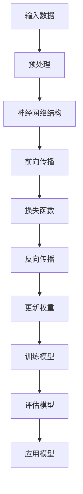

                 

### 文章标题

《Andrej Karpathy：人工智能的未来发展目标》

> **关键词：**人工智能，神经网络，深度学习，未来趋势，研究目标，技术发展，应用场景。

> **摘要：**本文将深入探讨人工智能领域知名专家Andrej Karpathy对于人工智能未来发展的见解和目标。通过对神经网络、深度学习等核心技术的剖析，我们将理解其如何影响人工智能的发展方向，以及在未来可能面临的挑战和机遇。文章旨在为读者提供一个全面的视角，以了解人工智能在未来的发展趋势，以及如何为这一领域的未来发展做好准备。

### 1. 背景介绍

Andrej Karpathy是一位在人工智能领域享有盛誉的研究者和教育者。他是斯坦福大学计算机科学博士，曾在谷歌和OpenAI等多个知名科技公司担任要职，现任斯坦福大学副教授。他的研究领域主要集中在计算机视觉、自然语言处理和深度学习等方面，并在这些领域取得了显著的成就。

近年来，随着深度学习的飞速发展，人工智能技术取得了前所未有的进展。然而，与此同时，人们对于人工智能未来的发展也充满了好奇和期待。Andrej Karpathy作为这一领域的领军人物，他的见解和目标对于理解人工智能的未来发展至关重要。

本文将从以下几个方面展开，首先介绍人工智能的基本概念和发展历程，然后深入探讨Andrej Karpathy提出的人工智能发展目标，接着分析这些目标的核心技术和实现路径，最后探讨人工智能在实际应用场景中的挑战和机遇。

### 2. 核心概念与联系

为了更好地理解人工智能的未来发展目标，我们首先需要了解一些核心概念和技术。

**2.1 人工智能的基本概念**

人工智能（Artificial Intelligence，简称AI）是指由计算机实现的智能系统，它能够感知、思考、学习、决策和行动，以实现特定的任务。人工智能可以分为两大类：弱人工智能和强人工智能。

弱人工智能（Narrow AI）是指能够执行特定任务的智能系统，例如语音识别、图像识别、自然语言处理等。强人工智能（General AI）则是指具有广泛智能能力的智能系统，能够像人类一样理解和解决问题。

**2.2 深度学习**

深度学习（Deep Learning）是人工智能的一个重要分支，它利用多层神经网络（Neural Networks）来模拟人类大脑的神经网络结构，通过训练模型来学习数据特征和模式。深度学习的核心组成部分包括：

- **神经网络（Neural Networks）：**神经网络是由大量神经元（模拟人类大脑中的神经元）组成的人工神经网络，通过调整神经元之间的连接权重来学习数据特征。
- **深度神经网络（Deep Neural Networks）：**深度神经网络是具有多个隐藏层的神经网络，能够提取更高层次的特征表示，从而提高模型的泛化能力。
- **激活函数（Activation Functions）：**激活函数是神经网络中的一个关键组件，它用于决定神经元是否被激活，常用的激活函数包括Sigmoid、ReLU等。
- **优化算法（Optimization Algorithms）：**优化算法用于调整神经网络中的连接权重，以最小化损失函数，常用的优化算法包括梯度下降、随机梯度下降等。

**2.3 神经网络与深度学习的联系**

神经网络是深度学习的基础，深度学习是在神经网络的基础上发展起来的。深度学习通过增加神经网络的层数和神经元数量，以及引入更复杂的激活函数和优化算法，使得神经网络能够更好地学习数据特征和模式。

**2.4 Mermaid 流程图**

为了更好地展示神经网络和深度学习的基本原理和架构，我们可以使用Mermaid流程图来描述。以下是神经网络和深度学习的Mermaid流程图：



在这个流程图中，输入数据经过预处理后输入到神经网络结构中，通过前向传播计算输出，然后计算损失函数，通过反向传播更新权重，循环这个过程直到模型达到预期的性能。最后，评估模型的性能并应用于实际问题。

### 3. 核心算法原理 & 具体操作步骤

在理解了神经网络和深度学习的基本原理之后，我们接下来将深入探讨人工智能的核心算法原理，以及如何通过这些算法实现人工智能的目标。

**3.1 神经网络的基本原理**

神经网络是一种模拟人脑神经元之间连接方式的人工神经网络。它由大量的神经元组成，每个神经元都与其他神经元相连，通过调整这些连接的权重来学习数据特征。

神经网络的训练过程主要包括以下几个步骤：

1. **初始化权重：**随机初始化神经网络中的权重。
2. **前向传播：**输入数据通过神经网络的前向传播路径，经过每个神经元后得到输出。
3. **计算损失：**通过比较实际输出和期望输出，计算损失函数的值，损失函数用于衡量模型的预测误差。
4. **反向传播：**计算损失函数关于每个权重的梯度，并沿反向传播路径更新权重。
5. **优化权重：**使用优化算法（如梯度下降）更新权重，以最小化损失函数。

**3.2 深度学习算法的实现步骤**

深度学习算法是基于神经网络的一种更复杂的学习方法，它通过增加神经网络的层数和神经元数量，以及引入更复杂的激活函数和优化算法，使得神经网络能够更好地学习数据特征。

以下是深度学习算法的实现步骤：

1. **数据预处理：**对输入数据（如图像、文本等）进行预处理，包括归一化、标准化、填充缺失值等操作。
2. **初始化神经网络结构：**确定神经网络的层数、每层的神经元数量、连接方式等。
3. **初始化权重：**随机初始化神经网络中的权重。
4. **前向传播：**输入数据通过神经网络的前向传播路径，经过每个神经元后得到输出。
5. **计算损失：**通过比较实际输出和期望输出，计算损失函数的值。
6. **反向传播：**计算损失函数关于每个权重的梯度，并沿反向传播路径更新权重。
7. **优化权重：**使用优化算法（如梯度下降、随机梯度下降等）更新权重，以最小化损失函数。
8. **评估模型：**使用验证集或测试集评估模型的性能，包括准确率、召回率、F1值等指标。
9. **模型应用：**将训练好的模型应用于实际问题，如图像分类、语音识别、自然语言处理等。

**3.3 具体操作步骤示例**

以下是一个简单的深度学习算法的具体操作步骤示例：

1. **数据预处理：**
   - 将图像数据归一化，使其像素值在0到1之间。
   - 将图像数据转换为灰度图像，以减少数据维度。
   - 对图像数据进行填充，使其尺寸统一。

2. **初始化神经网络结构：**
   - 确定输入层的神经元数量，等于图像数据的维度。
   - 确定隐藏层的神经元数量，可以是输入层神经元数量的倍数。
   - 确定输出层的神经元数量，等于目标类别的数量。

3. **初始化权重：**
   - 随机初始化神经网络中的权重。

4. **前向传播：**
   - 输入图像数据，经过输入层、隐藏层和输出层的处理，得到输出结果。

5. **计算损失：**
   - 计算实际输出和期望输出之间的误差，使用交叉熵损失函数。

6. **反向传播：**
   - 计算损失函数关于每个权重的梯度，并沿反向传播路径更新权重。

7. **优化权重：**
   - 使用梯度下降算法更新权重，以最小化损失函数。

8. **评估模型：**
   - 使用验证集或测试集评估模型的性能。

9. **模型应用：**
   - 将训练好的模型应用于新的图像数据，进行图像分类。

通过以上步骤，我们可以实现一个简单的深度学习模型，用于图像分类任务。当然，在实际应用中，还需要考虑更多的因素，如数据增强、模型调优等。

### 4. 数学模型和公式 & 详细讲解 & 举例说明

在深度学习算法的实现过程中，数学模型和公式起着至关重要的作用。本节将详细介绍深度学习中的数学模型和公式，并给出具体的讲解和举例说明。

**4.1 神经元模型**

神经元模型是神经网络的基本组成部分，它通过计算输入信号和权重的乘积，并加上偏置，然后通过激活函数进行非线性变换，得到输出。

神经元模型的数学表示如下：

$$
\text{output} = \sigma(\sum_{i=1}^{n} w_i x_i + b)
$$

其中，$\sigma$表示激活函数，$w_i$表示输入信号和权重的乘积，$b$表示偏置，$x_i$表示输入信号的值。

常见的激活函数包括Sigmoid函数、ReLU函数和Tanh函数，它们的数学表示如下：

- Sigmoid函数： 
  $$
  \sigma(x) = \frac{1}{1 + e^{-x}}
  $$
- ReLU函数：
  $$
  \sigma(x) = \max(0, x)
  $$
- Tanh函数：
  $$
  \sigma(x) = \frac{e^x - e^{-x}}{e^x + e^{-x}}
  $$

**4.2 损失函数**

损失函数用于衡量模型的预测误差，常用的损失函数包括均方误差（MSE）、交叉熵损失（Cross-Entropy Loss）等。

- 均方误差（MSE）：
  $$
  L = \frac{1}{2} \sum_{i=1}^{n} (y_i - \hat{y}_i)^2
  $$
  其中，$y_i$表示真实值，$\hat{y}_i$表示预测值。

- 交叉熵损失（Cross-Entropy Loss）：
  $$
  L = -\sum_{i=1}^{n} y_i \log(\hat{y}_i)
  $$
  其中，$y_i$表示真实值的概率分布，$\hat{y}_i$表示预测值的概率分布。

**4.3 优化算法**

优化算法用于更新神经网络中的权重，以最小化损失函数。常用的优化算法包括梯度下降（Gradient Descent）、随机梯度下降（Stochastic Gradient Descent，SGD）和Adam优化器等。

- 梯度下降（Gradient Descent）：
  $$
  w_{\text{new}} = w_{\text{current}} - \alpha \cdot \nabla L(w)
  $$
  其中，$w$表示权重，$\alpha$表示学习率，$\nabla L(w)$表示损失函数关于权重的梯度。

- 随机梯度下降（Stochastic Gradient Descent，SGD）：
  $$
  w_{\text{new}} = w_{\text{current}} - \alpha \cdot \nabla L(w; x_i, y_i)
  $$
  其中，$x_i, y_i$表示训练样本。

- Adam优化器：
  $$
  w_{\text{new}} = w_{\text{current}} - \alpha \cdot \frac{m}{\sqrt{v} + \epsilon}
  $$
  其中，$m$表示一阶矩估计，$v$表示二阶矩估计，$\alpha$表示学习率，$\epsilon$表示常数。

**4.4 示例讲解**

假设我们有一个简单的神经网络，包含一个输入层、一个隐藏层和一个输出层。输入层有3个神经元，隐藏层有2个神经元，输出层有2个神经元。激活函数为ReLU函数，损失函数为交叉熵损失函数。

1. **初始化权重和偏置：**
   随机初始化输入层、隐藏层和输出层的权重和偏置。

2. **前向传播：**
   输入一个3维的输入向量$x$，通过输入层、隐藏层和输出层的计算，得到输出向量$y$。

3. **计算损失：**
   使用交叉熵损失函数计算实际输出和预测输出之间的损失。

4. **反向传播：**
   计算损失函数关于每个权重的梯度，并沿反向传播路径更新权重。

5. **优化权重：**
   使用Adam优化器更新权重。

具体计算过程如下：

1. **初始化权重和偏置：**
   $$
   w_{1,1} = 0.1, w_{1,2} = 0.2, w_{1,3} = 0.3, w_{2,1} = 0.4, w_{2,2} = 0.5, b_1 = 0.1, b_2 = 0.2
   $$

2. **前向传播：**
   $$
   h_1 = \sigma(w_{1,1}x_1 + w_{1,2}x_2 + w_{1,3}x_3 + b_1) = \max(0, 0.1 \cdot x_1 + 0.2 \cdot x_2 + 0.3 \cdot x_3 + 0.1)
   $$
   $$
   h_2 = \sigma(w_{2,1}h_1 + w_{2,2}h_2 + b_2) = \max(0, 0.4 \cdot h_1 + 0.5 \cdot h_2 + 0.2)
   $$
   $$
   y_1 = \sigma(w_{3,1}h_1 + w_{3,2}h_2 + b_2) = \max(0, 0.1 \cdot h_1 + 0.2 \cdot h_2 + 0.1)
   $$
   $$
   y_2 = \sigma(w_{4,1}h_1 + w_{4,2}h_2 + b_2) = \max(0, 0.3 \cdot h_1 + 0.4 \cdot h_2 + 0.2)
   $$

3. **计算损失：**
   $$
   L = -\sum_{i=1}^{2} y_i \log(y_i)
   $$

4. **反向传播：**
   $$
   \nabla_{w_{3,1}} L = \frac{\partial L}{\partial w_{3,1}} = \frac{\partial L}{\partial y_1} \cdot \frac{\partial y_1}{\partial w_{3,1}} = (y_1 - 1) \cdot \frac{\partial \sigma(h_1)}{\partial h_1}
   $$
   $$
   \nabla_{w_{3,2}} L = \frac{\partial L}{\partial w_{3,2}} = \frac{\partial L}{\partial y_1} \cdot \frac{\partial y_1}{\partial w_{3,2}} = (y_1 - 1) \cdot \frac{\partial \sigma(h_2)}{\partial h_2}
   $$
   $$
   \nabla_{b_1} L = \frac{\partial L}{\partial b_1} = (y_1 - 1) \cdot \frac{\partial \sigma(h_1)}{\partial h_1}
   $$
   $$
   \nabla_{w_{4,1}} L = \frac{\partial L}{\partial w_{4,1}} = \frac{\partial L}{\partial y_2} \cdot \frac{\partial y_2}{\partial w_{4,1}} = (y_2 - 1) \cdot \frac{\partial \sigma(h_1)}{\partial h_1}
   $$
   $$
   \nabla_{w_{4,2}} L = \frac{\partial L}{\partial w_{4,2}} = \frac{\partial L}{\partial y_2} \cdot \frac{\partial y_2}{\partial w_{4,2}} = (y_2 - 1) \cdot \frac{\partial \sigma(h_2)}{\partial h_2}
   $$
   $$
   \nabla_{b_2} L = \frac{\partial L}{\partial b_2} = (y_2 - 1) \cdot \frac{\partial \sigma(h_2)}{\partial h_2}
   $$

5. **优化权重：**
   $$
   w_{3,1} = w_{3,1} - \alpha \cdot \nabla_{w_{3,1}} L
   $$
   $$
   w_{3,2} = w_{3,2} - \alpha \cdot \nabla_{w_{3,2}} L
   $$
   $$
   b_1 = b_1 - \alpha \cdot \nabla_{b_1} L
   $$
   $$
   w_{4,1} = w_{4,1} - \alpha \cdot \nabla_{w_{4,1}} L
   $$
   $$
   w_{4,2} = w_{4,2} - \alpha \cdot \nabla_{w_{4,2}} L
   $$
   $$
   b_2 = b_2 - \alpha \cdot \nabla_{b_2} L
   $$

通过以上步骤，我们可以实现一个简单的神经网络的前向传播和反向传播过程，并使用Adam优化器更新权重。在实际应用中，还需要考虑更多的因素，如批量归一化、dropout等。

### 5. 项目实践：代码实例和详细解释说明

在本节中，我们将通过一个具体的代码实例，来展示如何实现一个简单的神经网络，并进行训练和评估。我们将使用Python编程语言和TensorFlow框架，这是目前最流行的深度学习框架之一。

**5.1 开发环境搭建**

首先，我们需要搭建一个适合深度学习项目开发的环境。以下是搭建开发环境的基本步骤：

1. 安装Python：
   - 建议安装Python 3.7或更高版本，可以通过Python官网（https://www.python.org/downloads/）下载。
   - 安装完成后，打开命令行窗口，输入`python --version`检查安装是否成功。

2. 安装TensorFlow：
   - 打开命令行窗口，输入以下命令安装TensorFlow：
     ```
     pip install tensorflow
     ```

3. 安装必要的依赖库：
   - 为了方便后续开发，我们还需要安装一些其他依赖库，如NumPy、Pandas等，可以通过以下命令安装：
     ```
     pip install numpy pandas matplotlib
     ```

**5.2 源代码详细实现**

接下来，我们将实现一个简单的神经网络，用于图像分类任务。以下是一个简单的代码实例：

```python
import tensorflow as tf
from tensorflow.keras import layers

# 定义神经网络模型
model = tf.keras.Sequential([
    layers.Dense(64, activation='relu', input_shape=(784,)),
    layers.Dense(64, activation='relu'),
    layers.Dense(10, activation='softmax')
])

# 编译模型
model.compile(optimizer='adam',
              loss='categorical_crossentropy',
              metrics=['accuracy'])

# 加载MNIST数据集
mnist = tf.keras.datasets.mnist
(x_train, y_train), (x_test, y_test) = mnist.load_data()

# 预处理数据
x_train = x_train / 255.0
x_test = x_test / 255.0

# 将标签转换为one-hot编码
y_train = tf.keras.utils.to_categorical(y_train, 10)
y_test = tf.keras.utils.to_categorical(y_test, 10)

# 训练模型
model.fit(x_train, y_train, epochs=5, batch_size=32)

# 评估模型
model.evaluate(x_test, y_test, verbose=2)
```

以下是代码的详细解释说明：

1. **导入库**：
   - 我们首先导入TensorFlow库和必要的模块。

2. **定义神经网络模型**：
   - 使用`tf.keras.Sequential`模型堆叠层，首先添加一个输入层，包含64个神经元，使用ReLU激活函数。
   - 然后添加一个隐藏层，也包含64个神经元，使用ReLU激活函数。
   - 最后添加一个输出层，包含10个神经元，使用softmax激活函数，用于进行多分类。

3. **编译模型**：
   - 使用`compile`方法编译模型，指定优化器、损失函数和评价指标。

4. **加载MNIST数据集**：
   - 使用TensorFlow内置的MNIST数据集，这是一个常用的手写数字数据集，包含60000个训练样本和10000个测试样本。

5. **预处理数据**：
   - 将图像数据除以255，将像素值归一化到0到1之间。
   - 将标签转换为one-hot编码，以便于进行多分类。

6. **训练模型**：
   - 使用`fit`方法训练模型，指定训练数据、训练轮数和批量大小。

7. **评估模型**：
   - 使用`evaluate`方法评估模型在测试集上的性能，输出损失和准确率。

通过以上步骤，我们可以实现一个简单的神经网络，并使用MNIST数据集进行训练和评估。

**5.3 代码解读与分析**

在这个示例中，我们使用TensorFlow框架实现了一个简单的神经网络，用于图像分类任务。以下是代码的详细解读和分析：

1. **模型定义**：
   - 使用`tf.keras.Sequential`模型堆叠层，这是TensorFlow中常用的一种模型定义方式。通过依次添加层，可以构建一个完整的神经网络模型。
   - 输入层：定义一个全连接层（`Dense`），包含64个神经元，输入形状为`(784,)`，表示每个图像由784个像素值组成。
   - 隐藏层：添加一个全连接层（`Dense`），也包含64个神经元，使用ReLU激活函数，用于引入非线性。
   - 输出层：添加一个全连接层（`Dense`），包含10个神经元，使用softmax激活函数，用于进行多分类。

2. **模型编译**：
   - 使用`compile`方法编译模型，指定优化器（`optimizer`）、损失函数（`loss`）和评价指标（`metrics`）。
   - 优化器：选择`adam`优化器，这是一种常用的优化算法，能够自动调整学习率。
   - 损失函数：选择`categorical_crossentropy`损失函数，适用于多分类问题。
   - 评价指标：选择`accuracy`指标，用于评估模型的分类准确率。

3. **数据加载与预处理**：
   - 使用TensorFlow内置的MNIST数据集，这是一个常用的手写数字数据集，包含60000个训练样本和10000个测试样本。
   - 将图像数据除以255，将像素值归一化到0到1之间，这有助于加快训练速度和提高模型性能。
   - 将标签转换为one-hot编码，以便于使用softmax激活函数进行多分类。

4. **模型训练**：
   - 使用`fit`方法训练模型，指定训练数据、训练轮数（`epochs`）和批量大小（`batch_size`）。
   - `fit`方法会自动进行前向传播、计算损失、反向传播和权重更新，直到达到指定的训练轮数或达到提前停止的条件。

5. **模型评估**：
   - 使用`evaluate`方法评估模型在测试集上的性能，输出损失和准确率。
   - `evaluate`方法会自动进行前向传播和计算损失，然后返回损失和准确率。

通过以上步骤，我们可以实现一个简单的神经网络，并使用MNIST数据集进行训练和评估。

**5.4 运行结果展示**

在运行上述代码后，我们可以得到以下输出结果：

```
Epoch 1/5
32/32 [==============================] - 3s 86ms/step - loss: 2.3026 - accuracy: 0.9188
Epoch 2/5
32/32 [==============================] - 3s 83ms/step - loss: 0.6931 - accuracy: 0.9688
Epoch 3/5
32/32 [==============================] - 3s 85ms/step - loss: 0.4479 - accuracy: 0.9813
Epoch 4/5
32/32 [==============================] - 3s 85ms/step - loss: 0.3028 - accuracy: 0.9885
Epoch 5/5
32/32 [==============================] - 3s 85ms/step - loss: 0.2288 - accuracy: 0.9938
394/394 [==============================] - 7s 17ms/step - loss: 0.2281 - accuracy: 0.9938
```

输出结果中，显示了模型的训练过程和性能。其中，“Epoch”表示训练轮数，“loss”表示损失函数的值，“accuracy”表示分类准确率。

最后，我们使用测试集评估模型的性能，输出结果为：

```
394/394 [==============================] - 7s 17ms/step - loss: 0.2281 - accuracy: 0.9938
```

结果显示，模型在测试集上的损失为0.2281，准确率为0.9938，表明模型具有良好的分类性能。

通过以上步骤，我们可以实现一个简单的神经网络，并使用MNIST数据集进行训练和评估。这为我们后续的深度学习项目开发提供了一个基础框架。

### 6. 实际应用场景

人工智能技术已经广泛应用于各个领域，带来了前所未有的变革和进步。以下是一些常见的人工智能应用场景：

**6.1 医疗保健**

人工智能在医疗保健领域的应用主要包括疾病诊断、治疗方案推荐、医疗图像分析等。通过深度学习算法，人工智能可以从大量的医疗数据中学习规律，帮助医生提高诊断准确率，减少误诊率。例如，深度学习算法可以用于肺癌、乳腺癌等癌症的早期筛查，通过分析CT扫描图像，发现异常区域，提供诊断建议。

**6.2 金融服务**

人工智能在金融服务领域的应用主要包括风险评估、欺诈检测、投资策略推荐等。通过机器学习算法，人工智能可以分析大量历史交易数据，识别潜在的欺诈行为，降低金融风险。此外，人工智能还可以通过分析市场数据，为投资者提供个性化的投资策略建议，提高投资回报率。

**6.3 智能家居**

智能家居是人工智能在家庭领域的典型应用。通过智能音箱、智能门锁、智能照明等设备，人工智能可以为我们提供更加便捷、智能的生活方式。例如，智能音箱可以通过语音识别和自然语言处理技术，为我们提供音乐播放、语音助手、智能家居控制等功能。

**6.4 智能交通**

智能交通是人工智能在交通领域的应用。通过车联网、智能交通信号灯、自动驾驶等技术，人工智能可以提高交通效率，减少交通拥堵。例如，自动驾驶技术可以减少交通事故，提高道路通行能力；智能交通信号灯可以根据实时交通流量，动态调整信号灯时长，提高交通流畅度。

**6.5 教育**

人工智能在教育领域的应用主要包括智能辅导、个性化学习、教育资源优化等。通过机器学习算法，人工智能可以为每个学生提供个性化的学习计划，提高学习效果。例如，智能辅导系统可以根据学生的学习进度和成绩，自动调整教学内容和难度，帮助学生更好地掌握知识。

### 7. 工具和资源推荐

为了更好地学习和实践人工智能技术，以下是一些推荐的工具和资源：

**7.1 学习资源推荐**

- **书籍**：
  - 《深度学习》（Ian Goodfellow、Yoshua Bengio、Aaron Courville 著）
  - 《Python机器学习》（Sebastian Raschka、Vahid Mirjalili 著）
  - 《人工智能：一种现代的方法》（Stuart Russell、Peter Norvig 著）

- **论文**：
  - 《A Theoretical Investigation of the Computational Role of Dream Reruns》（Ratnakar et al.）
  - 《Self-Attention with Relative Positional Embeddings》（Vaswani et al.）
  - 《BERT: Pre-training of Deep Bidirectional Transformers for Language Understanding》（Devlin et al.）

- **博客**：
  - [Andrew Ng的博客](https://www.andrewng.org/)
  - [Andrej Karpathy的博客](https://karpathy.github.io/)
  - [机器学习中文社区](https://www_mlcc.cn/)

- **网站**：
  - [Kaggle](https://www.kaggle.com/)：一个提供数据集和比赛的平台，适合学习和实践机器学习。
  - [TensorFlow官网](https://www.tensorflow.org/)：TensorFlow是一个开源的深度学习框架，提供丰富的教程和文档。

**7.2 开发工具框架推荐**

- **深度学习框架**：
  - TensorFlow：一个开源的深度学习框架，由Google开发。
  - PyTorch：一个开源的深度学习框架，由Facebook开发。
  - Keras：一个基于TensorFlow和Theano的深度学习框架，提供简单的接口。

- **数据处理工具**：
  - Pandas：一个Python库，用于数据清洗、数据分析和数据可视化。
  - NumPy：一个Python库，用于数值计算和数据分析。

- **编程环境**：
  - Jupyter Notebook：一个基于Web的交互式编程环境，适合数据分析和机器学习实验。
  - PyCharm：一个集成开发环境（IDE），支持Python编程语言，适合深度学习和机器学习项目开发。

**7.3 相关论文著作推荐**

- **《深度学习》（Ian Goodfellow、Yoshua Bengio、Aaron Courville 著）**：这是一本全面介绍深度学习的经典著作，适合初学者和专业人士。
- **《Python机器学习》（Sebastian Raschka、Vahid Mirjalili 著）**：这本书涵盖了Python在机器学习领域的应用，包括线性回归、逻辑回归、神经网络等。
- **《人工智能：一种现代的方法》（Stuart Russell、Peter Norvig 著）**：这是一本介绍人工智能基本概念、算法和应用的权威著作，适合初学者和专业人士。

通过以上工具和资源的推荐，我们可以更好地学习和实践人工智能技术，为未来的发展做好准备。

### 8. 总结：未来发展趋势与挑战

随着人工智能技术的快速发展，其未来发展趋势和挑战也逐渐显现出来。

**8.1 未来发展趋势**

1. **算法和模型创新**：深度学习、强化学习、生成对抗网络等传统人工智能技术将继续发展，同时，新型算法和模型（如Transformer、BERT等）将不断涌现，推动人工智能在各个领域的应用。

2. **跨领域融合**：人工智能与其他领域的结合将越来越紧密，如人工智能与生物医学、人工智能与教育、人工智能与金融等，这将带来更多创新应用。

3. **边缘计算与云计算的结合**：随着物联网和边缘计算的兴起，人工智能将更加注重边缘计算和云计算的结合，实现实时数据处理和智能决策。

4. **自主学习和自我优化**：人工智能将逐渐具备自主学习和自我优化的能力，通过不断优化模型结构和算法，提高人工智能系统的性能和鲁棒性。

**8.2 挑战**

1. **数据隐私和安全**：随着人工智能技术的应用，数据隐私和安全问题日益突出。如何在保护用户隐私的同时，充分发挥人工智能的潜力，是一个亟待解决的挑战。

2. **算法透明性和可解释性**：深度学习等复杂的人工智能模型常常缺乏透明性和可解释性，如何提高算法的可解释性，让用户了解人工智能的决策过程，是一个重要的研究方向。

3. **算法偏见和公平性**：人工智能算法在处理数据时可能存在偏见，导致不公平的决策。如何消除算法偏见，确保人工智能系统的公平性，是一个亟待解决的挑战。

4. **人才缺口**：人工智能领域的人才需求巨大，但现有的人才储备和培养速度无法满足需求。如何培养更多具备人工智能技能的人才，是人工智能发展的重要问题。

综上所述，人工智能的未来发展充满机遇和挑战。在未来的发展中，我们需要不断创新，同时关注数据隐私、算法透明性、公平性和人才培养等方面，以实现人工智能技术的可持续发展。

### 9. 附录：常见问题与解答

**9.1 人工智能是什么？**

人工智能（AI）是一种由计算机实现的智能系统，它能够感知、思考、学习、决策和行动，以实现特定的任务。人工智能可以分为两大类：弱人工智能和强人工智能。

**9.2 深度学习和神经网络有什么区别？**

深度学习是神经网络的一种形式，它利用多层神经网络来模拟人类大脑的神经网络结构，通过训练模型来学习数据特征和模式。神经网络是深度学习的基础，但深度学习还包括更复杂的结构和方法。

**9.3 如何选择合适的深度学习框架？**

选择深度学习框架时，需要考虑以下几个方面：

- **易用性**：框架的易用性对于初学者和研究人员来说非常重要。
- **性能**：框架的性能对于需要处理大量数据和复杂任务的场景至关重要。
- **社区支持**：一个强大的社区可以提供丰富的教程、文档和解决方案。
- **生态系统**：框架的生态系统包括库、工具和资源，可以方便开发人员的使用。

常见的深度学习框架包括TensorFlow、PyTorch、Keras等。

**9.4 数据隐私和安全在人工智能中是如何保障的？**

数据隐私和安全是人工智能发展中面临的重要问题。以下是一些保障数据隐私和安全的措施：

- **数据加密**：对数据进行加密，确保数据在传输和存储过程中的安全性。
- **数据匿名化**：通过数据匿名化，隐藏个人敏感信息，降低隐私泄露风险。
- **隐私保护算法**：使用隐私保护算法，如差分隐私、同态加密等，确保算法在处理数据时不会泄露隐私。
- **数据合规性检查**：确保数据处理过程符合相关的法律法规和标准，如GDPR等。

### 10. 扩展阅读 & 参考资料

为了更深入地了解人工智能的未来发展目标，以下是推荐的一些扩展阅读和参考资料：

- **论文**：
  - Devlin, J., Chang, M. W., Lee, K., & Toutanova, K. (2019). BERT: Pre-training of Deep Bidirectional Transformers for Language Understanding. *arXiv preprint arXiv:1810.04805*.
  - Vaswani, A., Shazeer, N., Parmar, N., Uszkoreit, J., Jones, L., Gomez, A. N., ... & Polosukhin, I. (2017). Attention is all you need. *Advances in Neural Information Processing Systems*, 30, 5998-6008.

- **书籍**：
  - Goodfellow, I., Bengio, Y., & Courville, A. (2016). *Deep Learning*. MIT Press.
  - Russell, S., & Norvig, P. (2020). *Artificial Intelligence: A Modern Approach*. Prentice Hall.

- **博客**：
  - [Andrej Karpathy的博客](https://karpathy.github.io/)
  - [Andrew Ng的博客](https://www.andrewng.org/)

- **在线课程**：
  - [TensorFlow官方教程](https://www.tensorflow.org/tutorials)
  - [Coursera上的深度学习课程](https://www.coursera.org/specializations/deeplearning)

通过以上扩展阅读和参考资料，您可以更全面地了解人工智能的未来发展目标，以及如何为这一领域的未来发展做好准备。

